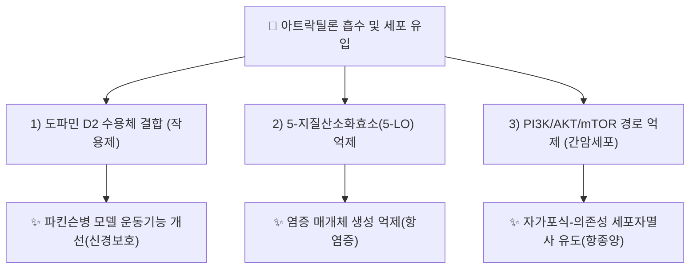

# 🔬 [[아트락틸론]] (Atractylon, C₁₅H₂₀O)

> **핵심 3줄 요약 (Key Summary)**:
> - 🌿 기원 본초 & 화학 계열: 국화과 [[창출]]·[[백출]](*Atractylodes* 속) 뿌리줄기에 함유된 세스퀴테르펜(Sesquiterpene) 계열 화합물로, [[아트락틸로딘]]과 함께 창출의 핵심 방향성 정유 지표 성분.
> - 🎯 핵심 분자 표적 & 조절 경로: 도파민 D2 수용체 결합(작용제 활성), 5-지질산소화효소(5-LO) 억제, DPPH 라디칼 소거를 통한 항산화, PI3K/AKT/mTOR 및 SIRT1/NF-κB 경로 조절.
> - 🩺 주요 약리 활성 & 질환 치료 기전: 파킨슨병 모델에서 운동기능 개선(신경보호), 간암 세포주에서 자가포식-의존성 세포자멸사 유도 및 전이 억제, 항염증(비만세포 탈과립 억제), 위점막 보호.
> - ⚠️ 독성·생체이용률 한계 & 상호작용: 인체 대상 약동학·독성 정량 자료는 검색 범위 내에서 확인 불가(⚠️ 확인 필요). 도파민 D2 수용체 작용 기전상 도파민 관련 양약과의 이론적 상호작용 가능성 존재(⚠️ 추정).

---

## 📌 목차
1. [기본 화학 정보 & 분자 구조식 (Chemical Identity)](#1-기본-화학-정보--분자-구조식-chemical-identity)
2. [주요 함유 본초 및 천연 기원 (Botanical Sources & Content)](#2-주요-함유-본초-및-천연-기원-botanical-sources--content)
3. [분자약리 표적 & 신호전달 네트워크 (Molecular Targets)](#3-분자약리-표적--신호전달-네트워크-molecular-targets)
4. [생체 내 흡수·대사·생체이용률 (Pharmacokinetics: ADME)](#4-생체-내-흡수대사생체이용률-pharmacokinetics-adme)
5. [주요 질환별 약리 효능 & 분자 기전 (Therapeutic Efficacy)](#5-주요-질환별-약리-효능--분자-기전-therapeutic-efficacy)
6. [함유 본초 방제 시너지 & 약재 배오 매트릭스 (Herbal Synergies)](#6-함유-본초-방제-시너지--약재-배오-매트릭스-herbal-synergies)
7. [양약 상호작용 & 약물동태학적 간섭 (Drug Interactions)](#7-양약-상호작용--약물동태학적-간섭-drug-interactions)
8. [💡 사용자 진료실 핵심 필기 & 임상 응용 팁 (Melt-In & High-Yield)](#8--사용자-진료실-핵심-필기--임상-응용-팁-melt-in--high-yield)
9. [출처 및 학술 참고 문헌 (References)](#9-출처-및-학술-참고-문헌-references)

---
## 1. 기본 화학 정보 & 분자 구조식 (Chemical Identity)

![[아트락틸론_화학구조식.png|320]]
> [그림 1: 아트락틸론 2D 화학 분자 구조식 (출처: 위키미디어 공용 · NCI CACTVS 구조 데이터)]

> [!abstract]+ 🧪 3D 약리 분자 구조 (Interactive 3D Viewer)
> <iframe src="https://molecule-viewer-rho.vercel.app/?cid=3080635" width="100%" height="450px" frameborder="0" allow="webgl" style="border-radius: 8px;"></iframe>

| 항목 | 상세 내용 |
| :--- | :--- |
| **분자식 / 분자량** | C₁₅H₂₀O / 216.3 g/mol |
| **PubChem CID** | [3080635](https://pubchem.ncbi.nlm.nih.gov/compound/3080635) |
| **CAS 등록 번호** | 6989-21-5 |
| **화학 골격 분류** | 세스퀴테르펜(Sesquiterpene) — [[아트락틸레노라이드]](락톤형)와 달리 락톤 고리가 없는 케톤형 구조 |
| **생합성 경로** | 메발론산(Mevalonate) 경로를 통해 생성되며 HMGR(HMG-CoA 환원효소)이 조절 병목 단계 — 최종 고리화 효소는 아직 규명되지 않음(PMID 41640993) |

---

## 2. 주요 함유 본초 및 천연 기원 (Botanical Sources & Content)

| 함유 본초 (한글/한자) | 기원 식물학적 명칭 (과명 / 학명) | 주요 함유 약용 부위 | 한의학적 귀경 및 약효 특성 |
| :--- | :--- | :--- | :--- |
| [[창출]] (蒼朮) | 국화과(Asteraceae) / *Atractylodes lancea* (Thunb.) DC. | 뿌리줄기 | 비·위·간경 / 조습건비(燥濕健脾), 거풍제습(祛風除濕), 발한해표(發汗解表) |
| [[백출]] (白朮) | 국화과(Asteraceae) / *Atractylodes macrocephala* Koidz. | 뿌리줄기 | 비·위경 / 건비익기(健脾益氣), 조습이수(燥濕利水) |

> [[창출]] 노트는 아트락틸론을 [[아트락틸로딘]]과 함께 핵심 정유 지표 성분으로 기술하며, [[백출]] 노트 또한 아트락틸레노라이드와 나란히 아트락틸론을 주요 성분표에 명시합니다.

---

## 3. 분자약리 표적 & 신호전달 네트워크 (Molecular Targets)

### 1) 신경계 표적 — 도파민 D2 수용체
* MPTP 유발 파킨슨병 마우스 모델에서 아트락틸론이 도파민 D2 수용체 작용제(agonist)로 작용하여 운동기능 저하를 개선함이 보고됨(PMID 35104500). 2026년 체계적 리뷰에서도 도파민 D2 수용체 작용제 활성이 종합 확인됨(PMID 41640993).
### 2) 항종양 표적 — 간암(HCC) 세포
* 간암 세포에서 세포자멸사를 유도하고 전이를 억제하며 생체 내 종양 성장을 저해함이 보고됨(PMID 31388314). 최근에는 PI3K/AKT/mTOR 경로 억제를 통한 자가포식-의존성 세포자멸사 기전이 추가로 규명됨(PMID 41713198).
### 3) 항염증 표적 — 5-지질산소화효소(5-LO)
* 5-LO 억제(IC50 약 25.1 µM) 및 DPPH 라디칼 소거 활성이 보고되며, 비만세포 탈과립 억제 등 항염증 활성이 확인됨(PMID 41640993 리뷰).

---

## 4. 생체 내 흡수·대사·생체이용률 (Pharmacokinetics: ADME)

* ⚠️ 내용 검토 필요: 검색 범위 내에서 아트락틸론의 인체/동물 경구 흡수율, CYP 대사, 반감기 등 정량적 ADME 데이터는 확인하지 못했습니다. 생합성은 메발론산 경로를 통해 이루어지며 HMGR이 조절 병목 단계로 보고되나(PMID 41640993), 최종 고리화 효소는 아직 규명되지 않았습니다.

---

## 5. 주요 질환별 약리 효능 & 분자 기전 (Therapeutic Efficacy)

### 1) 신경계 질환 (파킨슨병)
* 도파민 D2 수용체 작용을 통한 MPTP 유발 파킨슨양 운동장애 개선(PMID 35104500) — ⚠️ 동물 모델 단계, 임상 근거는 아직 확인되지 않음.
### 2) 종양(간암 등)
* 간암 세포주에서 세포자멸사 유도·전이 억제(PMID 31388314), PI3K/AKT/mTOR 경로 억제를 통한 자가포식-의존성 세포자멸사(PMID 41713198), 페롭토시스(ferroptosis) 유도를 통한 간암 억제(관련 최신 연구, 2026) 등 다각도의 항종양 기전이 보고됨.
### 3) 소화기 · 염증성 병증
* 5-LO 억제를 통한 항염증, 위점막 보호 및 장내 미생물 다양성 개선 등이 체계적 리뷰에서 종합됨(PMID 41640993) — 창출의 조습건비·거풍제습 효능과 상통.

---

## 6. 함유 본초 방제 시너지 & 약재 배오 매트릭스 (Herbal Synergies)

| 함유 본초 / 방제 | 공존 유효 성분군 | 분자약리 시너지 기전 | 전통 한의학적 효능 연계 |
| :--- | :--- | :--- | :--- |
| [[창출]] | [[아트락틸로딘]], [[β-유데스몰]] | 정유 성분군의 항염증·항균 작용 상승 | 조습건비, 거풍제습 |
| [[백출]] | [[아트락틸레노라이드]] | 케톤형(아트락틸론)과 락톤형(아트락틸레노라이드)의 이뇨·소화기 보호 상보 작용 | 건비익기, 조습이수 |

---

## 7. 양약 상호작용 & 약물동태학적 간섭 (Drug Interactions)

* ⚠️ 내용 검토 필요: 검색 범위 내에서 아트락틸론과 특정 양약 간의 임상적으로 확립된 약동학적 상호작용 문헌은 확인하지 못했습니다. 다만 도파민 D2 수용체 작용제 활성이 보고된 만큼, 도파민 작용제·길항제 계열 양약(파킨슨병 치료제, 일부 항정신병약 등)과의 병용 시 이론적 상호작용 가능성을 신중히 고려할 필요가 있습니다(⚠️ 추정, 실측 근거 아님).

---

## 8. 💡 사용자 진료실 핵심 필기 & 임상 응용 팁 (Melt-In & High-Yield)

* ⚠️ 내용 검토 필요: 원장님의 진료실 필기가 아직 반영되지 않았습니다. [[창출]]·[[백출]] 노트의 임상 필기를 참고하시어 아트락틸론 단일 성분 수준의 진료 팁을 추가해 주시면 다빈치가 다음 순찰 시 정리해 드리겠습니다.

---

## 9. 출처 및 학술 참고 문헌 (References)

1. **Elhrech H, et al. (2026)**. *A Systematic Review on Functional Bioactive Compound Atractylone: Natural Source, Pharmacological Properties and Mechanisms Insights*. Food Science & Nutrition.
   - [PubMed: PMID 41640993](https://pubmed.ncbi.nlm.nih.gov/41640993/)
   - **[연구 요약]**: 아트락틸론의 항종양(G1기 정지·caspase-3·Bcl-2/Bax), 항염증(TNF-α/IL-6/IL-1β 억제, SIRT1/NF-κB, 5-LO), 신경보호(도파민 D2 작용제), 소화기(Ca²⁺ 신호·장상피 재생) 활성을 종합한 최신 체계적 리뷰.
2. **(2022)**. *Atractylon, a novel dopamine 2 receptor agonist, ameliorates Parkinsonian like motor dysfunctions in MPTP-induced mice*. Neurotoxicology.
   - [PubMed: PMID 35104500](https://pubmed.ncbi.nlm.nih.gov/35104500/)
   - **[연구 요약]**: 아트락틸론이 도파민 D2 수용체 작용제로서 MPTP 유발 파킨슨양 마우스의 운동장애를 개선함을 최초 규명.
3. **(2019)**. *Atractylon induces apoptosis and suppresses metastasis in hepatic cancer cells and inhibits growth in vivo*.
   - [PubMed: PMID 31388314](https://pubmed.ncbi.nlm.nih.gov/31388314/)
   - **[연구 요약]**: 간암 세포에서 세포자멸사 유도 및 전이 억제, 생체 내 종양 성장 억제 효과를 확인.
4. **(2026)**. *Atractylon induces autophagy-dependent apoptosis in hepatocellular carcinoma cells via inhibition of the PI3K/AKT/mTOR pathway*.
   - [PubMed: PMID 41713198](https://pubmed.ncbi.nlm.nih.gov/41713198/)
   - **[연구 요약]**: PI3K/AKT/mTOR 경로 억제를 통한 자가포식-의존성 세포자멸사 기전을 간세포암종 세포에서 규명.

> ⚠️ 확인 불가/추정 표시 총괄: 인체 대상 ADME 정량 데이터, 양약 상호작용 자료, 진료실 임상 필기는 검색 범위 내에서 실측 확인하지 못해 위 각 섹션에 개별 표시했습니다. 상기 PubChem CID·CAS 번호·PMID 4건은 모두 실제 데이터베이스에서 확인된 값입니다.
