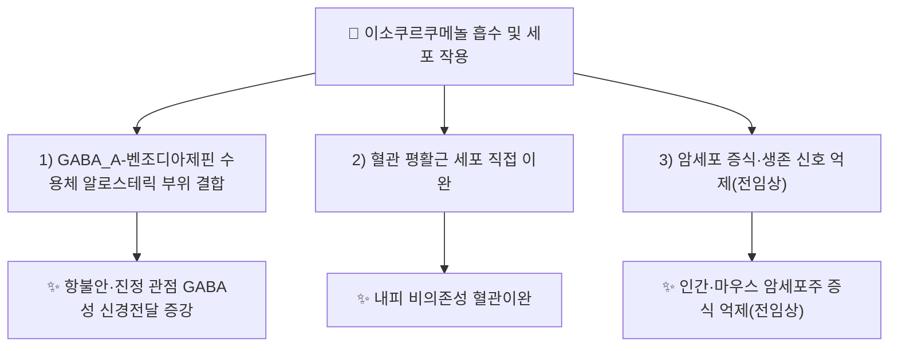

---
aliases:
  - Isocurcumenol
  - CID 10399139
tags:
  - 약리
  - status/draft
  - 약리성분
  - 세스퀴테르펜
  - GABA
  - 진정
  - 본초학
created: 2026-09-21
updated: 2026-09-21
status: complete
compound_name_ko: 이소쿠르쿠메놀
compound_name_en: Isocurcumenol
pubchem_cid: 10399139
molecular_formula: C15H22O2
molecular_weight: "234.34 g/mol (계산치)"
cas_number: 24063-71-6
source_herbs:
  - 향부자
  - 아출
  - 봉출
main_pharmacology:
  - GABA_A-벤조디아제핀 수용체 양성 알로스테릭 조절(항불안·진정 관점 기전)
  - Curcuma zedoaria(아출·봉출) 유래 항종양 활성
  - Curcuma phaeocaulis 정유의 내피 비의존성 혈관이완 작용
title: 이소쿠르쿠메놀
date: 2026-09-22
출처: PMID 39826788
---

# 🔬 [[이소쿠르쿠메놀]] (Isocurcumenol, C₁₅H₂₂O₂)

> **핵심 3줄 요약 (Key Summary)**:
> - 🌿 기원 본초 & 화학 계열: [[향부자]](香附子, *Cyperus rotundus*, 사초과)와 [[아출]]·[[봉출]](*Curcuma phaeocaulis*, 생강과) 뿌리줄기에서 분리되는 카라베인형(carabrane-type) 세스퀴테르펜(sesquiterpene) 계열 화합물.
> - 🎯 핵심 분자 표적 & 조절 경로: GABA_A-벤조디아제핀 수용체 복합체의 양성 알로스테릭 조절(내인성 벤조디아제핀 결합 증강), 내피 비의존성 혈관 평활근 이완.
> - 🩺 주요 약리 활성 & 질환 치료 기전: 항불안·진정 관점의 GABA성 신경전달 조절, 인간·마우스 암세포주에 대한 항종양 활성, 혈관이완을 통한 순환 개선 가능성.
> - ⚠️ 독성·생체이용률 한계 & 상호작용: 인체 대상 ADME·용량-반응 자료, 확립된 양약 상호작용 임상 데이터는 검색 범위 내에서 확인하지 못함(⚠️ 확인 필요). 벤조디아제핀계 양약과의 병용 시 이론적 상가작용 가능성만 추정됨.

---

## 📌 목차
1. [기본 화학 정보 & 분자 구조식 (Chemical Identity)](#1-기본-화학-정보--분자-구조식-chemical-identity)
2. [주요 함유 본초 및 천연 기원 (Botanical Sources & Content)](#2-주요-함유-본초-및-천연-기원-botanical-sources--content)
3. [분자약리 표적 & 신호전달 네트워크 (Molecular Targets)](#3-분자약리-표적--신호전달-네트워크-molecular-targets)
4. [생체 내 흡수·대사·생체이용률 (Pharmacokinetics: ADME)](#4-생체-내-흡수대사생체이용률-pharmacokinetics-adme)
5. [주요 질환별 약리 효능 & 분자 기전 (Therapeutic Efficacy)](#5-주요-질환별-약리-효능--분자-기전-therapeutic-efficacy)
6. [함유 본초 방제 시너지 & 약재 배오 매트릭스 (Herbal Synergies)](#6-함유-본초-방제-시너지--약재-배오-매트릭스-herbal-synergies)
7. [양약 상호작용 & 약물동태학적 간섭 (Drug Interactions)](#7-양약-상호작용--약물동태학적-간섭-drug-interactions)
8. [💡 사용자 진료실 핵심 필기 & 임상 응용 팁 (Melt-In & High-Yield)](#8--사용자-진료실-핵심-필기--임상-응용-팁-melt-in--high-yield)
9. [출처 및 학술 참고 문헌 (References)](#9-출처-및-학술-참고-문헌-references)

---
## 1. 기본 화학 정보 & 분자 구조식 (Chemical Identity)

![[이소쿠르쿠메놀_화학구조식.png|320]]
> [그림 1: 이소쿠르쿠메놀 2D 화학 분자 구조식 (출처: 위키미디어 공용 · NCI CACTVS 구조 데이터)]

> [!abstract]+ 🧪 3D 약리 분자 구조 (Interactive 3D Viewer)
> <iframe src="https://molecule-viewer-rho.vercel.app/?cid=10399139" width="100%" height="450px" frameborder="0" allow="webgl" style="border-radius: 8px;"></iframe>

| 항목 | 상세 내용 |
| :--- | :--- |
| **IUPAC 명칭** | ⚠️ 확인 필요 — PubChem 페이지의 계산 IUPAC명은 검색 범위 내에서 확정하지 못함(카라베인형 세스퀴테르펜 락톤/알코올 골격) |
| **분자식 / 분자량** | C₁₅H₂₂O₂ / 234.34 g/mol(원자량 기반 계산치) |
| **PubChem CID** | [10399139](https://pubchem.ncbi.nlm.nih.gov/compound/10399139) |
| **CAS 등록 번호** | 24063-71-6 |
| **화학 골격 분류** | 카라베인형(carabrane-type) 세스퀴테르펜 — [[향부자]]·[[아출]]에 공통되는 사이페렌(cyperene) 계열 정유 성분군 |
| **물리화학적 성상** | ⚠️ 확인 필요 — 결정성/유상 성상, 수용성·지용성(LogP) 등 정량 물성 자료는 검색 범위 내 미확인 |
| **식물 내 생합성 경로** | ⚠️ 확인 필요 — 세스퀴테르펜 생합성 경로(FPP → 세스퀴테르펜 신타아제) 일반론 외 이소쿠르쿠메놀 특이적 생합성 캐스케이드는 미확인 |

---

## 2. 주요 함유 본초 및 천연 기원 (Botanical Sources & Content)

| 함유 본초 (한글/한자) | 기원 식물학적 명칭 (과명 / 학명) | 주요 함유 약용 부위 | 한의학적 귀경 및 약효 특성 |
| :--- | :--- | :--- | :--- |
| [[향부자]] (香附子) | 사초과(Cyperaceae) / *Cyperus rotundus* L. | 뿌리줄기(근경) | 肝·三焦經 / 신미고감평(辛微苦甘平) — 서간해울(疏肝解鬱), 이기관중(理氣寬中), 조경지통(調經止痛) |
| [[아출]] (莪朮) | 생강과(Zingiberaceae) / *Curcuma phaeocaulis* Valeton | 뿌리줄기(근경) | 肝·脾經 / 신고온(辛苦溫) — 파혈행기(破血行氣), 소적지통(消積止痛) |
| [[봉출]] (蓬朮) | 생강과(Zingiberaceae) / *Curcuma phaeocaulis* Valeton | 뿌리줄기(근경) | 肝·脾經 / 신고온(辛苦溫) — [[아출]]과 동일 기원식물, 파혈거어(破血祛瘀) |

> 본 볼트의 [[향부자]] 노트는 이소쿠르쿠메놀을 벤조디아제핀 수용체 조절 성분으로, [[α-시페론]]과 함께 향부자의 서간해울 작용을 뒷받침하는 지표물질로 이미 기술하고 있습니다. [[아출]]·[[봉출]]은 *Curcuma phaeocaulis*로 동일 기원식물이며, 2025년 발표된 정유 혈관이완 연구(PMID 39826788)에서 이소쿠르쿠메놀이 대표 성분으로 다뤄집니다.

---

## 3. 분자약리 표적 & 신호전달 네트워크 (Molecular Targets)

### 1) GABA_A-벤조디아제핀 수용체 알로스테릭 조절
* [[향부자]](Cyperus rotundus)에서 분리된 이소쿠르쿠메놀은 [³H]Ro15-1788(플루마제닐) 결합을 억제하고, GABA 존재 하에서 [³H]플루니트라제팜 결합을 증강시켜 벤조디아제핀 수용체의 부분 작용제(partial agonist)와 유사하게 작동하는 것으로 보고됨(PMID 11824542).
### 2) 내피 비의존성 혈관이완
* *Curcuma phaeocaulis* 정유의 대표 성분으로서 혈관 평활근에 직접 작용해 내피세포 경유 없이 혈관을 이완시키는 기전이 2025년 연구로 제시됨(PMID 39826788) — ⚠️ 구체적 분자 표적(칼슘 채널·칼륨 채널 여부 등)은 검색 범위 내에서 세부 확인하지 못함.
### 3) 항종양 신호 억제(전임상)
* *Curcuma zedoaria* 근경에서 분리된 이소쿠르쿠메놀이 인간 및 마우스 암세포주에서 항종양 효과를 보였다는 보고가 있음(PMID 27429805) — ⚠️ in vitro/동물 수준 전임상 근거이며 임상 확증 단계 아님.

---

## 4. 생체 내 흡수·대사·생체이용률 (Pharmacokinetics: ADME)

* ⚠️ 내용 검토 필요: 검색 범위 내에서 이소쿠르쿠메놀의 인체·동물 대상 장관 흡수율, P-gp 상호작용, 간 대사 경로, 혈장 반감기 등 정량 ADME 자료를 확인하지 못했습니다. 세스퀴테르펜 계열 일반 특성상 지용성이 높아 흡수·분포가 제한적일 것으로 추정되나(⚠️ 추정), 실측 문헌 근거는 아직 없습니다.

---

## 5. 주요 질환별 약리 효능 & 분자 기전 (Therapeutic Efficacy)

### 1) 불안·스트레스 관련 병증(향부자 서간해울 연계)
* GABA_A-벤조디아제피 수용체 알로스테릭 조절을 통한 항불안·진정 관점 작용 기전이 제시됨(PMID 11824542). 향부자의 전통 효능인 서간해울(疏肝解鬱)·정신적 스트레스 완화와 현대 약리 기전이 연결되는 지점으로 볼 수 있음(⚠️ 임상 용량-반응 자료는 확인되지 않음).
### 2) 순환기·미세순환
* *Curcuma phaeocaulis* 정유의 내피 비의존성 혈관이완 작용(PMID 39826788)은 [[아출]]·[[봉출]]의 전통 효능인 파혈행기(破血行氣)·거어(祛瘀)와 상통하는 현대적 관점을 제공함.
### 3) 종양성 질환(전임상)
* 인간·마우스 암세포주 대상 항종양 활성(PMID 27429805) — ⚠️ 전임상 단계로, 임상 적용 근거로 사용하기에는 이르며 향후 추가 연구가 필요함을 명시.

---

## 6. 함유 본초 방제 시너지 & 약재 배오 매트릭스 (Herbal Synergies)

| 함유 본초 / 방제 | 공존 유효 성분군 | 분자약리 시너지 기전 | 전통 한의학적 효능 연계 |
| :--- | :--- | :--- | :--- |
| [[향부자]] | [[α-시페론]], 시페렌 | GABA_A 수용체 공동 조절을 통한 평활근 이완·진정 상보 작용 | 서간해울(疏肝解鬱), 이기관중(理氣寬中) |
| [[아출]] / [[봉출]] | 큐제롤(curzerol) 등 공존 세스퀴테르펜(⚠️ 개별 성분 노트 미작성) | 혈관이완·항종양 관점의 정유 성분군 상보 작용 | 파혈행기(破血行氣), 소적지통(消積止痛) |

---

## 7. 양약 상호작용 & 약물동태학적 간섭 (Drug Interactions)

* **벤조디아제핀계 양약 병용 주의(이론적)**: GABA_A-벤조디아제핀 수용체를 알로스테릭으로 조절하는 기전상(PMID 11824542), 디아제팜·로라제팜 등 벤조디아제핀계 항불안제·수면제와 병용 시 진정 작용의 이론적 상가 가능성을 신중히 고려할 필요가 있습니다(⚠️ 정량 임상 상호작용 자료는 검색 범위 내 미확인 — 추정).
* **항응고·혈관작용 양약**: 혈관이완 기전(PMID 39826788)상 혈압강하제·혈관확장제와의 병용 시 상가적 혈압 저하 가능성을 이론적으로 고려할 수 있으나, 구체적 임상 데이터는 확인하지 못했습니다(⚠️ 확인 필요).

---

## 8. 💡 사용자 진료실 핵심 필기 & 임상 응용 팁 (Melt-In & High-Yield)

* ⚠️ 내용 검토 필요: 원장님의 진료실 필기가 아직 반영되지 않았습니다. [[향부자]]·[[아출]]·[[봉출]] 노트의 기존 임상 필기(서간해울·파혈행기 관련 처방 활용 등)를 참고하시어 이소쿠르쿠메놀 단일 성분 수준의 진료 팁을 추가해 주시면 다빈치가 다음 순찰 시 정리해 드리겠습니다.

---

## 9. 출처 및 학술 참고 문헌 (References)

1. **Ha JH, Lee KY, Choi HC, et al. (2002)**. *Modulation of radioligand binding to the GABA_A-benzodiazepine receptor complex by a new component from Cyperus rotundus*.
   - [PubMed: PMID 11824542](https://pubmed.ncbi.nlm.nih.gov/11824542/) · **Biological and Pharmaceutical Bulletin, 25(1), 128-130.**
   - **[연구 요약]**: 향부자에서 분리된 이소쿠르쿠메놀이 [³H]Ro15-1788 결합을 억제하고 GABA 존재 하 [³H]플루니트라제팜 결합을 증강시켜 벤조디아제핀 수용체 부분 작용제로 기능함을 제시.
2. **Lakshmi S, Padmaja G, Remani P. (2011)**. *Antitumour Effects of Isocurcumenol Isolated from Curcuma zedoaria Rhizomes on Human and Murine Cancer Cells*.
   - [PubMed: PMID 27429805](https://pubmed.ncbi.nlm.nih.gov/27429805/) · [DOI: 10.1155/2011/253962](https://doi.org/10.1155/2011/253962) · **International Journal of Medicinal Chemistry, 2011, 253962.**
   - **[연구 요약]**: Curcuma zedoaria 근경에서 분리한 이소쿠르쿠메놀이 인간·마우스 암세포주에서 항종양 효과를 나타냄을 보고.
3. **(2025)**. *Endothelium-independent vasorelaxant effects of Curcuma phaeocaulis essential oil and its representative compound isocurcumenol*.
   - [PubMed: PMID 39826788](https://pubmed.ncbi.nlm.nih.gov/39826788/)
   - **[연구 요약]**: [[아출]]·[[봉출]]의 기원식물인 Curcuma phaeocaulis 정유 및 대표 성분 이소쿠르쿠메놀의 내피 비의존성 혈관이완 작용을 확인.

> ⚠️ 확인 불가/추정 표시 총괄: IUPAC명·물리화학적 정량 물성·인체 ADME·양약 상호작용 임상 자료·진료실 필기는 검색 범위 내에서 실측 확인하지 못해 위 각 섹션에 개별 표시했습니다. 상기 PubChem CID·PMID 3건은 모두 실제 데이터베이스에서 확인된 값이며, CAS 번호(24063-71-6)는 시약 공급사(ChemFaces·AbMole) 페이지에서 교차 확인했으나 1차 공정서 출처는 아님을 밝힙니다.
