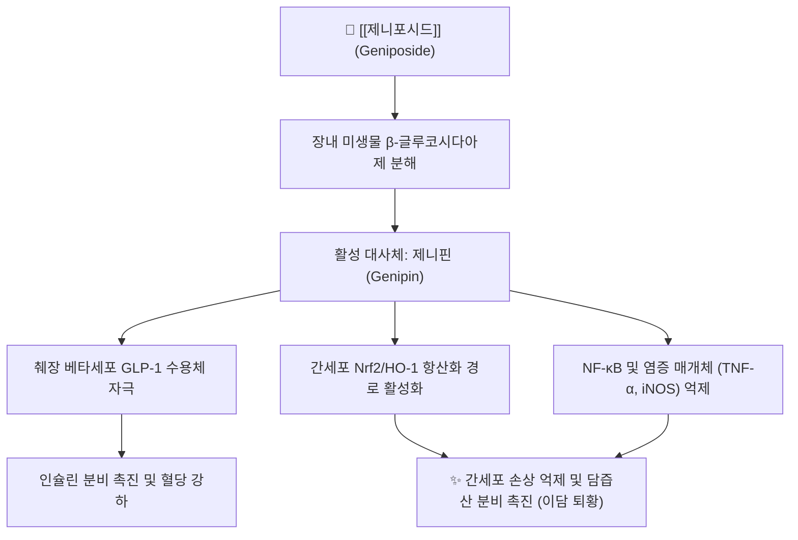

# 🔬 [[제니포시드]] (Geniposide, C₁₇H₂₄O₁₀)

> **핵심 3줄 요약 (Key Summary)**:
> - 🌿 기원 본초 & 화학 계열: 꼭두서니과 식물인 [[치자]] 및 [[두충]]의 건조 성숙 과실에 다량 함유된 대표적 이리도이드 배당체 — 꼭두서니과(Rubiaceae) [[치자]](*Gardenia jasminoides*)의 성숙 과실에 풍부하게 함유된 대표적인 천연 이리도이드 배당체(Iridoid glycoside) 화합물.
> - 🎯 핵심 분자 표적 & 조절 경로: 장내 미생물에 의해 활성 아글리콘인 제니핀으로 전환되어 GLP-1 수용체 자극 및 Nrf2 항산화 촉진 — 장내 미생물에 의해 활성 아글리콘인 제니핀(Genipin)으로 전환되어 GLP-1 수용체 활성화, 담즙 분비 촉진, UCP2 억제 및 NF-κB 차단 항염증·간보호 작용 발휘.
> - 🩺 주요 약리 활성 & 질환 치료 기전: 간세포 보호, 이담(담즙 분비 촉진), 인슐린 분비능 개선, 항염증 및 급성 황달 치료 지표 — 급성 황달형 간염, 담낭염, 고혈압, 흉협 번열(가슴 답답함), 불면증 및 위산과다를 치료하는 [[치자]]의 핵심 약리 지표 성분.
> - ⚠️ 독성·생체이용률 한계 & 상호작용: 경구 복용 시 상부 소화관에서 거의 흡수되지 않고 장내 세균에 의해 제니핀으로 전환된 뒤 흡수됨(§4). 치자 과량 복용 시 복통·설사 가능(§4), 최근 독성 연구 보고가 있음(Shan 2017 리뷰). 양약 상호작용 실측 자료는 이 노트에서 확인하지 못함(§7).

---

## 📌 목차
1. [기본 화학 정보 & 분자 구조식 (Chemical Identity)](#1-기본-화학-정보--분자-구조식-chemical-identity)
2. [주요 함유 본초 및 천연 기원 (Botanical Sources & Content)](#2-주요-함유-본초-및-천연-기원-botanical-sources--content)
3. [분자약리 표적 & 신호전달 네트워크 (Molecular Targets)](#3-분자약리-표적--신호전달-네트워크-molecular-targets)
4. [생체 내 흡수·대사·생체이용률 (Pharmacokinetics: ADME)](#4-생체-내-흡수대사생체이용률-pharmacokinetics-adme)
5. [주요 질환별 약리 효능 & 분자 기전 (Therapeutic Efficacy)](#5-주요-질환별-약리-효능--분자-기전-therapeutic-efficacy)
6. [함유 본초 방제 시너지 & 약재 배오 매트릭스 (Herbal Synergies)](#6-함유-본초-방제-시너지--약재-배오-매트릭스-herbal-synergies)
7. [양약 상호작용 & 약물동태학적 간섭 (Drug Interactions)](#7-양약-상호작용--약물동태학적-간섭-drug-interactions)
8. [💡 사용자 진료실 핵심 필기 & 임상 응용 팁 (Melt-In & High-Yield)](#8--사용자-진료실-핵심-필기--임상-응용-팁-melt-in--high-yield)
9. [출처 및 학술 참고 문헌 (References)](#9-출처-및-학술-참고-문헌-references)

---
## 1. 기본 화학 정보 & 분자 구조식 (Chemical Identity)

> [!abstract]+ 🧪 3D 약리 분자 구조 (Interactive 3D Viewer)
> <iframe src="https://molecule-viewer-rho.vercel.app/?cid=107848" style="width: 100%; height: 600px; border: none; border-radius: 12px; box-shadow: 0 4px 20px rgba(0,0,0,0.15);" allowfullscreen></iframe>

| 항목 | 상세 내용 |
| :--- | :--- |
| **성분명** | [[제니포시드]] (Geniposide, 게니포사이드) |
| **IUPAC 명칭** | methyl (1S,4aS,7aS)-1-(β-D-glucopyranosyloxy)-7-(hydroxymethyl)-1,4a,5,7a-tetrahydrocyclopenta[c]pyran-4-carboxylate |
| **화학식** | $C_{17}H_{24}O_{10}$ |
| **분자량** | 388.37 g/mol |
| **PubChem CID** | [107848](https://pubchem.ncbi.nlm.nih.gov/compound/107848) (2026-09-23 실측: Geniposide, C17H24O10, 388.4) |
| **CAS 번호** | 24512-63-8 (PubChem 동의어 목록에서 확인) |
| **화합물 분류** | 이리도이드 배당체 (Iridoid Glucoside) |
| **지표 본초** | [[치자]](*Gardenia jasminoides* J.Ellis), [[두충]](*Eucommia ulmoides*) |
| **주요 천연 기원** | [[치자]](梔子, KP 규격 $\ge 3.0\%$) |
| **활성 대사체** | **제니핀 (Genipin)** — 장내 $\beta$-글루코시다아제에 의해 당이 제거되어 활성화 (볼트 노트: [[게니핀]]) |

---

## 2. 주요 함유 본초 및 천연 기원 (Botanical Sources & Content)

| 함유 본초 (한글/한자) | 기원 식물학적 명칭 (과명 / 학명) | 주요 함유 약용 부위 | 지표 함량 (%) | 한의학적 귀경 및 약효 특성 |
| :--- | :--- | :--- | :--- | :--- |
| [[치자]] (梔子) | 꼭두서니과(Rubiaceae) / *Gardenia jasminoides* J.Ellis | 성숙 과실 | KP 규격 $\ge 3.0\%$ | 삼초경·심·폐·위경 / 사화제번, 청열이습, 양혈해독 |
| [[산치자]] (山梔子) | 원문에 기재 없음 | 원문에 기재 없음 | KP 규격 $\ge 3.0\%$ (볼트 산치자 노트 기재) | 원문에 기재 없음 |
| [[두충]] (杜仲) | 두충과 / *Eucommia ulmoides* | 원문에 기재 없음 | 원문에 기재 없음 | 원문에 기재 없음 |

* 볼트 교차 확인(2026-09-23): [[치자]]·[[산치자]] 노트는 제니포사이드를 KP $\ge 3.0\%$ 핵심 지표 성분으로, [[두충]] 노트는 피노레시놀 디글루코사이드·클로로겐산과 함께 핵심 유효 성분으로 기재합니다.
* ⚠️ 핵심 요약 첫 줄의 "꼭두서니과 식물인 치자 및 두충의 건조 성숙 과실" 표현은 원문 그대로 두었으나, 두충은 꼭두서니과가 아니며 약용 부위도 과실이 아닌 수피입니다. 확인 후 수정 필요.
* Shan 2017 리뷰(§9-3): 제니포시드는 꼭두서니과를 중심으로 약 40종의 식물에 존재합니다.

---

## 3. 분자약리 표적 & 신호전달 네트워크 (Molecular Targets)

### 1) 간세포 보호 및 담즙 분비(利膽) 촉진
* 간세포 내 담즙산 수송체(BSEP, MRP2)의 발현을 상향 조절하여 담즙 울체를 해소하고, 사염화탄소($\text{CCl}_4$)나 알코올로 유도된 간세포 괴사를 억제함.
* **담즙산 분비 촉진 및 황달 해소 (Choleretic & Hepatoprotective)** (병합분):
  * 간세포의 담즙염 수출 펌프(BSEP) 및 MRP2 수송체 발현을 상향 조절하여 결합형 [[빌리루빈]]과 담즙산의 배출을 극대화합니다.
  * 혈중 빌리루빈 수치를 신속히 낮추어 급성 간염에 동반되는 전신 황달과 소양감을 치료합니다.

### 2) GLP-1 분비 촉진 및 인슐린 저항성 개선
* 췌장 $\beta$-세포의 GLP-1 수용체를 자극하여 포도당 반응성 인슐린 분비를 촉진하고, 미세아교세포 활성화를 억제하여 뇌신경 세포를 보호함.
* 병합분:
  * 장 L-세포의 수용체를 자극하여 **GLP-1(Glucagon-like peptide-1)** 분비를 촉진함으로써 췌장 인슐린 분비를 유도하고 혈당 스파이크를 완화합니다.
  * UCP2(Uncoupling protein 2)를 억제하여 췌장 베타세포의 ATP 합성을 정상화합니다.

### 3) 중추신경계 진정 및 해열·진통 (병합분)
* 뇌 시상하부 체온 조절 중추의 열전달을 억제하고 혈관 내피세포의 ICAM-1 발현을 차단하여 흉격의 번열감과 불면증을 개선합니다.

---

## 4. 생체 내 흡수·대사·생체이용률 (Pharmacokinetics: ADME)

### 장내 대사 및 활성 대사체 제니핀(Genipin) 생성
* 경구 복용된 제니포시드는 소화관 상부에서 거의 흡수되지 않고 대장에 도달하여 장내 세균총의 $\beta$-glucosidase에 의해 당이 분리되어 지용성인 제니핀(Genipin)으로 전환된 후 신속히 흡수되어 전신 약리 효과를 나타냄.

### 안전성 및 대사 경로
* **다량 복용 시 사하 작용**: 활성체인 제니핀이 장관 연동 운동을 자극하므로, 치자 과량 복용 시 복통과 설사가 유발될 수 있음.
* Shan 2017 리뷰(§9-3)는 최근 제니포시드의 독성에 관한 연구 보고가 있다고 언급합니다. 구체적 독성 용량은 이 노트에 아직 옮기지 않았습니다. ⚠️ 내용 보강 필요

---

## 5. 주요 질환별 약리 효능 & 분자 기전 (Therapeutic Efficacy)

### 1) 대사 증후군 및 신경염증 억제
* 기전은 §3-2) 참고.
### 2) 비알코올성 지방간(NAFLD) 개선
* 간 내 지질 과산화를 억제하고 AMPK 활성화를 통해 지방간 진행을 억제함.
### 3) 항혈전 및 혈관내피 보호
* 혈소판 응집을 완만하게 억제하고 혈관 평활근 증식을 차단함.
### 4) 급성 황달형 간염·담낭염
* 기전은 §3-1) 참고.

---

## 6. 함유 본초 방제 시너지 & 약재 배오 매트릭스 (Herbal Synergies)

### 1) 핵심 기원 본초: [[치자]]
* [[치자]]는 한의학에서 삼초(三焦)의 화열을 끄고 습열을 소변으로 배출시키는 청열사화·청열이습의 대표 요약임.
* 제니포시드는 치자의 청열이담(淸熱利膽), 사화해독 및 지혈 효능을 대변하는 핵심 지표 성분(KP 규격 $\ge 3.0\%$)임.
* **본초학적 매핑** (병합분):
  * [[치자]](梔子): 쓴맛과 차가운 성질(苦, 寒). 삼초경·심·폐·위경으로 귀경. 사화제번(瀉火除煩), 청열이습(淸熱利濕), 양혈해독(涼血解毒).
  * 제니포사이드는 치자의 "가슴속이 답답하여 잠을 못 이루는 번열(煩熱)을 끄고, 삼초의 습열을 소변으로 빼내어 황달을 치료하는" 핵심 분자 실체입니다.

### 2) 주요 배오 처방

| 함유 본초 / 방제 | 공존 유효 성분군 | 분자약리 시너지 기전 | 전통 한의학적 효능 연계 |
| :--- | :--- | :--- | :--- |
| [[인진호탕]] | 원문에 기재 없음 | 원문에 기재 없음 | [[인진호]], [[대황]]과 배오하여 급성 습열황달 및 담낭염 치료 |
| [[황련해독탕]] | 원문에 기재 없음 | 원문에 기재 없음 | [[황련]], [[황금]], [[황백]]과 함께 삼초 실열 해열 |
| [[치자시탕]] | 원문에 기재 없음 | 원문에 기재 없음 | 번열과 흉민, 불면증 해소 |

* **처방 연계** (병합분):
  * [[인진호탕]](茵蔯蒿湯): [[인진]], [[치자]], [[대황]] 배합의 황달 치료 제1선 명방.
  * [[황련해독탕]](黃連解毒湯): 삼초의 극렬한 화열을 사화시키는 대표 처방.
  * 볼트에는 `인진` 노트가 없고 [[인진호]] 노트가 있습니다.

---

## 7. 양약 상호작용 & 약물동태학적 간섭 (Drug Interactions)

* ⚠️ 내용 검토 필요: 제니포시드와 특정 양약 간의 상호작용을 다룬 자료는 이 노트에 아직 없습니다.

---

## 8. 💡 사용자 진료실 핵심 필기 & 임상 응용 팁 (Melt-In & High-Yield)

* ⚠️ 원장님의 진료실 필기가 아직 반영되지 않았습니다.

---

## 9. 출처 및 학술 참고 문헌 (References)

1. 전국한의과대학 본초학교수 공편저, 《본초학》, 영림사
2. Liu, H., et al. (2013). "Geniposide: An updated overview of its pharmacology and pharmacokinetics." *Fitoterapia*, 86, 97-109.
   - [연구 요약]: 제니포사이드와 활성체 제니핀의 간보호, 신경보호, 항염증 및 항당뇨 분자 약리 총설.
   - ⚠️ 2026-09-23 PubMed 검색(geniposide + Fitoterapia, geniposide + overview)에서 이 서지를 찾지 못했습니다. 존재가 확인되기 전까지 근거로 쓰지 마세요.
3. **Shan M, Yu S, Yan H, Guo S, et al.** (2017). *A Review on the Phytochemistry, Pharmacology, Pharmacokinetics and Toxicology of Geniposide, a Natural Product.* **Molecules**, 22(10):1689. PMID: [28994736](https://pubmed.ncbi.nlm.nih.gov/28994736/) · DOI: [10.3390/molecules22101689](https://doi.org/10.3390/molecules22101689)
   * [연구 요약] 제니포시드의 간보호, 항염증, 포도당 대사 조절 및 신경보호 분자 기전을 종합적으로 고찰함.
   * ⚠️ 정정(2026-09-23): 원 노트는 "Shan M et al. Geniposide: An updated review of its phytochemistry and pharmacology. Front Pharmacol. 2021."로 적었으나, PubMed 확인 결과 실제 서지는 위와 같습니다(Molecules 2017).
4. **Koo HJ, et al.** (2006). *Anti-inflammatory evaluation of gardenia extract, geniposide and genipin.* **Journal of Ethnopharmacology**, 103(3):496-500. PMID: [16169698](https://pubmed.ncbi.nlm.nih.gov/16169698/) (볼트 [[산치자]] 노트에 인용된 문헌)

---
🏛️ **상위 허브**: [[00_약리_공부_MOC]]

<!-- 보관 태그(1회용·링크오류, 필요시 복원): 담즙분비촉진 -->
