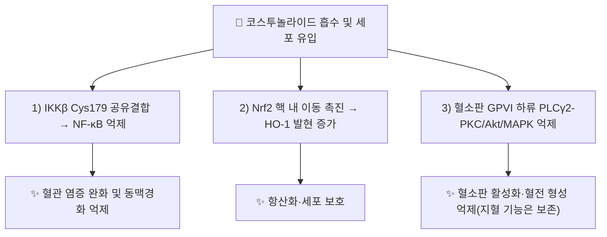

# 🔬 코스투놀라이드 (Costunolide, C₁₅H₂₀O₂)

> **핵심 3줄 요약 (Key Summary)**:
> - 🌿 기원 본초 & 화학 계열: [[목향]](木香, 국화과 *Aucklandia lappa* = *Saussurea costus*) 뿌리에 함유된 대표적 유데스마놀라이드계 세스퀴테르펜락톤. [[데하이드로코스투스락톤]]과 함께 목향의 2대 지표 성분.
> - 🎯 핵심 분자 표적 & 조절 경로: IKKβ 시스테인 179번 잔기에 공유결합해 NF-κB를 억제하고, IκBα 인산화 차단·Nrf2/HO-1 경로 활성화, PLCγ2-PKC/Akt/MAPK 경로 억제(혈소판) 등 다표적 기전.
> - 🩺 주요 약리 활성 & 질환 치료 기전: 항염증(TNF-α 억제), 항동맥경화, 항혈소판·항혈전, 항종양(세포자멸사·G2/M 정지), 목향의 행기지통(行氣止痛)·건비소식(健脾消食) 효능의 현대적 근거로 다뤄짐.
> - ⚠️ 독성·생체이용률 한계 & 상호작용: α,β-불포화 락톤의 친전자성(Michael acceptor) 반응성으로 다수 단백질과 비선택적 공유결합 가능성이 있어 고용량·장기 투여의 안전성 자료는 제한적.

---

## 📌 목차
1. [기본 화학 정보 & 분자 구조식 (Chemical Identity)](#1-기본-화학-정보--분자-구조식-chemical-identity)
2. [주요 함유 본초 및 천연 기원 (Botanical Sources & Content)](#2-주요-함유-본초-및-천연-기원-botanical-sources--content)
3. [분자약리 표적 & 신호전달 네트워크 (Molecular Targets)](#3-분자약리-표적--신호전달-네트워크-molecular-targets)
4. [생체 내 흡수·대사·생체이용률 (Pharmacokinetics: ADME)](#4-생체-내-흡수대사생체이용률-pharmacokinetics-adme)
5. [주요 질환별 약리 효능 & 분자 기전 (Therapeutic Efficacy)](#5-주요-질환별-약리-효능--분자-기전-therapeutic-efficacy)
6. [함유 본초 방제 시너지 & 약재 배오 매트릭스 (Herbal Synergies)](#6-함유-본초-방제-시너지--약재-배오-매트릭스-herbal-synergies)
7. [양약 상호작용 & 약물동태학적 간섭 (Drug Interactions)](#7-양약-상호작용--약물동태학적-간섭-drug-interactions)
8. [💡 사용자 진료실 핵심 필기 & 임상 응용 팁 (Melt-In & High-Yield)](#8--사용자-진료실-핵심-필기--임상-응용-팁-melt-in--high-yield)
9. [출처 및 학술 참고 문헌 (References)](#9-출처-및-학술-참고-문헌-references)

---

## 1. 기본 화학 정보 & 분자 구조식 (Chemical Identity)

| 항목 | 상세 내용 |
| :--- | :--- |
| **분자식 / 분자량** | C₁₅H₂₀O₂ / 약 232.32 g/mol |
| **PubChem CID** | [5281437](https://pubchem.ncbi.nlm.nih.gov/compound/5281437) |
| **CAS 등록 번호** | 553-21-9 |
| **화학 골격 분류** | 유데스마놀라이드(germacranolide)계 세스퀴테르펜락톤 — [[데하이드로코스투스락톤]]과 함께 목향의 2대 지표 성분이며, 구조상 α-메틸렌/α,β-불포화 γ-부티로락톤 고리를 가져 친전자성(Michael acceptor) 반응성을 나타냄 |

---

## 2. 주요 함유 본초 및 천연 기원 (Botanical Sources & Content)

| 함유 본초 (한글/한자) | 기원 식물학적 명칭 (과명 / 학명) | 주요 함유 약용 부위 | 한의학적 귀경 및 약효 특성 |
| :--- | :--- | :--- | :--- |
| [[목향]] (木香) | 국화과 / *Aucklandia lappa* (= *Saussurea costus*, *S. lappa*) | 뿌리 | 비·위·대장·삼초·담경 귀경, 行氣止痛(행기지통)·健脾消食(건비소식) |

> [[코스투놀라이드]]와 [[데하이드로코스투스락톤]]은 목향의 지표성분으로서 함께 함량이 관리되며, 두 성분의 항염증·항종양 활성이 함께 체계적 문헌고찰로 정리되어 있다(Amer 2025, PMID 40273662).

---

## 3. 분자약리 표적 & 신호전달 네트워크 (Molecular Targets)

### 1) NF-κB 경로 — IKKβ 공유결합 억제
* Huang ZQ 등(2023, *Acta Pharmacol Sin*)에 따르면 코스투놀라이드는 NF-κB의 상류 조절자인 **IKKβ의 시스테인 179(Cys179) 잔기에 공유결합**하여 IKKβ의 인산화 및 형태 변화를 억제함으로써 NF-κB를 불활성화시킨다.
* 이 기전을 통해 고지방식이로 유도된 ApoE−/− 마우스에서 동맥 조직의 염증세포 침윤 및 염증성 분자 발현이 용량 의존적(10~20 mg/kg/day)으로 감소, 동맥경화 병변이 완화되었다.
* 추가로 IκBα 인산화 차단을 통한 NF-κB 활성화 억제, iNOS 발현·NO 생성 감소가 보고된다(Choi & Kim 2019 리뷰).

### 2) Nrf2/HO-1 항산화 경로
* Nrf2 전사인자의 핵 내 축적을 늘려 항산화 효소 Heme oxygenase-1(HO-1) 발현을 증가시키는 것으로 보고된다(Choi & Kim 2019 리뷰).

### 3) 혈소판 활성화 억제(GPVI 하류 신호)
* Lu WJ 등(2026, *Cells*)에 따르면 코스투놀라이드는 콜라겐에 의해 유발되는 혈소판 활성화를 **GPVI 수용체 하류의 PLCγ2-PKC, Akt, MAPK 신호 경로를 차단**하여 선택적으로 억제하며, 과립 방출 및 GPIIb/IIIa 활성화·칼슘 동원을 저해한다.

### 4) 세포자멸사·세포주기 정지(항종양)
* 미토콘드리아 경로를 통한 세포자멸사(Bcl-2 억제·Bax 증가·시토크롬c 방출·caspase-3 활성화), G2/M기 세포주기 정지(사이클린·CDK 하향조절), 텔로머라제(hTERT) 발현 감소, 혈관내피성장인자(VEGF/VEGFR) 발현 억제가 다수 암세포주 연구에서 보고된다(Choi & Kim 2019 리뷰).
* MAPK, PI3K/Akt, JAK-STAT 경로 조절도 함께 다뤄진다.

---

## 4. 생체 내 흡수·대사·생체이용률 (Pharmacokinetics: ADME)

⚠️ 내용 검토 필요: 코스투놀라이드 단일 성분의 인체 대상 정량 약동학(경구 흡수율·반감기·생체이용률) 문헌은 이 노트 작성 시점에 확인하지 못했다. 동물 모델에서는 10~20 mg/kg/day 경구·복강 투여로 유효 혈중 농도에 도달해 약리 효과가 나타난 것으로 보고되나(Huang 2023), 사람 대상 노출-반응 자료는 부족하다. 실측 근거 없이 추정 서술하지 않는다.

---

## 5. 주요 질환별 약리 효능 & 분자 기전 (Therapeutic Efficacy)

### 1) 심혈관 질환 — 동맥경화 & 혈전
* 고지방식이 ApoE−/− 마우스에서 IKKβ-NF-κB 경로 억제를 통한 동맥경화 완화(Huang 2023, *Acta Pharmacol Sin* 44(1):58-70).
* 콜라겐 유발 혈소판 활성화·혈전 형성 억제, 아스피린과 달리 출혈 부작용 없이 폐혈전증 예방 및 생존율 향상(Lu 2026, *Cells* 15(10):938).

### 2) 만성 염증
* TNF-α 생성 억제가 쥐 대식세포 유사 세포(macrophage-like cell)에서 초기부터 보고되었다(Cho JY 등, *Planta Medica*, PMID 9810262) — 목향 세스퀴테르펜락톤의 항염증 작용에 대한 고전적 근거 중 하나.

### 3) 항종양
* 다양한 암세포주에서 미토콘드리아 경로 세포자멸사, G2/M 정지, 혈관신생 억제가 보고되며(Choi & Kim 2019 리뷰), 데하이드로코스투스락톤과 함께 유도체 항암 잠재력에 대한 체계적 문헌고찰도 존재한다(Amer 2025, PMID 40273662).

⚠️ 위 항종양·항동맥경화 효능은 대부분 세포주·동물모델 수준 연구이며, 사람 대상 임상시험 근거는 확인되지 않았다.

---

## 6. 함유 본초 방제 시너지 & 약재 배오 매트릭스 (Herbal Synergies)

| 함유 본초 / 방제 | 공존 유효 성분군 | 분자약리 시너지 기전 | 전통 한의학적 효능 연계 |
| :--- | :--- | :--- | :--- |
| [[목향]] | [[데하이드로코스투스락톤]] | 두 세스퀴테르펜락톤의 NF-κB 경로 공동 억제 추정(개별 논문 직접 확인 아님) | 행기지통, 건비소식 — 기체(氣滯)로 인한 복통·팽만감·소화불량 |
| [[청목향산]] · [[천태오약산]] | 목향 배오 약재군 | 다표적 기체·동맥 염증 조절 네트워크 추정 | 이기(理氣) 처방 내 목향의 행기 역할 뒷받침 |

⚠️ 내용 검토 필요: 처방 내 코스투놀라이드의 정량적 기여도 및 데하이드로코스투스락톤과의 직접적 시너지를 검증한 문헌은 확인하지 못했다.

---

## 7. 양약 상호작용 & 약물동태학적 간섭 (Drug Interactions)

* **항혈소판제·항응고제와의 병용 주의**: 코스투놀라이드 자체가 GPVI 경로를 통한 항혈소판 작용을 나타내므로(Lu 2026), 아스피린·클로피도그렐·와파린·DOAC 등 기존 항혈소판제·항응고제와 병용 시 이론적으로 출혈 위험이 상가될 가능성이 있다. 다만 이는 코스투놀라이드 단독 동물실험 기전에 근거한 **이론적 추정**이며, 사람 대상 병용 연구는 확인되지 않았다.
* **CYP450 효소 간섭**: 코스투놀라이드 단일 성분의 CYP 효소 유도/억제에 대한 직접 검증 문헌은 확인하지 못했다(**근거 미확인**).

---

## 8. 💡 사용자 진료실 핵심 필기 & 임상 응용 팁 (Melt-In & High-Yield)

* 목향의 행기지통·건비소식 효능(기체로 인한 복통·팽만감, 소화불량)을 설명할 때 [[데하이드로코스투스락톤]]과 함께 지표 성분으로 언급.
* 혈소판·항염증 기전(IKKβ, GPVI/PLCγ2)은 세포·동물 수준 연구이므로 환자 설명 시 임상 효과로 단정하지 않기.
* 항혈소판제 복용 환자에서 목향 함유 처방을 고용량·장기 투여할 경우, 이론적 출혈 위험 상가 가능성을 염두에 두고 경과 관찰.

---

## 9. 출처 및 학술 참고 문헌 (References)

1. **Choi BY, Kim DY (2019)**. *Costunolide—A Bioactive Sesquiterpene Lactone with Diverse Therapeutic Potential*. **International Journal of Molecular Sciences**, 20(12), 2926. PMID: [31208018](https://pubmed.ncbi.nlm.nih.gov/31208018/) · DOI: [10.3390/ijms20122926](https://doi.org/10.3390/ijms20122926)
   - **[연구 요약]**: 코스투놀라이드의 항염증(NF-κB/IκBα, Nrf2/HO-1), 항종양(미토콘드리아 세포자멸사, G2/M 정지, hTERT·VEGF 억제, MAPK/Akt/JAK-STAT) 기전을 종합한 리뷰.
2. **Huang ZQ, Luo W, Li WX, et al. (2023)**. *Costunolide alleviates atherosclerosis in high-fat diet-fed ApoE−/− mice through covalently binding to IKKβ and inhibiting NF-κB-mediated inflammation*. **Acta Pharmacologica Sinica**, 44(1), 58-70. DOI: [10.1038/s41401-022-00928-0](https://doi.org/10.1038/s41401-022-00928-0)
   - **[연구 요약]**: 코스투놀라이드가 IKKβ의 Cys179에 공유결합해 NF-κB를 불활성화시키고, ApoE−/− 마우스 동맥경화를 용량 의존적으로 완화함을 규명.
3. **Lu WJ, et al. (2026)**. *Costunolide, a Sesquiterpene Lactone, Protects Against Platelet Activation and Thrombus Formation*. **Cells**, 15(10), 938. DOI: [10.3390/cells15100938](https://doi.org/10.3390/cells15100938)
   - **[연구 요약]**: 콜라겐/GPVI 하류 PLCγ2-PKC·Akt·MAPK 경로 억제를 통한 혈소판 활성화 차단, 마우스 폐혈전증·장간막 혈관 혈전 모델에서 출혈 부작용 없이 항혈전 효과 및 생존율 향상을 확인.
4. **Cho JY, Park SC, et al.** *Inhibitory effect of sesquiterpene lactones from Saussurea lappa on tumor necrosis factor-alpha production in murine macrophage-like cells*. **Planta Medica**. PMID: [9810262](https://pubmed.ncbi.nlm.nih.gov/9810262/)
   - **[연구 요약]**: 목향 세스퀴테르펜락톤(코스투놀라이드 포함)이 쥐 대식세포 유사 세포에서 TNF-α 생성을 억제함을 보고한 초기 연구.
5. **Amer MFA, Hattab D, Bakhtiar A, et al. (2025)**. *Anticancer potential of synthetic costunolide and dehydrocostus lactone derivatives: A systematic review*. **European Journal of Medicinal Chemistry**, 291, 117648. PMID: [40273662](https://pubmed.ncbi.nlm.nih.gov/40273662/)
   - **[연구 요약]**: 코스투놀라이드·데하이드로코스투스락톤 합성 유도체의 항암 잠재력을 정리한 체계적 문헌고찰.
6. 볼트 내 교차 참조: [[목향]] · [[데하이드로코스투스락톤]] · [[청목향산]] · [[천태오약산]]

> 검증 메모 (2026-10-05): 2·3번 문헌은 공식 저널 페이지(Nature/Acta Pharmacol Sin, MDPI/Cells) 전문 요약에서 기전·수치를 직접 확인했다. 1·4·5번은 검색 엔진 스니펫·PMID로 서지사항을 교차 확인했으며, 4번은 원문 전체(저자 전체 목록·정확한 연도·권호)를 열람하지 못해 일부 서지정보(연도·권·호·페이지)를 기재하지 않았다 — 추후 원문 확보 시 보강 필요.
