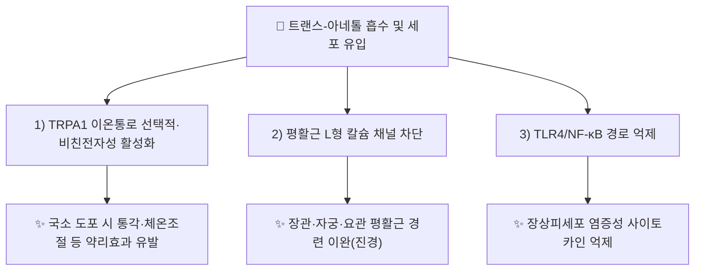

# 🔬 [[트랜스-아네톨]] (trans-Anethole, C₁₀H₁₂O)

> **핵심 3줄 요약 (Key Summary)**:
> - 🌿 기원 본초 & 화학 계열: [[소회향]](*Foeniculum vulgare*, 회향)의 핵심 정유 지표성분(KP 규격 ≥1.4%)으로, 방향족 고리에 프로페닐기가 결합된 페닐프로파노이드계(아릴프로펜) 방향성 정유 성분입니다.
> - 🎯 핵심 분자 표적 & 조절 경로: TRPA1 이온통로의 선택적·비친전자성(nonelectrophilic) 작용제이며, 평활근 [[칼슘 채널]](L형) 차단과 TLR4/NF-κB 경로 억제를 통해 진경·항염 작용을 나타냅니다.
> - 🩺 주요 약리 활성 & 질환 치료 기전: 장관·자궁·요관 평활근 경련 이완(온리약 온간산한·진경 효능의 분자적 근거), 만성폐쇄성폐질환(COPD) 동물모델 항염, 궤양성 대장염(DSS 모델) 장내 미생물총·담즙산 대사 개선.
> - ⚠️ 독성·생체이용률 한계 & 상호작용: 휘발성 정유 성분으로 경구 투여 시 빠르게 흡수·대사되는 것으로 알려져 있으나, 인체 대상 정량 약동학(반감기·생체이용률) 데이터는 이 노트 조사 범위에서 확인되지 않았습니다. cis-이성질체 및 관련 화합물(메틸유게놀 등)의 고용량 장기 노출 발암성 우려가 식품첨가물 안전성 평가에서 논의된 바 있으나, 트랜스-아네톨 자체의 인체 독성 등급은 이 노트에서 직접 확인하지 못했습니다.

---

## 📌 목차
1. [기본 화학 정보 & 분자 구조식 (Chemical Identity)](#1-기본-화학-정보--분자-구조식-chemical-identity)
2. [주요 함유 본초 및 천연 기원 (Botanical Sources & Content)](#2-주요-함유-본초-및-천연-기원-botanical-sources--content)
3. [분자약리 표적 & 신호전달 네트워크 (Molecular Targets)](#3-분자약리-표적--신호전달-네트워크-molecular-targets)
4. [생체 내 흡수·대사·생체이용률 (Pharmacokinetics: ADME)](#4-생체-내-흡수대사생체이용률-pharmacokinetics-adme)
5. [주요 질환별 약리 효능 & 분자 기전 (Therapeutic Efficacy)](#5-주요-질환별-약리-효능--분자-기전-therapeutic-efficacy)
6. [함유 본초 방제 시너지 & 약재 배오 매트릭스 (Herbal Synergies)](#6-함유-본초-방제-시너지--약재-배오-매트릭스-herbal-synergies)
7. [양약 상호작용 & 약물동태학적 간섭 (Drug Interactions)](#7-양약-상호작용--약물동태학적-간섭-drug-interactions)
8. [💡 사용자 진료실 핵심 필기 & 임상 응용 팁 (Melt-In & High-Yield)](#8--사용자-진료실-핵심-필기--임상-응용-팁-melt-in--high-yield)
9. [출처 및 학술 참고 문헌 (References)](#9-출처-및-학술-참고-문헌-references)

---
## 1. 기본 화학 정보 & 분자 구조식 (Chemical Identity)

> [!abstract]+ 🧪 3D 약리 분자 구조 (Interactive 3D Viewer)
> <iframe src="https://molecule-viewer-rho.vercel.app/?cid=637563" width="100%" height="450px" frameborder="0" allow="webgl" style="border-radius: 8px;"></iframe>

| 항목 | 상세 내용 |
| :--- | :--- |
| **IUPAC 명칭** | (E)-1-Methoxy-4-(prop-1-en-1-yl)benzene |
| **분자식 / 분자량** | C₁₀H₁₂O / 약 148.20 g/mol |
| **PubChem CID** | [637563](https://pubchem.ncbi.nlm.nih.gov/compound/637563) |
| **CAS 등록 번호** | 4180-23-8 (trans 이성질체 기준) |
| **화학 골격 분류** | 페닐프로파노이드(방향족 프로펜, Phenylpropene) — 아니스·회향 정유의 대표 방향 성분 |
| **물리화학적 성상** | 무색~담황색 유상 액체, 아니스(팔각·회향) 특유의 달콤한 향, 지용성(휘발성 정유)·수불용성, 상온에서 결정화되기 쉬움 |
| **식물 내 생합성 경로** | 페닐프로파노이드 경로(페닐알라닌 → 신남산 → 파라-쿠마릴 유도체 경로)를 거쳐 생성되는 것으로 알려진 방향족 정유 성분(일반 페닐프로파노이드 생합성 경로 유추 — 소회향 고유 효소 데이터는 이 노트에서 직접 확인하지 못함 ⚠️). |

---

## 2. 주요 함유 본초 및 천연 기원 (Botanical Sources & Content)

| 함유 본초 (한글/한자) | 기원 식물학적 명칭 (과명 / 학명) | 주요 함유 약용 부위 | 지표 함량 (%) | 한의학적 귀경 및 약효 특성 |
| :--- | :--- | :--- | :--- | :--- |
| [[소회향]] (小茴香) | 산형과(Apiaceae) / *Foeniculum vulgare* | 성숙 열매(정유 3~6%) | KP 규격 **1.4% 이상**(건조물 기준) | 간·신·비·위경, 온간산한(溫肝散寒)·이기지통(理氣止痛) |

> 소회향 정유(3~6%) 중 트랜스-아네톨이 핵심 지표성분(KP 규격 ≥1.4%)이며, [[펜촌]](Fenchone, KP 규격 ≥0.4%)과 함께 소회향의 온간산한·진경 효능의 화학적 근거로 다뤄집니다(볼트 내 [[소회향]] 노트).

---

## 3. 분자약리 표적 & 신호전달 네트워크 (Molecular Targets)

### 1) TRPA1 이온통로 활성화
* 트랜스-아네톨은 TRPA1 이온통로의 **선택적이며 비친전자성(nonelectrophilic)인 작용제**로 규명되었습니다 — 다수의 TRPA1 작용제가 친전자성 공유결합을 통해 채널을 활성화하는 것과 달리, 트랜스-아네톨은 비공유결합 방식으로 작용합니다(Sadraei 계열, [PMID 30679204](https://pubmed.ncbi.nlm.nih.gov/30679204/)).
* 마우스 국소(피부) 도포 시 나타나는 트랜스-아네톨의 약리 효과(통각·체온조절 반응 등)가 TRPA1 의존적임이 확인되었습니다([PMID 38809294](https://pubmed.ncbi.nlm.nih.gov/38809294/)).

### 2) 평활근 칼슘 채널 차단 및 진경 기전
* [[소회향]] 노트 서술에 따르면, 트랜스-아네톨은 장관·자궁·요관 평활근의 과도한 콜린성 수축을 억제하고 혈관 내피 일산화질소([[NO]]) 방출을 유도하여 평활근 경련을 진정시키는 것으로 기술됩니다.
* [[천태오약산]]에서는 [[오약]]의 세스퀴테르펜 린데란과 트랜스-아네톨이 정관 및 비뇨생식관 평활근의 L형 칼슘 채널을 차단하여 허혈성 경련통을 신속히 이완시키는 것으로 서술됩니다(볼트 내 처방 노트).

### 3) 장상피 염증 경로 억제
* LPS로 자극한 IEC-6(장상피) 세포에서 트랜스-아네톨이 TLR4/NF-κB 경로 억제를 통해 염증을 완화한다는 보고가 있습니다(ScienceDirect, Li et al. 계열).

---

## 4. 생체 내 흡수·대사·생체이용률 (Pharmacokinetics: ADME)

* **휘발성·지용성 흡수**: 정유 성분 특유의 높은 지용성으로 장관·경피 흡수가 빠른 것으로 알려져 있으나, 트랜스-아네톨 단일 성분의 인체 정량 약동학(Cmax, 반감기, 절대 생체이용률) 데이터는 이 노트 조사 범위에서 확인되지 않았습니다(⚠️).
* **동물모델 유효 용량 참고치**: 궤양성 대장염 마우스 모델에서 62.5 mg/kg을 1일 1회 경구 투여(7일간)한 연구가 있어, 동물 대상 유효 용량 범위의 참고 자료로 활용할 수 있습니다(아래 5절 참고).

---

## 5. 주요 질환별 약리 효능 & 분자 기전 (Therapeutic Efficacy)

### 1) 위장관·자궁 평활근 경련(온리약 진경 효능)
* TRPA1 활성화 및 L형 칼슘 채널 차단을 통해 장관·자궁·요관 평활근 경련을 이완시키며, [[소회향]]의 온중산한·행기지통, [[천태오약산]]의 허혈성 경련통 완화 효능의 핵심 화학적 근거로 제시됩니다.

### 2) 만성 염증성 질환(COPD·궤양성 대장염)
* 만성폐쇄성폐질환(COPD) 마우스 모델에서 트랜스-아네톨이 항염 효과를 나타낸다는 보고가 있습니다([PMID 28511344](https://pubmed.ncbi.nlm.nih.gov/28511344/)).
* DSS(dextran sulfate sodium) 유발 궤양성 대장염 마우스 모델에서, 트랜스-아네톨이 claudin-1·occludin·ZO-1 등 밀착연접(tight junction) 단백질 발현을 상향시켜 장벽 기능을 회복시키고, 장내 미생물총을 리모델링(*Firmicutes* 증가, 병원성균 *Bacteroides*·*Desulfovibrio* 감소, 유익균 *Lactobacillus* 증가)하며, FGF15·ASBT·BSEP 발현 상향을 통해 담즙산 항상성을 정상화하고, Th17/Treg 균형 회복 및 TNF-α·IL-8 등 염증성 사이토카인을 감소시켰습니다(용량 62.5 mg/kg/day 경구, 7일간)(Li et al. 2023, *Mediators of Inflammation*, [PMC10539094](https://pmc.ncbi.nlm.nih.gov/articles/PMC10539094/), DOI: [10.1155/2023/4188510](https://onlinelibrary.wiley.com/doi/10.1155/2023/4188510)).

> ⚠️ 내용 검토 필요: 위 COPD·궤양성 대장염 근거는 모두 동물모델 연구이며, 인체 대상 임상시험 근거는 이 노트 조사 범위에서 확인되지 않았습니다.

---

## 6. 함유 본초 방제 시너지 & 약재 배오 매트릭스 (Herbal Synergies)

| 함유 본초 / 방제 | 공존 유효 성분군 | 분자약리 시너지 기전 | 전통 한의학적 효능 연계 |
| :--- | :--- | :--- | :--- |
| [[소회향]] | [[펜촌]](Fenchone), 리모넨, 알파-피넨 | 트랜스-아네톨·펜촌 병존 시 평활근 [[칼슘 채널]] 차단을 통한 진경 작용 시너지(볼트 내 소회향 노트) | 온중산한(溫中散寒)·이기지통(理氣止痛) |
| [[천태오약산]] | [[오약]]의 린데란(세스퀴테르펜) | 서로 다른 화학 계열(페닐프로파노이드 vs 세스퀴테르펜)이 L형 칼슘 채널을 동시에 차단하여 다표적 진경 효과 | 하초(下焦) 허혈성 경련통 완화 |

---

## 7. 양약 상호작용 & 약물동태학적 간섭 (Drug Interactions)

* ⚠️ 내용 검토 필요: 트랜스-아네톨과 특정 양약(CYP 효소 기질제, 항응고제 등) 간의 병용 상호작용을 직접 검증한 인체 연구는 이 노트 조사 범위에서 확인되지 않았습니다.
* **일반 안전성 참고**: 식품향료(FEMA GRAS)로 널리 사용되는 성분이나, 고농도 정유 형태로 장기 대량 섭취할 경우의 안전역은 이 노트에서 정량적으로 확인하지 못했습니다. 임상에서는 소회향 등 정유 함유 본초의 일반적 사용량 범위를 준수하는 것이 안전합니다.

---

## 8. 💡 사용자 진료실 핵심 필기 & 임상 응용 팁 (Melt-In & High-Yield)

* 소회향의 온중산한·진경 효능을 설명할 때, 트랜스-아네톨의 TRPA1 활성화·평활근 칼슘 채널 차단 기전을 근거로 제시할 수 있습니다.
* 천태오약산의 하초 허혈성 경련통 완화는 오약(린데란)과 소회향(트랜스-아네톨)의 서로 다른 화학 계열이 동일 표적(L형 칼슘 채널)에 작용하는 다표적 배오로 이해할 수 있습니다.
* 궤양성 대장염·만성 장염증 환자에서 소회향 계열 처방을 병용할 때, 장내 미생물총·담즙산 대사 개선이라는 부가적 근거(동물모델)를 참고할 수 있으나 인체 근거 수준은 낮음에 유의.

---

## 9. 출처 및 학술 참고 문헌 (References)

1. **Sadraei H, et al. (2019)**. *trans-Anethole of Fennel Oil is a Selective and Nonelectrophilic Agonist of the TRPA1 Ion Channel*. **Mol Pharmacol**. PMID: [30679204](https://pubmed.ncbi.nlm.nih.gov/30679204/)
   - **[연구 요약]**: 트랜스-아네톨이 TRPA1의 선택적·비친전자성 작용제임을 전기생리학적으로 규명.
2. **(2024)**. *Role of TRPA1 in the pharmacological effect triggered by the topical application of trans-anethole in mice*. **Naunyn Schmiedebergs Arch Pharmacol**. PMID: [38809294](https://pubmed.ncbi.nlm.nih.gov/38809294/)
   - **[연구 요약]**: 마우스 국소 도포 시 트랜스-아네톨의 약리 효과가 TRPA1 의존적임을 검증.
3. **(2017)**. *Anti-inflammatory effects of trans-anethole in a mouse model of chronic obstructive pulmonary disease*. **Life Sci** 계열. PMID: [28511344](https://pubmed.ncbi.nlm.nih.gov/28511344/)
   - **[연구 요약]**: COPD 마우스 모델에서 트랜스-아네톨의 항염 효과를 보고.
4. **Li Y, et al. (2023)**. *Trans-Anethole Alleviates DSS-Induced Ulcerative Colitis by Remodeling the Intestinal Flora to Regulate Immunity and Bile Acid Metabolism*. **Mediators of Inflammation**, 2023:4188510. [PMC10539094](https://pmc.ncbi.nlm.nih.gov/articles/PMC10539094/) · DOI: [10.1155/2023/4188510](https://onlinelibrary.wiley.com/doi/10.1155/2023/4188510)
   - **[연구 요약]**: DSS 유발 궤양성 대장염 마우스에서 트랜스-아네톨이 장벽 단백질 발현 회복, 장내 미생물총 리모델링, 담즙산 대사 정상화, Th17/Treg 균형 회복을 통해 대장염을 완화함을 보고.
5. **PubChem CID 637563 (Anethole)**. National Center for Biotechnology Information. [PubChem](https://pubchem.ncbi.nlm.nih.gov/compound/trans-anethole)
   - **[공정 데이터]**: 분자식·CAS 번호 등 화학 신원 정보.
