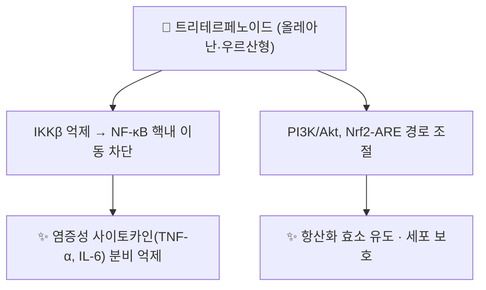

# 🔬 트리테르페노이드 (Triterpenoid)

> **핵심 3줄 요약 (Key Summary)**:
> - 🌿 화학 계열 개요: 이소프렌 단위 6개(C30)로 구성된 테르펜 화합물군의 총칭으로, 단일 화합물이 아닌 화학적 분류(class) 개념입니다. 스쿠알렌(Squalene)의 산화적 고리화를 거쳐 올레아난(oleanane)·우르산(ursane)·루판(lupane)·담마란(dammarane)·라노스탄(lanostane)·사이클로아르탄(cycloartane) 등 약 200여 종의 골격으로 분화되며, [[감초]]의 [[글리시리진]], [[길경]]의 [[플라티코딘 D]], [[금앵자]]·[[구맥]] 등 볼트 내 다수 본초에 유리 트리테르펜산 또는 사포닌 형태로 광범위하게 함유되어 있습니다.
> - 🎯 핵심 분자 표적 & 조절 경로: 오각환(pentacyclic) 트리테르페노이드는 IKKβ 억제를 통한 NF-κB 경로 차단, PI3K/Akt·Nrf2-ARE 경로 조절이 대표적 공통 기전으로 보고됩니다.
> - 🩺 주요 약리 활성: 항염증·항산화가 가장 일관되게 보고되는 공통 약리 활성이며, 개별 화합물(글리시리진의 간보호, 플라티코딘 D의 거담 등)에 따라 특이적 효능이 추가됩니다.
> - ⚠️ 독성·생체이용률 한계 & 상호작용: 대부분 낮은 경구 생체이용률과 P-당단백질(P-gp) 유출 기질 특성을 가지며, 장내세균에 의한 가수분해를 거쳐 활성 대사체로 전환되어야 흡수되는 경우가 많습니다(예: 글리시리진 → 글리시레틴산). [[감초]] 등 글리시리진 고함량 본초의 장기·대량 복용은 11β-HSD2 억제를 통한 가성 알도스테론증(저칼륨혈증·고혈압)을 유발할 수 있어 임상적으로 중요한 주의사항입니다.

---

## 📌 목차
1. [기본 화학 정보 & 분자 구조식 (Chemical Identity)](#1-기본-화학-정보--분자-구조식-chemical-identity)
2. [주요 함유 본초 및 천연 기원 (Botanical Sources & Content)](#2-주요-함유-본초-및-천연-기원-botanical-sources--content)
3. [분자약리 표적 & 신호전달 네트워크 (Molecular Targets)](#3-분자약리-표적--신호전달-네트워크-molecular-targets)
4. [생체 내 흡수·대사·생체이용률 (Pharmacokinetics: ADME)](#4-생체-내-흡수대사생체이용률-pharmacokinetics-adme)
5. [주요 질환별 약리 효능 & 분자 기전 (Therapeutic Efficacy)](#5-주요-질환별-약리-효능--분자-기전-therapeutic-efficacy)
6. [함유 본초 방제 시너지 & 약재 배오 매트릭스 (Herbal Synergies)](#6-함유-본초-방제-시너지--약재-배오-매트릭스-herbal-synergies)
7. [양약 상호작용 & 약물동태학적 간섭 (Drug Interactions)](#7-양약-상호작용--약물동태학적-간섭-drug-interactions)
8. [💡 사용자 진료실 핵심 필기 & 임상 응용 팁 (Melt-In & High-Yield)](#8--사용자-진료실-핵심-필기--임상-응용-팁-melt-in--high-yield)
9. [출처 및 학술 참고 문헌 (References)](#9-출처-및-학술-참고-문헌-references)

---

## 1. 기본 화학 정보 & 분자 구조식 (Chemical Identity)

트리테르페노이드는 화학 분류(class) 개념이므로 단일 PubChem CID·3D 뷰어가 적용되지 않습니다. 개별 화합물은 별도 PubChem 등록을 가집니다(예: 글리시레틴산 [CID 10114](https://pubchem.ncbi.nlm.nih.gov/compound/10114), 우르솔산 CID 64945, 올레아놀산 CID 10494).

| 항목 | 상세 내용 |
| :--- | :--- |
| **기본 골격** | 이소프렌 단위 6개(C30) — 트리테르펜(C30H48) 및 그 산소 함유 유도체(트리테르페노이드) |
| **생합성 전구체** | 스쿠알렌(Squalene, 파르네실피로인산 2분자의 head-to-head 축합으로 생성) → 옥시도스쿠알렌(2,3-oxidosqualene) → 스쿠알렌 고리화효소/옥시도스쿠알렌 고리화효소(OSC)에 의한 양이온성 고리화 |
| **고리 수에 따른 분류** | 무고리(스쿠알렌), 단고리~3고리, **4고리형**(담마란·라노스탄·유판/euphane·티루칼란/tirucallane·쿠쿠르비탄), **5고리형(펜타사이클릭)**(올레아난·우르산·루판·호판) — 가장 흔한 형태는 올레아난·우르산형 |
| **대표 골격별 화합물** | 올레아난형: 올레아놀산, 글리시레틴산 / 우르산형: 우르솔산 / 루판형: 베툴린산, 루페올 / 담마란형: 진세노사이드(인삼 사포닌) |
| **분류적 위치** | 단일 화합물이 아닌 화학 구조 분류(class) 개념 — 개별 화합물마다 별도의 PubChem CID·구조가 존재 |

---

## 2. 주요 함유 본초 및 천연 기원 (Botanical Sources & Content)

| 함유 본초 (한글/한자) | 기원 식물학적 명칭 | 주요 함유 성분(트리테르페노이드) | 한의학적 귀경 및 약효 특성 |
| :--- | :--- | :--- | :--- |
| [[감초]] (甘草) | 콩과 / *Glycyrrhiza uralensis* 등 | [[글리시리진]](올레아난형, KP ≥2.5%), [[글리시레트산]] | 12경 귀경, 조화제약(調和諸藥)·보비익기(補脾益氣) |
| [[길경]] (桔梗) | 초롱꽃과 / *Platycodon grandiflorum* | 트리테르페노이드 사포닌(3~5%): [[플라티코딘 D]](올레아난형, KP 지표물질), [[플라티코딘 A]], [[플라티코디제닌]] | 폐경, 선폐거담(宣肺祛痰)·배농(排膿) |
| [[구맥]] (瞿麥) | 석죽과 / *Dianthus superbus* | 트리테르페노이드 사포닌: [[디안토사이드]] A~D | 심·소장경, 이수통림(利水通淋) |
| [[금앵자]] (金櫻子) | 장미과 / *Rosa laevigata* | 트리테르페노이드(우르솔산·올레아놀산 등, 개별 지표 함량 근거 미확인) | 신·방광·대장경, 고정삽정(固精澀精) |
| [[감수]] (甘遂, 참고) | 대극과 / *Euphorbia kansui* | 유판형(euphane) 트리테르페노이드: 유폴(Euphol), Tirucallol 등 — [[디테르페노이드]] 에스터와 공존 | 준하축수(峻下逐水) — 트리테르페노이드는 부성분, 주 약리는 디테르펜 에스터 |

> ⚠️ 내용 검토 필요: 위 본초 중 다수는 "트리테르페노이드"를 여러 유효성분 중 하나로 함유할 뿐이며, 해당 본초의 전통 효능 전체를 트리테르페노이드 단독 기전으로 환원할 수는 없습니다. 개별 화합물 노트([[글리시리진]] 등)를 함께 참고해야 합니다.

---

## 3. 분자약리 표적 & 신호전달 네트워크 (Molecular Targets)

* **NF-κB 경로 억제(IKKβ 표적)**: 다양한 오각환 트리테르페노이드가 IKKβ의 활성을 억제하여 NF-κB 신호전달 경로를 차단한다는 in silico·in vitro 근거가 보고되었습니다(Ali 2015, [PMID 25938234](https://pubmed.ncbi.nlm.nih.gov/25938234/)).
* **NF-κB·AP-1·NF-AT 동시 억제**: 대표적 우르산형 화합물인 우르솔산이 NF-κB·AP-1·NF-AT 전사인자를 동시에 억제하여 강력한 항염 활성을 나타낸다는 보고가 있습니다(Checker et al., [PMID 22363615](https://pubmed.ncbi.nlm.nih.gov/22363615/)).
* **종합 리뷰**: 2006~2021년 문헌을 종합한 리뷰에서 천연 트리테르펜의 항염 활성이 폭넓게 보고되어 있습니다(Fonseca et al. 2022, [PMID 35229374](https://pubmed.ncbi.nlm.nih.gov/35229374/)).

> ⚠️ 내용 검토 필요: 본 절은 대표 화합물(우르솔산 등) 및 화학군 전반의 리뷰 근거이며, 볼트 내 개별 본초([[감초]]·[[길경]] 등)에 함유된 구체적 트리테르페노이드가 동일한 정량적 효과를 낸다는 직접 증거는 아닙니다.

---

## 4. 생체 내 흡수·대사·생체이용률 (Pharmacokinetics: ADME)

* **낮은 경구 생체이용률**: 트리테르페노이드는 전반적으로 극성이 커 장관 투과도가 낮고, P-당단백질(P-gp) 유출 펌프의 기질이 되는 경우가 많아 경구 생체이용률이 낮은 것으로 알려져 있습니다(화학군 공통 특성, 개별 화합물 정량치는 [[글리시리진]] 등 개별 노트 참고 ⚠️).
* **장내세균 가수분해 필수**: 글리시리진(사포닌 배당체)은 위장관에서 거의 흡수되지 않으며, 장내세균의 β-글루쿠론산분해효소(β-glucuronidase)에 의해 활성 대사체인 글리시레틴산으로 전환된 후에야 흡수된다는 고전 연구가 있습니다(Akao et al. 1996, [PMID 8910850](https://pubmed.ncbi.nlm.nih.gov/8910850/)). 최근 연구에서도 장내 미생물총 교란이 글리시리진 생체이용률에 영향을 준다는 것이 재확인되었습니다(2025, [PMID 40284452](https://pubmed.ncbi.nlm.nih.gov/40284452/)).

---

## 5. 주요 질환별 약리 효능 & 분자 기전 (Therapeutic Efficacy)

### 1) 만성 염증성 질환
* IKKβ/NF-κB 억제(3절 참고)를 통한 항염 효과가 트리테르페노이드 화학군 전반의 가장 일관된 공통 약리 활성으로 보고됩니다.

### 2) 개별 화합물 특이 효능(볼트 연계)
* **글리시리진/글리시레틴산**([[감초]]): 간보호·항염·미네랄코르티코이드 유사 작용 — 11β-HSD2 억제 기전은 7절 참고.
* **플라티코딘 D**([[길경]]): 거담(祛痰)·배농 효능의 화학적 근거로 다뤄지는 트리테르페노이드 사포닌(개별 노트 참고).

> ⚠️ 내용 검토 필요: 화학군 전체에 공통 적용 가능한 "질환별 정량 효능"은 확립되어 있지 않으며, 실제 임상 적용은 개별 화합물·개별 본초 단위로 판단해야 합니다.

---

## 6. 함유 본초 방제 시너지 & 약재 배오 매트릭스 (Herbal Synergies)

| 함유 본초 / 방제 | 공존 유효 성분군 | 분자약리 시너지 기전 | 전통 한의학적 효능 연계 |
| :--- | :--- | :--- | :--- |
| [[감초]] | [[리퀴리틴]]([[플라보노이드]]), [[글리시레트산]] | 사포닌(글리시리진)과 플라보노이드 병존이 항염·항산화 상가 작용에 기여할 것으로 제시됨(원문 일반론) | 조화제약(調和諸藥) — 다수 처방의 군약·좌사약 배오 |
| [[길경]] | 이눌린 등 다당류 | 사포닌의 국소 점막 자극을 다당류가 완충한다는 일반적 설명(원문) | 선폐거담·배농 — [[길경탕]] 등 배오 처방의 근거 |

---

## 7. 양약 상호작용 & 약물동태학적 간섭 (Drug Interactions)

* **가성 알도스테론증(Pseudohyperaldosteronism) — 임상적으로 가장 중요한 주의사항**: 글리시리진의 대사체인 글리시레틴산이 신장의 11β-하이드록시스테로이드 탈수소효소 2형(11β-HSD2)을 억제하여 코티솔의 무기질코르티코이드 수용체 활성을 증가시키고, 그 결과 저칼륨혈증·고혈압·부종(가성 알도스테론증)을 유발할 수 있습니다(Kato et al. 2002, [PMID 11983491](https://pubmed.ncbi.nlm.nih.gov/11983491/)). 최근 2026년 개정 종설에서도 임상 위험 요인(고령·저체중·장기 고용량 복용·이뇨제 병용 등)이 정리되어 있습니다([PMID 42292819](https://pubmed.ncbi.nlm.nih.gov/42292819/)).
* **이뇨제·강심배당체 병용 주의**: 위 기전으로 유발된 저칼륨혈증은 디곡신 등 강심배당체의 독성을 증강시킬 수 있어, [[감초]] 다량 함유 처방을 이뇨제·강심제 복용 환자에게 투여할 때 특히 주의가 필요합니다(가성 알도스테론증 기전에 근거한 임상적 추론).
* **P-gp/CYP 매개 흡수 간섭**: 트리테르페노이드 사포닌이 P-gp 기질 약물의 흡수를 간섭할 가능성이 화학군 공통 특성으로 제시되나, 개별 약물별 정량적 상호작용 데이터는 이 노트 조사 범위에서 확인되지 않았습니다(⚠️).

---

## 8. 💡 사용자 진료실 핵심 필기 & 임상 응용 팁 (Melt-In & High-Yield)

* 트리테르페노이드는 "단일 성분"이 아니라 올레아난·우르산·루판 등 여러 골격을 포괄하는 화학군임을 먼저 구분하고, 실제 임상 판단은 [[글리시리진]]·[[플라티코딘 D]] 등 개별 화합물 노트를 참고.
* [[감초]] 다량·장기 복용 환자(특히 고령·이뇨제 병용)에서는 가성 알도스테론증(저칼륨혈증·고혈압) 가능성을 염두에 두고 혈압·전해질을 주기적으로 확인.
* 항염 기전(IKKβ/NF-κB 억제)은 여러 트리테르페노이드 함유 본초(감초·길경 등)의 청열·소종 효능을 설명하는 공통 분자약리 틀로 활용 가능.

---

## 9. 출처 및 학술 참고 문헌 (References)

1. **Fonseca SF, et al. (2022)**. *Antiinflammatory activity of natural triterpenes—An overview from 2006 to 2021*. **Phytother Res**. PMID: [35229374](https://pubmed.ncbi.nlm.nih.gov/35229374/)
   - **[연구 요약]**: 2006~2021년 문헌을 종합하여 천연 트리테르펜의 항염 활성을 정리한 리뷰.
2. **Ali H, et al. (2015)**. *Pentacyclic Triterpenoids Inhibit IKKβ Mediated Activation of NF-κB Pathway: In Silico and In Vitro Evidences*. **PLoS ONE**, 10(5):e0125709. PMID: [25938234](https://pubmed.ncbi.nlm.nih.gov/25938234/)
   - **[연구 요약]**: 오각환 트리테르페노이드가 IKKβ 매개 NF-κB 활성화를 억제함을 in silico·in vitro로 규명.
3. **Checker R, et al. (2012)**. *Potent Anti-Inflammatory Activity of Ursolic Acid, a Triterpenoid Antioxidant, Is Mediated through Suppression of NF-κB, AP-1 and NF-AT*. **PLoS ONE**, 7(2):e31318. PMID: [22363615](https://pubmed.ncbi.nlm.nih.gov/22363615/)
   - **[연구 요약]**: 우르솔산이 NF-κB·AP-1·NF-AT 전사인자를 동시에 억제하여 강력한 항염 활성을 나타냄을 규명.
4. **Akao T, et al. (1996)**. *Bioavailability study of glycyrrhetic acid after oral administration of glycyrrhizin in rats; relevance to the intestinal bacterial hydrolysis*. **J Pharm Pharmacol**. PMID: [8910850](https://pubmed.ncbi.nlm.nih.gov/8910850/)
   - **[연구 요약]**: 글리시리진이 장내세균에 의해 글리시레틴산으로 가수분해된 후 흡수됨을 규명한 고전 연구.
5. **(2025)**. *The Effect of Gut Microbiome Perturbation on the Bioavailability of Glycyrrhizic Acid in Rats*. **Pharmaceutics**, 17(4):457. PMID: [40284452](https://pubmed.ncbi.nlm.nih.gov/40284452/)
   - **[연구 요약]**: 장내 미생물총 교란이 글리시리진의 생체이용률에 미치는 영향을 재확인.
6. **Kato H, et al. (2002)**. *Glycyrrhizic acid suppresses type 2 11β-hydroxysteroid dehydrogenase expression in vivo*. **Life Sci**. PMID: [11983491](https://pubmed.ncbi.nlm.nih.gov/11983491/)
   - **[연구 요약]**: 글리시리진산이 11β-HSD2 발현을 억제하여 가성 알도스테론증의 분자 기전을 제공함을 보고.
7. **(2026)**. *Clinical risk factors of licorice-induced pseudohyperaldosteronism: a 2026-updated narrative review*. **Front Pharmacol**. PMID: [42292819](https://pubmed.ncbi.nlm.nih.gov/42292819/)
   - **[연구 요약]**: 감초 유발 가성 알도스테론증의 임상 위험 요인을 2026년 기준으로 종합.
