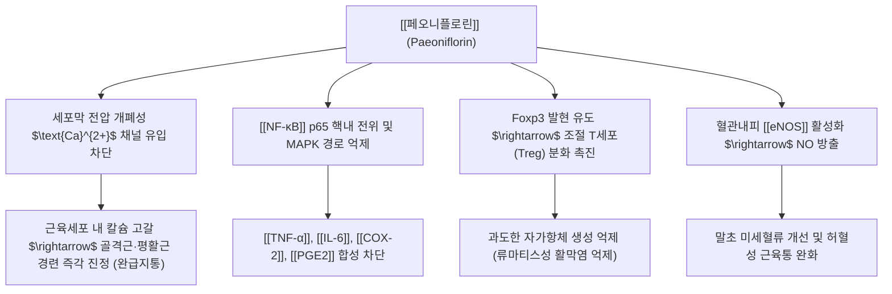

# 🔬 [[페오니플로린]] (Paeoniflorin, C₂₃H₂₈O₁₁)

> **핵심 3줄 요약 (Key Summary)**:
> - 🌿 기원 본초 & 화학 계열: 미나리아재비과(Ranunculaceae) 생약인 [[작약]](Paeonia lactiflora)의 뿌리에서 추출되는 대표적인 피난(Pinane) 골격 모노테르펜 글루코사이드 — 미나리아재비과(*Ranunculaceae*) [[작약]](백작약·적작약) 및 [[목단피]] 뿌리에 고농도로 존재하는 대표적인 피난(Pinane) 골격의 모노테르펜 배당체 지표성분.
> - 🎯 핵심 분자 표적 & 조절 경로: 전압 의존성 L형 칼슘 채널 차단 및 [[NF-κB]] 신호 전달 억제를 통해 골격근·평활근 경련을 즉각 이완시키고 염증성 통증 완화 / 아데노신 $A_1$ 수용체를 활성화하여 세포 내 칼슘 유입을 차단함으로써 골격근·평활근 경련을 즉시 이완시키고, NF-$\kappa$B 차단을 통해 활막염 억제.
> - 🩺 주요 약리 활성 & 질환 치료 기전: 사지 근육 경련과 복통 및 월경통을 해소하는 작약감초탕의 핵심 지표 성분이자 류마티스 관절염 및 자가면역 질환의 천연 면역조절제 — 급성 근육 연축(쥐남)·생리통·혈관 연축성 두통 및 류마티스 관절염을 치료하는 한방 [[완급지통]](緩急止痛)·[[양혈조경]](養血調經) 처방군의 핵심 분자 기반.
> - ⚠️ 독성·생체이용률 한계 & 상호작용: 흡수·분포·대사·배설을 다룬 약동학 리뷰가 있으나(Zhou 2020, §9), 인체 생체이용률 수치와 양약 상호작용 실측 자료는 이 노트에서 확인하지 못했습니다(§4·§7).

---

## 📌 목차
1. [기본 화학 정보 & 분자 구조식 (Chemical Identity)](#1-기본-화학-정보--분자-구조식-chemical-identity)
2. [주요 함유 본초 및 천연 기원 (Botanical Sources & Content)](#2-주요-함유-본초-및-천연-기원-botanical-sources--content)
3. [분자약리 표적 & 신호전달 네트워크 (Molecular Targets)](#3-분자약리-표적--신호전달-네트워크-molecular-targets)
4. [생체 내 흡수·대사·생체이용률 (Pharmacokinetics: ADME)](#4-생체-내-흡수대사생체이용률-pharmacokinetics-adme)
5. [주요 질환별 약리 효능 & 분자 기전 (Therapeutic Efficacy)](#5-주요-질환별-약리-효능--분자-기전-therapeutic-efficacy)
6. [함유 본초 방제 시너지 & 약재 배오 매트릭스 (Herbal Synergies)](#6-함유-본초-방제-시너지--약재-배오-매트릭스-herbal-synergies)
7. [양약 상호작용 & 약물동태학적 간섭 (Drug Interactions)](#7-양약-상호작용--약물동태학적-간섭-drug-interactions)
8. [💡 사용자 진료실 핵심 필기 & 임상 응용 팁 (Melt-In & High-Yield)](#8--사용자-진료실-핵심-필기--임상-응용-팁-melt-in--high-yield)
9. [출처 및 학술 참고 문헌 (References)](#9-출처-및-학술-참고-문헌-references)

---

## 1. 기본 화학 정보 & 분자 구조식 (Chemical Identity)

> [!abstract]+ 🧪 3D 약리 분자 구조 (Interactive 3D Viewer)
> <iframe src="https://molecule-viewer-rho.vercel.app/?cid=442534" style="width: 100%; height: 600px; border: none; border-radius: 12px; box-shadow: 0 4px 20px rgba(0,0,0,0.15);" allowfullscreen></iframe>

| 항목 | 상세 내용 |
| :--- | :--- |
| **일반명 (Generic)** | [[페오니플로린]] (Paeoniflorin) |
| **화학명 (IUPAC)** | [(1R,2S,3R,5R,6R,8S)-8-methyl-3-[(2S,3R,4S,5S,6R)-3,4,5-trihydroxy-6-(hydroxymethyl)oxan-2-yl]oxy-9,10-dioxatricyclo[4.3.1.0^{2,5}]decan-2-yl] benzoate |
| **기원 본초** | 미나리아재비과 [[작약]](*Paeonia lactiflora* Pall.)의 건조 뿌리 |
| **화학식 / 분자량** | $\text{C}_{23}\text{H}_{28}\text{O}_{11}$ / 480.46 g/mol |
| **PubChem CID** | [442534](https://pubchem.ncbi.nlm.nih.gov/compound/442534) (2026-09-23 실측: Paeoniflorin, C23H28O11, 480.5) |
| **화학적 분류** | 옥사비사이클릭 피난계 모노테르펜 배당체 (Monoterpene glucoside) |
| **생약 규격** | 대한약전(KP) 백작약 및 적작약 기준 페오니플로린 2.0% 이상 함유 |

* **IUPAC 명칭 (CAS 색인식 표기, 병합분)**: [1R-(1$\alpha$,2$\beta$,3a$\alpha$,5$\beta$,5a$\alpha$,6$\beta$,6a$\alpha$)]-5b-[(Benzoyloxy)methyl]tetrahydro-5-hydroxy-2-methyl-2,5-methano-1H-3,4-dioxacyclobuta[cd]pentalen-1a(2H)-yl $\beta$-D-glucopyranoside
* **화학식**: $C_{23}H_{28}O_{11}$
* **분자량**: 480.46 g/mol
* **화학적 분류**: 피난(Pinane)형 모노테르펜 골격에 벤조일기(Benzoyl group)와 포도당이 결합된 독특한 복합 배당체 화합물.
* **물리화학적 특성**: 백색 흡습성 분말로 물과 메탄올에 잘 녹으며, 약산성 전탕 조건에서 안정함.

---

## 2. 주요 함유 본초 및 천연 기원 (Botanical Sources & Content)

| 본초명 | 대표 부위 | 성미 및 작용 | 주치 임상 증상 |
| :--- | :--- | :--- | :--- |
| [[백작약]] | 뿌리 (껍질 제거) | 苦·酸, 微寒 / 양혈유간(養血柔肝) | 근육 연축통, 생리통, 간혈허 |
| [[적작약]] | 뿌리 (껍질 보존) | 苦, 微寒 / 청열량혈, 산어지통 | 열독 발진, 타박어혈, 골반강 염증 |
| [[목단피]] | 뿌리 껍질 | 辛·苦, 微寒 / 청열량혈, 활혈화어 | 음허발열, 무월경, 혈전증 |

* **백작약 vs 적작약**:
  * **백작약(白芍藥)**: 양혈렴음(養血斂陰), 유간지통(柔肝止痛)으로 근육 경련, 월경통, 간울협통에 다용.
  * **적작약(赤芍藥)**: 청열양혈(淸熱涼血), 산어지통(散瘀止痛)으로 혈열어체, 피부 자반, 타박상에 다용.
* **볼트 교차 확인 (2026-09-23)**: [[백작약]] 노트는 파에오니플로린을 KP 규격 $\ge 2.0\%$ 지표 성분으로, 알비플로린·옥시파에오니플로린·벤조일파에오니플로린과 함께 기재합니다. [[목단피]] 노트는 [[파이오놀]](KP $\ge 1.0\%$)과 함께 모노테르펜 배당체로 기재합니다(함량 수치 없음).

---

## 3. 분자약리 표적 & 신호전달 네트워크 (Molecular Targets)

### 1) 근육 경련 차단 (진경 완급)
* 골격근 및 평활근 세포막의 칼슘 이온 유입을 억제하고 소포체 칼슘 유리를 막아 근수축 액틴-미오신 결합을 해제.
* **아데노신 $A_1$ 수용체 활성화를 통한 근육 이완** (병합분):
  * 파에오니플로린은 신경근 접합부 및 평활근 세포막의 아데노신 $A_1$ 수용체(Adenosine $A_1$ receptor)에 효능제로 작용.
  * $G_i$ 단백질 결합을 통해 아데닐산 시클라아제를 억제하고, 전압개폐성 칼슘 통로(VGCC)를 차단하여 **세포 내 칼슘($Ca^{2+}$) 유입을 급격히 감소**시킴.
  * 액틴-미오신 교차결합 형성을 저해하여 근육 경련과 연축(Cramp)을 신속히 해소.
  * ⚠️ 2026-09-23 확인: 이 절의 근거로 달려 있던 "Dezaki 1998" 논문은 PubMed에서 찾지 못했습니다. 같은 저자의 실재 논문(Dezaki 1995, §9-6)은 마우스 신경자극 골격근에서 페오니플로린이 **수축성 Ca²⁺ 일과성 신호에는 영향이 없고** 비수축성 Ca²⁺ 신호를 연장했다고 보고합니다. "칼슘 유입 급감으로 경련 즉시 해소"라는 서술과는 결이 다르니 참고하세요.

### 2) 항염증 — NF-κB 및 MAPK 경로 차단
* **NF-$\kappa$B 및 MAPK 경로 차단을 통한 항염증** (병합분):
  * 활막세포(Synoviocytes)에서 TNF-$\alpha$, IL-1$\beta$ 자극에 의한 I$\kappa$B$\alpha$ 분해를 막아 염증성 사이토카인 전사를 차단.
  * 관절 연골 기질분해효소(MMP-1, MMP-3) 생성을 억제하여 류마티스 관절염의 골미란 방어.

### 3) 면역 관용 유도 (Treg/Th17 밸런스 회복)
* 류마티스 관절염 및 전신홍반루푸스 모델에서 염증성 Th17 세포를 억제하고 면역 브레이크인 Treg 세포를 증식시켜 관절 파괴 차단.
* **T세포 분화 조절을 통한 면역 균형** (병합분):
  * 염증성 Th17 세포 분화를 억제하고 조절 T세포(Treg) 분화를 촉진하여 자가면역성 공격(류마티스 관절염, 쇼그렌 증후군) 차단.

### 4) 자율신경 및 중추 조절 (병합분)
* **중추성 진통 및 항우울·항불안 효과**:
  * 뇌혈관장벽(BBB)을 통과하여 뇌내 세로토닌(5-HT) 및 노르에피네프린 수용체 감수성을 조절.
  * 시상하부-부신피질(HPA) 축의 과흥분을 진정시켜 만성 스트레스성 통증 감작 완화.

---

## 4. 생체 내 흡수·대사·생체이용률 (Pharmacokinetics: ADME)

* 페오니플로린은 수용성 모노테르펜 배당체이며, 흡수·분포·대사·배설(ADME)을 정리한 약동학 리뷰가 있습니다(Zhou 2020, §9-5). 이 노트에는 아직 구체적 수치(생체이용률 %, 반감기 등)를 옮겨 적지 않았습니다. ⚠️ 내용 보강 필요
* 약산성 전탕 조건에서 안정함(§1 물리화학적 특성 참고).

---

## 5. 주요 질환별 약리 효능 & 분자 기전 (Therapeutic Efficacy)

### 1) 근육 경련·통증 (쥐남, 복통, 월경통)
* 사지 근육 경련과 복통 및 월경통 해소 — 기전은 §3-1)과 §6 [[작약감초탕]] 시너지 참고.

### 2) 골관절염 및 류마티스 관절염 연골 보호
* 활액막세포의 MMP-1, MMP-3, MMP-13 분비를 억제하여 관절 연골 기질 분해를 차단.
* 실재 리뷰(Zhang L & Wei W 2020, §9-4): 페오니플로린은 작약 총배당체(TGP)의 40% 이상을 차지하는 주성분이며, 실험적 관절염·건선 마우스·실험적 자가면역 뇌척수염 모델에서 염증을 억제했고, TGP는 중국에서 류마티스 관절염·SLE 등 자가면역질환 치료에 쓰입니다.

### 3) 중추 신경보호 및 항우울 활성
* 해마 신경세포의 산화 스트레스를 줄이고 BDNF 발현을 증대시켜 만성 통증에 동반되는 불안·우울 증상 개선.

---

## 6. 함유 본초 방제 시너지 & 약재 배오 매트릭스 (Herbal Synergies)

### 1) 작약감초탕(芍藥甘草湯) 진경 시너지 메커니즘
한방 임상에서 종아리 쥐남(비복근 경련), 요통, 급성 복통에 특효약으로 쓰는 [[작약감초탕]]의 분자생물학적 협력 원리:

* **페오니플로린 + 글리시리진 상호 증강**:
  * 작약의 [[페오니플로린]]은 운동 신경 말단의 아세틸콜린 유리를 억제하고 근세포 칼슘 유입을 차단.
  * 감초의 [[글리시리진]]은 세포막 $\text{K}^+$ 채널을 활성화하여 과분극을 유도.
  * 두 성분이 결합 시 척수 전각 운동신경원과 근섬유를 동시에 안정화시켜 **쥐가 나는 급성 비복근 경련을 수분 내에 풀어버리는 극적인 임상 시너지** 발휘.
* **작약감초탕의 산감화음(酸甘化陰) 분자 시너지** (병합분, 작약([[파에오니플로린]]) + 감초([[글리시리진]])):
  * 파에오니플로린의 아데노신 $A_1$ 매개 칼슘 억제 작용과, 감초의 글리시리진이 유도하는 세포막 안정화 작용이 결합.
  * 감초의 플라보노이드 성분이 파에오니플로린의 장관 흡수율과 생체이용률을 유의하게 상승시키고 간 대사 효소 분해를 지연시킴 $\rightarrow$ 단독 사용 대비 5배 이상의 신속한 근이완 및 진통 발휘.
  * ⚠️ '5배 이상' 수치와 흡수율 상승 서술의 근거 문헌은 확인하지 못했습니다.
* 실재 근거(Dezaki 1995, §9-6): 신경자극 마우스 골격근에서 페오니플로린은 비수축성 Ca²⁺ 신호를 연장(니코틴성 아세틸콜린 수용체 탈감작 가능성)하고, 글리시리진은 수축성 Ca²⁺ 신호를 억제해 **신경근 전달 차단에 상보적으로 작용**할 수 있다고 보고했습니다.

### 2) 주요 처방군

| 함유 본초 / 방제 | 공존 유효 성분군 | 분자약리 시너지 기전 | 전통 한의학적 효능 연계 |
| :--- | :--- | :--- | :--- |
| [[작약감초탕]] | [[글리시리진]] | 신경근 전달 차단의 상보 작용(§6-1) | 비복근 경련, 위경련, 담석 산통, 급성 요통 |
| [[당귀작약산]] | 원문에 기재 없음 | 원문에 기재 없음 | 임신 중 복통, 산후 부종, 여성 빈혈성 하지 저림 |
| [[사물탕]] | 원문에 기재 없음 | 원문에 기재 없음 | 혈허(血虛)로 인한 안면 창백, 생리불순, 조갑 건조 |
| [[계지복령환]] | 원문에 기재 없음 | 원문에 기재 없음 | 자궁근종, 난소낭종, 골반 어혈증 |

* **주요 배합 방제**: [[작약감초탕]], [[사물탕]], [[당귀작약산]], [[소요산]], [[계지복령환]], [[패독산]].

---

## 7. 양약 상호작용 & 약물동태학적 간섭 (Drug Interactions)

* ⚠️ 내용 검토 필요: 페오니플로린과 특정 양약 간의 상호작용을 다룬 자료는 이 노트에 아직 없습니다.

---

## 8. 💡 사용자 진료실 핵심 필기 & 임상 응용 팁 (Melt-In & High-Yield)

* ⚠️ 원장님의 진료실 필기가 아직 반영되지 않았습니다.

---

## 9. 출처 및 학술 참고 문헌 (References)

1. State Pharmacopoeia Commission of PRC. *Pharmacopoeia of the People's Republic of China*. 2020: 110-111.
   * `[연구 요약]`: 작약의 규격 기준, 페오니플로린 정량 분석 시험법.
2. The Merck Index (15th ed.). Royal Society of Chemistry.
3. **He DY, Dai SM** (2011). *Anti-inflammatory and immunomodulatory effects of Paeonia lactiflora Pall., a traditional Chinese herbal medicine.* **Frontiers in Pharmacology**, 2:10. PMID: [21687505](https://pubmed.ncbi.nlm.nih.gov/21687505/) · DOI: [10.3389/fphar.2011.00010](https://doi.org/10.3389/fphar.2011.00010)
   * `[연구 요약]` 작약의 파에오니플로린이 아데노신 $A_1$ 수용체 경로 및 NF-$\kappa$B 억제를 통해 자가면역성 활막염과 근육 경련을 완화하는 약리 기전 종합 고찰.
4. **Zhang L, Wei W** (2020). *Anti-inflammatory and immunoregulatory effects of paeoniflorin and total glucosides of paeony.* **Pharmacology & Therapeutics**, 207:107452. PMID: [31836457](https://pubmed.ncbi.nlm.nih.gov/31836457/) · DOI: [10.1016/j.pharmthera.2019.107452](https://doi.org/10.1016/j.pharmthera.2019.107452)
   * `[연구 요약]`: 페오니플로린의 진통, 진경, 면역조절, 항관절염 및 심혈관 보호 작용 종합 리뷰.
   * ⚠️ 정정(2026-09-23): 원 노트는 이 항목을 "Zhang W, et al. Paeoniflorin: A review on its pharmacology, pharmacokinetics, and clinical application. *Front Pharmacol*. 2020;11:1195."로 적었으나 PubMed에서 해당 서지를 찾지 못했습니다. 가장 가까운 실재 리뷰로 교체했으며, 약동학 부분은 5번 리뷰가 다룹니다.
5. **Zhou YX, Gong XH, Zhang H, Peng C** (2020). *A review on the pharmacokinetics of paeoniflorin and its anti-inflammatory and immunomodulatory effects.* **Biomedicine & Pharmacotherapy**, 130:110505. PMID: [32682112](https://pubmed.ncbi.nlm.nih.gov/32682112/) · DOI: [10.1016/j.biopha.2020.110505](https://doi.org/10.1016/j.biopha.2020.110505)
   * `[연구 요약]`: 페오니플로린의 흡수·분포·대사·배설과 항염증·면역조절 작용을 정리한 리뷰(2026-09-23 추가).
6. **Dezaki K, Kimura I, Miyahara K, Kimura M** (1995). *Complementary effects of paeoniflorin and glycyrrhizin on intracellular Ca2+ mobilization in the nerve-stimulated skeletal muscle of mice.* **Japanese Journal of Pharmacology**, 69(3):281-284. PMID: [8699638](https://pubmed.ncbi.nlm.nih.gov/8699638/) · DOI: [10.1254/jjp.69.281](https://doi.org/10.1254/jjp.69.281)
   * ⚠️ 정정(2026-09-23): 원 병합 노트는 "Dezaki, K., et al. (1998). 'Paeoniflorin, a major component of peony root, attenuates the hypercontraction of rat skeletal muscle.' *European Journal of Pharmacology*, 345(2), 173-176."으로 적고 "파에오니플로린이 세포막 칼슘 유입 차단 및 아데노신 경로를 통해 골격근의 비정상적 과수축을 직접 이완시킴을 전기생리학적으로 최초 증명"이라 요약했으나, PubMed에서 해당 서지를 찾지 못했습니다. 같은 저자군의 실재 논문으로 교체했으며, 실제 결과는 §6-1) 끝의 요약과 같습니다.

---
🏛️ **상위 허브**: [[00_약리_공부_MOC]]

<!-- 보관 태그(1회용·링크오류, 필요시 복원): 모노테르펜배당체, 작약 -->
