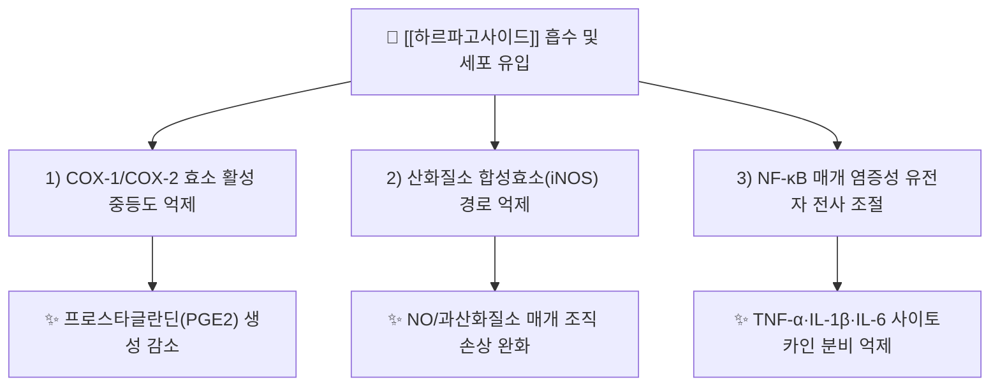

# 🔬 [[하르파고사이드]] (Harpagoside, C24H30O11)

> 🖼️ **이미지 규격(정본)**: `.agents\rules\이미지_가이드.md` §3.3 참조. **이미지 2장(2D 구조식·기원식물) 미확보** — 자동화(정원 가꾸기) 세션 특성상 소싱 생략. 작업기록 §결과에 사유 기재.

> **핵심 3줄 요약 (Key Summary)**:
> - 🌿 기원 본초 & 화학 계열: 남아프리카산 [[악마의발톱]](Devil's Claw, *Harpagophytum procumbens* Burch., 玄参科)의 저장뿌리(tuber)에 함유된 이리도이드 배당체(Iridoid glycoside). 국내 본초학 전통 처방에는 미포함되나 관절통 환자의 병용 건강식품 성분으로 임상에서 빈번히 접함.
> - 🎯 핵심 분자 표적 & 조절 경로: [[COX-1]]/COX-2 효소를 중등도로 억제하고 산화질소(NO) 생성을 저해하여 프로스타글란딘·류코트리엔 매개 통증-염증 캐스케이드를 완화.
> - 🩺 주요 약리 활성 & 질환 치료 기전: [[퇴행성 관절염]](OA) 및 비특이적 [[요통]](low back pain)에서 항염·진통 효과가 다수 RCT로 확인되어 유럽에서는 관절통 치료제로 공정서(ESCOP·독일 E-commission)에 등재됨.
> - ⚠️ 독성·생체이용률 한계 & 상호작용: 경구 생체이용률이 낮고 위산 분해에 취약하여 위장장애·위산과다 환자 주의, 항응고제([[와파린]]) 병용 시 이론적 출혈 위험 및 CYP3A4 상호작용 가능성 보고.

---

## 📌 목차
1. [기본 화학 정보 & 분자 구조식 (Chemical Identity)](#1-기본-화학-정보--분자-구조식-chemical-identity)
2. [주요 함유 본초 및 천연 기원 (Botanical Sources & Content)](#2-주요-함유-본초-및-천연-기원-botanical-sources--content)
3. [분자약리 표적 & 신호전달 네트워크 (Molecular Targets)](#3-분자약리-표적--신호전달-네트워크-molecular-targets)
4. [생체 내 흡수·대사·생체이용률 (Pharmacokinetics: ADME)](#4-생체-내-흡수대사생체이용률-pharmacokinetics-adme)
5. [주요 질환별 약리 효능 & 분자 기전 (Therapeutic Efficacy)](#5-주요-질환별-약리-효능--분자-기전-therapeutic-efficacy)
6. [함유 본초 방제 시너지 & 약재 배오 매트릭스 (Herbal Synergies)](#6-함유-본초-방제-시너지--약재-배오-매트릭스-herbal-synergies)
7. [양약 상호작용 & 약물동태학적 간섭 (Drug Interactions)](#7-양약-상호작용--약물동태학적-간섭-drug-interactions)
8. [💡 사용자 진료실 핵심 필기 & 임상 응용 팁 (Melt-In & High-Yield)](#8--사용자-진료실-핵심-필기--임상-응용-팁-melt-in--high-yield)
9. [출처 및 학술 참고 문헌 (References)](#9-출처-및-학술-참고-문헌-references)

---
## 1. 기본 화학 정보 & 분자 구조식 (Chemical Identity)

> [!abstract]+ 🧪 3D 약리 분자 구조 (Interactive 3D Viewer)
> <iframe src="https://molecule-viewer-rho.vercel.app/?cid=5281542" width="100%" height="450px" frameborder="0" allow="webgl" style="border-radius: 8px;"></iframe>

| 항목 | 상세 내용 |
| :--- | :--- |
| **IUPAC 명칭** | (1S,4aS,5R,7S,7aS)-1-(β-D-Glucopyranosyloxy)-4a,5-dihydroxy-7-methyl-1,4a,5,6,7,7a-hexahydrocyclopenta[c]pyran-7-yl (2E)-3-phenylprop-2-enoate |
| **분자식 / 분자량** | C24H30O11 / 494.49 g/mol |
| **PubChem CID** | [5281542](https://pubchem.ncbi.nlm.nih.gov/compound/5281542) |
| **CAS 등록 번호** | 19210-12-9 |
| **화학 골격 분류** | 이리도이드 배당체(Iridoid glycoside) — 신남산(계피산) 에스터를 가진 피란형 모노테르페노이드 배당체 |
| **물리화학적 성상** | 백색~미백색 결정성 분말, 극성 배당체로 수용성이나 산성 환경(위산)에서 신남산 에스터 결합이 가수분해되기 쉬움 |
| **식물 내 생합성 경로** | 모노테르펜 이리도이드 경로(8-oxogeranial → iridodial 유도체)를 거쳐 생성되며, 뿌리(저장근)의 페놀성 신남산(계피산)과 에스터 결합하여 harpagoside 형태로 축적 |

---
## 2. 주요 함유 본초 및 천연 기원 (Botanical Sources & Content)

| 함유 본초 (한글/한자) | 기원 식물학적 명칭 (과명 / 학명) | 주요 함유 약용 부위 | 지표 함량 (%) | 한의학적 귀경 및 약효 특성 |
| :--- | :--- | :--- | :--- | :--- |
| [[악마의발톱]](데블스클로) | 玄参科(Pedaliaceae) / *Harpagophytum procumbens* | 저장뿌리(Secondary tuberous root) | 0.5~3.0% (원산지·부위별 편차 큼) | 국내 본초학 미등재. 유럽 공정서(ESCOP/BHP)는 항염·소염·건위(苦味 소화 촉진) 효능으로 규정 |
| *Harpagophytum zeyheri* | 玄参科(Pedaliaceae) | 저장뿌리 | *H. procumbens*보다 낮음(교잡·혼입 시 품질 저하 원인) | 위품(僞品) 혼입 관리 대상 — 유럽약전은 두 종을 구분 규정 |

---
## 3. 분자약리 표적 & 신호전달 네트워크 (Molecular Targets)

### 1) 핵심 분자 표적 (Molecular Targets)
* **COX-1/COX-2 이중 억제**: 분자 도킹 연구에서 하르파고사이드가 COX-2 활성부위(active site)에 결합하여 아라키돈산 캐스케이드를 중등도로 차단함이 보고되었다(구조 기반 도킹 연구, ResearchGate 공개 논문).
* **NF-κB 및 사이토카인 네트워크 조절**: 관절 활막세포·대식세포 모델에서 NF-κB 활성화를 억제하여 TNF-α·IL-6 등 전염증성 사이토카인 발현을 감소시킨다는 최신 기전 리뷰가 발표됨(PMID [41391813](https://pubmed.ncbi.nlm.nih.gov/41391813/)).
* **연골 보호 작용**: 연골세포에서 MMP(matrix metalloproteinase) 발현을 억제하여 연골 기질 분해를 완화하는 것으로 보고된다.

---
## 4. 생체 내 흡수·대사·생체이용률 (Pharmacokinetics: ADME)

* **장관 흡수 및 위산 안정성**:
  * 신남산 에스터 결합이 위산(저pH) 조건에서 쉽게 가수분해되어 활성이 저하될 수 있어, 상용 제제는 **위산에 안정한 코팅(장용 코팅)** 형태로 제조되는 경우가 많다.
  * 경구 절대 생체이용률은 낮은 것으로 보고되며, 장내 미생물총에 의한 대사(에스터 가수분해 → 유리 계피산 및 이리도이드 아글리콘 생성)가 흡수 후 활성에 관여할 수 있다.
* **간 대사 및 소실**:
  * 간에서 글루쿠론산 포합(Phase II conjugation)을 거쳐 신장으로 배설되는 경로가 추정된다(정밀 인체 PK 자료는 제한적).

---
## 5. 주요 질환별 약리 효능 & 분자 기전 (Therapeutic Efficacy)

### 1) [[퇴행성 관절염]](Osteoarthritis) — 무릎·고관절
* 고관절·무릎 [[퇴행성 관절염]] 환자 대상 수성 추출물(아쿠아 엑스트랙트) 투여 연구에서 통증 및 기능 지표(WOMAC 등)가 유의하게 개선됨(PMID [14669250](https://pubmed.ncbi.nlm.nih.gov/14669250/)).
* 체계적 문헌고찰에서 골관절염에 대한 유효성과 안전성이 기존 [[NSAIDs]] 대비 위장관 부작용이 적은 대안으로 평가됨(PMID [17212570](https://pubmed.ncbi.nlm.nih.gov/17212570/), 최신 리뷰 PMID [42394971](https://pubmed.ncbi.nlm.nih.gov/42394971/)).
### 2) 비특이적 [[요통]](Nonspecific Low Back Pain)
* WS 1531 표준화 추출물이 급성 악화기 [[요통]]에서 위약 대비 통증 완화 효과를 보인 무작위배정 이중맹검 연구가 보고됨(European Journal of Anaesthesiology, Chrubasik 등).
* 감각·운동·혈관 근육 반응성에 대한 효과를 평가한 연구에서도 대증적 요통 완화 효과가 확인됨(PMID [11810324](https://pubmed.ncbi.nlm.nih.gov/11810324/)).
### 3) 만성 저강도 전신 염증 & 통증
* [[NSAIDs]]와의 비교 리뷰에서 코르티코스테로이드·NSAIDs 대비 위장관·심혈관 부작용 부담이 낮은 근골격계 통증 보조 요법으로 자리매김하고 있음(PMID [42394971](https://pubmed.ncbi.nlm.nih.gov/42394971/)).

---
## 6. 함유 본초 방제 시너지 & 약재 배오 매트릭스 (Herbal Synergies)

| 함유 본초 / 방제 | 공존 유효 성분군 | 분자약리 시너지 기전 | 전통 한의학적 효능 연계 |
| :--- | :--- | :--- | :--- |
| [[악마의발톱]] 단일제 | 하르파기드(Harpagide), 페놀 화합물 | COX 억제 + 항산화 상보 작용 | 국내 본초학 비수록(서양 전통약재) — 관절통 보조요법으로 국한 |
| 관절통 병용 한약(예: [[방기황기탕]] 등 활혈거어제) | [[방기]], [[황기]] | 항염 기전 상보(NF-κB↓ + 부종 개선) | 습담(濕痰)·풍한습(風寒濕) 비증(痺證) 보조 치료 개념과 병행 가능성 |

---
## 7. 양약 상호작용 & 약물동태학적 간섭 (Drug Interactions)

* **항응고제([[와파린]]) 병용 주의**: 이론적 항혈소판/항응고 상가작용 가능성이 문헌상 제기되어 출혈 경향 환자·항응고제 복용자는 병용 전 상담이 필요하다.
* **위산분비 억제제(PPI/H2 차단제) 병용 시**: 위산 pH 상승이 오히려 신남산 에스터 가수분해를 줄여 흡수·활성에 영향을 줄 가능성이 이론적으로 제기된다(임상적 유의성은 확립되지 않음).
* **당뇨약·항고혈압제**: 대규모 인체 상호작용 자료는 부족하며, 병용 시 일반적 모니터링이 권장된다.

---
## 8. 💡 사용자 진료실 핵심 필기 & 임상 응용 팁 (Melt-In & High-Yield)

> 🛡️ **Melt-In 원칙**: 신규 생성 노트로 원문 필기 없음. 향후 임상 필기 축적 시 이 섹션에 병합한다.

* **문진 포인트**: 관절통 환자가 "글루코사민·devil's claw·관절 건강기능식품"을 복용 중인지 확인 — NSAIDs·항응고제 병용 여부와 함께 점검한다.
* **한의 치료와의 통합 관점**: 서양 전통 관절통 약재로서 국내 처방 체계에는 없으나, 환자가 자가 복용 중인 경우 침·약침·한약 치료와의 병용 안전성 상담이 실제 임상에서 필요하다.

---
## 9. 출처 및 학술 참고 문헌 (References)

1. **Chrubasik S, Künzel O, Model A, Conradt C, Black A (2001)**. *Devil's claw... in the treatment of unspecific back pain*. [PMID 11810324](https://pubmed.ncbi.nlm.nih.gov/11810324/)
   - **[연구 요약]**: Harpagophytum procumbens LI 174 추출물의 비특이적 요통에서 감각·운동·혈관 근육 반응성 평가 연구.
2. **Chrubasik S et al. (2003)**. *Treatment of patients with arthrosis of hip or knee with an aqueous extract of devil's claw*. [PMID 14669250](https://pubmed.ncbi.nlm.nih.gov/14669250/)
   - **[연구 요약]**: 고관절·무릎 관절증 환자에서 수성 추출물의 통증·기능 개선 효과를 평가한 임상 연구.
3. **Gagnier JJ, van Tulder M, Berman B, Bombardier C (2007)**. *Devil's Claw for the treatment of low back pain: a systematic review*. 및 관련 리뷰 [PMID 17212570](https://pubmed.ncbi.nlm.nih.gov/17212570/)
   - **[연구 요약]**: 골관절염 치료제로서 Devil's Claw의 유효성·안전성을 문헌적으로 종합 평가.
4. **저자 미상(2026)**. *Harpagophytum procumbens in musculoskeletal disorders: current evidence and comparison with NSAIDs*. [PMID 42394971](https://pubmed.ncbi.nlm.nih.gov/42394971/)
   - **[연구 요약]**: 근골격계 질환에서 NSAIDs와 Devil's claw의 유효성·안전성 프로파일을 비교한 최신(2026) 리뷰.
5. **저자 미상(2026)**. *Decoding the mechanistic landscape of harpagoside: From molecular targets to translational pharmacology*. [PMID 41391813](https://pubmed.ncbi.nlm.nih.gov/41391813/)
   - **[연구 요약]**: 하르파고사이드의 분자 표적(COX, NF-κB 등)을 정리한 중개 약리학 리뷰.
6. **ESCOP Monographs / 독일 Commission E**. *Harpagophyti radix (Devil's Claw Root)*.
   - **[공인 데이터]**: 유럽 공정서 기준 관절통·소화불량 적응증 및 표준 추출물 규격.
