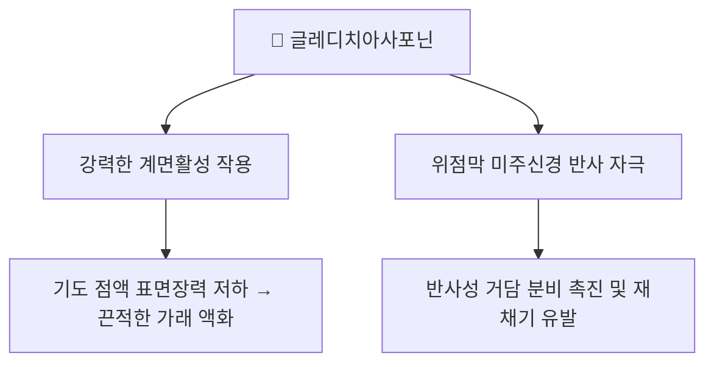

---
aliases:
  - Gleditsiasaponin
  - Gleditsia saponin
  - 글레디치아사포닌
tags:
  - 약리
  - 약리성분
  - 사포닌
title: 글레디치아사포닌
date: 2026-09-19
출처: "https://molecule-viewer-rho.vercel.app/?cid=44584163\""
---

# 🔬 글레디치아사포닌 (Gleditsiasaponin)

> **핵심 3줄 요약 (Key Summary)**:
> - 🌿 기원 본초 & 화학 계열: [[조협]](皂莢)·[[조각자]](皂角刺)(콩과 *Gleditsia sinensis*, 주엽나무) 열매·가시에 함유된 트리테르펜 비스데스모사이드 [[사포닌]]군(Gleditsiasaponin B~H 등 다수의 유사체 존재).
> - 🎯 핵심 분자 표적: 강력한 계면활성(surfactant) 특성으로 기도 점액의 표면장력을 급격히 낮추어 끈적한 가래를 액화시키며, 위점막 미주신경을 자극해 반사성 거담·재채기를 유도.
> - 🩺 주요 약리 활성: 거담(祛痰) 작용 외에도, 종양세포에서 Fas 매개 사멸수용체 경로 및 미토콘드리아 경로를 통한 세포자멸사(apoptosis) 유도 효과가 백혈병 세포주 등에서 보고됨.
> - ⚠️ 독성 주의: 사포닌 특유의 용혈(hemolysis) 작용을 가질 수 있어, 조협·조각자는 예로부터 소량·법제 후 신중하게 사용해온 약재이며 과량 사용 시 구토·설사 등 위장관 자극이 나타날 수 있음.

---

## 📌 목차
1. [기본 화학 정보 & 분자 구조식 (Chemical Identity)](#1-기본-화학-정보--분자-구조식-chemical-identity)
2. [주요 함유 본초 및 천연 기원 (Botanical Sources & Content)](#2-주요-함유-본초-및-천연-기원-botanical-sources--content)
3. [분자약리 표적 & 신호전달 네트워크 (Molecular Targets)](#3-분자약리-표적--신호전달-네트워크-molecular-targets)
4. [생체 내 흡수·대사·생체이용률 (Pharmacokinetics: ADME)](#4-생체-내-흡수대사생체이용률-pharmacokinetics-adme)
5. [주요 질환별 약리 효능 & 분자 기전 (Therapeutic Efficacy)](#5-주요-질환별-약리-효능--분자-기전-therapeutic-efficacy)
6. [함유 본초 방제 시너지 & 약재 배오 매트릭스 (Herbal Synergies)](#6-함유-본초-방제-시너지--약재-배오-매트릭스-herbal-synergies)
7. [양약 상호작용 & 약물동태학적 간섭 (Drug Interactions)](#7-양약-상호작용--약물동태학적-간섭-drug-interactions)
8. [💡 사용자 진료실 핵심 필기 & 임상 응용 팁 (Melt-In & High-Yield)](#8--사용자-진료실-핵심-필기--임상-응용-팁-melt-in--high-yield)
9. [출처 및 학술 참고 문헌 (References)](#9-출처-및-학술-참고-문헌-references)

---

## 1. 기본 화학 정보 & 분자 구조식 (Chemical Identity)

> [!abstract]+ 🧪 3D 약리 분자 구조 (Interactive 3D Viewer)
> <iframe src="https://molecule-viewer-rho.vercel.app/?cid=44584163" width="100%" height="450px" frameborder="0" allow="webgl" style="border-radius: 8px;"></iframe>
> *(대표 유사체인 Gleditsia saponin C 기준)*

| 항목 | 상세 내용 |
| :--- | :--- |
| **화학 골격 분류** | 트리테르펜 비스데스모사이드 [[사포닌]](올레아난형 골격, 당사슬 결합) |
| **대표 유사체** | Gleditsiasaponin B~H 등 다수의 구조 유사체가 존재하는 사포닌 복합체군 |
| **관련 화합물 예시 PubChem CID** | Gleditsia saponin C — [44584163](https://pubchem.ncbi.nlm.nih.gov/compound/Gleditsia-saponin-C) (유사체 중 하나의 대표 등록 예시) |
| **분자식 / 분자량 (Gleditsia saponin C)** | C₉₄H₁₄₈O₄₃ / 약 1966.2 g/mol (PubChem 등록 정보) |

⚠️ 내용 검토 필요: "글레디치아사포닌"은 단일 화합물이 아니라 유사 구조의 사포닌 복합체군을 통칭하는 명칭으로 사용되는 경우가 많아, 개별 성분의 정확한 CAS 번호·분자식은 문헌별 지칭 대상에 따라 다를 수 있습니다.

---

## 2. 주요 함유 본초 및 천연 기원 (Botanical Sources & Content)

| 함유 본초 | 기원 식물학적 명칭 | 주요 함유 부위 | 한의학적 귀경 및 약효 특성 |
| :--- | :--- | :--- | :--- |
| [[조협]] (皂莢) | 콩과 / *Gleditsia sinensis* | 열매(협과) | 폐·대장경 귀경, 거풍화담(祛風化痰)·통규개폐(通竅開閉) |
| [[조각자]] (皂角刺) | 콩과 / *Gleditsia sinensis* | 가시(자) | 소종배농(消腫排膿)·거풍살충(祛風殺蟲) |

---

## 3. 분자약리 표적 & 신호전달 네트워크 (Molecular Targets)

### 1) 거담 기전 (계면활성 + 미주신경 반사)
* [[조협]] 노트에 기술된 바와 같이, 글레디치아사포닌은 강력한 계면활성 능력으로 기도 점액의 표면장력을 급격히 낮추어 끈적한 가래 덩어리를 액화시키며, 위점막 미주신경 반사를 통해 거담 분비를 극대화하는 것으로 제시됩니다.

### 2) 혈관내피세포 이동 억제 신호경로 (글레디치오사이드 B)
* 조각자에서 분리된 트리테르펜 사포닌 글레디치오사이드 B(Gleditsioside B)는 HUVEC(제대정맥 내피세포)의 bFGF 유도 이동을 억제하며, MMP-2의 발현·활성을 낮추고 TIMP-1 발현을 높이며 FAK·ERK·PI3K·AKT의 인산화를 억제하는 것으로 보고되었습니다(세포 수준 연구, Tong 2013).

---

## 4. 생체 내 흡수·대사·생체이용률 (Pharmacokinetics: ADME)

⚠️ 내용 검토 필요: 글레디치아사포닌 개별 성분의 인체·동물 정량 약동학(흡수율·반감기·생체이용률) 데이터는 PubMed 검색 기준 확인되지 않았습니다. 사포닌류는 일반적으로 분자량이 큰 배당체이나, 이 성분군에 대해서는 실측 자료 없이 추정하여 서술하지 않습니다.

---

## 5. 주요 질환별 약리 효능 & 분자 기전 (Therapeutic Efficacy)

### 1) 거담 및 응급 통규(通竅) 용법
글레디치아사포닌은 [[조협]]·[[조각자]]의 거풍화담·통규개폐 효능을 뒷받침하는 핵심 사포닌 성분으로, 완고한 담음(痰飮)이 막혀 인사불성이나 심한 천식·가래에 응급으로 코에 불어넣어 재채기를 유발시키는 통규(通竅) 용법의 현대 약리학적 근거로 다뤄집니다.

### 2) 항종양 연구
일부 연구에서 조각자 유래 사포닌이 백혈병 세포주 등에서 Fas 매개 사멸수용체 경로 및 미토콘드리아 경로를 통한 세포자멸사(apoptosis)를 유도한다는 결과가 보고되었습니다. 또한 조각자에서 분리된 트리테르펜 사포닌(글레디치오사이드 B 등)이 혈관내피세포의 이동을 억제해 MMP-2·FAK 활성화를 차단하는 항혈관신생 관련 기전도 연구된 바 있습니다.

* *G. sinensis* 이형 열매에서 분리한 사포닌 13종을 6종의 종양세포주에 대한 세포독성(MTT)과 HL-60 세포의 세포자멸사 유도(유세포분석)로 평가해 구조-활성 관계를 확인한 연구가 있습니다(Zhong 2004).

⚠️ 내용 검토 필요: 항종양 관련 연구는 대부분 세포주 수준의 초기 연구로, 임상적 항암 효과가 확립된 것은 아닙니다.

---

## 6. 함유 본초 방제 시너지 & 약재 배오 매트릭스 (Herbal Synergies)

볼트 내 처방 노트에서 확인된 조협·조각자 함유 처방은 아래와 같습니다.

| 함유 본초 / 방제 | 볼트 내 확인된 구성·역할 | 글레디치아사포닌 연계 |
| :--- | :--- | :--- |
| [[조협환]] | [[조협]](군약) + [[대추]](좌사약) 2미 환제 | 조협 사포닌의 기도 점막 계면활성 작용을 이용한 응급 거담 |
| [[선방활명음]] | [[금은화]], [[당귀]], [[천화분]], 유향, 몰약, [[조각자]] 등 | 조각자의 소종배농(消腫排膿) 효능을 옹저 초기 복합방에 활용 |
| [[청상방풍탕]] | 염증이 크고 단단하게 뭉친 경우 [[금은화]], [[포공영]], [[조각자]] 가미 | 조각자의 소종투농 효능 활용 |

---

## 7. 양약 상호작용 & 약물동태학적 간섭 (Drug Interactions)

⚠️ 내용 검토 필요: 글레디치아사포닌과 양약 간의 약물 상호작용에 대해 확립된 인체 연구는 확인되지 않았습니다. 핵심 요약에 기재된 바와 같이 사포닌 특유의 용혈 작용 및 위장관 자극(구토·설사) 가능성이 있으므로, 위장관 점막 손상 위험이 있는 약제(예: NSAIDs 등)와의 병용 시에는 임상적으로 신중을 기하는 것이 합리적이나 이는 이론적 우려일 뿐 실측 근거는 아닙니다.

---

## 8. 💡 사용자 진료실 핵심 필기 & 임상 응용 팁 (Melt-In & High-Yield)

* 조협·조각자의 통규(通竅) 용법은 응급 상황(인사불성, 심한 천식·가래)에서 코에 불어넣어 재채기를 유발하는 방식이며, 이는 글레디치아사포닌의 반사성 거담·재채기 유도 작용과 연결하여 이해할 수 있음.
* 조각자는 소종배농 효능으로 옹저·창양에 가미하여 활용하며, 조협은 거담개규 목적의 환제([[조협환]])로 활용.
* 용혈·위장관 자극 가능성 때문에 소량·법제 후 사용하고 과량을 피하는 것이 전통적 원칙.

---

## 9. 출처 및 학술 참고 문헌 (References)

1. **Zhang JP, et al. (2016)**. *Gleditsia species: An ethnomedical, phytochemical and pharmacological review*. **J Ethnopharmacol**, 178:155-171. PMID: [26643065](https://pubmed.ncbi.nlm.nih.gov/26643065/) · ScienceDirect: [https://www.sciencedirect.com/science/article/abs/pii/S0378874115302452](https://www.sciencedirect.com/science/article/abs/pii/S0378874115302452)
   - **[연구 요약]**: *Gleditsia* 속 식물(조협·조각자 포함)의 전통 활용, 함유 사포닌 성분, 약리 활성을 종합한 리뷰.
2. **Zhong L, Li P, Han J (2004)**. *Structure-activity relationships of saponins from Gleditsia sinensis in cytotoxicity and induction of apoptosis*. **Planta Med**, 70(9):797-802. PMID: [15386187](https://pubmed.ncbi.nlm.nih.gov/15386187/)
   - **[연구 요약]**: *G. sinensis* 이형 열매에서 분리한 사포닌 13종의 종양세포주 세포독성 및 HL-60 세포자멸사 유도를 평가해 구조-활성 관계를 규명한 연구.
3. **Tong B, et al. (2013)**. *Gleditsioside B, a triterpene saponin isolated from the anomalous fruits of Gleditsia sinensis Lam., abrogates bFGF-induced endothelial cell migration*. **Vascul Pharmacol**, 58(1-2):118-126. PMID: [23026290](https://pubmed.ncbi.nlm.nih.gov/23026290/)
   - **[연구 요약]**: 글레디치오사이드 B가 MMP-2·FAK 활성화를 ERK 및 PI3K/AKT 경로 차단을 통해 억제함으로써 HUVEC 이동을 억제함을 보고한 세포 수준 연구.

<!-- 보관 태그(1회용·링크오류, 필요시 복원): 조협, 조각자 -->
