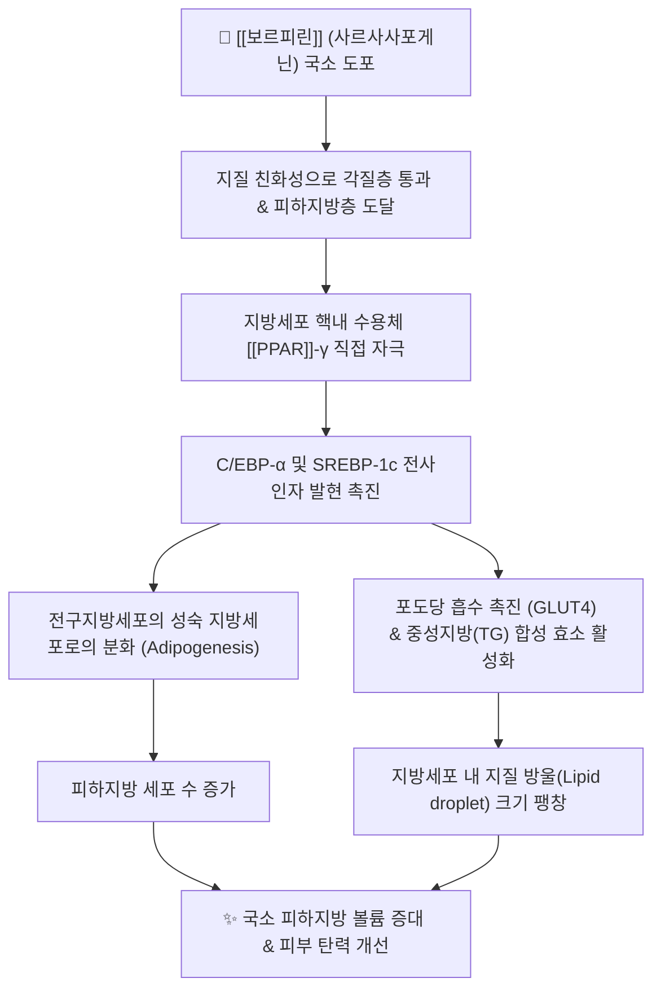

---
aliases:
  - 보르피린
  - Volufiline
  - 사르사사포게닌
  - Sarsasapogenin
tags:
  - 약리
  - 약리성분
  - 스테로이드사포닌
  - 지질대사
  - 지모
title: 보르피린
date: 2026-09-21
출처: PMID 35335393
---
# 💊 [[보르피린]] (Volufiline, Sarsasapogenin 복합체)

> **핵심 요약 (Key Summary)**:
> 백합과 본초인 [[지모]](*Anemarrhena asphodeloides*) 뿌리줄기에서 추출한 스테로이드 사포닌 사르사사포게닌(Sarsasapogenin)을 핵심 활성 물질로 함유한 특허 지용성 미용약리 복합 원료.
> 전구지방세포(Preadipocyte)의 [[PPAR]]-γ 활성화 및 C/EBP-α 경로 자극을 통해 지방세포 분화(Adipogenesis)와 세포 내 중성지방 지질 축적을 국소적으로 촉진.
> 호르몬성 부작용 없이 국소 지방 볼륨 증대, 피부 주름 개선, 가슴·엉덩이 탄력 개선 및 지모 고유의 청열자음(淸熱滋陰) 약리와 연계.
> ⚠️ 내용 검토 필요: 위 두 번째·세 번째 줄(PPAR-γ 활성화·지방세포 분화 촉진, 호르몬 비의존성)은 PubMed 검색에서 사르사사포게닌 단독 근거를 확인하지 못했습니다. 확인된 문헌은 오히려 지방조직 염증 억제·인슐린 저항성 개선(Yu 2021)과 동족 사포게닌·티모사포닌의 지방분화 억제(Zhou 2007, Park 2024) 방향이며, 랫드 성조숙증 모델에서 성선축(LH·FSH·E2)을 낮춘다는 보고(Hu 2020)도 있습니다. 상세는 §3·§5 참조.

---

## 📌 목차
1. [기본 화학 정보 & 분자 구조식 (Chemical Identity)](#1-기본-화학-정보--분자-구조식-chemical-identity)
2. [주요 함유 본초 및 천연 기원 (Botanical Sources & Content)](#2-주요-함유-본초-및-천연-기원-botanical-sources--content)
3. [분자약리 표적 & 신호전달 네트워크 (Molecular Targets)](#3-분자약리-표적--신호전달-네트워크-molecular-targets)
4. [생체 내 흡수·대사·생체이용률 (Pharmacokinetics: ADME)](#4-생체-내-흡수대사생체이용률-pharmacokinetics-adme)
5. [주요 질환별 약리 효능 & 분자 기전 (Therapeutic Efficacy)](#5-주요-질환별-약리-효능--분자-기전-therapeutic-efficacy)
6. [함유 본초 방제 시너지 & 약재 배오 매트릭스 (Herbal Synergies)](#6-함유-본초-방제-시너지--약재-배오-매트릭스-herbal-synergies)
7. [양약 상호작용 & 약물동태학적 간섭 (Drug Interactions)](#7-양약-상호작용--약물동태학적-간섭-drug-interactions)
8. [💡 사용자 진료실 핵심 필기 & 임상 응용 팁 (Melt-In & High-Yield)](#8--사용자-진료실-핵심-필기--임상-응용-팁-melt-in--high-yield)
9. [출처 및 학술 참고 문헌 (References)](#9-출처-및-학술-참고-문헌-references)

---

## 1. 기본 화학 정보 & 분자 구조식 (Chemical Identity)

> [!abstract]+ 🧪 3D 약리 분자 구조 (Interactive 3D Viewer)
> <iframe src="https://molecule-viewer-rho.vercel.app/?cid=92095" width="100%" height="450px" frameborder="0" allow="webgl" style="border-radius: 8px;"></iframe>

| 항목 | 상세 내용 |
| :--- | :--- |
| **원료명 (Trade Name)** | [[보르피린]] (Volufiline™ - 프랑스 Sederma사 특허 원료) |
| **핵심 유효 성분** | 사르사사포게닌 (Sarsasapogenin, 식물성 스테로이드 스피로스탄 사포닌) |
| **기원 본초** | 백합과 [[지모]](*Anemarrhena asphodeloides* Bunge)의 근경 |
| **주요 배합 베이스** | 하이드로제네이티드 폴리아이소부텐(Hydrogenated Polyisobutene)에 사르사사포게닌을 지용성으로 용해 |
| **IUPAC 명칭 (사르사사포게닌)** | (1R,2S,4S,5'S,6R,7S,8R,9S,12S,13S,16S,18R)-5',7,9,13-tetramethylspiro[5-oxapentacyclo[10.8.0.0²,⁹.0⁴,⁸.0¹³,¹⁸]icosane-6,2'-oxane]-16-ol (PubChem 등록명) |
| **화학식 / 분자량 (사르사사포게닌)** | $\text{C}_{27}\text{H}_{44}\text{O}_3$ / 416.64 g/mol |
| **PubChem CID** | [92095](https://pubchem.ncbi.nlm.nih.gov/compound/92095) (Sarsasapogenin, PubChem 확인. 동의어 Parigenin) |
| **CAS 등록 번호** | 126-19-2 (PubChem 동의어 기준) |
| **화학 골격 분류** | 스피로스탄계 스테로이드 사포게닌(사포닌의 비당체). 원문은 "스피로스탄 사포닌"으로 표기했으나, 사르사사포게닌은 티모사포닌 A-III 등 사포닌에서 당이 떨어진 아글리콘입니다([[사포닌]] 참조) |
| **물리화학적 성상** | 투명~미황색의 점조성 지용성 액체, 에탄올 및 지질에 가용, 수불용성 (PubChem 계산 XLogP 6.5로 고지용성) |
| **식물 내 생합성 경로** | 원문에 별도 서술 없음 (Mustafa 2022 종설이 사르사사포게닌의 화학·생합성을 다룸) |

> [!warning] ⚠️ 내용 검토 필요
> - **3D 뷰어 CID 정정**: 기존 CID 5281767은 PubChem에서 커큐민(C21H20O6)이어서 사르사사포게닌(CID 92095, C27H44O3)으로 바로잡았습니다.
> - **"Volufiline™ 특허 원료" 및 "폴리아이소부텐 베이스" 서술은 검증하지 못했습니다.** PubMed에서 'volufiline' 검색 결과가 0건이고 PubChem 동의어에도 없습니다. 제품 조성이 순수 사르사사포게닌 용액인지, 지모 추출물인지는 제조사 자료로 확인해야 합니다.

---

## 2. 주요 함유 본초 및 천연 기원 (Botanical Sources & Content)

| 함유 본초 (한글/한자) | 기원 식물학적 명칭 (과명 / 학명) | 주요 함유 약용 부위 | 지표 함량 (%) | 한의학적 귀경 및 약효 특성 |
| :--- | :--- | :--- | :--- | :--- |
| [[지모]] (知母) | 백합과 (Liliaceae, 최근 문헌은 Asparagaceae로 표기) / *Anemarrhena asphodeloides* Bunge | 근경(뿌리줄기) | ⚠️ 사르사사포게닌 함량 미확인 | 청열사화(淸熱瀉火), 생진윤조(生津潤燥), 자신강화(滋腎降火)의 대표 본초 |

* **기원 본초: [[지모]](知母, *Anemarrhena asphodeloides*)**:
  * 한의학에서 지모는 청열사화(淸熱瀉火), 생진윤조(生津潤燥), 자신강화(滋腎降火)의 대표 본초.
  * 뼛속의 허열을 끄고 체내 마른 진액을 채워주는 지모의 윤조(潤燥, 마른 것을 적셔 채움) 효능이 현대 분자생물학적으로 피부와 피하지방의 볼륨을 채우는 사르사사포게닌의 약리와 절묘하게 일치.
  * ⚠️ 위 마지막 문장은 한의학적 유비(類比)이며, "피하지방 볼륨을 채우는 약리"는 §3·§5의 검토 사항처럼 문헌으로 확인되지 않았습니다.
* **성분 관계**: 지모의 사포닌 티모사포닌 A-III가 장내세균에 의해 사르사사포게닌으로 대사된다고 보고되었습니다(Lim 2015). 지모 노트의 성분 설명은 [[지모]]를 참조하세요.

---

## 3. 분자약리 표적 & 신호전달 네트워크 (Molecular Targets)

> [!warning] ⚠️ 내용 검토 필요
> 위 도식은 원문 그대로 보존한 것이며, **PubMed에서 사르사사포게닌이 PPAR-γ를 직접 자극하거나 지방세포 분화를 촉진한다는 논문을 찾지 못했습니다.** 아래 "확인된 문헌"과 방향이 다릅니다.

### 1) 핵심 분자 표적 (Molecular Targets)

* **PPAR-$\gamma$ 경로 자극을 통한 지방세포 분화 촉진**:
  * 사르사사포게닌이 지방 대사의 마스터 조절자인 [[PPAR]]-γ(Peroxisome proliferator-activated receptor gamma)를 활성화하여 섬유아세포성 전구지방세포가 지질을 저장할 수 있는 성숙 지방세포로 분화하도록 유도.
  * ⚠️ 미확인. 원문 참고문헌(Timon-Gomez 2017)은 PubMed에서 확인되지 않아 삭제했습니다.
* **지방 축적 및 지질 방울 팽창**:
  * 세포 내 지질 축적 효소인 아실-CoA 합성효소 및 디아실글리세롤 아실전이효소(DGAT)를 활성화하여 혈류 내 지방산을 세포 내 중성지방으로 변환 축적.
  * ⚠️ 미확인. 사르사사포게닌의 GLUT4 매개 포도당 흡수 촉진·DGAT 활성화 문헌을 찾지 못했습니다.
* **비호르몬성 작용 기전 (Estrogen-independent)**:
  * 에스트로겐 수용체(ER)나 프로게스테론 수용체에 직접 결합하지 않으므로, 유방암, 자궁내막증, 호르몬 교란 위험 없이 안전하게 지방 조직의 리모델링 유도.
  * ⚠️ 수용체 결합 여부는 미확인입니다. 랫드 성조숙증 모델에서 사르사사포게닌이 Kiss-1/GPR54 계통을 거쳐 [[GnRH]]·[[LH]]·[[FSH]]와 [[에스트로겐]](E2) 수치를 낮췄다는 보고가 있어(Hu 2020) "호르몬 교란이 없다"는 단정은 어렵습니다.

### 2) 확인된 문헌 (Verified Evidence, 이번 검증에서 추가)

* **지방조직 염증·인슐린 저항성 (Yu 2021)**: 사르사사포게닌은 티모사포닌 A-III의 장내 대사체입니다. 고지방식 마우스에 80 mg/kg/일을 6주 경구 투여했을 때 지방조직 대식세포 침윤이 줄고 인슐린 저항성이 개선되었으며, 지방세포에서 IKK/[[NF-κB]]와 JNK 경로의 비활성화가 기전으로 제시되었습니다. 지방분화를 촉진했다는 결과는 아닙니다.
* **염증 신호 (Lim 2015)**: 티모사포닌 A-III와 그 대사체 사르사사포게닌이 LPS 자극 대식세포에서 [[NF-κB]]와 [[MAPK pathway]] 활성화를 억제하고 LPS의 [[TLR4]] 결합을 억제했으며, 마우스 대장염에서 Th17/Treg 균형을 회복시켰습니다. 사르사사포게닌의 항염 작용이 티모사포닌 A-III보다 강했다고 보고되었습니다.
* **동족 성분의 지방분화 억제**: 티고제닌(tigogenin, 관련 스피로스탄 사포게닌)은 마우스 골수 기질세포에서 PPARγ2와 aP2 발현을 낮춰 지방분화를 억제했습니다(Zhou 2007). 티모사포닌 A-III는 3T3-L1 지방세포에서 지질 축적을 억제하고 FAS·SREBP1c 발현을 낮췄습니다(Park 2024). 두 논문은 사르사사포게닌 자체를 다룬 것이 아니므로 참고용입니다.
* **성선축 (Hu 2020)**: 다나졸로 유도한 랫드 성조숙증 모델에서 사르사사포게닌이 질 개구 시기를 늦추고 자궁·난소 계수를 줄였으며, 시상하부 GnRH, Kiss-1, 뇌하수체 GnRH-R 발현과 혈청 호르몬 수치를 낮췄습니다.

---

## 4. 생체 내 흡수·대사·생체이용률 (Pharmacokinetics: ADME)

* **국소 도포 후 경피 흡수**: 원문에 별도 서술 없음. ⚠️ 사르사사포게닌의 경피·피하지방 침투를 다룬 문헌은 이번 검색에서 확인하지 못했습니다(§1의 XLogP 6.5는 계산값이며 침투 근거가 아닙니다).
* **장내 미생물총 대사 전환**:
  * 경구로 들어간 티모사포닌 A-III가 장내세균에 의해 사르사사포게닌으로 전환된다고 보고되었습니다(Lim 2015, Yu 2021이 이를 전제로 인용).
* **모(母)사포닌의 낮은 생체이용률**:
  * 티모사포닌 A-III는 랫드 경구 절대 생체이용률이 9.18%였고(Cmax 120.90 ng/mL, Tmax 8시간, t½ 9.94시간), 낮은 투과성·용해도와 P-gp 매개 유출이 원인으로 제시되었습니다(Wang 2021).
* **P-gp 상호작용**:
  * MDCK-MDR1 세포 실험에서 티모사포닌 A-III, 티모사포닌 BII, 망기페린, 바오후오사이드 I은 P-gp 기질로 확인되었으나, 사르사사포게닌은 Rh-123 유출비에 통계적 차이를 보이지 않았습니다(Dai 2022).
* ⚠️ 사르사사포게닌 단독의 인체·동물 약동학 수치(Cmax, t½, 생체이용률)는 확인하지 못했습니다. 검색된 UPLC-MS/MS 약동학 논문은 합성 유도체(Sarsasapogenin-AA13·AA22)를 다룬 것이라 인용하지 않았습니다.

---

## 5. 주요 질환별 약리 효능 & 분자 기전 (Therapeutic Efficacy)

### 1) 국소 피하지방 볼륨 보충 및 에스테틱 응용 (원문)

* **국소 피하지방 볼륨 보충 (Lipo-filling 효과)**:
  * 꺼진 눈밑 볼륨 개선, 팔자주름 및 이마 볼륨 보충, 볼살 꺼짐 완화.
  * 바스트(가슴) 및 힙(엉덩이) 라인의 탄력 및 국소 볼륨 증대 크림.
* **피부 노화 방지 및 진피 지지구조 강화**:
  * 피하지방층이 얇아져 피부가 처지고 늘어지는 노인성 피부 위축증 완화.

> [!warning] ⚠️ 내용 검토 필요
> 위 임상 적응증(볼륨 증대, 가슴·엉덩이 탄력, 피부 위축 완화)을 뒷받침하는 PubMed 인덱스 논문을 찾지 못했습니다('volufiline' 0건, 'sarsasapogenin adipogenesis' 0건). 제조사 시험 자료가 있더라도 동료 심사 문헌으로 검증되지 않았습니다.

### 2) 확인된 약리 효능 (동물·세포 수준)

* **인슐린 저항성 & 지방조직 염증**: 고지방식 마우스에서 인슐린 저항성 개선과 지방조직 염증 완화(Yu 2021, [[인슐린 저항성]] 참조). 지방세포·대식세포 상호작용 차단이 in vitro에서 확인되었습니다.
* **염증성 장질환**: 마우스 TNBS 대장염에서 대장 단축·MPO 활성·[[NF-κB]] 활성과 IL-1β, TNF-α, IL-6를 줄이고 IL-10을 높였습니다(Lim 2015).
* **알레르기성 피부염 (국소 도포)**: DNFB 유도 아토피 피부염 마우스에서 사르사사포게닌과 플루티카손 병용이 귀 두께·혈청 IgE·사이토카인을 낮췄습니다(Mandlik 2021, [[아토피 피부염]] 참조). 마우스 실험이며 사람 자료는 아닙니다.
* **성조숙증 모델 (랫드)**: 성선축 조절을 통한 성조숙증 완화(Hu 2020). 성선 호르몬에 영향을 주는 성분이라는 점에서 원문의 "호르몬성 부작용 없음"과 함께 검토가 필요합니다.
* **종설**: 사르사사포게닌은 항염·항암·항당뇨·파골세포 억제·신경보호 활성을 가진 것으로 요약되나, 임상시험·약동학·부작용 평가가 더 필요하다고 명시되어 있습니다(Mustafa 2022).

---

## 6. 함유 본초 방제 시너지 & 약재 배오 매트릭스 (Herbal Synergies)

* **배합 처방 (원문)**:
  * [[육미지황탕]]에 지모, 황백을 가미한 [[지백지황환]]에서 음액을 보태고 열을 내리는 보음 약리로 운용.

| 함유 본초 / 방제 | 공존 유효 성분군 | 분자약리 시너지 기전 | 전통 한의학적 효능 연계 |
| :--- | :--- | :--- | :--- |
| [[지모]] | 티모사포닌 A-III, 망기페린 (성분 상세는 [[지모]] 참조) | ⚠️ 사르사사포게닌과의 시너지 기전은 미확인. 지모 추출물 내 7개 성분의 P-gp 유출비가 추출물 공존 시 3.00~1.08에서 1.92~0.48로 낮아졌다는 in vitro 결과가 있음(Dai 2022) | 청열사화, 자음윤조 |
| [[지백지황환]] | [[지모]], [[황백]] (볼트 처방 노트에서 구성 확인) | ⚠️ 미확인 | 육미지황탕 골격에 지모·황백을 더해 음허화왕의 허열을 끄고 진액을 복구 |
| [[백호탕]] | [[지모]] (볼트 처방 노트에서 구성 확인) | ⚠️ 미확인 | 석고의 청열 작용을 지모의 자음윤조가 보조 |
| [[자음강화탕]] | [[지모]], [[황백]] (볼트 처방 노트에서 구성 확인) | ⚠️ 미확인 | 사물탕 보혈에 지모·황백 사화청열을 배오 |

> 위 처방의 구성은 볼트 내 각 처방 노트를 기준으로 확인했으며, 이 성분(사르사사포게닌)의 함량이나 처방 내 기여도는 문헌이 없어 기재하지 않았습니다.

---

## 7. 양약 상호작용 & 약물동태학적 간섭 (Drug Interactions)

### 1) 외용 안전성 (원문)

* **국소 외용 안전성**:
  * 전신 흡수율이 낮고 국소 피하지방에 작용하므로 전신 대사에 미치는 영향이 극히 적음.
  * 호르몬 비의존성이 입증되어 안전한 화장품 및 외용 의약외품 원료로 사용됨.
* **피부 트러블 주의**:
  * 고농도 지용성 베이스이므로 여드름성 지성 피부 부위에 바를 경우 모공 폐쇄로 인한 면포(비립종, 여드름) 유발 가능.

> [!warning] ⚠️ 내용 검토 필요
> "전신 흡수율이 낮다"와 "호르몬 비의존성이 입증되었다"는 서술은 문헌으로 확인하지 못했습니다(§3·§4 참조). 오히려 랫드 성조숙증 모델에서 성선 호르몬 수치를 낮춘 보고가 있어(Hu 2020) 호르몬 관련 병력이 있는 사용자에게는 주의가 필요합니다.

### 2) 확인된 상호작용 자료 (지모 성분 수준)

* **P-gp**: 사르사사포게닌은 MDCK-MDR1 세포에서 P-gp 기질도 억제제도 아니었으나, 지모의 티모사포닌 A-III, 티모사포닌 BII, 망기페린 등은 P-gp 기질이거나 P-gp 기능을 억제했습니다(Dai 2022). 지모 추출물 형태로 복용할 때 P-gp 기질 약물과의 상호작용 가능성은 있으나, 임상 자료는 없습니다.
* **CYP450**: 지모의 비스테로이드성 사포닌인 아네마사포닌 BII는 사람 간 마이크로솜에서 [[CYP3A4]], CYP2D6, CYP2E1을 억제했습니다(Wang 2020). 사르사사포게닌 자체의 CYP 억제 자료는 확인하지 못했습니다.
* **타목시펜 (마우스)**: 백합·지모(지모 포함 처방) 제제가 타목시펜의 유방암 억제 효과를 약화시키고 활성 대사체(엔독시펜, 4-OH-타목시펜) 농도를 낮췄으며, 지모 성분 망기페린이 간 마이크로솜 CYP450 활성을 억제했습니다(Li 2019). 처방 수준 동물 연구이며 사르사사포게닌 단독 결과가 아닙니다.
* **병용 시 고려사항**: 항암 호르몬 치료제(타목시펜 등) 복용자나 성호르몬 민감성 질환 병력이 있는 경우 지모 유래 제제 병용 전 확인이 필요합니다. 이는 위 문헌에 근거한 주의이며 임상 가이드라인은 확인하지 못했습니다.

---

## 8. 💡 사용자 진료실 핵심 필기 & 임상 응용 팁 (Melt-In & High-Yield)

* **사용자 원문 필기**: 이 노트에는 원장님의 별도 수기·진료실 필기가 없었습니다. 필기를 추가할 경우 이 자리에 옮겨 주세요.

---

## 9. 출처 및 학술 참고 문헌 (References)

1. **Mustafa NH, Sekar M, Fuloria S, et al. (2022)**. Chemistry, Biosynthesis and Pharmacology of Sarsasapogenin: A Potential Natural Steroid Molecule for New Drug Design, Development and Therapy. ***Molecules***, 27(6):2032. [PMID 35335393](https://pubmed.ncbi.nlm.nih.gov/35335393/) · [DOI](https://doi.org/10.3390/molecules27062032)
   - **[연구 요약]**: 사르사사포게닌의 화학·생합성·약리를 정리한 종설(항염·항암·항당뇨·파골세포 억제·신경보호, 성조숙증 잠재력). 임상시험·약동학·부작용 평가가 더 필요하다고 명시.
2. **Yu YY, Cui SC, Zheng TN, et al. (2021)**. Sarsasapogenin improves adipose tissue inflammation and ameliorates insulin resistance in high-fat diet-fed C57BL/6J mice. ***Acta Pharmacol Sin***, 42(2):272-281. [PMID 32699264](https://pubmed.ncbi.nlm.nih.gov/32699264/) · [DOI](https://doi.org/10.1038/s41401-020-0427-1)
   - **[연구 요약]**: 티모사포닌 A-III의 장내 대사체인 사르사사포게닌이 고지방식 마우스의 지방조직 염증과 인슐린 저항성을 개선(IKK/NF-κB·JNK 비활성화).
3. **Lim SM, Jeong JJ, Kang GD, et al. (2015)**. Timosaponin AIII and its metabolite sarsasapogenin ameliorate colitis in mice by inhibiting NF-κB and MAPK activation and restoring Th17/Treg cell balance. ***Int Immunopharmacol***, 25(2):493-503. [PMID 25698557](https://pubmed.ncbi.nlm.nih.gov/25698557/) · [DOI](https://doi.org/10.1016/j.intimp.2015.02.016)
   - **[연구 요약]**: 티모사포닌 A-III가 장내세균에 의해 사르사사포게닌으로 대사되고, 두 물질 모두 NF-κB/MAPK·TLR4 신호를 억제(사르사사포게닌이 더 강함).
4. **Park JH, Jee W, Park SM, et al. (2024)**. Timosaponin A3 Induces Anti-Obesity and Anti-Diabetic Effects In Vitro and In Vivo. ***Int J Mol Sci***, 25(5):2914. [PMID 38474161](https://pubmed.ncbi.nlm.nih.gov/38474161/) · [DOI](https://doi.org/10.3390/ijms25052914)
   - **[연구 요약]**: 티모사포닌 A3가 3T3-L1 지방세포의 지질 축적을 억제하고 고지방식 마우스의 체중 증가를 줄임(FAS·SREBP1c 하향). 사르사사포게닌이 아닌 모(母)사포닌 연구.
5. **Zhou H, Yang X, Wang N, Zhang Y, Cai G. (2007)**. Tigogenin inhibits adipocytic differentiation and induces osteoblastic differentiation in mouse bone marrow stromal cells. ***Mol Cell Endocrinol***, 270(1-2):17-22. [PMID 17363141](https://pubmed.ncbi.nlm.nih.gov/17363141/) · [DOI](https://doi.org/10.1016/j.mce.2007.01.017)
   - **[연구 요약]**: 관련 스피로스탄 사포게닌 티고제닌이 PPARγ2·aP2 발현을 낮춰 지방분화를 억제하고 골모세포 분화를 촉진(p38 MAPK 관여). 사르사사포게닌 자체가 아닌 참고 자료.
6. **Hu K, Sun W, Li Y, et al. (2020)**. Study on the Mechanism of Sarsasapogenin in Treating Precocious Puberty by Regulating the HPG Axis. ***Evid Based Complement Alternat Med***, 2020:1978043. [PMID 32831859](https://pubmed.ncbi.nlm.nih.gov/32831859/) · [DOI](https://doi.org/10.1155/2020/1978043)
   - **[연구 요약]**: 랫드 성조숙증 모델에서 사르사사포게닌이 Kiss-1/GPR54 계통을 통해 GnRH·GnRH-R 발현과 혈청 호르몬 수치를 낮춤.
7. **Mandlik DS, Mandlik SK, Patel SS. (2021)**. Sarsasapogenin and fluticasone combination improves DNFB induced atopic dermatitis lesions in BALB/c mice. ***Immunopharmacol Immunotoxicol***, 43(6):767-777. [PMID 34581242](https://pubmed.ncbi.nlm.nih.gov/34581242/) · [DOI](https://doi.org/10.1080/08923973.2021.1981375)
   - **[연구 요약]**: 마우스 아토피 피부염 모델에서 사르사사포게닌 국소 도포와 플루티카손 병용이 병변 지표를 개선.
8. **Wang HQ, Gong XM, Lan F, et al. (2021)**. Biopharmaceutics and Pharmacokinetics of Timosaponin A-III by a Sensitive HPLC-MS/MS Method: Low Bioavailability Resulting from Poor Permeability and Solubility. ***Curr Pharm Biotechnol***, 22(5):672-681. [PMID 32634081](https://pubmed.ncbi.nlm.nih.gov/32634081/) · [DOI](https://doi.org/10.2174/1389201021666200707134045)
   - **[연구 요약]**: 티모사포닌 A-III의 랫드 경구 절대 생체이용률 9.18%, 낮은 투과성·용해도와 P-gp 유출.
9. **Dai J, He Y, Fang J, et al. (2022)**. In Vitro Evaluation of the Interaction of Seven Biologically Active Components in Anemarrhenae rhizoma with P-gp. ***Molecules***, 27(23):8556. [PMID 36500651](https://pubmed.ncbi.nlm.nih.gov/36500651/) · [DOI](https://doi.org/10.3390/molecules27238556)
   - **[연구 요약]**: 티모사포닌 A-III·BII, 망기페린 등은 P-gp 기질/억제 작용, 사르사사포게닌은 Rh-123 유출에 차이 없음.
10. **Wang M, Jiang W, Zhou J, Xue X, Yin C. (2020)**. Anemarsaponin BII inhibits the activity of CYP3A4, 2D6, and 2E1 with human liver microsomes. ***Pharm Biol***, 58(1):1064-1069. [PMID 33103940](https://pubmed.ncbi.nlm.nih.gov/33103940/) · [DOI](https://doi.org/10.1080/13880209.2020.1835996)
    - **[연구 요약]**: 지모의 비스테로이드성 사포닌 아네마사포닌 BII가 CYP3A4(IC50 13.67 μM)·2D6·2E1을 억제. 사르사사포게닌 자체는 아님.
11. **Li H, Wu C, Liu Y, Zhang S, Gao X. (2019)**. Baihe Zhimu formula attenuates the efficacy of tamoxifen against breast cancer in mice through modulation of CYP450 enzymes. ***BMC Complement Altern Med***, 19(1):240. [PMID 31484532](https://pubmed.ncbi.nlm.nih.gov/31484532/) · [DOI](https://doi.org/10.1186/s12906-019-2651-0)
    - **[연구 요약]**: 백합지모탕(백합·지모)이 마우스에서 타목시펜 효과를 약화, 지모 성분 망기페린이 CYP450 활성을 억제. 처방 수준 연구.
12. **Wang Y, et al. (2014)**. The genus Anemarrhena Bunge: A review on ethnopharmacology, phytochemistry and pharmacology. ***J Ethnopharmacol***, 153(1):42-60. [PMID 24556224](https://pubmed.ncbi.nlm.nih.gov/24556224/) · [DOI](https://doi.org/10.1016/j.jep.2014.02.013)
    - **[연구 요약]**: 지모속의 민족약리·식물화학·약리 종설(제목·서지만 확인, 초록 미열람).

### 미확인 인용 (원문 보존, 검증 불가)

* Sederma Research Report. (2010). Volufiline: Phytosterols to promote lipid storage leading to a fuller volume. *Sederma SAS France*.
  * `[연구 요약]` 사르사사포게닌이 지방세포 분화 유전자(PPAR-γ, C/EBP) 발현을 촉진하여 지방세포 크기와 부피를 유의하게 증가시킴을 입증한 인비트로 및 인비보 임상 데이터.
  * ⚠️ 제조사 내부 보고서로 PubMed 등 공개 문헌에서 확인하지 못했습니다. 위 요약도 검증되지 않았으며 §3·§5의 ⚠️ 표기 항목의 근거로 사용할 수 없습니다.

> 삭제한 인용: 원문의 "Timon-Gomez, A., et al. (2017). Sarsasapogenin enhances adipogenesis and glucose uptake in 3T3-L1 cells. *Phytomedicine*, 36, 174-182."는 저자·제목 검색에서 PubMed 결과가 0건이어서 삭제했습니다.

<!-- 보관 태그(1회용·링크오류, 필요시 복원): 식물유래성분, 지방세포분화, PPAR감마, 에스테틱약리 -->
