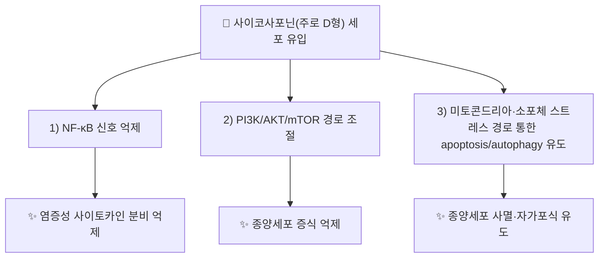

# 🔬 사이코사포닌 (Saikosaponin, 올레아난형 트리테르페노이드 사포닌군 / 사이코사포닌 A·D: C₄₂H₆₈O₁₃)

> **핵심 3줄 요약 (Key Summary)**:
> - 🌿 기원 본초 & 화학 계열: [[시호]](柴胡, *Bupleurum* spp.) 뿌리에 함유된 올레아난(oleanane)형 트리테르페노이드 사포닌군의 총칭. 단일 화합물이 아니라 사이코사포닌 A·C·D 등 다수 유사체(analogue)를 포괄하는 화합물군(class)입니다. (개별 성분 노트: [[사이코사포닌 d]])
> - 🎯 핵심 분자 표적 & 조절 경로: 주로 연구된 사이코사포닌 D를 중심으로 NF-κB, PI3K/AKT/mTOR, MAPK 경로 조절 및 세포자멸(apoptosis)·자가포식(autophagy) 유도가 보고됨. (⚠️ NF-κB·PI3K/AKT/mTOR·자가포식은 §3에서 실제 논문으로 확인했으나 MAPK 조절은 이번 검증에서 확인하지 못했습니다.)
> - 🩺 주요 약리 활성: 항염증, 항종양(다양한 세포주), 면역조절 등이 실험 연구로 제시되며, 시호의 화해소양(和解少陽)·해열(解熱) 효능과 연계되는 근거로 언급됩니다.
> - ⚠️ 독성·생체이용률 한계 & 상호작용: 사이코사포닌 D는 고농도에서 심장·간 독성이 세포·동물 연구에서 보고된 바 있고 경구 생체이용률이 낮은 것으로 알려져 있어, 단일 성분 고농도 투여 결과를 전탕액(煎湯液) 복용의 저농도 노출과 동일시할 수 없습니다. (⚠️ 사이코사포닌 A의 랫드 경구 생체이용률은 0.04%로 실측되었으나, 사이코사포닌 D의 경구 생체이용률은 문헌에서 논란이 있다고 정리됩니다. §4)

---

## 📌 목차
1. [기본 화학 정보 & 분자 구조식 (Chemical Identity)](#1-기본-화학-정보--분자-구조식-chemical-identity)
2. [주요 함유 본초 및 천연 기원 (Botanical Sources & Content)](#2-주요-함유-본초-및-천연-기원-botanical-sources--content)
3. [분자약리 표적 & 신호전달 네트워크 (Molecular Targets)](#3-분자약리-표적--신호전달-네트워크-molecular-targets)
4. [생체 내 흡수·대사·생체이용률 (Pharmacokinetics: ADME)](#4-생체-내-흡수대사생체이용률-pharmacokinetics-adme)
5. [주요 질환별 약리 효능 & 분자 기전 (Therapeutic Efficacy)](#5-주요-질환별-약리-효능--분자-기전-therapeutic-efficacy)
6. [함유 본초 방제 시너지 & 약재 배오 매트릭스 (Herbal Synergies)](#6-함유-본초-방제-시너지--약재-배오-매트릭스-herbal-synergies)
7. [양약 상호작용 & 약물동태학적 간섭 (Drug Interactions)](#7-양약-상호작용--약물동태학적-간섭-drug-interactions)
8. [💡 사용자 진료실 핵심 필기 & 임상 응용 팁 (Melt-In & High-Yield)](#8--사용자-진료실-핵심-필기--임상-응용-팁-melt-in--high-yield)
9. [출처 및 학술 참고 문헌 (References)](#9-출처-및-학술-참고-문헌-references)

---

## 1. 기본 화학 정보 & 분자 구조식 (Chemical Identity)

> [!abstract]+ 🧪 3D 약리 분자 구조 — 사이코사포닌 A (Interactive 3D Viewer)
> <iframe src="https://molecule-viewer-rho.vercel.app/?cid=167928" width="100%" height="450px" frameborder="0" allow="webgl" style="border-radius: 8px;"></iframe>

> [!abstract]+ 🧪 3D 약리 분자 구조 — 사이코사포닌 D (Interactive 3D Viewer)
> <iframe src="https://molecule-viewer-rho.vercel.app/?cid=107793" width="100%" height="450px" frameborder="0" allow="webgl" style="border-radius: 8px;"></iframe>

| 항목 | 상세 내용 |
| :--- | :--- |
| **화학 골격 분류** | 올레아난(oleanane)형 트리테르페노이드 사포닌(triterpenoid saponin) |
| **대표 유사체** | 사이코사포닌 A, 사이코사포닌 C, 사이코사포닌 D 등 |
| **사이코사포닌 A — 분자식/PubChem CID** | C₄₂H₆₈O₁₃ / [CID 167928](https://pubchem.ncbi.nlm.nih.gov/compound/167928) (PubChem 실측 확인: 등록명 Saikosaponin A, 분자량 약 781.0 g/mol) |
| **사이코사포닌 D — 분자식/PubChem CID** | C₄₂H₆₈O₁₃ / [CID 107793](https://pubchem.ncbi.nlm.nih.gov/compound/107793) (PubChem 실측 확인: 등록명 Saikosaponin D, 분자량 약 781.0 g/mol) |
| **CAS 등록 번호 (사이코사포닌 D)** | 20874-52-6 (PubChem 동의어 목록에서 확인) |
| **CAS 등록 번호 (사이코사포닌 A)** | 20736-09-8 (PubChem 동의어 목록 기준이며 CAS 원본 대조는 못함) |
| **IUPAC 명칭 (사이코사포닌 A, PubChem 등록명)** | `(2S,3R,4S,5S,6R)-2-[(2R,3R,4S,5S,6R)-3,5-dihydroxy-2-[[(1S,2S,4S,5R,8R,9R,10S,13S,14R,17S,18R)-2-hydroxy-9-(hydroxymethyl)-4,5,9,13,20,20-hexamethyl-24-oxahexacyclo[15.5.2.01,18.04,17.05,14.08,13]tetracos-15-en-10-yl]oxy]-6-methyloxan-4-yl]oxy-6-(hydroxymethyl)oxane-3,4,5-triol` |
| **IUPAC 명칭 (사이코사포닌 D, PubChem 등록명)** | `(2S,3R,4S,5S,6R)-2-[(2R,3R,4S,5S,6R)-3,5-dihydroxy-2-[[(1S,2R,4S,5R,8R,9R,10S,13S,14R,17S,18R)-2-hydroxy-9-(hydroxymethyl)-4,5,9,13,20,20-hexamethyl-24-oxahexacyclo[15.5.2.01,18.04,17.05,14.08,13]tetracos-15-en-10-yl]oxy]-6-methyloxan-4-yl]oxy-6-(hydroxymethyl)oxane-3,4,5-triol` |
| **화학 골격 분류 (보강)** | 두 IUPAC 명칭은 아글리콘 부분의 한 입체중심(2번 위치의 수산기 탄소)만 S/R로 다릅니다. 문헌상 사이코사포닌 D는 C16 α-수산기, 사이코사포닌 A는 C16 β-수산기를 가져 C16 에피머(epimer) 관계입니다(Nose 1989). 13,28-에폭시 에테르 결합과 11-엔(ene) 이중결합을 가진 아글리콘에 이당(푸코스-글루코스)이 붙은 구조입니다(PubChem 명명). |
| **물리화학적 성상** | 사포닌은 양친매성(amphiphilic) 배당체로 분류됩니다(Yu 2012). 외관 성상·수용성/LogP·열/빛 안정성·맛은 이번 검증에서 확인하지 못했습니다. ⚠️ 내용 검토 필요. 산 처리 시 구조가 바뀝니다(사이코사포닌 A→b1·g, D→b2; Shimizu 1985, §4). |
| **식물 내 생합성 경로** | ⚠️ 내용 검토 필요(원문에 서술 없음, 이번 검증에서 확인하지 못함) |

---

## 2. 주요 함유 본초 및 천연 기원 (Botanical Sources & Content)

| 함유 본초 (한글/한자) | 기원 식물학적 명칭 | 주요 함유 부위 | 지표 함량 (%) | 한의학적 귀경 및 약효 특성 |
| :--- | :--- | :--- | :--- | :--- |
| [[시호]] (柴胡) | 산형과 / *Bupleurum chinense*, *B. scorzonerifolium* 등 | 뿌리 | ⚠️ 미확인 | 간(肝)·담(膽)경 귀경, 화해퇴열(和解退熱)·소간해울(疏肝解鬱) |

* **기원 표기 관련 ⚠️**: 위 표의 기원종(*B. chinense*, *B. scorzonerifolium*)은 Bupleuri Radix를 두 종의 뿌리로 정의한 리뷰 서술과 같습니다(Zhou 2021). 반면 볼트 [[시호]] 노트는 기원을 *B. falcatum*(또는 북시호)으로 적고 있어 두 표기가 서로 다릅니다. 인용 논문들의 실험 재료도 종이 제각각입니다(*B. rigidum*: Bermejo Benito 1998, *B. falcatum*: Liu A 2014·Liu G 2022, *B. chinense*: Wang W 2026). 어느 기원종에서 어떤 사이코사포닌이 얼마나 나오는지는 이번 검증에서 확인하지 못했습니다.
* **지표 함량(%)**: 볼트 [[시호]] 노트는 "KP 규격 사이코사포닌 a+d ≥ 0.30%"로 적고 있으나, 대한민국약전 원문은 온라인에서 확인하지 못했습니다. ⚠️ 내용 검토 필요

---

## 3. 분자약리 표적 & 신호전달 네트워크 (Molecular Targets)

* **항염증 기전**: 1998년 발표된 연구에서 사이코사포닌류의 생체 내·외(in vivo·in vitro) 항염증 활성이 실험적으로 확인되었습니다(PMID 9763210).
  * ⚠️ 내용 검토 필요: 이 1998년 논문(Bermejo Benito 1998)은 *B. rigidum* 유래 saikosaponin 1·2와 buddlejasaponin I을 마우스 귀 부종(PMA 유도) 모델로 시험했고, 시험관 실험에서 대부분의 사이코사포닌이 COX·LOX 대사물, 특히 LTC4에 유의한 영향을 보였다고 보고합니다. 논문이 제시한 생화학적 기전은 **아라키돈산 대사 억제**이며 NF-κB는 초록에 나오지 않습니다. 또 검증된 성분은 saikosaponin 1·2(A·D와 명명이 다름)라 사이코사포닌 A·D의 결과로 그대로 옮길 수 없습니다.
* **항종양 기전**: 사이코사포닌 D는 다양한 암세포주(간암, 신경교종, 위암 등)에서 PKM2 매개 해당과정 조절, 소포체 스트레스를 통한 자가포식·세포자멸 유도, 방사선 감수성 증대 등 다표적 항종양 기전이 다수 보고되고 있습니다(*Pharmacological Reports*, 2024 리뷰, PMID 38965200).
  * 근거 확인: 2024 리뷰(Jia 2024)의 초록은 증식 억제·세포자멸 촉진·침습 억제·자가포식 조절과 항암제 감수성 증대를 정리하고 간·췌장·폐·신경교종·난소·갑상선·위·유방암을 열거하지만, PKM2·방사선 감수성은 초록에 직접 나오지 않습니다. 이 두 항목은 아래 1차 논문으로 확인했습니다.

### 1) 핵심 분자 표적 (Molecular Targets)
* **PKM2·해당과정·히스톤 젖산화(위암)**: 사이코사포닌 D는 위암세포(BGC-823, SGC-7901)에서 PKM2 발현을 낮추고 해당과정 관련 대사를 억제해 전체 젖산화(pan-lactylation)와 H3 히스톤 젖산화를 줄였으며, PKM2 과발현은 이 효과를 상쇄했습니다. 이종이식 마우스 모델에서도 종양 성장이 억제되었습니다(Wang 2026).
* **소포체(ER) 스트레스·자가포식(교모세포종)**: 사이코사포닌 D는 교모세포종 세포주(RG-2, U87-MG, U251)에서 ER 스트레스를 활성화해 세포자멸과 자가포식을 유도했습니다(Liu G 2022). 세포주 수준의 결과입니다.
* **SERCA 억제·Ca²⁺ 상승**: 사이코사포닌 D는 근소포체/소포체 Ca²⁺-ATPase(SERCA) 펌프를 직접 억제해 세포질 Ca²⁺를 올리고, CaMKK-AMPK-mTOR 경로를 거쳐 자가포식성 세포사를 유도한다고 보고되었습니다(Wong 2013). 이 SERCA 억제는 독성 기전과도 연결됩니다(§7).
* **mTOR·자가포식과 방사선 감수성(간암)**: 사이코사포닌 D는 mTOR 인산화를 낮춰 자가포식을 촉진하고 방사선 유도 세포자멸과 간암세포 증식 억제를 높였습니다(Wang 2021; Tian 2019). 자가포식 억제제(클로로퀸)나 mTOR 작용제가 이 효과를 부분적으로 되돌렸습니다.
* **PI3K/AKT/mTOR와 종양 관련 대식세포(췌장암)**: 사이코사포닌 D가 마우스 모델에서 PI3K/AKT/mTOR를 비활성화해 종양 관련 대식세포의 분극을 조절했다고 보고되었습니다(Xu 2023).
* **NF-κB·STAT3(간 보호)**: 사이코사포닌 D를 5일간 복강 투여한 마우스에서 아세트아미노펜 유도 간독성이 감소했고 NF-κB와 STAT3 인산화가 억제되었습니다(Liu 2014). NF-κB 억제가 항염증 기전으로 확인된 근거는 이 마우스 간 모델과 사이코사포닌 A의 항우울 연구(Tan 2025, §5)입니다.
* ⚠️ 내용 검토 필요: MAPK 경로 조절은 이번 검증에서 사이코사포닌 자체 논문으로 확인하지 못했습니다(볼트 [[시호]] 노트가 MAPK 논문을 인용하고 있으나 직접 대조하지 않았습니다). 위 기전은 대부분 세포주·마우스 결과이며 사람 대상 확인 근거는 아닙니다.

---

## 4. 생체 내 흡수·대사·생체이용률 (Pharmacokinetics: ADME)

* **장관 흡수**: 사포닌은 분자량(500 Da 초과)·수소결합 능력·분자 유연성 때문에 막 투과성이 낮아 장 흡수가 불량하며, 신속하고 광범위한 담즙 배설도 경구 생체이용률을 제한한다고 정리됩니다(Yu 2012, 사포닌 일반 종설로 사이코사포닌을 포함해 다룸).
  * **사이코사포닌 A 실측**: 랫드에서 정맥 투여(5 mg/kg) 시 청소율이 높고 소실 반감기(t½)는 2.29시간이었으며 용혈이 동반되었습니다. 경구 투여(50·100·200 mg/kg)는 용량 의존적 노출을 보였으나 생체이용률은 0.04%로 일관되게 낮았고, 원인으로 낮은 장 투과성과 장내세균·간 초회통과 대사가 추정되었습니다(Sun 2025).
  * **사이코사포닌 D**: 항종양 효과·독성·약동학 리뷰는 사이코사포닌 D의 경구 생체이용률과 체내 실제 약효 물질이 "여전히 논란"이라고 정리합니다(Zhou 2021). 사이코사포닌 D 자체의 확정 수치는 확인하지 못했습니다. ⚠️ 내용 검토 필요
  * 랫드 계통(Wistar가 Sprague Dawley보다 흡수 우수)에 따라 사이코사포닌 A 흡수가 달랐고 노출이 용량에 비례하지 않는 비선형 약동학을 보였습니다. 식초 법제 시호의 특징 성분인 사이코사포닌 b2가 사이코사포닌 A 흡수를 억제한다고 보고되었습니다(Fu 2019).
* **산(위액) 처리에 의한 구조 변환**: 랫드 위액(pH 1.5)에서 사이코사포닌 A는 3시간 안에 사라지고 사이코사포닌 b1·g로 바뀌었으며(약 3:1), 사이코사포닌 D는 30분 만에 사이코사포닌 b2로 완전히 바뀌었습니다(Shimizu 1985; 시험관 결과).
* **장내 미생물총(Microbiome) 대사 전환**: 마우스 장내세균과 혐기 배양하면 사이코사포닌 A가 아글리콘인 saikogenin F로 전환되어 1시간에 최대 수율 80%였고, 소량의 prosaikogenin F(모노푸코사이드)도 검출되었습니다(Shimizu 1985). 사람 장내세균 *Eubacterium* sp. A-44에서는 β-D-글루코시다아제와 새 유형의 β-D-푸코시다아제가 분리되어 사이코사포닌을 saikogenin으로 가수분해합니다. 이 β-글루코시다아제는 사이코사포닌 A·b1·b2에 비해 사이코사포닌 D 가수분해 능력이 낮았고 사이코사포닌 C는 분해하지 못했습니다(Kida 1997).
* **간 대사·제2상 포합·배설**: 사이코사포닌 자체의 간 CYP 대사 경로, 포합 반응, 사람 소실 반감기는 이번 검증에서 확인하지 못했습니다. ⚠️ 내용 검토 필요 (CYP·P-gp에 대한 영향은 §7 참조)
* ⚠️ 위 수치는 모두 랫드·마우스·시험관 결과이며, 사람 대상 약동학 자료는 확인하지 못했습니다.

---

## 5. 주요 질환별 약리 효능 & 분자 기전 (Therapeutic Efficacy)

### 1) 항종양
* 사이코사포닌 D가 간암세포의 방사선 민감성을 높이거나, 위암세포에서 PKM2 매개 해당과정·히스톤 젖산화(lactylation)를 표적으로 진행을 억제하는 등의 기전이 최근 리뷰(2024)에서 종합적으로 정리되었습니다.
  * 근거 보충(§3에서 확인): 간암세포의 방사선 감수성 증대는 Tian 2019·Wang 2021, 위암세포의 PKM2·젖산화는 Wang 2026(2026년 1차 논문으로, 2024 리뷰 초록에는 직접 나오지 않음), 교모세포종의 ER 스트레스는 Liu G 2022입니다. 사이코사포닌 D는 항종양 성분이자 주된 독성 성분으로 다루어진다는 점을 리뷰가 함께 강조합니다(Zhou 2021).
### 2) 항염증·면역조절
* NF-κB 경로 억제를 통한 사이토카인 조절 활성이 고전적 연구(1998)에서 생체 내·외 모델로 보고되었습니다.
  * ⚠️ 내용 검토 필요: 위 문장의 "NF-κB 경로 억제"는 1998년 논문(Bermejo Benito 1998) 초록과 맞지 않습니다. 이 논문의 기전은 COX·LOX를 포함한 아라키돈산 대사 억제이며 시험 성분도 *B. rigidum* 유래 saikosaponin 1·2입니다(§3). NF-κB 억제는 별도로 마우스 간 모델(Liu 2014)에서 사이코사포닌 D로 확인되었습니다.
### 3) 항우울 (전임상)
* 사이코사포닌 A를 경구 투여(20 mg/kg, 6주)한 만성 예측불가 경도 스트레스(CUMS) 마우스에서 우울·불안 유사 행동이 줄었고 5-HT·도파민·5-HIAA가 정상화되었으며 TNF-α·IL-1β·IL-6가 억제되었습니다. 기전은 TLR4를 통한 NF-κB/BDNF 축 조절로 제시됩니다(Tan 2025).
* 사이코사포닌 D를 경구 투여(0.75·1.50 mg/kg, 3주)한 CUMS 랫드에서 Homer1-mGluR5와 mTOR 신호 조절을 통한 항우울 효과가 보고되었습니다(Liu CY 2022; 이 논문에는 정정문이 발행되어 있으나 내용은 확인하지 못했습니다).
### 4) 간 보호와 간 손상 (상반된 보고)
* 사이코사포닌 D는 마우스에서 아세트아미노펜(APAP) 유도 간독성을 보호했습니다(Liu 2014, §3). 반대로 최근 논문은 사이코사포닌 D가 보호적 자가포식을 억제해 APAP-시스테인 단백질 부가체 제거를 늦추고 APAP 유발 간손상을 악화시킨다고 보고했습니다(Fan 2025). 두 결과가 상반되므로 사이코사포닌 D의 간 영향은 조건(투여 순서·용량)에 따라 달라질 수 있어 단순히 "간 보호"로 옮길 수 없습니다. ⚠️ 내용 검토 필요

⚠️ 내용 검토 필요: 항종양·항염증 연구는 대부분 세포주·동물모델 수준이며, 인체 대상 임상시험(RCT) 근거는 이번 검색 범위 내에서 확인되지 않았습니다. (이번 검증에서도 PubMed 'saikosaponin randomized clinical trial' 검색은 결과가 없었습니다.)

---

## 6. 함유 본초 방제 시너지 & 약재 배오 매트릭스 (Herbal Synergies)

사이코사포닌은 [[시호]]의 화해소양(和解少陽)·소간해울(疏肝解鬱) 효능을 뒷받침하는 핵심 성분군으로 제시되며, [[가미귀비탕]]·[[죽여온담탕]] 등 볼트 내 기존 노트에서 시호 배합 처방의 항염증·항우울·간 보호 효능에 대한 분자약리학적 근거로 이미 언급되어 있습니다(디테르펜류와 함께 언급, [[디테르펜]] 참고).

| 함유 본초 / 방제 | 공존 유효 성분군 | 분자약리 시너지 기전 | 전통 한의학적 효능 연계 |
| :--- | :--- | :--- | :--- |
| [[시호]] | 사이코사포닌 A·C·D 외 사이코사포닌 b류 (볼트 시호 노트 기준) | ⚠️ 내용 검토 필요 — 공존 성분 간 시너지 문헌 미확인. 참고: 식초 법제 시호의 특징 성분 사이코사포닌 b2가 사이코사포닌 A 흡수를 억제했고(Fu 2019), 사이코사포닌 A·C·D가 약물 수송체(P-gp·MRP)를 서로 다르게 조절했음(Feng 2017) | 화해퇴열, 소간해울 |
| [[소시호탕]] | [[시호]] 12~15g(군약)·[[황금]] 9g(신약) 외 [[반하]]·[[생강]]·[[인삼]]·[[대추]]·[[감초]] (볼트 처방 노트에서 구성 확인) | ⚠️ 내용 검토 필요 — 전탕액에서 사이코사포닌이 얼마나 남고 처방 효과에 기여하는지는 문헌 미확인 | 소양 반표반리의 화해(和解) |
| [[대시호탕]] | [[시호]] 12~15g(군약)·[[황금]] 9g(신약) 외 [[대황]]·[[지실]]·[[작약]]·[[반하]]·[[생강]]·[[대추]] (볼트 처방 노트에서 구성 확인) | ⚠️ 내용 검토 필요 — 사이코사포닌의 기여 문헌 미확인 | 소양·양명 합병의 사열(瀉熱) |
| [[시호소간산]] | [[시호]] 9~12g(군약) 외 [[향부자]]·[[천궁]]·[[지각]]·[[진피]]·[[백작약]]·[[감초]] (볼트 처방 노트에서 구성 확인) | ⚠️ 내용 검토 필요 — 사이코사포닌의 기여 문헌 미확인 | 간기울결 소통 |
| [[소요산]] | [[시호]] 6g(군약) 외 [[당귀]]·[[백작약]]·[[백출]]·[[복령]]·[[감초]]·[[박하]]·[[생강]] (볼트 처방 노트에서 구성 확인) | ⚠️ 내용 검토 필요 — 사이코사포닌의 기여 문헌 미확인. 참고: 사이코사포닌 A·D의 항우울 근거는 단일 성분·마우스·랫드 결과(§5) | 소간양혈·건비화중 |
| [[가미귀비탕]] | [[시호]] 3~4g(신약) 외 [[귀비탕]] 구성 + 치자 (볼트 처방 노트에서 구성 확인) | ⚠️ 내용 검토 필요 — 볼트 노트가 사이코사포닌을 근거로 언급하나 처방 수준의 직접 근거는 확인하지 못함 | 소간해울, 억압된 감정(간기울결) 해소 |
| [[죽여온담탕]] | [[시호]] 6g(신약)·[[황련]] 외 [[온담탕]] 구성·[[인삼]]·[[맥문동]]·[[길경]] (볼트 처방 노트에서 구성 확인) | ⚠️ 내용 검토 필요 — 사이코사포닌의 기여 문헌 미확인 | 화해소양, 소간해울, 잔여 미열 투표 |

---

## 7. 양약 상호작용 & 약물동태학적 간섭 (Drug Interactions)

* **CYP450 효소 간섭**:
  * 사이코사포닌 총합(TSS)은 사람 간세포주(HepaRG)에서 10·15 µg/mL 농도로 [[CYP3A4]] mRNA·단백질 발현을 낮췄고 15 µg/mL에서는 CYP1A2 발현을 오히려 높였습니다(Tang 2024; 시험관 결과, 세포 생존율이 일부 감소한 농도 포함).
  * 식초 법제 시호 추출물과 사이코사포닌의 시험관 마이크로솜 실험은 CYP1A2·CYP3A4에 대한 영향은 무시할 수준이지만 CYP2C9 기질과 병용하면 상호작용 위험이 있을 수 있다고 결론지었습니다(Yu 2014). 이 논문의 추출물 결과이며 사이코사포닌 단일 성분 결과가 아닙니다.
  * 사이코사포닌 D 리뷰는 사이코사포닌 D가 CYP와 P-gp에 대한 영향으로 일부 약물의 약동학을 바꿀 가능성이 있다고 정리합니다(Zhou 2021). 임상 상호작용 확인 자료는 확인하지 못했습니다. ⚠️ 내용 검토 필요
* **P-당단백질(P-gp)·약물 수송체**: 사이코사포닌 A는 P-gp 과발현 암세포(MCF-7/ADR, HepG2/ADM)에서 독소루비신·빈크리스틴·파클리탁셀에 대한 감수성을 높이고 P-gp 기질(독소루비신·로다민 123)의 세포 내 잔류를 늘렸습니다(Ye 2017). 사이코사포닌 A·C·D는 수송체 활성에 서로 다르게 작용해, P-gp 과발현 HEK293 세포에서 모두 P-gp 활성을 억제했습니다(Feng 2017). 세포·동물 수준의 결과입니다.
* **아세트아미노펜(APAP) 병용**: 사이코사포닌 D는 마우스에서 [[아세트아미노펜]] 간독성을 보호했으나(Liu 2014), 보호적 자가포식을 억제해 APAP 간손상을 악화시킨다는 보고도 있습니다(Fan 2025). 이 논문은 시호와 아세트아미노펜이 모두 간독성 가능성이 있는 약물이라, 합리적이지 않은 병용과 과다 사용에서 약물유발 간손상 위험이 간과되고 있다고 지적합니다. ⚠️ 내용 검토 필요
* **독성·용혈 (SERCA)**: 사이코사포닌 A·D는 SERCA와의 결합 친화도가 더 높고, 사이코사포닌 b1·b2·C보다 심근세포·간세포에 강한 독성을 보였습니다. 식초 법제로 사이코사포닌 A·D 함량이 줄면 독성이 감소한다고 제시됩니다(Wang 2017). 용혈은 사이코사포닌 D와 그 장내 산물 prosaikogenin G(C16 α-수산기)가 1~5 µg/mL에서 가장 강했고, 사이코사포닌 A는 10 µg/mL 이상에서 활성을 보였습니다(Nose 1989). 정맥 투여 시 용혈이 관찰되었습니다(Sun 2025).
* **유사 기전 양약 병용 시 고려사항**: 사이코사포닌과 항암제·혈당강하제·항혈전제의 병용 안전성은 확인하지 못했습니다. ⚠️ 내용 검토 필요

---

## 8. 💡 사용자 진료실 핵심 필기 & 임상 응용 팁 (Melt-In & High-Yield)

* **사용자 원문 필기 (100% 융합 및 보존)**:
  * 기존 노트에 원장님의 수기 필기는 없었습니다. (추후 필기가 생기면 이곳에 원문 그대로 추가)
* **진료실 실전 처방 & 생체이용률 극대화 팁**:
  1. 사이코사포닌의 항종양·항우울·간 보호 근거는 정제 성분의 세포·동물 실험이며, [[시호]] 전탕액에서의 사이코사포닌 잔존량과 흡수는 확인되지 않았습니다(§4). 사이코사포닌 A의 랫드 경구 생체이용률이 0.04%라는 점(§4)도 전탕 처방의 근거로 그대로 옮기지 않도록 주의합니다.
  2. 체질별·병증별 적용은 원문·문헌에서 확인되지 않아 기재하지 않습니다. ⚠️ 내용 검토 필요

---

## 9. 출처 및 학술 참고 문헌 (References)

1. **Yuan B, Yang R, Ma Y, Zhou S, Zhang X, Liu Y (2017)**. "A systematic review of the active saikosaponins and extracts isolated from Radix Bupleuri and their applications". *Pharmaceutical Biology*, 55(1):620-635. DOI: 10.1080/13880209.2016.1262433. PMID: [27951737](https://pubmed.ncbi.nlm.nih.gov/27951737/) (09-09 다빈치, Europe PMC로 저자명 확인·보강; 이번 검증에서 PubMed로 권호 보강 — PubMed 기준 발행연도는 2017년(55권 1호)이며, 원문의 2016은 온라인 선공개 연도로 보이나 확인하지 못함)
   - **[연구 요약]**: 시호 유래 사이코사포닌류의 구조·약리활성 전반을 정리한 체계적 문헌 고찰.
2. **Jia R, et al. (2024)**. "Advances in the anti-tumor mechanisms of saikosaponin D". *Pharmacological Reports*, 76(4):780-792. DOI: 10.1007/s43440-024-00569-6. PMID: [38965200](https://pubmed.ncbi.nlm.nih.gov/38965200/)
   - **[연구 요약]**: 사이코사포닌 D의 다양한 암종별 항종양 분자 기전(자가포식, 세포자멸, 방사선 감수성 등)을 종합한 리뷰. (⚠️ 초록은 증식 억제·세포자멸 촉진·침습 억제·자가포식 조절·항암제 감수성 증대를 정리하며 PKM2·방사선 감수성은 직접 언급하지 않음)
3. **Bermejo Benito P, et al. (1998)**. "In vivo and in vitro antiinflammatory activity of saikosaponins". *Life Sciences*, 63(13):1147-1156. DOI: 10.1016/s0024-3205(98)00376-2. PMID: [9763210](https://pubmed.ncbi.nlm.nih.gov/9763210/)
   - **[연구 요약]**: *Bupleurum rigidum* 유래 saikosaponin 1·2와 buddlejasaponin I이 마우스 귀 부종(PMA 유도)에서 항염증 효과를 보였고, 시험관에서 COX·LOX 대사물(특히 LTC4)에 영향을 주어 아라키돈산 대사 억제가 기전으로 제안됨. (⚠️ 원문의 저자·저널명 미확인 표시는 이번 PubMed 확인으로 해소; 초록에 NF-κB는 나오지 않음)
4. **PubChem CID 107793 (Saikosaponin D)** / **CID 167928 (Saikosaponin A)**. National Center for Biotechnology Information.
   - **[화학 데이터베이스]**: 분자식·CAS 번호 등 공인 화학 데이터. (이번 검증에서 분자식 C₄₂H₆₈O₁₃, 분자량 약 781.0, CAS 20874-52-6(D)·20736-09-8(A) 확인)
5. **Zhou P, et al. (2021)**. "Saikosaponin D: review on the antitumour effects, toxicity and pharmacokinetics". *Pharmaceutical Biology*, 59(1):1480-1489. DOI: 10.1080/13880209.2021.1992448. PMID: [34714209](https://pubmed.ncbi.nlm.nih.gov/34714209/)
   - **[연구 요약]**: 사이코사포닌 D의 항종양 다표적 기전, 독성(간·신경·용혈·심장), CYP·P-gp 영향과 경구 생체이용률 논란을 정리한 리뷰.
6. **Sun Z, et al. (2025)**. "Characterization of Pharmacokinetics and Oral Bioavailability of Saikosaponin A in Rats Using a Validated UFLC-MS/MS Method". *Biomedical Chromatography*, 39(10):e70219. DOI: 10.1002/bmc.70219. PMID: [40930751](https://pubmed.ncbi.nlm.nih.gov/40930751/)
   - **[연구 요약]**: 랫드에서 사이코사포닌 A 정맥 투여 t½ 2.29시간·용혈 동반, 경구 생체이용률 0.04%.
7. **Yu K, et al. (2012)**. "Absorption, disposition, and pharmacokinetics of saponins from Chinese medicinal herbs: what do we know and what do we need to know more?". *Current Drug Metabolism*, 13(5):577-598. DOI: 10.2174/1389200211209050577. PMID: [22292787](https://pubmed.ncbi.nlm.nih.gov/22292787/)
   - **[연구 요약]**: 사이코사포닌을 포함한 사포닌의 낮은 장 흡수(분자량·수소결합)와 담즙 배설을 정리한 종설.
8. **Shimizu K, et al. (1985)**. "Structural transformation of saikosaponins by gastric juice and intestinal flora". *Journal of Pharmacobio-Dynamics*, 8(9):718-725. DOI: 10.1248/bpb1978.8.718. PMID: [4087133](https://pubmed.ncbi.nlm.nih.gov/4087133/)
   - **[연구 요약]**: 위액에서 사이코사포닌 A→b1·g, D→b2 전환, 장내세균에서 saikogenin·prosaikogenin 전환.
9. **Kida H, et al. (1997)**. "Enzymes responsible for the metabolism of saikosaponins from Eubacterium sp. A-44, a human intestinal anaerobe". *Biological & Pharmaceutical Bulletin*, 20(12):1274-1278. DOI: 10.1248/bpb.20.1274. PMID: [9448103](https://pubmed.ncbi.nlm.nih.gov/9448103/)
   - **[연구 요약]**: 사람 장내세균의 β-글루코시다아제·β-푸코시다아제가 사이코사포닌을 saikogenin으로 가수분해(D는 가수분해 능력 낮음, C는 분해 못함).
10. **Nose M, et al. (1989)**. "Effects of saikosaponin metabolites on the hemolysis of red blood cells and their adsorbability on the cell membrane". *Chemical & Pharmaceutical Bulletin*, 37(12):3306-3310. DOI: 10.1248/cpb.37.3306. PMID: [2632076](https://pubmed.ncbi.nlm.nih.gov/2632076/)
    - **[연구 요약]**: 사이코사포닌 D·A와 대사체 13종의 용혈 활성 비교(D와 prosaikogenin G가 가장 강함, C16 수산기 입체 차이).
11. **Wang S, et al. (2017)**. "Content decline of SERCA inhibitors saikosaponin a and d attenuates cardiotoxicity and hepatotoxicity of vinegar-baked Radix bupleuri". *Environmental Toxicology and Pharmacology*, 52:129-137. DOI: 10.1016/j.etap.2017.04.002. PMID: [28412648](https://pubmed.ncbi.nlm.nih.gov/28412648/)
    - **[연구 요약]**: 사이코사포닌 A·D가 SERCA와의 친화도가 높고 심근·간세포 독성이 강하며, 식초 법제로 함량이 줄면 독성이 감소.
12. **Wong VK, et al. (2013)**. "Saikosaponin-d, a novel SERCA inhibitor, induces autophagic cell death in apoptosis-defective cells". *Cell Death & Disease*, 4(7):e720. DOI: 10.1038/cddis.2013.217. PMID: [23846222](https://pubmed.ncbi.nlm.nih.gov/23846222/)
    - **[연구 요약]**: 사이코사포닌 D의 SERCA 직접 억제→세포질 Ca²⁺ 상승→CaMKK-AMPK-mTOR 경로를 통한 자가포식 유도.
13. **Tian YD, et al. (2019)**. "Saikosaponin-d Increases the Radiosensitivity of Hepatoma Cells by Adjusting Cell Autophagy". *Journal of Cancer*, 10(20):4947-4953. DOI: 10.7150/jca.30286. PMID: [31598167](https://pubmed.ncbi.nlm.nih.gov/31598167/)
    - **[연구 요약]**: 간암세포에서 자가포식 조절을 통한 사이코사포닌 D의 방사선 감수성 증대.
14. **Wang B, et al. (2021)**. "Saikosaponin-d increases radiation-induced apoptosis of hepatoma cells by promoting autophagy via inhibiting mTOR phosphorylation". *International Journal of Medical Sciences*, 18(6):1465-1473. DOI: 10.7150/ijms.53024. PMID: [33628104](https://pubmed.ncbi.nlm.nih.gov/33628104/)
    - **[연구 요약]**: mTOR 인산화 억제를 통한 자가포식 촉진과 방사선 유도 세포자멸 증가.
15. **Liu G, et al. (2022)**. "Saikosaponin D Inducing Apoptosis and Autophagy through the Activation of Endoplasmic Reticulum Stress in Glioblastoma". *BioMed Research International*, 2022:5489553. DOI: 10.1155/2022/5489553. PMID: [36467888](https://pubmed.ncbi.nlm.nih.gov/36467888/)
    - **[연구 요약]**: 교모세포종 세포주에서 ER 스트레스 활성화를 통한 세포자멸·자가포식 유도.
16. **Wang W, et al. (2026)**. "Saikosaponin D inhibits gastric cancer progression by targeting PKM2-mediated glycolysis and histone lactylation". *Phytomedicine*, 153:157993. DOI: 10.1016/j.phymed.2026.157993. PMID: [41759425](https://pubmed.ncbi.nlm.nih.gov/41759425/)
    - **[연구 요약]**: 위암 세포·이종이식 모델에서 PKM2 하향, 해당과정 억제, 전체·H3 히스톤 젖산화 감소.
17. **Xu X, et al. (2023)**. "Saikosaponin d modulates the polarization of tumor-associated macrophages by deactivating the PI3K/AKT/mTOR pathway in murine models of pancreatic cancer". *International Immunopharmacology*, 122:110579. DOI: 10.1016/j.intimp.2023.110579. PMID: [37433245](https://pubmed.ncbi.nlm.nih.gov/37433245/)
    - **[연구 요약]**: 췌장암 마우스 모델에서 PI3K/AKT/mTOR 비활성화를 통한 종양 관련 대식세포 분극 조절.
18. **Liu A, et al. (2014)**. "Saikosaponin d protects against acetaminophen-induced hepatotoxicity by inhibiting NF-κB and STAT3 signaling". *Chemico-Biological Interactions*, 223:80-86. DOI: 10.1016/j.cbi.2014.09.012. PMID: [25265579](https://pubmed.ncbi.nlm.nih.gov/25265579/)
    - **[연구 요약]**: 마우스에서 사이코사포닌 D 전처치가 APAP 간독성을 감소시키고 NF-κB·STAT3 인산화를 억제.
19. **Fan G, et al. (2025)**. "Saikosaponin D exacerbates acetaminophen-induced liver injury by sabotaging GABARAP-SNARE complex assembly in protective autophagy". *Phytomedicine*, 138:156409. DOI: 10.1016/j.phymed.2025.156409. PMID: [39874796](https://pubmed.ncbi.nlm.nih.gov/39874796/)
    - **[연구 요약]**: 사이코사포닌 D가 자가포식을 억제해 APAP 부가체 제거를 늦추고 APAP 유발 간손상을 악화.
20. **Tan L, et al. (2025)**. "TLR4 as a therapeutic target: Antidepressant mechanism of saikosaponin A in regulating the NF-κB/BDNF axis and mitigating oxidative stress and inflammation in vivo and in vitro". *Frontiers in Pharmacology*, 16:1585290. DOI: 10.3389/fphar.2025.1585290. PMID: [40453654](https://pubmed.ncbi.nlm.nih.gov/40453654/)
    - **[연구 요약]**: CUMS 마우스에서 사이코사포닌 A(20 mg/kg, 경구 6주)의 항우울·항불안, 신경전달물질 정상화, 신경염증 억제.
21. **Liu CY, et al. (2022)**. "Saikosaponin D exerts antidepressant effect by regulating Homer1-mGluR5 and mTOR signaling in a rat model of chronic unpredictable mild stress". *Chinese Medicine*, 17(1):60. DOI: 10.1186/s13020-022-00621-8. PMID: [35610650](https://pubmed.ncbi.nlm.nih.gov/35610650/)
    - **[연구 요약]**: CUMS 랫드에서 사이코사포닌 D(0.75·1.50 mg/kg, 경구 3주)의 항우울 효과와 Homer1-mGluR5·mTOR 신호 조절. (2023년 정정문 PMID 37941004가 발행되어 있으나 내용은 확인하지 못함)
22. **Tang Y, et al. (2024)**. "Effects of total saikosaponins on CYP3A4 and CYP1A2 in HepaRG cells". *Experimental and Therapeutic Medicine*, 27(5):217. DOI: 10.3892/etm.2024.12505. PMID: [38590569](https://pubmed.ncbi.nlm.nih.gov/38590569/)
    - **[연구 요약]**: HepaRG 세포에서 사이코사포닌 총합이 CYP3A4 발현을 낮추고 고농도에서 CYP1A2 발현을 높임.
23. **Yu T, et al. (2014)**. "Modulatory effects of extracts of vinegar-baked Radix Bupleuri and saikosaponins on the activity of cytochrome P450 enzymes in vitro". *Xenobiotica*, 44(10):861-867. DOI: 10.3109/00498254.2014.914600. PMID: [24779639](https://pubmed.ncbi.nlm.nih.gov/24779639/)
    - **[연구 요약]**: 식초 법제 시호 추출물이 CYP1A2·CYP3A4에는 영향이 미미하고 CYP2C9 기질과의 병용 위험을 시사(시험관 마이크로솜).
24. **Ye RP, et al. (2017)**. "Saikosaponin A, an active glycoside from Radix bupleuri, reverses P-glycoprotein-mediated multidrug resistance in MCF-7/ADR cells and HepG2/ADM cells". *Xenobiotica*, 47(2):176-184. DOI: 10.3109/00498254.2016.1171932. PMID: [27123551](https://pubmed.ncbi.nlm.nih.gov/27123551/)
    - **[연구 요약]**: 사이코사포닌 A가 P-gp 과발현 암세포의 항암제 감수성을 높이고 P-gp 기질 잔류를 증가.
25. **Feng L, et al. (2017)**. "Saikosaponins A, C and D enhance liver-targeting effects of anticancer drugs by modulating drug transporters". *Oncotarget*, 8(66):110092-110102. DOI: 10.18632/oncotarget.22639. PMID: [29299132](https://pubmed.ncbi.nlm.nih.gov/29299132/)
    - **[연구 요약]**: 사이코사포닌 A·C·D가 수송체 활성에 서로 다르게 작용하며 모두 P-gp 과발현 HEK293 세포에서 P-gp 활성을 억제.
26. **Fu R, et al. (2019)**. "Effects of Animal Strain, Dose, and Cotreatment with Saikosaponin b2 on the Pharmacokinetics of Saikosaponin a in Rats". *European Journal of Drug Metabolism and Pharmacokinetics*, 44(6):827-836. DOI: 10.1007/s13318-019-00569-5. PMID: [31317503](https://pubmed.ncbi.nlm.nih.gov/31317503/)
    - **[연구 요약]**: 랫드 계통(Wistar>SD)·용량에 따른 사이코사포닌 A 약동학 차이, 비선형 노출, 사이코사포닌 b2의 흡수 억제.

> ✅ 이번 재구성(2026-09-21)에서 PubMed·PubChem로 확인: 기존 1~3번 문헌의 저자·저널·권호·DOI(원문의 "정확한 저자명 미확인" 표기 해소), CID 167928(A)·107793(D)의 화합물·분자식·CAS. ⚠️ 온라인으로 확인하지 못한 항목: 대한민국약전 원문(KP 지표 함량), MAPK 경로에 대한 사이코사포닌 자체 논문, 사이코사포닌 D 단독 경구 생체이용률 수치, 사람 약동학·임상시험.
