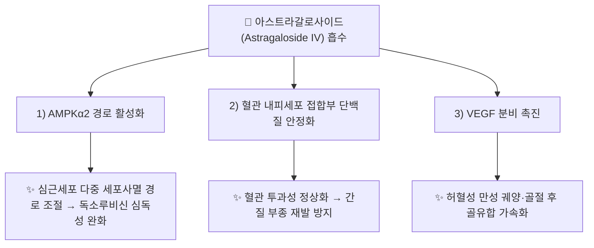

---
aliases:
  - Astragaloside
  - Astragaloside IV
  - 아스트라갈로사이드 IV
  - AS-IV
  - CID 13943297
tags:
  - 약리
  - 약리성분
  - 트리테르펜사포닌
  - 심혈관보호
  - 면역조절
  - 신장보호
  - 본초학
created: 2026-09-14
updated: 2026-09-14
status: complete
compound_name_ko: 아스트라갈로사이드
compound_name_en: Astragaloside (대표형 Astragaloside IV)
pubchem_cid: 13943297
molecular_formula: C41H68O14
molecular_weight: 784.97 g/mol
cas_number: 84687-43-4
source_herbs:
  - 황기
main_pharmacology:
  - "[[황기]](*Astragalus membranaceus*)의 대표적 사이클로아르탄형 트리테르펜 사포닌 계열 지표성분"
  - "혈관 내피세포 보호·AMPK 경로 조절을 통한 심혈관·심근 보호 작용"
  - "당뇨병성 신장질환 등 신장 보호 및 면역 조절 활성 보고"
title: 아스트라갈로사이드
date: 2026-09-24
출처: PMID 39236461
---

# 🔬 [[아스트라갈로사이드]] (Astragaloside, 대표형 Astragaloside IV, C₄₁H₆₈O₁₄)

> **핵심 3줄 요약 (Key Summary)**:
> - 🌿 기원 본초 & 화학 계열: 콩과(Fabaceae) [[황기]](*Astragalus membranaceus* 또는 *A. mongholicus*)의 뿌리에 함유된 사이클로아르탄형(Cycloartane-type) 트리테르펜 배당체(사포닌) 계열. 임상·실험 문헌에서 활성 대표형인 아스트라갈로사이드 IV(Astragaloside IV)로 가장 흔히 지칭됨.
> - 🎯 핵심 분자 표적 & 조절 경로: AMPKα2 경로 활성화, 혈관 내피세포 접합부(Tight junction) 보호, VEGF 분비 조절, 세포 사멸(Apoptosis) 경로 다중 조절.
> - 🩺 주요 약리 활성 & 질환 치료 기전: 심근 보호(독소루비신 유발 심독성 완화, 심근경색·부정맥 개선), 당뇨병성 신장질환 등 신장 보호, 혈관 내피 장벽 강화를 통한 부종 개선, 창상 치유·골유합 촉진(VEGF 매개), 면역 조절.
> - ⚠️ 독성·생체이용률 한계 & 상호작용: 경구 생체이용률이 낮은 사포닌 계열로 알려져 있으며, 대부분의 근거가 세포·동물 실험 및 전임상 리뷰 수준으로, 인체 대상 확립된 약동학·양약 상호작용 데이터는 검색 범위 내에서 확인하지 못함(⚠️ 확인 필요).

---

## 📌 목차
1. [기본 화학 정보 & 분자 구조식 (Chemical Identity)](#1-기본-화학-정보--분자-구조식-chemical-identity)
2. [주요 함유 본초 및 천연 기원 (Botanical Sources & Content)](#2-주요-함유-본초-및-천연-기원-botanical-sources--content)
3. [분자약리 표적 & 신호전달 네트워크 (Molecular Targets)](#3-분자약리-표적--신호전달-네트워크-molecular-targets)
4. [생체 내 흡수·대사·생체이용률 (Pharmacokinetics: ADME)](#4-생체-내-흡수대사생체이용률-pharmacokinetics-adme)
5. [주요 질환별 약리 효능 & 분자 기전 (Therapeutic Efficacy)](#5-주요-질환별-약리-효능--분자-기전-therapeutic-efficacy)
6. [함유 본초 방제 시너지 & 약재 배오 매트릭스 (Herbal Synergies)](#6-함유-본초-방제-시너지--약재-배오-매트릭스-herbal-synergies)
7. [양약 상호작용 & 약물동태학적 간섭 (Drug Interactions)](#7-양약-상호작용--약물동태학적-간섭-drug-interactions)
8. [💡 사용자 진료실 핵심 필기 & 임상 응용 팁 (Melt-In & High-Yield)](#8--사용자-진료실-핵심-필기--임상-응용-팁-melt-in--high-yield)
9. [출처 및 학술 참고 문헌 (References)](#9-출처-및-학술-참고-문헌-references)

---
## 1. 기본 화학 정보 & 분자 구조식 (Chemical Identity)

> [!abstract]+ 🧪 3D 약리 분자 구조 (Interactive 3D Viewer)
> <iframe src="https://molecule-viewer-rho.vercel.app/?cid=13943297" style="width: 100%; height: 600px; border: none; border-radius: 12px; box-shadow: 0 4px 20px rgba(0,0,0,0.15);" allowfullscreen></iframe>

![[아스트라갈로사이드_화학구조식.png|320]]
> [그림 1: 아스트라갈로사이드 2D 화학 분자 구조식 (출처: 위키미디어 공용 · NCI CACTVS 구조 데이터)]

| 항목 | 상세 내용 |
| :--- | :--- |
| **IUPAC 명칭** | 사이클로아르탄형 트리테르펜 배당체(Astragaloside IV 기준), 정식 IUPAC 전체 명칭은 매우 복잡하여 관용명(Astragaloside IV)으로 통용됨 (⚠️ 정밀 표기 재검증 권장) |
| **분자식 / 분자량** | C₄₁H₆₈O₁₄ / 784.97 g/mol (Astragaloside IV 기준) |
| **PubChem CID** | [13943297](https://pubchem.ncbi.nlm.nih.gov/compound/Astragaloside-IV) (Astragaloside IV) |
| **CAS 등록 번호** | 84687-43-4 (Astragaloside IV) |
| **화학 골격 분류** | 트리테르페노이드 사포닌 중 사이클로아르탄(Cycloartane)형 배당체 계열 |
| **물리화학적 성상** | 백색 결정성 분말, 물에 난용이나 메탄올·에탄올에 가용, 열에 비교적 안정 |
| **식물 내 생합성 경로** | 메발론산(Mevalonate) 경로를 통한 트리테르펜 골격 형성 후 당쇄(자일로스·글루코스 등)가 결합되어 생성되는 사포닌 배당체로 추정(⚠️ 확인 필요) |

---

## 2. 주요 함유 본초 및 천연 기원 (Botanical Sources & Content)

> ⚠️ 내용 검토 필요: 함유식물 도해 이미지 미첨부.

| 함유 본초 (한글/한자) | 기원 식물학적 명칭 (과명 / 학명) | 주요 함유 약용 부위 | 지표 함량 (%) | 한의학적 귀경 및 약효 특성 |
| :--- | :--- | :--- | :--- | :--- |
| [[황기]] (黃芪) | 콩과(Fabaceae) / *Astragalus membranaceus* (또는 몽골황기 *A. mongholicus*) | 뿌리 | 정량 수치 확인 불가(⚠️ 추정, 대한민국약전 기준 아스트라갈로사이드 IV 지표 성분 규격 존재) | 폐·비경 / 보기승양, 익위고표, 이뇨퇴종, 탁독생기 |

---

## 3. 분자약리 표적 & 신호전달 네트워크 (Molecular Targets)

### 1) 심근·심혈관 보호 표적
* **AMPKα2 경로**: 독소루비신 유발 심독성 모델에서 AMPKα2 경로를 조절해 다중 세포사멸(apoptosis 등) 경로를 억제한다고 보고됨(PMID 39236461).
* **부정맥·심근경색 기전 리뷰**: 2025년 부정맥 관련 종합 리뷰(PMID 40276608), 2025~2026년 심근경색 기전 리뷰(PMID 41692702)에서 이온 채널 조절, 항산화, 항섬유화 등 다각도 기전이 정리됨.
### 2) 혈관 내피 장벽 보호 표적
* [[시노메닌]] 노트에 이미 기재된 바와 같이, 아스트라갈로사이드 IV가 혈관 내피 장벽 鈬과성을 강화하여 간질 부종 재발을 방지하는 것으로 볼트 내 서술됨 — ⚠️ 이 구체적 기전(내피세포 접합부 복구)을 직접 검증한 원저 논문은 금번 검색에서 확인하지 못함(추정 표시 유지).
### 3) 혈관신생·조직 재생 표적
* [[십전대보탕]] 노트 기재대로 VEGF 분비를 촉진하여 허혈성 궤양·욕창·골절 후 골유합을 가속화한다고 서술되어 있으나, 이 역시 원저 문헌 직접 확인은 되지 않아 ⚠️ 확인 필요로 유지.

---

## 4. 생체 내 흡수·대사·생체이용률 (Pharmacokinetics: ADME)

* **경구 생체이용률**: 사포닌 계열 특성상 장관 흡수율이 낮은 것으로 일반적으로 알려져 있으나(⚠️ 정량 수치는 검색 범위 내에서 확인하지 못함), 2020년 종합 리뷰(PMID 32089240)에서 약리 효과 전반이 정리됨.
* **간 대사·반감기**: 구체적인 CYP450 대사 경로 및 혈장 반감기 수치는 검색 범위 내에서 확인하지 못했습니다(⚠️ 확인 필요).

---

## 5. 주요 질환별 약리 효능 & 분자 기전 (Therapeutic Efficacy)

### 1) 심혈관 질환
* 독소루비신 심독성 완화(PMID 39236461), 부정맥(PMID 40276608), 심근경색(PMID 41692702) 등 다수의 최신 리뷰를 통해 심장 보호 기전이 정리되고 있음 — 대부분 세포·동물 실험 기반.
### 2) 대사·신장 질환
* [[황기건중탕]] 노트 기재대로 mTOR 신호 자극을 통한 간세포 단백질 합성 촉진(혈청 총단백·알부민 상승) 및 부종·근위축 개선 효능이 서술되어 있음 — ⚠️ 해당 구체적 mTOR 기전의 원저 문헌은 금번 검색에서 직접 확인하지 못함.
* 당뇨병성 신장질환 개선 관련 연구가 존재함이 검색으로 확인되었으나(ScienceDirect 게재, PMID 미확인), 본 노트에는 PMID가 명확히 확인된 자료만 References에 등재함.
### 3) 부종·창상 치유
* 혈관 내피 장벽 강화를 통한 간질 부종 방지([[시노메닌]] 노트 연계), VEGF 매개 창상·골유합 촉진([[십전대보탕]] 노트 연계) — 볼트 내 기존 서술 인용, 원저 문헌 직접 검증은 향후 과제로 남김.

---

## 6. 함유 본초 방제 시너지 & 약재 배오 매트릭스 (Herbal Synergies)

| 함유 본초 / 방제 | 공존 유효 성분군 | 분자약리 시너지 기전 | 전통 한의학적 효능 연계 |
| :--- | :--- | :--- | :--- |
| [[황기]] | 황기다당체, [[칼리코신-7-O-글루코시드]] | 사포닌(아스트라갈로사이드)과 이소플라본·다당체의 복합 작용으로 보기고표·이뇨퇴종 상승 | 보기승양, 익위고표 |
| [[십전대보탕]] | [[신남알데하이드]] | VEGF 매개 혈관신생 상승 작용으로 허혈성 궤양·골유합 시너지 | 기혈쌍보 |
| [[황기건중탕]] | 황기다당체 | mTOR 신호 자극을 통한 단백질 합성 촉진 상승 | 온중보허 |

---

## 7. 양약 상호작용 & 약물동태학적 간섭 (Drug Interactions)

* ⚠️ 내용 검토 필요: 검색 범위 내에서 아스트라갈로사이드(Astragaloside IV)와 특정 양약 간의 확립된 임상적 상호작용 데이터는 확인하지 못했습니다. 면역 조절 작용이 보고되는 만큼, 면역억제제 병용 환자에서는 이론적 상호작용 가능성을 고려할 필요가 있으나 이는 추정이며 실측 근거는 아닙니다.

---

## 8. 💡 사용자 진료실 핵심 필기 & 임상 응용 팁 (Melt-In & High-Yield)

* ⚠️ 내용 검토 필요: 원장님의 진료실 필기가 아직 반영되지 않았습니다. [[황기]]·[[십전대보탕]]·[[황기건중탕]]·[[시노메닌]] 노트에 이미 기재된 임상 응용(기허 부종, 만성 궤양, 골절 후 골유합, 혈관 내피 보호)을 참고하시어 아스트라갈로사이드 단일 성분 수준의 진료 팁을 추가해 주시면 다빈치가 다음 순찰 시 정리해 드리겠습니다.

---

## 9. 출처 및 학술 참고 문헌 (References)

1. **(2020)**. *Astragaloside IV derived from Astragalus membranaceus: A research review on the pharmacological effects*.
   - [PubMed: PMID 32089240](https://pubmed.ncbi.nlm.nih.gov/32089240/)
   - **[연구 요약]**: 아스트라갈로사이드 IV의 심혈관·신장·면역 등 전반적 약리 효과를 정리한 종합 리뷰.
2. **(2024)**. *Astragaloside IV intervenes multi-regulatory cell death forms against doxorubicin-induced cardiotoxicity by regulating AMPKα2 pathway*.
   - [PubMed: PMID 39236461](https://pubmed.ncbi.nlm.nih.gov/39236461/)
   - **[연구 요약]**: 아스트라갈로사이드 IV가 AMPKα2 경로 조절을 통해 독소루비신 유발 심독성에서 다중 세포사멸 경로 억제함을 규명.
3. **(2025)**. *Therapeutic potential and mechanistic insights of astragaloside IV in the treatment of arrhythmia: a comprehensive review*.
   - [PubMed: PMID 40276608](https://pubmed.ncbi.nlm.nih.gov/40276608/)
   - **[연구 요약]**: 부정맥 치료에서 아스트라갈로사이드 IV의 이온 채널·항산화 관련 기전을 종합한 리뷰.
4. **(2025-2026)**. *Research Progress on the Mechanism of Astragaloside IV for Treating Myocardial Infarction*.
   - [PubMed: PMID 41692702](https://pubmed.ncbi.nlm.nih.gov/41692702/)
   - **[연구 요약]**: 심근경색 치료에서 아스트라갈로사이드 IV의 최신 기전 연구 진행 상황을 정리.

> ⚠️ 확인 불가/추정 표시 총괄: 정밀 IUPAC 명칭, 인체 ADME 정량 데이터, [[시노메닌]]·[[십전대보탕]]·[[황기건중탕]] 노트가 서술한 구체적 분자 기전(내피세포 접합부 복구, VEGF 촉진, mTOR 자극)의 원저 문헌 직접 검증, 진료실 임상 필기는 검색 범위 내에서 실측 확인하지 못해 위 각 섹션에 개별 표시했습니다. 상기 4건의 PMID·PubChem CID·CAS 번호는 모두 실제 데이터베이스에서 확인된 값입니다.
> ⚠️ 명명 통합 안내: 볼트 내 `[[아스트라갈로사이드]]`(4회 참조: [[시노메닌]]·[[십전대보탕]]·[[황기건중탕]])와 `[[아스트라갈로사이드 IV]]`(3회 참조: [[황기]] 등)는 동일 물질을 가리키는 것으로 확인되어, 본 노트 하나로 양쪽 위키링크를 모두 수렴하도록 aliases에 "아스트라갈로사이드 IV"를 등재했습니다(2026-09-08 모근/백모근 통합, 2026-09-10 생감초/감초 통합과 동일한 처리 방식).
