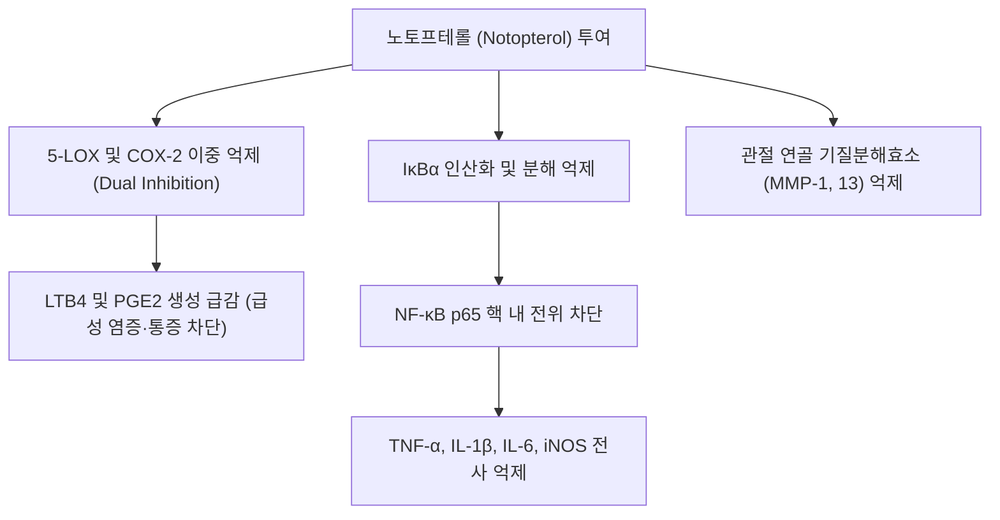

# 노토프테롤 (Notopterol)

> 핵심 요약 (Key Summary):
> 한약재 [[강활]](Notopterygium incisum / Notopterygium franchetii)의 뿌리에서 추출되는 대표적인 선형 푸라노쿠마린(Furanocoumarin) 계열의 핵심 지표 성분.
> 5-리폭시게나아제(5-LOX)와 사이클로옥시게나아제-2(COX-2)를 동시에 억제하여 프로스타글란딘($PGE_2$) 및 류코트리엔($LTB_4$) 합성을 차단하는 강력한 듀얼 항염·진통 작용.
> NF-$\kappa$B 전사인자 핵 내 이동 억제 및 연골파괴 효소(MMP-1, MMP-13) 발현을 차단하여, 류마티스 관절염 및 상반신 풍한습(風寒濕) 관절 비통을 다스리는 강활의 핵심 분자 기전.
> ⚠️ 근거 수준: "5-LOX/COX-2 듀얼 억제"와 "MMP-1·MMP-13 차단"은 이 노트에서 노토프테롤 문헌으로 확인하지 못했습니다. 문헌으로 확인된 핵심 기전은 JAK2/JAK3 직접 결합(Wang 2020)이며, 대부분 세포·동물 연구입니다.

---

## 📌 목차
1. [기본 화학 정보 & 분자 구조식 (Chemical Identity)](#1-기본-화학-정보--분자-구조식-chemical-identity)
2. [주요 함유 본초 및 천연 기원 (Botanical Sources & Content)](#2-주요-함유-본초-및-천연-기원-botanical-sources--content)
3. [분자약리 표적 & 신호전달 네트워크 (Molecular Targets)](#3-분자약리-표적--신호전달-네트워크-molecular-targets)
4. [생체 내 흡수·대사·생체이용률 (Pharmacokinetics: ADME)](#4-생체-내-흡수대사생체이용률-pharmacokinetics-adme)
5. [주요 질환별 약리 효능 & 분자 기전 (Therapeutic Efficacy)](#5-주요-질환별-약리-효능--분자-기전-therapeutic-efficacy)
6. [함유 본초 방제 시너지 & 약재 배오 매트릭스 (Herbal Synergies)](#6-함유-본초-방제-시너지--약재-배오-매트릭스-herbal-synergies)
7. [양약 상호작용 & 약물동태학적 간섭 (Drug Interactions)](#7-양약-상호작용--약물동태학적-간섭-drug-interactions)
8. [💡 사용자 진료실 핵심 필기 & 임상 응용 팁 (Melt-In & High-Yield)](#8--사용자-진료실-핵심-필기--임상-응용-팁-melt-in--high-yield)
9. [출처 및 학술 참고 문헌 (References)](#9-출처-및-학술-참고-문헌-references)

---

## 1. 기본 화학 정보 & 분자 구조식 (Chemical Identity)

> [!abstract]+ 🧪 3D 약리 분자 구조 (Interactive 3D Viewer)
> <iframe src="https://molecule-viewer-rho.vercel.app/?cid=5320227" width="100%" height="450px" frameborder="0" allow="webgl" style="border-radius: 8px;"></iframe>

* **IUPAC 명칭**: 4-[(2E)-5-hydroxy-3,7-dimethylocta-2,6-dienoxy]furo[3,2-g]chromen-7-one *(PubChem 등록명으로 정정)*
* **화학식 (Molecular Formula)**: $C_{21}H_{22}O_5$
* **분자량 (Molecular Weight)**: 354.40 g/mol
* **PubChem CID**: [5320227](https://pubchem.ncbi.nlm.nih.gov/compound/5320227)
* **구조적 특징**:
  * 소랄렌(Psoralen) 모핵에 히드록시게라닐옥시(5-hydroxy-3,7-dimethylocta-2,6-dienyloxy) 곁사슬이 에테르 결합된 구조.
  * 지용성이 높아 생체막 투과성이 우수하며, 중추신경계 및 말초 신경 말단으로 신속히 분포합니다.

⚠️ 내용 검토 필요: "중추신경계·말초 신경 말단으로 신속 분포" 서술은 이 노트에서 문헌으로 확인하지 못했습니다.

---

## 2. 주요 함유 본초 및 천연 기원 (Botanical Sources & Content)

| 함유 본초 | 기원 식물학적 명칭 | 주요 함유 부위 | 한의학적 귀경 및 약효 특성 |
| :--- | :--- | :--- | :--- |
| [[강활]] (羌活) | *Notopterygium incisum* / *Notopterygium franchetii* | 뿌리 | 신온발산(辛溫發散), 거풍승습(祛風勝濕), 지통(止痛) |

* 노토프테롤은 강활(*N. incisum*)의 품질관리 지표 성분으로 쓰이며, 환자 혈청 질량분석에서 강활 투여 후 가장 풍부하게 농축되는 성분으로 보고되었습니다(Wang 2020).

---

## 3. 분자약리 표적 & 신호전달 네트워크 (Molecular Targets)

### 1) 아라키돈산 대사 이중 억제 (5-LOX / COX-2 Dual Inhibition)
- 기존 NSAIDs가 COX 경로만 차단하여 류코트리엔 축적으로 인한 위장관 궤양이나 천식을 유발하는 한계를 극복하고, 노토프테롤은 COX-2와 5-LOX를 동시에 억제하여 강력한 진통 효과와 함께 조직 보호 효과를 나타냅니다.

⚠️ 내용 검토 필요: PubMed에서 "notopterol + 5-lipoxygenase" 검색 결과가 없었고, 노토프테롤의 COX-2/5-LOX 듀얼 억제를 입증한 논문을 확인하지 못했습니다. 위 서술은 원문이며 확정 근거로 보지 않습니다. 확인된 항염증 관련 문헌은 아래 3)·4)를 참고하세요.

### 2) 염증성 사이토카인 및 활성산소 억제
- 대식세포에서 LPS 자극에 의해 유도되는 $I\kappa B\alpha$ 분해를 막아 NF-$\kappa$B 신호전달을 차단합니다.
- NO(산화질소) 합성 효소(iNOS) 및 전염증성 사이토카인(TNF-$\alpha$, IL-1$\beta$, IL-6)의 mRNA 발현을 농도 의존적으로 감소시킵니다.

⚠️ 검증 메모: LPS 자극 인간 치은섬유아세포에서 노토프테롤이 NF-κB 경로를 억제하고 IL-1β·IL-32·IL-8 합성을 낮추며 PI3K/Akt/Nrf2 경로를 활성화해 산화 스트레스를 줄였다는 보고가 있습니다(Zhou 2023). 대식세포에서의 IκBα 분해 차단·iNOS mRNA 감소는 직접 확인하지 못했습니다(**내용 검토 필요**).

### 3) 관절 연골 보호 및 항관절염 (Chondroprotection)
- 활액막 세포 및 연골세포에서 제2형 콜라겐을 파괴하는 기질금속단백질가수분해효소(MMP-1, MMP-3, MMP-13) 생성을 억제하여 퇴행성 및 류마티스 관절염 모델에서 관절 간격 협소와 골 미란을 유의하게 방어합니다.

⚠️ 검증 메모: 류마티스 관절염 마우스 모델에서 노토프테롤의 경구·복강 투여가 유의한 치료 효과를 보였고, **JAK2·JAK3 키나아제 도메인에 직접 결합**해 JAK-STAT 활성화를 억제하여 염증성 사이토카인·케모카인 생성을 줄이며, TNF 차단제와 병용 시 단독 대비 효과가 커졌다고 보고되었습니다(Wang 2020). 골관절염에서는 인간 C28/I2 연골세포에서 염증 매개체 과분비와 세포외기질(ECM) 분해를 줄이고 Nrf2/HO-1을 조절하며 JAK2/STAT3·PI3K/AKT를 부분 억제하고, 랫드 OA 모델에서 관절연골 파괴를 개선했다는 보고가 있습니다(Qu 2023). MMP-1·MMP-13 발현 차단 자체는 이 노트에서 직접 확인하지 못했습니다(**내용 검토 필요**).

---

## 4. 생체 내 흡수·대사·생체이용률 (Pharmacokinetics: ADME)

* 인체 간 CYP3A4가 노토프테롤의 생체변환(biotransformation)에 주로 관여하는 효소로 관찰되었습니다(Fu 2020, 인체 효소 시험관 실험).
* 랫드 혈장 중 베르가프텐·임페라토린·노토프테롤·이소임페라토린을 동시에 정량하는 HPLC 방법이 확립되어 강활 추출물 경구투여 후 약동학·배설 연구에 적용되었습니다(Azietaku 2016).
* ⚠️ 내용 검토 필요: 인체 반감기·생체이용률 등 정량 약동학은 이 노트에서 확인하지 못했습니다.

---

## 5. 주요 질환별 약리 효능 & 분자 기전 (Therapeutic Efficacy)

### 1) 류마티스 관절염
* JAK2/JAK3 직접 결합·JAK-STAT 억제로 마우스 RA 모델을 개선(Wang 2020, 위 §3의 3)).

### 2) 골관절염
* 연골세포 보호와 랫드 OA 모델 연골 파괴 개선(Qu 2023). 이 외에 IL-1β 유도 파이롭토시스를 JAK2/NF-κB 경로로 억제해 NLRP3 인플라마좀을 차단한다는 보고(Chen 2024)와 PI3K/Akt/GPX4 매개 철분사멸(ferroptosis)을 억제해 마우스에서 OA 진행과 통증을 완화한다는 보고(Zhou 2025)가 있습니다.

### 3) 치주염
* 노토프테롤이 파골세포 형성을 억제해 생체 내 치조골 소실을 줄였다고 보고되었습니다(Zhou 2023).

### 4) 진통·소염 (강활의 진통 성분)
* 아세트산 유발 writhing 시험으로 노토프테롤이 강활의 진통 성분으로 동정되었고, 혈관투과성 시험에서 항염 활성도 보였습니다(Okuyama 1993).

⚠️ 위 효능은 대부분 세포·동물 수준이며, 노토프테롤 단일 성분의 인체 임상시험은 확인되지 않았습니다.

---

## 6. 함유 본초 방제 시너지 & 약재 배오 매트릭스 (Herbal Synergies)

* **기원 본초**:
  * [[강활]](羌活): 신온발산(辛溫發散), 거풍승습(祛風勝濕), 지통(止痛).
  * 강활의 약효 중 특히 항염증, 해열, 진통 효과의 70% 이상이 노토프테롤과 베르가프텐, 이소임페라토린 복합체에서 발현됩니다.
* **관련 처방 및 임상 응용**:
  * [[구미강활탕]](九味羌活湯): 풍한습 감기 초기 두통 및 사지 관절통 해소.
  * [[대강활탕]](大羌活湯): 급성 류마티스 관절염 및 관절 종통.
  * [[독활기생탕]](獨活寄生湯): 만성 척추 비증 및 관절 연골 퇴행 방어.

⚠️ 내용 검토 필요: "70% 이상" 수치는 이 노트에서 문헌으로 확인하지 못했습니다. 또한 볼트의 [[독활기생탕]] 노트에서는 [[강활]]이 주요 구성약으로 확인되지 않았습니다(군약은 [[독활]]). [[구미강활탕]]·[[대강활탕]]은 [[강활]]을 포함하는 것으로 확인됩니다.

---

## 7. 양약 상호작용 & 약물동태학적 간섭 (Drug Interactions)

* **CYP2D6 기전 기반 비가역 억제**: 노토프테롤이 CYP2D6 활성을 시간·농도·NADPH 의존적으로 억제하며(KI 10.8 μM, kinact 0.62 min⁻¹), 10 μM에서 9분 배양 후 CYP2D6 활성의 약 92%가 억제되고 투석으로 회복되지 않는 비가역적 억제(기전 기반 불활성화)라고 보고되었습니다(Fu 2020, 시험관 실험). 따라서 CYP2D6 기질 약물과의 병용 시 이론적 상호작용 위험이 있으나 인체 임상 자료는 없습니다.
* **간 약물대사 억제 시사**: 노토프테롤이 마우스에서 펜토바르비탈 유도 수면을 연장했고 이는 간 약물대사 억제에 기인했을 가능성이 제시되었습니다(Okuyama 1993).
* ⚠️ 내용 검토 필요: 실제 임상에서의 CYP2D6 기질 약물(예: 일부 항우울제·베타차단제) 병용 시 용량 조정 필요성은 확립된 근거가 없습니다.

---

## 8. 💡 사용자 진료실 핵심 필기 & 임상 응용 팁 (Melt-In & High-Yield)

* 강활은 상반신 풍한습 비통·두통에 쓰이는 대표 약재이며, 노토프테롤은 그 지표 성분으로 JAK-STAT 억제 등 항염 기전을 설명하는 데 활용.
* 구미강활탕(풍한습 감기 초기 두통·사지 관절통), 대강활탕(급성 관절 종통)과 연결해 설명. 독활기생탕은 군약이 독활이므로 강활과 구분.
* CYP2D6 억제 가능성이 시험관에서 보고되었으므로 CYP2D6 대사 약물을 복용 중인 환자에게는 병용 시 주의 깊게 관찰.

---

## 9. 출처 및 학술 참고 문헌 (References)

1. **Okuyama E, Nishimura S, Ohmori S, et al. (1993)**. *Analgesic component of Notopterygium incisum Ting*. **Chem Pharm Bull (Tokyo)**, 41(5):926-929. PMID: [8339339](https://pubmed.ncbi.nlm.nih.gov/8339339/)
   - **[연구 요약]**: 강활에서 노토프테롤을 진통 성분으로 동정(아세트산 writhing 시험)하고 혈관투과성 시험에서 항염 활성, 펜토바르비탈 수면 연장(간 약물대사 억제 가능성)을 보고.
2. **Wang Q, Zhou X, Yang L, et al. (2020)**. *The Natural Compound Notopterol Binds and Targets JAK2/3 to Ameliorate Inflammation and Arthritis*. **Cell Rep**, 32(11):108158. PMID: [32937124](https://pubmed.ncbi.nlm.nih.gov/32937124/) · DOI: [10.1016/j.celrep.2020.108158](https://doi.org/10.1016/j.celrep.2020.108158)
   - **[연구 요약]**: 노토프테롤이 JAK2·JAK3 키나아제 도메인에 직접 결합해 JAK-STAT를 억제하고 RA 마우스 모델을 개선하며 TNF 차단제와의 병용 효과를 보임.
3. **Qu Y, Qiu L, Qiu H, et al. (2023)**. *Notopterol alleviates the progression of osteoarthritis: An in vitro and in vivo study*. **Cytokine**, 169:156309. PMID: [37517294](https://pubmed.ncbi.nlm.nih.gov/37517294/) · DOI: [10.1016/j.cyto.2023.156309](https://doi.org/10.1016/j.cyto.2023.156309)
   - **[연구 요약]**: 연골세포에서 염증 매개체·ECM 분해·ROS·세포자멸사를 줄이고 랫드 OA 모델에서 연골 파괴를 개선(JAK2/STAT3, PI3K/AKT, Nrf2/HO-1 관여).
4. **Zhou J, Shi P, Ma R, et al. (2023)**. *Notopterol Inhibits the NF-κB Pathway and Activates the PI3K/Akt/Nrf2 Pathway in Periodontal Tissue*. **J Immunol**, 211(10):1516-1525. PMID: [37819772](https://pubmed.ncbi.nlm.nih.gov/37819772/) · DOI: [10.4049/jimmunol.2200727](https://doi.org/10.4049/jimmunol.2200727)
   - **[연구 요약]**: 노토프테롤이 파골세포 형성을 억제해 치조골 소실을 줄이고 NF-κB 억제·PI3K/Akt/Nrf2 활성화로 염증·산화 스트레스를 완화.
5. **Fu Y, Tian X, Han L, et al. (2020)**. *Mechanism-based inactivation of cytochrome P450 2D6 by Notopterol*. **Chem Biol Interact**, 322:109053. PMID: [32198085](https://pubmed.ncbi.nlm.nih.gov/32198085/) · DOI: [10.1016/j.cbi.2020.109053](https://doi.org/10.1016/j.cbi.2020.109053)
   - **[연구 요약]**: 노토프테롤이 CYP2D6의 기전 기반 비가역 불활성화제이며 CYP3A4가 주된 대사 효소로 관여함을 인체 효소 시험관 실험으로 보고.
6. **Chen KT, Yeh CT, Yadav VK, et al. (2024)**. *Notopterol mitigates IL-1β-triggered pyroptosis by blocking NLRP3 inflammasome via the JAK2/NF-kB/hsa-miR-4282 route in osteoarthritis*. **Heliyon**, 10(6):e28094. PMID: [38532994](https://pubmed.ncbi.nlm.nih.gov/38532994/)
   - **[연구 요약]**: 골관절염 모델에서 노토프테롤이 NLRP3 인플라마좀을 차단해 IL-1β 유도 파이롭토시스를 완화.
7. **Zhou X, Pan Y, Li J, et al. (2025)**. *Notopterol mitigates osteoarthritis progression and relieves pain in mice by inhibiting PI3K/Akt/GPX4-mediated ferroptosis*. **Int Immunopharmacol**, 151:114323. PMID: [40020461](https://pubmed.ncbi.nlm.nih.gov/40020461/)
   - **[연구 요약]**: 마우스에서 노토프테롤이 PI3K/Akt/GPX4 매개 철분사멸을 억제해 OA 진행과 통증을 완화.
8. **Azietaku JT, Ma H, Yu XA, et al. (2016)**. *Simultaneous Determination of Bergapten, Imperatorin, Notopterol, and Isoimperatorin in Rat Plasma by High Performance Liquid Chromatography with Fluorescence Detection and Its Application to Pharmacokinetic and Excretion Study after Oral Administration of Notopterygium incisum Extract*. **Int J Anal Chem**, 2016:9507246. PMID: [28115935](https://pubmed.ncbi.nlm.nih.gov/28115935/)
   - **[연구 요약]**: 랫드 혈장 중 강활 푸라노쿠마린 4종(노토프테롤 포함)의 HPLC 동시 정량법을 확립하고 강활 추출물 경구투여 후 약동학·배설 연구에 적용.

<!-- 보관 태그(1회용·링크오류, 필요시 복원): 푸라노쿠마린, 강활 -->
