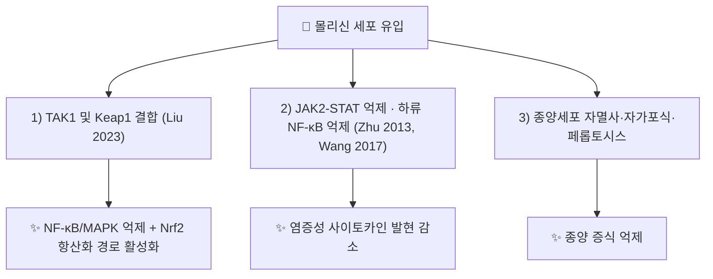

# 🔬 몰리신 (Mollugin, C₁₇H₁₆O₄ / methyl 6-hydroxy-2,2-dimethylbenzo[h]chromene-5-carboxylate)

> **핵심 3줄 요약 (Key Summary)**:
> - 🌿 기원 본초 & 화학 계열: [[천초근]](茜草根, 꼭두서니과 *Rubia cordifolia* 뿌리)에 함유된 나프토하이드로퀴논(naphthohydroquinone)계 화합물. 천초근의 대표적 지표 성분 중 하나.
> - 🎯 핵심 분자 표적: [[NF-κB]]·[[MAPK pathway]] 신호 경로 억제를 통한 항염증, 세포자멸사 유도를 통한 항종양, 지질대사 조절(PPAR 경로 관련) 작용이 다면적으로 제시됨. (⚠️ PPAR 경로는 이번 검증에서 문헌 확인 못 함 — §3 참조)
> - 🩺 주요 약리 활성: 항염증, 항종양, 항산화, 항당뇨·지질대사 개선 등 다양한 약리 활성이 세포·동물 연구에서 보고되며, 천초근의 양혈지혈(涼血止血)·활혈거어(活血祛瘀) 효능의 현대적 근거 중 하나로 다뤄짐.
> - ⚠️ 근거 수준: 다면적 약리 활성이 보고되지만 대부분 세포·동물 연구 수준이며, 사람 대상 임상 근거는 부족합니다. 또한 인간 간 마이크로솜 시험관 실험에서 CYP1A2를 강하게 억제(IC50 약 1 μM)한다고 보고되어 병용 양약 상호작용에 주의가 필요합니다(§7).

---

## 📌 목차
1. [기본 화학 정보 & 분자 구조식 (Chemical Identity)](#1-기본-화학-정보--분자-구조식-chemical-identity)
2. [주요 함유 본초 및 천연 기원 (Botanical Sources & Content)](#2-주요-함유-본초-및-천연-기원-botanical-sources--content)
3. [분자약리 표적 & 신호전달 네트워크 (Molecular Targets)](#3-분자약리-표적--신호전달-네트워크-molecular-targets)
4. [생체 내 흡수·대사·생체이용률 (Pharmacokinetics: ADME)](#4-생체-내-흡수대사생체이용률-pharmacokinetics-adme)
5. [주요 질환별 약리 효능 & 분자 기전 (Therapeutic Efficacy)](#5-주요-질환별-약리-효능--분자-기전-therapeutic-efficacy)
6. [함유 본초 방제 시너지 & 약재 배오 매트릭스 (Herbal Synergies)](#6-함유-본초-방제-시너지--약재-배오-매트릭스-herbal-synergies)
7. [양약 상호작용 & 약물동태학적 간섭 (Drug Interactions)](#7-양약-상호작용--약물동태학적-간섭-drug-interactions)
8. [💡 사용자 진료실 핵심 필기 & 임상 응용 팁 (Melt-In & High-Yield)](#8--사용자-진료실-핵심-필기--임상-응용-팁-melt-in--high-yield)
9. [출처 및 학술 참고 문헌 (References)](#9-출처-및-학술-참고-문헌-references)

---

## 1. 기본 화학 정보 & 분자 구조식 (Chemical Identity)

> [!abstract]+ 🧪 3D 약리 분자 구조 (Interactive 3D Viewer)
> <iframe src="https://molecule-viewer-rho.vercel.app/?cid=124219" width="100%" height="450px" frameborder="0" allow="webgl" style="border-radius: 8px;"></iframe>

| 항목 | 상세 내용 |
| :--- | :--- |
| **IUPAC 명칭** | methyl 6-hydroxy-2,2-dimethylbenzo[h]chromene-5-carboxylate (PubChem 등록명) |
| **분자식 / 분자량** | C₁₇H₁₆O₄ / 약 284.31 g/mol |
| **PubChem CID** | [124219](https://pubchem.ncbi.nlm.nih.gov/compound/124219) (PubChem 실측 확인: 표제어 Mollugin, 이명 Rubimaillin) |
| **CAS 등록 번호** | 55481-88-4 (PubChem 이명 목록 기준) |
| **화학 골격 분류** | 나프토하이드로퀴논(Naphthohydroquinone)계 화합물 (PubChem 명명상 골격은 벤조[h]크로멘(나프토피란)) |
| **물리화학적 성상** | XLogP 4.1(PubChem 계산값 — 지용성). 외관 성상·열/빛 안정성·맛은 ⚠️ 내용 검토 필요(미확인) |
| **식물 내 생합성 경로** | ⚠️ 내용 검토 필요(원문에 서술 없음, 이번 검증에서 확인하지 못함) |

---

## 2. 주요 함유 본초 및 천연 기원 (Botanical Sources & Content)

| 함유 본초 | 기원 식물학적 명칭 | 주요 함유 부위 | 지표 함량 (%) | 한의학적 귀경 및 약효 특성 |
| :--- | :--- | :--- | :--- | :--- |
| [[천초근]] (茜草根) | 꼭두서니과 / *Rubia cordifolia* | 뿌리 | ⚠️ 미확인 | 간경 귀경, 양혈지혈(涼血止血)·활혈거어(活血祛瘀)·통경(通經) |

> 볼트의 [[천초근]] 노트는 기원 식물을 *Rubia akane* 또는 *Rubia cordifolia*로 기재합니다. 아래 §3~§5 문헌에서 몰리신을 분리한 원료는 *R. cordifolia* 뿌리로 보고됩니다(Wang Z 2017, Tran 2013).

---

## 3. 분자약리 표적 & 신호전달 네트워크 (Molecular Targets)

### 1) 핵심 분자 표적 (Molecular Targets)
* **항염증**: [[NF-κB]]·[[MAPK pathway]] 신호 경로 억제를 통한 염증성 사이토카인 감소 효과가 다수 연구에서 보고됩니다.
  * 패혈증 마우스(CLP) 연구에서 몰리신은 TAK1 인산화를 억제해 그 하류의 IKK와 MAPK를 통한 NF-κB/MAPK 신호를 차단하고, 동시에 Keap1과 결합(CETSA·도킹)하며 [[Nrf2]] 항산화 경로를 활성화했다고 보고됩니다(Liu 2023).
  * HeLa 세포에서 TNF-α로 유도된 IKK 인산화·IκBα 분해·p65 인산화 및 핵 이동을 억제했고, 이종이식 종양의 성장도 억제했습니다(Wang 2017).
  * 대식세포에서 ZFP91을 낮춰 pro-IL-1β의 K63 유비퀴틴화와 Caspase-8 인플라마좀 조립을 억제하고 IL-1β 분비를 줄였다는 보고가 있습니다(Song 2025).
  * ⚠️ 내용 검토 필요: RAW264.7 대식세포 연구(Zhu 2013)에서는 몰리신이 IκBα 분해와 p65 핵 이동을 억제하지 않았고 오히려 p65 인산화를 증가시켰으며, 대신 JAK2-STAT1/3 인산화를 억제했습니다(도킹상 JAK2 결합 가능성). 즉 "NF-κB 억제"는 세포 종류·자극(TNF-α vs LPS)에 따라 결과가 다르므로 일괄 서술은 조심해야 합니다.
* **항종양**: 다양한 암세포주에서 세포자멸사 유도를 통한 항증식 효과가 확인됩니다.
  * 여러 암세포에서 미토콘드리아 경로 자멸사와 함께 자가포식이 나타나며, PI3K/AKT/mTOR/p70S6K·ERK 경로가 관여합니다(Zhang 2014).
  * HER2 과발현 암세포에서 Akt/SREBP-1c 신호를 차단해 지방산 합성효소(FAS) 발현을 낮추고 증식을 억제했습니다(Do 2013).
  * 대장암 세포에서 IGF2BP3/GPX4 축 억제를 통한 페롭토시스(Wang W 2023), 비소세포폐암에서 NCOA4 매개 페리티노파지와 Keap1/Nrf2/GPX4 경로 조절을 통한 페롭토시스(Pei 2026)가 보고됩니다.
* **지질·당대사 조절**: PPAR 경로 관련 지질대사 개선 효과가 최근 리뷰에서 정리되고 있습니다.
  * ⚠️ 내용 검토 필요: PubMed에 등재된 리뷰 초록(Olakkengil Shajan 2025)에서는 PPAR 경로를 확인하지 못했고, "지방생성(adipogenesis) 억제" 및 GLP-1 수용체 활성화가 언급됩니다. PPAR 관련 서술은 본문 확인이 필요합니다.
  * 세포막 크로마토그래피로 GLP-1R 결합 소분자로 선별되었고, GLP-1R/cAMP/PKA 경로를 통해 2형 당뇨 마우스의 인지기능 저하를 개선했다는 보고가 있습니다(Wang Z 2023, *Life Sci*).
* **다제내성(P-gp) 조절**: MCF-7/adriamycin 세포에서 AMPK 활성화를 통해 MDR1(P-gp) 전사와 NF-κB·CREB 활성, COX-2 발현을 낮추고 P-gp 기질(로다민-123)의 세포 내 축적을 늘렸습니다(Tran 2013).

---

## 4. 생체 내 흡수·대사·생체이용률 (Pharmacokinetics: ADME)

* **장관 흡수 및 배출 펌프 (P-gp) 상호작용**:
  * 랫드 장 in situ 관류 실험에서 몰리신은 모든 장 구간에서 흡수되며 투과성이 높고, 유효 투과계수는 결장 > 십이지장 > 회장 > 공장 순으로 결장에서 특이적 흡수가 있었습니다(Wang 2012, 중국어 논문).
  * P-gp에 대해서는 "기질로서의 유출"이 아니라 MDR1 발현을 낮춘다는 세포 결과(Tran 2013)만 확인되며, P-gp 기질 여부는 ⚠️ 내용 검토 필요(미확인).
* **장내 미생물총(Microbiome) 대사 전환**:
  * ⚠️ 내용 검토 필요 — 이번 검증에서 몰리신의 장내세균 대사·장간순환 문헌을 확인하지 못했습니다.
* **간 대사 및 소실 반감기**:
  * 랫드에 천초근 추출물(0.82 g/kg)을 경구 투여했을 때 몰리신의 Cmax는 52.10 ± 6.71 ng/mL, Tmax는 1.99 ± 0.21 h였고, 저자들은 푸르푸린·문지스틴·몰리신 모두 "느린 흡수와 대사"를 보인다고 결론지었습니다(Gao 2016). 이는 추출물 투여 시의 랫드 수치이며 사람 수치가 아닙니다.
  * 랫드에 전지캡슐(Qianzhi capsule)을 경구 투여한 연구에서 네 가지 퀴논(푸르푸린·문지스틴·몰리신·알리자린)이 빠르게 흡수되고(tmax 0.80~1.93 h) 비교적 느리게 소실(t1/2 8.07~11.97 h)되었으나, 이는 네 성분의 범위이며 몰리신 단독 값은 초록에서 분리되지 않습니다(Gao 2018).
  * 인체 약동학·제2상 포합·CYP 대사 경로는 ⚠️ 내용 검토 필요(미확인).

---

## 5. 주요 질환별 약리 효능 & 분자 기전 (Therapeutic Efficacy)

> 아래 내용은 전부 세포·동물 수준이며, 사람 대상 임상시험은 이번 검증에서 확인하지 못했습니다.

### 1) 만성 염증 & 감염성 염증
* 패혈증(CLP) 마우스에서 폐·간의 염증성 손상을 완화하고 염증성 사이토카인 수치를 낮췄습니다(Liu 2023). DSS 유도 대장염·alum 유도 복막염 마우스에서 ZFP91 감소를 통해 개선 효과를 보였습니다(Song 2025).

### 2) 항종양
* 위 §3의 자멸사·자가포식(Zhang 2014), HER2 과발현 암(Do 2013), 대장암 페롭토시스(Wang W 2023), 비소세포폐암 페롭토시스 및 파클리탁셀 효과 증강(Pei 2026) 결과가 있습니다. 모두 세포주·이종이식 모델 결과입니다.

### 3) 대사성 질환 & 신경
* GLP-1R 활성화를 통한 2형 당뇨 마우스의 인지기능 개선(Wang Z 2023). 사람 대상 혈당·지질 개선 근거는 ⚠️ 내용 검토 필요(미확인).

---

## 6. 함유 본초 방제 시너지 & 약재 배오 매트릭스 (Herbal Synergies)

| 함유 본초 / 방제 | 공존 유효 성분군 | 분자약리 시너지 기전 | 전통 한의학적 효능 연계 |
| :--- | :--- | :--- | :--- |
| [[천초근]] | [[루비아딘]], 푸르푸린(Purpurin), 문지스틴, 알리자린(Gao 2016·2018에서 몰리신과 함께 정량된 성분) | ⚠️ 내용 검토 필요 — 성분 간 시너지 기전 문헌 미확인 | 양혈지혈·활혈거어·통경 |
| [[십회산]] | (천초근 포함 원전 처방) | ⚠️ 볼트 지침상 천초근은 루비아딘의 유전독성·발암성 우려로 배제하는 것이 원칙(십회산 노트 참조) | 양혈지혈 |

> 한의학적 연계: 몰리신은 [[천초근]]의 양혈지혈·활혈거어 효능을 뒷받침하는 핵심 성분으로, 혈열(血熱)로 인한 토혈·코피·자궁출혈 및 어혈로 인한 폐경·통경에 활용되는 근거로 제시됩니다.
> ⚠️ 내용 검토 필요: 위 "지혈·활혈 효능의 성분 근거"는 이번 PubMed 검증 범위에서 몰리신 단일성분의 지혈·활혈 실험을 확인하지 못했습니다(확인된 활성은 항염증·항종양·GLP-1R 등).

---

## 7. 양약 상호작용 & 약물동태학적 간섭 (Drug Interactions)

* **CYP450 효소 간섭**:
  * 인간 간 마이크로솜에서 몰리신(0~25 μM)은 CYP1A2의 페나세틴 O-탈에틸화를 강하게 억제했습니다(IC50 1.03 μM, 예비배양 시 3.55 μM). 경쟁적·비시간의존적 억제였고, 재조합 CYP1A1과 CYP1A2에서 억제 효과가 비슷했으며, 다른 CYP 이소형에 대해서는 선택적이었다고 보고됩니다(Kim 2013). 저자들은 천초근 등 한약 복용 시 CYP1A2를 통한 약초-약물 상호작용 가능성을 제시했습니다.
  * ⚠️ 내용 검토 필요: 이는 시험관 실험이며 사람 혈중 농도에서의 임상적 의미와 구체적 병용 금기 약물은 확인되지 않았습니다. CYP1A2 기질 약물과 병용할 때는 이론적 우려로만 참고합니다.
* **P-gp 기질 약물**:
  * 세포주에서 MDR1 발현을 낮춘다는 결과(Tran 2013)가 있으나 사람에서의 P-gp 기질 약물 노출 변화는 ⚠️ 내용 검토 필요(미확인).
* **천초근 자체의 안전성(참고)**:
  * 몰리신이 아니라 공존 성분 [[루비아딘]]에 대한 우려입니다. 볼트의 [[십회산]] 노트는 루비아딘의 간·신장 유전독성/발암성 우려로 천초근을 배제하는 지침을 두고 있습니다.

---

## 8. 💡 사용자 진료실 핵심 필기 & 임상 응용 팁 (Melt-In & High-Yield)

* **사용자 원문 필기 (100% 융합 및 보존)**:
  * 원문에는 원장님의 별도 수기 필기가 없었습니다. (추후 직접 보충)
* **진료실 실전 처방 & 생체이용률 극대화 팁**:
  * 몰리신 단일성분의 임상 용법·용량과 흡수 개선 배오 노하우는 문헌에서 확인되지 않아 작성하지 않았습니다. 천초근 사용 시 [[루비아딘]] 안전성 지침은 §6·§7의 [[십회산]] 노트 링크를 참조합니다.

---

## 9. 출처 및 학술 참고 문헌 (References)

1. **Olakkengil Shajan SR, et al. (2025)**. *Mollugin: A Comprehensive Review of Its Multifaceted Pharmacological Properties and Therapeutic Potential*. **Int J Mol Sci** 26(24). [PMID 41465430](https://pubmed.ncbi.nlm.nih.gov/41465430/) · [원문(MDPI)](https://www.mdpi.com/1422-0067/26/24/12003) · DOI 10.3390/ijms262412003
   - **[연구 요약]**: 몰리신의 다면적 약리 활성(항염증·항종양·GLP-1R·다제내성 등)을 종합한 최신 리뷰.
2. **Wen 등 (2022)**. *A comprehensive review of Rubia cordifolia L.: Traditional uses, phytochemistry, pharmacological activities, and clinical applications*. **Front Pharmacol** 13:965390. [원문](https://www.frontiersin.org/journals/pharmacology/articles/10.3389/fphar.2022.965390/full) · DOI 10.3389/fphar.2022.965390 (Crossref로 제목·저널·권호 확인)
   - **[연구 요약]**: 천초근(Rubia cordifolia)의 전통 활용·화학성분(몰리신 포함)·약리·임상 응용을 종합한 리뷰.
3. PubChem Compound Summary — Mollugin (CID 124219): [https://pubchem.ncbi.nlm.nih.gov/compound/Mollugin](https://pubchem.ncbi.nlm.nih.gov/compound/Mollugin)
4. **Liu X, et al. (2023)**. *Mollugin prevents CLP-induced sepsis in mice by inhibiting TAK1-NF-κB/MAPKs pathways and activating Keap1-Nrf2 pathway in macrophages*. **Int Immunopharmacol** 125(Pt A):111079. [PMID 38149576](https://pubmed.ncbi.nlm.nih.gov/38149576/) · DOI 10.1016/j.intimp.2023.111079
   - **[연구 요약]**: 대식세포·CLP 패혈증 마우스에서 TAK1 및 Keap1 결합, NF-κB/MAPK 억제 및 Nrf2 활성화.
5. **Wang Z, et al. (2017)**. *Mollugin Has an Anti-Cancer Therapeutic Effect by Inhibiting TNF-α-Induced NF-κB Activation*. **Int J Mol Sci** 18(8). [PMID 28933726](https://pubmed.ncbi.nlm.nih.gov/28933726/) · DOI 10.3390/ijms18081619
   - **[연구 요약]**: TNF-α 유도 IKK–IκBα–p65 경로 억제, HeLa 이종이식 종양 성장 억제.
6. **Zhu ZG, et al. (2013)**. *Mollugin inhibits the inflammatory response in lipopolysaccharide-stimulated RAW264.7 macrophages by blocking the Janus kinase-signal transducers and activators of transcription signaling pathway*. **Biol Pharm Bull** 36(3):399-406. [PMID 23318249](https://pubmed.ncbi.nlm.nih.gov/23318249/) · DOI 10.1248/bpb.b12-00804
   - **[연구 요약]**: LPS 자극 대식세포에서 IκBα 분해·p65 핵 이동은 억제하지 않고 JAK2-STAT 경로를 억제.
7. **Song L, et al. (2025)**. *Mollugin inhibits IL-1β production by reducing zinc finger protein 91-regulated Pro-IL-1β ubiquitination and inflammasome activity*. **Int Immunopharmacol** 145:113757. [PMID 39642566](https://pubmed.ncbi.nlm.nih.gov/39642566/) · DOI 10.1016/j.intimp.2024.113757
   - **[연구 요약]**: ZFP91 감소를 통한 IL-1β 억제, DSS 대장염·복막염 마우스 개선.
8. **Zhang L, et al. (2014)**. *Mollugin induces tumor cell apoptosis and autophagy via the PI3K/AKT/mTOR/p70S6K and ERK signaling pathways*. **Biochem Biophys Res Commun** 450(1):247-254. [PMID 24887566](https://pubmed.ncbi.nlm.nih.gov/24887566/) · DOI 10.1016/j.bbrc.2014.05.101
   - **[연구 요약]**: 미토콘드리아 자멸사와 자가포식 유도, 자가포식 차단 시 세포독성 증가.
9. **Do MT, et al. (2013)**. *Mollugin inhibits proliferation and induces apoptosis by suppressing fatty acid synthase in HER2-overexpressing cancer cells*. **J Cell Physiol** 228(5):1087-1097. [PMID 23065756](https://pubmed.ncbi.nlm.nih.gov/23065756/) · DOI 10.1002/jcp.24258
   - **[연구 요약]**: HER2/Akt/SREBP-1c를 통한 FAS 발현 억제와 증식 억제.
10. **Wang W, et al. (2023)**. *Mollugin suppresses proliferation and drives ferroptosis of colorectal cancer cells through inhibition of insulin-like growth factor 2 mRNA binding protein 3/glutathione peroxidase 4 axis*. **Biomed Pharmacother** 166:115427. [PMID 37677963](https://pubmed.ncbi.nlm.nih.gov/37677963/) · DOI 10.1016/j.biopha.2023.115427
    - **[연구 요약]**: 대장암 세포 IGF2BP3/GPX4 축 억제를 통한 페롭토시스, 이종이식 종양 억제.
11. **Pei Y, et al. (2026)**. *Mollugin induces ferroptosis through dysregulation of iron homeostasis and redox balance in non-small cell lung cancer*. **Phytomedicine** 157:158316. [PMID 42241811](https://pubmed.ncbi.nlm.nih.gov/42241811/) · DOI 10.1016/j.phymed.2026.158316
    - **[연구 요약]**: NCOA4 매개 페리티노파지·Keap1/Nrf2/GPX4 조절, 파클리탁셀 효능 증강.
12. **Tran TP, et al. (2013)**. *Reversal of P-glycoprotein-mediated multidrug resistance is induced by mollugin in MCF-7/adriamycin cells*. **Phytomedicine** 20(7):622-631. [PMID 23466342](https://pubmed.ncbi.nlm.nih.gov/23466342/) · DOI 10.1016/j.phymed.2013.01.014
    - **[연구 요약]**: AMPK 활성화를 통한 MDR1 발현·NF-κB·CREB·COX-2 억제.
13. **Wang Z, et al. (2023)**. *Mollugin activates GLP-1R to improve cognitive dysfunction in type 2 diabetic mice*. **Life Sci** 331:122026. [PMID 37607641](https://pubmed.ncbi.nlm.nih.gov/37607641/) · DOI 10.1016/j.lfs.2023.122026
    - **[연구 요약]**: GLP-1R/cAMP/PKA 경로 활성화로 2형 당뇨 마우스 인지기능 개선.
14. **Kim H, et al. (2013)**. *Selective inhibitory effects of mollugin on CYP1A2 in human liver microsomes*. **Food Chem Toxicol** 51:33-37. [PMID 23000442](https://pubmed.ncbi.nlm.nih.gov/23000442/) · DOI 10.1016/j.fct.2012.09.013
    - **[연구 요약]**: 인간 간 마이크로솜에서 CYP1A2 선택적·경쟁적 억제(IC50 1.03 μM).
15. **Gao M, et al. (2016)**. *Simultaneous Determination of Purpurin, Munjistin and Mollugin in Rat Plasma by Ultra High Performance Liquid Chromatography-Tandem Mass Spectrometry: Application to a Pharmacokinetic Study after Oral Administration of Rubia cordifolia L. Extract*. **Molecules** 21(6). [PMID 27258244](https://pubmed.ncbi.nlm.nih.gov/27258244/) · DOI 10.3390/molecules21060717
    - **[연구 요약]**: 랫드 경구 투여 후 몰리신 Cmax 52.10 ng/mL·Tmax 1.99 h.
16. **Gao M, et al. (2018)**. *Simultaneous determination and pharmacokinetics study of four quinones in rat plasma by ultra high performance liquid chromatography with electrospray ionization tandem mass spectrometry after the oral administration of Qianzhi capsules*. **J Sep Sci** 41(10):2161-2168. [PMID 29436170](https://pubmed.ncbi.nlm.nih.gov/29436170/) · DOI 10.1002/jssc.201700981
    - **[연구 요약]**: 네 퀴논의 tmax 0.80~1.93 h, t1/2 8.07~11.97 h.
17. **Wang K, et al. (2012)**. *[Study on intestinal absorption of mollugin and purpurin in rats]*. **Zhongguo Zhong Yao Za Zhi** 37(12):1855-1858. [PMID 22997839](https://pubmed.ncbi.nlm.nih.gov/22997839/)
    - **[연구 요약]**: 랫드 장 구간별 in situ 관류 흡수, 높은 투과성 및 결장 특이적 흡수.

<!-- 보관 태그(1회용·링크오류, 필요시 복원): 나프토퀴논 -->
