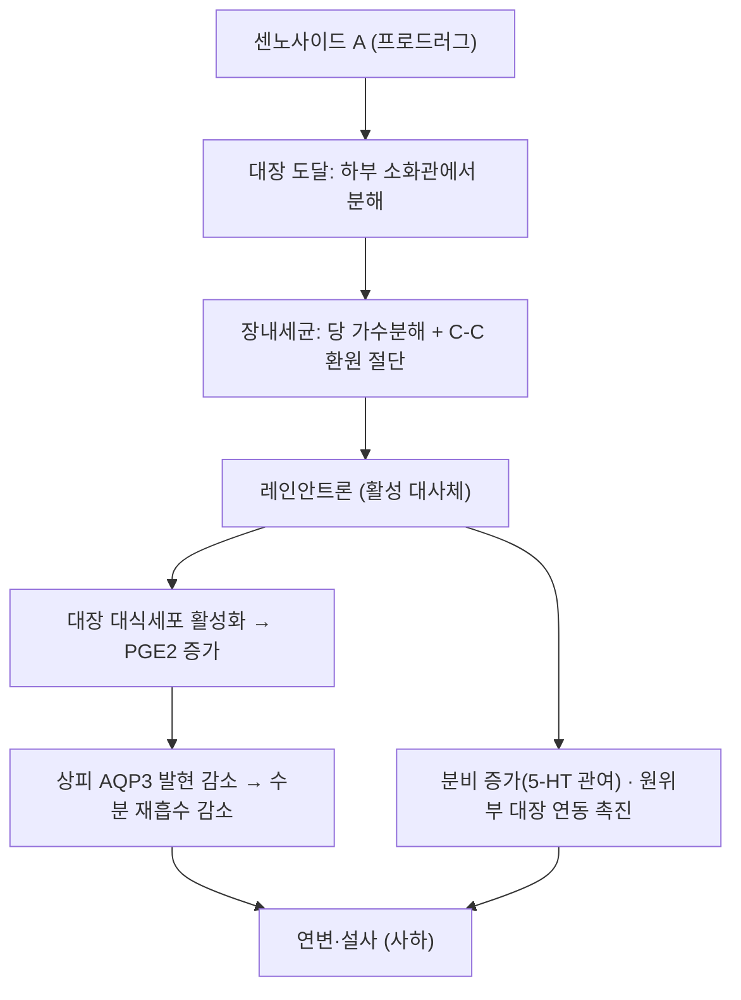

---
aliases:
  - Sennoside A
  - 센노사이드 A
tags:
  - 약리
  - 약리성분
  - 대황
title: 센노사이드 A
date: 2026-09-21
출처: "https://molecule-viewer-rho.vercel.app/?cid=73111\""
---

# 🔬 센노사이드 A (Sennoside A)

> **핵심 3줄 요약 (Key Summary)**:
> - 🌿 기원 본초 & 화학 계열: [[대황]](Rheum palmatum) 및 센나엽에 함유된 대표적인 천연 다이안트론계 자극성 사하 배당체
> - 🎯 핵심 분자 표적 & 조절 경로: 장내 미생물에 의해 레인안트론으로 대사된 후 대장 수분 흡수 차단 및 연동운동을 촉진하여 통변 (⚠️ 확인된 기전은 대장 대식세포의 PGE2 분비 증가 → 상피 AQP3 발현 감소이며, 원문의 Na⁺/K⁺-ATPase 억제는 랫드 실험에서 관여하지 않는 것으로 보고되었습니다. §3)
> - 🩺 주요 약리 활성 & 질환 치료 기전: 실열변비·적취 치료 한의 공하축수 처방의 핵심 분자 지표이자 장기 연복 시 대장흑색증 유발 (⚠️ 대장흑색증은 안트라퀴논계 하제 전반과의 연관이 보고된 가역적 상태이며 센노사이드 A 단독 근거는 확인하지 못했습니다. §7)
> - ⚠️ 독성·생체이용률 한계 & 상호작용: 랫드 경구 절대 생체이용률이 0.9~1.3%로 낮은 프로드러그이며, 인체 약동학과 CYP·P-gp 자료는 확인하지 못했습니다. 감초 성분(글리시리진 유래 글리시레틴산)의 흡수를 낮춘다는 랫드 보고가 있습니다. §4·§7

---

## 📌 목차
1. [기본 화학 정보 & 분자 구조식 (Chemical Identity)](#1-기본-화학-정보--분자-구조식-chemical-identity)
2. [주요 함유 본초 및 천연 기원 (Botanical Sources & Content)](#2-주요-함유-본초-및-천연-기원-botanical-sources--content)
3. [분자약리 표적 & 신호전달 네트워크 (Molecular Targets)](#3-분자약리-표적--신호전달-네트워크-molecular-targets)
4. [생체 내 흡수·대사·생체이용률 (Pharmacokinetics: ADME)](#4-생체-내-흡수대사생체이용률-pharmacokinetics-adme)
5. [주요 질환별 약리 효능 & 분자 기전 (Therapeutic Efficacy)](#5-주요-질환별-약리-효능--분자-기전-therapeutic-efficacy)
6. [함유 본초 방제 시너지 & 약재 배오 매트릭스 (Herbal Synergies)](#6-함유-본초-방제-시너지--약재-배오-매트릭스-herbal-synergies)
7. [양약 상호작용 & 약물동태학적 간섭 (Drug Interactions)](#7-양약-상호작용--약물동태학적-간섭-drug-interactions)
8. [💡 사용자 진료실 핵심 필기 & 임상 응용 팁 (Melt-In & High-Yield)](#8--사용자-진료실-핵심-필기--임상-응용-팁-melt-in--high-yield)
9. [출처 및 학술 참고 문헌 (References)](#9-출처-및-학술-참고-문헌-references)

---

## 1. 기본 화학 정보 & 분자 구조식 (Chemical Identity)

> [!abstract]+ 🧪 3D 약리 분자 구조 (Interactive 3D Viewer)
> <iframe src="https://molecule-viewer-rho.vercel.app/?cid=73111" width="100%" height="450px" frameborder="0" allow="webgl" style="border-radius: 8px;"></iframe>

센노사이드 A(Sennoside A)는 [[대황]](大黃, *Rheum palmatum* L.) 및 센나(*Cassia angustifolia* Vahl)에 존재하는 안트라퀴논 유도체 중 두 분자의 레인안트론이 C10-C10' 탄소 결합으로 연결된 다이안트론(Dianthrone) 비스-글루코사이드 화합물이다.

| 항목 | 상세 내용 |
| :--- | :--- |
| **IUPAC 명칭** | PubChem 등록명: (9R)-9-[(9R)-2-carboxy-4-hydroxy-10-oxo-5-[(2S,3R,4S,5S,6R)-3,4,5-trihydroxy-6-(hydroxymethyl)oxan-2-yl]oxy-9H-anthracen-9-yl]-4-hydroxy-10-oxo-5-[(2S,3R,4S,5S,6R)-3,4,5-trihydroxy-6-(hydroxymethyl)oxan-2-yl]oxy-9H-anthracene-2-carboxylic acid (원문 명칭은 아래 목록 참고) |
| **분자식 / 분자량** | C42H38O20 / 862.70 g/mol (PubChem, 원문 표기 862.74 g/mol) |
| **PubChem CID** | [73111](https://pubchem.ncbi.nlm.nih.gov/compound/73111) (⚠️ 원문 3D 뷰어의 CID 5280805는 PubChem에서 루틴(C27H30O16)이었습니다) |
| **CAS 등록 번호** | 81-27-6 (PubChem 동의어 기준이며 CAS 원본 대조는 못함. ⚠️ 내용 검토 필요) |
| **화학 골격 분류** | 다이안트론(dianthrone) O-배당체. 가수분해하면 아글리콘 센니딘 A와 글루코스 2분자가 생김(Franz 1993). 입체이성질체 센노사이드 B는 [PubChem 91440](https://pubchem.ncbi.nlm.nih.gov/compound/91440)((9S,9'R) 표기)입니다. |
| **물리화학적 성상** | 원문에 기재 없음. 수용성·LogP·안정성은 확인하지 못함 ⚠️ |
| **식물 내 생합성 경로** | 원문에 기재 없음. 센노사이드 A·B는 알로에에모딘 및/또는 레인의 이량체이고 1941년 Stoll이 센나에서 처음 분리·규명했다고 보고됩니다(Franz 1993). 세부 생합성 경로는 확인하지 못함 ⚠️ |

* 영문명: Sennoside A
* 화학식: C42H38O20 (원문의 깨진 표기 `{42}H_{38}O_{20}$`를 PubChem 기준으로 복구)
* 분자량: 862.74 g/mol
* IUPAC 명칭: (10R,10'R)-9,9'-dioxo-10,10'-bi(anthracene)-1,1',8,8'-tetrayl tetrakis(beta-D-glucopyranoside)-3,3'-dicarboxylic acid (입체이성질체인 센노사이드 B는 meso 형태임)
  * ⚠️ 내용 검토 필요: 위 원문 명칭은 글루코피라노사이드가 4개("tetrakis")로 적혀 있으나 PubChem 등록 구조(C42H38O20)에는 글루코실기가 2개이고 카르복실기가 2개입니다. Franz 1993도 가수분해 시 글루코스 2분자가 생긴다고 기술합니다. 원문 명칭은 보존하고 표에 PubChem 등록명을 병기했습니다.
* 대한민국약전(KP)의 대황 품질 표준화 지표 성분.
  * ⚠️ 내용 검토 필요: 볼트 [[대황]] 노트는 KP 규격을 센노사이드 A 0.25% 이상으로 적고 있으나 약전 원문은 온라인에서 확인하지 못했습니다.

---

## 2. 주요 함유 본초 및 천연 기원 (Botanical Sources & Content)

| 함유 본초 (한글/한자) | 기원 식물학적 명칭 (과명 / 학명) | 주요 함유 약용 부위 | 지표 함량 (%) | 한의학적 귀경 및 약효 특성 |
| :--- | :--- | :--- | :--- | :--- |
| [[대황]] (大黃) | 마디풀과 / *Rheum palmatum* L. (원문), 볼트 [[대황]] 노트는 *R. tanguticum*·*R. officinale*도 기원으로 기재 | 뿌리·뿌리줄기 | 원문에 수치 기재 없음 ⚠️ | 사열통변(瀉熱通便)·공하약(攻下藥). 귀경은 [[대황]] 노트 참고 |
| 센나(Senna) | 콩과 / *Cassia angustifolia* Vahl (원문). Franz 1993은 *C. senna*(Alexandria 센나)와 *C. angustifolia*(Tinnevelly 센나)를 구분 | 잎(소엽)·열매(협과). 협과에는 잎과 비슷한 성분이 더 많이 있음(Franz 1993) | 원문에 수치 기재 없음 ⚠️ | 자극성 하제 생약. 볼트에 센나 노트는 없음 |

* **공존 성분**: 대황에는 [[레인]]·[[에모딘]]·[[알로에에모딘]] 같은 안트라퀴논류가 함께 존재하며 센노사이드 A의 사하 작용에 영향을 줍니다(§6). 센나에서는 센노사이드 C·D와 소량의 단량체 배당체·유리 안트라퀴논, 나프탈렌 배당체(6-hydroxymusicin glucoside, tinnevellin glucoside)가 보고됩니다(Franz 1993).
* **지표 함량**: 대황·센나의 센노사이드 A 함량 수치는 이번 조회에서 확인하지 못했습니다. ⚠️ 내용 검토 필요

---

## 3. 분자약리 표적 & 신호전달 네트워크 (Molecular Targets)

### 1) 핵심 분자 표적 (Molecular Targets)

센노사이드 A는 위와 소장에서는 흡수되거나 분해되지 않고 대장까지 온전하게 도달하는 천연 프로드러그(Prodrug)이다.

* 근거: 경구 투여한 센노사이드는 하부 소화관에서만 분해되어 활성 대사체 레인안트론(rhein anthrone)이 생기고, 14C 표지 레인안트론을 랫드 맹장에 넣으면 거의 흡수되지 않았습니다(de Witte 1993). ⚠️ 다만 랫드 경구 절대 생체이용률이 0.9~1.3%로 보고되어(Sun 2025) "흡수되지 않고"는 '거의 흡수되지 않고'에 가깝습니다.

**대장 내 미생물 대사 활성화**
1. 대장 도달: 위산과 소화효소에 안정하여 90% 이상이 불변형으로 대장에 진입한다.
   * ⚠️ 내용 검토 필요: '90% 이상'이라는 수치는 이번 조회에서 확인하지 못했습니다(de Witte 1993은 하부 소화관에서만 분해된다고 기술).
2. 미생물 분해: 대장 상재균(Bifidobacterium 등)이 분비하는 β-글루코시다아제에 의해 당이 떨어져 나가고, 이어 환원효소에 의해 C-C 결합이 절단되어 활성 대사체인 **레인안트론(Rheinanthrone)**으로 전환된다.
   * 근거: 47개 비피도박테리아 균주 중 4개 균주만 센노사이드를 강하게 가수분해했고(70% 이상 감소) 이 균주가 마우스 장 연동을 늘렸습니다(Matsumoto 2012). Enterococcus faecalis의 니트로리덕타제가 C-C 환원 절단을 촉매해 레인안트론을 만든다는 보고(Liu 2025)와, Peptostreptococcus intermedius의 센니딘·센노사이드 환원 보고(Akao 1985; 제목 기준)도 있습니다. 즉 '비피도박테리아 일반'이 아니라 특정 균주·효소가 관여합니다.

**장벽 수분 분비 촉진 및 연동운동 항진**
* 레인안트론은 대장 점막 상피세포의 Na⁺/K⁺-ATPase 펌프를 억제하여 나트륨과 수분의 재흡수를 차단한다.
  * ⚠️ 내용 검토 필요: 랫드 대장에서 센노사이드(50 mg/kg)와 레인(대장 내 투여) 모두 순 수분·Na⁺ 흡수를 줄이거나 분비로 뒤집었지만 점막 Na⁺,K⁺-ATPase 활성은 변하지 않았고 상피 손상도 없었습니다(Leng-Peschlow 1993a, 1993b). 논문은 Na⁺,K⁺-ATPase 억제가 분비 효과에 관여하지 않는다고 결론짓습니다.
* 점막의 염화이온(Cl⁻) 분비를 촉진하고 아라키돈산 대사를 자극하여 PGE2 방출을 증가시킨다.
  * 근거(PGE2): 랫드에서 대황 추출물·센노사이드 A 투여 시 대장 PGE2가 늘고 AQP3 발현이 줄었으며, 대식세포 Raw264.7 세포에서 레인안트론만 PGE2를 유의하게 늘렸습니다. 인도메타신 전처치 시 센노사이드 A는 AQP3를 줄이지도 설사를 유발하지도 못했습니다(Kon 2014). 마우스 대장에서도 인도메타신이 센노사이드 A에 의한 수축 변화를 줄였습니다(Kobayashi 2007).
  * ⚠️ 염화이온 분비: Leng-Peschlow 1993a는 소분자 투과성이 늘어난 결과가 '능동 염화이온 분비 자극' 개념에 부합한다고 논의했을 뿐 염화이온 분비를 직접 측정한 결과는 아닙니다. '아라키돈산 대사를 자극'하는 세부 단계도 초록에서 확인하지 못했습니다.
* 점막하 신경총(Meissner's plexus)과 근층간 신경총(Auerbach's plexus)을 직접 자극하여 대장의 추진성 연동운동을 폭발적으로 유도함으로써 8~12시간 이내에 배변을 완수한다.
  * ⚠️ 내용 검토 필요: '신경총 직접 자극'과 '8~12시간'은 초록에서 확인하지 못했습니다. 마우스 대장에서 센노사이드 A는 근위부 대장의 자발 수축을 줄이고 원위부에서 늘렸으며, 콜린성 신경 매개는 부분적이었고 루미날 프로스타노이드 수준과 연관되었습니다(Kobayashi 2007). 랫드에서는 투여 6시간 뒤 순 분비로 전환되었고(Leng-Peschlow 1993b), 인체 결장루에서는 센나 배당체 자체는 운동을 바꾸지 못하고 분변·대장균과 배양한 활성형이나 레인안트론이 접촉 자극으로 연동을 일으켰으며 직장에는 반응이 없었습니다(Hardcastle 1970).
* 위 두 절의 원문 표기 `$eta$`, `^+/K^+$`, `^-$`는 깨진 LaTeX여서 β, Na⁺/K⁺, Cl⁻로 복구했습니다.

### 2) 원문에 없던 확인된 기전
* **대식세포–PGE2–AQP3 축**: 레인안트론이 대장 대식세포를 활성화해 PGE2 분비를 늘리고, PGE2가 측분비 인자로 상피 세포의 AQP3 발현을 낮춰 관강에서 혈관 쪽으로의 수분 이동을 줄입니다(Kon 2014). [[아쿠아포린]]·[[프로스타글란딘]] 노트 참고.
* **세로토닌(5-HT) 매개**: 랫드에서 센노사이드가 관강 내 5-HT 방출을 7.1에서 17.3 ng/g으로 늘렸고, 5-HT3 길항제 그라니세트론이 센노사이드 유발 분비를 완전히 없앴으며 설사 발생도 줄였습니다(Beubler 1993). [[세로토닌]] 노트 참고.

---

## 4. 생체 내 흡수·대사·생체이용률 (Pharmacokinetics: ADME)

* **장관 흡수 및 배출 펌프 (P-gp) 상호작용**:
  * 랫드에서 센노사이드 A를 정맥·위내 투여한 약동학에서 경구 후 Tmax는 2.9~3.6시간, Cmax는 13.2~31.7 ng/mL, 소실 반감기는 15.4~18.3시간이었고 경구 절대 생체이용률은 0.9~1.3%로 낮았습니다(Sun 2025; 초록에 용량 조건은 기재되지 않음).
  * P-gp 기질 여부는 문헌을 확인하지 못했습니다. ⚠️ 내용 검토 필요
* **장내 미생물총(Microbiome) 대사 전환**:
  * 센노사이드 A는 장내세균에 의해 레인안트론으로 전환되는 프로드러그이며(§3), 대황에 함께 든 안트라퀴논류와 감초 성분이 이 전환을 빠르게 한다는 마우스·분변 배양 결과가 있습니다(§6; Takayama 2011, 2012).
  * 센노사이드 B의 랫드 대사 연구에서는 가수분해로 아글리콘이 생기고 레인형 안트론이 유리되며 광범위한 포합이 일어나 14종의 대사체가 확인되었고, 혈장에서는 모체만 검출되었으며 경구 절대 생체이용률은 3.60%였습니다(Wu 2020; 센노사이드 B 결과이므로 참고용).
* **간 대사 및 소실 반감기**:
  * 센노사이드 A의 인체 약동학, 간 CYP450 대사, 장-간 순환은 확인하지 못했습니다. 랫드 반감기(위 수치)만 있습니다. ⚠️ 내용 검토 필요

---

## 5. 주요 질환별 약리 효능 & 분자 기전 (Therapeutic Efficacy)

### 1) 변비·통변 (임상)
* 원문 핵심: 대장 수분 흡수 차단 및 연동운동 촉진으로 통변(§3).
* 만성 특발성 변비 환자 90명을 무작위 배정한 이중맹검 위약 대조 시험에서 센나 1.0 g을 28일 투여한 군의 전반적 증상 개선 반응률이 69.2%로, 산화마그네슘 1.5 g군(68.3%)과 비슷했고 위약군(11.7%)보다 높았으며 중증 치료 관련 이상반응은 없었습니다(Morishita 2021). 센나 제제 결과이며 센노사이드 A 단독 결과가 아닙니다.

### 2) 대사 질환 & 장 장벽 (전임상)
* 고지방식이 비만 마우스에 30 mg/kg/일을 8주 투여했을 때 인슐린 감수성이 개선되고 대장의 GLP-1 mRNA와 혈장 GLP-1이 회복되었으며, 장내 미생물 구성과 단쇄지방산이 복원되고 장세포의 미토콘드리아 스트레스가 억제되었습니다(Le 2019). [[GLP-1]] 노트 참고.
* db/db 마우스에서 혈당·체중·지질대사·인슐린 저항성이 개선되었고 분변 이식으로 혈당 저하 효과가 재현되어 장내 세균 변화가 관여한다고 제시되었습니다(Wei 2020).
* 비만 마우스 대장에서 밀착연접 단백질(Occludin, Claudin-2, ZO-1) mRNA가 늘고 미토콘드리아 ROS 유도 손상이 줄어 장벽 기능이 회복되었습니다(Ma 2020).
* 고지방식이 MAFLD 마우스(30 mg/kg, 12주)에서 지방간과 대사성 염증이 완화되고 TLR4/NF-κB 매개 염증 억제와 미토콘드리아 품질관리 회복을 통해 장벽이 보호되었습니다(Ma 2026). [[TLR4]]·[[NF-κB]] 노트 참고.
* ⚠️ 위 결과는 모두 마우스 연구이며 인체 근거는 확인하지 못했습니다.

### 3) 항종양 (세포·동물 수준)
* 센노사이드 A는 slingshot(SSH) 인산가수분해효소 계열의 억제제로 확인되었고(Ki가 서브마이크로몰~한 자릿수 마이크로몰), 췌장암 세포에서 cofilin 인산화를 늘려 이동·침윤을 줄였습니다(Lee 2017).
* 전립선암(PI3K/AKT/mTOR), 비소세포폐암(TRAF6/NF-κB), 구강편평세포암(NF-κB, 페롭토시스), 간세포암 전이(전사체 분석) 세포 연구가 있으나 제목 기준으로만 인용합니다(참고문헌 29).
* ⚠️ 동물·인체 항종양 효과는 센노사이드 A 단독으로는 확인하지 못했습니다. 반대로 센나 추출물의 랫드 발암성과 유전독성 우려는 낮은 것으로 종설되었습니다(§7).

### 4) 한의학적 연계 (원문 §3)
* 대황과 처방의 연계는 §6에 원문 그대로 옮겼습니다.

---

## 6. 함유 본초 방제 시너지 & 약재 배오 매트릭스 (Herbal Synergies)

대황은 한의학에서 사열통변(瀉熱通便), 탕척장위(蕩滌腸胃)하는 장군(將軍)의 약재로 실열 변비와 적취를 몰아내는 공하약(攻下藥)의 으뜸이다.

### 1) 원문 처방 연계표

| 처방명 | 주치 병증 | 센노사이드 A 매개 역할 |
| :--- | :--- | :--- |
| [[대승기탕]] | 양명부실증, 조열, 섬어, 대변비결 | 강력한 사열통부, 장내 독소 신속 배출 |
| [[조위승기탕]] | 양명병 경증, 변비, 복만 | 완화한 사하 및 장열 제거 |
| [[대황목단피탕]] | 장옹(급성 맹장염), 하복부 압통 | 장관 염증 억제 및 어혈·농양 사하 |

* 볼트 처방 노트에서 세 처방 모두 대황이 군약으로 구성에 들어 있음을 확인했습니다(대승기탕: 대황·망초·후박·지실, 조위승기탕: 대황·망초·감초, 대황목단피탕: 대황·목단피·도인·동과자·망초).
* ⚠️ 내용 검토 필요: 위 표의 '센노사이드 A 매개 역할'(예: 장관 염증 억제, 어혈·농양 사하)을 처방 수준에서 센노사이드 A로 분리해 확인한 문헌은 찾지 못했습니다. 처방의 사하 효과에는 망초 등 다른 약재와 대황의 다른 성분이 함께 기여합니다.

### 2) 배오 매트릭스

| 함유 본초 / 방제 | 공존 유효 성분군 | 분자약리 시너지 기전 | 전통 한의학적 효능 연계 |
| :--- | :--- | :--- | :--- |
| [[대황]] | [[레인]], [[에모딘]], [[알로에에모딘]] 등 안트라퀴논류 | 레인 8-O-글루코시드와 레인이 센노사이드 A의 장내세균 대사를 빠르게 하고 함께 투여하면 마우스에서 센노사이드 A의 사하 작용이 용량 의존적으로 빨라짐(Takayama 2012). 에모딘과 알로에에모딘도 대사를 촉진 | 사열통변, 공하 |
| [[대황감초탕]] | [[감초]]의 리퀴리틴·리퀴리틴 아피오사이드 | 리퀴리틴·리퀴리틴 아피오사이드가 마우스 분변에서 센노사이드 A 대사 속도를 높였으나 글리시리진은 변화 없음(Takayama 2011). ⚠️ 시험관 결과 | 대황의 급렬한 사하를 완급지통으로 조화 |
| [[조위승기탕]] | 망초의 황산나트륨, 자감초 | ⚠️ 내용 검토 필요 — 센노사이드 A와 황산나트륨·감초 성분 간 시너지 문헌 미확인 | 사열통변·윤조연견, 완화한 조위 |

---

## 7. 양약 상호작용 & 약물동태학적 간섭 (Drug Interactions)

* **부작용 및 복용 주의사항 (원문 §4)**:
  1. 대장흑색증 (Melanosis Coli):
     * 센노사이드 A를 수개월 이상 장기 연복하면 대장 점막 대식세포 내에 리포푸신(Lipofuscin) 유사 안트라센 색소가 침착되어 대장 점막이 흑갈색으로 착색된다. (가역적이므로 중단 시 호전됨)
     * ⚠️ 내용 검토 필요: 대장흑색증이 안트라퀴논계 하제 사용과 뚜렷한 상관을 보이고 가역적이며 세포자멸사 기전이 널리 받아들여진다는 종설이 있습니다(Yang 2020). 색소는 점막 고유층 대식세포에 쌓이고 리포푸신·세로이드와 공통된 염색 성질에 멜라닌 성분을 함께 보이며 상피의 세포자멸사체가 많았습니다(Benavides 1997). 다만 '센노사이드 A 단독', '안트라센 색소'라는 표현과 '수개월'이라는 기간은 확인하지 못했습니다. 색소 침착은 기능적 결과가 없다고 서술됩니다(Müller-Lissner 1993).
  2. 하제 결장 (Cathartic Colon):
     * 장기 의존 시 대장 근육층의 신경총 변성 및 평활근 위축으로 자발적인 장 운동 능력이 영구 상실될 위험.
     * ⚠️ 내용 검토 필요: 센나의 장기 사용이 장신경이나 평활근의 구조·기능 변화를 일으킨다는 확실한 증거는 없고 랫드에서 2년간 300 mg/kg/일까지 발암성이 없었다는 종설이 있습니다(Morales 2009). 최근 수십 년간 '하제 결장' 사례가 관찰되지 않았고 지금은 쓰이지 않는 하제가 원인이었을 가능성이 서술됩니다(Müller-Lissner 1993). 원문의 '영구 상실'은 이 자료와 방향이 다릅니다.
  3. 임산부 및 수유부 금기: 골반강 장기 충혈을 유발하여 유산 위험이 있으며, 모유를 통해 영아에게 이행되어 설사를 유발함.
     * ⚠️ 내용 검토 필요: 센나 복용 임산부의 신생아 선천기형 위험은 높지 않았고(보정 OR 1.0, Acs 2009), 산후 여성 20명의 모유 100건에서 레인이 대부분 10 ng/mL 미만이고 섭취량의 0.007%가 배설되었으며 수유 영아 중 배변 이상은 없었습니다(Faber 1988). 원문의 '모유 이행에 의한 영아 설사'와 다릅니다. '골반강 충혈에 의한 유산 위험'은 이번 조회에서 확인하지 못했습니다. 이 결과들은 센나 제제 기준이며 센노사이드 A 단독 자료가 아닙니다.
* **과량 사용**: 하제를 권장량보다 훨씬 많이 쓰면(남용) 저칼륨혈증·대사성 알칼리증·신세뇨관 손상이 생길 수 있습니다(Müller-Lissner 1993).
* **CYP450 효소 간섭**:
  * 센노사이드 A의 CYP 억제·유도 문헌은 확인하지 못했습니다. ⚠️ 내용 검토 필요
* **유사 기전 양약 병용 시 고려사항**:
  * 랫드에서 감초 성분 글리시리진과 사하 효과가 없는 용량의 센노사이드 A를 함께 주면 글리시레틴산(GA)의 AUC와 Cmax가 감소했고, 결장 루프 실험에서 레인이 최대 약 75%, 센노사이드 A가 약 60%, 센니딘 A가 약 25% GA 흡수를 억제했습니다. 대황과 감초가 든 일본 한방(Kampo) 제제 온비토(Onpito, TJ-8117)를 사람에게 투여했을 때도 GA의 혈중 AUC·Cmax가 낮게 관찰되었습니다(Mizuhara 2005).
  * 다른 자극성 하제·이뇨제와 병용 시 저칼륨혈증이 겹칠 수 있다는 서술은 하제 남용 자료(Müller-Lissner 1993)에 근거한 이론적 고려이며 센노사이드 A와의 병용 연구는 확인하지 못했습니다. ⚠️ 내용 검토 필요

---

## 8. 💡 사용자 진료실 핵심 필기 & 임상 응용 팁 (Melt-In & High-Yield)

* **사용자 원문 필기 (100% 융합 및 보존)**:
  * 기존 노트에 원장님의 수기 필기는 없었습니다. (추후 필기가 생기면 이곳에 원문 그대로 추가)
* **진료실 실전 처방 & 생체이용률 극대화 팁**:
  1. 센노사이드 A는 랫드 경구 생체이용률이 낮은 프로드러그이고 활성화는 장내세균에 좌우되므로(§3·§4), 전탕액 복용 시 대황의 다른 안트라퀴논·감초 성분이 활성화를 빠르게 한다는 근거(§6)는 마우스·분변 배양 결과임을 기억하고 그대로 인체 용량 조절에 옮기지 않습니다.
  2. 체질별·병증별 적용은 원문·문헌에서 확인되지 않아 기재하지 않습니다. ⚠️ 내용 검토 필요

---

## 9. 출처 및 학술 참고 문헌 (References)

1. **Franz G (1993)**. *The senna drug and its chemistry*. **Pharmacology**, 47(Suppl 1):2-6. PMID: [8234429](https://pubmed.ncbi.nlm.nih.gov/8234429/) · DOI: [10.1159/000139654](https://doi.org/10.1159/000139654)
   - **[연구 요약]**: 센나(*C. senna*, *C. angustifolia*)의 재배·성분 종설. 센노사이드 A·B는 알로에에모딘 및/또는 레인의 이량체이고 가수분해 시 센니딘과 글루코스 2분자를 만들며 C·D도 확인됨. ⚠️ 원문에 적혀 있던 요약("센노사이드의 대장 미생물 활성화 경로 및 레인안트론 생성 메커니즘을 종합 규명함.")은 이 초록에서 확인되지 않았고, 원문 인용의 제목("The senna drug and its constituents")·쪽수("2-15")는 PubMed 등록 정보(제목 "The senna drug and its chemistry", 2-6쪽)로 정정했습니다.
2. **Morales MA, Hernández D, Bustamante S, Bachiller I, Rojas A (2009)**. *Is senna laxative use associated to cathartic colon, genotoxicity, or carcinogenicity?* **J Toxicol**, 2009:287247. PMID: [20107583](https://pubmed.ncbi.nlm.nih.gov/20107583/) · DOI: [10.1155/2009/287247](https://doi.org/10.1155/2009/287247)
   - **[연구 요약]**: 센나 만성 사용이 장신경·평활근의 구조·기능 변화를 일으킨다는 확실한 증거가 없고, 랫드 2년 투여(최대 300 mg/kg/일)에서 발암성이 없으며 센노사이드류의 유전독성은 약하다고 종설함.
3. **de Witte P (1993)**. *Metabolism and pharmacokinetics of anthranoids*. **Pharmacology**, 47(Suppl 1):86-97. PMID: [8234447](https://pubmed.ncbi.nlm.nih.gov/8234447/) · DOI: [10.1159/000139847](https://doi.org/10.1159/000139847)
   - **[연구 요약]**: 센노사이드는 하부 소화관에서만 분해되어 레인안트론을 내며, 14C 레인안트론은 랫드 맹장 투여 후 거의 흡수되지 않음.
4. **Leng-Peschlow E (1993a)**. *Sennoside-induced secretion is not caused by changes in mucosal permeability or Na+,K(+)-ATPase activity*. **J Pharm Pharmacol**, 45(11):951-954. PMID: [7908035](https://pubmed.ncbi.nlm.nih.gov/7908035/) · DOI: [10.1111/j.2042-7158.1993.tb05633.x](https://doi.org/10.1111/j.2042-7158.1993.tb05633.x)
   - **[연구 요약]**: 랫드 대장에서 센노사이드와 레인이 수분·Na⁺ 흡수를 줄였으나 Na⁺,K⁺-ATPase 활성과 상피 손상은 없었고 소분자 투과성이 2~3배 증가.
5. **Leng-Peschlow E (1993b)**. *Sennoside-induced secretion and its relevance for the laxative effect*. **Pharmacology**, 47(Suppl 1):14-21. PMID: [8234422](https://pubmed.ncbi.nlm.nih.gov/8234422/) · DOI: [10.1159/000139838](https://doi.org/10.1159/000139838)
   - **[연구 요약]**: 랫드에서 순 분비 전환은 투여 6시간 뒤에 나타났고 Na⁺,K⁺-ATPase·cAMP·포스포디에스테라제 활성은 변하지 않음.
6. **Kon R, Ikarashi N, Nagoya C, et al. (2014)**. *Rheinanthrone, a metabolite of sennoside A, triggers macrophage activation to decrease aquaporin-3 expression in the colon, causing the laxative effect of rhubarb extract*. **J Ethnopharmacol**, 152(1):190-200. PMID: [24412547](https://pubmed.ncbi.nlm.nih.gov/24412547/) · DOI: [10.1016/j.jep.2013.12.055](https://doi.org/10.1016/j.jep.2013.12.055)
   - **[연구 요약]**: 레인안트론이 대식세포를 활성화해 PGE2를 늘리고 PGE2가 상피 AQP3를 낮춰 사하 효과를 냄. 인도메타신이 효과를 차단.
7. **Matsumoto M, Ishige A, Yazawa Y, Kondo M, Muramatsu K, Watanabe K (2012)**. *Promotion of intestinal peristalsis by Bifidobacterium spp. capable of hydrolysing sennosides in mice*. **PLoS One**, 7(2):e31700. PMID: [22384059](https://pubmed.ncbi.nlm.nih.gov/22384059/) · DOI: [10.1371/journal.pone.0031700](https://doi.org/10.1371/journal.pone.0031700)
   - **[연구 요약]**: 47개 비피도박테리아 균주 중 4개가 센노사이드를 강하게 가수분해하고 LKM512 투여 마우스에서 장 연동이 촉진됨(저자 중 일부가 업체 소속·특허 출원).
8. **Liu X, Li H, Gao X (2025)**. *Nitroreductase from Enterococcus faecalis catalyzes the metabolic activation of sennoside A in the colon via a unique CC reductive cleavage*. **Int J Biol Macromol**, 319(Pt 1):145153. PMID: [40505903](https://pubmed.ncbi.nlm.nih.gov/40505903/) · DOI: [10.1016/j.ijbiomac.2025.145153](https://doi.org/10.1016/j.ijbiomac.2025.145153)
   - **[연구 요약]**: E. faecalis의 니트로리덕타제(EfNfrA)가 센노사이드 A의 C-C 환원 절단으로 레인안트론을 만듦.
9. **Akao T, et al. (1985)**. *Enzymatic reduction of sennidin and sennoside in Peptostreptococcus intermedius*. **J Pharmacobiodyn**, 8(10):800-807. PMID: [3841560](https://pubmed.ncbi.nlm.nih.gov/3841560/) · DOI: [10.1248/bpb1978.8.800](https://doi.org/10.1248/bpb1978.8.800)
   - **[연구 요약]**: 제목 기준 인용(초록은 읽지 않음). 센니딘·센노사이드의 효소 환원.
10. **Kobayashi M, Yamaguchi T, Odaka T, et al. (2007)**. *Regionally differential effects of sennoside A on spontaneous contractions of colon in mice*. **Basic Clin Pharmacol Toxicol**, 101(2):121-126. PMID: [17651314](https://pubmed.ncbi.nlm.nih.gov/17651314/) · DOI: [10.1111/j.1742-7843.2007.00088.x](https://doi.org/10.1111/j.1742-7843.2007.00088.x)
    - **[연구 요약]**: 30 mg/kg 투여 마우스에서 근위부 대장 자발 수축은 억제, 원위부는 촉진. 인도메타신이 변화를 줄이고 콜린성 신경은 부분 관여.
11. **Hardcastle JD, Wilkins JL (1970)**. *The action of sennosides and related compounds on human colon and rectum*. **Gut**, 11(12):1038-1042. PMID: [4929273](https://pubmed.ncbi.nlm.nih.gov/4929273/) · DOI: [10.1136/gut.11.12.1038](https://doi.org/10.1136/gut.11.12.1038)
    - **[연구 요약]**: 사람 결장루에서 센나 배당체 자체는 운동을 바꾸지 못하고 분변·대장균과 배양한 활성형이나 레인안트론이 접촉 자극으로 연동을 일으킴. 직장은 무반응.
12. **Beubler E, Schirgi-Degen A (1993)**. *Serotonin antagonists inhibit sennoside-induced fluid secretion and diarrhea*. **Pharmacology**, 47(Suppl 1):64-69. PMID: [8234443](https://pubmed.ncbi.nlm.nih.gov/8234443/) · DOI: [10.1159/000139844](https://doi.org/10.1159/000139844)
    - **[연구 요약]**: 랫드에서 센노사이드가 관강 5-HT 방출을 늘리고 5-HT3 길항제 그라니세트론이 분비를 완전히 차단.
13. **Sun J, et al. (2025)**. *Determination of Sennoside A in Rat Plasma by Liquid Chromatography/Electrospray Ionization Tandem Mass Spectrometry and Its Application to a Rat Pharmacokinetic Study*. **Biomed Chromatogr**, 39(1):e6049. PMID: [39557446](https://pubmed.ncbi.nlm.nih.gov/39557446/) · DOI: [10.1002/bmc.6049](https://doi.org/10.1002/bmc.6049)
    - **[연구 요약]**: 랫드 경구 후 Tmax 2.9~3.6시간, t1/2 15.4~18.3시간, 경구 절대 생체이용률 0.9~1.3%.
14. **Wu H, et al. (2020)**. *Pharmacokinetic and metabolic profiling studies of sennoside B by UPLC-MS/MS and UPLC-Q-TOF-MS*. **J Pharm Biomed Anal**, 179:112938. PMID: [31816471](https://pubmed.ncbi.nlm.nih.gov/31816471/) · DOI: [10.1016/j.jpba.2019.112938](https://doi.org/10.1016/j.jpba.2019.112938)
    - **[연구 요약]**: 센노사이드 B의 랫드 대사체 14종과 경구 절대 생체이용률 3.60%(센노사이드 B 결과).
15. **Yang N, Ruan M, Jin S (2020)**. *Melanosis coli: A comprehensive review*. **Gastroenterol Hepatol**, 43(5):266-272. PMID: [32094046](https://pubmed.ncbi.nlm.nih.gov/32094046/) · DOI: [10.1016/j.gastrohep.2020.01.002](https://doi.org/10.1016/j.gastrohep.2020.01.002)
    - **[연구 요약]**: 대장흑색증은 가역적이며 안트라퀴논계 하제 사용과 뚜렷한 상관이 있고 세포자멸사 기전이 널리 인정됨.
16. **Benavides SH, et al. (1997)**. *The pigment of melanosis coli: a lectin histochemical study*. **Gastrointest Endosc**, 46(2):131-138. PMID: [9283862](https://pubmed.ncbi.nlm.nih.gov/9283862/) · DOI: [10.1016/s0016-5107(97)70060-9](https://doi.org/10.1016/s0016-5107(97)70060-9)
    - **[연구 요약]**: 환자 8명 생검에서 색소가 고유층 대식세포에 쌓이고 리포푸신·세로이드·멜라닌 성질을 보이며 상피 세포자멸사체가 증가.
17. **Müller-Lissner SA (1993)**. *Adverse effects of laxatives: fact and fiction*. **Pharmacology**, 47(Suppl 1):138-145. PMID: [8234421](https://pubmed.ncbi.nlm.nih.gov/8234421/) · DOI: [10.1159/000139853](https://doi.org/10.1159/000139853)
    - **[연구 요약]**: 하제 남용 시 저칼륨혈증·대사성 알칼리증·신세뇨관 손상이 가능하고, 대장흑색증은 기능적 결과가 없으며 '하제 결장'은 최근 수십 년간 관찰되지 않음.
18. **Faber P, Strenge-Hesse A (1988)**. *Relevance of rhein excretion into breast milk*. **Pharmacology**, 36(Suppl 1):212-220. PMID: [3368521](https://pubmed.ncbi.nlm.nih.gov/3368521/) · DOI: [10.1159/000138442](https://doi.org/10.1159/000138442)
    - **[연구 요약]**: 산후 여성 20명의 모유에서 레인 0~27 ng/mL(94%가 10 ng/mL 미만), 섭취량의 0.007% 배설, 수유 영아에서 배변 이상 없음.
19. **Acs N, Bánhidy F, Puhó EH, Czeizel AE (2009)**. *Senna treatment in pregnant women and congenital abnormalities in their offspring--a population-based case-control study*. **Reprod Toxicol**, 28(1):100-104. PMID: [19491001](https://pubmed.ncbi.nlm.nih.gov/19491001/) · DOI: [10.1016/j.reprotox.2009.02.005](https://doi.org/10.1016/j.reprotox.2009.02.005)
    - **[연구 요약]**: 센나를 쓴 임산부에서 선천기형 위험 증가가 없었음(보정 OR 1.0).
20. **Mizuhara Y, et al. (2005)**. *The influence of the sennosides on absorption of glycyrrhetic acid in rats*. **Biol Pharm Bull**, 28(10):1897-1902. PMID: [16204942](https://pubmed.ncbi.nlm.nih.gov/16204942/) · DOI: [10.1248/bpb.28.1897](https://doi.org/10.1248/bpb.28.1897)
    - **[연구 요약]**: 센노사이드 A·센니딘 A·레인이 결장에서 글리시레틴산 흡수를 억제하며 사람에서 온비토 투여 시 GA 혈중 수치가 낮게 관찰됨.
21. **Takayama K, et al. (2012)**. *The influence of rhein 8-O-β-D-glucopyranoside on the purgative action of sennoside A from rhubarb in mice*. **Biol Pharm Bull**, 35(12):2204-2208. PMID: [23207772](https://pubmed.ncbi.nlm.nih.gov/23207772/) · DOI: [10.1248/bpb.b12-00632](https://doi.org/10.1248/bpb.b12-00632)
    - **[연구 요약]**: 레인 8-O-글루코시드·레인·에모딘·알로에에모딘이 센노사이드 A의 대사를 촉진하고 병용 시 마우스 사하 작용이 빨라짐.
22. **Takayama K, et al. (2011)**. *High-performance liquid chromatographic determination and metabolic study of sennoside a in daiokanzoto by mouse intestinal bacteria*. **Chem Pharm Bull**, 59(9):1106-1109. PMID: [21881253](https://pubmed.ncbi.nlm.nih.gov/21881253/) · DOI: [10.1248/cpb.59.1106](https://doi.org/10.1248/cpb.59.1106)
    - **[연구 요약]**: 감초·리퀴리틴·리퀴리틴 아피오사이드가 마우스 분변에서 센노사이드 A 대사를 촉진, 글리시리진은 변화 없음.
23. **Morishita D, et al. (2021)**. *Senna Versus Magnesium Oxide for the Treatment of Chronic Constipation: A Randomized, Placebo-Controlled Trial*. **Am J Gastroenterol**, 116(1):152-161. PMID: [32969946](https://pubmed.ncbi.nlm.nih.gov/32969946/) · DOI: [10.14309/ajg.0000000000000942](https://doi.org/10.14309/ajg.0000000000000942)
    - **[연구 요약]**: 만성 특발성 변비 90명, 센나 1.0 g·산화마그네슘 1.5 g·위약 28일 비교. 전반적 개선 반응률 69.2%·68.3%·11.7%.
24. **Le J, Zhang X, Jia W, et al. (2019)**. *Regulation of microbiota-GLP1 axis by sennoside A in diet-induced obese mice*. **Acta Pharm Sin B**, 9(4):758-768. PMID: [31384536](https://pubmed.ncbi.nlm.nih.gov/31384536/) · DOI: [10.1016/j.apsb.2019.01.014](https://doi.org/10.1016/j.apsb.2019.01.014)
    - **[연구 요약]**: 30 mg/kg/일 8주 투여로 HFD 마우스의 인슐린 감수성과 GLP-1이 회복됨.
25. **Wei Z, Shen P, Cheng P, Lu Y, Wang A, Sun Z (2020)**. *Gut Bacteria Selectively Altered by Sennoside A Alleviate Type 2 Diabetes and Obesity Traits*. **Oxid Med Cell Longev**, 2020:2375676. PMID: [32685087](https://pubmed.ncbi.nlm.nih.gov/32685087/) · DOI: [10.1155/2020/2375676](https://doi.org/10.1155/2020/2375676)
    - **[연구 요약]**: db/db 마우스에서 혈당·체중·인슐린 저항성 개선, 분변 이식으로 재현.
26. **Ma L, Cao X, Ye X, Qi Y, Zhu Y, Ye J, Sun Y (2020)**. *Sennoside A restores colonic barrier function through protecting colon enterocytes from ROS-induced mitochondrial damage in diet-induced obese mice*. **Biochem Biophys Res Commun**, 526(2):519-524. PMID: [32245617](https://pubmed.ncbi.nlm.nih.gov/32245617/) · DOI: [10.1016/j.bbrc.2020.03.117](https://doi.org/10.1016/j.bbrc.2020.03.117)
    - **[연구 요약]**: 밀착연접 단백질 mRNA 증가와 미토콘드리아 ROS 감소로 대장 장벽 회복.
27. **Ma L, et al. (2026)**. *Sennoside A alleviates HFD-induced MAFLD by protecting intestinal barrier function through TLR4/NF-κB and mitochondrial quality control*. **Pathol Res Pract**, 283:156482. PMID: [42066420](https://pubmed.ncbi.nlm.nih.gov/42066420/) · DOI: [10.1016/j.prp.2026.156482](https://doi.org/10.1016/j.prp.2026.156482)
    - **[연구 요약]**: HFD 마우스(30 mg/kg, 12주)에서 지방간 완화, TLR4/NF-κB 염증 억제와 미토콘드리아 품질관리 회복.
28. **Lee SY, et al. (2017)**. *Identification of sennoside A as a novel inhibitor of the slingshot (SSH) family proteins related to cancer metastasis*. **Pharmacol Res**, 119:422-430. PMID: [28274853](https://pubmed.ncbi.nlm.nih.gov/28274853/) · DOI: [10.1016/j.phrs.2017.03.003](https://doi.org/10.1016/j.phrs.2017.03.003)
    - **[연구 요약]**: 658개 천연물 스크리닝에서 SSH 억제제로 센노사이드 A 확인, 췌장암 세포 cofilin 인산화 증가와 이동·침윤 감소.
29. **제목 기준 인용(초록은 읽지 않음)**: Qiao S, et al. (2023) *Sennoside A induces autophagic death of prostate cancer via inactivation of PI3K/AKT/mTOR axis*. **J Mol Histol**, 54(6):645-654. PMID: [37740843](https://pubmed.ncbi.nlm.nih.gov/37740843/) · DOI: [10.1007/s10735-023-10156-3](https://doi.org/10.1007/s10735-023-10156-3) / Xia W, et al. (2025) *Sennoside A represses the malignant phenotype and tumor immune microenvironment of non-small cell lung cancer cells by inhibiting the TRAF6/NF-κB pathway*. **Naunyn Schmiedebergs Arch Pharmacol**, 398(5):5405-5415. PMID: [39549059](https://pubmed.ncbi.nlm.nih.gov/39549059/) · DOI: [10.1007/s00210-024-03612-8](https://doi.org/10.1007/s00210-024-03612-8) / Huo J, et al. (2025) *Sennoside A Modulates the Ferroptosis and Immune Evasion of Oral Squamous Cell Carcinoma Cells Through Inhibiting the NF-κB Pathway*. **Integr Cancer Ther**, 24:15347354251375464. PMID: [40958203](https://pubmed.ncbi.nlm.nih.gov/40958203/) · DOI: [10.1177/15347354251375464](https://doi.org/10.1177/15347354251375464) / Le J, et al. (2020) *Transcriptome Analysis of the Inhibitory Effect of Sennoside A on the Metastasis of Hepatocellular Carcinoma Cells*. **Front Pharmacol**, 11:566099. PMID: [33708105](https://pubmed.ncbi.nlm.nih.gov/33708105/) · DOI: [10.3389/fphar.2020.566099](https://doi.org/10.3389/fphar.2020.566099)
30. **데이터베이스 확인 항목**: PubChem Compound [73111](https://pubchem.ncbi.nlm.nih.gov/compound/73111)(센노사이드 A, C42H38O20), [91440](https://pubchem.ncbi.nlm.nih.gov/compound/91440)(센노사이드 B), [119396](https://pubchem.ncbi.nlm.nih.gov/compound/119396)(레인안트론, C15H10O5), [10168](https://pubchem.ncbi.nlm.nih.gov/compound/10168)(레인, C15H8O6).

* **삭제한 원문 인용 (⚠️ 확인 불가)**: 원문의 "Morales MA, et al. Sennosides: mechanisms of action and adverse effects. *Rev Esp Enferm Dig*. 2009;101(10):712-720."은 PubMed에서 저자·제목·저널 검색으로 찾지 못했습니다(*Rev Esp Enferm Dig* 센노사이드 논문으로는 1996년 대장내시경 준비 논문만 조회됨). 같은 제1저자·연도의 실제 논문은 위 2번(*J Toxicol*)이며 초록이 원문 요약("자극성 하제로서 센노사이드 A의 전해질 분비 자극 및 장기 복용 시 대장흑색증 유발 역학을 분석함.")과 달라 그 요약도 옮기지 않고 여기에만 기록합니다.

<!-- 보관 태그(1회용·링크오류, 필요시 복원): 다이안트론 -->
