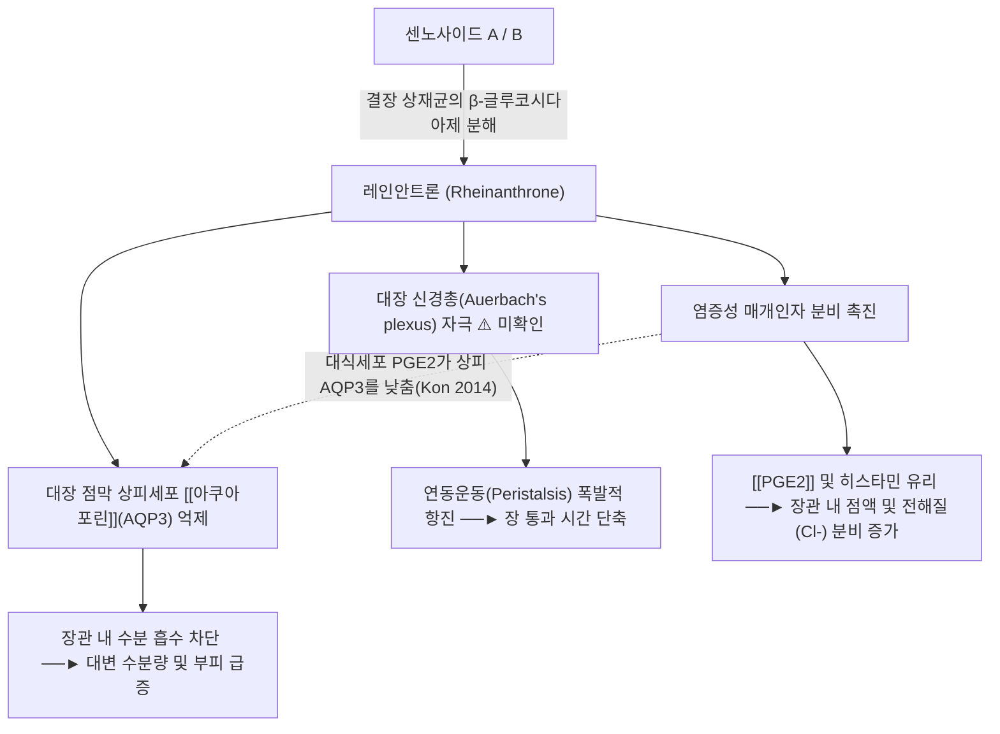

---
aliases:
  - Sennoside
  - 센노사이드 A
  - Sennoside A
  - Sennoside B
tags:
  - 약리
  - 약리성분
  - 안트라퀴논
  - 아쿠아포린
  - 대황
title: 센노사이드
date: 2026-09-21
출처: PMID 21868635
---

# 🔬 센노사이드 (Sennoside)

> **핵심 3줄 요약 (Key Summary)**:
> - 🌿 기원 본초 & 화학 계열: 콩과 센나엽 및 마디풀과 [[대황]]에서 분리되는 대표적인 디안트론(Dianthrone) 배당체 계열의 천연 자극성 사하 성분.
> - 🎯 핵심 분자 표적 & 조절 경로: 장내 미생물에 의해 레인안트론으로 대사되어 대장 [[아쿠아포린]](AQP3)을 억제하고 장신경총을 직접 자극하여 수분 흡수 차단 및 배변 촉진 기전을 발휘. (⚠️ AQP3 억제는 레인안트론 → 대식세포 [[PGE2]] 분비 → 상피 AQP3 감소 경로로 확인되었으나, '장신경총 직접 자극'은 확인하지 못했습니다. §3)
> - 🩺 주요 약리 활성 & 질환 치료 기전: [[대황]]의 핵심 사하 지표 성분으로 한의학적 사열통부(瀉熱通腑), 축어파적 작용의 분자적 실체이자 [[대승기탕]], [[대황목단피탕]]의 약리적 표적. (⚠️ 대황의 사하에는 센노사이드 외 안트라퀴논도 기여합니다. §6)
> - ⚠️ 독성·생체이용률 한계 & 상호작용: 센노사이드 자체는 대장에서 활성화되는 프로드러그라 장내세균 상태·병용 본초에 따라 대사가 달라지며(§4·§7), 장기 연용 시 대장흑색증이 문제 되고 대장 신생물 위험은 연구마다 결론이 다릅니다(§7).

---

## 📌 목차
1. [기본 화학 정보 & 분자 구조식 (Chemical Identity)](#1-기본-화학-정보--분자-구조식-chemical-identity)
2. [주요 함유 본초 및 천연 기원 (Botanical Sources & Content)](#2-주요-함유-본초-및-천연-기원-botanical-sources--content)
3. [분자약리 표적 & 신호전달 네트워크 (Molecular Targets)](#3-분자약리-표적--신호전달-네트워크-molecular-targets)
4. [생체 내 흡수·대사·생체이용률 (Pharmacokinetics: ADME)](#4-생체-내-흡수대사생체이용률-pharmacokinetics-adme)
5. [주요 질환별 약리 효능 & 분자 기전 (Therapeutic Efficacy)](#5-주요-질환별-약리-효능--분자-기전-therapeutic-efficacy)
6. [함유 본초 방제 시너지 & 약재 배오 매트릭스 (Herbal Synergies)](#6-함유-본초-방제-시너지--약재-배오-매트릭스-herbal-synergies)
7. [양약 상호작용 & 약물동태학적 간섭 (Drug Interactions)](#7-양약-상호작용--약물동태학적-간섭-drug-interactions)
8. [💡 사용자 진료실 핵심 필기 & 임상 응용 팁 (Melt-In & High-Yield)](#8--사용자-진료실-핵심-필기--임상-응용-팁-melt-in--high-yield)
9. [출처 및 학술 참고 문헌 (References)](#9-출처-및-학술-참고-문헌-references)

---

## 1. 기본 화학 정보 & 분자 구조식 (Chemical Identity)

> [!abstract]+ 🧪 3D 약리 분자 구조 (Interactive 3D Viewer)
> <iframe src="https://molecule-viewer-rho.vercel.app/?cid=73111" width="100%" height="450px" frameborder="0" allow="webgl" style="border-radius: 8px;"></iframe>
> ⚠️ 정정: 기존 뷰어의 CID 5280805는 PubChem에서 루틴(Rutin, C27H30O16)이어서 센노사이드 A(CID 73111)로 교체했습니다. 센노사이드 B는 CID 91440입니다.

| 항목 | 상세 내용 |
| :--- | :--- |
| **성분명** | 센노사이드 (Sennoside, 대표체: [[센노사이드 A]], Sennoside B) |
| **IUPAC 명칭** | (9R,9'R)-5,5'-bis(β-D-glucopyranosyloxy)-4,4'-dihydroxy-10,10'-dioxo-9,9',10,10'-tetrahydro-9,9'-bianthracene-2,2'-dicarboxylic acid (Sennoside A). 센노사이드 B는 (9R,9'S) 입체이성질체(PubChem 등록 명칭 기준) |
| **분자식 / 분자량** | C₄₂H₃₈O₂₀ / 862.74 g/mol (PubChem에서 A·B 모두 862.7, 서로 입체이성질체) |
| **PubChem CID** | [73111](https://pubchem.ncbi.nlm.nih.gov/compound/73111) (Sennoside A) · [91440](https://pubchem.ncbi.nlm.nih.gov/compound/91440) (Sennoside B). 활성 대사체 레인안트론은 [119396](https://pubchem.ncbi.nlm.nih.gov/compound/119396) (C15H10O5, 270.24) |
| **CAS 등록 번호** | 81-27-6 (Sennoside A) / 128-57-4 (Sennoside B) — PubChem 동의어 항목에서 확인했으며 CAS 원본 대조는 못 했습니다. |
| **화학 골격 분류** | 9,9'-비안트라센 골격의 디안트론 O-배당체(글루코스 2분자 결합). 약리 분류: 자극성 사하제(Stimulant laxative), 디안트론 배당체, 전구약물(Prodrug) |
| **주요 천연 기원** | [[대황]](Rheum palmatum), 센나엽(Cassia angustifolia) |
| **물리화학적 성상** | 외관·용해도·LogP·안정성·맛은 이번 검증에서 확인하지 못했습니다. ⚠️ 내용 검토 필요 |
| **식물 내 생합성 경로** | 원문에 기재 없음. 확인하지 못했습니다. ⚠️ 내용 검토 필요 |

---

## 2. 주요 함유 본초 및 천연 기원 (Botanical Sources & Content)

| 함유 본초 (한글/한자) | 기원 식물학적 명칭 (과명 / 학명) | 주요 함유 약용 부위 | 지표 함량 (%) | 한의학적 귀경 및 약효 특성 |
| :--- | :--- | :--- | :--- | :--- |
| [[대황]] (大黃) | 마디풀과 / *Rheum palmatum* (원문). 볼트 [[대황]] 노트는 *R. palmatum*·*R. tanguticum*·*R. officinale*을 기원으로 적음 | 뿌리줄기 | 원문에 수치 없음. 볼트 [[대황]] 노트는 KP 규격으로 센노사이드 A 0.25% 이상을 적으나 약전 원문은 확인하지 못했습니다. ⚠️ | 苦寒, 脾·胃·大腸·肝·心包經 / 사열통변·파적도체 (볼트 [[대황]] 노트 기준) |
| 센나엽 | 콩과 / *Cassia angustifolia* (원문) | 잎 (원문 '센나엽') | 원문에 수치 없음 | 볼트에 센나 노트가 없어 기재하지 않음 |

* **대황 3종의 사하력 차이**: 마우스 사하 ED50이 *R. tanguticum* 0.37, *R. officinale* 0.99, *R. palmatum*(감숙산) 1.83 g/kg이었고 이들의 사하 관련 성분(센노사이드 A 포함)을 HPLC로 정량했다고 보고되었습니다(Wang 2006; 중국어 논문의 영문 초록). ⚠️ 사하력 차이가 센노사이드 A 함량만으로 설명되는지는 초록에서 확인하지 못했습니다.

---

## 3. 분자약리 표적 & 신호전달 네트워크 (Molecular Targets)

### 1) 핵심 분자 표적 (Molecular Targets)
* [[아쿠아포린]](AQP3) 하향 조절을 통한 수분 정체
  * 대장 점막 상피세포 기저막에 발현하는 수분통로단백질 [[아쿠아포린]]-3(AQP3)의 발현을 차단하여, 장관 내강의 수분이 체내로 재흡수되는 과정을 억제함으로써 대변을 무르게 만듭니다.
  * 근거: 랫드에 대황 추출물 또는 센노사이드 A를 경구 투여하면 대장 [[PGE2]]가 늘고 AQP3 발현이 유의하게 줄며 설사가 생겼습니다. 대식세포 유래 Raw264.7 세포에서는 센노사이드 A나 레인이 아니라 레인안트론만 PGE2를 유의하게 늘렸고, HT-29 세포에 PGE2를 넣으면 15분 뒤 AQP3가 대조의 약 40%로 감소했습니다. 인도메타신을 미리 투여하면 센노사이드 A가 AQP3를 줄이지도, 설사를 일으키지도 못했습니다(Kon 2014). 즉 레인안트론이 대장 대식세포를 활성화해 PGE2를 분비시키고, PGE2가 측분비 인자로 상피 AQP3를 낮추는 경로입니다.
  * ⚠️ 내용 검토 필요: 원문의 'AQP3 발현을 차단'은 레인안트론이 상피세포에 직접 작용한다는 뜻이 아니라 위 대식세포–PGE2 경로를 거친 결과입니다. AQP3가 '기저막'에 발현한다는 위치 서술은 확인한 초록에 없었습니다(초록은 '점막 상피세포'라고만 기술).
  * 참고: 자극성 사하제 비사코딜에서도 같은 PGE2–AQP3 경로가 보고되어 있고(Ikarashi 2011, *Am J Physiol Gastrointest Liver Physiol*; 제목 기준), 대장 AQP3 억제가 설사를 일으킨다는 보고도 있습니다(Ikarashi 2012; 제목 기준).
* 장관 신경총 자극 및 연동운동 촉진
  * 근간신경총(Myenteric plexus)의 콜린성 신경섬유를 흥분시켜 장 평활근의 수축 파동을 증폭시킵니다.
  * ⚠️ 내용 검토 필요: '콜린성 신경섬유 흥분'을 직접 보인 논문은 확인하지 못했습니다. 사람 결장 실험에서 장내에 넣은 센나 배당체 자체는 결장 운동을 바꾸지 못했고, 대변이나 대장균과 미리 배양해 활성화한 센나 또는 레인안트론이 접촉 자극(contact stimulation)으로 연동운동을 일으켰으며 직장에서는 반응이 없었습니다(Hardcastle 1970). 랫드 결장 적출 실험에서 6개월 만성 처치 후 전기자극·아세틸콜린 반응은 대부분의 부위에서 처치 영향이 없었습니다(Odenthal 1993).
  * 센노사이드 배당체를 가수분해하는 *Bifidobacterium* 균주(LKM512 등)를 마우스에 투여하면 분변 센노사이드 함량이 줄었고, 이 논문은 제목에서 장 연동 촉진을 보고합니다(Matsumoto 2012).
* 염증성 매개인자·분비 (원문 도식의 3번째 갈래)
  * ⚠️ 내용 검토 필요: [[PGE2]] 증가는 위 Kon 2014로 확인됩니다. '[[히스타민]] 유리'는 PubMed 검색('sennoside histamine mast cell colon secretion')이 0건이라 확인하지 못했고, '점액 분비 증가'도 확인하지 못했습니다.
  * 전해질 분비: 랫드 결장에서 센노사이드와 레인이 순 수분·Na⁺ 흡수를 줄이거나 분비로 바꿨고, 작은 분자(에리트리톨)의 세포주위 투과성이 2~3배 늘었으나 Na⁺,K⁺-ATPase 활성과 상피세포 손상(LDH 유출)은 없었습니다. 저자들은 이를 능동 염소 분비 자극 개념과 부합한다고 해석했습니다(Leng-Peschlow 1993). 염소 분비를 직접 측정한 결과는 초록에 없습니다.

---

## 4. 생체 내 흡수·대사·생체이용률 (Pharmacokinetics: ADME)

* **전구약물(Prodrug)로서의 특성**: 센노사이드는 친수성 당질(포도당 2분자)이 결합되어 있어 위산과 소장의 소화효소에 의해 분해·흡수되지 않고 그대로 대장까지 안전하게 도달합니다.
  * 근거: 센노사이드는 위장관 하부에서만 분해되어 활성 대사체 레인 안트론을 방출하고, 14C 표지 레인 안트론을 랫드 맹장에 넣었을 때 거의 흡수되지 않았습니다. 이에 디안트론·안트론 배당체는 안트라퀴논 O-배당체보다 전신 이용률이 낮을 것으로 추정되었습니다(de Witte 1993, 종설).
* **장내 세균에 의한 활성 대사체 전환**:
  * 결장(Colon)에 도달한 센노사이드는 *Bifidobacterium* 등 장내 상재균이 분비하는 베타-글루코시다아제에 의해 당이 떨어져 나간 후, 환원 분해되어 활성형인 **레인안트론(Rheinanthrone)**으로 전환됩니다.
  * 실제 장점막을 자극하고 수분 분비를 촉진하는 유효 물질은 센노사이드 자체가 아닌 이 레인안트론입니다.
  * 근거·보충:
    * 사람 분변에서 분리한 *Bifidobacterium* sp. SEN 균주가 센노사이드 A·B를 센니딘 A·B로 가수분해했고(8-모노글루코사이드 경유), β-글루코시다아제를 가진 *Bifidobacterium* 9종 중 센노사이드 B를 센니딘 B로 바꾼 것은 *B. dentium*과 *B. adolescentis*뿐이었습니다(Akao 1994). 이 효소의 정제(Yang 1996)도 보고되어 있습니다(제목 기준).
    * 유산균 88균주와 비피도박테리아 47균주 중 센노사이드를 70% 넘게 분해한 것은 *Bifidobacterium* 4균주였습니다. 즉 '*Bifidobacterium* 등'이라도 분해 능력은 균주마다 크게 다릅니다(Matsumoto 2012).
    * 당이 떨어진 뒤 레인안트론으로 가는 환원 단계에는 세균 니트로환원효소가 관여합니다. *Enterococcus faecalis*가 센노사이드 A를 C–C 환원 절단으로 레인안트론으로 바꾸고 니트로환원효소 억제제 디쿠마롤이 이를 없앴다고 보고되었습니다(Liu 2025).
    * 활성 물질이 레인안트론이라는 서술은 Kon 2014(Raw264.7에서 레인안트론만 PGE2 증가)로 뒷받침됩니다. 다만 센노사이드 A는 대황 추출물 안에서 단독일 때보다 장내세균 대사가 빨라졌고, 레인 8-O-글루코사이드·레인·에모딘·알로에에모딘이 이를 촉진했습니다(Takayama 2012).
* **체내 노출**: 건강 성인 10명에게 센나 제제(Agiolax, Sennatin)를 반복 투여한 결과 혈장에서 알로에에모딘은 검출되지 않았고, 레인이 3~5시간과 10~11시간에 최고 150~160 ng/mL로 두 차례 정점을 보였습니다. 저자들은 유리 레인의 흡수와 프로드러그에서 세균 대사로 방출된 레인으로 해석했습니다(Krumbiegel 1993). 센노사이드 단독 투여 결과가 아니라 센나 제제 결과입니다.
* **장-간 순환, 간 CYP450 대사, P-gp 기질성, 반감기**: 센노사이드 자체에 대한 문헌은 확인하지 못했습니다. ⚠️ 내용 검토 필요

---

## 5. 주요 질환별 약리 효능 & 분자 기전 (Therapeutic Efficacy)

### 1) 변비 (자극성 사하)
* 만성 변비의 일반의약품 치료 무작위 대조시험 41건(4주 이상)을 검토한 체계적 문헌고찰에서 삼투성 하제 PEG와 자극성 하제 센나에 좋은 근거(A등급)가 있다고 결론지었고, 설사·구역·복부 팽만·복통이 흔한 이상반응이었습니다(Rao 2021). 센나 제제에 대한 결과이며 정제 센노사이드 단독 결과는 아닙니다.
* 사하 기전은 §3의 레인안트론–대식세포–PGE2–AQP3 경로입니다.

### 2) 한의학적 임상 응용 (원문 §4)
* 급성 변비 및 양명부실증(陽明腑實證): 대변이 굳고 헛소리를 하며 배가 아픈 증상에 [[대승기탕]], [[조위승기탕]].
* 급성 복막염 및 장옹: [[대황목단피탕]]에서 맹장 개구부 분석(Fecalith) 배출.
* 어혈성 변비 및 골반 울혈: [[도핵승기탕]]에서 어혈과 숙변 동시 배출.
* ⚠️ 내용 검토 필요: 위 적응증(양명부실증, 장옹, 어혈성 변비·골반 울혈)에 대해 센노사이드 단독 근거는 확인하지 못했습니다. 처방별 구성은 §6을 참고하세요.

---

## 6. 함유 본초 방제 시너지 & 약재 배오 매트릭스 (Herbal Synergies)

| 함유 본초 / 방제 | 공존 유효 성분군 | 분자약리 시너지 기전 | 전통 한의학적 효능 연계 |
| :--- | :--- | :--- | :--- |
| [[대황]] | [[에모딘]], [[레인]], [[알로에에모딘]], [[크리소파놀]] 등 안트라퀴논류 (볼트 [[대황]] 노트 기준) | 레인 8-O-글루코사이드가 센노사이드 A의 장내세균 대사와 사하 활성을 용량 의존적으로 촉진했고, 레인·에모딘·알로에에모딘도 센노사이드 A 대사를 촉진했습니다(Takayama 2012, 마우스). 대황 추출물과 센노사이드 A는 모두 대장 AQP3를 낮췄습니다(Kon 2014). 대황 사하가 센노사이드만의 작용은 아닙니다. | 사열통변·파적도체 |
| [[대황감초탕]] | [[대황]], [[감초]]([[글리시리진]]) — 볼트 처방 노트에서 구성 확인 | 글리시리진과 센노사이드 A를 함께 주면 센노사이드 A가 유발한 염증 반응과 사하 효과가 약해진다는 선행 결과가 있고, 랫드 7일 반복 투여에서 대황감초탕군은 AQP3 감소와 설사가 나타났으나 대황 단독군은 나타나지 않았습니다(Kon 2018; 정정문 2019 있음). 앰피실린으로 장내세균이 교란된 마우스에서 센노사이드 A 단독은 대사가 계속 억제되었지만 대황감초탕은 3일째부터 대사가 활성화되었고, 레인 8-O-글루코사이드가 이에 관여했습니다(Takayama 2016). | 사열파적 + 완급지통 (볼트 노트 기준) |
| [[대승기탕]] | [[대황]]·망초·지실·후박 (볼트 처방 노트에서 구성 확인) | ⚠️ 내용 검토 필요 — 센노사이드의 기여·처방 수준 시너지 문헌은 확인하지 못했습니다. | 양명부실증 사열통부 |
| [[조위승기탕]] | [[대황]]·망초·감초 (볼트 처방 노트에서 구성 확인) | ⚠️ 내용 검토 필요 — 위와 같음 | 양명병 경증 완화사열 |
| [[소승기탕]] | [[대황]]·후박·지실 (볼트 처방 노트에서 구성 확인) | ⚠️ 내용 검토 필요 — 위와 같음 | 경하행기 |
| [[대황목단피탕]] | [[대황]]·목단피·도인·동과자·망초 (볼트 처방 노트에서 구성 확인) | ⚠️ 내용 검토 필요 — 위와 같음 | 장옹 초·중기의 사하·파어·배농 |
| [[도핵승기탕]] | 도인·[[대황]]·계지·망초·감초 (볼트 처방 노트에서 구성 확인) | ⚠️ 내용 검토 필요 — 위와 같음 | 어열(瘀熱) 사하 배출 |

---

## 7. 양약 상호작용 & 약물동태학적 간섭 (Drug Interactions)

* **CYP450 효소 간섭**: 센노사이드의 CYP 억제·유도 문헌은 확인하지 못했습니다. ⚠️ 내용 검토 필요
* **감초와의 약동학 상호작용**: 사하 효과를 내지 않는 용량의 센노사이드 A를 글리시리진과 함께 랫드에 경구 투여하면 글리시레틱산의 AUC와 Cmax가 감소했고, 랫드 결장 고리 실험에서 센노사이드 A·센니딘 A·레인이 글리시레틱산 잔존율을 크게 올렸습니다. 감초와 대황이 든 온비토(TJ-8117)를 사람에게 투여했을 때도 글리시레틱산의 AUC·Cmax가 다른 감초 함유 캄포약보다 낮았다고 보고되었습니다(Mizuhara 2005).
* **항생제와의 관계**: 앰피실린을 8일 투여한 마우스에서 센노사이드 A 단독의 대사는 계속 억제되었으나 대황감초탕은 그렇지 않았습니다(Takayama 2016; 마우스). 사람에서의 항생제 병용 자료는 확인하지 못했습니다. ⚠️ 내용 검토 필요
* [[NSAIDs]] 등 COX 억제제: 인도메타신을 미리 투여한 랫드에서 센노사이드 A가 AQP3 감소와 설사를 일으키지 못했습니다(Kon 2014). 이 기전상 COX 억제제 병용 시 사하 효과가 줄 수 있으나 사람 자료는 확인하지 못했습니다. ⚠️ 이론적 추론
* **장기 연용 안전성 (원문에 없던 항목)**:
  * 대장흑색증: 랫드에 대황 안트라퀴논을 최대 90일 투여했을 때 대변에서 레인이 가장 많이 축적되었고, 세포 실험에서 레인이 유도하는 아폽토시스·자가포식이 만성 독성 기전으로 시사되었습니다(Cheng 2020).
  * 대장 신생물: 안트라노이드 하제 사용이 대장 선종·암의 위험 인자가 아니라는 전향적 환자-대조군 연구(대장암 202명, 선종 114명, 대조 238명, 교차비 1.0)가 있습니다(Nusko 2000). 반면 사람 대장 생검에서 센노사이드 급성 투여 6시간 뒤 아폽토시스·p53·p21 발현이 늘었고, 저자들은 만성 사용 시 보호 기전을 벗어날 가능성을 제기했습니다(van Gorkom 2001). 연구마다 결론이 달라 [[대장암]] 위험은 확정되지 않았습니다.
  * 장 신경: 센노사이드를 4~5개월 먹인 랫드·마우스의 근층간 신경총 뉴런은 소실되지 않았고(Kiernan 1989), 마우스 장기 투여에서 센노사이드는 점막 손상이 없었으며 신경총 이상은 합성 1,8-디하이드록시안트라퀴논 투여군에서만 관찰되었습니다(Dufour 1988).
  * 간: 센나를 만성 남용한 소아의 급성 간염·범혈구감소증 증례가 보고되어 있습니다(Haoudar 2021; 제목 기준).
* **임신·수유**:
  * 센나 치료를 받은 임신부의 선천 기형 위험 증가가 없었습니다(기형아 22,843명·대조 38,151명, 보정 교차비 1.0, 0.9~1.1; 대부분 20 mg/일)(Acs 2009). 대황은 사람 자료가 없고 에모딘 함량 때문에 동물에서 태아 기형이 보고된다는 종설이 있습니다(Samavati 2017).
  * 산후 여성 20명에게 센노사이드 15 mg이 든 센나 제제를 3일간 투여했을 때 모유 레인 농도는 0~27 ng/mL(94%가 10 ng/mL 미만)였고 센노사이드 섭취량의 약 0.007%가 배출되었으며, 수유 영아의 배변 이상은 없었습니다(Faber 1988).
* **유사 기전 양약 병용 시 고려사항**: 다른 하제·이뇨제와의 병용 안전성은 이번 검증에서 확인하지 못했습니다. ⚠️ 내용 검토 필요

---

## 8. 💡 사용자 진료실 핵심 필기 & 임상 응용 팁 (Melt-In & High-Yield)

* **사용자 원문 필기 (100% 융합 및 보존)**:
  * 기존 노트에 원장님의 수기 필기는 없었습니다. (추후 필기가 생기면 이곳에 원문 그대로 추가)
* **진료실 실전 처방 & 생체이용률 극대화 팁**:
  1. 센노사이드는 장내세균이 활성화하는 프로드러그라 균주 구성에 따라 효과가 달라지고, 대황 전탕액에서는 다른 안트라퀴논이 센노사이드 A의 대사를 촉진합니다(§4·§6). 다만 이 근거는 마우스·랫드 실험이며 인체 전탕액에서의 확인은 아닙니다. ⚠️ 내용 검토 필요
  2. 체질별·병증별 적용은 원문·문헌에서 확인되지 않아 기재하지 않습니다. ⚠️ 내용 검토 필요

---

## 9. 출처 및 학술 참고 문헌 (References)

1. **Ikarashi N, et al. (2011)**. The laxative effect of sennoside A is mediated by down-regulation of aquaporin 3 in the colon. *Journal of Pharmacological Sciences*, 116(4), 382-389.
   - **[연구 요약]**: 센노사이드 A의 대사체 레인안트론이 대장 상피 AQP3 발현을 현저히 억제하여 사하 효과를 발휘함을 증명.
   - ⚠️ 내용 검토 필요: 이 제목·서지(*J Pharmacol Sci* 116(4))는 PubMed에서 찾지 못했습니다(제목 검색 0건). 같은 내용을 확인해 주는 실제 논문은 Kon 2014(아래 3번)입니다. 같은 제1저자의 2011년 논문(*Am J Physiol Gastrointest Liver Physiol* 301(5):G887-95, PMID 21868635)은 센노사이드 A가 아니라 비사코딜을 다룬 논문입니다.
2. **Hardcastle JD, Wilkins JL (1970)**. The action of sennosides and related compounds on human colon and rectum. *Gut*, 11(12), 1038-1042. PMID: [4929273](https://pubmed.ncbi.nlm.nih.gov/4929273/) · DOI: [10.1136/gut.11.12.1038](https://doi.org/10.1136/gut.11.12.1038)
   - **[연구 요약]**: 사람 결장·직장의 풍선 압력 기록에서 센나 배당체 자체는 결장 운동을 바꾸지 못했고, 대변이나 대장균과 미리 배양한 센나 또는 레인안트론이 접촉 자극으로 결장 연동운동을 일으켰으며 직장에서는 반응이 없었음.
   - [연구 요약] 센노사이드가 인간 결장 평활근 연동운동과 점막 전해질 수송에 미치는 약리 메커니즘을 최초 규명. (원문 요약 보존)
   - ⚠️ 내용 검토 필요: 위 원문 요약의 '점막 전해질 수송'과 '최초 규명' 표현은 확인한 초록에 없습니다. 원문의 논문 제목은 "…on human colon"이었으나 PubMed 등록 제목은 "…on human colon and rectum"입니다.
3. **Kon R, Ikarashi N, Nagoya C, et al. (2014)**. Rheinanthrone, a metabolite of sennoside A, triggers macrophage activation to decrease aquaporin-3 expression in the colon, causing the laxative effect of rhubarb extract. *Journal of Ethnopharmacology*, 152(1), 190-200. PMID: [24412547](https://pubmed.ncbi.nlm.nih.gov/24412547/) · DOI: [10.1016/j.jep.2013.12.055](https://doi.org/10.1016/j.jep.2013.12.055)
   - **[연구 요약]**: 랫드와 HT-29·Raw264.7 세포에서, 센노사이드 A의 대사체 레인안트론이 대장 대식세포를 활성화해 PGE2를 분비시키고 PGE2가 상피 AQP3 발현을 낮춰 사하가 일어남. 인도메타신 선처치로 이 효과가 소실됨.
4. **Kon R, Yamamura M, Matsunaga Y, et al. (2018)**. Laxative effect of repeated Daiokanzoto is attributable to decrease in aquaporin-3 expression in the colon. *Journal of Natural Medicine*, 72(2), 493-502. PMID: [29380109](https://pubmed.ncbi.nlm.nih.gov/29380109/) · DOI: [10.1007/s11418-018-1174-1](https://doi.org/10.1007/s11418-018-1174-1)
   - **[연구 요약]**: 랫드 7일 반복 투여에서 대황감초탕군은 대장 AQP3 감소와 설사가 나타났으나 대황 단독군은 나타나지 않았음. 정정문 있음(*J Nat Med* 73(3):681, PMID 30941691).
5. **Ikarashi N, Baba K, Ushiki T, et al. (2011)**. The laxative effect of bisacodyl is attributable to decreased aquaporin-3 expression in the colon induced by increased PGE2 secretion from macrophages. *Am J Physiol Gastrointest Liver Physiol*, 301(5), G887-G895. PMID: [21868635](https://pubmed.ncbi.nlm.nih.gov/21868635/) · DOI: [10.1152/ajpgi.00286.2011](https://doi.org/10.1152/ajpgi.00286.2011)
   - **[연구 요약]**: 제목 기준 인용(초록 미확인). 비사코딜의 사하 효과가 대식세포 PGE2 증가에 의한 대장 AQP3 감소로 설명됨.
6. **Ikarashi N, Kon R, Iizasa T, et al. (2012)**. Inhibition of aquaporin-3 water channel in the colon induces diarrhea. *Biol Pharm Bull*, 35(6), 957-962. PMID: [22687538](https://pubmed.ncbi.nlm.nih.gov/22687538/) · DOI: [10.1248/bpb.35.957](https://doi.org/10.1248/bpb.35.957)
   - **[연구 요약]**: 제목 기준 인용(초록 미확인).
7. **Leng-Peschlow E (1993)**. Sennoside-induced secretion is not caused by changes in mucosal permeability or Na+,K(+)-ATPase activity. *J Pharm Pharmacol*, 45(11), 951-954. PMID: [7908035](https://pubmed.ncbi.nlm.nih.gov/7908035/) · DOI: [10.1111/j.2042-7158.1993.tb05633.x](https://doi.org/10.1111/j.2042-7158.1993.tb05633.x)
   - **[연구 요약]**: 랫드 결장에서 센노사이드·레인이 순 수분·Na⁺ 흡수를 줄이거나 분비로 바꾸고 작은 분자 투과성이 2~3배 늘었으나 Na⁺,K⁺-ATPase 활성과 상피 손상은 없었음.
8. **Odenthal KP, Leng-Peschlow E, Voderholzer W, et al. (1993)**. Effects of long-term sennoside treatment on in vitro motility of rat colon. *Pharmacology*, 47 Suppl 1, 146-154. PMID: [8234423](https://pubmed.ncbi.nlm.nih.gov/8234423/) · DOI: [10.1159/000139854](https://doi.org/10.1159/000139854)
   - **[연구 요약]**: 6개월 만성 처치 후 랫드 결장 적출 운동은 대체로 정상이었고 아세틸콜린·전기자극 반응은 대부분 부위에서 처치 영향이 없었음.
9. **de Witte P (1993)**. Metabolism and pharmacokinetics of anthranoids. *Pharmacology*, 47 Suppl 1, 86-97. PMID: [8234447](https://pubmed.ncbi.nlm.nih.gov/8234447/) · DOI: [10.1159/000139847](https://doi.org/10.1159/000139847)
   - **[연구 요약]**: 센노사이드는 하부 위장관에서만 분해되어 레인 안트론을 방출하고, 레인 안트론은 랫드 맹장 투여 시 거의 흡수되지 않음.
10. **Akao T, Che QM, Kobashi K, et al. (1994)**. Isolation of a human intestinal anaerobe, *Bifidobacterium* sp. strain SEN, capable of hydrolyzing sennosides to sennidins. *Appl Environ Microbiol*, 60(3), 1041-1043. PMID: [8161172](https://pubmed.ncbi.nlm.nih.gov/8161172/) · DOI: [10.1128/aem.60.3.1041-1043.1994](https://doi.org/10.1128/aem.60.3.1041-1043.1994)
    - **[연구 요약]**: SEN 균주가 센노사이드 A·B를 센니딘 A·B로 가수분해. 9종 중 *B. dentium*·*B. adolescentis*만 센노사이드 B를 센니딘 B로 전환.
11. **Yang L, Akao T, Kobashi K, et al. (1996)**. Purification and characterization of a novel sennoside-hydrolyzing beta-glucosidase from *Bifidobacterium* sp. strain SEN, a human intestinal anaerobe. *Biol Pharm Bull*, 19(5), 705-709. PMID: [8741579](https://pubmed.ncbi.nlm.nih.gov/8741579/) · DOI: [10.1248/bpb.19.705](https://doi.org/10.1248/bpb.19.705)
    - **[연구 요약]**: 제목 기준 인용(초록 미확인).
12. **Matsumoto M, Ishige A, Yazawa Y, et al. (2012)**. Promotion of intestinal peristalsis by *Bifidobacterium* spp. capable of hydrolysing sennosides in mice. *PLoS One*, 7(2), e31700. PMID: [22384059](https://pubmed.ncbi.nlm.nih.gov/22384059/) · DOI: [10.1371/journal.pone.0031700](https://doi.org/10.1371/journal.pone.0031700)
    - **[연구 요약]**: 88 유산균·47 비피도박테리아 균주 중 4개 *Bifidobacterium* 균주가 센노사이드를 70% 넘게 분해하고, 균주 투여 시 마우스 분변 센노사이드 함량이 감소.
13. **Liu X, Li H, Gao X (2025)**. Nitroreductase from *Enterococcus faecalis* catalyzes the metabolic activation of sennoside A in the colon via a unique CC reductive cleavage. *Int J Biol Macromol*, 319(Pt 1), 145153. PMID: [40505903](https://pubmed.ncbi.nlm.nih.gov/40505903/) · DOI: [10.1016/j.ijbiomac.2025.145153](https://doi.org/10.1016/j.ijbiomac.2025.145153)
    - **[연구 요약]**: *E. faecalis*의 니트로환원효소가 센노사이드 A를 레인안트론으로 바꾸며 디쿠마롤이 이를 억제.
14. **Takayama K, Tsutsumi H, Ishizu T, et al. (2012)**. The influence of rhein 8-O-β-D-glucopyranoside on the purgative action of sennoside A from rhubarb in mice. *Biol Pharm Bull*, 35(12), 2204-2208. PMID: [23207772](https://pubmed.ncbi.nlm.nih.gov/23207772/) · DOI: [10.1248/bpb.b12-00632](https://doi.org/10.1248/bpb.b12-00632)
    - **[연구 요약]**: 대황의 레인 8-O-글루코사이드와 레인·에모딘·알로에에모딘이 센노사이드 A의 장내세균 대사와 사하 활성을 촉진.
15. **Takayama K, Tabuchi N, Fukunaga M, et al. (2016)**. Rhein 8-O-β-D-glucopyranoside elicited the purgative action of Daiokanzoto (Da-Huang-Gan-Cao-Tang), despite dysbiosis by ampicillin. *Biol Pharm Bull*, 39(3), 378-383. PMID: [26934929](https://pubmed.ncbi.nlm.nih.gov/26934929/) · DOI: [10.1248/bpb.b15-00815](https://doi.org/10.1248/bpb.b15-00815)
    - **[연구 요약]**: 앰피실린 투여 마우스에서 센노사이드 A 단독 대사는 억제되나 대황감초탕은 3일째부터 활성화, 레인 8-O-글루코사이드가 관여.
16. **Krumbiegel G, Schulz HU (1993)**. Rhein and aloe-emodin kinetics from senna laxatives in man. *Pharmacology*, 47 Suppl 1, 120-124. PMID: [8234418](https://pubmed.ncbi.nlm.nih.gov/8234418/) · DOI: [10.1159/000139850](https://doi.org/10.1159/000139850)
    - **[연구 요약]**: 건강 성인 10명에서 센나 제제 반복 투여 후 알로에에모딘은 미검출, 레인은 150~160 ng/mL 최고치가 3~5시간·10~11시간에 관찰됨.
17. **Wang JK, Li A, Wang H, et al. (2006)**. [Comparative studies on purgative potency among three species of certified rhubarb]. *Zhongguo Zhong Yao Za Zhi*, 31(23), 1987-1991. PMID: [17348197](https://pubmed.ncbi.nlm.nih.gov/17348197/)
    - **[연구 요약]**: 대황 3종의 마우스 사하 ED50 차이(0.37·0.99·1.83 g/kg)와 사하 관련 성분 함량 비교(영문 초록 기준).
18. **Rao SSC, Brenner DM (2021)**. Efficacy and safety of over-the-counter therapies for chronic constipation: an updated systematic review. *Am J Gastroenterol*, 116(6), 1156-1181. PMID: [33767108](https://pubmed.ncbi.nlm.nih.gov/33767108/) · DOI: [10.14309/ajg.0000000000001222](https://doi.org/10.14309/ajg.0000000000001222)
    - **[연구 요약]**: RCT 41건 검토에서 PEG와 센나에 A등급 근거, 흔한 이상반응은 설사·구역·복부 팽만·복통.
19. **Mizuhara Y, Takizawa Y, Ishihara K, et al. (2005)**. The influence of the sennosides on absorption of glycyrrhetic acid in rats. *Biol Pharm Bull*, 28(10), 1897-1902. PMID: [16204942](https://pubmed.ncbi.nlm.nih.gov/16204942/) · DOI: [10.1248/bpb.28.1897](https://doi.org/10.1248/bpb.28.1897)
    - **[연구 요약]**: 센노사이드 A가 글리시레틱산의 AUC·Cmax를 낮췄고 사람에서도 온비토 투여 시 글리시레틱산 노출이 낮았다고 관찰.
20. **Cheng Y, Zhang H, Qu L, et al. (2020)**. Identification of rhein as the metabolite responsible for toxicity of rhubarb anthraquinones. *Food Chem*, 331, 127363. PMID: [32590269](https://pubmed.ncbi.nlm.nih.gov/32590269/) · DOI: [10.1016/j.foodchem.2020.127363](https://doi.org/10.1016/j.foodchem.2020.127363)
    - **[연구 요약]**: 랫드 90일 투여에서 대변 레인이 가장 많이 축적되었고, 레인 유도 아폽토시스·자가포식이 만성 독성의 기전으로 시사됨.
21. **Nusko G, Schneider B, Schneider I, et al. (2000)**. Anthranoid laxative use is not a risk factor for colorectal neoplasia: results of a prospective case control study. *Gut*, 46(5), 651-655. PMID: [10764708](https://pubmed.ncbi.nlm.nih.gov/10764708/) · DOI: [10.1136/gut.46.5.651](https://doi.org/10.1136/gut.46.5.651)
    - **[연구 요약]**: 대장암 202명·선종 114명·대조 238명에서 안트라노이드 사용의 유의한 위험 없음(교차비 1.0).
22. **van Gorkom BA, Karrenbeld A, van der Sluis T, et al. (2001)**. Apoptosis induction by sennoside laxatives in man; escape from a protective mechanism during chronic sennoside use? *J Pathol*, 194(4), 493-499. PMID: [11523059](https://pubmed.ncbi.nlm.nih.gov/11523059/) · DOI: [10.1002/path.914](https://doi.org/10.1002/path.914)
    - **[연구 요약]**: 센노사이드 투여 6시간 후 사람 대장 생검에서 아폽토시스·p53·p21 발현 증가. 초록을 일부만 읽어 만성 사용 결과는 확인하지 못함.
23. **Kiernan JA, Heinicke EA (1989)**. Sennosides do not kill myenteric neurons in the colon of the rat or mouse. *Neuroscience*, 30(3), 837-842. PMID: [2570374](https://pubmed.ncbi.nlm.nih.gov/2570374/) · DOI: [10.1016/0306-4522(89)90175-9](https://doi.org/10.1016/0306-4522(89)90175-9)
    - **[연구 요약]**: 센노사이드를 4~5개월 투여한 랫드·마우스에서 근층간 신경총 뉴런 소실 없음.
24. **Dufour P, Gendre P (1988)**. Long-term mucosal alterations by sennosides and related compounds. *Pharmacology*, 36 Suppl 1, 194-202. PMID: [3368519](https://pubmed.ncbi.nlm.nih.gov/3368519/) · DOI: [10.1159/000138440](https://doi.org/10.1159/000138440)
    - **[연구 요약]**: 마우스 장기 투여에서 센노사이드는 장 점막 손상이 없었고 신경총 이상은 합성 안트라퀴논 투여군에서만 관찰.
25. **Acs N, Bánhidy F, Puhó EH, et al. (2009)**. Senna treatment in pregnant women and congenital abnormalities in their offspring — a population-based case-control study. *Reprod Toxicol*, 28(1), 100-104. PMID: [19491001](https://pubmed.ncbi.nlm.nih.gov/19491001/) · DOI: [10.1016/j.reprotox.2009.02.005](https://doi.org/10.1016/j.reprotox.2009.02.005)
    - **[연구 요약]**: 선천 기형아 22,843명과 대조 38,151명 비교에서 센나 사용의 보정 교차비 1.0(0.9~1.1).
26. **Faber P, Strenge-Hesse A (1988)**. Relevance of rhein excretion into breast milk. *Pharmacology*, 36 Suppl 1, 212-220. PMID: [3368521](https://pubmed.ncbi.nlm.nih.gov/3368521/) · DOI: [10.1159/000138442](https://doi.org/10.1159/000138442)
    - **[연구 요약]**: 산후 여성 20명의 모유에서 레인 0~27 ng/mL, 센노사이드 섭취량의 약 0.007% 배출, 영아 배변 이상 없음.
27. **Samavati R, Ducza E, Hajagos-Tóth J, et al. (2017)**. Herbal laxatives and antiemetics in pregnancy. *Reprod Toxicol*, 72, 153-158. PMID: [28610933](https://pubmed.ncbi.nlm.nih.gov/28610933/) · DOI: [10.1016/j.reprotox.2017.06.041](https://doi.org/10.1016/j.reprotox.2017.06.041)
    - **[연구 요약]**: 대황은 사람 자료가 없고 동물에서 에모딘 함량 때문에 태아 기형이 보고된다는 종설.
28. **Haoudar A, Chekhlabi N, El Kettani C, et al. (2021)**. Acute hepatitis and pancytopenia in a child with chronic abuse of senna. *Cureus*, 13(1), e12436. PMID: [33552756](https://pubmed.ncbi.nlm.nih.gov/33552756/) · DOI: [10.7759/cureus.12436](https://doi.org/10.7759/cureus.12436)
    - **[연구 요약]**: 제목 기준 인용(초록 미확인). 센나 만성 남용 소아의 급성 간염·범혈구감소증 증례.
29. **데이터베이스 확인 항목**: PubChem Compound [73111](https://pubchem.ncbi.nlm.nih.gov/compound/73111)(센노사이드 A), [91440](https://pubchem.ncbi.nlm.nih.gov/compound/91440)(센노사이드 B), [119396](https://pubchem.ncbi.nlm.nih.gov/compound/119396)(레인안트론), [5280805](https://pubchem.ncbi.nlm.nih.gov/compound/5280805)(루틴 — 기존 뷰어의 오류 CID).

<!-- 보관 태그(1회용·링크오류, 필요시 복원): 자극성사하제 -->
