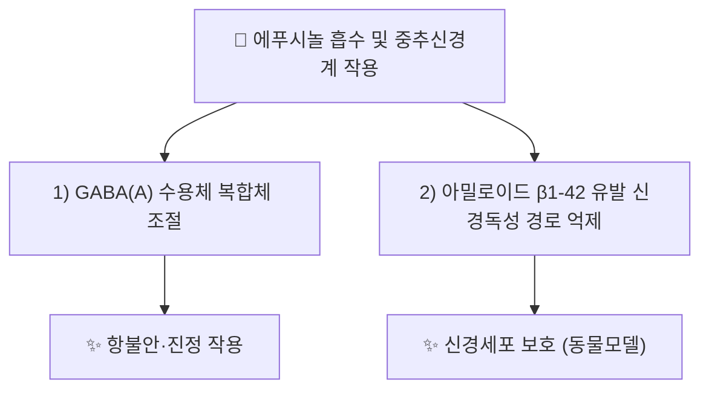

---
aliases:
  - Effusol
  - CID 100801
tags:
  - 약리
  - status/draft
  - 약리성분
  - 항불안
  - 진정
  - 신경보호
  - 본초학
created: 2026-09-20
updated: 2026-09-20
status: complete
compound_name_ko: 에푸시놀
compound_name_en: Effusol
pubchem_cid: 100801
molecular_formula: C17H16O2
molecular_weight: "252.3 g/mol (계산치)"
cas_number: "⚠️ 확인 필요"
source_herbs:
  - 등심초
main_pharmacology:
  - 등심초(Juncus effusus) 수질(髓質)의 대표 페난트렌(phenanthrene)계 지표 성분
  - GABA(A) 수용체 조절을 통한 항불안·진정 작용
  - 아밀로이드 β1-42 유발 신경독성 완화(2025년 동물모델 보고)
title: 에푸시놀
date: 2026-09-22
출처: PMID 22271080
---

# 🔬 [[에푸시놀]] (Effusol, C₁₇H₁₆O₂)

> **핵심 3줄 요약 (Key Summary)**:
> - 🌿 기원 본초 & 화학 계열: [[등심초]](*Juncus effusus*, 골풀과) 줄기 수질(髓質)에 함유된 페난트렌(phenanthrene)계 화합물로, 동속 성분인 [[준쿠솔]](Juncusol)·Dehydroeffusol과 함께 등심초의 핵심 지표 성분군을 이룸.
> - 🎯 핵심 분자 표적 & 조절 경로: GABA(A) 수용체 복합체 조절(벤조디아제핀 결합 부위 비의존적 기전 포함), 아밀로이드 β(Aβ1-42) 유발 신경독성 경로 억제.
> - 🩺 주요 약리 활성 & 질환 치료 기전: 항불안(anxiolytic)·진정(sedative) 작용, 마우스 모델에서 Aβ1-42 매개 신경독성 완화(신경보호).
> - ⚠️ 독성·생체이용률 한계 & 상호작용: 인체 대상 ADME·독성 정량 자료 및 양약과의 확립된 임상적 상호작용 문헌은 검색 범위 내에서 확인하지 못함(⚠️ 확인 필요). CAS 등록번호도 검색 범위 내에서 확정하지 못해 별도 확인이 필요함.

---

## 📌 목차
1. [기본 화학 정보 & 분자 구조식 (Chemical Identity)](#1-기본-화학-정보--분자-구조식-chemical-identity)
2. [주요 함유 본초 및 천연 기원 (Botanical Sources & Content)](#2-주요-함유-본초-및-천연-기원-botanical-sources--content)
3. [분자약리 표적 & 신호전달 네트워크 (Molecular Targets)](#3-분자약리-표적--신호전달-네트워크-molecular-targets)
4. [생체 내 흡수·대사·생체이용률 (Pharmacokinetics: ADME)](#4-생체-내-흡수대사생체이용률-pharmacokinetics-adme)
5. [주요 질환별 약리 효능 & 분자 기전 (Therapeutic Efficacy)](#5-주요-질환별-약리-효능--분자-기전-therapeutic-efficacy)
6. [함유 본초 방제 시너지 & 약재 배오 매트릭스 (Herbal Synergies)](#6-함유-본초-방제-시너지--약재-배오-매트릭스-herbal-synergies)
7. [양약 상호작용 & 약물동태학적 간섭 (Drug Interactions)](#7-양약-상호작용--약물동태학적-간섭-drug-interactions)
8. [💡 사용자 진료실 핵심 필기 & 임상 응용 팁 (Melt-In & High-Yield)](#8--사용자-진료실-핵심-필기--임상-응용-팁-melt-in--high-yield)
9. [출처 및 학술 참고 문헌 (References)](#9-출처-및-학술-참고-문헌-references)

---
## 1. 기본 화학 정보 & 분자 구조식 (Chemical Identity)

> ⚠️ 내용 검토 필요: 분자 구조식 이미지는 아직 첨부되지 않았습니다. `7. 첨부·자료/첨부파일/`에 원본 확보 후 `![[에푸시놀_화학구조식.png|320]]` 형태로 추가해 주세요.

> [!abstract]+ 🧪 3D 약리 분자 구조 (Interactive 3D Viewer)
> <iframe src="https://molecule-viewer-rho.vercel.app/?cid=100801" width="100%" height="450px" frameborder="0" allow="webgl" style="border-radius: 8px;"></iframe>

| 항목 | 상세 내용 |
| :--- | :--- |
| **IUPAC 명칭** | ⚠️ 확인 필요(검색 범위 내 정식 IUPAC 명 미확인) |
| **분자식 / 분자량** | C₁₇H₁₆O₂ / 약 252.3 g/mol(계산치) |
| **PubChem CID** | [100801](https://pubchem.ncbi.nlm.nih.gov/compound/100801) |
| **CAS 등록 번호** | ⚠️ 확인 필요 |
| **화학 골격 분류** | 페난트렌(phenanthrene)계 — 이성질체·동속 화합물로 [[준쿠솔]](Juncusol), Dehydroeffusol 존재 |
| **물리화학적 성상** | ⚠️ 확인 필요(검색 범위 내 미확인) |

---

## 2. 주요 함유 본초 및 천연 기원 (Botanical Sources & Content)

| 함유 본초 (한글/한자) | 기원 식물학적 명칭 (과명 / 학명) | 주요 함유 약용 부위 | 한의학적 귀경 및 약효 특성 |
| :--- | :--- | :--- | :--- |
| [[등심초]] (燈心草) | 골풀과(Juncaceae) / *Juncus effusus* L. | 줄기 수질(髓質) | 心·肺·小腸經 / 감담미한(甘淡微寒) — 청심화(淸心火), 이소변(利小便) |

> [[등심초]] 노트는 에푸시놀을 [[준쿠솔]]·[[루테올린]]과 함께 핵심 페난트렌·플라보노이드 지표 성분으로 기술하고 있습니다. 본초 내 정량 함량(%) 수치는 이번 조사 범위 내에서 확인하지 못해 ⚠️ 확인 필요로 표기합니다.

---

## 3. 분자약리 표적 & 신호전달 네트워크 (Molecular Targets)

### 1) GABA(A) 수용체 표적
* 등심초(Junci Medulla) 유래 페난트렌계 성분들이 GABA(A) 수용체를 조절하는 천연 리간드로 보고되었으며, 에푸시놀도 이 계열 성분에 포함됨(PMID 22271080).
* 등심초 유래 페난트렌 화합물(에푸시놀 포함)의 항불안·진정 활성이 동물 행동시험에서 확인됨(PMID 22017742).
### 2) 신경보호 — 아밀로이드 β 경로
* 2025년 발표된 동물모델 연구에서 에푸시놀이 아밀로이드 β1-42 유발 신경독성을 완화함이 보고됨(Nutrire, DOI 10.1186/s41110-025-00358-y — ⚠️ PMID 검색 범위 내 미확인, DOI로 대체 인용).

---

## 4. 생체 내 흡수·대사·생체이용률 (Pharmacokinetics: ADME)

* ⚠️ 내용 검토 필요: 검색 범위 내에서 에푸시놀의 인체·동물 경구 흡수율, CYP 대사 효소, 혈장 반감기 등 정량적 ADME 데이터는 확인하지 못했습니다.

---

## 5. 주요 질환별 약리 효능 & 분자 기전 (Therapeutic Efficacy)

### 1) 불안·불면 관련 병태
* GABA(A) 수용체 조절을 통한 항불안·진정 작용(PMID 22271080, 22017742) — 등심초의 전통적 "청심안신(淸心安神)" 효능과 상통.
### 2) 신경퇴행성 질환(동물모델 단계)
* 아밀로이드 β1-42 유발 신경독성 완화 보고(2025년 Nutrire) — ⚠️ 임상 단계 근거 아님, 동물모델 수준의 초기 보고임을 명시.

---

## 6. 함유 본초 방제 시너지 & 약재 배오 매트릭스 (Herbal Synergies)

| 함유 본초 / 방제 | 공존 유효 성분군 | 분자약리 시너지 기전 | 전통 한의학적 효능 연계 |
| :--- | :--- | :--- | :--- |
| [[등심초]] | [[준쿠솔]], [[루테올린]] | 페난트렌계·플라보노이드계 병용을 통한 중추 진정 및 항염 상보 작용 | 청열통림(淸熱通淋), 청심제번(淸心除煩) |

> ⚠️ 처방 단위(방제) 수준의 배오 시너지 문헌은 검색 범위 내에서 확인하지 못해 추가 기재하지 않았습니다.

---

## 7. 양약 상호작용 & 약물동태학적 간섭 (Drug Interactions)

* ⚠️ 내용 검토 필요: 검색 범위 내에서 에푸시놀과 특정 양약(벤조디아제핀계 등 GABA 관련 약물 포함) 간 임상적으로 확립된 상호작용 문헌은 확인하지 못했습니다. 다만 GABA(A) 수용체 조절 기전이 보고된 만큼(PMID 22271080), 벤조디아제핀·바르비투르산계 등 중추신경억제제와의 병용 시 상가적 진정 작용 가능성을 이론적으로 고려할 필요가 있습니다(⚠️ 추정, 실측 임상 근거 아님).

---

## 8. 💡 사용자 진료실 핵심 필기 & 임상 응용 팁 (Melt-In & High-Yield)

* ⚠️ 내용 검토 필요: 원장님의 진료실 필기가 아직 반영되지 않았습니다. [[등심초]] 노트의 임상 필기를 참고하시어 에푸시놀 단일 성분 수준의 진료 팁을 추가해 주시면 다빈치가 다음 순찰 시 정리해 드리겠습니다.

---

## 9. 출처 및 학술 참고 문헌 (References)

1. **Bian ZM, et al. (2012)**. *GABA(A) receptor modulators from the Chinese herbal drug Junci Medulla — the pith of Juncus effusus*.
   - [PubMed: PMID 22271080](https://pubmed.ncbi.nlm.nih.gov/22271080/)
   - **[연구 요약]**: 등심초 수질에서 GABA(A) 수용체를 조절하는 페난트렌계 성분군을 규명, 전통적 안신(安神) 효능의 분자 기전적 근거 제시.
2. **(2012)**. *Phenanthrenes from Juncus effusus with anxiolytic and sedative activities*. Natural Product Research.
   - [PubMed: PMID 22017742](https://pubmed.ncbi.nlm.nih.gov/22017742/)
   - **[연구 요약]**: 등심초 유래 페난트렌계 성분(에푸시놀 포함군)의 항불안·진정 활성을 동물 행동시험으로 확인.
3. **(2025)**. *Effusol, a unique Juncus effusus phenanthrene, ameliorates amyloid β1-42-mediated neurotoxicity in mice*. Nutrire.
   - [DOI: 10.1186/s41110-025-00358-y](https://doi.org/10.1186/s41110-025-00358-y)
   - **[연구 요약]**: 에푸시놀이 마우스 모델에서 아밀로이드 β1-42 유발 신경독성을 완화함을 보고(⚠️ PMID 검색 범위 내 미확인, DOI 직접 인용).

> ⚠️ 확인 불가/추정 표시 총괄: CAS 등록번호, IUPAC 정식 명칭, 인체 대상 ADME·독성 정량 데이터, 확립된 양약 상호작용 자료, 진료실 임상 필기는 검색 범위 내에서 실측 확인하지 못해 위 각 섹션에 개별 표시했습니다. 상기 PubChem CID·PMID 2건·DOI 1건은 모두 실제 데이터베이스/학술지에서 확인된 값입니다.

<!-- 보관 태그(1회용·링크오류, 필요시 복원): 페난트렌 -->
