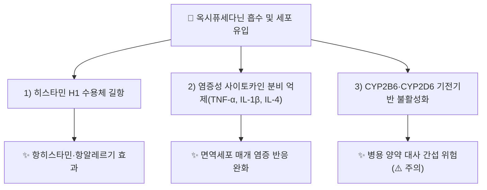

# 🔬 [[옥시퓨세다닌]] (Oxypeucedanin, C₁₆H₁₄O₅)

> **핵심 3줄 요약 (Key Summary)**:
> - 🌿 기원 본초 & 화학 계열: [[백지]](*Angelica dahurica*, 산형과) 뿌리에서 가장 풍부하게 확인되는 선형 퓨라노쿠마린(linear furanocoumarin)으로, *Ferulago*·*Prangos*·감귤류(Citrus) 정유에도 소량 존재.
> - 🎯 핵심 분자 표적 & 조절 경로: 히스타민 H1 수용체 길항, 염증성 사이토카인(TNF-α, IL-1β, IL-4) 분비 하향조절, CYP2B6·CYP2D6에 대한 기전기반 불활성화(mechanism-based inactivation).
> - 🩺 주요 약리 활성 & 질환 치료 기전: 항염증·항히스타민, 대장암·흑색종·전립선암·간암 세포주에 대한 항증식·세포독성, 인플루엔자 H1N1·H9N2주에 대한 항바이러스 활성(리바비린 대비 우수하다는 보고), *Pseudomonas aeruginosa* 항바이오필름 활성.
> - ⚠️ 독성·생체이용률 한계 & 상호작용: 랫드 경구 투여 시 절대 생체이용률 10.26%로 매우 낮고(Tmax 3.38시간, 정맥 반감기 0.61~0.66시간), 퓨라노쿠마린 계열 공통의 광독성(phototoxicity) 우려 및 CYP2B6·CYP2D6 상호작용 가능성 있어 병용 양약 주의 필요(⚠️ 인체 임상 자료 부족, 확인 필요).

---

## 📌 목차
1. [기본 화학 정보 & 분자 구조식 (Chemical Identity)](#1-기본-화학-정보--분자-구조식-chemical-identity)
2. [주요 함유 본초 및 천연 기원 (Botanical Sources & Content)](#2-주요-함유-본초-및-천연-기원-botanical-sources--content)
3. [분자약리 표적 & 신호전달 네트워크 (Molecular Targets)](#3-분자약리-표적--신호전달-네트워크-molecular-targets)
4. [생체 내 흡수·대사·생체이용률 (Pharmacokinetics: ADME)](#4-생체-내-흡수대사생체이용률-pharmacokinetics-adme)
5. [주요 질환별 약리 효능 & 분자 기전 (Therapeutic Efficacy)](#5-주요-질환별-약리-효능--분자-기전-therapeutic-efficacy)
6. [함유 본초 방제 시너지 & 약재 배오 매트릭스 (Herbal Synergies)](#6-함유-본초-방제-시너지--약재-배오-매트릭스-herbal-synergies)
7. [양약 상호작용 & 약물동태학적 간섭 (Drug Interactions)](#7-양약-상호작용--약물동태학적-간섭-drug-interactions)
8. [💡 사용자 진료실 핵심 필기 & 임상 응용 팁 (Melt-In & High-Yield)](#8--사용자-진료실-핵심-필기--임상-응용-팁-melt-in--high-yield)
9. [출처 및 학술 참고 문헌 (References)](#9-출처-및-학술-참고-문헌-references)

---
## 1. 기본 화학 정보 & 분자 구조식 (Chemical Identity)

![[옥시퓨세다닌_화학구조식.png|320]]
> [그림 1: 옥시퓨세다닌 2D 화학 분자 구조식 (출처: 위키미디어 공용 · NCI CACTVS 구조 데이터)]

> [!abstract]+ 🧪 3D 약리 분자 구조 (Interactive 3D Viewer)
> <iframe src="https://molecule-viewer-rho.vercel.app/?cid=5359227" width="100%" height="450px" frameborder="0" allow="webgl" style="border-radius: 8px;"></iframe>

| 항목 | 상세 내용 |
| :--- | :--- |
| **IUPAC 명칭** | 4-[(3,3-dimethyloxiran-2-yl)methoxy]furo[3,2-g]chromen-7-one |
| **분자식 / 분자량** | C₁₆H₁₄O₅ / 286.28 g/mol |
| **PubChem CID** | [5359227](https://pubchem.ncbi.nlm.nih.gov/compound/5359227) — ⚠️ (R)-거울상이성질체 단독 등재 CID는 [928465](https://pubchem.ncbi.nlm.nih.gov/compound/928465)로 별도 확인, 입체이성 표기 교차검증 권장 |
| **CAS 등록 번호** | 737-52-0 |
| **화학 골격 분류** | 선형 퓨라노쿠마린(Linear furanocoumarin) — 옥시란(에폭사이드) 고리를 가진 이소프레닐옥시 유도체 |
| **물리화학적 성상** | 백색~미백색 결정성 분말, 지용성(LogP > 2 추정), 퓨라노쿠마린 공통의 자외선 감수성(광독성 유발 가능) |
| **식물 내 생합성 경로** | 페닐프로파노이드 경로 유래 움벨리페론(umbelliferone) 골격에 프레닐화·산화적 고리화가 더해져 생성되는 것으로 추정(⚠️ [[백지]] 내 세부 생합성 효소 경로는 확인 필요) |

---

## 2. 주요 함유 본초 및 천연 기원 (Botanical Sources & Content)

| 함유 본초 (한글/한자) | 기원 식물학적 명칭 (과명 / 학명) | 주요 함유 약용 부위 | 지표 함량 (%) | 한의학적 귀경 및 약효 특성 |
| :--- | :--- | :--- | :--- | :--- |
| [[백지]] (白芷) | 산형과(Apiaceae) / *Angelica dahurica* | 뿌리 | ⚠️ 확인 필요 | 肺·胃經 / 신온(辛溫) — 해표산풍(解表散風), 통규지통(通竅止痛), 소종배농(消腫排膿) |

> 옥시퓨세다닌은 문헌상 "가장 풍부한 천연 공급원(richest natural source)"으로 [[백지]] 뿌리가 명시되며, *Ferulago*속·*Prangos*속 및 감귤류(Citrus) 정유에서도 소량 검출됩니다. 국내 KP 규격상 백지의 지표성분 함량 기준치는 이번 조사 범위 내에서 확인하지 못해 ⚠️ 확인 필요로 표기합니다.

---

## 3. 분자약리 표적 & 신호전달 네트워크 (Molecular Targets)

### 1) 핵심 분자 표적 (Molecular Targets)
* **히스타민 H1 수용체 길항**: 비만세포·호염기구의 H1 수용체 결합을 저해하여 항히스타민 효과를 유도(문헌상 "histamine H1 receptor antagonist"로 보고).
* **염증성 사이토카인 조절**: 면역세포에서 TNF-α·IL-1β·IL-4 분비를 억제하는 것으로 확인되었으나, 세부 세포 내 신호전달(NF-κB 경로 관여 여부 등)은 ⚠️ 확인 필요.

---

## 4. 생체 내 흡수·대사·생체이용률 (Pharmacokinetics: ADME)

* **장관 흡수 및 배출 펌프 (P-gp) 상호작용**:
  * 랫드 대상 단회 정맥/경구 투여 연구(PMID [35684506](https://pubmed.ncbi.nlm.nih.gov/35684506/))에서 경구 투여(20 mg/kg) 시 절대 생체이용률 10.26%로 매우 낮게 보고되어, 장관 흡수 또는 초회 통과 대사 제한이 상당한 것으로 추정.
  * Tmax 3.38 ± 0.74시간으로 흡수가 느리며, Cmax 64.64 ± 34.79 μg/L(경구 20 mg/kg 기준).
* **간 대사 및 소실 반감기**:
  * 정맥 투여 시 반감기(T1/2z) 0.61~0.66시간(용량 비의존적), 경구 투여 시 2.94 ± 1.59시간으로 간 및 간외 경로를 통한 신속한 제거가 시사됨.
  * 동일 계열 퓨라노쿠마린인 프소랄렌(psoralen)·잔토톡솔(xanthotoxol)이 CYP3A4를 농도의존적으로 억제한다는 보고가 있어, 병용 추출물 내 상호 대사 간섭 가능성 존재.

---

## 5. 주요 질환별 약리 효능 & 분자 기전 (Therapeutic Efficacy)

### 1) 항염증·항알레르기
* 히스타민 H1 길항 및 염증성 사이토카인 억제를 통한 알레르기성 염증 반응 완화.
### 2) 항종양 (대장암·흑색종·전립선암·간암 세포주)
* 다수 암세포주에서 항증식·세포독성 활성이 확인되었으나, 구체적 IC50 수치 및 in vivo 자료는 ⚠️ 확인 필요.
### 3) 항바이러스 (인플루엔자 H1N1·H9N2)
* 리바비린 대비 우수한 항인플루엔자 활성이 보고("potent anti-influenza" 효과, 리바비린 효능 상회 서술)되었으나 임상 자료는 부재.
### 4) 항균·항바이오필름
* *Pseudomonas aeruginosa*에 대한 항바이오필름 활성 및 균종별 상이한 항균 효과.

---

## 6. 함유 본초 방제 시너지 & 약재 배오 매트릭스 (Herbal Synergies)

| 함유 본초 / 방제 | 공존 유효 성분군 | 분자약리 시너지 기전 | 전통 한의학적 효능 연계 |
| :--- | :--- | :--- | :--- |
| [[백지]] | ⚠️ 공존 성분(임페라토린 등) 확인 필요 | 퓨라노쿠마린 계열 간 항염·항균 상가 효과 추정 | 해표산풍(解表散風), 통규지통(通竅止痛) |

> ⚠️ 옥시퓨세다닌이 배오되는 구체적 처방(예: 백지 함유 방제)과의 시너지 문헌은 이번 조사 범위 내에서 확인하지 못해 향후 보강이 필요합니다.

---

## 7. 양약 상호작용 & 약물동태학적 간섭 (Drug Interactions)

* **CYP450 효소 간섭**:
  * 옥시퓨세다닌은 CYP2B6·CYP2D6에 대한 기전기반 불활성화제(mechanism-based inactivator)로 작용한다는 보고가 있어, 해당 효소로 대사되는 양약(예: 일부 항우울제·항정신병제)과 병용 시 혈중 농도 변동 위험 고려 필요.
* **광독성 및 병용 주의**:
  * 퓨라노쿠마린 계열 공통 특성상 자외선 노출 시 광독성 반응 가능성이 있어, [[백지]] 함유 외용 제제·다량 복용 시 일광 노출 주의 안내 필요(⚠️ 옥시퓨세다닌 단독의 임상 광독성 자료는 확인 필요).

---

## 8. 💡 사용자 진료실 핵심 필기 & 임상 응용 팁 (Melt-In & High-Yield)

* **사용자 원문 필기**: ⚠️ 아직 등록된 원장님 임상 필기가 없습니다. 진료 중 [[백지]] 처방 경험이나 관찰 소견이 있다면 이 섹션에 추가해 주세요.
* **진료실 실전 처방 팁**:
  1. [[백지]]는 비량(鼻梁)·안면 통증, 비연(鼻淵), 두통 등에 상용되는 본초로, 옥시퓨세다닌은 그 항염·항히스타민 작용의 분자약리학적 근거 중 하나로 활용 가능.
  2. 경구 생체이용률이 낮다는 동물 자료를 고려할 때, 전탕 복용 시 실제 전신 노출량은 제한적일 수 있음(⚠️ 인체 자료 부재, 임상 추정 시 신중 필요).

---

## 9. 출처 및 학술 참고 문헌 (References)

1. **Mottaghipisheh J. (2021)**. *Oxypeucedanin: Chemotaxonomy, Isolation, and Bioactivities*. **Plants**, 10(8), 1577. doi:10.3390/plants10081577.
   - **[연구 요약]**: 옥시퓨세다닌의 식물 분류학적 분포([[백지]] 최대 함유원), 분리 방법 및 항염증·항종양·항바이러스·항균 등 생물활성 전반을 정리한 리뷰.
   - [PMC 원문](https://pmc.ncbi.nlm.nih.gov/articles/PMC8401860/)
2. **연구팀 (2022)**. *Preclinical Pharmacokinetics and Bioavailability of Oxypeucedanin in Rats after Single Intravenous and Oral Administration*. **Molecules**, 27(11), 3570. PMID: [35684506](https://pubmed.ncbi.nlm.nih.gov/35684506/).
   - **[연구 요약]**: 랫드 단회 정맥/경구 투여 후 약동학 파라미터(반감기, Tmax, Cmax, 절대 생체이용률 10.26%) 및 CYP2B6·CYP2D6 기전기반 불활성화 가능성을 보고.

