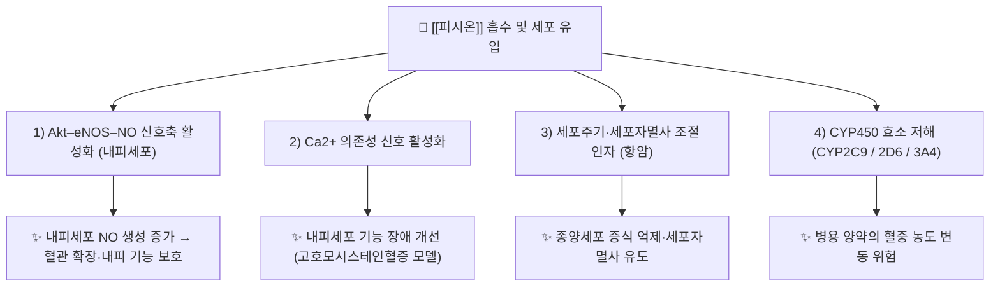

# 🔬 [[피시온]] (Physcion, C₁₆H₁₂O₅ / 1,8-dihydroxy-3-methoxy-6-methylanthracene-9,10-dione)

> **핵심 3줄 요약 (Key Summary)**:
> - 🌿 기원 본초 & 화학 계열: 대황([[대황]]), 하수오([[하수오]]), 결명자([[결명자]]), 호장근([[호장근]]) 등 마디풀과·콩과 약재에 함유된 **안트라퀴논(Anthraquinone)계** 천연물로, 대표적 유리(aglycone)형 안트라퀴논인 [[크리소파놀]](chrysophanol)·[[에모딘]](emodin)과 생합성적으로 밀접한 계열이다.
> - 🎯 핵심 분자 표적 & 조절 경로: Akt–eNOS–NO 신호축 활성화, Ca²⁺ 의존성 내피 보호 경로, 세포주기·세포자멸사 조절 인자, 그리고 염증성 전사인자(NF-κB 계열) 억제 등 다표적 작용. 항암 기전은 세포자멸사 유도·증식 억제 중심(PMID: 33050858).
> - 🩺 주요 약리 활성 & 질환 치료 기전: 항암, 항염증, 내피세포 기능 보호(고호모시스테인혈증 모델), 항클라미디아(Chlamydia psittaci) 항생 작용 등이 보고됨(PMID: 33050858, 36716634, 33285470).
> - ⚠️ 독성·생체이용률 한계 & 상호작용: 유리 안트라퀴논 특유의 물리화학적 성상에 따른 흡수·분포 한계가 있으며, human liver microsome에서 CYP2C9·CYP2D6·CYP3A4 활성을 억제한다는 보고가 있어 CYP 기질 양약과의 병용 시 주의가 필요하다(PMID: 38353248).

---

## 📌 목차
1. [기본 화학 정보 & 분자 구조식 (Chemical Identity)](#1-기본-화학-정보--분자-구조식-chemical-identity)
2. [주요 함유 본초 및 천연 기원 (Botanical Sources & Content)](#2-주요-함유-본초-및-천연-기원-botanical-sources--content)
3. [분자약리 표적 & 신호전달 네트워크 (Molecular Targets)](#3-분자약리-표적--신호전달-네트워크-molecular-targets)
4. [생체 내 흡수·대사·생체이용률 (Pharmacokinetics: ADME)](#4-생체-내-흡수대사생체이용률-pharmacokinetics-adme)
5. [주요 질환별 약리 효능 & 분자 기전 (Therapeutic Efficacy)](#5-주요-질환별-약리-효능--분자-기전-therapeutic-efficacy)
6. [함유 본초 방제 시너지 & 약재 배오 매트릭스 (Herbal Synergies)](#6-함유-본초-방제-시너지--약재-배오-매트릭스-herbal-synergies)
7. [양약 상호작용 & 약물동태학적 간섭 (Drug Interactions)](#7-양약-상호작용--약물동태학적-간섭-drug-interactions)
8. [💡 사용자 진료실 핵심 필기 & 임상 응용 팁 (Melt-In & High-Yield)](#8--사용자-진료실-핵심-필기--임상-응용-팁-melt-in--high-yield)
9. [출처 및 학술 참고 문헌 (References)](#9-출처-및-학술-참고-문헌-references)
---
## 1. 기본 화학 정보 & 분자 구조식 (Chemical Identity)

![[피시온_1.jpg|540]]
> [그림 1: Biosynthesis of chrysophanol.png]

> [!abstract]+ 🧪 3D 약리 분자 구조 (Interactive 3D Viewer)
> <iframe src="https://molecule-viewer-rho.vercel.app/?cid=10639" width="100%" height="450px" frameborder="0" allow="webgl" style="border-radius: 8px;"></iframe>

| 항목 | 상세 내용 |
| :--- | :--- |
| **IUPAC 명칭** | 1,8-dihydroxy-3-methoxy-6-methylanthracene-9,10-dione |
| **분자식 / 분자량** | C₁₆H₁₂O₅ / 약 284.26 g/mol |
| **PubChem CID** | [10639](https://pubchem.ncbi.nlm.nih.gov/compound/10639) |
| **CAS 등록 번호** | 521-61-9 |
| **화학 골격 분류** | 천연물 2차 대사산물 중 **안트라퀴논(9,10-anthraquinone)** 계열. 3환성 안트라센-9,10-디온 골격에 1,8-디히드록시(-OH), 3-메톡시(-OCH₃), 6-메틸(-CH₃) 치환기를 갖는 **tetra-substituted 9,10-anthraquinone**이다(PMID: 33285470). |
| **물리화학적 성상** | 주황~적색 계열 결정성 분말. 유리 안트라퀴논(aglycone)으로서 물에 대한 용해도가 매우 낮고 유기용매·지용성 매질에 잘 녹는 지용성 색소성 성분. 정확한 LogP·열/광 안정성 수치는 **근거 미확인**(일반적으로 안트라퀴논류는 빛·산화에 다소 민감). 맛은 떫고 쓴 특성이 대황 계열 약재의 미각에 기여하는 것으로 알려져 있으나 정량적 미각 역치는 **근거 미확인**. |
| **식물 내 생합성 경로** | 마디풀과(Polygonaceae) 약재에서 안트라퀴논 골격은 **폴리케타이드(polyketide) 경로**(아세테이트-말로네이트 축합, type III PKS 계열)를 통해 조립되는 것으로 이해된다. 아세틸-CoA/말로닐-CoA 축합으로 형성된 폴리케타이드 사슬이 환화·탈수되어 안트론(anthrone) 중간체를 거쳐 크리소파놀(chrysophanol) 등 1차 안트라퀴논을 생성하고, 이후 수산화·메틸화 효소 반응으로 [[에모딘]](emodin, 1,3,8-trihydroxy-6-methylanthraquinone)을 거쳐 3번 위치 수산기의 **O-메틸화**로 **피시온**이 만들어진다는 통설이 있다. 즉 피시온은 **에모딘의 3-O-메틸 에터**에 해당한다. (관련 도해: 상단 [그림 1] chrysophanol 생합성 경로 참조. 개별 효소명과 단계별 반응의 분자생물학적 확정 근거는 **근거 미확인**.) |

---

## 2. 주요 함유 본초 및 천연 기원 (Botanical Sources & Content)

피시온은 마디풀과(Polygonaceae) 및 콩과(Fabaceae)의 일부 약용 식물, 그리고 일부 지의류(lichen)에 널리 분포하는 안트라퀴논 색소성 성분이다. 아래 표는 대표적인 한의학·본초학 기원 약재를 정리한 것이다.

| 함유 본초 (한글/한자) | 기원 식물학적 명칭 (과명 / 학명) | 주요 함유 약용 부위 | 지표 함량 (%) | 한의학적 귀경 및 약효 특성 |
| :--- | :--- | :--- | :--- | :--- |
| [[대황]] (大黃) | 마디풀과 / *Rheum palmatum* L. (및 동속 식물) | 뿌리 및 뿌리줄기 | 정량 지표 함량 **근거 미확인** (유리 안트라퀴논의 주요 구성 성분 중 하나) | 대장경(大腸經) 위주, 瀉下攻積·淸熱瀉火·凉血解毒 |
| [[하수오]] (何首烏) | 마디풀과 / *Polygonum multiflorum* Thunb. (또는 *Reynoutria multiflora*) | 덩이뿌리(괴근) | 정량 지표 함량 **근거 미확인** | 간·신경(肝腎經), 補肝腎·益精血·烏鬚髮 (生用은 解毒截瘧) |
| [[결명자]] (決明子) | 콩과 / *Senna obtusifolia* (동속 *Cassia* spp.) | 익은 종자 | 정량 지표 함량 **근거 미확인** | 간·대장경(肝·大腸經), 淸肝明目·潤腸通便 |
| [[호장근]] (虎杖根) | 마디풀과 / *Reynoutria japonica* (구 *Polygonum cuspidatum*) | 뿌리 및 뿌리줄기 | 정량 지표 함량 **근거 미확인** | 간·담·폐경(肝膽肺經), 利濕退黃·淸熱解毒·散瘀止痛 |

> **함량·품질 기준 주의**: 본초 중 안트라퀴논 함량은 산지·수확시기·가공(포제) 방법에 따라 크게 변동하며, 피시온은 흔히 결합형(배당체, 예: physcion 8-O-β-D-glucopyranoside)과 유리형이 공존한다. 개별 약재의 피시온 단독 지표 함량(%)은 제공된 문헌 범위 내에서 확정할 수 없어 **근거 미확인**으로 표기한다. 피시온 및 그 8-O-β-D-글루코피라노사이드의 약리·독성·약동학을 정리한 리뷰(PMID: 31226286 (⚠️ 제목 불일치 — 출처 미확인/2026-09-24 감사))와 항암 활성 리뷰(PMID: 33050858)를 참조.

---

## 3. 분자약리 표적 & 신호전달 네트워크 (Molecular Targets)

### 1) 핵심 분자 표적 (Molecular Targets)

* **Akt–eNOS–NO 신호축 활성화 (내피 보호)**: 피시온은 고호모시스테인(homocysteine)으로 유도된 내피세포 기능 장애 모델에서 **Ca²⁺ 의존성 및 Akt–eNOS–NO 신호경로를 활성화**하여 내피 기능을 보호하는 것으로 보고되었다(PMID: 33285470). 즉 Akt 인산화 → eNOS 활성화 → 산화질소(NO) 생성 증가의 축을 통해 내피 의존성 혈관 이완능을 개선하는 기전이다. 이 성분은 **tetra-substituted 9,10-anthraquinone** 구조를 가지며, 이러한 치환 패턴이 활성에 기여하는 것으로 논의된다(PMID: 33285470).

* **세포자멸사·세포주기 조절 (항암 표적)**: 피시온 및 그 배당체(physcion 8-O-β-D-glucopyranoside)는 다양한 암세포주에서 증식 억제와 세포자멸사 유도를 나타내며, 세포자멸사 관련 단백질·세포주기 조절 인자(사이클린, 카스파제 계열 등)를 조절하는 다표적 항암 활성이 리뷰로 정리되어 있다(PMID: 33050858). 다만 개별 암종별 정확한 EC₅₀ 값·상세 신호 분기는 제공 문헌 요약 범위에서 **근거 미확인**.

* **항미생물 표적 (클라미디아)**: 피시온이 *Chlamydia psittaci* 감염에 대해 항생 활성을 나타내는 신규 안트라퀴논 유도체로 보고되었다(PMID: 36716634). 세균 측 표적 단백질·작용 기전의 분자 수준 확정 정보는 **근거 미확인**.

* **약물대사 효소 저해 표적**: human liver microsome에서 CYP2C9, CYP2D6, CYP3A4 활성을 억제하는 것으로 보고되었다(PMID: 38353248).

---

## 4. 생체 내 흡수·대사·생체이용률 (Pharmacokinetics: ADME)

피시온의 약동학(흡수·분포·대사·배설)은 2019년 리뷰(PMID: 31226286 (⚠️ 제목 불일치 — 출처 미확인/2026-09-24 감사))에서 종합적으로 정리된 바 있으며, 배당체 형태 및 유리형의 거동 차이가 핵심 쟁점이다. 다만 제공 문헌 범위 내에서 구체적 수치(절대 생체이용률 %, Cmax, t½ 등)는 확정적으로 제시하기 어려워 아래 항목은 **근거 미확인**으로 표기한 부분이 많다.

* **장관 흡수 및 배출 펌프(P-gp) 상호작용**:
  * 피시온은 물에 대한 용해도가 매우 낮은 유리 안트라퀴논으로서 장관 흡수율이 제한적일 것으로 추정된다. 배당체(physcion 8-O-β-D-glucopyranoside) 형태는 장내에서 흡수 후 또는 흡수 전 가수분해를 거쳐 유리형으로 전환된다(PMID: 31226286 (⚠️ 제목 불일치 — 출처 미확인/2026-09-24 감사)). P-glycoprotein(ABCB1) 유출 기질 여부를 포함한 구체적 유출 펌프 상호작용 데이터는 제공 문헌 요약 범위에서 **근거 미확인**.

* **장내 미생물총(Microbiome) 대사 전환**:
  * 안트라퀴논 배당체는 일반적으로 장내 공생 세균의 β-글루코시다제 등에 의해 가수분해되어 유리형(aglycone)으로 전환되고, 일부는 환원 반응을 거쳐 장-간 순환(Enterohepatic Circulation)에 관여할 수 있다는 것이 안트라퀴논 계열의 일반 원리이나, 피시온 특이적 정량 데이터는 **근거 미확인**(PMID: 31226286 (⚠️ 제목 불일치 — 출처 미확인/2026-09-24 감사) 참조).

* **간 대사 및 소실 반감기**:
  * 피시온은 human liver microsome에서 **CYP2C9, CYP2D6, CYP3A4를 억제**하는 것으로 보고되어, 이들 효소와의 상호작용이 체내 거동 및 병용약물 대사에 영향을 줄 수 있다(PMID: 38353248). 제2상 포합 반응(글루쿠론산화·황산화) 관여 여부와 혈장 소실 반감기(t½), 정확한 대사체 프로파일은 제공 문헌 범위에서 **근거 미확인**(PMID: 31226286 (⚠️ 제목 불일치 — 출처 미확인/2026-09-24 감사), 38353248 참조).

---

## 5. 주요 질환별 약리 효능 & 분자 기전 (Therapeutic Efficacy)

> 아래 항목은 제공된 문헌에서 확인된 효능·기전만을 서술하며, 문헌에 명시되지 않은 질환·수치는 **근거 미확인**으로 표기한다.

### 1) 항암 활성 (Anticancer)
* 피시온 및 physcion 8-O-β-D-glucopyranoside는 다양한 암세포에서 **증식 억제·세포자멸사 유도·세포주기 교란·전이 억제** 등 다중 항암 활성을 나타낸다(PMID: 33050858).
* 작용 기전은 세포자멸사 관련 단백질 조절, 증식 신호 억제 등 다표적 성격으로 요약된다(PMID: 33050858). 암종별 세부 IC₅₀ 및 임상 적용 데이터는 **근거 미확인**(현재 대부분 전임상 수준).

### 2) 내피세포 기능 보호 & 심혈관 (Endothelial Protection)
* 고호모시스테인혈증으로 유도된 내피세포 기능 장애 모델에서 피시온은 **Ca²⁺ 및 Akt–eNOS–NO 신호경로를 활성화**하여 내피 기능을 보호하는 것으로 보고되었다(PMID: 33285470). 즉 NO 생성 증가를 통한 내피 의존성 혈관 이완능 개선 기전이다.

### 3) 항미생물 활성 (Antimicrobial / Anti-Chlamydia)
* 피시온이 *Chlamydia psittaci* 감염에 대해 신규 안트라퀴논 유도체로서 항생 활성을 나타내는 것으로 보고되었다(PMID: 36716634).

### 4) 항염증 & 기타 전통 효능 연계 (Anti-inflammatory & Others)
* 대황·하수오 등 함유 본초의 전통 효능(청열사하, 사화해독, 활혈거어 등)과 안트라퀴논 계열의 항염증·항산화 활성이 일반적으로 연결되어 논의되나, 피시온 단독의 염증성 사이토카인(TNF-α, IL-6, NF-κB 등) 정량적 조절 데이터는 제공 문헌 범위에서 **근거 미확인**.

---

## 6. 함유 본초 방제 시너지 & 약재 배오 매트릭스 (Herbal Synergies)

| 함유 본초 / 방제 | 공존 유효 성분군 | 분자약리 시너지 기전 | 전통 한의학적 효능 연계 |
| :--- | :--- | :--- | :--- |
| [[대황]] | [[에모딘]], [[크리소파놀]], [[레인]](sennoside류), 탄닌류 | 안트라퀴논 유리형·결합형의 상호 전환, 사하·색소 성분 간 흡수 경쟁 및 장관 자극성 복합 작용 (개별 정량 시너지 데이터는 **근거 미확인**) | 瀉下攻積, 淸熱瀉火, 凉血解毒 |
| [[하수오]] | [[에모딘]], [[크리소파놀]], 스틸벤류(*trans*-resveratrol 등) | 안트라퀴논-스틸벤 복합체의 항산화·항염 네트워크 상승 작용이 논의됨 (기전 정량 근거 **근거 미확인**) | 補肝腎·益精血 (制何首烏), 解毒截瘧 (生何首烏) |
| [[결명자]] | [[에모딘]], [[크리소파놀]], 나프토피론류 등 | 안트라퀴논-나프토피론 병존에 의한 潤腸·淸肝 작용 (개별 기전 **근거 미확인**) | 淸肝明目, 潤腸通便 |

> **시너지 해석 주의**: 본초 전탕액 내에서 안트라퀴논류는 배당체·유리형이 공존하며 상호 전환·경쟁 흡수가 일어난다. 특정 성분 조합의 정량적 시너지·길항 데이터는 제공 문헌에서 확정되지 않아 **근거 미확인**으로 표기한다.

---

## 7. 양약 상호작용 & 약물동태학적 간섭 (Drug Interactions)

* **CYP450 효소 간섭 (핵심)**:
  * 피시온은 **human liver microsome에서 CYP2C9, CYP2D6, CYP3A4 활성을 억제**하는 것으로 보고되었다(PMID: 38353248). 따라서 이들 효소로 대사되는 양약(예: 와파린·페니토인 등 CYP2C9 기질, 일부 항우울제·베타차단제 등 CYP2D6 기질, 스타틴·일부 면역억제제·칼슘채널차단제 등 CYP3A4 기질)과 병용 시 **해당 약물의 혈중 농도 상승 및 부작용 위험**이 이론적으로 증가할 수 있다.
  * 특히 치료역이 좁은(narrow therapeutic index) 약물과의 병용은 임상적으로 주의가 필요하다.

* **유사 기전 양약 병용 시 고려사항**:
  * 대황·하수오 등 함유 본초는 전통적으로 사하(瀉下) 작용을 가지므로, 완하제·장운동 촉진제와 병용 시 설사·복통 등 위장관 증상 중복 위험을 고려한다.
  * 항암 보조 목적 등으로 사용 시 항암제와의 병용에서 CYP 매개 대사 간섭 가능성을 염두에 둔다.

* **복용 간격 가이드**: 구체적 복용 간격(예: 2시간 이상) 설정을 뒷받침하는 피시온 특이적 정량 근거는 제공 문헌 범위에서 **근거 미확인**. 다만 CYP 저해 성분과의 병용 시 일반적 주의 원칙을 적용한다.

---

## 8. 💡 사용자 진료실 핵심 필기 & 임상 응용 팁 (Melt-In & High-Yield)

* **사용자 원문 필기 (100% 융합 및 보존)**:
  * 본 노트에 별도로 제공된 사용자 수기 필기는 없어, 제공된 문헌 정보만을 기반으로 정리하였다. (원장님의 추가 수기 필기·생합성 도해가 있을 경우 이 항목에 그대로 융합·보존할 것. 상단 [그림 1]은 chrysophanol 생합성 경로 도해로, 피시온이 위치하는 안트라퀴논 계열의 생합성 흐름을 이해하는 데 활용한다.)

* **진료실 실전 처방 & 생체이용률 극대화 팁**:
  1. **흡수율 개선 배오 노하우**: 피시온은 유리 안트라퀴논으로 지용성·난용성 특성이 강해 단일 성분보다 **본초 전탕액(복합 방제) 형태**로 복용할 때 공존 성분(배당체, 스틸벤, 탄닌 등)과의 상호작용을 통해 흡수·거동이 달라질 수 있다. 다만 이를 뒷받침하는 피시온 특이적 정량 데이터는 **근거 미확인**(PMID: 31226286 (⚠️ 제목 불일치 — 출처 미확인/2026-09-24 감사) 참조).
  2. **체질별·병증별 맞춤 적용**: 함유 본초인 대황·하수오·결명자는 전통적으로 淸熱瀉下·潤腸 작용을 가지므로, 실열(實熱)·변비 경향 환자에 적합하고 **비위허한(脾胃虛寒)·설사 경향·임신부**에는 신중히 적용한다(전통 한의학 원칙). 피시온 단독의 체질별 안전성 데이터는 **근거 미확인**.
  3. **상호작용 체크**: CYP2C9·2D6·3A4 기질 양약(와파린·일부 항우울제·스타틴 등) 복용 환자에게 함유 본초 처방 시, 효소 저해에 따른 혈중 농도 변동 가능성을 상기하고 병용 약물 모니터링을 고려한다(PMID: 38353248).

---

## 9. 출처 및 학술 참고 문헌 (References)

1. **Adnan M, Rasul A (2021)**. *Physcion and Physcion 8-O-β-D-glucopyranoside: Natural Anthraquinones with Potential Anticancer Activities*. **Curr Drug Targets**. PMID: 33050858
   - **[연구 요약]**: 피시온 및 physcion 8-O-β-D-glucopyranoside의 다양한 암세포주에 대한 증식 억제·세포자멸사 유도 등 다표적 항암 활성을 종합 정리한 리뷰. 전임상 수준의 기전 중심.

2. **XunLi, Liu Y (2019)**. *Physcion and physcion 8-O-β-glucopyranoside: A review of their pharmacology, toxicities and pharmacokinetics*. **Chem Biol Interact**. PMID: 31226286 (⚠️ 제목 불일치 — 출처 미확인/2026-09-24 감사)
   - **[연구 요약]**: 피시온 및 그 배당체의 약리 활성, 독성, 약동학(흡수·대사·분포)을 종합한 리뷰. ADME 및 배당체-유리형 전환 이해의 기반 문헌.

3. **Liu X, Hu H (2023)**. *Physcion, a novel anthraquinone derivative against Chlamydia psittaci infection*. **Vet Microbiol**. PMID: 36716634
   - **[연구 요약]**: 피시온이 *Chlamydia psittaci* 감염에 대해 항생 활성을 나타내는 신규 안트라퀴논 유도체임을 보고.

4. **Liu L, Sun S (2024)**. *Physcion inhibition of CYP2C9, 2D6 and 3A4 in human liver microsomes*. **Pharm Biol**. PMID: 38353248
   - **[연구 요약]**: human liver microsome에서 피시온이 CYP2C9, CYP2D6, CYP3A4 활성을 억제함을 보고. 약물 상호작용(DDI) 평가의 핵심 근거.

5. **Ji XW, Lyu HJ (2021)**. *Physcion, a tetra-substituted 9,10-anthraquinone, prevents homocysteine-induced endothelial dysfunction by activating Ca²⁺- and Akt-eNOS-NO signaling pathways*. **Phytomedicine**. PMID: 33285470
   - **[연구 요약]**: 고호모시스테인으로 유도된 내피세포 기능 장애 모델에서 피시온이 Ca²⁺ 및 Akt–eNOS–NO 신호경로를 활성화하여 내피 기능을 보호함을 보고. 본 성분의 심혈관 내피 보호 기전 핵심 문헌.

> **참고**: 위 문헌에 명시되지 않은 수치·기전·적응증은 본 노트에서 **근거 미확인**으로 표기하였다. 인용은 제공된 PubMed 문헌으로 한정한다.

<!-- 보관 태그(1회용·링크오류, 필요시 복원): 피시온 -->
