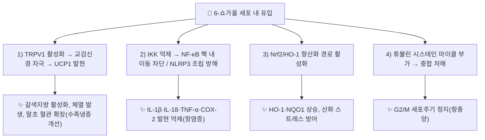

---
aliases:
  - 6-Shogaol
  - 육쇼가올
  - 쇼가올
tags:
  - 약리
  - 약리성분
  - 페놀
  - 바닐로이드
  - 생강
  - 항염증
title: 6-쇼가올
date: 2026-09-16
출처: "DOI: 10.1016/j.jep.2009.10.004"
---

# 🔬 [[6-쇼가올]] (6-Shogaol, $\text{C}_{17}\text{H}_{24}\text{O}_3$)

> **핵심 3줄 요약 (Key Summary)**:
> - 🌿 기원 본초 & 화학 계열: [[생강]](*Zingiber officinale*)을 건조·가열해 제조하는 [[건강]](乾薑)에 풍부한 탈수 바닐로이드(Vanilloid) 페놀계 지표 성분. [[6-진저롤]]의 탈수 반응으로 생성.
> - 🎯 핵심 분자 표적 & 조절 경로: TRPV1 활성화를 통한 체열 발생, NF-κB·NLRP3 인플라마좀 억제, Nrf2/HO-1 항산화 경로 촉진, 튜불린 결합을 통한 G2/M 세포주기 정지.
> - 🩺 주요 약리 활성 & 질환 치료 기전: 항염증(관절염), 신경보호(파킨슨·알츠하이머), 항비만(갈색지방 활성화), 항종양(다수 암종), 심·신장 보호.
> - ⚠️ 독성·생체이용률 한계 & 상호작용: 경구 생체이용률이 매우 낮고(랫드 기준 약 0.15%) 글루쿠론산 포합이 주요 대사 경로이며, 고용량(g 단위) 섭취 시에만 혈중 검출. CYP1A2에 대해 상대적으로 강한 시험관 내 억제能을 보이나 실제 혈중 농도는 억제 농도보다 훨씬 낮아 임상적 상호작용 위험은 제한적.

---

## 📌 목차
1. [기본 화학 정보 & 분자 구조식 (Chemical Identity)](#1-기본-화학-정보--분자-구조식-chemical-identity)
2. [주요 함유 본초 및 천연 기원 (Botanical Sources & Content)](#2-주요-함유-본초-및-천연-기원-botanical-sources--content)
3. [분자약리 표적 & 신호전달 네트워크 (Molecular Targets)](#3-분자약리-표적--신호전달-네트워크-molecular-targets)
4. [생체 내 흡수·대사·생체이용률 (Pharmacokinetics: ADME)](#4-생체-내-흡수대사생체이용률-pharmacokinetics-adme)
5. [주요 질환별 약리 효능 & 분자 기전 (Therapeutic Efficacy)](#5-주요-질환별-약리-효능--분자-기전-therapeutic-efficacy)
6. [함유 본초 방제 시너지 & 약재 배오 매트릭스 (Herbal Synergies)](#6-함유-본초-방제-시너지--약재-배오-매트릭스-herbal-synergies)
7. [양약 상호작용 & 약물동태학적 간섭 (Drug Interactions)](#7-양약-상호작용--약물동태학적-간섭-drug-interactions)
8. [💡 사용자 진료실 핵심 필기 & 임상 응용 팁 (Melt-In & High-Yield)](#8--사용자-진료실-핵심-필기--임상-응용-팁-melt-in--high-yield)
9. [출처 및 학술 참고 문헌 (References)](#9-출처-및-학술-참고-문헌-references)

---

## 1. 기본 화학 정보 & 분자 구조식 (Chemical Identity)

> [!abstract]+ 🧪 3D 약리 분자 구조 (Interactive 3D Viewer)
> <iframe src="https://molecule-viewer-rho.vercel.app/?cid=5281728" width="100%" height="450px" frameborder="0" allow="webgl" style="border-radius: 8px;"></iframe>

| 항목 | 상세 내용 |
| :--- | :--- |
| **IUPAC 명칭** | (4E)-1-(4-hydroxy-3-methoxyphenyl)dec-4-en-3-one |
| **분자식 / 분자량** | $\text{C}_{17}\text{H}_{24}\text{O}_3$ / 276.37 g/mol |
| **PubChem CID** | [5281728](https://pubchem.ncbi.nlm.nih.gov/compound/5281728) |
| **CAS 등록 번호** | 555-66-8 |
| **화학 골격 분류** | 바닐로이드(Vanilloid) 페놀계, $\alpha,\beta$-불포화 케톤 |
| **물리화학적 성상** | 황색 유상 물질, [[6-진저롤]] 대비 친지성(Lipophilicity) 높음, 열에 상대적으로 안정 |
| **식물 내 생성 경로** | [[6-진저롤]](6-Gingerol)의 탈수 반응(Dehydration)으로 수산기(-OH)가 이탈, $\alpha,\beta$-불포화 케톤 구조 형성. 생강을 고온 건조·포제(포강)할 때 대량 생성됨 |

---

## 2. 주요 함유 본초 및 천연 기원 (Botanical Sources & Content)

| 함유 본초 (한글/한자) | 기원 식물학적 명칭 (과명 / 학명) | 주요 함유 약용 부위 | 지표 함량 특성 | 한의학적 귀경 및 약효 특성 |
| :--- | :--- | :--- | :--- | :--- |
| [[건강]] (乾薑) | 생강과(Zingiberaceae) / *Zingiber officinale* Roscoe | 뿌리줄기(건조·가열 가공) | 생강(生薑) 대비 6-쇼가올 농도 유의 증가, 6-진저롤 대비 상대비율 상승 | 비·위·폐·심경 / 온중산한(溫中散寒), 회양통맥(回陽通脈), 온폐화음(溫肺化飲) |
| [[생강]] (生薑) | 생강과(Zingiberaceae) / *Zingiber officinale* Roscoe | 신선한 뿌리줄기 | 6-진저롤이 우세, 6-쇼가올은 미량 | 폐·비·위경 / 발한해표(發汗解表), 온위지구(溫胃止嘔) |
| 포강(炮薑) | 생강과(Zingiberaceae) / *Zingiber officinale* Roscoe | 건강을 다시 볶아 포제 | 건강보다 6-쇼가올 함량이 한층 더 농축 | 비·간경 / 온경지혈(溫經止血), 온중지사(溫中止瀉) |

> 생강을 볕에 말리거나(건강) 다시 볶는(포강) 가공도가 높아질수록 6-진저롤 → 6-쇼가올로의 탈수 전환이 진행되어, "생강의 표부 발산" 작용과 "건강·포강의 속을 덥히는" 작용의 차이가 화학적으로 뒷받침됩니다.

---

## 3. 분자약리 표적 & 신호전달 네트워크 (Molecular Targets)

### 1) TRPV1 활성화 및 체열 발생(Thermogenesis)
* 감각신경·혈관 내피세포의 TRPV1(바닐로이드 수용체)을 활성화해 교감신경을 자극, 갈색지방조직(BAT)의 UCP1·PGC-1α·PRDM16 발현을 촉진하고 말초 미세혈관을 확장시켜 수족냉증을 개선합니다.
* 3T3-L1 지방전구세포에서는 PPARγ·C/EBPα·SREBP-1c를 하향 조절해 백색지방 생성(Adipogenesis) 자체를 억제합니다.

### 2) NF-κB·NLRP3 인플라마좀 억제(항염증)
* 마이클 첨가 반응으로 IκB 키나아제(IKK)의 시스테인 잔기를 변형시켜 NF-κB 핵 내 이동을 차단하고, 대식세포 NLRP3 인플라마좀 조립을 방해해 IL-1β·IL-18 분비를 억제합니다.
* LPS로 자극한 RAW264.7 대식세포에서 PGE2 생성 및 iNOS·COX-2 발현을 억제합니다.

### 3) 튜불린 결합을 통한 항종양 기전
* 튜불린 시스테인 잔기에 마이클 부가 반응으로 직접 결합해 중합을 저해, G2/M기 세포주기 정지를 유도합니다. Akt의 Ser205 알로스테릭 부위에도 결합해 CDK1·사이클린 B 발현을 낮춥니다.

---

## 4. 생체 내 흡수·대사·생체이용률 (Pharmacokinetics: ADME)

| 약동학 파라미터 | 성상 및 수치 | 근거 |
| :--- | :--- | :--- |
| **경구 생체이용률** | 랫드 단회 경구 투여 시 약 0.15%(0.10~0.31%) | Songvut et al. 2024, *Front Pharmacol* |
| **Tmax(경구)** | 약 0.75시간(랫드) / 사람 2.0 g 경구 투여 시 약 65.6분 | Songvut 2024; Zick et al. 2008, *Cancer Epidemiol Biomarkers Prev* |
| **Cmax** | 랫드 51.79 ± 20.95 ng/mL(경구) / 사람 2.0 g 투여 시 0.15 ± 0.12 μg/mL | 상동 |
| **반감기(t1/2)** | 사람 2.0 g 경구 투여 시 약 120분 | Zick et al. 2008 |
| **대사** | 글루쿠론산 포합이 주요 경로(황산 포합체는 검출되지 않음); 6-파라돌(6-paradol)로도 일부 전환 | Zick 2008; 종설(Inflammopharmacology 2025) |
| **P-당단백질(P-gp) 기질 여부** | 유출비(efflux ratio) < 2로 P-gp 기질성 낮음 | Mukkavilli et al. 2014, *PLOS ONE* |
| **저용량 검출 한계** | 1.0 g 미만 경구 투여 시 혈중에서 검출되지 않음(사람) | Zick et al. 2008 |

---

## 5. 주요 질환별 약리 효능 & 분자 기전 (Therapeutic Efficacy)

### 1) 만성 염증 및 관절통(허한성 통증)
* Complete Freund's Adjuvant 유발 관절염 모델에서 무릎 부종·백혈구 침윤을 줄이고 연골을 보존합니다.

### 2) 신경퇴행성 질환(파킨슨·알츠하이머)
* [[파킨슨병]] 모델에서 도파민·세로토닌·GABA 등 신경전달물질을 회복시켜 운동기능·우울양행동을 개선하고, 알츠하이머 모델에서는 미세아교세포·성상세포 활성화를 억제해 기억 손상을 완화합니다.

### 3) 대사증후군 및 비만
* 갈색지방 활성화(UCP1↑)와 백색지방 생성 억제(PPARγ↓)를 통해 체중·지방량 감소를 유도합니다.

### 4) 심장·신장 보호
* 이소프로테레놀 유발 심근 손상 모델에서 CK·CK-MB·LDH 등 손상 지표를 낮추고, 급성 신손상 모델에서 혈중 크레아티닌·BUN·NGAL을 억제합니다.

---

## 6. 함유 본초 방제 시너지 & 약재 배오 매트릭스 (Herbal Synergies)

| 함유 본초 / 방제 | 공존 유효 성분군 | 분자약리 시너지 기전 | 전통 한의학적 효능 연계 |
| :--- | :--- | :--- | :--- |
| [[사역탕]] | [[건강]](6-쇼가올), [[부자]]([[아코니틴]]), [[감초]]([[글리시리진]]) | TRPV1 활성화 기반 체열 발생 + 부자의 강심 작용이 상승 | 회양구역(回陽救逆), 망양증 구조 |
| [[대건중탕]] | [[건강]], [[촉초]](화초), [[인삼]] | 6-쇼가올의 항염증·진통 작용이 인삼의 소화관 점막 보호와 결합 | 온중보허(溫中補虛), 복부 극랭통 완화 |
| 생강+커큐민 병용(연구 근거) | 6-쇼가올, 커큐민 | TLR4/TRAF6/MAPK 및 NF-κB 경로 동시 억제로 대식세포 염증 반응 상가 억제 | 항염증 시너지(현대 실험 근거, 전통 배오는 아님) |

---

## 7. 양약 상호작용 & 약물동태학적 간섭 (Drug Interactions)

* **CYP1A2 시험관 내 억제, 임상적 위험은 제한적**: 6-쇼가올은 in vitro에서 CYP1A2에 대해 IC50 0.7 µg/mL로 비교적 강한 억제能을 보였으나(6-진저롤은 5.6~6.5 µg/mL), 실제 경구 섭취 후 도달하는 혈중 농도는 이 억제 농도보다 3~4배 낮아 **임상적으로 유의한 CYP 상호작용 가능성은 낮다**고 평가됩니다(Mukkavilli et al. 2014).
* **P-gp 매개 상호작용 낮음**: 유출비 2 미만으로 P-gp 기질성이 낮아, P-gp 기질 약물(디곡신 등)과의 흡수 경쟁 가능성은 제한적입니다.
* **항응고제와의 병용 주의**: 생강 전체 추출물 수준에서는 항혈소판 작용이 보고되어 와파린 등 항응고제와 병용 시 출혈 경향 증가 가능성이 문헌상 제기되나, 6-쇼가올 단일 성분 차원의 직접적 인체 DDI 연구는 아직 확인되지 않았습니다 — 확정된 근거가 아니므로 과장 안내 금지.

---

## 8. 💡 사용자 진료실 핵심 필기 & 임상 응용 팁 (Melt-In & High-Yield)

* **생강 vs 건강 vs 포강의 성질 스펙트럼**: 생것(생강)은 표부를 발산시키고(發汗解表), 말린 것(건강)은 속을 덥히며(溫中), 볶은 것(포강)은 지혈·지사 작용이 강화됩니다 — 이는 6-진저롤에서 6-쇼가올로의 화학적 전환이 진행될수록 TRPV1 활성화·항염증 활성이 강해지는 것과 대응됩니다.
* **처방 활용**: 사지 냉증·복부 냉통을 호소하는 환자에게 [[건강]] 함유 처방([[사역탕]], [[대건중탕]])을 쓸 때, 단순 진통이 아니라 TRPV1 매개 체열 발생과 NF-κB 억제라는 이중 기전으로 설명 가능합니다.
* **환자 교육 포인트**: "말린 생강(건강)은 생것보다 매운맛과 속을 덥히는 힘이 훨씬 강한데, 이는 진저롤이라는 성분이 건조·가열 과정에서 '쇼가올'이라는 더 강력한 성분으로 바뀌기 때문입니다. 다만 g 단위의 고용량을 장기간 복용하면 항응고제를 드시는 분은 주치의와 상의가 필요합니다."

---

## 9. 출처 및 학술 참고 문헌 (References)

1. **Dugasani S, et al. (2010)**. *Comparative antioxidant and anti-inflammatory effects of [6]-gingerol, [8]-gingerol, [10]-gingerol and [6]-shogaol*. **Journal of Ethnopharmacology**, 127(2), 515-520.
   - [DOI: 10.1016/j.jep.2009.10.004](https://doi.org/10.1016/j.jep.2009.10.004)
   - **[연구 요약]**: 6-쇼가올이 6-진저롤 대비 iNOS·COX-2 억제 활성이 수배 강력함을 실증.
2. **Songvut P, et al. (2024)**. *Unraveling the interconversion pharmacokinetics and oral bioavailability of the major ginger constituents: [6]-gingerol, [6]-shogaol, and zingerone after single-dose administration in rats*. **Frontiers in Pharmacology**, 15, 1391019.
   - [DOI: 10.3389/fphar.2024.1391019](https://doi.org/10.3389/fphar.2024.1391019)
   - **[연구 요약]**: 랫드에서 6-쇼가올의 경구 생체이용률(약 0.15%), Tmax, Cmax 및 6-진저롤과의 상호전환 약동학을 정량 규명.
3. **Zick SM, et al. (2008)**. *Pharmacokinetics of 6-Gingerol, 8-Gingerol, 10-Gingerol, and 6-Shogaol and Conjugate Metabolites in Healthy Human Subjects*. **Cancer Epidemiology, Biomarkers & Prevention**, 17(8), 1930-1936.
   - [DOI: 10.1158/1055-9965.EPI-08-0337](https://doi.org/10.1158/1055-9965.EPI-08-0337)
   - **[연구 요약]**: 건강한 사람에서 생강 성분들의 최초 인체 약동학 데이터(Cmax, Tmax, 반감기, 포합 대사체) 제공.
4. **Mukkavilli R, et al. (2014)**. *Modulation of Cytochrome P450 Metabolism and Transport across Intestinal Epithelial Barrier by Ginger Biophenolics*. **PLOS ONE**, 9(9), e108386.
   - [DOI: 10.1371/journal.pone.0108386](https://doi.org/10.1371/journal.pone.0108386)
   - **[연구 요약]**: 6-쇼가올·6-진저롤의 CYP450(특히 CYP1A2) 억제 IC50 및 P-gp 기질성을 정량 분석, 실제 혈중 농도 기준 임상적 상호작용 위험이 낮음을 제시.
5. **(리뷰) Inflammopharmacology (2025)**. *The therapeutic potential of naturally occurring 6-shogaol: an updated comprehensive review*.
   - [DOI: 10.1007/s10787-025-01812-z](https://doi.org/10.1007/s10787-025-01812-z)
   - **[연구 요약]**: 6-쇼가올의 분자표적(NF-κB, Nrf2, PPARγ, AMPK, 튜불린)과 염증·신경퇴행·비만·심신장·항암 전반의 최신 문헌을 총정리.

<!-- 보관 태그(1회용·링크오류, 필요시 복원): 건강 -->
