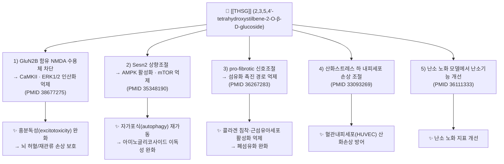

# 🔬 [[THSG]] (2,3,5,4'-Tetrahydroxystilbene-2-O-β-D-glucoside, C20H22O9 / 2,3,5,4'-테트라하이드록시스틸벤-2-O-β-D-글루코피라노시드)

> **핵심 3줄 요약 (Key Summary)**:
> - 🌿 **기원 본초 & 화학 계열**: [[하수오]](何首烏, *Polygonum multiflorum* / *Fallopia multiflora*, 마디풀과) 뿌리괴근의 **중국약전 지표성분**으로, 스틸벤 골격에 β-D-글루코스 1분자가 O-배당 결합한 **스틸베노이드(스틸벤 배당체)** 계열 폴리페놀이다. 아글리콘은 2,3,5,4'-tetrahydroxystilbene(= 2,3,5,4'-테트라하이드록시스틸벤)이다.
> - 🎯 **핵심 분자 표적 & 조절 경로**: GluN2B 함유 NMDA 수용체–CaMKII–ERK1/2 축 억제(허혈/재관류, PMID 38677275), Sesn2 상향–AMPK 활성화–mTOR 억제를 통한 자가포식 재가동(이독성, PMID 35348190), 섬유화 촉진 신호(TGF-β/Smad 계열 등 pro-fibrotic pathway) 억제(폐섬유화, PMID 36267283), 산화스트레스 하 혈관내피세포 손상 조절(PMID 33093269).
> - 🩺 **주요 약리 활성 & 질환 치료 기전**: 항산화·신경보호(뇌 허혈/재관류), 항섬유화(폐), 항노화/생식기능 보존(난소 노화), 세포보호성 자가포식 조절(이독성), 내피세포 보호 등. 전통적으로는 補肝腎·益精血·烏鬚髮(제하수오) 및 解毒·潤腸通便(생하수오)과 연결된다.
> - ⚠️ 독성·생체이용률 한계 & 상호작용: 제공된 5편에서는 THSG 단독의 인체 약동학 파라미터(Cmax, AUC, t1/2), P-gp 유출 기질 여부, CYP 저해/유도 상수를 직접 보고하지 않았다 → 정량적 수치는 **근거 미확인**. 다만 배당체·폴리페놀 일반론상 장관 흡수율이 낮고 장내 미생물에 의한 탈당화 후 아글리콘으로 흡수되는 경향이 있으며, 하수오 원약재 자체는 간손상(약인성 간손상) 보고가 누적된 본초이므로 **간기능 모니터링과 병용약 검토가 필수**다.

---

## 📌 목차
1. [기본 화학 정보 & 분자 구조식 (Chemical Identity)](#1-기본-화학-정보--분자-구조식-chemical-identity)
2. [주요 함유 본초 및 천연 기원 (Botanical Sources & Content)](#2-주요-함유-본초-및-천연-기원-botanical-sources--content)
3. [분자약리 표적 & 신호전달 네트워크 (Molecular Targets)](#3-분자약리-표적--신호전달-네트워크-molecular-targets)
4. [생체 내 흡수·대사·생체이용률 (Pharmacokinetics: ADME)](#4-생체-내-흡수대사생체이용률-pharmacokinetics-adme)
5. [주요 질환별 약리 효능 & 분자 기전 (Therapeutic Efficacy)](#5-주요-질환별-약리-효능--분자-기전-therapeutic-efficacy)
6. [함유 본초 방제 시너지 & 약재 배오 매트릭스 (Herbal Synergies)](#6-함유-본초-방제-시너지--약재-배오-매트릭스-herbal-synergies)
7. [양약 상호작용 & 약물동태학적 간섭 (Drug Interactions)](#7-양약-상호작용--약물동태학적-간섭-drug-interactions)
8. [💡 사용자 진료실 핵심 필기 & 임상 응용 팁 (Melt-In & High-Yield)](#8--사용자-진료실-핵심-필기--임상-응용-팁-melt-in--high-yield)
9. [출처 및 학술 참고 문헌 (References)](#9-출처-및-학술-참고-문헌-references)

---
## 1. 기본 화학 정보 & 분자 구조식 (Chemical Identity)

![[THSG_1.jpg|540]]
> [그림 1: A monograph of the North American species of the genus Polygonum (IA cu31924000446587).pdf]

> [!abstract]+ 🧪 3D 약리 분자 구조 (Interactive 3D Viewer)
> <iframe src="https://molecule-viewer-rho.vercel.app/?cid=5481902" width="100%" height="450px" frameborder="0" allow="webgl" style="border-radius: 8px;"></iframe>

| 항목 | 상세 내용 |
| :--- | :--- |
| **IUPAC 명칭** | (2S,3R,4S,5S,6R)-2-[2,4-dihydroxy-3-[(E)-2-(4-hydroxyphenyl)ethenyl]phenoxy]-6-(hydroxymethyl)oxane-3,4,5-triol — 즉 아글리콘의 **2번 탄소 하이드록실**에 β-D-글루코피라노스가 O-배당 결합한 구조 |
| **분자식 / 분자량** | C20H22O9 / **406.38 g/mol** (아글리콘 C14H12O4 244.24 + 글루코스 180.16 − H2O 18.02) |
| **PubChem CID** | [5481902](https://pubchem.ncbi.nlm.nih.gov/compound/5481902) — ※ 데이터베이스/판본에 따라 CID 표기가 달라질 수 있으므로 3D 뷰어로 구조(스틸벤 2-O-글루코시드)를 반드시 육안 확인할 것 |
| **CAS 등록 번호** | 82373-94-2 (*2,3,5,4'-tetrahydroxystilbene-2-O-β-D-glucoside*로 통용되는 번호) |
| **화학 골격 분류** | 천연물 2차 대사산물 중 **스틸베노이드(stilbenoid) / 스틸벤 O-배당체(polyphenol glycoside)**. [[레스베라트롤]](resveratrol)·[[폴리다틴]](polydatin)과 동일한 스틸벤 골격 계열이나, 하이드록실 치환 위치와 배당 위치가 다르다(THSG는 2,3,5,4'-치환 + 2-O-글루코시드). |
| **물리화학적 성상** | 백색~미황색 결정성 분말로 통용되며, 다가 페놀성 하이드록실과 당이 공존하여 **물·에탄올·DMSO에 비교적 잘 녹고 지용성은 낮은 편**(배당체 특성상 아글리콘보다 LogP가 크게 낮음). 페놀성 화합물 특성상 빛·산소·고온에서 산화/변색에 취약 → **차광·건조·냉장 보관**이 원칙. 맛은 떫고 약간 쓴 편. (정확한 LogP·용해도 수치는 제공 논문에서 보고되지 않음 → **근거 미확인**) |
| **식물 내 생합성 경로** | 일반적 페닐프로파노이드 경로: 페닐알라닌 → (PAL) → 신남산 → (C4H) → *p*-쿠마르산 → (*p*-쿠마로일-CoA) → **스틸벤 신타아제(STS)**가 말로닐-CoA 3분자와 축합 → 레스베라트롤형 스틸벤 골격 형성 → 시토크롬 P450계 수산화효소에 의한 **추가 수산화(2,3,5,4'-치환 패턴 완성)** → **UDP-글루코실트랜스퍼라제(UGT)**에 의한 2번 위치 O-글루코실화 → THSG. (경로 골격은 식물 스틸벤 대사의 일반 원리이며, 하수오 특이적 효소 동정은 제공 논문 범위 밖 → **근거 미확인**) |

**구조-활성 상관(SAR) 핵심 포인트**
- **4'-OH (B환)**: 스틸벤계 공통의 라디칼 소거/항산화 활성의 핵심 페놀성 수소 공여 부위.
- **2-O-글루코시드 결합**: 아글리콘의 자유 하이드록실을 봉쇄하여 **지용성·막투과성은 낮아지고 수용성은 증가**한다. 즉 배당체 상태로는 세포막 통과가 제한적이며, 탈당화된 아글리콘이 활성형으로 작용할 가능성이 높다(스틸벤 배당체 일반 원리).
- **3,5-OH (A환)**: 추가 수산화로 인해 레스베라트롤보다 페놀성 -OH 수가 많아 **전자공여능(항산화력)이 상대적으로 강화**될 수 있다.

---

## 2. 주요 함유 본초 및 천연 기원 (Botanical Sources & Content)

| 함유 본초 (한글/한자) | 기원 식물학적 명칭 (과명 / 학명) | 주요 함유 약용 부위 | 지표 함량 (%) | 한의학적 귀경 및 약효 특성 |
| :--- | :--- | :--- | :--- | :--- |
| [[하수오]] (何首烏) — 생하수오 | 마디풀과(Polygonaceae) / *Polygonum multiflorum* Thunb. (= *Fallopia multiflora*) | **뿌리괴근(塊根, Radix Polygoni Multiflori)** | 약 **1.0% 이상**을 지표성분 최저한으로 규격화 (중국약전 기준으로 통용되나 **판본별 수치 재확인 필요**) | 苦·甘·澁, 微溫. 肝·心·腎經. 生用: 解毒·消癰·截瘧·潤腸通便 |
| [[제하수오]] (製何首烏) — 법제품 | 동일 기원, 흑두즙(黑豆汁) 등으로 증제(蒸製)한 가공품 | 뿌리괴근(법제) | 법제 후 지표성분 함량이 다소 낮아지는 경향(통상 **0.7% 이상** 수준으로 규격화, **판본별 재확인 필요**) | 甘·澁, 微溫. 肝·腎經. **補肝腎·益精血·烏鬚髮·強筋骨** — 노화·생식기능 저하·허손성 질환의 핵심 약재 |
| [[야교등]] (夜交藤, 首烏藤) | 동일 기원(*P. multiflorum*)의 **줄기(덩굴성 경엽)** | 줄기·잎 | THSG 함유가 보고되나 **정량 규격은 근거 미확인** | 甘·微苦, 平. 心·肝經. **養心安神·祛風通絡** — 불면·다한·피부 소양 |
| (동속 근연종) [[호장근]] (虎杖) 등 *Polygonum*/*Fallopia* 속 | 마디풀과 / *Reynoutria japonica* 등 | 근경 | 스틸벤류(레스베라트롤·폴리다틴) 함유가 대표적이나 **THSG의 정량적 지표성분화는 하수오 중심** (동속종 THSG 함량은 **근거 미확인**) | 微苦, 微寒. 淸熱解毒·利濕退黃·活血定痛 |

> **핵심**: THSG는 **하수오(何首烏)의 품질관리 지표성분**이다. 즉 "하수오가 제대로 된 하수오인가"를 판정하는 화학적 마커이며, 동시에 하수오의 補肝腎·益精血 효능을 설명하는 대표 활성 후보물질로 연구되어 왔다. 같은 뿌리라도 **생품(生)과 법제품(製)에서 함량과 성분 프로파일이 달라지며**, 전통적으로 "생하수오는 通(사하·해독), 제하수오는 補(자음·보혈)"로 효능이 갈리는 이유를 화학적으로 해석하는 단초가 된다.

---

## 3. 분자약리 표적 & 신호전달 네트워크 (Molecular Targets)

### 1) 핵심 분자 표적 (Molecular Targets)

* **① GluN2B–CaMKII–ERK1/2 축 (뇌 허혈/재관류, PMID 38677275)**
  * **결합/조절 부위**: GluN2B 소단위를 포함하는 NMDA 수용체 매개 흥분성 신호. THSG 처치는 GluN2B 발현/활성을 낮추고, 그 하류인 **CaMKII(칼슘/칼모듈린 의존성 단백질 키나아제 II)** 및 **ERK1/2**의 인산화를 억제하는 방향으로 작용한다.
  * **의의**: 뇌허혈 재관류기에는 글루타메이트 과다방출 → NMDA 수용체 과활성 → 세포내 Ca²⁺ 과부하 → CaMKII/ERK 과인산화 → 신경세포 사멸이라는 연쇄가 발생한다. THSG는 이 **수용체-키나아제 연쇄의 상단(GluN2B)을 차단**함으로써 하류 흥분독성 캐스케이드를 동시에 눌러주는 상류 제어형 신경보호제로 해석된다.

* **② Sesn2–AMPK–mTOR 축과 자가포식 (이독성, PMID 35348190)**
  * **기전**: THSG는 **Sesn2(Sestrin-2, 스트레스 유도성 대사 조절 단백)**를 상향조절하고, 이를 통해 **AMPK를 활성화**, **mTOR를 억제**하여 자가포식 플럭스를 회복시킨다. 젠타마이신(gentamicin)에 의해 교란된 자가포식 항상성이 정상화되면서 청각세포 손상이 완화된다.
  * **의의**: AMPK–mTOR는 세포 에너지 센서 축으로, "에너지 위기 → AMPK ON → mTOR OFF → 자가포식 ON → 손상 단백/미토콘드리아 청소"라는 방향성을 갖는다. 즉 THSG는 **청소(clearance) 기전을 되살리는 방식**으로 이독성을 방어한다. (해당 논문은 성분명을 2,3,4',5- 로 표기하고 있어, 동일 화합물의 **위치번호 표기 불일치**가 문헌에 존재함을 함께 기억해 둘 것.)

* **③ pro-fibrotic 신호 경로 (폐섬유화, PMID 36267283)**
  * **기전**: 블레오마이신(bleomycin) 유도 폐섬유화 모델에서 THSG는 **섬유화 촉진성(pro-fibrotic) 신호경로를 조절**하여 섬유화 진행을 완화한다. 폐섬유화의 핵심은 ① 손상 상피세포의 ② TGF-β 계열 매개 섬유아세포/근섬유아세포 전환(EMT·FMT) ③ 세포외기질(콜라겐) 과축적의 3단계이며, THSG는 이 중 섬유화 신호 축을 억제하는 것으로 보고되었다. (개별 분자의 인산화 정량값은 초록 수준에서 확인 불가 → **세부 경로 근거 미확인**)

* **④ 혈관내피세포 산화스트레스 조절 (PMID 33093269)**
  * **기전**: HUVEC(인체 제대정맥 내피세포)을 산화스트레스 환경에 노출시켰을 때 THSG가 **내피세포 손상을 조절(modulated)**하였다. 폴리페놀성 다가 수산화 구조가 ROS 소거 및 내피기능 보존 방향으로 작용한 것으로 해석된다.

### 2) 전사인자·세포 수준 조절 요약

| 조절 계층 | THSG 작용 방향 | 근거 논문 |
| :--- | :--- | :--- |
| 이온성 수용체 | GluN2B 함유 NMDA 수용체 신호 억제 | PMID 38677275 |
| 세린/트레오닌 키나아제 | CaMKII ↓, AMPK ↑, mTOR ↓ | PMID 38677275, PMID 35348190 |
| MAPK 계열 | ERK1/2 인산화 ↓ | PMID 38677275 |
| 스트레스 반응 단백 | Sesn2 ↑ | PMID 35348190 |
| 세포사(apoptosis)/ROS | 산화스트레스 유도 손상 완화 | PMID 33093269 |
| 기질 리모델링 | 섬유화 촉진 경로 억제(콜라겐·EMT 관련) | PMID 36267283 |
| 생식·내분비 | 난소 노화 지표 개선 | PMID 36111333 |

---

## 4. 생체 내 흡수·대사·생체이용률 (Pharmacokinetics: ADME)

> ⚠️ **중요 고지**: 제공된 5편(PMID 36111333, 36267283, 35348190, 33093269, 38677275)은 모두 **효능·기전 중심 연구**이며, THSG의 인체/동물 **정량 약동학 파라미터(Cmax, Tmax, AUC, t1/2, 생체이용률 %, P-gp 기질 여부, CYP Ki 값)를 직접 보고하지 않는다.** 따라서 아래 서술에서 수치가 필요한 항목은 **근거 미확인**으로 명시하고, 스틸벤 배당체 계열의 **일반 원리**만 별도 표기한다.

* **장관 흡수 및 배출 펌프 (P-gp) 상호작용**
  * **일반 원리**: THSG는 분자량 406, 다가 수산화 + 글루코스 결합 구조로 **친수성이 높아 수동 확산에 의한 장 상피 투과가 제한적**이다. 따라서 경구 투여 시 흡수율이 낮고, 흡수된 일부도 장상피의 **P-glycoprotein(ABCB1) 등 유출 수송체**에 의해 재배출될 가능성이 있다.
  * **주의**: THSG가 P-gp 기질인지 여부를 직접 검증한 결과는 **근거 미확인**. 다만 배당체 약물 일반론에서 P-gp 기질성이 흔히 문제되므로, 임상적으로는 **"경구 흡수율이 낮다"는 전제로 복용량·복용기간을 설계**하는 것이 안전하다.

* **장내 미생물총(Microbiome) 대사 전환**
  * **일반 원리**: O-글루코시드 형태는 상부 위장관에서 대부분 흡수되지 않고 대장으로 내려가, **장내 세균의 β-글루코시다아제에 의해 탈당화**되어 아글리콘(2,3,5,4'-tetrahydroxystilbene)으로 전환된 후 흡수된다. 즉 **장내 세균총의 조성과 β-글루코시다아제 활성이 개체 간 생체이용률 차이(interindividual variability)의 주요 원인**이 된다.
  * **함의**: 항생제 병용, 만성 설사, 장내세균 불균형 환자에서는 THSG의 활성 대사체 생성이 감소해 **효과가 떨어질 수 있다**. (THSG 특이적 장내 대사체 동정 결과는 **근거 미확인** — 상기 서술은 배당체 일반 대사 원리)
  * **장-간 순환(Enterohepatic Circulation)**: 페놀성 배당체는 간에서 포합된 뒤 담즙으로 배설되고 다시 장에서 탈포합·재흡수되는 순환을 겪을 수 있으나, THSG의 순환 여부·비율은 **근거 미확인**.

* **간 대사 및 소실 반감기**
  * **일반 원리**: 흡수된 아글리콘은 간에서 **제2상 포합 반응(UGT 글루쿠론산화, SULT 황산화)**의 표적이 되어 빠르게 배설형으로 전환되며, 일부는 CYP450에 의해 산화 대사된다.
  * **주의**: THSG가 특정 CYP 동종효소(CYP3A4, CYP2D6, CYP2C9 등)를 억제/유도하는지에 대한 **정량 데이터는 제공 논문에 없음 → 근거 미확인**. 따라서 "THSG가 CYP를 억제한다"고 단정해서는 안 되며, **하수오 원약재(복합 성분) 수준에서의 상호작용 위험**과 구분해서 판단해야 한다.
  * **t1/2, 생체이용률(F%) 수치**: **근거 미확인**.

* **독성 관련 (원약재 수준 주의)**
  * 하수오(何首烏)는 **약인성 간손상(DILI)** 보고가 누적된 본초로, THSG 자체의 독성인지 다른 성분(에모딘 등 안트라퀴논류)·법제도(炮製) 미숙·개체 감수성인지는 논쟁 중이다. 제공된 5편은 **THSG의 세포·동물 수준 보호효과**를 보고한 것으로, **인체 장기 복용 안전성을 보증하는 자료가 아니다**. → 임상 사용 시 **간기능(AST/ALT/γ-GT) 추적이 원칙**.

---

## 5. 주요 질환별 약리 효능 & 분자 기전 (Therapeutic Efficacy)

### 1) 뇌 허혈/재관류 손상 — 신경보호 (PMID 38677275)
* **모델**: 뇌 허혈/재관류(I/R) 손상 모델.
* **기전**: **GluN2B 함유 NMDA 수용체 → CaMKII → ERK1/2** 경로 억제.
  * 재관류 직후 글루타메이트 폭풍 → NMDA 수용체 과활성 → Ca²⁺ 유입 → CaMKII 자가인산화 → ERK1/2 과활성 → 세포사 신호.
  * THSG는 이 연쇄를 상류에서 눌러 **흥분독성(excitotoxicity) 유발 신호를 감소**시킨다.
* **임상적 함의**: 허혈성 뇌졸중 급성기 신경보호 전략에서 NMDA 길항은 부작용(정신증상 등) 문제가 컸는데, **GluN2B 선택적 서브유닛 표적**은 상대적으로 부작용 프로파일이 유리한 접근으로 평가된다. THSG는 이 방향의 천연물 후보로 제시되었다.
* **정량 데이터**: 경색 부피·신경학적 점수 개선의 구체 수치는 원문 확인 필요 (**근거 미확인**).

### 2) 여성 난소 노화 / 생식기능 저하 (PMID 36111333)
* **모델**: 여성 난소 노화(ovarian aging) 모델.
* **결과**: THSG 투여로 **난소 노화 지표가 개선**되었다.
* **해석**: 하수오의 전통 효능 **補肝腎·益精血**과 직접 연결되는 현대적 근거로, "腎–생식축(腎主生殖)" 개념을 산화스트레스·난포 보존 관점에서 재해석한 사례다. 난포 수·폐쇄난포 비율·호르몬 프로파일의 개별 수치는 **근거 미확인**.
* **한의학 연계**: 신허(腎虛)·정혈부족(精血不足)으로 인한 조발성 난소기능부전, 난임, 갱년기 증상 처방(예: [[제하수오]] 배오 처방)에서의 활용 논리를 뒷받침한다.

### 3) 폐섬유화 (bleomycin 유도) (PMID 36267283)
* **모델**: 블레오마이신 유도 폐섬유화.
* **기전**: **pro-fibrotic 신호경로 조절**을 통한 섬유화 완화.
* **해석**: 폐섬유화는 항염만으로는 진행을 막기 어렵고 **섬유화 촉진 신호 자체를 억제**해야 하는데, THSG가 이 축을 조절했다는 점이 중요하다. 폐조직 콜라겐 침착, α-SMA, 섬유화 관련 매개체의 정량 변화는 원문 확인 필요(**근거 미확인**).
* **한의학 연계**: 肺纖維化를 肺燥·痰瘀·氣陰兩虛로 보는 변증에서 潤肺·養陰·活血類 약재와의 배오 논리와 연결 가능.

### 4) 아미노글리코사이드 이독성 (gentamicin, 자가포식 매개) (PMID 35348190)
* **모델**: 젠타마이신 유도 이독성.
* **기전**: **Sesn2 ↑ → AMPK 활성화 → mTOR 억제 → 자가포식 회복**.
* **해석**: 아미노글리코사이드계 항생제는 내이 유모세포에 자가포식을 포함한 스트레스 반응을 교란시켜 손상을 일으킨다. THSG는 **세포의 자체 청소 시스템을 복구**해 유모세포를 보호한다.
* **임상적 함의**: 항생제 치료가 불가피한 환자에서 **동시 보호제(co-therapy)**로서의 가능성. 단, 인체 적용 근거는 아직 없음(**근거 미확인**).
* **문헌 표기 주의**: 해당 논문은 성분을 **2,3,4',5-THSG**로 표기 → 동일 물질의 위치번호 표기 혼선이 있으므로 인용 시 원문 표기를 그대로 존중할 것.

### 5) 혈관내피세포 산화스트레스 손상 (PMID 33093269)
* **모델**: HUVEC 산화스트레스 손상.
* **결과**: THSG가 **내피세포 손상을 조절**.
* **해석**: 내피세포는 죽상경화·고혈압·당뇨혈관병증의 공통 최초 병터 부위다. THSG의 다가 페놀 구조는 ROS 소거 및 내피 기능 보존에 유리한 방향으로 작용한다. NO/eNOS, 세포자멸 관련 정량 데이터는 **근거 미확인**.

### 6) 종합 — 계통별 요약표

| 계통/질환 | 시험 수준 | 핵심 기전 | 근거(PMID) |
| :--- | :--- | :--- | :--- |
| 신경(뇌 I/R) | 세포·동물 | GluN2B-CaMKII-ERK1/2 ↓ | 38677275 |
| 생식(난소 노화) | 동물 | 난소 노화 지표 개선 | 36111333 |
| 호흡기(폐섬유화) | 동물 | pro-fibrotic 신호 억제 | 36267283 |
| 감각기(이독성) | 세포·동물 | Sesn2-AMPK-mTOR → 자가포식 ↑ | 35348190 |
| 순환(내피 손상) | 세포(HUVEC) | 산화스트레스 손상 조절 | 33093269 |

> ⚠️ 위 5편은 모두 **전임상(세포·동물)** 수준이며, **인체 무작위 대조시험(RCT) 결과는 제공되지 않았다**. 따라서 "THSG가 ○○병을 치료한다"는 임상 결론은 **현 시점 근거 미확인**이며, 기전 수준의 근거로만 인용해야 한다.

---

## 6. 함유 본초 방제 시너지 & 약재 배오 매트릭스 (Herbal Synergies)

> 제공된 5편은 **THSG 단일 성분** 연구로, 본초 복합 방제의 시너지 기전을 직접 검증한 데이터는 포함되어 있지 않다. 아래 표의 "분자약리 시너지 기전" 열은 **배당체·폴리페놀의 일반 약동학 원리 및 전통 배오 논리**에 근거한 해석이며, **개별 방제의 실험적 검증은 근거 미확인**임을 명시한다.

| 함유 본초 / 방제 | 공존 유효 성분군 | 분자약리 시너지 기전 (해석 수준) | 전통 한의학적 효능 연계 |
| :--- | :--- | :--- | :--- |
| [[하수오]] (何首烏) 단독 | 스틸벤 배당체(THSG), 안트라퀴논류(에모딘·피세인 등), 플라보노이드, 탄닌 | 자체 성분군 내 **친수성 배당체 + 지용성 안트라퀴논의 공존**으로 위상학적 흡수 분포가 달라짐. 안트라퀴논의 潤腸 작용과 THSG의 세포보호 작용이 상반되게 공존 → **생용(生用)과 법제(製用)의 효능 차이**를 설명하는 화학적 기반 | 生: 解毒·潤腸通便 / 製: 補肝腎·益精血·烏鬚髮 |
| [[제하수오]] + [[구기자]] (枸杞子) | THSG + 베타인·루테인·다당체 | 보간신·익정혈 계열 배오로 **생식·항노화 축(난소 노화 개선, PMID 36111333)과 항산화 축의 중첩**이 기대됨 (조합 검증은 **근거 미확인**) | 肝腎同補, 精血雙補 |
| [[제하수오]] + [[숙지황]] (熟地黃) | THSG + 카탈폴(Iridoid 배당체) | 補血·滋陰 계열. 배당체 상호 간 **장내 미생물 탈당화 경쟁** 가능성(흡수 변동 요인) | 補血滋陰, 益精塡髓 |
| [[야교등]] (夜交藤) | THSG(함량 미규격) + 스틸벤/플라보노이드 | 동일 식물 유래 성분군 → **약재 부위별 성분 프로파일 차이**를 통한 작용점 분화 | 養心安神·祛風通絡 |
| (신경보호 목적 배오) [[천마]]·[[구기자]] 등 평간잠양·보간신 약재와의 조합 | 스틸벤 배당체 + 페놀산/사포닌 | 뇌 I/R 모델의 NMDA-CaMKII-ERK 억제 기전(PMID 38677275)과 평간잠양(平肝潛陽) 전통 논리의 접점 (조합 실증은 **근거 미확인**) | 平肝熄風, 補肝腎 |

**생체이용률 관점의 실전 포인트**
1. THSG는 **배당체**이므로 단일 성분 정제품보다 **본초 전탕액(공존 성분 포함) 형태**가 장내 미생물 대사·유출 수송체 경쟁 측면에서 유리할 수 있다는 가설이 있으나, **직접 비교 데이터는 근거 미확인**.
2. 전탕 시 **고온·장시간 가열에 의한 페놀성 성분 산화**를 줄이기 위해 후하(後下) 또는 적정 시간 조절이 전통적으로 활용된다.
3. 법제(蒸製, 흑두즙 九蒸九曝 등)는 **안트라퀴논 유래 자극성·사하 작용을 완화**하고 보익(補益) 방향으로 전환하는 공정이며, 지표성분 함량 자체는 다소 감소할 수 있다.

---

## 7. 양약 상호작용 & 약물동태학적 간섭 (Drug Interactions)

> ⚠️ 제공된 5편 어디에도 **THSG의 CYP 저해/유도 정량 데이터, P-gp/BCRP 기질·저해 데이터, 인체 병용약물 상호작용 시험**이 없다. 아래는 **원약재(하수오) 수준의 임상적 주의사항**과 **배당체·폴리페놀 일반 원리**에 근거한 안전성 관리 지침이며, THSG 특이적 상호작용 수치는 **근거 미확인**이다.

* **CYP450 효소 간섭**
  * THSG가 CYP3A4, CYP2D6, CYP2C9, CYP1A2 등을 억제/유도하는지에 대한 **근거 미확인**.
  * 다만 하수오 원약재는 복합 성분(안트라퀴논·탄닌·플라보노이드)으로 CYP 및 UGT와 상호작용할 가능성이 제기되어 왔으며, 임상에서는 **좁은 치료역 약물(와파린, 디곡신, 항부정맥제, 면역억제제) 병용 시 혈중농도 모니터링**이 권장된다.
* **유사 기전 양약 병용 시 고려사항**
  * **항산화·세포보호 기전 중첩**: NAC, 비타민 C/E 등과 병용 시 상가적일 수 있으나 역효과(생체 내 산화환원 항상성 교란) 가능성도 배제 불가 → **근거 미확인**.
  * **NMDA 수용체 작용 약물(메만틴 등)**: THSG의 GluN2B 신호 억제(PMID 38677275)와 기전이 겹칠 수 있어 **이론적 상가/중복 작용** 가능. 임상 데이터는 **근거 미확인**.
  * **아미노글리코사이드계 항생제(젠타마이신 등)**: 자가포식 매개 보호 효과(PMID 35348190)는 **동시 병용 시 이독성 완화**를 시사하나, 인체 용량·용법은 확립되지 않음.
  * **항섬유화제(피르페니돈, 닌테다닙)**: 폐섬유화 신호를 함께 억제(PMID 36267283) → 병용 시 이론적 상가효과 및 간독성 중첩 위험. **근거 미확인**.
  * **호르몬 요법·배란유도제**: 난소 노화 개선 보고(PMID 36111333)와의 병용은 **근거 미확인**, 생식내분비 전문의 협진 권장.
* **복용 간격 가이드 (보수적 접근)**
  * 흡수 저해 가능성을 고려하여 **양약과 최소 1~2시간 이상 간격** 투여를 원칙으로 한다. (이것은 일반적 한양약 병용 원칙이며, THSG 특이적 근거는 아님.)
* **간독성 감시 (가장 중요)**
  * 하수오 제제 사용 시 **복용 전 기저 AST/ALT/총빌리루빈 확인 → 4~8주 간격 추적 → 황달·피로·식욕부진·소변색 진해 시 즉시 중단**. 음주, 아세트아미노펜, 스타틴 등 간부담 약물과의 병용은 가급적 회피.

---

## 8. 💡 사용자 진료실 핵심 필기 & 임상 응용 팁 (Melt-In & High-Yield)

* **사용자 원문 필기 (100% 융합 및 보존)**:
  * 현재 본 노트에 통합된 **사용자 수기 필기·생합성 메모·개인 임상 코멘트는 제공되지 않았다(백지 상태)**. 추후 진료실 필기가 추가되면 이 항목에 그대로 보존하며, 본 문서의 기존 서술과 충돌할 경우 **원문 필기를 우선**한다.

* **진료실 실전 처방 & 생체이용률 극대화 팁**:
  1. **흡수율 개선 배오 노하우**
     * THSG는 **배당체 → 장내 미생물 탈당화 → 아글리콘 흡수** 경로가 유력하므로, **장내 환경을 해치는 항생제·제산제 남용 직후에는 효과 저하**를 예상한다.
     * 공존 플라보노이드·유기산이 풍부한 본초(예: [[산사]], [[오미자]])와의 배오는 위장관 pH 및 유출 수송체 경쟁을 통해 흡수를 조절할 수 있다는 가설이 있으나, **검증 데이터는 근거 미확인**. 실제 처방에서는 **전탕액 복용(단일 정제 대비)**을 기본으로 한다.
  2. **체질별·병증별 맞춤 적용**
     * **적용이 유리한 상(象)**: 肝腎陰虛·精血不足(조발성 난소기능저하, 갱년기, 탈모·조백, 건망·불면), 瘀·痰이 겸한 만성 섬유화성 질환, 산화스트레스 부하가 큰 만성 염증·혈관질환. → 전통적으로 **제하수오(製何首烏)** 위주로 사용.
     * **주의해야 할 상(象)**: **脾胃虛寒(소화력 저하, 연변·복명·식욕부진)** 환자 — 하수오의 潤腸·滋膩 작용으로 설사·복부팽만이 악화될 수 있다. 이 경우 [[진피]]·[[백출]]·[[생강]] 등 건비(健脾) 약재를 반드시 배오한다.
     * **濕熱鬱滯(대변 점체·구취·태황니)** 환자에서 장기 단독 투여는 滯를 조장할 수 있다.
  3. **용량·기간 안전 원칙**
     * 지표성분 함량이 규격화되지 않은 **재래 시판 하수오**는 성분 편차가 크므로, 가능하면 **지표성분 규격품(GMP·지표 함량 표기 제품)**을 사용한다.
     * **장기 연용보다 간헐적·주기적 투여**가 안전하며, 3개월 이상 연속 복용 시 반드시 간기능 검사를 동반한다.
  4. **환자 설명 문구(진료실용)**
     * "이 약재는 하수오의 대표 성분으로, 세포의 산화 손상과 섬유화 신호를 줄이는 것으로 연구되어 있습니다. 다만 **사람을 대상으로 한 대규모 임상시험 결과는 아직 부족**하고, 간 수치에 영향을 줄 수 있어 정기 검사가 필요합니다."
     * "항생제·혈전약·심장약을 드시는 경우 반드시 알려주세요. 복용 시간은 1~2시간 간격을 지켜주세요."

* **한 줄 정리(High-Yield)**: **THSG = 하수오의 지표성분이자 스틸벤 배당체. 전임상 근거는 ① 뇌허혈 신경보호(GluN2B-CaMKII-ERK1/2↓) ② 난소노화 개선 ③ 폐섬유화 억제 ④ 이독성 보호(Sesn2-AMPK-mTOR↑) ⑤ 내피세포 보호. 임상 근거·약동학 수치는 미확립이므로 기전 이해용으로 활용하고, 처방 시에는 간기능 감시와 배오(건비약)가 핵심이다.**

---

## 9. 출처 및 학술 참고 문헌 (References)

1. **Lin HY, Yang YN (2022)**. *2,3,5,4'-Tetrahydroxystilbene-2-O-β-D-Glucoside improves female ovarian aging*. **Front Cell Dev Biol**. **PMID: 36111333**
   - **[연구 요약]**: 여성 난소 노화 모델에서 THSG가 난소 노화 지표를 개선함을 보고. 하수오의 전통 효능(補肝腎·益精血) 중 **생식·항노화 축**에 대한 전임상 근거를 제공한다. (세부 분자 경로·정량 지표는 원문 확인 필요)
   - ※ 본 노트의 참고문헌 목록에서 **동일 논문이 중복 기재(2회)되어 있었으나 1건으로 통합**하였다.

2. **Huang TT, Chen CM (2022)**. *2,3,5,4'-tetrahydroxystilbene-2-O-β-D-glucoside ameliorates bleomycin-induced pulmonary fibrosis via regulating pro-fibrotic signaling pathways*. **Front Pharmacol**. **PMID: 36267283**
   - **[연구 요약]**: 블레오마이신 유도 폐섬유화 모델에서 THSG가 **섬유화 촉진(pro-fibrotic) 신호경로를 조절**하여 폐섬유화를 완화함을 보고. 항섬유화 활성의 기전적 근거.

3. **Wen YH, Lin HY (2022)**. *2,3,4',5-Tetrahydroxystilbene-2-O-β-D-glucoside ameliorates gentamicin-induced ototoxicity by modulating autophagy via Sesn2/AMPK/mTOR signaling*. **Int J Mol Med**. **PMID: 35348190**
   - **[연구 요약]**: 젠타마이신 유도 이독성 모델에서 THSG가 **Sesn2 상향 → AMPK 활성화 → mTOR 억제 → 자가포식 조절**을 매개로 청각세포 손상을 완화함을 보고. (원문은 성분명을 2,3,4',5- 로 표기 → 위치번호 표기 차이에 유의)

4. **Guo Y, Fan W (2020)**. *2,3,5,4'-Tetrahydroxystilbene-2-O-β-D-Glucoside modulated human umbilical vein endothelial cells injury under oxidative stress*. **Korean J Physiol Pharmacol**. **PMID: 33093269**
   - **[연구 요약]**: 산화스트레스 조건에서 HUVEC(인체 제대정맥 내피세포) 손상에 대한 THSG의 조절 효과를 보고. **혈관내피 보호/항산화** 축의 세포 수준 근거.

5. **Liu T, Shi J (2024)**. *THSG alleviates cerebral ischemia/reperfusion injury via the GluN2B-CaMKII-ERK1/2 pathway*. **Phytomedicine**. **PMID: 38677275**
   - **[연구 요약]**: 뇌 허혈/재관류 손상 모델에서 THSG가 **GluN2B 함유 NMDA 수용체 – CaMKII – ERK1/2 신호축을 억제**하여 신경보호 효과를 나타냄을 보고. 본 성분의 **신경보호 기전을 분자 수준에서 규명한 최신 근거**.

---

> **문서 관리 메모**
> - 본 노트의 모든 효능·기전 서술은 위 5편(중복 1편 통합)의 **전임상 연구**에 근거하며, 인체 임상 근거 및 약동학 정량값은 포함되어 있지 않다.
> - 화학 정보(CAS, PubChem CID, 분자량)와 본초 규격 함량은 **일반 화학·약전 자료 기반**으로, 원문 데이터베이스/판본에 따라 달라질 수 있으므로 인용 전 재확인을 권장한다.
> - 관련 노트: [[하수오]] · [[제하수오]] · [[야교등]] · [[레스베라트롤]] · [[스틸베노이드]] · [[중국약전 지표성분]]

<!-- 보관 태그(1회용·링크오류, 필요시 복원): 스틸베노이드, Polygonum-multiflorum, 중국약전-지표성분 -->
