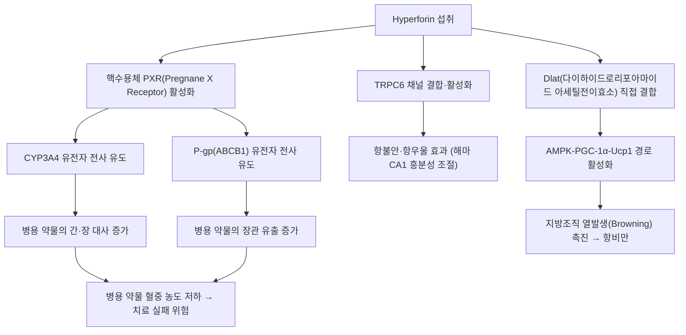

# hyperforin (하이퍼포린)

> **핵심 요약**: 세인트존스워트(St. John's wort)의 대표 활성·지표 성분(플로로글루시놀 유도체). 항우울 효과에 기여하는 동시에 **핵 수용체 PXR(pregnane X receptor)을 작용시켜 CYP3A4·P-gp를 강력하게 유도**하는 '유도성 지표 물질'이다. 세인트존스워트 제제의 약물상호작용 위험은 이 성분 함량·용량에 비례한다.

---

## 1. 기본 화학 정보 & 분자 구조식 (Chemical Identity)

> [!abstract]+ 🧪 3D 약리 분자 구조 (Interactive 3D Viewer)
> <iframe src="https://molecule-viewer-rho.vercel.app/?cid=441298" style="width: 100%; height: 600px; border: none; border-radius: 12px; box-shadow: 0 4px 20px rgba(0,0,0,0.15);" allowfullscreen></iframe>

🔬 **분자 구조** (Wikimedia Commons, Public Domain)

![[Hyperforin_구조.png|480]]
> [그림 1] Hyperforin(C₃₅H₅₂O₄) 분자 구조 — 출처: Wikimedia Commons

| 항목 | 내용 |
| :--- | :--- |
| **PubChem CID** | 441298 |
| **화학식 / 분자량** | C35H52O4 / 536.8 g/mol |
| **화학 골격 분류** | 아실플로로글루시놀(bicyclo[3.3.1]non-3-ene-2,9-dione 골격) |
| **제제별 함량 편차** | 표준화 여부에 따라 상호작용 위험 편차 큼 |

---

## 2. 주요 함유 본초 및 천연 기원 (Botanical Sources & Content)

| 함유 본초 | 기원 식물학적 명칭 | 주요 함유 부위 |
| :--- | :--- | :--- |
| [[세인트존스워트]] (성요한풀) | *Hypericum perforatum* | 지상부(개화기 수확) |

*(주: 세인트존스워트는 전통 한의학 본초가 아닌 서양 허브이며, 국내에서는 건강기능식품·수입 생약제제 형태로 유통됩니다.)*

---

## 3. 분자약리 표적 & 신호전달 네트워크 (Molecular Targets)

- **PXR-CYP3A4/P-gp 유도**: hyperforin은 핵수용체 PXR을 강력히 활성화하여 CYP3A4·P-gp(ABCB1)의 전사를 유도, 병용 약물의 대사·유출을 증가시켜 혈중 농도를 낮춥니다. 유도 효과는 용량·함량 의존적입니다.
- **TRPC6 채널을 통한 항우울 작용**: hyperforin의 항우울 작용은 TRPC6 채널 특이 결합 모티프 활성화에 의존하며, TRPC6 결손 마우스에서 불안·우울 표현형과 해마 CA1 흥분성 저하가 나타납니다. PXR을 활성화하지 않는 유사체 Hyp13이 TRPC6 의존 항불안·항우울 효과를 재현하여, 상호작용 없는 차세대 항우울제 설계의 분자적 기반이 되고 있습니다 (2022, *Molecular Psychiatry*, PMID 36224261).
- **Dlat 결합을 통한 대사 촉진**: LiP-SMap 및 도킹 연구로 Dlat(dihydrolipoamide S-acetyltransferase)이 hyperforin의 직접 분자 표적으로 규명되었으며, Dlat-AMPK-PGC-1α-Ucp1 경로로 지방조직 발열(browning)을 촉진해 비만을 억제하는 것으로 보고되어 있습니다 (2021, *Cell Metabolism*, PMID 33657393).

---

## 4. 생체 내 흡수·대사·생체이용률 (Pharmacokinetics: ADME)

- **흡수 및 분포**: 경구 투여된 hyperforin은 지용성이 높아 흡수되며, 뇌 조직 내 이행이 HPLC-MS/MS로 확인된 바 있습니다.
- **CYP3A4 자가 유도 특성**: 반복 투여 시 hyperforin 자신도 CYP 효소에 의해 대사되어, 장기 복용 시 유도 효과가 시간에 따라 변화할 수 있습니다.
- **용량-반응 관계 (인체 실측 데이터)**: 세인트존스워트 300/900/1800 mg/day(고함량 hyperforin 제제) 반복 투여 시, 경구 미다졸람(CYP3A4 기질) 청소율이 각각 1.96배, 3.86배, 5.62배 증가하는 용량-반응 관계가 확인되었으며, 이 증가는 주로 장관(intestinal) 수준의 CYP3A4/P-gp 유도에서 기인하는 것으로 분석되었습니다 (Hohmann et al. 2024).
- **저함량 제제의 경우**: hyperforin 함량이 낮게 표준화된 제제에서는 임상적으로 유의한 CYP3A 유도가 관찰되지 않았다는 연구도 있어, 유도 효과가 hyperforin 함량에 좌우됨을 뒷받침합니다.

---

## 5. 주요 질환별 약리 효능 & 분자 기전 (Therapeutic Efficacy)

- **경도~중등도 우울증**: 세로토닌·도파민·노르에피네프린 재흡수 억제 및 TRPC6 경로를 통한 항우울 효과가 다수 보고되어 있습니다.
- **비만·대사증후군(전임상)**: Dlat-AMPK-PGC-1α-Ucp1 경로를 통한 지방조직 갈변화(browning) 및 열발생 촉진 효과가 동물모델에서 보고되어, 향후 대사질환 치료 후보로 연구되고 있습니다.
- **항종양·항치매·항당뇨 활성**: 다면 약리 총설에서 항우울 외에도 이러한 활성과 추출·합성·제형 기술이 종합 정리된 바 있습니다 (2022, *Phytochemistry*, PMID 36442576).

---

## 6. 함유 본초 방제 시너지 & 약재 배오 매트릭스 (Herbal Synergies)

> [!warning] ⚠️ 템플릿 적용 상 주의
> 세인트존스워트는 전통 한의학 처방에 배합되는 본초가 아니라 서양에서 독립적으로 유통되는 건강기능식품·생약제제입니다. 따라서 한약 처방과의 "배오"는 존재하지 않으며, 이 절에서는 **한약재와의 병용 시 주의할 성분 조합**만을 다룹니다.

- CYP3A4로 대사되는 한약 성분(예: 일부 사포닌·알칼로이드류)과 세인트존스워트를 병용할 경우, hyperforin에 의한 CYP3A4 유도로 해당 한약 성분의 혈중 농도가 예상보다 낮아질 수 있다는 것이 이론적으로 우려되나, 개별 한약 성분과의 정량적 상호작용 데이터는 확인되지 않았습니다.

---

## 7. 양약 상호작용 & 약물동태학적 간섭 (Drug Interactions)

- **면역억제제(사이클로스포린, 타크로리무스)**: CYP3A4/P-gp 유도로 혈중 농도가 급격히 저하되어 장기이식 거부반응 사례가 보고된 대표적 상호작용입니다.
- **경구 피임제**: CYP3A4 유도로 인한 대사 증가와 돌파출혈·피임 실패 사례가 보고되어 있습니다.
- **항응고제(와파린, 리바록사반)**: 대사 증가로 인한 항응고 효과 저하가 보고되어 있습니다.
- **HIV 치료제(인디나비르 등 단백분해효소 억제제)**: CYP3A4 유도로 혈중 농도 저하 및 치료 실패 위험이 보고되어 있습니다.
- **경구 미다졸람 등 CYP3A4 기질 벤조디아제핀**: 앞서 §4에 기술한 것처럼 용량 의존적으로 청소율이 최대 5.62배까지 증가합니다 (Hohmann et al. 2024).
- 이러한 유도 효과는 hyperforin 함량이 낮게 표준화된 제제에서는 임상적으로 유의하지 않을 수 있어, 제제별 표준화 정보 확인이 중요합니다.

---

## 8. 💡 사용자 진료실 핵심 필기 & 임상 응용 팁 (Melt-In & High-Yield)

- '세인트존스워트/성요한풀' 복용력 청취 시 함량(hyperforin)까지 확인하는 습관을 들일 것 — 저함량 표준화 제제와 고함량 제제는 상호작용 위험이 크게 다릅니다.
- CYP3A4 기질 양약(면역억제제, 경구피임제, 항응고제 등)을 복용 중인 환자에게는 유도성 보충제 병용을 금지하거나 대체를 안내.
- 2026-09-03 심층리뷰에서 확인된 실측 데이터(SJW 300/900/1800mg → 미다졸람 청소율 1.96/3.86/5.62배 증가, Hohmann 2024)는 "용량이 늘수록 상호작용 위험도 비례해서 커진다"는 것을 환자에게 구체적 수치로 설명할 수 있는 좋은 근거임.

---

## 9. 출처 및 학술 참고 문헌 (References)

1. Hohmann N, Friedrichs AS, Burhenne J, Blank A, Mikus G, Haefeli WE. (2024). Dose-dependent induction of CYP3A activity by St. John's wort alone and in combination with rifampin. *Clinical and Translational Science*. [PubMed](https://pubmed.ncbi.nlm.nih.gov/39152679/)
2. (2022). Analysis of hyperforin (St. John's wort) action at TRPC6 channel leads to the development of a new class of antidepressant drugs. *Molecular Psychiatry*. [PubMed](https://pubmed.ncbi.nlm.nih.gov/36224261/)
3. (2021). The phytochemical hyperforin triggers thermogenesis in adipose tissue via a Dlat-AMPK signaling axis to curb obesity. *Cell Metabolism*. [PubMed](https://pubmed.ncbi.nlm.nih.gov/33657393/)
4. (2022). Hyperforin: A natural lead compound with multiple pharmacological activities. *Phytochemistry*. [PubMed](https://pubmed.ncbi.nlm.nih.gov/36442576/)
5. Madabushi R, Frank B, Drewelow B, Derendorf H, Butterweck V. (2006). Hyperforin in St. John's wort drug interactions. *European Journal of Clinical Pharmacology*. [PubMed](https://pubmed.ncbi.nlm.nih.gov/16477470/)
6. (2006). The extent of induction of CYP3A by St. John's wort varies among products and is linked to hyperforin dose. *European Journal of Clinical Pharmacology*. [PubMed](https://pubmed.ncbi.nlm.nih.gov/16341856/)

## 🔗 함께 보기
- [[세인트존스워트]] · [[CYP3A4]] · [[콜히친]]

<!-- 보관 태그(1회용·링크오류, 필요시 복원): 세인트존스워트, CYP유도 -->
