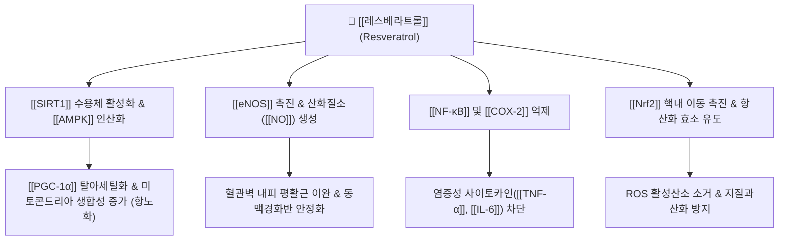

# 💊 [[레스베라트롤]] (Resveratrol, trans-3,5,4'-trihydroxystilbene)

> **핵심 요약 (Key Summary)**:
> 마디풀과 [[호장근]](*Reynoutria japonica*), 포도 껍질, 베리류에 고농도로 함유된 천연 폴리페놀 스틸벤계(Stilbene) 파이토알렉신.
> [[SIRT1]](Sirtuin 1) 및 [[AMPK]] 경로 활성화를 통한 미토콘드리아 생합성 촉진, [[eNOS]] 발현 유도로 혈관내피 이완, [[NF-κB]] 억제에 따른 항염증·항산화 및 세포 수명 연장.
> 한의학의 활혈거어(活血祛瘀), 청열해서, 이습퇴황 효능과 부합하여 심혈관 질환, 대사증후군, 당뇨병성 합병증, 만성 퇴행성 관절염 관리에 광범위하게 응용.
> ⚠️ 근거 수준: 마우스에서 AMPK·PGC-1α 활성 증가와 생존 개선이 보고되었으나(Baur 2006), "SIRT1 직접 알로스테릭 활성화"는 이 노트에서 확인하지 못했습니다. 경구 생체이용률이 매우 낮고(Walle 2004), 인체 임상 근거는 종설 수준으로 결과가 질환별로 다릅니다.

---

## 📌 목차
1. [기본 화학 정보 & 분자 구조식 (Chemical Identity)](#1-기본-화학-정보--분자-구조식-chemical-identity)
2. [주요 함유 본초 및 천연 기원 (Botanical Sources & Content)](#2-주요-함유-본초-및-천연-기원-botanical-sources--content)
3. [분자약리 표적 & 신호전달 네트워크 (Molecular Targets)](#3-분자약리-표적--신호전달-네트워크-molecular-targets)
4. [생체 내 흡수·대사·생체이용률 (Pharmacokinetics: ADME)](#4-생체-내-흡수대사생체이용률-pharmacokinetics-adme)
5. [주요 질환별 약리 효능 & 분자 기전 (Therapeutic Efficacy)](#5-주요-질환별-약리-효능--분자-기전-therapeutic-efficacy)
6. [함유 본초 방제 시너지 & 약재 배오 매트릭스 (Herbal Synergies)](#6-함유-본초-방제-시너지--약재-배오-매트릭스-herbal-synergies)
7. [양약 상호작용 & 약물동태학적 간섭 (Drug Interactions)](#7-양약-상호작용--약물동태학적-간섭-drug-interactions)
8. [💡 사용자 진료실 핵심 필기 & 임상 응용 팁 (Melt-In & High-Yield)](#8--사용자-진료실-핵심-필기--임상-응용-팁-melt-in--high-yield)
9. [출처 및 학술 참고 문헌 (References)](#9-출처-및-학술-참고-문헌-references)

---

## 1. 기본 화학 정보 & 분자 구조식 (Chemical Identity)

> [!abstract]+ 🧪 3D 약리 분자 구조 (Interactive 3D Viewer)
> <iframe src="https://molecule-viewer-rho.vercel.app/?cid=445154" width="100%" height="450px" frameborder="0" allow="webgl" style="border-radius: 8px;"></iframe>

| 항목 | 상세 내용 |
| :--- | :--- |
| **일반명 (Generic)** | [[레스베라트롤]] (Resveratrol) |
| **화학명 (IUPAC)** | 5-[(E)-2-(4-hydroxyphenyl)ethenyl]benzene-1,3-diol |
| **화학식 / 분자량** | $\text{C}_{14}\text{H}_{12}\text{O}_3$ / 228.24 g/mol |
| **PubChem CID / CAS** | [445154](https://pubchem.ncbi.nlm.nih.gov/compound/445154) / 501-36-0 (PubChem 확인) |
| **화학적 분류** | 비플라보노이드계 폴리페놀 / 스틸베노이드 (Stilbenoid) |
| **물리화학적 성상** | 백색~미황색 결정성 분말, 물에 난용성(지용성), 에탄올 및 DMSO에 가용, 광(빛) 노출 시 cis형으로 이성화 |

---

## 2. 주요 함유 본초 및 천연 기원 (Botanical Sources & Content)

| 함유 본초 / 기원 | 기원 식물학적 명칭 | 비고 |
| :--- | :--- | :--- |
| [[호장근]] (虎杖根) | *Reynoutria japonica* | 활혈정통, 청열이습, 해독소옹 |
| 포도 덩굴 및 과피 | *Vitis vinifera* | — |
| 땅콩 피막, 뽕나무 오디 | — | — |

* **대표 기원 본초**:
  * [[호장근]](虎杖根, *Reynoutria japonica*): 활혈정통, 청열이습, 해독소옹.
  * 호장근은 한의학에서 어혈과 담습을 동시에 치료하는 핵심 본초이며, 식물계에서 레스베라트롤 및 그 배당체인 폴리다틴(Polydatin) 함량이 가장 높은 약재임.

⚠️ 내용 검토 필요: 호장근 뿌리(*Polygonum cuspidatum*)에서 폴리다틴을 레스베라트롤로 전환·추출하는 연구(Wang 2019)와 레스베라트롤 강화 호장근 추출물 연구(Wang 2026)가 있으나, "식물계에서 함량이 가장 높다"는 서술은 이 노트에서 문헌으로 확인하지 못했습니다.

---

## 3. 분자약리 표적 & 신호전달 네트워크 (Molecular Targets)

* **SIRT1-AMPK 축 활성화를 통한 항노화 및 대사 개선**:
  * 탈아세틸화 효소인 [[SIRT1]]을 직접 알로스테릭 활성화하고 [[AMPK]]를 인산화하여, 미토콘드리아 전사조절인자인 [[PGC-1α]]를 활성화. 세포 내 에너지 대사를 개선하고 칼로리 제한(Calorie restriction) 유사 수명 연장 효과를 나타냄.
* **혈관 내피세포 보호 및 혈압·미세순환 조절**:
  * 내피세포 일산화질소합성효소([[eNOS]])의 발현 및 활성을 증가시켜 [[NO]] 방출을 유도, 혈관을 확장하고 혈소판 응집을 차단하여 동맥경화와 허혈성 뇌심장 질환을 예방.
* **항염증 및 전사인자 억제**:
  * IκB 키나아제(IKK) 활성을 억제하여 [[NF-κB]] 신호전달을 차단, [[COX-2]], [[iNOS]], [[TNF-α]] 생성을 억제하여 관절염 및 혈관 내막 염증을 경감.
* **항산화 및 미토콘드리아 자가포식(Autophagy) 유도**:
  * 활성산소(ROS)를 직접 소거할 뿐 아니라 [[Nrf2]]를 매개로 체내 항산화 효소(SOD, Catalase, GPx)의 합성을 촉진하고 손상된 미토콘드리아의 미토파지(Mitophagy)를 유도.

⚠️ 검증 메모: 고열량 식이를 섭취한 중년 마우스에서 레스베라트롤이 인슐린 감수성 증가, IGF-I 감소, **AMPK 및 PGC-1α 활성 증가**, 생존 개선 등 수명 연장과 관련된 변화를 일으킨다고 보고되었습니다(Baur 2006). 이 논문에서 서술된 Sir2 의존성은 효모·선충·초파리 등 하등생물의 수명 연장에 관한 것이며, 포유류에서 **SIRT1을 직접 알로스테릭 활성화**한다는 서술은 이 노트에서 확인하지 못했습니다(**내용 검토 필요**). eNOS·IKK·Nrf2·미토파지 기전도 이 노트에서 개별 논문으로 확인하지 못했습니다.

---

## 4. 생체 내 흡수·대사·생체이용률 (Pharmacokinetics: ADME)

* 레스베라트롤은 단독 섭취 시 간에서의 빠른 글루쿠론산 포합 대사(Phase II)로 경구 생체이용률이 낮습니다(원문).

⚠️ 검증 메모: 사람에서 경구 레스베라트롤의 **흡수는 높으나 생체이용률은 매우 낮다**고 보고되었습니다(Walle 2004). 랫드에서 경로에 따른 장 Phase II 대사와 장간순환이 생체이용률과 전신 분포에 영향을 준다는 보고(Han 2022)와, 사람 전립선 조직에서 [14C]-레스베라트롤의 분포·대사를 평가한 연구(Cai 2021)가 있습니다. 병용 플라보노이드(케르세틴, 피페린)의 대사 억제 효과는 §6에서 다룹니다.

---

## 5. 주요 질환별 약리 효능 & 분자 기전 (Therapeutic Efficacy)

* **심혈관 질환 및 동맥경화증 (French Paradox의 핵심)**:
  * 관상동맥 질환, 고지혈증, 동맥경직도 개선 및 혈소판 응집 방지.
* **제2형 당뇨병 및 인슐린 저항성 대사증후군**:
  * 근육 및 지방세포의 GLUT4 당수송체 발현 촉진, 간 내 포도당 생성 억제 및 인슐린 감수성 개선.
* **퇴행성 관절염 및 만성 염증성 질환**:
  * 관절 연골세포의 세포사멸 억제 및 활막 염증 완화.
* **인지기능 저하 및 신경퇴행성 질환 예방**:
  * 뇌혈류 개선 및 알츠하이머병 모델에서 베타-아밀로이드 침착 억제.

⚠️ 검증 메모: 레스베라트롤이 칼로리 제한을 모방하고 항염증·항산화 효과를 나타낸다는 in vitro·in vivo 근거는 풍부하나, 임상시험(암, 신경질환, 심혈관질환, 당뇨, NAFLD, 비만 등)이 그 잠재력을 확인해야 한다고 종설에 정리되어 있습니다(Berman 2017). 제2형 당뇨 환자에서 염증·산화 스트레스에 대한 무작위 이중맹검 시험(Zhu 2024)과 다양한 건강 결과에 대한 우산 종설(Sun 2026)도 있습니다. 위 GLUT4·연골세포·베타-아밀로이드 서술은 이 노트에서 직접 확인하지 못했습니다(**내용 검토 필요**). 종합 문헌은 레스베라트롤의 분자 표적, 약동학, 심혈관 보호 기전을 정리하고 있습니다(Weiskirchen 2016).

---

## 6. 함유 본초 방제 시너지 & 약재 배오 매트릭스 (Herbal Synergies)

* **본초 배합 특성**:
  * 레스베라트롤의 활혈 및 항염 작용은 호장근의 어혈성 관절통(비통), 황달, 타박상 및 암종(종괴) 치료 효능의 현대 분자약리학적 토대가 됨.
* **생체이용률과 파이토케미컬 시너지**:
  * 한약 복합 탕전 시 병용되는 플라보노이드(예: [[케르세틴]], 피페린)가 대사를 억제하여 생체이용률을 극대화함.

⚠️ 내용 검토 필요: 케르세틴·피페린 병용으로 레스베라트롤 생체이용률이 극대화된다는 서술은 이 노트에서 문헌으로 확인하지 못했습니다(PubMed 검색 결과는 폐암 조합 종설 등으로 직접 근거가 아니었음). 볼트 내 처방 노트에서 [[호장근]] 함유 처방의 구성은 별도 확인하지 않았습니다.

---

## 7. 양약 상호작용 & 약물동태학적 간섭 (Drug Interactions)

* **항응고제/항혈소판제 병용 주의**:
  * 아스피린, 클로피도그렐, 와파린 등과 병용 시 혈소판 응집 억제 시너지로 출혈 위험 증가 가능.
* **에스트로겐 수용체 조절(Phytoestrogen 특성)**:
  * 고용량 복용 시 약한 식물성 에스트로겐 작용을 나타낼 수 있으므로, 에스트로겐 민감성 유방암 또는 자궁내막증 환자는 주의.
* **소화기 가벼운 이상반응**:
  * 하루 1~2g 이상의 초고용량 복용 시 일시적 오심, 설사, 복통 등 위장관 불쾌감 발생 가능.

⚠️ 검증 메모: 레스베라트롤 유사체가 에스트로겐 신호경로의 선택적 조절제로 작용할 수 있다는 구조-활성 관계 종설이 있으나(Kobylka 2022), 인체에서의 에스트로겐 민감성 질환 위험은 확립되지 않았습니다. 항응고제·항혈소판제와의 병용 출혈 위험과 초고용량 위장관 증상은 PubMed에서 직접 확인하지 못했습니다(**내용 검토 필요**).

---

## 8. 💡 사용자 진료실 핵심 필기 & 임상 응용 팁 (Melt-In & High-Yield)

* 호장근의 활혈정통·청열이습(어혈성 관절통, 황달, 타박상)을 설명할 때 지표 성분으로 레스베라트롤과 폴리다틴을 연결.
* 경구 생체이용률이 매우 낮다는 점(Walle 2004)을 함께 설명하고, "SIRT1 직접 활성화" 같은 단정적 표현은 피하기.
* 항응고제·항혈소판제 복용 환자, 에스트로겐 민감성 질환 환자는 병용 시 주의 깊게 관찰.

---

## 9. 출처 및 학술 참고 문헌 (References)

1. **Baur JA, Pearson KJ, Price NL, et al. (2006)**. *Resveratrol improves health and survival of mice on a high-calorie diet*. **Nature**, 444(7117):337-342. PMID: [17086191](https://pubmed.ncbi.nlm.nih.gov/17086191/)
   - **[연구 요약]**: 고열량 식이 마우스에서 레스베라트롤이 인슐린 감수성 증가, IGF-I 감소, AMPK·PGC-1α 활성 증가와 함께 건강과 생존을 개선함을 보고.
2. **Weiskirchen S, Weiskirchen R (2016)**. *Resveratrol: How Much Wine Do You Have to Drink to Stay Healthy?* **Adv Nutr**, 7(4):706-718. PMID: [27422505](https://pubmed.ncbi.nlm.nih.gov/27422505/)
   - **[연구 요약]**: 레스베라트롤의 분자 표적, 약동학적 대사 특성 및 심혈관 보호 기전을 종합 정리한 종설.
3. **Berman AY, Motechin RA, Wiesenfeld MY, et al. (2017)**. *The therapeutic potential of resveratrol: a review of clinical trials*. **NPJ Precis Oncol**, 1:35. PMID: [28989978](https://pubmed.ncbi.nlm.nih.gov/28989978/) · DOI: [10.1038/s41698-017-0038-6](https://doi.org/10.1038/s41698-017-0038-6)
   - **[연구 요약]**: 레스베라트롤의 인체 임상시험 결과를 분석해 질환별 효능과 안전성 프로파일을 평가한 종설.
4. **Walle T, Hsieh F, DeLegge MH, et al. (2004)**. *High absorption but very low bioavailability of oral resveratrol in humans*. **Drug Metab Dispos**, 32(12):1377-1382. PMID: [15333514](https://pubmed.ncbi.nlm.nih.gov/15333514/)
   - **[연구 요약]**: 사람에서 경구 레스베라트롤의 흡수는 높으나 생체이용률은 매우 낮음을 보고.
5. **Han DG, Seo SW, Choi E, et al. (2022)**. *Impact of route-dependent phase-II gut metabolism and enterohepatic circulation on the bioavailability and systemic disposition of resveratrol in rats*. **Biomed Pharmacother**, 151:113141. PMID: [35609369](https://pubmed.ncbi.nlm.nih.gov/35609369/)
   - **[연구 요약]**: 랫드에서 Phase II 장 대사와 장간순환이 레스베라트롤 생체이용률에 미치는 영향을 평가.
6. **Kobylka P, Kucinska M, Kujawski J, et al. (2022)**. *Resveratrol Analogues as Selective Estrogen Signaling Pathway Modulators: Structure-Activity Relationship*. **Molecules**, 27(20):6973. PMID: [36296565](https://pubmed.ncbi.nlm.nih.gov/36296565/)
   - **[연구 요약]**: 레스베라트롤 유사체의 에스트로겐 신호경로 조절 구조-활성 관계를 정리.
7. **Wang C, Liu X, Zhang M, et al. (2019)**. *Efficient Enzyme-Assisted Extraction and Conversion of Polydatin to Resveratrol From Polygonum cuspidatum Using Thermostable Cellulase and Immobilized β-Glucosidase*. **Front Microbiol**, 10:445. PMID: [30972031](https://pubmed.ncbi.nlm.nih.gov/30972031/)
   - **[연구 요약]**: 호장근(*P. cuspidatum*)에서 폴리다틴을 레스베라트롤로 전환·추출하는 방법을 보고.
8. **Wang HL, Huang HP, Ranasinghe N, et al. (2026)**. *Resveratrol-Enriched Polygonum cuspidatum Extract Enhances Functional Bioactivity Against Non-Small Cell Lung Cancer Through Modulation of Inflammatory Signaling and Mitochondrial Apoptosis*. **Nutrients**, 18(12). PMID: [42356251](https://pubmed.ncbi.nlm.nih.gov/42356251/)
   - **[연구 요약]**: 레스베라트롤 강화 호장근 추출물의 비소세포폐암에 대한 기능적 생리활성을 보고.
9. **Cai H, Scott EN, Britton RG, et al. (2021)**. *Distribution and metabolism of [14C]-resveratrol in human prostate tissue after oral administration of a "dietary-achievable" or "pharmacological" dose: what are the implications for anticancer activity?*. **Am J Clin Nutr**, 113(5):1115-1125. PMID: [33675348](https://pubmed.ncbi.nlm.nih.gov/33675348/)
   - **[연구 요약]**: 사람 전립선 조직에서 [14C]-레스베라트롤의 분포·대사를 식이 가능 용량과 약리 용량으로 평가.
10. **Zhu P, Jin Y, Sun J, et al. (2024)**. *The efficacy of resveratrol supplementation on inflammation and oxidative stress in type-2 diabetes mellitus patients: randomized double-blind placebo meta-analysis*. **Front Endocrinol (Lausanne)**, 15:1463027. PMID: [39872318](https://pubmed.ncbi.nlm.nih.gov/39872318/)
   - **[연구 요약]**: 제2형 당뇨 환자에서 레스베라트롤이 염증·산화 스트레스에 미치는 효능을 무작위 이중맹검 시험으로 평가.
11. **Sun JN, Yang R, Fang L, et al. (2026)**. *Effects of resveratrol supplementation on multiple health outcomes: an umbrella review of systematic reviews and meta-analyses of randomized controlled trials*. **Nutr J**, 25(1). PMID: [41987155](https://pubmed.ncbi.nlm.nih.gov/41987155/)
   - **[연구 요약]**: 레스베라트롤 보충이 다양한 건강 결과에 미치는 영향을 무작위 대조시험 체계적 문헌고찰·메타분석의 우산 종설로 정리.

<!-- 보관 태그(1회용·링크오류, 필요시 복원): 항노화, SIRT1 -->
