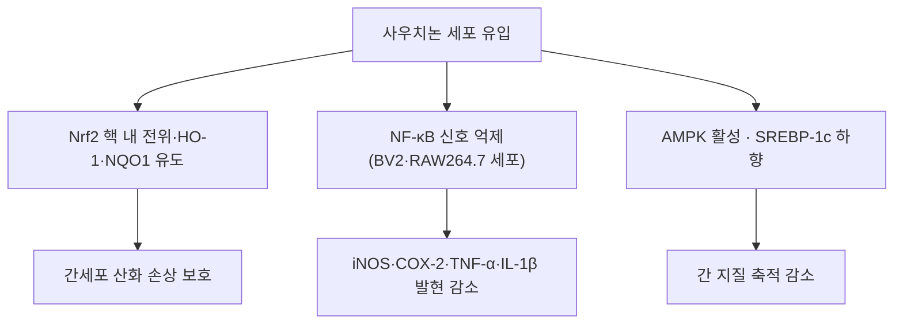

---
aliases:
  - Sauchinone
  - 사우치논
tags:
  - 약리
  - 약리성분
  - 리그난
  - 삼백초
  - 간보호
  - 항염증
title: 사우치논
date: 2026-09-21
출처: "https://molecule-viewer-rho.vercel.app/?cid=11725801\""
---

# 🔬 사우치논 (Sauchinone)

> **핵심 3줄 요약 (Key Summary)**:
> - 🌿 기원 본초 & 화학 계열: [[삼백초]](*Saururus chinensis*) 지상부 및 뿌리의 대표 생리활성 [[리그난]](Lignan) 계열 지표 성분. (⚠️ '지표 성분'이라는 규격·함량 근거는 확인하지 못했습니다. §2)
> - 🎯 핵심 분자 표적 & 조절 경로: [[Nrf2]]/HO-1 항산화 경로 활성화 및 [[NF-κB]], MAPK 신호 차단을 통한 강력한 간세포 보호(Hepatoprotective) 및 항염증 작용. (⚠️ 'MAPK 차단'은 BV2 세포에서 MAPK 인산화 변화가 없었다는 보고와 방향이 달라 미확정입니다. §3)
> - 🩺 주요 약리 활성 & 질환 치료 기전: 비알코올성 지방간(NAFLD), 급만성 간 손상, 염증성 질환 및 인지 기능 저하 억제 활성을 나타내는 유효 성분. (⚠️ 확인된 것은 세포·마우스 수준이며, 인지 기능 저하 억제는 근거를 찾지 못했습니다. §5)
> - ⚠️ 독성·생체이용률 한계 & 상호작용: 마우스 경구 생체이용률 7.76%(장·간 대사가 광범위, Kim 2015)이고, 시험관에서 CYP2B6·2C19·2E1·3A4와 UGT1A6·2B7을 억제하며 마우스 병용 시 일부 약물의 노출이 증가했습니다(Gong 2018; You 2018). 인체 자료는 확인하지 못했습니다. §4·§7

---

## 📌 목차
1. [기본 화학 정보 & 분자 구조식 (Chemical Identity)](#1-기본-화학-정보--분자-구조식-chemical-identity)
2. [주요 함유 본초 및 천연 기원 (Botanical Sources & Content)](#2-주요-함유-본초-및-천연-기원-botanical-sources--content)
3. [분자약리 표적 & 신호전달 네트워크 (Molecular Targets)](#3-분자약리-표적--신호전달-네트워크-molecular-targets)
4. [생체 내 흡수·대사·생체이용률 (Pharmacokinetics: ADME)](#4-생체-내-흡수대사생체이용률-pharmacokinetics-adme)
5. [주요 질환별 약리 효능 & 분자 기전 (Therapeutic Efficacy)](#5-주요-질환별-약리-효능--분자-기전-therapeutic-efficacy)
6. [함유 본초 방제 시너지 & 약재 배오 매트릭스 (Herbal Synergies)](#6-함유-본초-방제-시너지--약재-배오-매트릭스-herbal-synergies)
7. [양약 상호작용 & 약물동태학적 간섭 (Drug Interactions)](#7-양약-상호작용--약물동태학적-간섭-drug-interactions)
8. [💡 사용자 진료실 핵심 필기 & 임상 응용 팁 (Melt-In & High-Yield)](#8--사용자-진료실-핵심-필기--임상-응용-팁-melt-in--high-yield)
9. [출처 및 학술 참고 문헌 (References)](#9-출처-및-학술-참고-문헌-references)

---

## 1. 기본 화학 정보 & 분자 구조식 (Chemical Identity)

> [!abstract]+ 🧪 3D 약리 분자 구조 (Interactive 3D Viewer)
> <iframe src="https://molecule-viewer-rho.vercel.app/?cid=11725801" width="100%" height="450px" frameborder="0" allow="webgl" style="border-radius: 8px;"></iframe>

| 항목 | 상세 내용 |
| :--- | :--- |
| **IUPAC 명칭** | (1S,12R,13S,14R,16R,23R)-13,14-dimethyl-2,6,8,20,22-pentaoxahexacyclo[10.10.1.0^{1,19}.0^{3,11}.0^{5,9}.0^{16,23}]tricosa-3,5(9),10,18-tetraen-17-one (PubChem 등록명). ⚠️ 원문의 IUPAC 표기(octahydroisobenzofuran-5-one 계열)는 PubChem 등록 구조(6환 고리계)와 달라 PubChem 명칭으로 교체했습니다. |
| **분자식 / 분자량** | $C_{20}H_{20}O_{6}$ / 356.37 g/mol (원문 값; PubChem 등록 분자량 356.40) |
| **PubChem CID** | [11725801](https://pubchem.ncbi.nlm.nih.gov/compound/11725801) (등록명 sauchinone). ⚠️ 원문 3D 뷰어의 CID 10228은 PubChem에서 오스톨(Osthole)로 확인되어 정정했습니다. 입체 이성질체로 1'-epi-sauchinone(CID 10021151)과 sauchinone A(CID 9975530)가 별도 등록되어 있습니다. |
| **CAS 등록 번호** | 177931-17-8 (PubChem 동의어 항목 기준이며 CAS 원본 대조는 못함) |
| **기원 본초** | [[삼백초]](*Saururus chinensis* (Lour.) Baill.) |
| **화학적 분류** | Lignan (Sesquineolignan / Dihydrobenzofuran derivative). ⚠️ 내용 검토 필요 — 이 분류명은 확인하지 못했습니다. 2025년 종설(Bailly 2025)은 사우치논을 카르파논·폴레마논과 관련된 벤족산텐온(benzoxanthenone)계 다환 리그난으로 기술합니다. |
| **표준 물성** | 백색 침상 결정, 에탄올·클로로포름·DMSO 가용성. ⚠️ 내용 검토 필요 — 성상·용해도·LogP는 확인하지 못했습니다. |
| **식물 내 생합성 경로** | 원문에 기재 없음. 2025년 종설(Bailly 2025)이 생합성 경로를 다룬다고 초록에 명시돼 있으나 세부 내용은 확인하지 못했습니다. ⚠️ |

---

## 2. 주요 함유 본초 및 천연 기원 (Botanical Sources & Content)

| 함유 본초 (한글/한자) | 기원 식물학적 명칭 (과명 / 학명) | 주요 함유 약용 부위 | 지표 함량 (%) | 한의학적 귀경 및 약효 특성 |
| :--- | :--- | :--- | :--- | :--- |
| [[삼백초]] (三白草) | 삼백초과(Saururaceae) / *Saururus chinensis* (Lour.) Baill. | 지상부 및 뿌리 | 원문에 수치 기재 없음 (⚠️ 확인하지 못함) | 肺·膀胱·大腸經(볼트 삼백초 노트 기준) / 청열해독(淸熱解毒), 이수소종(利水消腫) |

* **핵심 함유 본초 (원문 §3)**
  * [[삼백초]]: 잎 3개가 하얗게 변하는 삼백초과 다년생 초본으로, 청열해독(淸熱解毒), 이수소종(利水消腫) 효능을 지니며 사우치논을 고농도로 함유함.
  * ⚠️ 내용 검토 필요: '고농도로 함유'를 뒷받침하는 정량 자료는 확인하지 못했습니다. 문헌상 사우치논은 삼백초의 지상부(Sung 2000)와 뿌리(Jeong 2010; Li 2011)에서 분리되었다고 기술됩니다.
* **한약재 규격상의 지표 함량**: ⚠️ 내용 검토 필요 — 대한민국약전·중국약전 등 규격에 사우치논 함량 기준이 있는지는 확인하지 못했습니다. 'sauchinone HPLC Saururus chinensis 정량' PubMed 검색에서 함량 분석 논문을 찾지 못했습니다.

---

## 3. 분자약리 표적 & 신호전달 네트워크 (Molecular Targets)

### ① Nrf2/ARE 경로 활성화 및 강력한 간세포 보호
* 사우치논은 Keap1의 반응성 시스테인 잔기를 수식하여 Keap1-Nrf2 결합을 해리시킴으로써 **Nrf2 전사인자의 핵 내 전위**를 유도합니다.
  * 근거: 아세트아미노펜(APAP) 간독성 마우스에서 사우치논이 간 손상을 줄였고 이 효과는 Nrf2 결핍 시 사라졌습니다. 간세포에서 Nrf2 핵 축적과 NQO1-ARE 리포터 활성이 늘었고 Nrf2 인산화가 증가하면서 Keap1과의 결합은 감소했습니다(Kay 2011).
  * ⚠️ 내용 검토 필요: 위 논문의 기전은 PKCδ–GSK3β를 거친 Nrf2 인산화이며, 'Keap1 반응성 시스테인 잔기 수식'은 초록에서 확인하지 못했습니다. 피부 섬유아세포에서 'Keap1-Nrf2 경로 활성화'를 보고한 2026년 논문(Zhang 2026)은 제목·초록 앞부분만 확인했습니다.
* 헴 산소화효소-1(**HO-1**), NQO1, 글루타치온 S-전이효소(GST) 등 항산화 해독 효소의 전사를 촉진하여 $CCl_4$, 아세트아미노펜, 알코올로 유발된 간세포 괴사와 사멸을 차단합니다.
  * 근거: HepG2 세포에서 HO-1 발현과 HO 활성이 농도·시간 의존적으로 늘고 Nrf2 핵 축적과 ARE 활성이 증가했으며, p38 MAPK 억제제가 이 효과를 줄였습니다(Jeong 2010). APAP 마우스에서 GCLM·NQO1·HSP32(HO-1)가 Nrf2 의존적으로 유도되었습니다(Kay 2011). $CCl_4$는 랫드 일차 간세포 배양에서 GPT 유출과 글루타치온·SOD·GPx 감소, 지질 과산화가 완화되었습니다(Sung 2000; 항산화 작용으로 해석되며 Nrf2는 검사하지 않았음).
  * ⚠️ 내용 검토 필요: GST 유도와 알코올 유발 간 손상에 대한 근거는 확인하지 못했습니다('sauchinone alcohol' PubMed 검색 0건).

### ② NF-$\kappa$B 및 MAPK 경로 억제를 통한 항염증 활성
* 대식세포 및 쿠퍼세포(Kupffer cell)에서 I$\kappa$B$\alpha$ 인산화와 분해를 억제하여 [[NF-κB]] 활성화를 차단합니다.
  * 근거: LPS로 자극한 BV2 미세아교세포에서 I-κB 인산화를 억제해 NF-κB 활성화를 막았습니다(Jang 2012). RAW264.7 대식세포에서는 LPS 유도 COX-2·iNOS 발현과 PGE2·NO 생성을 줄였고 이 효과의 일부는 ERK 경로를 통한 HO-1 발현으로 설명되었습니다(Li 2011).
  * ⚠️ 내용 검토 필요: 쿠퍼세포 대상 연구와 I$\kappa$B$\alpha$ '분해' 억제는 확인하지 못했습니다(확인된 것은 인산화 억제).
* p38 MAPK 및 JNK 활성을 저해하여 iNOS, COX-2, TNF-$\alpha$, IL-1$\beta$, IL-6 등 염증 매개 물질의 과발현을 억제합니다.
  * 근거: BV2 세포에서 COX-2·iNOS·TNF-α·IL-1β의 mRNA·단백질 발현이 감소했습니다(Jang 2012). dsRNA 자극 미세아교세포에서는 JNK–STAT1/3 신호 억제가 보고되었습니다(Lee 2009).
  * ⚠️ 내용 검토 필요: 같은 Jang 2012에서 사우치논은 LPS 유도 ERK1/2·p38·JNK 인산화에는 영향이 없었고 Akt 인산화만 억제했습니다. HepG2에서 HO-1 유도는 오히려 p38 MAPK를 필요로 했고(Jeong 2010), 간암 세포에서는 JNK/p38 활성화로 세포자멸사를 유도했습니다(Kim 2017). 따라서 'p38·JNK 저해'는 세포·자극 조건에 따라 방향이 달라 단정할 수 없습니다. IL-6 억제는 위 초록들에서 확인하지 못했습니다.

### ③ 지질 대사 조절 및 지방간(Steatosis) 억제
* 간세포 내 AMPK(AMP-activated protein kinase)를 인산화하여 지질 합성 전사인자인 SREBP-1c와 FAS의 발현을 하향 조절하고, 지방산 $\beta$-산화를 촉진하여 지방간 형성을 방지합니다.
  * 근거: 사우치논은 LXRα 작용제에 의한 SREBP-1c 활성화와 FAS·ACC·SCD-1 전사를 막았고, 고지방식이 마우스의 간 지방 축적과 SREBP-1c 유도를 줄였으며 고지방식이에 의한 AMPK 억제도 막았습니다(Kim 2010). 철 유발 산화 손상·간 손상에서도 AMPK 활성화 리그난으로 보고되었습니다(Kim 2009; 제목 기준 인용).
  * 추가 기전: 비만 마우스에서 SREBP-2를 거쳐 간 [[PCSK9]] 발현을 낮추고 LDLR을 늘려 혈중 LDL-C를 낮췄습니다(Chae 2018).
  * ⚠️ 내용 검토 필요: '지방산 β-산화 촉진'은 확인한 초록들에 나오지 않았습니다.

---

## 4. 생체 내 흡수·대사·생체이용률 (Pharmacokinetics: ADME)

* **장관 흡수 및 배출 펌프 (P-gp) 상호작용**:
  * 마우스에서 20 mg/kg 경구 투여 시 흡수율은 77.9%였으나 생체이용률(F)은 7.76%였고, 이는 간과 소장 S9 분획에서의 광범위한 대사 때문으로 해석되었습니다(Kim 2015). P-gp 기질 여부는 확인하지 못했습니다. ⚠️ 내용 검토 필요
* **장내 미생물총(Microbiome) 대사 전환**:
  * 사우치논 자체의 장내세균 대사·장간순환 문헌은 확인하지 못했습니다. ⚠️ 내용 검토 필요 (참고: DSS 대장염 마우스에서 사우치논이 장내 미생물 조성을 바꾼다는 보고가 있으나 대사가 아닌 약효 연구입니다; Wu 2022.)
* **간 대사 및 소실 반감기**:
  * 마우스 정맥 7.5~20 mg/kg, 경구 20~500 mg/kg에서 선형 약동학이었으나 정맥 50 mg/kg에서는 대사가 포화되어 비선형이었습니다. 산화·이산화·메틸화·탈메틸화·탈수소화·비스글루쿠론산 포합 대사체가 혈장과 간·장·신장 S9 분획에서 확인되었고, 조직/혈장 비가 1을 넘는 조직은 간·소장·신장·폐·근육·지방 등이었습니다(Kim 2015).
  * 랫드 혈장 LC-MS 정량법이 개발되어 있으나(Xu 2012) 약동학 수치는 확인하지 못했습니다. 인체 약동학과 소실 반감기는 확인하지 못했습니다. ⚠️ 내용 검토 필요

---

## 5. 주요 질환별 약리 효능 & 분자 기전 (Therapeutic Efficacy)

### 1) 간질환 (원문 §4)
* **간기능 개선 및 간질환 치료**: 급·만성 바이러스성 간염, 알코올성 및 비알코올성 지방간질환(NAFLD)의 간염증 완화.
  * 확인된 근거: 고지방식이 마우스의 지방간(Kim 2010), APAP 유발 급성 간 손상 마우스(Kay 2011), $CCl_4$ 유발 간섬유화 마우스에서 [[TGF-β]]/Smad 신호를 억제하고 간성상세포 활성화를 줄임(Lee 2014), 랫드 일차 간세포의 $CCl_4$ 독성(Sung 2000). 모두 세포·마우스 수준입니다.
  * ⚠️ 내용 검토 필요: 바이러스성 간염('sauchinone hepatitis B virus' 0건)과 알코올성 간질환은 근거를 찾지 못했고, 인체 임상 시험도 확인하지 못했습니다. [[지방간]] 관련 서술은 마우스 근거로만 해석해야 합니다.

### 2) 항염·해독 (원문 §4)
* **항염 및 해독**: 골반염, 방광염, 비뇨생식기계 염증 및 부종 개선.
  * ⚠️ 내용 검토 필요: 골반염·[[방광염]]·비뇨생식기 염증에 대한 사우치논 근거는 확인하지 못했습니다('sauchinone bladder cystitis' 0건). 확인된 항염 연구는 DSS 대장염 마우스(Wu 2022), IL-1β 자극 연골세포(Wu D 2018), 대식세포·미세아교세포의 염증 매개물질 감소(Li 2011; Jang 2012)입니다.

### 3) 신경세포 보호 (원문 §4)
* **신경세포 보호**: 미세아교세포(Microglia)의 신경염증 반응을 억제하여 퇴행성 뇌신경 손상 완화.
  * 확인된 근거: LPS 자극 BV2 미세아교세포에서 NO·PGE2와 염증 유전자 발현 감소(Jang 2012), dsRNA 자극 미세아교세포에서 iNOS 발현 억제(Lee 2009). 'ent-Sauchinone'이라는 명칭으로 별성상세포·BV-2 세포에서 STAT3 매개 NF-κB 활성화와 아밀로이드 생성 억제를 보고한 논문이 있습니다(Song 2014).
  * ⚠️ 내용 검토 필요: 위는 모두 세포 실험이며, 동물 수준의 신경퇴행성 질환·인지 기능 개선 근거는 확인하지 못했습니다('sauchinone Alzheimer cognitive memory' 0건). Song 2014의 ent-sauchinone이 사우치논과 같은 물질인지도 확인하지 못했습니다.

---

## 6. 함유 본초 방제 시너지 & 약재 배오 매트릭스 (Herbal Synergies)

| 함유 본초 / 방제 | 공존 유효 성분군 | 분자약리 시너지 기전 | 전통 한의학적 효능 연계 |
| :--- | :--- | :--- | :--- |
| [[삼백초]] | 만자니틴·사우세르네올 등 리그난 유도체, 케르세틴 등 플라보노이드(볼트 삼백초 노트 기준) | ⚠️ 내용 검토 필요 — 사우치논과 공존 성분 간 시너지 문헌 미확인 | 청열해독, 이수소종 |
| [[인진호탕]] | [[인진호]], [[치자]], [[대황]] (볼트 처방 노트에서 구성 확인) | ⚠️ 내용 검토 필요 — 이 처방에는 삼백초가 들어 있지 않으며, 사우치논과의 시너지 근거는 없습니다 | 청열이습, 이담퇴황 (황달) |

* **임상 응용 및 방제 연계 (원문 §3)**
  * 만성 간염, 간경변 초기, 간기능 수치(AST/ALT) 상승 환자의 간세포 보호 처방에 삼백초 단미 또는 가미방으로 다용.
  * 황달 및 간담습열(肝膽濕熱) 병증 시 [[인진호]], [[치자]] 등과 배합하여 간염 완화 시너지 발휘.
  * ⚠️ 내용 검토 필요: 위 임상 응용과 '시너지'는 사우치논 단독 근거가 없으며, 볼트 처방 노트에서 삼백초를 구성에 포함한 처방은 확인되지 않았습니다.

---

## 7. 양약 상호작용 & 약물동태학적 간섭 (Drug Interactions)

* **CYP450 효소 간섭**:
  * 사람 간 마이크로좀에서 사우치논은 CYP2B6·2C19·2E1·3A4를 비경쟁적으로 가역 억제했고(Ki 각각 14.3·16.8·41.7·6.84 μM), CYP2B6·2E1·3A4는 시간 의존적으로도 억제했습니다. 마우스에 시부트라민·[[클로피도그렐]]·[[클로르족사존]]을 병용하면 각 약물의 전신 노출이 사우치논 없이 투여했을 때보다 증가했습니다(Gong 2018). [[CYP3A4]] 대사 약물과의 병용 시 주의가 필요할 수 있습니다.
* **UGT 효소 간섭**:
  * UGT1A1·1A3·1A6·2B7 활성을 억제했고(IC50 8.83·43.9·0.758·0.279 μM), UGT1A6·2B7은 비경쟁적으로 억제했습니다(Ki 1.08·0.524 μM). 마우스에서 UGT2B7 매개 지도부딘 대사를 억제해 병용 시 지도부딘 노출이 증가했습니다(You 2018).
  * ⚠️ 내용 검토 필요: 위 자료는 정제 사우치논의 시험관·마우스 결과이며, 삼백초 전탕액을 복용했을 때의 실제 사우치논 노출과 인체 상호작용은 확인하지 못했습니다.
* **유사 기전 양약 병용 시 고려사항**: 간 보호제·혈당강하제·지질강하제와의 병용 안전성 문헌은 확인하지 못했습니다. ⚠️ 내용 검토 필요 ('sauchinone toxicity safety' PubMed 검색 0건으로 독성 자료도 확인하지 못했습니다.)

---

## 8. 💡 사용자 진료실 핵심 필기 & 임상 응용 팁 (Melt-In & High-Yield)

* **사용자 원문 필기 (100% 융합 및 보존)**:
  * 기존 노트에 원장님의 수기 필기는 없었습니다. (추후 필기가 생기면 이곳에 원문 그대로 추가)
* **진료실 실전 처방 & 생체이용률 극대화 팁**:
  1. 사우치논의 간 보호·항염 근거는 정제 성분의 세포·마우스 자료이며 마우스 경구 생체이용률이 7.76%로 낮아(§4), 삼백초 전탕 처방의 간질환 효과로 그대로 옮기지 않도록 주의합니다.
  2. 체질별·병증별 적용은 원문·문헌에서 확인되지 않아 기재하지 않습니다. ⚠️ 내용 검토 필요

---

## 9. 출처 및 학술 참고 문헌 (References)

1. **Kay HY et al. (2011)**. *Nrf2-mediated liver protection by sauchinone, an antioxidant lignan, from acetaminophen toxicity through the PKCδ-GSK3β pathway*. **Br J Pharmacol**, 163(8):1653-1665. PMID: [21039417](https://pubmed.ncbi.nlm.nih.gov/21039417/) · DOI: [10.1111/j.1476-5381.2010.01095.x](https://doi.org/10.1111/j.1476-5381.2010.01095.x)
   - **[연구 요약]**: APAP 간독성 마우스에서 사우치논이 Nrf2 의존적으로 간 손상을 줄였고, 간세포에서 Nrf2 핵 축적·Nrf2 인산화 증가와 Keap1 결합 감소, PKCδ 활성화를 확인.
2. **Kim YW et al. (2010)**. *Inhibition of SREBP-1c-mediated hepatic steatosis and oxidative stress by sauchinone, an AMPK-activating lignan in Saururus chinensis*. **Free Radic Biol Med**, 48(4):567-578. PMID: [20005944](https://pubmed.ncbi.nlm.nih.gov/20005944/) · DOI: [10.1016/j.freeradbiomed.2009.12.006](https://doi.org/10.1016/j.freeradbiomed.2009.12.006)
   - **[연구 요약]**: LXRα 작용제에 의한 SREBP-1c 및 지질합성 유전자 활성화를 억제하고, 고지방식이 마우스의 지방간·산화 스트레스·AMPK 억제를 완화.
3. **Kim YW et al. (2009)**. *Efficacy of sauchinone as a novel AMPK-activating lignan for preventing iron-induced oxidative stress and liver injury*. **Free Radic Biol Med**, 47(7):1082-1092. PMID: [19616619](https://pubmed.ncbi.nlm.nih.gov/19616619/) · DOI: [10.1016/j.freeradbiomed.2009.07.018](https://doi.org/10.1016/j.freeradbiomed.2009.07.018)
   - **[연구 요약]**: 제목 기준 인용(초록은 읽지 않음). AMPK 활성화 리그난으로서의 철 유발 산화 손상·간 손상 예방 효과.
4. **Jeong GS et al. (2010)**. *Protective effect of sauchinone by upregulating heme oxygenase-1 via the P38 MAPK and Nrf2/ARE pathways in HepG2 cells*. **Planta Med**, 76(1):41-47. PMID: [19591088](https://pubmed.ncbi.nlm.nih.gov/19591088/) · DOI: [10.1055/s-0029-1185906](https://doi.org/10.1055/s-0029-1185906)
   - **[연구 요약]**: HepG2에서 HO-1 발현·활성 증가, Nrf2 핵 축적·ARE 활성 증가, p38 MAPK 억제제로 효과 감소.
5. **Li B et al. (2011)**. *Sauchinone suppresses pro-inflammatory mediators by inducing heme oxygenase-1 in RAW264.7 macrophages*. **Biol Pharm Bull**, 34(10):1566-1571. PMID: [21963496](https://pubmed.ncbi.nlm.nih.gov/21963496/) · DOI: [10.1248/bpb.34.1566](https://doi.org/10.1248/bpb.34.1566)
   - **[연구 요약]**: LPS 자극 대식세포에서 COX-2·iNOS와 PGE2·NO·TNF-α·IL-1β 생성을 줄이고, 이 효과가 ERK 경로를 통한 HO-1 유도와 관련됨.
6. **Sung SH et al. (2000)**. *Sauchinone, a lignan from Saururus chinensis, attenuates CCl4-induced toxicity in primary cultures of rat hepatocytes*. **Biol Pharm Bull**, 23(5):666-668. PMID: [10823687](https://pubmed.ncbi.nlm.nih.gov/10823687/) · DOI: [10.1248/bpb.23.666](https://doi.org/10.1248/bpb.23.666)
   - **[연구 요약]**: 삼백초 지상부에서 분리한 사우치논이 랫드 간세포 $CCl_4$ 독성에서 GPT 유출·글루타치온 등 항산화 지표 감소·지질 과산화를 완화(항산화 작용).
7. **Lee JH et al. (2014)**. *Sauchinone attenuates liver fibrosis and hepatic stellate cell activation through TGF-β/Smad signaling pathway*. **Chem Biol Interact**, 224:58-67. PMID: [25451574](https://pubmed.ncbi.nlm.nih.gov/25451574/) · DOI: [10.1016/j.cbi.2014.10.005](https://doi.org/10.1016/j.cbi.2014.10.005)
   - **[연구 요약]**: $CCl_4$ 간섬유화 마우스에서 섬유화를 억제하고, LX-2 세포에서 TGF-β1 유도 Smad2/3 인산화를 차단.
8. **Chae HS et al. (2018)**. *Sauchinone controls hepatic cholesterol homeostasis by the negative regulation of PCSK9 transcriptional network*. **Sci Rep**, 8(1):6737. PMID: [29712938](https://pubmed.ncbi.nlm.nih.gov/29712938/) · DOI: [10.1038/s41598-018-24935-6](https://doi.org/10.1038/s41598-018-24935-6)
   - **[연구 요약]**: HepG2에서 SREBP-2를 통해 PCSK9를 낮추고 LDLR을 늘려 LDL-C 흡수를 증가시키며, 비만 마우스에서 혈중 LDL-C를 낮춤.
9. **Jang EY et al. (2012)**. *Sauchinone suppresses lipopolysaccharide-induced inflammatory responses through Akt signaling in BV2 cells*. **Int Immunopharmacol**, 14(2):188-194. PMID: [22824073](https://pubmed.ncbi.nlm.nih.gov/22824073/) · DOI: [10.1016/j.intimp.2012.07.002](https://doi.org/10.1016/j.intimp.2012.07.002)
   - **[연구 요약]**: BV2 미세아교세포에서 NO·PGE2와 COX-2·iNOS·TNF-α·IL-1β 발현을 낮추고 I-κB 인산화를 통한 NF-κB 활성화를 억제. LPS 유도 MAPK 인산화에는 영향이 없고 Akt 인산화만 억제.
10. **Lee CS et al. (2009)**. *Inhibition of double-stranded RNA-induced inducible nitric oxide synthase expression by fraxinellone and sauchinone in murine microglia*. **Biol Pharm Bull**, 32(11):1870-1874. PMID: [19881300](https://pubmed.ncbi.nlm.nih.gov/19881300/) · DOI: [10.1248/bpb.32.1870](https://doi.org/10.1248/bpb.32.1870)
    - **[연구 요약]**: dsRNA 자극 미세아교세포에서 iNOS 발현을 억제하고 JNK–STAT1/3 신호 활성화를 차단.
11. **Song SY et al. (2014)**. *Inhibitory effect of ent-Sauchinone on amyloidogenesis via inhibition of STAT3-mediated NF-κB activation in cultured astrocytes and microglial BV-2 cells*. **J Neuroinflammation**, 11:118. PMID: [24985096](https://pubmed.ncbi.nlm.nih.gov/24985096/) · DOI: [10.1186/1742-2094-11-118](https://doi.org/10.1186/1742-2094-11-118)
    - **[연구 요약]**: ent-Sauchinone이 배양 별세포·BV-2 세포에서 신경염증과 β-아밀로이드 생성을 STAT3·NF-κB 경로로 억제(세포 실험; ent-sauchinone과 사우치논의 동일성은 미확인).
12. **Kim YJ et al. (2015)**. *Pharmacokinetics, tissue distribution, and tentative metabolite identification of sauchinone in mice by microsampling and HPLC-MS/MS methods*. **Biol Pharm Bull**, 38(2):218-227. PMID: [25747980](https://pubmed.ncbi.nlm.nih.gov/25747980/) · DOI: [10.1248/bpb.b14-00524](https://doi.org/10.1248/bpb.b14-00524)
    - **[연구 요약]**: 마우스 약동학(경구 F 7.76%, 흡수 77.9%), 광범위한 간·장 대사, 대사체와 조직 분포.
13. **Gong EC et al. (2018)**. *Enzyme Kinetics and Molecular Docking Studies on Cytochrome 2B6, 2C19, 2E1, and 3A4 Activities by Sauchinone*. **Molecules**, 23(3):555. PMID: [29498658](https://pubmed.ncbi.nlm.nih.gov/29498658/) · DOI: [10.3390/molecules23030555](https://doi.org/10.3390/molecules23030555)
    - **[연구 요약]**: 사람 간 마이크로좀에서 CYP2B6·2C19·2E1·3A4 억제(Ki 6.84~41.7 μM), 마우스 병용 시 시부트라민·클로피도그렐·클로르족사존 노출 증가.
14. **You BH et al. (2018)**. *Inhibitory Effect of Sauchinone on UDP-Glucuronosyltransferase (UGT) 2B7 Activity*. **Molecules**, 23(2):366. PMID: [29425147](https://pubmed.ncbi.nlm.nih.gov/29425147/) · DOI: [10.3390/molecules23020366](https://doi.org/10.3390/molecules23020366)
    - **[연구 요약]**: UGT1A1·1A3·1A6·2B7 억제(IC50 0.279~43.9 μM), 마우스에서 지도부딘 노출 증가.
15. **Xu CL et al. (2012)**. *Quantitative determination of sauchinone in rat plasma by liquid chromatography-mass spectrometry*. **Biomed Chromatogr**, 26(10):1210-1214. PMID: [22222773](https://pubmed.ncbi.nlm.nih.gov/22222773/) · DOI: [10.1002/bmc.2681](https://doi.org/10.1002/bmc.2681)
    - **[연구 요약]**: 랫드 혈장 중 사우치논 LC-MS 정량법(정량하한 0.01 μg/mL). 분석법 논문.
16. **Wu K et al. (2022)**. *Sauchinone alleviates dextran sulfate sodium-induced ulcerative colitis via NAD(P)H dehydrogenase [quinone] 1/NF-kB pathway and gut microbiota*. **Front Microbiol**, 13:1084257. PMID: [36699607](https://pubmed.ncbi.nlm.nih.gov/36699607/) · DOI: [10.3389/fmicb.2022.1084257](https://doi.org/10.3389/fmicb.2022.1084257)
    - **[연구 요약]**: DSS 대장염 마우스에서 염증·점막 장벽 손상을 줄이고 NQO1 상향으로 NF-κB를 억제, 장내 미생물 조성을 조절.
17. **Wu D et al. (2018)**. *Sauchinone inhibits IL-1β induced catabolism and hypertrophy in mouse chondrocytes to attenuate osteoarthritis via Nrf2/HO-1 and NF-κB pathways*. **Int Immunopharmacol**, 62:181-190. PMID: [30015238](https://pubmed.ncbi.nlm.nih.gov/30015238/) · DOI: [10.1016/j.intimp.2018.06.041](https://doi.org/10.1016/j.intimp.2018.06.041)
    - **[연구 요약]**: 제목 기준 인용(초록은 읽지 않음). 마우스 연골세포의 IL-1β 유도 이화·비대를 Nrf2/HO-1·NF-κB 경로로 억제.
18. **Kim YW et al. (2017)**. *Sauchinone exerts anticancer effects by targeting AMPK signaling in hepatocellular carcinoma cells*. **Chem Biol Interact**, 261:108-117. PMID: [27871897](https://pubmed.ncbi.nlm.nih.gov/27871897/) · DOI: [10.1016/j.cbi.2016.11.016](https://doi.org/10.1016/j.cbi.2016.11.016)
    - **[연구 요약]**: 간암 세포 증식 억제, JNK/p38 활성화를 통한 세포자멸사 유도, AMPK 경로 활성화.
19. **Bailly C (2025)**. *Benzoxanthenone Lignans Related to Carpanone, Polemanone, and Sauchinone: Natural Origin, Chemical Syntheses, and Pharmacological Properties*. **Molecules**, 30(8):1696. PMID: [40333626](https://pubmed.ncbi.nlm.nih.gov/40333626/) · DOI: [10.3390/molecules30081696](https://doi.org/10.3390/molecules30081696)
    - **[연구 요약]**: 사우치논 관련 벤족산텐온계 리그난의 분리·생합성·합성과 약리(염증 매개물질 차단, 항산화, 간·신장·관절·장 염증, 항암)를 개관한 종설(초록 기준).
20. **Zhang X et al. (2026)**. *Sauchinone attenuates UVB-induced photoaging by suppressing oxidative stress and ferroptosis through activation of the Keap1-Nrf2 pathway in dermal fibroblasts*. **Pharm Biol**, 64(1):764-782. PMID: [42165632](https://pubmed.ncbi.nlm.nih.gov/42165632/) · DOI: [10.1080/13880209.2026.2668138](https://doi.org/10.1080/13880209.2026.2668138)
    - **[연구 요약]**: UVB 유도 섬유아세포 광노화에서 산화 스트레스와 페롭토시스를 줄이고 Keap1-Nrf2 경로 활성화를 제시(초록 앞부분 기준).

* ⚠️ **삭제한 원문 인용**: 원문의 'Min SW et al. (2009) *Chem Biol Interact* 182(2-3):195-201'(사염화탄소 유도 마우스 간 손상, Nrf2 활성화·NF-κB 억제)와 'Song NY et al. (2012) *Biochem Biophys Res Commun* 424(3):565-570'(HepG2 AMPK 인산화 지질 축적 억제)은 PubMed에서 저자·제목·저널 검색으로 확인되지 않아 삭제했습니다. 대신 위 실측 논문(Kay 2011, Kim 2010, Lee 2014 등)으로 대체했습니다.
* 데이터베이스 확인 항목: PubChem Compound [11725801](https://pubchem.ncbi.nlm.nih.gov/compound/11725801) (sauchinone), [10021151](https://pubchem.ncbi.nlm.nih.gov/compound/10021151) (1'-epi-sauchinone), [9975530](https://pubchem.ncbi.nlm.nih.gov/compound/9975530) (sauchinone A), [10228](https://pubchem.ncbi.nlm.nih.gov/compound/10228) (오스톨, 원문 뷰어의 오류 CID).
