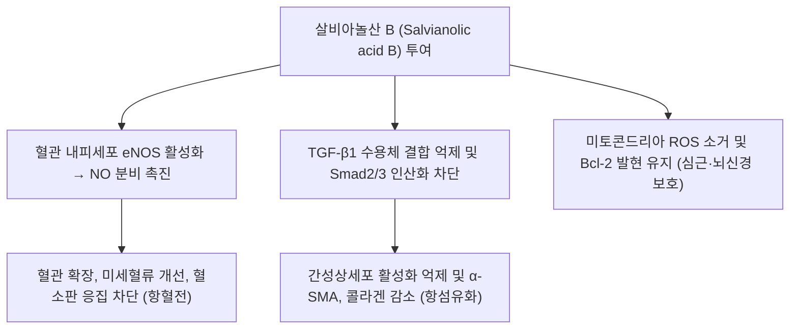

# 🔬 살비아놀산 B (Salvianolic Acid B)

> **핵심 3줄 요약 (Key Summary)**:
> - 🌿 기원 본초 & 화학 계열: 한약재 [[단삼]](Salvia miltiorrhiza)의 뿌리에서 추출되는 가장 대표적인 수용성 폴리페놀성 탄산(Lithospermic acid B) 유도체. (⚠️ PubChem에서 살비아놀산 B(CID 6451084)는 Lithospermic acid B와 같은 레코드의 동의어로 등록되어 있습니다. §1)
> - 🎯 핵심 분자 표적 & 조절 경로: 강력한 활성산소(ROS) 소거능과 함께 혈관 내피세포 eNOS 활성화를 통한 산화질소([[NO]]) 생성 촉진, 혈소판 응집 억제 및 항혈전 작용. (⚠️ 혈소판 쪽은 트롬빈 촉매부위 직접 결합과 P2Y12 경로가 보고되었습니다. §3)
> - 🩺 주요 약리 활성 & 질환 치료 기전: [[TGF-β]]1/Smad 신호전달계를 직접 차단하여 간성상세포 활성화와 세포외 기질 축적을 막는 최고의 천연 항섬유화(Anti-fibrotic) 활성 성분. (⚠️ '직접 차단'·'최고'는 문헌으로 확인하지 못했고, 확인된 것은 TβR-I 키나아제 활성 저하·Smad3 핵 이동 억제, PDGFRβ 결합입니다. §3)
> - ⚠️ 독성·생체이용률 한계 & 상호작용: 랫드 경구 생체이용률이 3.90%로 매우 낮고(Zhou 2009), 살비아놀산 B 함유 제제(salvianolate)가 인체 간 마이크로좀에서 CYP3A4를 억제했으며(시험관), 랫드에서는 로사르탄 대사를 촉진하는 결과도 있어 방향이 일치하지 않습니다. (§4·§7)

---

## 📌 목차
1. [기본 화학 정보 & 분자 구조식 (Chemical Identity)](#1-기본-화학-정보--분자-구조식-chemical-identity)
2. [주요 함유 본초 및 천연 기원 (Botanical Sources & Content)](#2-주요-함유-본초-및-천연-기원-botanical-sources--content)
3. [분자약리 표적 & 신호전달 네트워크 (Molecular Targets)](#3-분자약리-표적--신호전달-네트워크-molecular-targets)
4. [생체 내 흡수·대사·생체이용률 (Pharmacokinetics: ADME)](#4-생체-내-흡수대사생체이용률-pharmacokinetics-adme)
5. [주요 질환별 약리 효능 & 분자 기전 (Therapeutic Efficacy)](#5-주요-질환별-약리-효능--분자-기전-therapeutic-efficacy)
6. [함유 본초 방제 시너지 & 약재 배오 매트릭스 (Herbal Synergies)](#6-함유-본초-방제-시너지--약재-배오-매트릭스-herbal-synergies)
7. [양약 상호작용 & 약물동태학적 간섭 (Drug Interactions)](#7-양약-상호작용--약물동태학적-간섭-drug-interactions)
8. [💡 사용자 진료실 핵심 필기 & 임상 응용 팁 (Melt-In & High-Yield)](#8--사용자-진료실-핵심-필기--임상-응용-팁-melt-in--high-yield)
9. [출처 및 학술 참고 문헌 (References)](#9-출처-및-학술-참고-문헌-references)

---

## 1. 기본 화학 정보 & 분자 구조식 (Chemical Identity)

> [!abstract]+ 🧪 3D 약리 분자 구조 (Interactive 3D Viewer)
> <iframe src="https://molecule-viewer-rho.vercel.app/?cid=6451084" width="100%" height="450px" frameborder="0" allow="webgl" style="border-radius: 8px;"></iframe>

| 항목 | 상세 내용 |
| :--- | :--- |
| **IUPAC 명칭** | (2R)-2-[(E)-3-[(2S,3S)-3-[(1R)-1-carboxy-2-(3,4-dihydroxyphenyl)ethoxy]carbonyl-2-(3,4-dihydroxyphenyl)-7-hydroxy-2,3-dihydro-1-benzofuran-4-yl]prop-2-enoyl]oxy-3-(3,4-dihydroxyphenyl)propanoic acid (PubChem 등록명) |
| **분자식 / 분자량** | $C_{36}H_{30}O_{16}$ / 718.62 g/mol (PubChem 718.6) |
| **PubChem CID** | [6451084](https://pubchem.ncbi.nlm.nih.gov/compound/6451084) (동의어: Salvianolic acid B, Lithospermic acid B, Danfensuan B, Dan Shen Suan B, Monardic acid B) |
| **CAS 등록 번호** | 121521-90-2 — PubChem 동의어 항목 기준이며 CAS 원본 대조는 못함. ⚠️ 내용 검토 필요 |
| **화학 골격 분류** | 페놀산(폴리페놀성 다중 페놀산) — PubChem 명칭상 2,3-다이하이드로벤조퓨란 골격에 다이하이드록시페닐젖산형 에스터 단위가 결합한 구조 |
| **물리화학적 성상** | 수용성(원문: '대표 수용성 유효 지표 성분'). 수용해도·LogP·열/빛 안정성·맛은 확인하지 못함 ⚠️ 내용 검토 필요. 장 투과도는 매우 낮음(Zhou 2009; §4) |
| **식물 내 생합성 경로** | 원문에 기재 없음. 문헌으로 확인하지 못함 ⚠️ 내용 검토 필요 |

* **원문 IUPAC 명칭 (보존, ⚠️ 정정 필요)**: (2R)-3-(3,4-dihydroxyphenyl)-2-[[(E)-3-[2-[(E)-2-(3,4-dihydroxyphenyl)ethenyl]-3,4-dihydroxyphenyl]prop-2-enoyl]oxy]propanoic acid — 이 명칭이 기술하는 골격은 탄소 26개(방향환 3개)로 세어져 위 분자식 C36H30O16과 맞지 않아, 위 표에는 PubChem 등록명을 넣었습니다.
* **3D 뷰어 CID 정정 ⚠️**: 원문 뷰어의 CID 164676은 PubChem에서 C19H18O3(탄신논 IIA)로 확인되어 6451084로 바꿨습니다. 탄신논 IIA는 [[탄신논 IIA]] 노트를 참고하세요.
* **화학식 (Molecular Formula)**: $C_{36}H_{30}O_{16}$
* **분자량 (Molecular Weight)**: 718.62 g/mol
* **구조적 특성**:
  * 세 분자의 댄센수(Danshensu, 살비아산 A)와 한 분자의 카페산(Caffeic acid)이 축합된 독특한 테트라머(Tetramer) 폴리페놀 구조.
  * 단삼의 지용성 성분인 탄신논(Tanshinone)과 대비되는 **단삼의 대표 수용성(Water-soluble) 유효 지표 성분**.
  * ⚠️ 내용 검토 필요: 'Lithospermic acid B 유도체'라는 원문 표현과 달리 PubChem에서는 같은 CID의 동의어입니다. 마그네슘염(magnesium lithospermate B)은 별도 레코드(CID 6918234)입니다. 구성 단위(댄센수 3분자+카페산 1분자) 서술은 논문으로 확인하지 못했습니다.

---

## 2. 주요 함유 본초 및 천연 기원 (Botanical Sources & Content)

| 함유 본초 (한글/한자) | 기원 식물학적 명칭 (과명 / 학명) | 주요 함유 약용 부위 | 지표 함량 (%) | 한의학적 귀경 및 약효 특성 |
| :--- | :--- | :--- | :--- | :--- |
| [[단삼]] (丹參) | 꿀풀과 / *Salvia miltiorrhiza* | 뿌리 | ⚠️ 내용 검토 필요 | 활혈거어(活血祛瘀), 양혈소옹(凉血消癰), 통경지통(通經止痛), 청심제번(淸心除煩). 귀경은 원문에 기재 없음 |

* **기원 본초**:
  * [[단삼]](丹參): 활혈거어(活血祛瘀), 양혈소옹(凉血消癰), 통경지통(通經止痛), 청심제번(淸心除煩).
  * "일미단삼 음당사물탕(一味丹參 飮當四物湯: 단삼 한 가지만으로도 [[사물탕]]의 보혈·활혈 효능을 대신한다)"는 한의학적 평가의 주된 생화학적 근거가 살비아놀산 B입니다.
    * ⚠️ 내용 검토 필요: 이 속담의 '주된 생화학적 근거가 살비아놀산 B'라는 서술은 문헌으로 확인하지 못했습니다.
* **함량(지표 함량 %)**: 원문에 수치 기재 없음. 볼트 [[단삼]] 노트는 KP 규격으로 살비아놀산 B 5.0% 이상을 적고 있으나 약전 원문을 온라인에서 확인하지 못했습니다. ⚠️ 내용 검토 필요
* **임상에서 쓰이는 제제**: 살비아놀산 B가 85%를 차지하는 단삼 뎁사이드염(Danshen depside salt)이 중국에서 만성 협심증 치료에 승인되어 있다고 Neves 2024 초록이 기술합니다. 이는 정제 제제이며 단삼 전탕액의 함량을 뜻하지 않습니다.

---

## 3. 분자약리 표적 & 신호전달 네트워크 (Molecular Targets)

### 1) 강력한 항섬유화 작용 (TGF-$\beta$/Smad 경로 차단)
- 만성 간질환 및 신장 질환 모델에서 [[TGF-β]]1의 자가분비를 억제하고 Smad2 및 Smad3의 인산화와 핵 내 전위를 차단합니다.
- 간성상세포의 근섬유아세포성 증식을 억제하고 제1형, 제3형 콜라겐 침착을 억제하여 간경변증 및 신세뇨관 간질 섬유화를 유의하게 역전시킵니다.
  - 근거: 랫드 DMN 간섬유화 모델과 분리 간성상세포에서 살비아놀산 B는 간 조직의 TGF-β1·TβR-I(TGF-β 수용체 I형) 발현과 콜라겐 침착·하이드록시프롤린 함량을 낮췄고, 시험관에서 TβR-I 키나아제 활성을 낮추고 Smad3의 핵 이동을 억제했습니다(Tao 2013). 마우스 DEN 간섬유화 모델에서는 MAPK 활성과 Smad2/3 링커부·Smad2 C말단 인산화가 줄었습니다(Wu 2019). 또한 PDGFRβ와의 결합(분자 도킹·SPR)과 간성상세포의 PDGFRβ 신호·활성화·이동·증식 억제가 보고되었습니다(Liu 2023).
  - ⚠️ 내용 검토 필요: 'Smad2 및 Smad3의 인산화 차단'은 부위에 따라 방향이 다릅니다. Wu 2019에서 Smad3 C말단 인산화는 오히려 소폭 증가했습니다. 'TGF-β1 수용체 결합 억제'는 TβR-I에 직접 결합한다는 자료를 확인하지 못했고(확인된 것은 발현 감소와 키나아제 활성 저하), '자가분비 억제'·'제3형 콜라겐'도 초록에서 확인하지 못했습니다.
  - ⚠️ 내용 검토 필요: '간경변증 역전'과 '신세뇨관 간질 섬유화의 Smad 경로 차단'은 확인하지 못했습니다. 사람 자료는 만성 B형간염 간섬유화 60명 시험(Liu 2002)에서 섬유화 단계 역전률 36.67%(IFN-γ군 30.0%)까지이고, 신장은 UUO·AAN 마우스에서 간질 콜라겐 침착 34.7%·72.8% 감소이며 기전은 Smad가 아닌 EZH2/PTEN/Akt입니다(Lin 2023).

### 2) 혈관 내피 보호 및 미세순환 촉진 (활혈거어)
- 혈관 내피세포의 eNOS(내피형 산화질소 합성효소) 인산화를 유도하여 [[NO]] 생성을 촉진, 혈관을 확장시키고 미세순환을 개선합니다.
- 아데노신 이인산(ADP) 및 트롬빈에 의해 유도되는 혈소판 응집을 억제하고 피브린 혈전을 용해하여 뇌경색 및 심근경색 후 재관류 손상을 완화합니다.
  - 근거: 살비아놀산 B는 HUVEC에서 [[eNOS]] 인산화를 농도·시간 의존적으로 유도했고(PI3K 억제제로 감소), 마우스 관상동맥의 ex vivo 혈관 확장이 L-NAME·PI3K 억제제로 줄었으며 AMPK 인산화도 유도했습니다(Pan 2011).
  - 근거: 트롬빈 유도 혈소판 응집을 용량 의존적으로 억제하고 ADP·콜라겐 유도 응집도 줄였으며, 트롬빈 촉매부위와의 직접 결합이 효소 분석·ITC 등으로 확인되었습니다(Neves 2024). 2-MeSADP 유도 응집은 P2Y12 수용체와 Gi-AC-cAMP 경로로 억제하고 IP3·세포 내 Ca2+에는 영향이 없었습니다(Li 2024). 패혈증 마우스에서는 혈소판 CD226에 결합해 미세순환 장애를 완화했습니다(Li 2025).
  - ⚠️ 내용 검토 필요: '피브린 혈전 용해'는 확인하지 못했습니다. Neves 2024는 피브린 망 구조의 변화와 혈전 형성 감소를 보고했으며 용해는 보고하지 않았습니다. '뇌경색 재관류 손상 완화'도 이번 검색에서 살비아놀산 B 단독 근거를 확인하지 못했고, 심근 재관류 손상은 랫드 모델에서 확인됩니다(§3-3).

### 3) 뇌신경 및 심근세포 사멸 방지
- 허혈-재관류 손상 시 미토콘드리아 카스파제-3(Caspase-3) 활성화를 차단하고 항세포사멸 단백질(Bcl-2) 발현을 유지하여 신경세포 손상을 방어합니다.
  - 근거: 랫드 심근 허혈/재관류 모델과 H9c2 저산소/재산소 모델에서 JNK 인산화와 Bax/Bcl-2 발현·[[Caspase-3]] 발현을 낮췄고 GPX4의 유비퀴틴-프로테아좀 분해를 줄여 철 의존성 세포사(ferroptosis)도 억제했습니다(Xu 2023). 랫드 심근 재관류 손상에서는 PI3K/Akt 활성화와 HMGB1 발현 억제로 심기능·경색 크기·세포사멸이 개선되었고 LY294002로 상쇄되었습니다(Liu 2020). 뇌소혈관질환 랫드에서는 신경세포 사멸(카스파제-3·Bax 단백 발현)과 염증·산화 스트레스를 줄이고 STAT3 인산화, VEGF·VEGFR2 발현을 높였습니다(Wang 2018).
  - ⚠️ 내용 검토 필요: '미토콘드리아' 카스파제-3라는 위치 서술과 '신경세포' 허혈-재관류 모델은 확인하지 못했습니다(Wang 2018은 뇌소혈관질환 모델). Bcl-2 '발현 유지'는 Xu 2023에서 Bax/Bcl-2 비 감소로 보고되었고, Liu 2020 초록에서는 Bcl-2 변화 방향을 확인하지 못했습니다.

---

## 4. 생체 내 흡수·대사·생체이용률 (Pharmacokinetics: ADME)

* **경구·전탕 흡수**: 랫드에서 장 투과도가 매우 낮아 경구 생체이용률이 살비아놀산 B 3.90%(댄센수 11.09%)에 그쳤고, 흡수촉진제 카프르산나트륨이 투과도와 생체이용률을 높였습니다(Zhou 2009). 사람 경구 생체이용률과 전탕액에서의 흡수 자료는 확인하지 못했습니다. ⚠️ 내용 검토 필요
* **간 대사와 활성 대사체(COMT·댄센수)**: 수용성이 높고 COMT 매개 1차 통과 대사가 경구 흡수의 한계로 제시되었고, 대사체 monomethyl-SAB가 보고되었습니다. 올리브유 기반 인지질 복합체/자가미세유화액은 AUC를 유리형 대비 4.72배 높였습니다(Wang Y 2022). 마우스 복강 주사 후 살비아놀산 B와 활성 대사체 댄센수를 함께 측정한 연구에서, UUO 마우스의 폐쇄 신장 살비아놀산 B AUC는 sham 대비 71.14% 감소했고 댄센수 AUC는 60.8% 증가했습니다(Lin 2025).
* **장내 미생물총 대사, P-gp 기질성, 소실 반감기**: 살비아놀산 B 자체에 대한 문헌을 확인하지 못했습니다. ⚠️ 내용 검토 필요 (참고: DKD 랫드에서 살비아놀산류가 1상 대사를 받지 않을 수 있다는 간 마이크로좀 결과와 살비아놀산 B가 탄신논 IIA의 흡수를 촉진했다는 보고가 있습니다; Cai 2025.)

---

## 5. 주요 질환별 약리 효능 & 분자 기전 (Therapeutic Efficacy)

### 1) 항섬유화 (간·신장)
* 만성 B형간염 간섬유화 환자 60명을 살비아놀산 B 정제 또는 인터페론-γ 근주에 무작위 배정한 이중맹검 시험(6개월)에서 섬유화 단계 역전률은 36.67% 대 30.0%였고 혈청 섬유화 지표(HA·IV-C 등)가 개선되었으며, 인터페론-γ군에서만 발열(50%) 등 이상반응이 있었습니다(Liu 2002). 소규모 시험이며 그 밖의 간질환 근거는 확인하지 못했습니다.
* 신장: UUO·아리스톨로크산 신병증 마우스에서 살비아놀산 B(10 mg/kg/일, 복강)가 혈청 크레아티닌·BUN과 간질 콜라겐 침착을 줄였고 EZH2/PTEN/Akt 경로가 관여했습니다(Lin 2023).

### 2) 심혈관 & 혈전
* 마우스 심근경색 모델에서 살비아놀산 B와 탄신논 IIA가 심비대·경색 크기를 줄이고 심기능을 개선했으며 eNOS 억제제(L-NAME)로 상쇄되었습니다(Pan 2011). 랫드 심근 허혈/재관류 손상 보호는 Xu 2023·Liu 2020, 혈소판·혈전은 Neves 2024 참고.
* 만성 협심증은 살비아놀산 B 함유 단삼 뎁사이드염 제제가 중국에서 승인되어 있다고 기술됩니다(Neves 2024). 단삼 제제의 임상시험은 대체로 질적 수준이 충분하지 않다는 평가가 있습니다(Zhou 2005, 종설).

### 3) 신경·기타
* 뇌소혈관질환 랫드에서 인지 결손과 신경세포 사멸을 줄이고 혈관신생을 촉진했습니다(Wang 2018). 인체 신경계 임상 근거는 확인하지 못했습니다. ⚠️ 내용 검토 필요

---

## 6. 함유 본초 방제 시너지 & 약재 배오 매트릭스 (Herbal Synergies)

| 함유 본초 / 방제 | 공존 유효 성분군 | 분자약리 시너지 기전 | 전통 한의학적 효능 연계 |
| :--- | :--- | :--- | :--- |
| [[단삼]] | [[탄신논 IIA]](지용성 디테르펜 퀴논; 볼트 단삼 노트 기준) | 살비아놀산 B와 탄신논 IIA 모두 eNOS 인산화·혈관 확장을 유도했고(Pan 2011), DKD 랫드에서 살비아놀산 B가 탄신논 IIA 흡수를 촉진했습니다(Cai 2025). 반면 로사르탄 대사에는 살비아놀산 B는 촉진, 탄신논 IIA는 억제로 서로 달랐습니다(Wang 2016) | 활혈거어, 양혈소옹, 통경지통, 청심제번 |
| [[단삼음]] | [[단삼]] 30g·[[단향]]·[[사인]] (볼트 처방 노트에서 구성 확인) | ⚠️ 내용 검토 필요 — 전탕액에서 살비아놀산 B 노출과 처방 효과에 대한 기여는 문헌 미확인 | 관상동맥경화, 협심증 심통, 위완통 |
| 관심2호방(冠心2號方) | 볼트에 노트 없음 | ⚠️ 내용 검토 필요 — 볼트에서 구성을 확인하지 못함 | 심근허혈 및 협심증 관동맥 질환 |
| [[천왕보심단]] | 좌약으로 [[단삼]] 배오 (볼트 처방 노트에서 구성 확인) | ⚠️ 내용 검토 필요 — 살비아놀산 B의 기여는 문헌 미확인 | 단삼이 배오되어 심음 부족으로 인한 심계, 불면을 안정 |
| [[활락효령단]] | [[단삼]]·[[당귀]]·[[유향]]·[[몰약]] (볼트 처방 노트에서 구성 확인) | ⚠️ 내용 검토 필요 — 볼트 처방 노트의 혈소판 응집 억제 서술은 이 노트에서 별도로 확인하지 못함 | 기혈 응체 통증, 활혈통락 |

* **관련 처방 및 응용 (원문 보존)**:
  * 단삼음(丹參飮): 관상동맥경화, 협심증 심통, 위완통.
  * 관심2호방(冠心2號方): 심근허혈 및 협심증 관동맥 질환.
  * [[천왕보심단]](天王補心丹): 단삼이 배오되어 심음 부족으로 인한 심계, 불면을 안정.

---

## 7. 양약 상호작용 & 약물동태학적 간섭 (Drug Interactions)

* **CYP450 효소 간섭**: 방향이 일치하지 않습니다. ⚠️ 내용 검토 필요
  * HepG2 세포에서 10 μmol/L 살비아놀산 B가 CYP3A4·CYP1A2 mRNA를 낮추고 리팜피신 유도 CYP3A4 mRNA도 억제했으며 GST 발현을 늘렸습니다(Wang QL 2011; mRNA 수준).
  * 살비아놀산 B를 상당량 포함한 salvianolate는 인체 간 마이크로좀에서 CYP3A4를 비경쟁적으로 억제했고(IC50 1.438 mg/L, Ki 2.27 mg/L) 다른 CYP 이소형은 뚜렷하지 않았습니다(Qin 2015; 제제 결과이며 단독 성분이 아님).
  * 랫드에서는 살비아놀산 B 병용군에서 로사르탄의 Cmax·AUC가 낮아졌고 시험관에서 CYP3A4/2C9를 통한 대사 촉진으로 해석되었습니다(Wang 2016).
* **항혈소판·항응고제 병용**: 관상동맥질환 환자 18명(16명 완료) 시험에서 salvianolate와 아스피린 병용 시 아스피린 흡수·AUC와 살비아놀산 B AUC가 낮아지는 약동학적 상호작용이 있었고, 약력학 지표는 병용군과 아스피린군 사이에 차이가 없었습니다(Cao 2021; 제제 결과). 랫드 급성 심근경색 모델에서 Danshen Yin과 클로피도그렐의 약동학·약력학 상호작용을 다룬 연구도 있으나 제목 기준으로만 확인했습니다(Zhang 2026). 살비아놀산 B가 트롬빈 촉매부위에 직접 결합하는 시험관 결과(Neves 2024)에 비추어 항응고제와의 상가 가능성은 이론적으로 생각할 수 있으나 임상 근거는 확인하지 못했습니다. ⚠️ 내용 검토 필요
* **유사 기전 양약 병용 시 고려사항**: 혈당강하제·지질강하제·[[사물탕]] 등 병용 시 복용 간격 근거는 확인하지 못했습니다. ⚠️ 내용 검토 필요 (참고: 탄신논류가 랫드에서 와파린 수산화를 억제한 보고가 있으나 살비아놀산 B 자료가 아닙니다; Wu 2010, 제목 기준.)

---

## 8. 💡 사용자 진료실 핵심 필기 & 임상 응용 팁 (Melt-In & High-Yield)

* **사용자 원문 필기 (100% 융합 및 보존)**:
  * 기존 노트에 원장님의 수기 필기는 없었습니다. (추후 필기가 생기면 이곳에 원문 그대로 추가)
* **진료실 실전 처방 & 생체이용률 극대화 팁**:
  1. 살비아놀산 B의 항섬유화·항혈전 근거는 정제 성분이나 주사·정제 제제의 시험관·동물 자료가 대부분이고 경구 생체이용률도 매우 낮아(랫드 3.90%), 단삼 전탕액의 살비아놀산 B 함량과 흡수는 확인되지 않았습니다(§4). 전탕 처방의 효과 근거로 그대로 옮기지 않도록 주의합니다.
  2. 체질별·병증별 적용은 원문·문헌에서 확인되지 않아 기재하지 않습니다. ⚠️ 내용 검토 필요

---

## 9. 출처 및 학술 참고 문헌 (References)

1. **Tao YY, et al. (2013)**. *Salvianolic acid B inhibits hepatic stellate cell activation through transforming growth factor beta-1 signal transduction pathway in vivo and in vitro*. **Exp Biol Med (Maywood)**, 238(11):1284-1296. PMID: [24006304](https://pubmed.ncbi.nlm.nih.gov/24006304/) · DOI: [10.1177/1535370213498979](https://doi.org/10.1177/1535370213498979)
   - **[연구 요약]**: 랫드 DMN 간섬유화와 분리 간성상세포에서 TGF-β1·TβR-I 발현, TβR-I 키나아제 활성, Smad3 핵 이동을 낮춰 간성상세포 활성화를 억제함.
2. **Wu C, et al. (2019)**. *Salvianolic acid B exerts anti-liver fibrosis effects via inhibition of MAPK-mediated phospho-Smad2/3 at linker regions in vivo and in vitro*. **Life Sci**, 239:116881. PMID: [31678285](https://pubmed.ncbi.nlm.nih.gov/31678285/) · DOI: [10.1016/j.lfs.2019.116881](https://doi.org/10.1016/j.lfs.2019.116881)
   - **[연구 요약]**: 마우스 DEN 간섬유화와 간성상세포에서 MAPK 활성과 Smad2/3 링커부 인산화를 낮추고 Smad3 C말단 인산화는 소폭 높임.
3. **Liu F, et al. (2023)**. *Salvianolic acid B inhibits hepatic stellate cell activation and liver fibrosis by targeting PDGFRβ*. **Int Immunopharmacol**, 122:110550. PMID: [37451016](https://pubmed.ncbi.nlm.nih.gov/37451016/) · DOI: [10.1016/j.intimp.2023.110550](https://doi.org/10.1016/j.intimp.2023.110550)
   - **[연구 요약]**: 분자 도킹·SPR로 PDGFRβ 결합을 확인하고 간성상세포 활성화·이동·증식과 CCl4 간섬유화를 억제함.
4. **Liu P, et al. (2002)**. *Clinical observation of salvianolic acid B in treatment of liver fibrosis in chronic hepatitis B*. **World J Gastroenterol**, 8(4):679-685. PMID: [12174378](https://pubmed.ncbi.nlm.nih.gov/12174378/) · DOI: [10.3748/wjg.v8.i4.679](https://doi.org/10.3748/wjg.v8.i4.679)
   - **[연구 요약]**: 만성 B형간염 간섬유화 60명 이중맹검 무작위 시험. 섬유화 단계 역전률 36.67%(인터페론-γ 30.0%), 살비아놀산 B군은 이상반응 없음.
5. **Lin P, et al. (2023)**. *Salvianolic acid B attenuates tubulointerstitial fibrosis by inhibiting EZH2 to regulate the PTEN/Akt pathway*. **Pharm Biol**, 61(1):23-29. PMID: [36524761](https://pubmed.ncbi.nlm.nih.gov/36524761/) · DOI: [10.1080/13880209.2022.2148169](https://doi.org/10.1080/13880209.2022.2148169)
   - **[연구 요약]**: UUO·AAN 마우스 신장 섬유화에서 간질 콜라겐 침착 34.7%·72.8% 감소, EZH2 억제 의존적 PTEN/Akt 조절.
6. **Pan C, et al. (2011)**. *Salvianolic acid B and tanshinone IIA attenuate myocardial ischemia injury in mice by NO production through multiple pathways*. **Ther Adv Cardiovasc Dis**, 5(2):99-111. PMID: [21282198](https://pubmed.ncbi.nlm.nih.gov/21282198/) · DOI: [10.1177/1753944710396538](https://doi.org/10.1177/1753944710396538)
   - **[연구 요약]**: 마우스 심근경색 모델 보호, eNOS/NO·PI3K·AMPK 관련 혈관 확장과 eNOS 인산화 유도.
7. **Neves MAD, et al. (2024)**. *Salvianolic acid B inhibits thrombosis and directly blocks the thrombin catalytic site*. **Res Pract Thromb Haemost**, 8(4):102443. PMID: [38993621](https://pubmed.ncbi.nlm.nih.gov/38993621/) · DOI: [10.1016/j.rpth.2024.102443](https://doi.org/10.1016/j.rpth.2024.102443)
   - **[연구 요약]**: 트롬빈·ADP·콜라겐 유도 혈소판 응집 억제, 피브린 망 구조 변화, 마우스 혈전 형성 감소, 트롬빈 촉매부위 직접 결합.
8. **Li Y, et al. (2024)**. *Selective Inhibition of P2Y(1) and P2Y(12) Receptor Signal Pathways in Platelet Aggregation in Transgenic Cell Lines and Rats by Potassium 2-(1-Hydroxypentyl)-Benzoate, Puerarin and Salvianolic Acid B*. **CNS Neurosci Ther**, 30(11):e70089. PMID: [39563013](https://pubmed.ncbi.nlm.nih.gov/39563013/) · DOI: [10.1111/cns.70089](https://doi.org/10.1111/cns.70089)
   - **[연구 요약]**: 살비아놀산 B는 P2Y12 수용체와 Gi-AC-cAMP 경로로 혈소판 응집을 억제하며 IP3·Ca2+는 변화시키지 않음.
9. **Li X, et al. (2025)**. *Salvianolic acid B improves the microcirculation in a mouse model of sepsis through a mechanism involving the platelet receptor CD226*. **Br J Pharmacol**, 182(4):988-1004. PMID: [39443080](https://pubmed.ncbi.nlm.nih.gov/39443080/) · DOI: [10.1111/bph.17371](https://doi.org/10.1111/bph.17371)
   - **[연구 요약]**: 패혈증 마우스에서 혈소판 CD226 결합을 통해 미세순환 장애와 장기 손상을 완화.
10. **Xu X, et al. (2023)**. *Salvianolic Acid B Inhibits Ferroptosis and Apoptosis during Myocardial Ischemia/Reperfusion Injury via Decreasing the Ubiquitin-Proteasome Degradation of GPX4 and the ROS-JNK/MAPK Pathways*. **Molecules**, 28(10):4117. PMID: [37241859](https://pubmed.ncbi.nlm.nih.gov/37241859/) · DOI: [10.3390/molecules28104117](https://doi.org/10.3390/molecules28104117)
    - **[연구 요약]**: 랫드·H9c2 모델에서 GPX4 분해 감소, JNK 인산화·Bax/Bcl-2·Caspase-3 발현 감소로 ferroptosis·세포사멸 억제.
11. **Liu H, et al. (2020)**. *Salvianolic acid B protects against myocardial ischaemia-reperfusion injury in rats via inhibiting high mobility group box 1 protein expression through the PI3K/Akt signalling pathway*. **Naunyn Schmiedebergs Arch Pharmacol**, 393(8):1527-1539. PMID: [31853618](https://pubmed.ncbi.nlm.nih.gov/31853618/) · DOI: [10.1007/s00210-019-01755-7](https://doi.org/10.1007/s00210-019-01755-7)
    - **[연구 요약]**: 랫드 심근 재관류 손상에서 PI3K/Akt 활성화·HMGB1 억제로 심기능 개선, LY294002로 상쇄.
12. **Wang W, et al. (2018)**. *Salvianolic acid B recovers cognitive deficits and angiogenesis in a cerebral small vessel disease rat model via the STAT3/VEGF signaling pathway*. **Mol Med Rep**, 17(2):3146-3151. PMID: [29257241](https://pubmed.ncbi.nlm.nih.gov/29257241/) · DOI: [10.3892/mmr.2017.8203](https://doi.org/10.3892/mmr.2017.8203)
    - **[연구 요약]**: 뇌소혈관질환 랫드에서 인지 결손·신경세포 사멸(카스파제-3, Bax) 감소, STAT3/VEGF 경로로 혈관신생 촉진.
13. **Zhou L, et al. (2009)**. *Effect of sodium caprate on the oral absorptions of danshensu and salvianolic acid B*. **Int J Pharm**, 379(1):109-118. PMID: [19555749](https://pubmed.ncbi.nlm.nih.gov/19555749/) · DOI: [10.1016/j.ijpharm.2009.06.016](https://doi.org/10.1016/j.ijpharm.2009.06.016)
    - **[연구 요약]**: 랫드 경구 생체이용률 살비아놀산 B 3.90%, 댄센수 11.09%. 카프르산나트륨이 장 투과도·생체이용률을 높임.
14. **Wang Y, et al. (2022)**. *Extra virgin olive oil-based phospholipid complex/self-microemulsion enhances oral absorption of salvianolic acid B through inhibition of catechol-O-methyltransferase-mediated metabolism*. **Int J Pharm**, 611:121330. PMID: [34864120](https://pubmed.ncbi.nlm.nih.gov/34864120/) · DOI: [10.1016/j.ijpharm.2021.121330](https://doi.org/10.1016/j.ijpharm.2021.121330)
    - **[연구 요약]**: COMT 매개 1차 통과 대사와 monomethyl-SAB 대사체. 제형 사용 시 AUC 4.72배.
15. **Lin P, et al. (2025)**. *Comparative Study of Pharmacokinetics and Renal Exposure of Salvianolic Acid B and Its Metabolite Danshensu in Normal and Renal Fibrosis Mice*. **Biomed Chromatogr**, 39(6):e70094. PMID: [40285675](https://pubmed.ncbi.nlm.nih.gov/40285675/) · DOI: [10.1002/bmc.70094](https://doi.org/10.1002/bmc.70094)
    - **[연구 요약]**: 마우스 복강 주사 후 살비아놀산 B·댄센수 약동학. UUO에서 폐쇄 신장 살비아놀산 B AUC 71.14% 감소, 댄센수 60.8% 증가.
16. **Cai K, et al. (2025)**. *Absorption and metabolic transformation mechanisms of the interaction between salvianolic acids and tanshinones in DKD rats*. **J Ethnopharmacol**, 348:119885. PMID: [40288660](https://pubmed.ncbi.nlm.nih.gov/40288660/) · DOI: [10.1016/j.jep.2025.119885](https://doi.org/10.1016/j.jep.2025.119885)
    - **[연구 요약]**: 살비아놀산 B가 탄신논 IIA 흡수를 촉진, 살비아놀산류는 1상 대사를 받지 않을 수 있음(간 마이크로좀).
17. **Wang QL, et al. (2011)**. *Salvianolic acid B modulates the expression of drug-metabolizing enzymes in HepG2 cells*. **Hepatobiliary Pancreat Dis Int**, 10(5):502-508. PMID: [21947724](https://pubmed.ncbi.nlm.nih.gov/21947724/) · DOI: [10.1016/s1499-3872(11)60085-4](https://doi.org/10.1016/s1499-3872(11)60085-4)
    - **[연구 요약]**: HepG2에서 CYP3A4·CYP1A2 mRNA 하향, GST 발현 증가(mRNA 수준).
18. **Qin CZ, et al. (2015)**. *Inhibitory effect of salvianolate on human cytochrome P450 3A4 in vitro involving a noncompetitive manner*. **Int J Clin Exp Med**, 8(9):15549-15555. PMID: [26629047](https://pubmed.ncbi.nlm.nih.gov/26629047/)
    - **[연구 요약]**: salvianolate의 인체 간 마이크로좀 CYP3A4 비경쟁적 억제(IC50 1.438 mg/L). 제제 결과.
19. **Wang R, et al. (2016)**. *Effects of salvianolic acid B and tanshinone IIA on the pharmacokinetics of losartan in rats by regulating the activities and expression of CYP3A4 and CYP2C9*. **J Ethnopharmacol**, 180:87-96. PMID: [26806573](https://pubmed.ncbi.nlm.nih.gov/26806573/) · DOI: [10.1016/j.jep.2016.01.021](https://doi.org/10.1016/j.jep.2016.01.021)
    - **[연구 요약]**: 살비아놀산 B는 로사르탄 대사를 촉진(Cmax·AUC 감소), 탄신논 IIA는 억제.
20. **Cao W, et al. (2021)**. *Drug-drug interactions between salvianolate injection and aspirin based on their metabolic enzymes*. **Biomed Pharmacother**, 135:111203. PMID: [33401223](https://pubmed.ncbi.nlm.nih.gov/33401223/) · DOI: [10.1016/j.biopha.2020.111203](https://doi.org/10.1016/j.biopha.2020.111203)
    - **[연구 요약]**: 관상동맥질환 환자 18명 무작위 시험. 아스피린·살비아놀산 B 약동학적 상호작용, 약력학은 병용군과 아스피린군 차이 없음.
21. **Zhang S, et al. (2026)**. *Metabolic enzyme-mediated pharmacokinetic and pharmacodynamic interactions between Danshen Yin and clopidogrel in normal and acute myocardial infarction rats*. **J Ethnopharmacol**, 355(Pt B):120733. PMID: [41077316](https://pubmed.ncbi.nlm.nih.gov/41077316/) · DOI: [10.1016/j.jep.2025.120733](https://doi.org/10.1016/j.jep.2025.120733)
    - **[연구 요약]**: Danshen Yin과 클로피도그렐 병용의 약동학·약력학 상호작용(랫드). 제목·초록 앞부분 기준 인용.
22. **Zhou L, et al. (2005)**. *Danshen: an overview of its chemistry, pharmacology, pharmacokinetics, and clinical use*. **J Clin Pharmacol**, 45(12):1345-1359. PMID: [16291709](https://pubmed.ncbi.nlm.nih.gov/16291709/) · DOI: [10.1177/0091270005282630](https://doi.org/10.1177/0091270005282630)
    - **[연구 요약]**: 단삼의 화학·약리·약동학·임상·약물상호작용 종설. 임상시험 다수가 질적 수준이 충분하지 않다고 평가.
23. **Wu WW, et al. (2010)**. *Inhibition of warfarin hydroxylation by major tanshinones of Danshen (Salvia miltiorrhiza) in the rat in vitro and in vivo*. **Phytomedicine**, 17(3-4):219-226. PMID: [19577456](https://pubmed.ncbi.nlm.nih.gov/19577456/) · DOI: [10.1016/j.phymed.2009.05.005](https://doi.org/10.1016/j.phymed.2009.05.005)
    - **[연구 요약]**: 탄신논류의 와파린 수산화 억제(랫드). 살비아놀산 B 자료가 아니며 제목 기준 인용.
24. **데이터베이스 확인 항목**: PubChem Compound [6451084](https://pubchem.ncbi.nlm.nih.gov/compound/6451084)(살비아놀산 B), [6918234](https://pubchem.ncbi.nlm.nih.gov/compound/6918234)(마그네슘염), 원문 뷰어 CID [164676](https://pubchem.ncbi.nlm.nih.gov/compound/164676)(탄신논 IIA).

> ⚠️ 원문 인용 정정: 원문 인용 2건은 검증하지 못해 위 목록으로 교체했습니다. 원문의 Wang 2012(*Cell Biochem Biophys* 64(2):85-93)는 해당 권호·쪽수가 무관한 논문(PMID: 42331637, 고지대 저산소 연구)이라 삭제했고, Tao 2016(*Liver Int* 36(6):840-848)은 PubMed에서 확인하지 못해 삭제한 뒤 같은 제1저자의 실재 논문 Tao 2013으로 대체했습니다(원문 요약의 '세포사멸 촉진'은 Tao 2013 초록에서 확인하지 못함).
