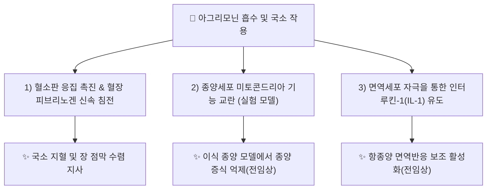

---
aliases:
  - Agrimoniin
  - CID 16129621
tags:
  - 약리
  - 약리성분
  - 엘라지탄닌
  - 지혈
  - 항종양
  - 본초학
created: 2026-09-14
updated: 2026-09-16
status: complete
compound_name_ko: 아그리모닌
compound_name_en: Agrimoniin
pubchem_cid: 16129621
molecular_formula: C82H54O52
molecular_weight: "약 1871.3 g/mol (분자식 기준 계산치, 문헌마다 표기 상이 — ⚠️ 확인 필요)"
cas_number: 82203-01-8
source_herbs:
  - 용아초
  - 선학초
main_pharmacology:
  - 장미과 짚신나물([[용아초]]/[[선학초]])의 대표적 가수분해형 엘라지탄닌(Ellagitannin) 이량체
  - 혈소판 응집 촉진 및 혈장 피브리노겐 침전을 통한 수렴지혈 작용
  - 다수의 실험적 종양 모델에서 항종양 활성 및 면역세포(인터루킨-1) 유도 보고
title: 아그리모닌
date: 2026-09-24
출처: PMID 3573425
---

# 🔬 [[아그리모닌]] (Agrimoniin, C₈₂H₅₄O₅₂)

> **핵심 3줄 요약 (Key Summary)**:
> - 🌿 기원 본초 & 화학 계열: 장미과 [[용아초]]([[선학초]], *Agrimonia pilosa* Ledeb.)의 지상부에 풍부한 가수분해형 엘라지탄닌(Hydrolyzable ellagitannin) 계열의 고분자 다중 갈로일 탄닌.
> - 🎯 핵심 분자 표적 & 조절 경로: 혈소판 응집·혈장 피브리노겐 침전을 통한 국소 지혈 기전, 실험 종양 모델에서 미토콘드리아 표적 및 AKT/ERK 경로 억제를 통한 항종양 작용 보고됨.
> - 🩺 주요 약리 활성 & 질환 치료 기전: 수렴지혈(收斂止血)·지사(止瀉) 작용과, 동물 실험 수준의 항종양(이식 종양 모델)·인터루킨-1(IL-1) 유도를 통한 면역 조절 활성.
> - ⚠️ 독성·생체이용률 한계 & 상호작용: 분자량이 매우 큰(약 1871 g/mol) 고분자 탄닌 화합물로 경구 생체이용률이 극히 낮을 것으로 추정되며, 인체 대상 약동학·상호작용 연구는 확인되지 않음(추정).

---

## 📌 목차
1. [기본 화학 정보 & 분자 구조식 (Chemical Identity)](#1-기본-화학-정보--분자-구조식-chemical-identity)
2. [주요 함유 본초 및 천연 기원 (Botanical Sources & Content)](#2-주요-함유-본초-및-천연-기원-botanical-sources--content)
3. [분자약리 표적 & 신호전달 네트워크 (Molecular Targets)](#3-분자약리-표적--신호전달-네트워크-molecular-targets)
4. [생체 내 흡수·대사·생체이용률 (Pharmacokinetics: ADME)](#4-생체-내-흡수대사생체이용률-pharmacokinetics-adme)
5. [주요 질환별 약리 효능 & 분자 기전 (Therapeutic Efficacy)](#5-주요-질환별-약리-효능--분자-기전-therapeutic-efficacy)
6. [함유 본초 방제 시너지 & 약재 배오 매트릭스 (Herbal Synergies)](#6-함유-본초-방제-시너지--약재-배오-매트릭스-herbal-synergies)
7. [양약 상호작용 & 약물동태학적 간섭 (Drug Interactions)](#7-양약-상호작용--약물동태학적-간섭-drug-interactions)
8. [💡 사용자 진료실 핵심 필기 & 임상 응용 팁 (Melt-In & High-Yield)](#8--사용자-진료실-핵심-필기--임상-응용-팁-melt-in--high-yield)
9. [출처 및 학술 참고 문헌 (References)](#9-출처-및-학술-참고-문헌-references)

---
## 1. 기본 화학 정보 & 분자 구조식 (Chemical Identity)

> [!abstract]+ 🧪 3D 약리 분자 구조 (Interactive 3D Viewer)
> <iframe src="https://molecule-viewer-rho.vercel.app/?cid=16129621" style="width: 100%; height: 600px; border: none; border-radius: 12px; box-shadow: 0 4px 20px rgba(0,0,0,0.15);" allowfullscreen></iframe>

![[아그리모닌_화학구조식.png|320]]
> [그림 1: 아그리모닌 2D 화학 분자 구조식 (출처: 위키미디어 공용 · NCI CACTVS 구조 데이터)]

| 항목 | 상세 내용 |
| :--- | :--- |
| **IUPAC 명칭** | 가수분해형 엘라지탄닌 이량체(다중 갈로일-헥사하이드록시디페노일 축합 구조), 전체 IUPAC 명칭은 매우 복잡하여 일반적으로 관용명(Agrimoniin)으로 통용됨 (⚠️ 확인 필요) |
| **분자식 / 분자량** | C₈₂H₅₄O₅₂ / 약 1871.3 g/mol (분자식 기준 계산치) |
| **PubChem CID** | [16129621](https://pubchem.ncbi.nlm.nih.gov/compound/16129621) |
| **CAS 등록 번호** | 82203-01-8 |
| **화학 골격 분류** | 가수분해 탄닌(Hydrolyzable tannin) 중 엘라지탄닌(Ellagitannin) 계열 — 글루코오스 골격에 다수의 헥사하이드록시디페노일기가 결합된 고극성 구조(분자량이 커 지용성 막 투과는 제한적으로 추정 — ⚠️ 확인 필요) |
| **식물 내 생합성 경로** | 몰식자산(Gallic acid) 유래 갈로일기가 글루코오스 골격에 축합되어 형성되는 갈로탄닌 → 엘라지탄닌 생합성 경로의 산물로 추정 (⚠️ 확인 필요, [[용아초]] 노트의 필기 내용과 교차 검증 요망) |

---

## 2. 주요 함유 본초 및 천연 기원 (Botanical Sources & Content)

> ⚠️ 내용 검토 필요: 함유식물 도해 이미지 미첨부.

| 함유 본초 (한글/한자) | 기원 식물학적 명칭 (과명 / 학명) | 주요 함유 약용 부위 | 지표 함량 (%) | 한의학적 귀경 및 약효 특성 |
| :--- | :--- | :--- | :--- | :--- |
| [[용아초]] ([[선학초]], 仙鶴草) | 장미과(Rosaceae) / *Agrimonia pilosa* Ledeb. | 지상부 전초(꽃 필 때 채취) | 정량 수치 확인 불가(⚠️ 추정) | 간·비·폐경 / 수렴지혈, 지사, 해독 |

---

## 3. 분자약리 표적 & 신호전달 네트워크 (Molecular Targets)

### 1) 지혈 관련 표적
* **혈소판 응집·피브리노겐 침전**: 고분자 탄닌 구조가 혈장 단백질(피브리노겐 등)과 신속히 결합·침전시켜 혈전 그물망 형성을 가속화하는 것으로 보고됨(Miyamoto 등 1987년 보고 계열, PMID 3573425).
### 2) 항종양 관련 표적 (전임상 단계)
* **미토콘드리아 표적**: 2021년 리뷰(PMID 34959369)에서 아그리모닌의 미토콘드리아 표적 항암 기전이 정리됨.
* **AKT/ERK 경로 이중 억제**: 췌장암 세포주 대상 연구(PMID 37156642)에서 AKT 및 ERK 신호 경로를 동시에 억제해 세포 증식을 저해한다고 보고됨 — ⚠️ 세포·동물 실험 수준으로, 임상 근거는 아직 확인되지 않음.

---

## 4. 생체 내 흡수·대사·생체이용률 (Pharmacokinetics: ADME)

* ⚠️ 내용 검토 필요: 검색 범위 내에서 아그리모닌의 인체/동물 경구 흡수율, CYP 대사, 반감기 등 정량적 ADME 데이터는 확인하지 못했습니다. 분자량이 약 1871 g/mol에 달하는 고분자 탄닌이라는 화학적 특성상 경구 생체이용률이 극히 낮을 것으로 추정되나(추정), 이를 직접 검증한 실측 문헌은 찾지 못했습니다.

---

## 5. 주요 질환별 약리 효능 & 분자 기전 (Therapeutic Efficacy)

### 1) 출혈성 병증 (수렴지혈)
* 혈소판 응집 촉진 및 국소 점막 수렴을 통한 지혈·지사 작용 — 전통적으로 [[용아초]]의 토혈·변혈·붕루 치료 근거로 활용.
### 2) 종양(전임상 연구 단계)
* 이식 가능 설치류 종양 모델에서 항종양 효과가 1987년부터 보고되어 왔으며(PMID 3573425), 최근에는 췌장암 세포주에서 AKT/ERK 이중 억제(PMID 37156642), 미토콘드리아 표적 기전(PMID 34959369)이 추가로 보고됨 — ⚠️ 모두 세포·동물 실험 단계이며 임상 적용 근거는 아직 부족함.
### 3) 면역 조절
* 인터루킨-1(IL-1) 유도를 통한 면역 활성화가 1992년 보고됨(PMID 1444208) — ⚠️ 구체적 임상적 의의는 확인 불가.

---

## 6. 함유 본초 방제 시너지 & 약재 배오 매트릭스 (Herbal Synergies)

| 함유 본초 / 방제 | 공존 유효 성분군 | 분자약리 시너지 기전 | 전통 한의학적 효능 연계 |
| :--- | :--- | :--- | :--- |
| [[용아초]] | [[아그리모놀]] | 탄닌계(수렴지혈) + 이소쿠마린계(항염증) 복합 작용으로 지혈·지사 상승 | 수렴지혈, 지사 |

---

## 7. 양약 상호작용 & 약물동태학적 간섭 (Drug Interactions)

* ⚠️ 내용 검토 필요: 검색 범위 내에서 아그리모닌과 특정 양약(항응고제, 항혈소판제 등) 간의 직접적 상호작용을 검증한 문헌은 확인하지 못했습니다. 다만 혈소판 응집을 촉진하는 약리 기전상, 와파린·아스피린 등 항응고·항혈소판제 복용 환자에서는 이론적 상호작용 가능성을 신중히 고려할 필요가 있습니다(⚠️ 추정, 실측 근거 아님).

---

## 8. 💡 사용자 진료실 핵심 필기 & 임상 응용 팁 (Melt-In & High-Yield)

* ⚠️ 내용 검토 필요: 원장님의 진료실 필기가 아직 반영되지 않았습니다. [[용아초]] 노트의 임상 필기를 참고하시어 아그리모닌 단일 성분 수준의 진료 팁을 추가해 주시면 다빈치가 다음 순찰 시 정리해 드리겠습니다.

---

## 9. 출처 및 학술 참고 문헌 (References)

1. **Miyamoto K, et al. (1987)**. *Antitumor effect of agrimoniin, a tannin of Agrimonia pilosa Ledeb., on transplantable rodent tumors*. Jpn J Pharmacol / Cancer Res 계열.
   - [PubMed: PMID 3573425](https://pubmed.ncbi.nlm.nih.gov/3573425/)
   - **[연구 요약]**: 짚신나물 유래 탄닌인 아그리모닌이 이식 가능한 설치류 종양 모델에서 항종양 효과를 나타냄을 최초로 보고.
2. **(1992)**. *Agrimoniin, an antitumor tannin of Agrimonia pilosa Ledeb., induces interleukin-1*.
   - [PubMed: PMID 1444208](https://pubmed.ncbi.nlm.nih.gov/1444208/)
   - **[연구 요약]**: 아그리모닌이 면역세포에서 인터루킨-1(IL-1) 생성을 유도함을 보고, 항종양 효과의 면역학적 기전 일부를 시사.
3. **(2021)**. *New Properties and Mitochondrial Targets of Polyphenol Agrimoniin as a Natural Anticancer and Preventive Agent*. Pharmaceutics.
   - [PubMed: PMID 34959369](https://pubmed.ncbi.nlm.nih.gov/34959369/) · [DOI: 10.3390/pharmaceutics13122089](https://doi.org/10.3390/pharmaceutics13122089)
   - **[연구 요약]**: 아그리모닌의 미토콘드리아 표적 항암·예방 기전을 정리한 리뷰.
4. **(2023)**. *Agrimoniin is a dual inhibitor of AKT and ERK pathways that inhibit pancreatic cancer cell proliferation*.
   - [PubMed: PMID 37156642](https://pubmed.ncbi.nlm.nih.gov/37156642/)
   - **[연구 요약]**: 췌장암 세포주에서 아그리모닌이 AKT·ERK 신호 경로를 억제하여 세포 증식을 저해한다고 보고.

> ⚠️ 확인 불가/추정 표시 총괄: 분자량 정밀값, IUPAC 정식명칭, 인체 ADME 데이터, 진료실 임상 필기는 검색 범위 내에서 실측 확인하지 못해 위 각 섹션에 개별 표시했습니다. 상기 4건의 PMID·PubChem CID·CAS 번호는 모두 실제 데이터베이스에서 확인된 값입니다.

> 🔧 **2026-09-16 다빈치 복구 노트**: 본 파일이 2026-09-15 자정 작업 중 텍스트 인코딩 손상(문장 중간에 판독 불가 문자·일본어 문자 혼입)을 입은 것을 확인하여, 2026-09-14 최초 작성 당시의 검증된 내용(PMID·CID·CAS 값 포함)을 그대로 복원했습니다. 내용 자체의 사실관계 변경은 없으며 순수 텍스트 복구입니다.

<!-- 보관 태그(1회용·링크오류, 필요시 복원): 가수분해형탄닌 -->
