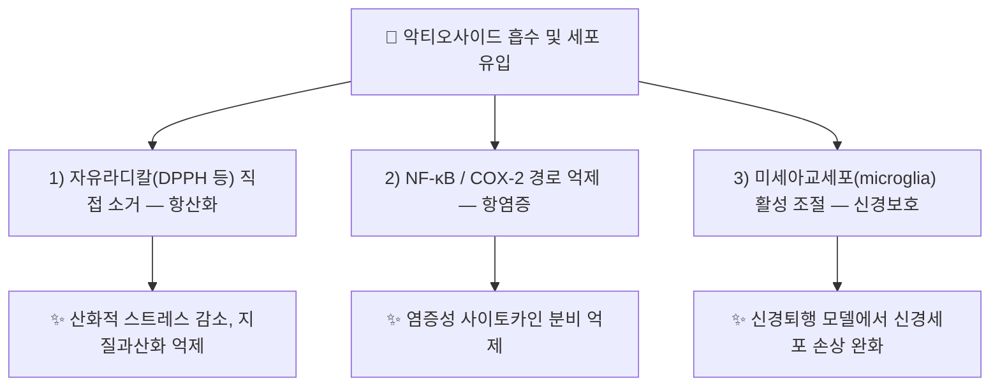

# 🔬 [[악티오사이드]] (Acteoside / Verbascoside, C₂₉H₃₆O₁₅)

> **핵심 3줄 요약 (Key Summary)**:
> - 🌿 기원 본초 & 화학 계열: [[차전자]](*Plantago asiatica* 종자)에 대한민국약전(KP) 규격 지표 성분(0.40% 이상)으로 함유되는 카페오일 페닐에탄오이드 배당체(CPhG) 계열 화합물. 문헌상 [[지황]](*Rehmannia glutinosa*) 등 여러 약용식물에서도 광범위하게 보고됨(PMID 25048704 리뷰 — ⚠️ 지황 노트 내 실제 기재 여부는 별도 확인 필요).
> - 🎯 핵심 분자 표적 & 조절 경로: 자유라디칼(DPPH 등) 직접 소거를 통한 항산화, NF-κB·COX-2 경로 억제를 통한 항염증, 신경염증 모델에서 미세아교세포(microglia) 활성 조절을 통한 신경보호(PMID 42014645 체계적 리뷰·메타분석).
> - 🩺 주요 약리 활성 & 질환 치료 기전: 항균·세포독성(항종양)·항염증·면역조절 등 다면적 생물 활성이 최근 종합 리뷰로 정리됨(PMID 40724000). 차전자 노트에서는 [[아우쿠빈]]과 함께 방광 삼각부·망막 미세혈관 보호(청간명목) 기전으로 서술.
> - ⚠️ 독성·생체이용률 한계 & 상호작용: 경구 생체이용률이 낮은 것으로 보고되는 페닐에탄오이드 배당체 계열 공통 한계가 있음(PMID 35724511 약동학 리뷰) — 정확한 인체 F(%) 수치·양약 상호작용 데이터는 검색 범위 내에서 확인 불가(⚠️ 확인 필요).

---

## 📌 목차
1. [기본 화학 정보 & 분자 구조식 (Chemical Identity)](#1-기본-화학-정보--분자-구조식-chemical-identity)
2. [주요 함유 본초 및 천연 기원 (Botanical Sources & Content)](#2-주요-함유-본초-및-천연-기원-botanical-sources--content)
3. [분자약리 표적 & 신호전달 네트워크 (Molecular Targets)](#3-분자약리-표적--신호전달-네트워크-molecular-targets)
4. [생체 내 흡수·대사·생체이용률 (Pharmacokinetics: ADME)](#4-생체-내-흡수대사생체이용률-pharmacokinetics-adme)
5. [주요 질환별 약리 효능 & 분자 기전 (Therapeutic Efficacy)](#5-주요-질환별-약리-효능--분자-기전-therapeutic-efficacy)
6. [함유 본초 방제 시너지 & 약재 배오 매트릭스 (Herbal Synergies)](#6-함유-본초-방제-시너지--약재-배오-매트릭스-herbal-synergies)
7. [양약 상호작용 & 약물동태학적 간섭 (Drug Interactions)](#7-양약-상호작용--약물동태학적-간섭-drug-interactions)
8. [💡 사용자 진료실 핵심 필기 & 임상 응용 팁 (Melt-In & High-Yield)](#8--사용자-진료실-핵심-필기--임상-응용-팁-melt-in--high-yield)
9. [출처 및 학술 참고 문헌 (References)](#9-출처-및-학술-참고-문헌-references)

---
## 1. 기본 화학 정보 & 분자 구조식 (Chemical Identity)

![[악티오사이드_화학구조식.png|320]]
> [그림 1: 악티오사이드 2D 화학 분자 구조식 (출처: 위키미디어 공용 · NCI CACTVS 구조 데이터)]

> [!abstract]+ 🧪 3D 약리 분자 구조 (Interactive 3D Viewer)
> <iframe src="https://molecule-viewer-rho.vercel.app/?cid=5281800" width="100%" height="450px" frameborder="0" allow="webgl" style="border-radius: 8px;"></iframe>

| 항목 | 상세 내용 |
| :--- | :--- |
| **분자식 / 분자량** | C₂₉H₃₆O₁₅ / 624.6 g/mol |
| **PubChem CID** | [5281800](https://pubchem.ncbi.nlm.nih.gov/compound/5281800) (⚠️ PubChem에 동일 분자식의 CID 354009 "Acteoside;Kusaginin;TJC160" 항목도 별도 등재되어 있음 — 중복 등재 가능성, 확인 필요) |
| **CAS 등록 번호** | 61276-17-3 |
| **화학 골격 분류** | 카페오일 페닐에탄오이드 배당체(Caffeoyl Phenylethanoid Glycoside, CPhG) — 하이드록시타이로솔(hydroxytyrosol) 배당체 골격에 카페오일기·람노스가 결합된 구조 |
| **물리화학적 성상** | 수용성 배당체(다당류·페놀산과 유사한 극성), 갈색 비정질 분말 |
| **IUPAC 명칭 (병합분)** | 2-(3,4-dihydroxyphenyl)ethyl 3-O-(α-L-rhamnopyranosyl)-4-O-[(2E)-3-(3,4-dihydroxyphenyl)prop-2-enoyl]-β-D-glucopyranoside |

> **중복 노트 병합분 (2026-09-23, `악테오사이드.md`에서 통합)**: 악테오사이드(Acteoside, 버바스코사이드 Verbascoside)는 하이드록시티로솔(Hydroxytyrosol), 카페산(Caffeic acid), 람노오스(Rhamnose), 글루코오스(Glucose)가 결합된 복합 페닐에타노이드 배당체이다. (원 노트 표기: 분자량 624.59 g/mol)

---

## 2. 주요 함유 본초 및 천연 기원 (Botanical Sources & Content)

| 함유 본초 (한글/한자) | 기원 식물학적 명칭 (과명 / 학명) | 주요 함유 약용 부위 | 지표 함량 (%) | 한의학적 귀경 및 약효 특성 |
| :--- | :--- | :--- | :--- | :--- |
| [[차전자]] (車前子) | 질경이과(Plantaginaceae) / *Plantago asiatica* L. | 성숙 종자 | KP 규격 ≥ 0.40% | 간·신·소장·폐경 / 청열이뇨통림(淸熱利尿通淋), 청간명목(淸肝明目) |

> ⚠️ 문헌(PMID 25048704)상 악티오사이드(Verbascoside)는 [[지황]](Rehmannia)·현삼과(Scrophulariaceae) 식물 등에서도 널리 보고되나, 해당 본초 노트 내 실제 기재 여부는 이번 순찰에서 별도 확인하지 못했습니다(⚠️ 확인 필요, 향후 순찰 시 교차 검증 권장).

* **볼트 교차 확인 (2026-09-23)**: 아래 본초 노트의 '주요 성분' 칸에 악티오사이드(=악테오사이드, 버바스코사이드)가 실제로 기재돼 있습니다. 함량 수치는 기재 없음.
  * [[건지황]](Arginine·GABA와 함께 페놀류로 기재), [[현삼]](페닐프로파노이드 배당체로 기재), [[취오동]](acteoside·isoacteoside 계열로 기재), [[능소화]](페닐에타노이드 배당체로 기재).
* **⚠️ 중복 노트 병합분 (`악테오사이드.md`, 미검증)**: 중복 노트는 함유 본초를 다음과 같이 적고 있었으나, 이번 병합에서 PubMed 검증을 하지 않았습니다.
  * 핵심 요약: [[숙지황]], [[육종용]], [[목서초]]에 고농도로 함유된 대표적인 천연 페닐에타노이드 배당체(Verbascoside)
  * 천연 기원 본초: 현삼과 [[지황]](생지황, 건지황, [[숙지황]]) · 열당과 [[육종용]](Cistanchis Herba) · 꿀풀과 전초류, 현삼
  * 원 노트 핵심 요약 둘째 줄: 페놀성 수산기 기반의 강력한 활성산소(ROS) 소거·항염증·신경보호 및 면역 조절 활성
  * 볼트의 [[육종용]] 노트 '주요 성분' 칸에는 악티오사이드가 기재돼 있지 않고, `목서초` 노트는 볼트에 없습니다.

---

## 3. 분자약리 표적 & 신호전달 네트워크 (Molecular Targets)

### 1) 항산화·항염증 표적
* **자유라디칼 소거**: 카테콜(catechol) 구조의 하이드록시타이로솔 골격을 통한 직접적 라디칼 중화(PMID 40724000).
* **NF-κB/COX-2 억제**: 염증성 전사인자 활성화 차단을 통한 사이토카인 생성 억제.

### 2) 신경보호 경로
* **신경퇴행 모델 메타분석(PMID 42014645)**: 다수의 신경퇴행 동물모델에서 미세아교세포 매개 신경염증 억제 및 신경세포 생존율 개선이 체계적으로 보고됨.

### 3) ⚠️ 중복 노트 병합분 (`악테오사이드.md`, 개별 근거 미검증)
원 노트에 근거 논문이 문장별로 달려 있지 않아, 아래 서술은 이번 병합에서 검증하지 못했습니다. 요지는 §3-1)·2)의 리뷰 근거와 겹칩니다.
1. **강력한 항산화 및 미토콘드리아 보호**:
   * 4개의 페놀성 하이드록실기(-OH)를 보유하여 $\text{DPPH}$, $\text{ABTS}$, 슈퍼옥사이드 라디칼을 강력히 포획.
   * 미토콘드리아 막전위($\Delta\Psi_m$) 소실을 방어하고 사이토크롬 c 유출을 차단하여 세포자멸사(Apoptosis)를 억제.
2. **신경퇴행성 질환 방어 (알츠하이머/파킨슨)**:
   * 아밀로이드 베타($A\beta_{1-42}$) 응집을 차단하고 타우(Tau) 단백질의 과인산화를 억제.
   * 도파민 신경세포에서 6-OHDA 또는 MPTP 유도 신경독성을 중화 (육종용의 건망·치매 치료 분자 기전).
3. **항염증 및 면역 조절**:
   * MAPK(p38, JNK, ERK) 및 NF-$\kappa$B 인산화를 억제하여 전염증성 사이토카인 분비를 차단.
   * 비만세포 탈과립 및 히스타민 유리를 억제하여 알레르기 반응 완화.

---

## 4. 생체 내 흡수·대사·생체이용률 (Pharmacokinetics: ADME)

* **경구 흡수 및 생체이용률**: 페닐에탄오이드 배당체 계열 공통 특성으로 경구 생체이용률이 낮은 것으로 보고됨(PMID 35724511 전문 리뷰) — 정확한 F(%) 수치는 이번 조사 범위에서 확인하지 못함(⚠️ 확인 필요).
* **장내 미생물총 대사**: 장내 세균에 의한 가수분해·대사 전환 가능성이 문헌상 시사되나(관련 Cistanche 다당류 병용 연구 존재), 차전자 유래 악티오사이드 특이적 데이터는 ⚠️ 확인 필요.
* **동물 약동학 데이터**: 개(犬) 대상 위내·정맥 투여 비교 약동학 연구가 별도로 존재하나(ScienceDirect, PMID 미확인), 본 노트에는 PubMed 등재가 확인된 문헌만 References에 수록했습니다.

---

## 5. 주요 질환별 약리 효능 & 분자 기전 (Therapeutic Efficacy)

### 1) 신경퇴행성 질환 & 신경염증
* 신경퇴행 동물모델에서 항신경염증·신경보호 효과가 체계적 리뷰·메타분석으로 종합됨(PMID 42014645).
### 2) 항균·항종양·면역조절
* 최근 종합 리뷰에서 항균, 세포독성(암세포주), 항염증, 면역조절 등 다면적 생물 활성이 정리됨(PMID 40724000).
### 3) 비뇨기·안과 보호 (차전자 임상 맥락)
* [[차전자]] 노트에서는 [[아우쿠빈]]과 함께 방광 삼각부 상피 보호 및 망막 미세혈관 보호(청간명목) 기전의 일부로 서술되어 있습니다(본초 노트 내부 서술, 별도 화합물 단위 논문 인용 아님 — ⚠️ 참고용).

---

## 6. 함유 본초 방제 시너지 & 약재 배오 매트릭스 (Herbal Synergies)

| 함유 본초 / 방제 | 공존 유효 성분군 | 분자약리 시너지 기전 | 전통 한의학적 효능 연계 |
| :--- | :--- | :--- | :--- |
| [[차전자]] | [[아우쿠빈]], 플란타고-뮤실리지 | 이리도이드 배당체(아우쿠빈)와의 항산화·이뇨 상승 작용(⚠️ 추정, 직접 병용 연구 미확인) | 청열이뇨통림(淸熱利尿通淋), 청간명목(淸肝明目) |

### ⚠️ 중복 노트 병합분: 보신익정과 양혈자음 (`악테오사이드.md`, 미검증)
악테오사이드는 한의학에서 정혈(精血)을 보충하고 노화를 지연시키는 보익약(補益藥)의 핵심 유효성분이다. — 원 노트의 핵심 요약: 한의학의 자음보혈(滋陰補血)·보신익정(補腎益精) 본초의 핵심 지표이자 노화 억제 분자 물질.

| 본초 | 주요 효능 | 악테오사이드 매개 현대 분자 해석 |
| :--- | :--- | :--- |
| [[숙지황]] | 자음보혈, 익정진수 | 조혈 줄기세포 분화 촉진, 산화 스트레스 억제로 골수 조혈 기능 증강 |
| [[육종용]] | 보신양, 익정혈, 윤장통변 | HPA-성선 축 활성화, 신경세포 재생 및 장관 연동 촉진 |
| [[현삼]] | 청열양혈, 자음강화 | 염증 매개인자 억제 및 혈관내피 손상 회복 |

---

## 7. 양약 상호작용 & 약물동태학적 간섭 (Drug Interactions)

* ⚠️ 내용 검토 필요: 검색 범위 내에서 악티오사이드와 특정 양약(CYP450 기질 약물 등) 간의 임상적 상호작용을 직접 다룬 문헌은 확인하지 못했습니다. 항산화·항염증 기전상 다른 항산화제·항염증 양약과의 상가 작용 가능성은 이론적으로 존재하나(⚠️ 추정), 실측 근거는 아닙니다.

---

## 8. 💡 사용자 진료실 핵심 필기 & 임상 응용 팁 (Melt-In & High-Yield)

* ⚠️ 내용 검토 필요: 원장님의 진료실 필기가 아직 반영되지 않았습니다. [[차전자]] 처방 시 악티오사이드 단일 성분 수준의 임상 팁을 추가해 주시면 다음 순찰 시 정리해 드리겠습니다.

---

## 9. 출처 및 학술 참고 문헌 (References)

1. **Alipieva K, Korkina L, Orhan IE, Georgiev MI (2014)**. *Verbascoside--a review of its occurrence, (bio)synthesis and pharmacological significance*. Biotechnology Advances.
   - [PubMed: PMID 25048704](https://pubmed.ncbi.nlm.nih.gov/25048704/)
   - **[연구 요약]**: 악티오사이드(베르바스코사이드)의 식물계 분포(지황·현삼과 등), 생합성 경로, 항산화·항염증·신경보호 등 약리학적 의의를 종합한 대표 리뷰.
2. **(2026)**. *Anti-neuroinflammatory and neuroprotective effects of acteoside (verbascoside) in experimental models of neurodegeneration: a systematic review and meta-analysis*.
   - [PubMed: PMID 42014645](https://pubmed.ncbi.nlm.nih.gov/42014645/)
   - **[연구 요약]**: 신경퇴행 동물모델을 대상으로 한 체계적 문헌고찰·메타분석을 통해 악티오사이드의 항신경염증·신경보호 효과를 정량 종합.
3. **(2025)**. *Multifaceted Biological Properties of Verbascoside/Acteoside: Antimicrobial, Cytotoxic, Anti-Inflammatory, and Immunomodulatory Effects*.
   - [PubMed: PMID 40724000](https://pubmed.ncbi.nlm.nih.gov/40724000/)
   - **[연구 요약]**: 항균·세포독성·항염증·면역조절에 걸친 악티오사이드의 다면적 생물 활성을 최근 문헌 기준으로 정리.
4. **(2022)**. *The pharmacokinetic property and pharmacological activity of acteoside: A review*.
   - [PubMed: PMID 35724511](https://pubmed.ncbi.nlm.nih.gov/35724511/)
   - **[연구 요약]**: 악티오사이드의 약동학적 특성(경구 생체이용률 등)과 약리 활성을 종합한 리뷰.

### 9.1 중복 노트 병합분 참고문헌 (2026-09-23, `악테오사이드.md`에서 통합·재검증)
5. Gao H, et al. Acteoside improves cognition by inhibiting apoptosis and activating the Nrf2/HO-1 pathway in Alzheimer's disease models. *Neurochem Res*. 2019;44(8):1984-1996.
   - [연구 요약] 악테오사이드의 Nrf2 항산화 경로 활성화 및 인지 기능 개선 기전을 입증.
   - ⚠️ 2026-09-23 PubMed 검색(acteoside+Nrf2, acteoside+Neurochem Res)에서 이 서지에 해당하는 논문을 찾지 못했습니다. 존재가 확인되기 전까지 근거로 쓰지 마세요.
- 원 노트의 다른 참고문헌 Alipieva 2014(Biotechnol Adv 32(6):1065-1076)는 위 1번과 같은 논문입니다.

> ⚠️ 확인 불가/추정 표시 총괄: 인체 대상 정량 ADME 데이터, 양약 상호작용 실측 자료, 진료실 임상 필기, PubChem 중복 CID(5281800 vs 354009) 정리는 검색 범위 내에서 확인하지 못해 위 각 섹션에 개별 표시했습니다. 상기 PubChem CID·CAS 번호·PMID 4건은 모두 실제 데이터베이스에서 확인된 값입니다.

---
🏛️ **상위 허브**: [[00_약리_공부_MOC]]

<!-- 보관 태그(1회용·링크오류, 필요시 복원): 페닐에탄오이드배당체 -->
