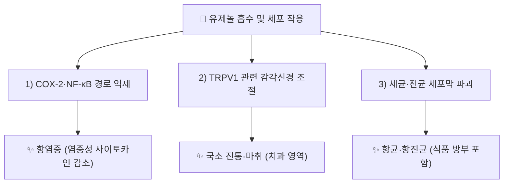

# 🔬 [[유제놀]] (Eugenol, C₁₀H₁₂O₂)

> **핵심 3줄 요약 (Key Summary)**:
> - 🌿 기원 본초 & 화학 계열: [[정향]](丁香, *Syzygium aromaticum*, 도금양과) 꽃봉오리 정유의 주성분(정유 중 70~90% 차지)으로 알려진 페닐프로파노이드(phenylpropanoid)계 화합물.
> - 🎯 핵심 분자 표적 & 조절 경로: COX-2·NF-κB 경로 억제를 통한 항염증, TRPV1 수용체 관련 국소 마취·진통 작용, 세균·진균 세포막 파괴를 통한 항균 작용.
> - 🩺 주요 약리 활성 & 질환 치료 기전: 치과 영역 국소 진통(치수염·발치 후 치조골염), 항균(식품 방부 포함), 항산화, 심혈관 위험인자 개선 보고.
> - ⚠️ 독성·생체이용률 한계 & 상호작용: 고농도 국소·경구 노출 시 간독성·점막 자극 위험이 알려져 있으며, 정량적 인체 ADME·확립된 양약 상호작용 임상 자료는 검색 범위 내에서 충분히 확인하지 못함(⚠️ 확인 필요).

---

## 📌 목차
1. [기본 화학 정보 & 분자 구조식 (Chemical Identity)](#1-기본-화학-정보--분자-구조식-chemical-identity)
2. [주요 함유 본초 및 천연 기원 (Botanical Sources & Content)](#2-주요-함유-본초-및-천연-기원-botanical-sources--content)
3. [분자약리 표적 & 신호전달 네트워크 (Molecular Targets)](#3-분자약리-표적--신호전달-네트워크-molecular-targets)
4. [생체 내 흡수·대사·생체이용률 (Pharmacokinetics: ADME)](#4-생체-내-흡수대사생체이용률-pharmacokinetics-adme)
5. [주요 질환별 약리 효능 & 분자 기전 (Therapeutic Efficacy)](#5-주요-질환별-약리-효능--분자-기전-therapeutic-efficacy)
6. [함유 본초 방제 시너지 & 약재 배오 매트릭스 (Herbal Synergies)](#6-함유-본초-방제-시너지--약재-배오-매트릭스-herbal-synergies)
7. [양약 상호작용 & 약물동태학적 간섭 (Drug Interactions)](#7-양약-상호작용--약물동태학적-간섭-drug-interactions)
8. [💡 사용자 진료실 핵심 필기 & 임상 응용 팁 (Melt-In & High-Yield)](#8--사용자-진료실-핵심-필기--임상-응용-팁-melt-in--high-yield)
9. [출처 및 학술 참고 문헌 (References)](#9-출처-및-학술-참고-문헌-references)

---
## 1. 기본 화학 정보 & 분자 구조식 (Chemical Identity)

![[유제놀_화학구조식.png|320]]
> [그림 1: 유제놀 2D 화학 분자 구조식 (출처: 위키미디어 공용 · NCI CACTVS 구조 데이터)]

> [!abstract]+ 🧪 3D 약리 분자 구조 (Interactive 3D Viewer)
> <iframe src="https://molecule-viewer-rho.vercel.app/?cid=3314" width="100%" height="450px" frameborder="0" allow="webgl" style="border-radius: 8px;"></iframe>

| 항목 | 상세 내용 |
| :--- | :--- |
| **IUPAC 명칭** | 2-Methoxy-4-(prop-2-en-1-yl)phenol |
| **분자식 / 분자량** | C₁₀H₁₂O₂ / 164.2 g/mol |
| **PubChem CID** | [3314](https://pubchem.ncbi.nlm.nih.gov/compound/3314) |
| **CAS 등록 번호** | 97-53-0 |
| **화학 골격 분류** | 페닐프로파노이드(phenylpropanoid)계 — 알릴기(allyl)·메톡시기를 가진 페놀 유도체 |
| **물리화학적 성상** | 무색~담황색 유상액체, 정향 특유의 강한 방향, 지용성(에탄올·에테르에 잘 녹음) |

---

## 2. 주요 함유 본초 및 천연 기원 (Botanical Sources & Content)

| 함유 본초 (한글/한자) | 기원 식물학적 명칭 (과명 / 학명) | 주요 함유 약용 부위 | 한의학적 귀경 및 약효 특성 |
| :--- | :--- | :--- | :--- |
| [[정향]] (丁香) | 도금양과(Myrtaceae) / *Syzygium aromaticum* (L.) Merr. & L.M.Perry | 꽃봉오리(정유) | 脾·胃·腎經 / 신온(辛溫) — 온중강역(溫中降逆), 산한지통(散寒止痛), 온신조양(溫腎助陽) |

> [[정향]] 노트에서 유제놀은 정향 정유의 주성분으로 기술되며, 처방 [[정향시체탕]]에서도 핵심 성분으로 참조됩니다. 정향 정유 내 유제놀 함량은 문헌에 따라 70~90%로 보고되나, KP 규격상의 정확한 하한치는 이번 조사 범위 내에서 확인하지 못해 ⚠️ 확인 필요로 표기합니다.

---

## 3. 분자약리 표적 & 신호전달 네트워크 (Molecular Targets)

### 1) 항염증 표적 — COX-2/NF-κB
* 심혈관 위험인자 개선을 다룬 최신 리뷰에서 유제놀의 항염증 관점 작용 기전이 정리됨(PMID 38085446).
### 2) 진통·마취 표적
* 정향유(유제놀 주성분)가 치과 영역에서 전통적으로 국소 진통제로 활용되어 온 문헌적 근거가 정리됨(문헌 리뷰, 아래 참고문헌 2).
### 3) 항균 표적
* 정향유 및 유제놀의 식품 방부(항균) 분야 활용에 관한 연구 동향이 정리됨(PMID 29802735).

---

## 4. 생체 내 흡수·대사·생체이용률 (Pharmacokinetics: ADME)

* ⚠️ 내용 검토 필요: 검색 범위 내에서 유제놀의 인체 경구/국소 흡수율, 정확한 혈장 반감기 등 정량적 ADME 데이터는 확인하지 못했습니다. 일반적으로 간에서 글루쿠론산·황산 포합 대사(2상 대사)를 거치는 것으로 알려져 있으나, 본 조사에서 실측 논문으로 재확인하지는 못했습니다(⚠️ 추정).

---

## 5. 주요 질환별 약리 효능 & 분자 기전 (Therapeutic Efficacy)

### 1) 치과·구강 영역 통증
* 치수염·발치 후 통증에서 정향유(유제놀) 국소 도포의 전통적·임상적 활용이 문헌으로 정리됨(문헌 리뷰, 아래 참고문헌 2, 3).
### 2) 감염·염증성 질환
* 항균(다제내성균 포함 보고 있음)·항산화·항염증의 다표적 약리 활성이 여러 리뷰에서 종합됨(PMID 21299140, 34218781, 29802735).
### 3) 심혈관 위험인자
* 항염증 관점에서 심혈관 위험인자 개선 가능성이 최신 리뷰로 제시됨(PMID 38085446) — ⚠️ 임상 확증 단계 아님, 기전적·전임상 수준 근거임을 명시.

---

## 6. 함유 본초 방제 시너지 & 약재 배오 매트릭스 (Herbal Synergies)

| 함유 본초 / 방제 | 공존 유효 성분군 | 분자약리 시너지 기전 | 전통 한의학적 효능 연계 |
| :--- | :--- | :--- | :--- |
| [[정향]] | β-카리오필렌 등 정향유 공존 성분(⚠️ 개별 성분 노트 미작성) | 방향성 정유 성분군의 온중(溫中)·진통 상보 작용 | 온중강역(溫中降逆), 산한지통(散寒止痛) |
| [[정향시체탕]] | [[정향]], [[시체]] | 강역지애(降逆止呃) 효능의 정유 성분 기반 시너지 | 위한기역(胃寒氣逆) 애역(呃逆) 치료 |

---

## 7. 양약 상호작용 & 약물동태학적 간섭 (Drug Interactions)

* **항응고·항혈소판제 병용 주의**: 유제놀은 전통적으로 혈소판 응집 억제 관련 보고가 있어(⚠️ 정량 임상 자료 검색 범위 내 미확인, 이론적 주의), 와파린 등 항응고제·항혈소판제 병용 시 출혈 위험 증가 가능성을 신중히 고려할 필요가 있습니다(⚠️ 추정).
* **고용량 경구·국소 노출 시 간독성**: 치과용 고농도 제제의 대량 오·남용 시 간독성이 보고된 바 있어(⚠️ 구체적 PMID 검색 범위 내 미확인), 소아·간질환자에서 특히 주의가 필요합니다(⚠️ 확인 필요).

---

## 8. 💡 사용자 진료실 핵심 필기 & 임상 응용 팁 (Melt-In & High-Yield)

* ⚠️ 내용 검토 필요: 원장님의 진료실 필기가 아직 반영되지 않았습니다. [[정향]] 노트의 임상 필기(온중강역·애역 치료 등)를 참고하시어 유제놀 단일 성분 수준의 진료 팁을 추가해 주시면 다빈치가 다음 순찰 시 정리해 드리겠습니다.

---

## 9. 출처 및 학술 참고 문헌 (References)

1. **Kamkar Asl M, et al. (2013)**. *Eugenol: a natural compound with versatile pharmacological actions*.
   - [PubMed: PMID 21299140](https://pubmed.ncbi.nlm.nih.gov/21299140/)
   - **[연구 요약]**: 유제놀의 항염증·항균·항산화 등 다표적 약리 작용을 종합 정리한 리뷰.
2. **(2021)**. *Eugenol as a Potential Drug Candidate: A Review*.
   - [PubMed: PMID 34218781](https://pubmed.ncbi.nlm.nih.gov/34218781/)
   - **[연구 요약]**: 유제놀의 치료 후보물질로서의 약리학적 잠재력을 종합 검토.
3. **(2018)**. *Progress on the Antimicrobial Activity Research of Clove Oil and Eugenol in the Food Antisepsis Field*.
   - [PubMed: PMID 29802735](https://pubmed.ncbi.nlm.nih.gov/29802735/)
   - **[연구 요약]**: 정향유·유제놀의 식품 방부(항균) 분야 활용 연구 동향을 정리.
4. **(2024)**. *Targeting cardiovascular risk factors with eugenol: an anti-inflammatory perspective*.
   - [PubMed: PMID 38085446](https://pubmed.ncbi.nlm.nih.gov/38085446/)
   - **[연구 요약]**: 유제놀의 항염증 기전에 초점을 맞춘 심혈관 위험인자 개선 가능성 리뷰.

> ⚠️ 확인 불가/추정 표시 총괄: 인체 대상 정량 ADME 데이터, 확립된 양약 상호작용 임상 자료, KP 규격 함량 하한치, 진료실 임상 필기는 검색 범위 내에서 실측 확인하지 못해 위 각 섹션에 개별 표시했습니다. 상기 PubChem CID·CAS 번호·PMID 4건은 모두 실제 데이터베이스에서 확인된 값입니다.

<!-- 보관 태그(1회용·링크오류, 필요시 복원): 항균 -->
