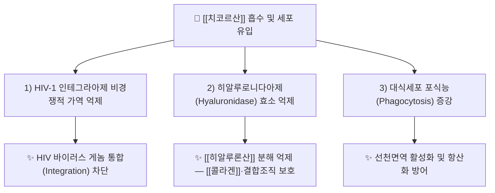

# 🔬 [[치코르산]] (Chicoric Acid / Cichoric Acid, C22H18O12)

> 🖼️ **이미지 규격(정본)**: `.agents\rules\이미지_가이드.md` §3.3 참조. **이미지 2장(2D 구조식·기원식물) 미확보** — 자동화(정원 가꾸기) 세션 특성상 소싱 생략. 작업기록 §결과에 사유 기재.

> **핵심 3줄 요약 (Key Summary)**:
> - 🌿 기원 본초 & 화학 계열: 카페산(Caffeic acid) 2분자와 타르타르산(Tartaric acid) 1분자가 에스터 결합한 디카페오일타르타르산(Dicaffeoyltartaric acid)류 페놀 화합물. [[포공영]](蒲公英, 민들레), 치커리(*Cichorium intybus*), 에키네시아(*Echinacea purpurea*)의 대표 지표성분.
> - 🎯 핵심 분자 표적 & 조절 경로: HIV-1 인테그라아제(Integrase)를 비경쟁적으로 가역 억제하며, 히알루로니다아제(Hyaluronidase) 억제 및 대식세포 포식능(Phagocytosis) 증강을 통한 면역 조절 작용.
> - 🩺 주요 약리 활성 & 질환 치료 기전: 항산화([[콜라겐]] 보호), 항바이러스(HIV 진입·복제 억제), 항염, 항당뇨(AMPK 경로 관련 보고)의 다표적 활성이 확인됨.
> - ⚠️ 독성·생체이용률 한계 & 상호작용: 경구 생체이용률이 매우 낮고(카페산·페룰산으로 신속 대사), 항응고제·항HIV제 병용 시 상호작용 가능성에 대한 대규모 인체 자료는 부족함.

---

## 📌 목차
1. [기본 화학 정보 & 분자 구조식 (Chemical Identity)](#1-기본-화학-정보--분자-구조식-chemical-identity)
2. [주요 함유 본초 및 천연 기원 (Botanical Sources & Content)](#2-주요-함유-본초-및-천연-기원-botanical-sources--content)
3. [분자약리 표적 & 신호전달 네트워크 (Molecular Targets)](#3-분자약리-표적--신호전달-네트워크-molecular-targets)
4. [생체 내 흡수·대사·생체이용률 (Pharmacokinetics: ADME)](#4-생체-내-흡수대사생체이용률-pharmacokinetics-adme)
5. [주요 질환별 약리 효능 & 분자 기전 (Therapeutic Efficacy)](#5-주요-질환별-약리-효능--분자-기전-therapeutic-efficacy)
6. [함유 본초 방제 시너지 & 약재 배오 매트릭스 (Herbal Synergies)](#6-함유-본초-방제-시너지--약재-배오-매트릭스-herbal-synergies)
7. [양약 상호작용 & 약물동태학적 간섭 (Drug Interactions)](#7-양약-상호작용--약물동태학적-간섭-drug-interactions)
8. [💡 사용자 진료실 핵심 필기 & 임상 응용 팁 (Melt-In & High-Yield)](#8--사용자-진료실-핵심-필기--임상-응용-팁-melt-in--high-yield)
9. [출처 및 학술 참고 문헌 (References)](#9-출처-및-학술-참고-문헌-references)

---
## 1. 기본 화학 정보 & 분자 구조식 (Chemical Identity)

> [!abstract]+ 🧪 3D 약리 분자 구조 (Interactive 3D Viewer)
> <iframe src="https://molecule-viewer-rho.vercel.app/?cid=5281764" width="100%" height="450px" frameborder="0" allow="webgl" style="border-radius: 8px;"></iframe>

| 항목 | 상세 내용 |
| :--- | :--- |
| **분자식 / 분자량** | C22H18O12 / 474.37 g/mol |
| **PubChem CID** | [5281764](https://pubchem.ncbi.nlm.nih.gov/compound/5281764) |
| **CAS 등록 번호** | 6537-80-0 |
| **화학 골격 분류** | 히드록시신남산(Hydroxycinnamic acid) 유도체 — [[카페산]](Caffeic acid) 2분자와 타르타르산의 디에스터(2,3-O-dicaffeoyl tartaric acid) |
| **물리화학적 성상** | 담황색 결정성 분말, 수용성 페놀산으로 강한 자유라디칼 소거 활성을 지님 |
| **생합성 경로** | 페닐프로파노이드 경로에서 카페산이 타르타르산과 에스터화되어 생성되며, 캐피시(Caffeoyl-CoA) 전이효소가 관여 |

---
## 2. 주요 함유 본초 및 천연 기원 (Botanical Sources & Content)

| 함유 본초 (한글/한자) | 기원 식물학적 명칭 (과명 / 학명) | 주요 함유 약용 부위 | 지표 함량 (%) | 한의학적 귀경 및 약효 특성 |
| :--- | :--- | :--- | :--- | :--- |
| [[포공영]](蒲公英) | 국화과(Asteraceae) / *Taraxacum mongolicum* · *T. officinale* | 전초(잎·뿌리) | 문헌별 편차(치커리 대비 낮은 편) | 귀경 간(肝)·위(胃), 청열해독(淸熱解毒)·소옹산결(消癰散結) |
| 치커리(Chicory, 국내 비공식 유통) | 국화과(Asteraceae) / *Cichorium intybus* | 뿌리·잎 | 원산지 최초 분리 기원으로 함량 최고 수준 | 국내 본초학 미등재. 서양 전통에서 건위(苦味 소화 촉진)로 사용 |
| 에키네시아(Echinacea, 건강기능식품) | 국화과(Asteraceae) / *Echinacea purpurea* | 지상부·뿌리 | RP-HPLC/TLC 표준화의 대표 마커 성분 | 국내 본초학 미등재. 면역 증강 건강기능식품 원료로 유통 |

---
## 3. 분자약리 표적 & 신호전달 네트워크 (Molecular Targets)

### 1) 핵심 분자 표적 (Molecular Targets)
* **HIV-1 인테그라아제 억제**: L-치코르산이 인테그라아제의 3'-processing 및 strand transfer 활성을 비경쟁적(noncompetitive)이면서 가역적으로 억제함이 시험관 내 및 생체 내(in vivo) 연구로 확인되었다(PMID [15302207](https://pubmed.ncbi.nlm.nih.gov/15302207/)).
* **항HIV 병용 효과**: 지도부딘(Zidovudine, AZT) 및 단백질분해효소 억제제(AG1350)와 병용 시 항HIV-1 효과를 상가적으로 증대시킴이 보고됨(PMID [9806487](https://pubmed.ncbi.nlm.nih.gov/9806487/)).
* **면역·항산화 조절**: 대식세포의 포식능을 시험관 내·생체 내에서 자극하며, 자유라디칼 소거를 통해 진피 [[콜라겐]]을 산화 손상으로부터 보호하는 작용이 보고된다.

---
## 4. 생체 내 흡수·대사·생체이용률 (Pharmacokinetics: ADME)

* **낮은 경구 생체이용률**: 다이에스터 구조로 인해 장관·간에서 에스터 가수분해가 빠르게 일어나 카페산·페룰산 등으로 신속히 대사되며, 원형(intact form)의 전신 노출은 제한적이다.
* **장내 미생물 대사**: 장내 세균에 의한 탈에스터화(de-esterification)가 흡수 전 주요 대사 경로로 추정된다.
* **국소·피부 적용**: 경구 흡수 한계로 인해 피부 외용(콜라겐 보호, 항산화) 응용 연구가 병행되고 있다.

---
## 5. 주요 질환별 약리 효능 & 분자 기전 (Therapeutic Efficacy)

### 1) 항바이러스(HIV) 보조 연구
* HIV-1 인테그라아제 억제 기전을 바탕으로 항레트로바이러스 병용요법의 보조 후보물질로 다수 연구되었다(PMID [15302207](https://pubmed.ncbi.nlm.nih.gov/15302207/), [9806487](https://pubmed.ncbi.nlm.nih.gov/9806487/)).
* 촉매 부위 결합 유사체(카테콜 치환 유사체) 개발 연구도 진행되어 구조-활성 관계(SAR)가 상세히 규명됨(PMID [14643320](https://pubmed.ncbi.nlm.nih.gov/14643320/)).
### 2) 면역 조절 & 항산화
* Echinacea 제제의 [[감기]]·상기도 감염 예방·완화 효능과 관련된 주요 마커 성분으로, 대식세포 활성화를 통한 선천면역 증강이 제시된다.
* 자유라디칼 소거 및 히알루로니다아제 억제를 통한 결합조직·피부 보호 효과가 보고된다.
### 3) 대사·항염 활성(최신 리뷰)
* 2023년 종합 리뷰에서 항산화, 항염, 항당뇨, 신경보호를 포함한 다표적 치료 잠재력이 계산화학적 근거와 함께 정리됨(PMID [38083896](https://pubmed.ncbi.nlm.nih.gov/38083896/)).

---
## 6. 함유 본초 방제 시너지 & 약재 배오 매트릭스 (Herbal Synergies)

| 함유 본초 / 방제 | 공존 유효 성분군 | 분자약리 시너지 기전 | 전통 한의학적 효능 연계 |
| :--- | :--- | :--- | :--- |
| [[포공영]] | [[루테올린]], [[탄닌]] 등 플라보노이드 | 항산화·항염 상보 작용 | 청열해독(淸熱解毒)·유방옹(乳癰)·인후종통 치료 |
| 감국·[[야국화]] 등 국화과 청열약 | 카페오일퀴닌산 유도체([[클로로겐산]] 등) | 유사 페닐프로파노이드 골격의 항산화 시너지 | 청열·소염 한의학적 효능군과 화학 계열 상통 |

---
## 7. 양약 상호작용 & 약물동태학적 간섭 (Drug Interactions)

* **항레트로바이러스제 병용**: 인테그라아제 억제 기전이 중첩되어 이론적 상가효과가 보고되었으나, 임상 병용 프로토콜은 확립되어 있지 않다.
* **항응고제([[와파린]]) 병용 시 주의**: 페놀산 계열 화합물의 일반적 항혈소판 경향에 대한 주의가 권고되나, 치코르산 특이적 대규모 인체 자료는 부족하다.
* **철분제·칼슘제 병용**: 폴리페놀 특성상 금속 이온과 킬레이트를 형성해 흡수를 저해할 수 있어 복용 시점을 2시간 이상 분리하는 것이 일반적으로 권장된다.

---
## 8. 💡 사용자 진료실 핵심 필기 & 임상 응용 팁 (Melt-In & High-Yield)

> 🛡️ **Melt-In 원칙**: 신규 생성 노트로 원문 필기 없음. 향후 임상 필기 축적 시 이 섹션에 병합한다.

* **문진 포인트**: 감기·면역력 관련 환자가 Echinacea(에키네시아) 함유 건강기능식품을 복용 중인지 확인 — 청열해독 한약 병용 시 상호 보완적 관점에서 설명 가능.
* **한의학적 확장 관점**: [[포공영]]의 청열해독 효능을 뒷받침하는 현대 약리 성분으로 치코르산을 제시할 수 있어, 환자 설명 시 "전통 효능-현대 성분" 연계 스크립트로 활용 가능.

---
## 9. 출처 및 학술 참고 문헌 (References)

1. **King PJ, Robinson WE Jr (1998)**. *L-chicoric acid, an inhibitor of HIV-1 integrase, improves on the in vitro anti-HIV-1 effect of Zidovudine plus a protease inhibitor*. [PMID 9806487](https://pubmed.ncbi.nlm.nih.gov/9806487/)
   - **[연구 요약]**: L-치코르산과 지도부딘·단백질분해효소 억제제 병용 시 in vitro 항HIV-1 효과의 상가적 증대를 확인.
2. **King PJ, Ma G, Miao W et al. (1999→후속 2004)**. *L-chicoric acid inhibits human immunodeficiency virus type 1 integration in vivo and is a noncompetitive but reversible inhibitor of HIV-1 integrase in vitro*. [PMID 15302207](https://pubmed.ncbi.nlm.nih.gov/15302207/)
   - **[연구 요약]**: 생체 내 HIV-1 통합 억제 및 인테그라아제에 대한 비경쟁적 가역 억제 기전을 규명.
3. **Robinson WE Jr et al.**. *Catechol-substituted L-chicoric acid analogues as HIV integrase inhibitors*. [PMID 14643320](https://pubmed.ncbi.nlm.nih.gov/14643320/)
   - **[연구 요약]**: 카테콜 치환 유사체 합성을 통한 구조-활성 관계 및 인테그라아제 억제력 강화 연구.
4. **저자 미상(2023)**. *An Insight into the Promising Therapeutic Potential of Chicoric Acid*. [PMID 38083896](https://pubmed.ncbi.nlm.nih.gov/38083896/)
   - **[연구 요약]**: 항산화·항염·항당뇨·신경보호를 포함한 치코르산의 다표적 치료 잠재력을 계산화학적 근거와 함께 종합.
5. **Lee J, Scagel CF (2013)**. *Chicoric acid: chemistry, distribution, and production*. **Front Chem**. — PMC3982519.
   - **[연구 요약]**: 치코르산의 화학적 특성, 식물계 분포(치커리·에키네시아·민들레 등) 및 생산·정량 방법 개관.
