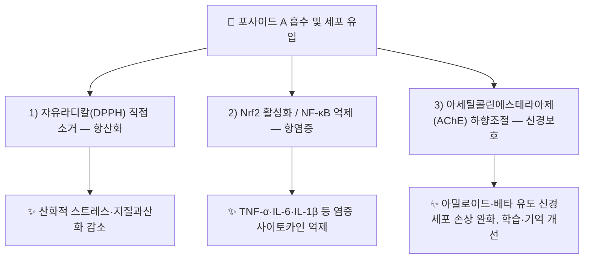

# 🔬 [[포사이드 A]] (Forsythoside A, Forsythiaside / C₂₉H₃₆O₁₅)

> **핵심 3줄 요약 (Key Summary)**:
> - 🌿 기원 본초 & 화학 계열: [[연교]](連翹, *Forsythia suspensa* 열매)의 대표 지표 성분으로 알려진 카페오일 페닐에탄오이드 배당체(Caffeoyl Phenylethanoid Glycoside, CPhG) 계열 화합물. 하이드록시타이로솔 배당체 골격에 카페오일기가 결합된 구조로, [[악티오사이드]](Verbascoside)와 같은 CPhG 계열에 속함.
> - 🎯 핵심 분자 표적 & 조절 경로: 자유라디칼(DPPH) 직접 소거를 통한 항산화, Nrf2 활성화·NF-κB 억제를 통한 항염증(폐 염증 동물모델), 아세틸콜린에스테라아제(AChE) 하향조절을 통한 신경보호.
> - 🩺 주요 약리 활성 & 질환 치료 기전: 대장균·녹농균·황색포도상구균에 대한 항균 활성, 담배연기 유발 폐 염증(COPD 모델)에서의 염증 사이토카인(TNF-α·IL-6·IL-1β) 억제, 아밀로이드-베타 유도 신경세포(PC12) 손상 완화 및 노화가속 마우스(SAMP8)의 학습·기억 개선.
> - ⚠️ 독성·생체이용률 한계 & 상호작용: 경구 생체이용률, CYP450 대사 간섭, 양약과의 정량적 상호작용 데이터는 검색 범위 내에서 확인하지 못했습니다(⚠️ 확인 필요).

---

## 📌 목차
1. [기본 화학 정보 & 분자 구조식 (Chemical Identity)](#1-기본-화학-정보--분자-구조식-chemical-identity)
2. [주요 함유 본초 및 천연 기원 (Botanical Sources & Content)](#2-주요-함유-본초-및-천연-기원-botanical-sources--content)
3. [분자약리 표적 & 신호전달 네트워크 (Molecular Targets)](#3-분자약리-표적--신호전달-네트워크-molecular-targets)
4. [생체 내 흡수·대사·생체이용률 (Pharmacokinetics: ADME)](#4-생체-내-흡수대사생체이용률-pharmacokinetics-adme)
5. [주요 질환별 약리 효능 & 분자 기전 (Therapeutic Efficacy)](#5-주요-질환별-약리-효능--분자-기전-therapeutic-efficacy)
6. [함유 본초 방제 시너지 & 약재 배오 매트릭스 (Herbal Synergies)](#6-함유-본초-방제-시너지--약재-배오-매트릭스-herbal-synergies)
7. [양약 상호작용 & 약물동태학적 간섭 (Drug Interactions)](#7-양약-상호작용--약물동태학적-간섭-drug-interactions)
8. [💡 사용자 진료실 핵심 필기 & 임상 응용 팁 (Melt-In & High-Yield)](#8--사용자-진료실-핵심-필기--임상-응용-팁-melt-in--high-yield)
9. [출처 및 학술 참고 문헌 (References)](#9-출처-및-학술-참고-문헌-references)

---
## 1. 기본 화학 정보 & 분자 구조식 (Chemical Identity)

> [!abstract]+ 🧪 3D 약리 분자 구조 (Interactive 3D Viewer)
> <iframe src="https://molecule-viewer-rho.vercel.app/?cid=5281773" width="100%" height="450px" frameborder="0" allow="webgl" style="border-radius: 8px;"></iframe>

| 항목 | 상세 내용 |
| :--- | :--- |
| **분자식 / 분자량** | C₂₉H₃₆O₁₅ / 624.6 g/mol |
| **PubChem CID** | [5281773](https://pubchem.ncbi.nlm.nih.gov/compound/5281773) (명칭 Forsythiaside로 등재 — CAS·분자식 일치 확인) |
| **CAS 등록 번호** | 79916-77-1 |
| **화학 골격 분류** | 카페오일 페닐에탄오이드 배당체(Caffeoyl Phenylethanoid Glycoside, CPhG) — [[악티오사이드]](Verbascoside)와 유사한 하이드록시타이로솔·카페오일·배당당 결합 구조 |
| **물리화학적 성상** | 수용성 배당체, 백색~담황색 분말로 보고됨(⚠️ 세부 물성 수치는 확인 필요) |

---

## 2. 주요 함유 본초 및 천연 기원 (Botanical Sources & Content)

| 함유 본초 (한글/한자) | 기원 식물학적 명칭 (과명 / 학명) | 주요 함유 약용 부위 | 지표 함량 (%) | 한의학적 귀경 및 약효 특성 |
| :--- | :--- | :--- | :--- | :--- |
| [[연교]] (連翹) | 물푸레나무과(Oleaceae) / *Forsythia suspensa* (Thunb.) Vahl | 익은 열매(과실) | ⚠️ 정량 함량 수치 확인 필요(중국약전 등 공정서 지표성분으로 보고되는 경우가 많음) | 폐·심·소장경 / 청열해독(淸熱解毒), 소종산결(消腫散結) |

---

## 3. 분자약리 표적 & 신호전달 네트워크 (Molecular Targets)

### 1) 항균·항산화
* 대장균(E. coli)·녹농균(P. aeruginosa)·황색포도상구균(S. aureus)에 대해 각각 MIC 38.33, 38.33, 76.67 µg/mL의 항균 활성이 보고됨(Qu et al. 2008).
* DPPH 라디칼 소거 EC50 6.3 µg/mL로 강한 항산화 활성이 확인됨(Qu et al. 2008).

### 2) Nrf2 활성화 / NF-κB 억제를 통한 항염증 (COPD 동물모델)
* 담배연기로 유발한 마우스 폐 염증 모델에서 기관지폐포세척액(BALF) 내 TNF-α·IL-6·IL-1β 증가를 억제하고 중성구·대식세포 침윤을 감소시켰으며, 이 과정에 Nrf2 활성화와 NF-κB 억제가 관여하는 것으로 보고됨(Cheng et al. 2015).

### 3) 신경보호 — 아세틸콜린에스테라아제 하향조절
* PC12 신경세포에서 아밀로이드-베타(25-35) 유도 세포자멸사를 아세틸콜린에스테라아제 하향조절을 통해 완화함(Yan et al. 2017).
* 노화가속 마우스(SAMP8)의 모리스 수중미로(Morris water maze) 탈출 지연시간을 단축시켜 학습·기억 개선 효과를 보임(Wang et al. 2013, 원 노트는 Forsythiaside로 표기).

---

## 4. 생체 내 흡수·대사·생체이용률 (Pharmacokinetics: ADME)

* ⚠️ 확인 필요: [[악티오사이드]] 등 동일 CPhG 계열 화합물은 경구 생체이용률이 낮은 것으로 알려져 있으나(PMID 35724511), 포사이드 A 자체의 정량 ADME 데이터(F%, 반감기, CYP 대사 여부)는 이번 조사 범위에서 확인하지 못했습니다.

---

## 5. 주요 질환별 약리 효능 & 분자 기전 (Therapeutic Efficacy)

### 1) 호흡기 감염·염증 (COPD 모델)
* 흡연 유발 폐 염증 동물모델에서 Nrf2/NF-κB 경로를 통한 항염증 효과 확인(Cheng et al. 2015) — [[연교]]의 청열해독 효능과 상응.

### 2) 세균 감염
* 대장균·녹농균·황색포도상구균에 대한 직접 항균 활성(Qu et al. 2008).

### 3) 신경퇴행·인지기능
* 아밀로이드-베타 유도 신경세포 손상 완화(Yan et al. 2017) 및 노화가속 마우스 학습·기억 개선(Wang et al. 2013).

---

## 6. 함유 본초 방제 시너지 & 약재 배오 매트릭스 (Herbal Synergies)

| 함유 본초 / 방제 | 공존 유효 성분군 | 분자약리 시너지 기전 | 전통 한의학적 효능 연계 |
| :--- | :--- | :--- | :--- |
| [[연교]] | 필릴린(Phillyrin) 등 리그난류 | 포사이드 A·필릴린 공존에 의한 항균·항염증 상승 가능성(⚠️ 직접 병용 연구 미확인, Qu et al. 2008은 두 성분을 함께 분리·평가) | 청열해독(淸熱解毒), 소종산결(消腫散結) |

---

## 7. 양약 상호작용 & 약물동태학적 간섭 (Drug Interactions)

* ⚠️ 확인 필요: 포사이드 A와 특정 양약 간의 임상적 상호작용을 직접 다룬 문헌은 검색 범위 내에서 확인하지 못했습니다. 항산화·항염증 기전상 다른 항산화제·항염증 양약과의 상가 작용 가능성은 이론적으로 존재하나(⚠️ 추정), 실측 근거는 아닙니다.

---

## 8. 💡 사용자 진료실 핵심 필기 & 임상 응용 팁 (Melt-In & High-Yield)

* ⚠️ 내용 검토 필요: 원장님의 진료실 필기가 아직 반영되지 않았습니다. [[연교]] 처방 시 포사이드 A 관련 임상 노트를 추가해 주시면 다음 순찰 시 정리해 드리겠습니다.

---

## 9. 출처 및 학술 참고 문헌 (References)

1. **Qu H, Zhang Y, Wang Y, Li B, Sun W. (2008)**. *Antioxidant and antibacterial activity of two compounds (forsythiaside and forsythin) isolated from Forsythia suspensa*. **Journal of Pharmacy and Pharmacology**, 60(2), 261-266.
   - ⚠️ PMID 확인 필요(검색 과정에서 PubMed 접속이 차단되어 PMID를 직접 대조하지 못했습니다 — 서지정보는 Cayman Chemical 제품 페이지에 인용된 2차 출처 기준).
   - **[연구 요약]**: 연교에서 분리한 forsythiaside(포사이드 A)와 forsythin의 항산화(DPPH EC50 6.3 µg/mL) 및 항균(대장균·녹농균·황색포도상구균 MIC) 활성을 정량 평가.
2. **Cheng L, et al. (2015)**. *Forsythiaside inhibits cigarette smoke-induced lung inflammation by activation of Nrf2 and inhibition of NF-κB*. **International Immunopharmacology**, 28(1), 494-499.
   - **[연구 요약]**: 흡연 유발 마우스 폐 염증 모델에서 Nrf2 활성화·NF-κB 억제를 통해 TNF-α·IL-6·IL-1β 및 염증세포 침윤을 감소시킴을 확인.
3. **Yan X, et al. (2017)**. *Protective effects of Forsythoside A on amyloid beta-induced apoptosis in PC12 cells by downregulating acetylcholinesterase*. **European Journal of Pharmacology**, 810, 141-148.
   - **[연구 요약]**: PC12 신경세포에서 아밀로이드-베타 유도 세포자멸사를 AChE 하향조절을 통해 완화함을 입증.
4. **Wang H-M, et al. (2013)**. *Neuroprotective effects of forsythiaside on learning and memory deficits in senescence-accelerated mouse prone (SAMP8) mice*. **Pharmacology, Biochemistry and Behavior**, 105, 134-141.
   - **[연구 요약]**: 노화가속 마우스(SAMP8)에서 forsythiaside(포사이드 A) 투여가 모리스 수중미로 학습·기억 수행을 개선함을 보고.

> ⚠️ 확인 불가/추정 표시 총괄: 인체 ADME 정량 데이터, 양약 상호작용 실측 자료, 연교 내 포사이드 A 정량 함량, 진료실 임상 필기, Qu 2008 논문의 정확한 PMID는 검색 범위 내에서 확인하지 못해 각 섹션에 개별 표시했습니다(PubMed 접속이 차단되어 대조 불가 — 다음 순찰 시 재확인 필요). PubChem CID 5281773은 CAS 79916-77-1·분자식 C29H36O15 일치로 교차 확인된 값입니다.

---
🏛️ **상위 허브**: [[00_약리성분_MOC]]
