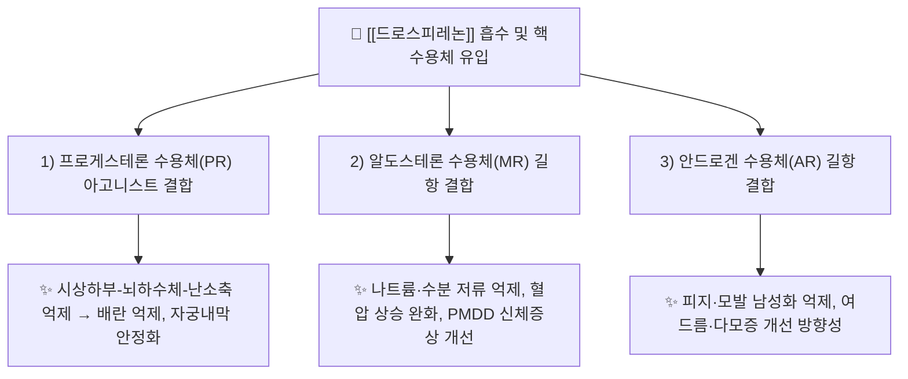

![[드로스피레논_낱알.jpg|540]]
> [그림 1: 식약처 의약품안전나라]

# 🔬 드로스피레논 (Drospirenone, C₂₄H₃₀O₃ / 스피로락톤 유도 프로게스틴)

> **핵심 3줄 요약 (Key Summary)**:
> - 🌿 기원 본초 & 화학 계열: **천연 본초 유래가 아닌 합성 스테로이드** 계열. 17α-스피로락톤(17α-spirolactone) 유도체로, 이뇨제 [[스피로놀락톤]](spironolactone)과 동일한 스테로이드 골격을 공유하는 **4세대(4th-generation) 프로게스틴**이다.
> - 🎯 핵심 분자 표적 & 조절 경로: [[프로게스테론 수용체]](PR) 아고니스트 활성을 중심으로, [[알도스테론 수용체]](MR) **길항(항알도스테론성)** 및 [[안드로겐 수용체]](AR) **길항(항안드로겐성)** 활성을 동시 보유한다.
> - 🩺 주요 약리 활성 & 질환 치료 기전: 배란 억제 및 자궁내막 안정화를 통한 **경구피임**, 황체기 호르몬 변동 억제를 통한 **월경전불쾌장애(PMDD)** 증상 완화, 항알도스테론 작용을 통한 **수분·나트륨 저류 억제**.
> - ⚠️ 독성·생체이용률 한계 & 상호작용: CYP3A4 의존적 간 대사로 **CYP3A4 유도제·억제제와의 병용 시 노출 변동 위험**. 에스트로겐 병용 제형에서는 **정맥혈전색전증(VTE) 위험**이 주요 안전성 이슈이며, 고혈압·비만·흡연 등 위험인자 동반 시 처방 전 평가가 필수.

---

## 📌 목차
1. [기본 화학 정보 & 분자 구조식 (Chemical Identity)](#1-기본-화학-정보--분자-구조식-chemical-identity)
2. [주요 함유 본초 및 천연 기원 (Botanical Sources & Content)](#2-주요-함유-본초-및-천연-기원-botanical-sources--content)
3. [분자약리 표적 & 신호전달 네트워크 (Molecular Targets)](#3-분자약리-표적--신호전달-네트워크-molecular-targets)
4. [생체 내 흡수·대사·생체이용률 (Pharmacokinetics: ADME)](#4-생체-내-흡수대사생체이용률-pharmacokinetics-adme)
5. [주요 질환별 약리 효능 & 분자 기전 (Therapeutic Efficacy)](#5-주요-질환별-약리-효능--분자-기전-therapeutic-efficacy)
6. [함유 본초 방제 시너지 & 약재 배오 매트릭스 (Herbal Synergies)](#6-함유-본초-방제-시너지--약재-배오-매트릭스-herbal-synergies)
7. [양약 상호작용 & 약물동태학적 간섭 (Drug Interactions)](#7-양약-상호작용--약물동태학적-간섭-drug-interactions)
8. [💡 사용자 진료실 핵심 필기 & 임상 응용 팁 (Melt-In & High-Yield)](#8--사용자-진료실-핵심-필기--임상-응용-팁-melt-in--high-yield)
9. [출처 및 학술 참고 문헌 (References)](#9-출처-및-학술-참고-문헌-references)
---

## 1. 기본 화학 정보 & 분자 구조식 (Chemical Identity)

> [!abstract]+ 🧪 3D 약리 분자 구조 (Interactive 3D Viewer)
> <iframe src="https://molecule-viewer-rho.vercel.app/?cid=68873" width="100%" height="450px" frameborder="0" allow="webgl" style="border-radius: 8px;"></iframe>

| 항목 | 상세 내용 |
| :--- | :--- |
| **IUPAC 명칭** | (6R,7R,8R,9S,10R,13S,14S,15S,16S)-1,2,3,4,6,7,8,9,10,11,12,13,14,15,16,17-hexadecahydro-10,13-dimethylspiro[17H-cyclopenta[a]phenanthrene-17,2'(5'H)-furan]-3,5'(2H)-dione *(PubChem 표기 기준, Δ6·3-옥소 스피로락톤 골격)* |
| **분자식 / 분자량** | C₂₄H₃₀O₃ / 366.49 g·mol⁻¹ |
| **PubChem CID** | [68873](https://pubchem.ncbi.nlm.nih.gov/compound/68873) |
| **CAS 등록 번호** | 67392-87-4 |
| **화학 골격 분류** | **합성 스테로이드(프레그난계 유도체)** — 17α-스피로락톤 골격. 천연 2차 대사산물 아님 |
| **물리화학적 성상** | 백색~미황색 결정성 분말(원료의약품). **지용성 강함(LogP ≈ 3.9~4.0 수준으로 보고, 정확값 근거 미확인)**, 물에 거의 불용. 광·습도에 다소 예민하며 제형(정제)으로서는 안정. 맛·미각 특성은 원문 근거 미확인 |
| **합성·생합성 경로** | 천연 생합성 경로 없음. **16α,17α-에폭시-프레그네놀론 유도체**에 스피로락톤 고리를 도입해 제조하는 반합성 공정 계열로 보고됨(세부 합성 캐스케이드는 원문 근거 미확인) |

> **참고(화학적 정체성 요약)**: 드로스피레논은 [[스피로놀락톤]]과 **동일한 계열의 스테로이드 구조적 유사체**로, 이 구조적 친화성이 항알도스테론·항안드로겐성이라는 드로스피레논 특유의 작용 스펙트럼을 낳는다(PMID: 36744531).

---

## 2. 주요 함유 본초 및 천연 기원 (Botanical Sources & Content)

> **⚠️ 기원 정정 안내**: 드로스피레논은 **합성 의약품(프로게스틴 원료의약품)**이며, 특정 천연 본초를 지표 성분으로 함유하지 않는다. 따라서 본 절의 "함유 본초" 표는 템플릿 구조를 유지하되 **해당사항 없음(Not Applicable)**으로 명시한다.

| 함유 본초 (한글/한자) | 기원 식물학적 명칭 (과명 / 학명) | 주요 함유 약용 부위 | 지표 함량 (%) | 한의학적 귀경 및 약효 특성 |
| :--- | :--- | :--- | :--- | :--- |
| **해당 없음 (합성 유도체)** | — (천연 기원 무관) | — | — | 한의학적 귀경 분류 적용 대상 아님 |
| 참고: [[스피로놀락톤]] | 합성 스테로이드계 이뇨제 | 원료합성 | — | 서의학 처방 성분 (한약 배오 대상 아님) |
| 참고: [[에스트에트롤]] | 합성 에스트로겐(제형 파트너) | 원료합성 | — | 복합 경구피임제 배합 성분 |

> 처방 상에서는 **[[에스트에트롤]](estetrol) 또는 [[에티닐에스트라디올]](ethinylestradiol)과의 복합 제형**, 또는 **단독 프로게스틴 전용 알약(POP)** 형태로 사용된다(PMID: 35781795, PMID: 36744531).

---

## 3. 분자약리 표적 & 신호전달 네트워크 (Molecular Targets)

### 1) 핵심 분자 표적 (Molecular Targets)

* **표적 1 — [[프로게스테론 수용체]](PR) 아고니스트 작용**: 드로스피레논은 내인성 프로게스테론과 유사한 친화도로 PR에 결합하여, 시상하부–뇌하수체 축에서 **GnRH/LH 서지(surge)를 억제**하고 배란 전 LH 급등을 차단한다. 자궁내막에서는 분비기 변화를 유발하여 착상을 억제하고, 자궁경부 점액을 점조화해 정자 통과를 저해한다. 이것이 **경구피임 효과의 1차 기전**이다(PMID: 35781795).
* **표적 2 — [[알도스테론 수용체]](MR) 길항 작용**: 스피로락톤 유래 골격 덕분에 MR 친화성이 높아, 에스트로겐 성분이 유발하는 **레닌-안지오텐신-알도스테론계(RAAS) 활성화 및 수분·나트륨 저류를 상쇄**한다. 이 작용이 여타 프로게스틴과 구별되는 드로스피레논의 부종 개선·혈압 안정 효과의 분자 기반이며, **월경전불쾌장애(PMDD)의 신체·정서 증상 개선**과도 연결된다(PMID: 37365881, PMID: 36744531).
* **표적 3 — [[안드로겐 수용체]](AR) 길항 작용**: AR 결합을 차단하여 안드로겐 의존성 말초 효과(피지 분비, 여드름, 체모 변화)를 억제하는 방향으로 작용한다. 다만 상기 세 표적에 대한 **정량적 결합친화도(Ki/IC₅₀)의 원문 수치는 본 노트가 인용한 논문에서 확인되지 않음(근거 미확인)**.

---

## 4. 생체 내 흡수·대사·생체이용률 (Pharmacokinetics: ADME)

* **장관 흡수 및 배출 펌프 (P-gp) 상호작용**:
  * 경구 투여 후 신속 흡수되며, **단독 프로게스틴 전용 알약(POP) 및 복합 제형 모두에서 전신 노출이 확보**된다는 약리·대사 비교 결과가 보고되었다(PMID: 36744531). 개별 P-gp(ABCB1) 유출 기질 여부에 대한 정량 데이터는 **근거 미확인**.
* **장내 미생물총(Microbiome) 대사 전환**:
  * 드로스피레논의 활성 대사체 전환에 장내 세균이 관여한다는 근거는 **미확인**. 장-간 순환(enterohepatic circulation) 역시 본 노트 인용 문헌에서 명시되지 않음.
* **간 대사 및 소실 반감기**:
  * **CYP3A4가 주요 대사 효소**로 보고되며, 대사체는 소변 및 대변으로 배설된다. 대사 비교 리뷰에서 드로스피레논의 **긴 반감기(복용 1일 1회로 안정 혈중농도 유지)** 및 대사 프로파일이 POP와 복합 제형 간에 실질적으로 유사함이 논의되었다(PMID: 36744531). 정확한 t₁/₂ 숫자값은 본 노트 인용 문헌에서 수치를 특정할 수 없어 **근거 미확인**.

---

## 5. 주요 질환별 약리 효능 & 분자 기전 (Therapeutic Efficacy)

### 1) 경구피임 (Oral Contraception)
* **에스트에트롤/드로스피레논 복합제**는 경구피임 적응증에 대해 검토된 제형으로, 배란 억제·자궁경부 점액 변화·자궁내막 변화의 삼중 기전에 의해 피임 효과를 발휘한다(PMID: 35781795, PMID: 40024362).
* 심혈관 위험인자를 가진 인구집단에서의 안전성 검토 연구에서도 해당 제형의 안전성 프로파일이 **위험인자별로 재확인**된 바 있다(PMID: 40024362).

### 2) 월경전불쾌장애(PMDD) & 월경전증후군(PMS)
* 드로스피레논 함유 경구피임제는 **황체기 호르몬 변동에 수반되는 정서·신체 증상을 완화**하는 방향으로 작용한다. Cochrane 체계적 문헌고찰(PMID: 37365881)에서는 드로스피레논 함유 경구피임제가 월경전증후군 증상 개선에 사용되는 근거를 검토하였다. **개별 임상시험의 효과크기·NNT 등 정량값은 원문 대조 필요(근거 미확인)**.

### 3) 체액·전해질 및 대사 프로파일 개선
* 항알도스테론 활성에 의해 **부종·체중 증가 등 에스트로겐 유발성 체액 저류를 완화**하는 방향으로 작용한다(PMID: 36744531).
* POP(프로게스틴 단독) 제형과 복합 제형 간 **약리·대사 효과의 비교**가 정리되어 있으며, 에스트로겐 유무에 따른 대사 지표 차이가 논의되었다(PMID: 36744531).

---

## 6. 함유 본초 방제 시너지 & 약재 배오 매트릭스 (Herbal Synergies)

> **⚠️ 안내**: 드로스피레논은 합성 의약품으로 한약 방제 배오 대상이 아니다. 다만 **제형 내 파트너 성분과의 배합 시너지**를 템플릿 구조에 맞추어 정리한다.

| 배합 제형 / 파트너 성분 | 공존 유효 성분군 | 분자약리 시너지 기전 | 임상 활용 연계 |
| :--- | :--- | :--- | :--- |
| **[[에스트에트롤]]/드로스피레논** | 천연형 에스트로겐(에스트에트롤) + 4세대 프로게스틴 | 에스트로겐의 자궁내막 자극을 프로게스틴이 상쇄, 항알도스테론성이 체액 저류 완화 | 경구피임, 심혈관 위험인자군 안전성 검토(PMID: 35781795, PMID: 40024362) |
| **[[에티닐에스트라디올]]/드로스피레논** | 합성 에스트로겐 + 드로스피레논 | 배란 억제 + 항안드로겐·항알도스테론 상승작용 | PMDD/PMS 증상 조절(PMID: 37365881) |
| **드로스피레논 단독(POP)** | 프로게스틴 단독 | 에스트로겐 없이 PR 매개 자궁경부·자궁내막 변화, 항알도스테론성 유지 | 에스트로겐 사용 제한 환자 대안(PMID: 36744531) |

---

## 7. 양약 상호작용 & 약물동태학적 간섭 (Drug Interactions)

* **CYP450 효소 간섭**:
  * **CYP3A4**가 주요 대사 경로이므로, 강력한 CYP3A4 유도제(예: 리팜핀, 일부 항경련제)와 병용 시 드로스피레논 노출 감소 및 피임 효과 저하 우려가 있으며, 강력한 CYP3A4 억제제는 노출 증가 가능성이 있다. 구체적 AUC 변동률은 본 노트 인용 문헌에서 수치로 제시되지 않아 **근거 미확인**.
* **유사 기전 양약 병용 시 고려사항**:
  * **항알도스테론 활성 중복**: 칼륨보존성 이뇨제, ACE 억제제, ARB, 알도스테론 길항제(스피로놀락톤 등)와 병용 시 **고칼륨혈증 위험**을 고려해야 하며, 신기능 저하 환자에서는 특히 주의한다.
  * **에스트로겐 관련 혈전 위험**: 복합 제형 사용 시 정맥혈전색전증(VTE) 위험을 높이는 병용 약물·상황(흡연, 비만, 장기 고정)을 함께 평가해야 하며, 심혈관 위험인자 보유군의 안전성 데이터가 별도로 검토되었다(PMID: 40024362).
  * **프로게스틴 단독 vs 복합 제형**: 에스트로겐 병용 여부에 따라 대사·약리 프로파일이 달라지므로, 환자 위험도에 따라 제형을 선택한다(PMID: 36744531).

---

## 8. 💡 사용자 진료실 핵심 필기 & 임상 응용 팁 (Melt-In & High-Yield)

* **사용자 원문 필기 (핵심 개념 융합)**:
  * 드로스피레논 = **"스피로락톤 골격의 4세대 프로게스틴"**. 즉 프로게스틴이지만 **이뇨제(스피로락톤) 유전자를 물려받아 항알도스테론·항안드로겐성이 강한 것이 최대 특징**.
  * 임상 선택 포인트: **부종·체중증가·여드름·PMS/PMDD 동반 환자**에서 다른 프로게스틴 대비 상대적 이점이 있다.
  * **단독 POP vs 복합 제형**의 대사 프로파일 차이(에스트로겐 유무)가 환자 맞춤 처방의 핵심 변수.
* **진료실 실전 처방 & 복용 극대화 팁**:
  1. **위험인자 스크리닝 노하우**: 복합 제형 시작 전 **혈압·흡연·BMI·편두통(aura 동반 여부)·VTE 병력**을 확인하고, 해당 인자 동반 시 프로게스틴 단독 제형으로 대안을 검토한다(PMID: 40024362, PMID: 36744531).
  2. **증상별·체질별 맞춤 적용**: 에스트로겐 과잉성 증상(부종, 유방통, 정서 기복)이 두드러지는 환자에서 항알도스테론성을 가진 드로스피레논 제형이 유리한 방향. 단, **고칼륨혈증·신기능 저하**가 있는 환자에서는 항알도스테론 작용을 감안해 주의한다.
  3. **복용 순응도 관리**: 1일 1회 투여로 안정 혈중농도가 유지되는 반감기 특성을 활용하되, 복용 시간을 일정하게 유지하도록 교육(PMID: 36744531).

---

## 9. 출처 및 학술 참고 문헌 (References)

1. **Lee A, Syed YY (2022)**. *Estetrol/Drospirenone: A Review in Oral Contraception*. **Drugs**. PMID: 35781795
   - **[연구 요약]**: 에스트에트롤/드로스피레논 복합 경구피임제의 약리·임상·안전성 프로파일 종합 리뷰. 배란 억제 및 피임 효과의 근거, 제형 특성 요약.
2. **Ma S, Song SJ (2023)**. *Oral contraceptives containing drospirenone for premenstrual syndrome*. **Cochrane Database Syst Rev**. PMID: 37365881
   - **[연구 요약]**: 드로스피레논 함유 경구피임제의 월경전증후군(PMS) 증상 개선 효과에 대한 체계적 문헌고찰.
3. **Regidor PA, Mueller A (2023)**. *Pharmacological and metabolic effects of drospirenone as a progestin-only pill compared to combined formulations with estrogen*. **Womens Health (Lond)**. PMID: 36744531
   - **[연구 요약]**: 드로스피레논의 프로게스틴 단독 제형(POP)과 에스트로겐 복합 제형 간 약리·대사 효과 비교. 항알도스테론·항안드로겐성 및 대사 프로파일 차이 정리.
4. **Creinin MD, Foidart JM (2025)**. *Estetrol/Drospirenone safety in a population with cardiovascular risk factors*. **Contraception**. PMID: 40024362
   - **[연구 요약]**: 심혈관 위험인자를 동반한 인구집단에서 에스트에트롤/드로스피레논 제형의 안전성 검토.

> ※ 본 노트의 5·6번 계획 항목은 1·3번 문헌의 중복(각각 PMID: 35781795, PMID: 36744531)으로 확인되어 참고문헌 목록에서 통합하였다.

<!-- 보관 태그(1회용·링크오류, 필요시 복원): 프로게스틴, 4세대프로게스틴, 항알도스테론, 항안드로겐, PMDD, 야즈 -->
