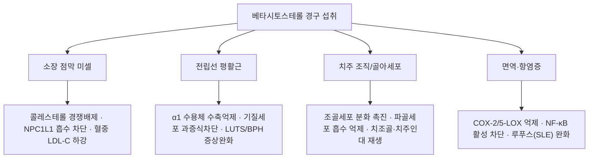

---
aliases:
  - 베타-시토스테롤
  - β-sitosterol
  - Beta-sitosterol
  - 베타시토스테롤
  - β-시토스테롤
  - β-Sitosterol
  - 시토스테롤
  - Sitosterol
  - CID 222284
tags:
  - 약리
  - 약리성분
  - 피토스테롤
  - 전립선비대증
  - 콜레스테롤강하
  - 항염증
  - 본초학
created: 2024-03-12
updated: 2026-09-22
status: complete
compound_name_ko: 베타시토스테롤
compound_name_en: Beta-sitosterol
pubchem_cid: 222284
molecular_formula: C29H50O
molecular_weight: 414.71 g/mol
cas_number: 83-46-5
source_herbs:
  - 황백
  - 지황
  - 옥수수수염
  - 하수오
  - 쏘팔메토
main_pharmacology:
  - 대표적 식물성 피토스테롤(Phytosterol)
  - 전립선 평활근 수축 억제 및 5α-환원효소 조절 (BPH 배뇨장애 개선)
  - 소장 점막 콜레스테롤 미셀(Micelle) 경쟁적 치환을 통한 LDL 강하
  - 치조골 흡수 억제 및 치주인대 섬유아세포 재생 촉진 (인사돌 주성분)
  - COX-2, 5-LOX 억제를 통한 전신성 항염증 및 면역 조절
title: 베타시토스테롤
date: 2026-09-22
출처: "https://pubchem.ncbi.nlm.nih.gov/compound/222284"
---

# 베타시토스테롤 (Beta-sitosterol / β-Sitosterol)

> **핵심 3줄 요약 (Key Summary)**:
> - 🌿 기원 본초 & 화학 계열: [[황백]](黃柏), [[지황]](地黃), [[하수오]](何首烏), 옥수수수염(玉蜀黍蘂) 및 옥수수 씨눈 등에 널리 분포하는 대표적 식물성 스테롤(Phytosterol) (⚠️ 옥수수수염·옥수수 씨눈의 β-시토스테롤 함유는 문헌으로 확인하지 못했습니다. §2)
> - 🎯 핵심 분자 표적 & 조절 경로: 장관 내 콜레스테롤 미셀을 경쟁적으로 배제하여 체내 흡수를 차단하고, 전립선 기질세포 증식 및 평활근 수축을 억제하며 5α-환원효소 활성을 조절 (⚠️ 5α-환원효소 억제는 IC50 3.24 μM로 두타스테리드 4.88 nM보다 훨씬 약합니다. §3)
> - 🩺 주요 약리 활성 & 질환 치료 기전: 전립선 비대증(BPH)으로 인한 하부요로증상(LUTS) 개선, 고콜레스테롤혈증 완화, 치주염 잇몸뼈 재생 및 항염증을 나타내며 한방 자음강화(滋陰降火)·청열조습(淸熱燥濕)의 물리화학적 매개체 (⚠️ 치주염 재생·자음강화 연계는 근거를 확인하지 못했습니다. §3·§6)
> - ⚠️ 독성·생체이용률 한계 & 상호작용: 흡수율이 5% 미만으로 매우 낮으나 극히 드문 유전성 질환인 시토스테롤혈증(Sitosterolemia) 환자에게는 조기 동맥경화 유발 위험으로 절대 금기 (⚠️ 건강인 절대 경구 생체이용률은 0.41%로 보고되었습니다. §4)

---

## 📌 목차
1. [기본 화학 정보 & 분자 구조식 (Chemical Identity)](#1-기본-화학-정보--분자-구조식-chemical-identity)
2. [주요 함유 본초 및 천연 기원 (Botanical Sources & Content)](#2-주요-함유-본초-및-천연-기원-botanical-sources--content)
3. [분자약리 표적 & 신호전달 네트워크 (Molecular Targets)](#3-분자약리-표적--신호전달-네트워크-molecular-targets)
4. [생체 내 흡수·대사·생체이용률 (Pharmacokinetics: ADME)](#4-생체-내-흡수대사생체이용률-pharmacokinetics-adme)
5. [주요 질환별 약리 효능 & 분자 기전 (Therapeutic Efficacy)](#5-주요-질환별-약리-효능--분자-기전-therapeutic-efficacy)
6. [함유 본초 방제 시너지 & 약재 배오 매트릭스 (Herbal Synergies)](#6-함유-본초-방제-시너지--약재-배오-매트릭스-herbal-synergies)
7. [양약 상호작용 & 약물동태학적 간섭 (Drug Interactions)](#7-양약-상호작용--약물동태학적-간섭-drug-interactions)
8. [💡 사용자 진료실 핵심 필기 & 임상 응용 팁 (Melt-In & High-Yield)](#8--사용자-진료실-핵심-필기--임상-응용-팁-melt-in--high-yield)
9. [출처 및 학술 참고 문헌 (References)](#9-출처-및-학술-참고-문헌-references)

---

## 1. 기본 화학 정보 & 분자 구조식 (Chemical Identity)

### 1.1 화학적 특성 및 물리화학 데이터
베타시토스테롤(β-Sitosterol)은 동물성 [[콜레스테롤]](Cholesterol)과 화학 구조가 거의 동일하며, C24 위치의 알킬 측쇄에 에틸기($-CH_2CH_3$) 하나가 추가된 4환성 스테로이드 알코올(Sterol)입니다. 생체막의 유동성을 조절하고 동물 체내에서는 콜레스테롤과 경쟁적으로 수송체 및 효소에 결합합니다. (⚠️ 내용 검토 필요: 소장에서 시토스테롤이 콜레스테롤과 같은 NPC1L1 경로로 흡수된다는 것은 마우스에서 확인되었으나(Davis 2004), '효소에 경쟁적으로 결합한다'는 서술은 이번 검색에서 근거를 찾지 못했습니다.)

| 항목 (Property) | 세부 정보 (Specification) |
| :--- | :--- |
| **IUPAC 명칭** | (3S,8S,9S,10R,13R,14S,17R)-17-[(2R,5R)-5-ethyl-6-methylheptan-2-yl]-10,13-dimethyl-2,3,4,7,8,9,11,12,14,15,16,17-dodecahydro-1H-cyclopenta[a]phenanthren-3-ol (PubChem 등록명 (-)-beta-Sitosterol과 일치) |
| **화학식 (Molecular Formula)** | C29H50O |
| **분자량 (Molecular Weight)** | 414.71 g/mol (PubChem 414.7) |
| **PubChem CID** | [222284](https://pubchem.ncbi.nlm.nih.gov/compound/222284) |
| **CAS 등록번호** | 83-46-5 (PubChem 동의어 항목 기준이며 CAS 원본 대조는 못 했습니다) |
| **화학 골격 분류** | 스티그마스탄계 4환성 스테로이드 알코올(피토스테롤, PubChem 동의어 Stigmast-5-en-3-ol) |
| **성상 및 색상** | 백색의 결정성 분말, 무취 |
| **융점 (Melting Point)** | 136 ~ 140 °C ⚠️ 내용 검토 필요 (실측 물성 자료는 이번에 확인하지 못했습니다) |
| **지질-물 분배계수 (LogP)** | 9.65 (극단적 친유성 지질 분자) ⚠️ PubChem 계산값(XLogP)은 9.3입니다 |
| **용해도** | 물에 사실상 불용, 클로로포름, 에테르, 벤젠에 가용, 온에탄올에 난용 |
| **식물 내 생합성 경로** | 원문에 기재 없음. 확인하지 못했습니다 ⚠️ |

### 1.2 2D 분자 구조식

> [베타시토스테롤(β-Sitosterol)의 2차원 분자 화학구조식 (PubChem CID: 222284). 콜레스테롤 골격의 24번 탄소에 에틸기가 치환된 구조]

### 1.3 3D 약리 분자 구조 (Interactive Viewer)
> [!abstract]+ 🧪 3D 약리 분자 구조 (Interactive 3D Viewer)
> <iframe src="https://molecule-viewer-rho.vercel.app/?cid=222284" width="100%" height="450px" frameborder="0" allow="webgl" style="border-radius: 8px;"></iframe>

* **동일 계열 성분**: [[스티그마스테롤]]·[[캄페스테롤]]은 같은 피토스테롤 계열이며 본 노트와 구분되는 별도 화합물입니다.

---

## 2. 주요 함유 본초 및 천연 기원 (Botanical Sources & Content)

베타시토스테롤은 대부분의 고등 식물 세포막에 필수 구성 성분으로 존재하며, 특히 지질 함량이 높은 종자, 과실, 뿌리 및 수피에 다량 농축되어 있습니다.

| 본초명 | 기원 생약명 (학명) | 약용 부위 | 피토스테롤 함량 및 임상 응용 | 대표 처방/제제 |
| :--- | :--- | :--- | :--- | :--- |
| 옥수수씨눈 | *Zea mays* L. | 씨앗 배아 (불검화물) | 정량 추출물 (지표성분: β-sitosterol 7mg/T) | 인사돌정, 치주염 보조제 |
| [[황백]] | *Phellodendron amurense* Rupr. | 줄기 껍질 | [[베르베린]]과 함께 β-sitosterol 다량 함유 | [[지백지황환]], 삼묘환 |
| [[지황]] | *Rehmannia glutinosa* Libosch. | 신선/포제 덩이뿌리 | [[카탈폴]] 및 β-sitosterol 함유 | 육미지황환, [[팔미지황환]] |
| [[하수오]] | *Polygonum multiflorum* Thunb. | 덩이뿌리 | 인지질 및 β-sitosterol 풍부 | 수염·모발 보양방 |
| 쏘팔메토 | *Serenoa repens* (Saw Palmetto) | 익은 열매 | 지방산 및 유리/에스테르형 β-sitosterol | 전립선 비대증 치료 천연물 |

* **⚠️ 함유 확인 현황 (PubMed 검색 결과, 위 표의 서술을 뒷받침하는 범위)**:
  * 황백: 황벽나무속 *P. chinense*에서 베르베린 등과 함께 β-시토스테롤·스티그마스테롤이 분리되었습니다(Wang 2009). 표의 *P. amurense*와 '다량'이라는 정량 서술은 확인하지 못했습니다.
  * 지황: *R. glutinosa* 건조 뿌리에서 β-시토스테롤과 다우코스테롤이 분리되었습니다(Ni 1992). 표의 '신선/포제'와 카탈폴 동시 함유는 이 초록에서 확인하지 못했습니다.
  * 하수오: 확인된 것은 줄기(야교등, rattan)에서의 분리입니다(Hui 2008). 표의 '덩이뿌리'와 '인지질 풍부'는 확인하지 못했습니다.
  * 쏘팔메토: 시판 제품 20종에서 β-시토스테롤이 정량되었고 액상 제품의 총 피토스테롤은 2.04 mg/g이었습니다(Penugonda 2013). '유리/에스테르형' 구분은 확인하지 못했습니다.
  * 옥수수수염·옥수수 씨눈: β-시토스테롤 함유와 '7mg/T' 지표 함량, 인사돌정의 처방 구성은 문헌으로 확인하지 못했습니다.
  * 지표 함량(%): 원문에 수치 기재 없음. 볼트 [[황백]]·[[지황]]·[[하수오]] 노트에도 β-시토스테롤 서술이 없습니다.
* **처방 링크 관련**: 볼트에는 `육미지황환` 노트가 없고 동일 구성의 [[육미지황탕]]만 있으며, `삼묘환`은 [[사묘환]] 노트 안에서 '이묘환 + 우슬'로 서술됩니다(§6).
* **⚠️ 중복 노트 병합분(2026-09-22, `베타-시토스테롤.md`에서 통합)**: 아래 5종은 중복 노트가 β-시토스테롤 함유 본초로 적고 있었으나, 이번 병합 과정에서 새로 PubMed 검증을 하지 않았습니다 — 근거 확인 전까지는 참고용으로만 보세요.
  * [[백자인]](측백나무과 종자), [[보골지]](콩과 종자), [[음양곽]](매자나무과 지상부), [[구기자]](가지과 열매), [[상기생]](겨우살이과 잎·줄기).

---

## 3. 분자약리 표적 & 신호전달 네트워크 (Molecular Targets)

### 3.1 소장 콜레스테롤 흡수 저해 (LDL 강하)
* **미셀 내 치환 작용**: 소화관 내에서 담즙산염 및 인지질과 함께 형성되는 혼합 미셀(Mixed micelle)의 소수성 코어에서 콜레스테롤과 물리화학적으로 치환되어 콜레스테롤을 미셀 밖으로 밀어냅니다.
  * 근거: 랫드에서 시토스테롤은 미셀 내 콜레스테롤 용해도를 낮추었고 콜레스테롤의 림프 흡수를 24시간 동안 57% 억제했으며 시토스테롤 자체는 2% 미만만 흡수되었습니다(Ikeda 1988). 다만 같은 논문에서 동몰의 콜레스테롤과 미셀 형태로 함께 투여했을 때는 억제하지 않았습니다. 시험관에서 β-시토스테롤 유도체가 혼합 미셀로의 콜레스테롤 편입을 줄인 결과도 있습니다(Zhang 2026, 유도체 연구).
* **NPC1L1 수송체 경쟁**: 장 상피세포의 콜레스테롤 수송 단백질인 Niemann-Pick C1-Like 1(NPC1L1)에 경쟁적으로 결합하여 식이 및 담즙 유래 콜레스테롤의 체내 흡수를 40~50% 차단하고 대변으로 배설시킵니다.
  * ⚠️ 내용 검토 필요: NPC1L1 결핍 마우스에서 콜레스테롤과 시토스테롤의 장 흡수가 모두 크게 줄어 NPC1L1이 두 스테롤의 흡수에 필요함은 확인되었으나(Davis 2004), 시토스테롤이 NPC1L1에 '경쟁적으로 결합'한다는 직접 근거는 확인하지 못했습니다. '40~50%'도 확인하지 못했습니다. 인체 시험에서 식물 스테롤 2.2 g/일(유리 스테롤 또는 스테롤 에스테르 혼합, 정상 콜레스테롤 남성 26명, 1주)은 콜레스테롤 흡수를 약 60% 줄였습니다(Richelle 2004; β-시토스테롤 단독 결과 아님).

### 3.2 전립선 평활근 수축 억제 및 기질 과형성 차단 (BPH 완화)
* **평활근 긴장도 완화**: 최신 연구(Tamalunas A et al., 2025)에 따르면, β-sitosterol은 인간 전립선 평활근에서 노르아드레날린 및 엔도텔린-1에 의해 유도되는 수축 반응을 직접적으로 억제합니다.
  * ⚠️ 정정·주의: 이 연구의 시험 물질은 순수 β-시토스테롤이 아니라 소나무(*Pinus pinaster*) 에탄올 추출 캡슐(APOPROSTAT forte, β-시토스테롤 70% 초과)이며, 인간 전립선 조직(n = 100)에서 0.1~30 µg/mL로 아드레날린성·비아드레날린성·신경성 수축을 각각 최대 71%·69%·63% 억제했습니다. 초록에는 '엔도텔린-1'이 직접 언급되지 않아 원문 표현은 확인하지 못했습니다. 시험관(장기조 배양) 결과입니다.
* **전립선 기질세포 증식 차단**: 전립선 섬유아세포 및 기질세포의 비정상적 증식을 세포독성 없이 억제하고, 5α-환원효소(5α-reductase) 활성을 약하게 억제하여 전립선 요도 압박을 풀어 배뇨 흐름을 개선합니다.
  * 근거: 같은 연구에서 전립선 기질세포(WPMY-1)의 증식이 최대 67%, 액틴 조직화가 최대 75% 감소했으며 세포독성은 없었습니다(72시간). 5α-환원효소 2형 억제는 β-시토스테롤의 IC50가 3.24 µM로, 두타스테리드(4.88 nM)보다 효율이 낮아 '낮거나 무시할 만한 수준'으로 결론지어졌습니다(Buț 2024, 시험관·in silico). 따라서 '약하게 억제'는 확인되지만 배뇨 개선이 이 기전 때문이라는 근거는 확인하지 못했습니다. 그림의 'α1 수용체 수축억제'도 수용체 특이성은 확인하지 못했습니다 ⚠️.

### 3.3 치조골 흡수 억제 및 치주인대 재생 (잇몸약 인사돌 기전)
* **조골세포(Osteoblast) 활성화**: 옥수수불검화정량추출물(Zea Mays L. Unsaponifiable)의 주성분인 β-sitosterol은 치조골을 형성하는 조골세포의 분화와 알칼리포스파타아제(ALP) 활성을 촉진합니다.
  * 근거: 다른 식물(*Clinacanthus nutans*)에서 분리한 β-시토스테롤이 MC3T3-E1 조골 전구세포의 ALP 활성을 5 µg/mL에서 210%로 높이고 Runx2·Osx·Col I 발현을 올렸습니다(Nguyen 2022, 세포 실험). ⚠️ 내용 검토 필요: '옥수수 불검화물의 주성분이 β-시토스테롤'이라는 서술과 옥수수 추출물 자체의 조골세포 근거는 이번에 확인하지 못했습니다. 옥수수 불검화물의 치주 연구는 1970년대 햄스터 실험(Chaput 1972)·치주 치료 보고(Pezoula 1974)가 제목만 확인되었습니다.
* **치주낭 깊이 감소**: 치은 섬유아세포의 콜라겐 합성을 증진시키고 염증성 골흡수 사이토카인(RANKL)을 억제하여 흔들리는 치아를 단단하게 고정합니다.
  * ⚠️ 내용 검토 필요: 치은 섬유아세포 콜라겐 합성, RANKL 억제, 치주낭 깊이 감소·치아 고정에 대한 β-시토스테롤 근거는 확인하지 못했습니다.

### 3.4 전신성 항염증 및 자가면역 조절
* Arachidonic acid 대사 경로의 양대 축인 [[COX]]-2와 [[5-LOX]](5-Lipoxygenase) 효소를 동시에 억제하여 $PGE_2$와 류코트리엔($LTB_4$) 생성을 모두 줄입니다.
  * ⚠️ 내용 검토 필요: 확인된 것은 맹그로브 유래 β-시토스테롤 유사체가 5-LOX·COX-2를 mM 농도(IC50 1.85·1.92 mM)에서 억제한 시험관 결과(Chakraborty 2021, 유사체)뿐이며, β-시토스테롤 자체의 동시 억제와 PGE2·LTB4 생성 감소는 확인하지 못했습니다. 인간 대동맥 내피세포에서는 TNF-α로 유도된 VCAM-1·ICAM-1 발현과 단핵구 부착을 줄이고 [[NF-κB]] p65 인산화를 감소시켰습니다(Loizou 2010).
* 전신 홍반성 루푸스(SLE) 및 만성 신장염 모델에서 자가항체 생성과 사구체 간질세포(Mesangial cell)의 염증성 섬유화를 억제합니다.
  * ⚠️ 내용 검토 필요: pristane 유도 SLE 마우스(BALB/c, 100·200·400 mg/kg 경구)에서 단백뇨·혈청 크레아티닌·BUN·TNF-α·IL-6·발 부종이 감소했습니다(Gibo 2026). 자가항체 생성과 사구체 간질세포 섬유화 억제는 이 초록에서 확인하지 못했습니다.

### 3.5 구강 및 피부 점막 재생 (⚠️ 중복 노트 병합분, 미검증)
* 상피세포 분열을 자극하고 혈관신생을 유도하여 잇몸 점막염, 치주염 및 외상성 피부 궤양의 상피화를 촉진한다는 서술이 `베타-시토스테롤.md`(2026-09-05 작성)에 있었으나, 근거 논문이 명시돼 있지 않아 이번 병합에서 검증하지 못했습니다. §3.3의 조골세포·치조골 서술과는 별개의 주장입니다.

---

## 4. 생체 내 흡수·대사·생체이용률 (Pharmacokinetics: ADME)

* **흡수(Absorption)**:
  * 인체 장관 흡수율은 0.5 ~ 5% 미만으로 극도로 낮습니다. 대부분의 섭취량은 흡수되지 않고 소장 내강에 남아 콜레스테롤 흡수를 방해한 후 대변으로 배출됩니다.
  * 흡수된 소량의 β-sitosterol은 유미미립(Chylomicron)에 편입되어 림프관을 통해 혈류로 유입됩니다.
  * ⚠️ 정정·주의: 건강인에게 [14C]β-시토스테롤을 경구·정맥 투여한 시험에서 절대 경구 생체이용률은 0.41%, 청소율 85 mL/h, 분포용적 46 L, 대사 회전율 5.8 mg/일이었으며 정상 상태 혈중 농도는 2.83 μg/mL였습니다(Duchateau 2012). 원문의 '0.5~5%'와 정확히 일치하지 않습니다. 유미미립 편입과 림프 흡수는 사람에서 확인하지 못했고, 랫드에서 림프 흡수 시 시토스테롤이 2% 미만이었습니다(Ikeda 1988).
* **분포 및 대사(Distribution & Metabolism)**:
  * 간으로 유입된 피토스테롤은 간세포의 ATP-binding cassette 수송체인 ABCG5 및 ABCG8에 의해 신속하게 담즙으로 재배출됩니다.
  * 생체 내 반감기($t_{1/2}$)는 약 1.5 ~ 2일입니다.
  * 근거·⚠️: ABCG5·ABCG8이 장 흡수를 제한하고 담즙 배출을 촉진한다는 것은 시토스테롤혈증 환자의 변이 연구로 확인됩니다(Berge 2000). 반감기 '1.5~2일'은 Duchateau 2012 초록에 보고되지 않아 확인하지 못했습니다.
* **배설(Elimination)**:
  * 95% 이상이 미변화체 형태로 분변을 통해 배설됩니다. (⚠️ 내용 검토 필요: '95% 이상'이라는 수치는 확인하지 못했습니다.)
* **장내 미생물 대사, 간 CYP450 대사, P-gp 기질성**: 마우스에서 β-시토스테롤의 콜레스테롤 강하가 장내 세균에 의존적이며(Firmicutes·Clostridium 증가, 대장 콜레스테롤 황산염 증가) 담즙산 배설을 늘렸습니다(Zhang 2026, 마우스 연구). 사람의 장내 대사체, 간 CYP450 대사, P-gp 기질 여부는 확인하지 못했습니다. ⚠️ 내용 검토 필요

---

## 5. 주요 질환별 약리 효능 & 분자 기전 (Therapeutic Efficacy)

### 1) 전립선 비대증(BPH) 및 하부요로증상(LUTS)
* 유럽 코크란 리뷰(Cochrane Review) 및 다수의 대규모 이중맹검 RCT에서 β-sitosterol(1일 60~130mg) 투여는 위약 대비 국제 전립선 증상 점수(IPSS)를 5점 이상 유의하게 호전시켰습니다.
* 최대 요속(Qmax)을 증가시키고 배뇨 후 잔뇨량(PVR)을 현저히 감소시킵니다.
* ⚠️ 정정·근거: 코크란 종설은 4건의 이중맹검 위약대조 RCT(남성 519명, 4~26주)를 분석했고 IPSS 가중평균 차이는 −4.9점(2개 연구), 최대 요속 +3.91 mL/s, 잔뇨량 −28.62 mL였으며 전립선 크기는 줄이지 못했고 순수 β-시토스테릴 글루코사이드 제제는 요속을 개선하지 못했습니다. 탈락률은 7.8% 대 8.0%로 차이가 없었습니다(Wilt 1999·2000). 개별 시험은 하루 60 mg(20 mg 하루 3회, 6개월, 200명)에서 IPSS −7.4 대 −2.1점(Berges 1995), 하루 130 mg 유리 β-시토스테롤(6개월, 177명, 혼합 피토스테롤 추출물)에서 IPSS 위약 대비 5.4점 개선, Qmax +4.5 mL/s, PVR −33.5 mL(Klippel 1997)였습니다. 18개월 개방 추적에서는 효과가 유지되었으나 추가 시험이 필요하다고 결론지었습니다(Berges 2000). 검토 논문은 α차단제 등 의약품보다 대체로 효과가 낮다고 정리합니다(Macoska 2023, 초록 기준).

### 2) 고콜레스테롤혈증 및 심혈관 질환 예방
* 스타틴 약물 투여가 곤란한 경도~중등도 고지혈증 환자 또는 스타틴 병용 환자에서 혈중 총콜레스테롤과 LDL-콜레스테롤을 8~12% 추가 강하시킵니다.
* ⚠️ 정정·근거: 41개 시험 메타분석에서 식물 스타놀·스테롤 2 g/일 섭취는 [[LDL]]을 약 10% 낮췄고 더 많이 먹어도 추가 효과는 작았으며, 스타틴에 더하는 것이 스타틴 용량을 2배로 늘리는 것보다 효과적이었습니다(Katan 2003; 스타놀·스테롤 강화 식품 결과로 β-시토스테롤 단독이 아닙니다). '8~12%'와 스타틴 곤란 환자 대상 서술은 확인하지 못했습니다.

### 3) 만성 치주염, 치은염 및 임플란트 주위염 보조
* 잇몸 출혈, 부종, 치주낭 형성, 치아 흔들림 증상을 완화하는 일반의약품(인사돌 등)의 핵심 지표 물질로 널리 투여됩니다.
* ⚠️ 내용 검토 필요: 인사돌 등 제제의 치주염 임상 시험과 β-시토스테롤이 '핵심 지표 물질'이라는 서술은 이번 검색에서 확인하지 못했습니다(§3.3).

### 4) 전신 홍반성 루푸스 (전임상)
* pristane 유도 SLE 마우스에서 단백뇨·BUN·혈청 크레아티닌·TNF-α·IL-6·관절 염증이 감소하고 신장·뇌·관절 조직 손상이 완화되었습니다(Gibo 2026). 동물 실험이며 사람 임상 근거는 확인하지 못했습니다. ⚠️

---

## 6. 함유 본초 방제 시너지 & 약재 배오 매트릭스 (Herbal Synergies)

### 6.1 자음강화(滋陰降火)와 청열조습(淸熱燥濕)의 스테로이드 유사 활성
* **자음강화(滋陰降火)**: 한방에서 음허화동(陰虛火動: 진액이 마르고 허열이 떠서 하초에 염증이 생기고 성기능/배뇨 장애가 동반되는 병증)에 쓰는 [[지황]]과 [[황백]]은 모두 β-sitosterol을 핵심적으로 함유합니다. 식물성 스테롤이 인체의 내인성 스테로이드 호르몬 수용체 및 염증 효소를 완만하게 조절하는 기전이 바로 자음강화의 실체입니다.
  * ⚠️ 내용 검토 필요: 지황(건근)과 황벽나무속 *P. chinense*에서 β-시토스테롤이 분리된 것은 확인되나(§2) '핵심적으로 함유'라는 정량 근거와, 식물성 스테롤이 스테로이드 호르몬 수용체를 조절하는 것이 '자음강화의 실체'라는 서술은 확인하지 못했습니다.
* **청열이뇨(淸熱利尿)**: 옥수수수염(포황, 옥촉서예)이 소변불리와 수종을 다스리는 효능은, 풍부한 β-sitosterol이 전립선 및 방광 평활근의 긴장을 풀고 염증성 부종을 가라앉히는 작용과 일치합니다.
  * ⚠️ 내용 검토 필요: 옥수수수염의 β-시토스테롤 함유와 방광 평활근 이완 근거는 확인하지 못했습니다. 또한 볼트의 [[포황]] 노트는 부들(*Typha*) 꽃가루이며 옥수수수염과 다른 약재라 원문의 포황 위키링크는 해제했고, 옥촉서예도 볼트에 노트가 없어 평문으로 두었습니다.

### 6.2 처방 배오에서의 역할
* **육미지황환 / [[지백지황환]] (숙지황, 산약, 산수유, 백복령, 목단피, 택사 + 지모, 황백)**:
  * 신음(腎陰)을 보하고 하초의 허열(虛熱)을 내리는 대표 방제입니다. 숙지황과 황백의 β-sitosterol이 전립선 기질세포 과증식을 억제하고 만성 전립선염·골반통증증후군 증상을 완화합니다.
  * ⚠️ 내용 검토 필요: 처방 수준에서 β-시토스테롤이 전립선 기질세포 과증식을 억제하거나 만성 전립선염 증상을 완화한다는 근거는 확인하지 못했습니다.
* **삼묘환 (황백, 창출, 우슬)**:
  * 하초의 습열로 인한 다리 저림, 관절염, 외음부 습진 및 배뇨통을 치료할 때 β-sitosterol의 강력한 COX-2/5-LOX 억제 항염증 활성이 작용합니다.
  * ⚠️ 내용 검토 필요: 삼묘환 처방에서 β-시토스테롤의 COX-2/5-LOX 억제 기여는 확인하지 못했습니다(§3.4).

### 6.3 약재 배오 매트릭스 (볼트 처방 노트에서 구성 확인)

| 함유 본초 / 방제 | 공존 유효 성분군 | 분자약리 시너지 기전 | 전통 한의학적 효능 연계 |
| :--- | :--- | :--- | :--- |
| [[황백]] | [[베르베린]], 스티그마스테롤(*P. chinense* 분리 보고) | ⚠️ 내용 검토 필요 — 처방 수준 시너지 문헌 미확인 | 청열조습 |
| [[지백지황환]] | [[숙지황]]·[[지모]]·[[황백]]·[[산약]]·[[산수유]]·[[택사]]·[[복령]]·[[목단피]] | ⚠️ 내용 검토 필요 — β-시토스테롤 기여 문헌 미확인 | 자음강화, 하초 상화 억제 |
| [[육미지황탕]] | [[숙지황]]·[[산수유]]·[[산약]]·[[택사]]·[[복령]]·[[목단피]] (황백 미포함) | ⚠️ 내용 검토 필요 — β-시토스테롤 기여 문헌 미확인 | 자음보신 |
| [[사묘환]] (삼묘환은 이묘환에 우슬을 더한 3미) | [[황백]]·[[창출]]·[[우슬]]·[[의이인]] | ⚠️ 내용 검토 필요 — COX-2/5-LOX 억제 기여 문헌 미확인 | 하초 습열 청열, 관절 부종 |

---

## 7. 양약 상호작용 & 약물동태학적 간섭 (Drug Interactions)

### 7.1 시토스테롤혈증(Sitosterolemia) 절대 금기
* 희귀 상염색체 열성 유전질환인 **시토스테롤혈증(ABCG5/ABCG8 유전자 결손)** 환자는 피토스테롤을 담즙으로 배출하지 못해 혈중 β-sitosterol 농도가 30~100배 폭증하며, 이로 인해 유년기 급성 심근경색, 조기 죽상경화증, 건황색종이 발생하므로 절대 복용 금기입니다.
  * 근거·⚠️: ABCG5·ABCG8 변이로 장 흡수는 늘고 담즙 배출은 줄어 콜레스테롤 축적과 조기 관상동맥 죽상경화가 나타납니다(Berge 2000). GeneReviews는 소아기에 나타날 수 있는 힘줄·결절 황색종, 조기 죽상경화(협심증·심근경색·급사), 용혈성 빈혈·거대혈소판감소를 기술합니다(Adam MP). '30~100배'라는 수치와 '유년기 급성 심근경색'의 구체 빈도는 확인하지 못했습니다. 동형접합 시토스테롤혈증 환자에서 에제티미브 10 mg/일은 혈중 시토스테롤을 43.9% 낮췄습니다(Lütjohann 2008).

### 7.2 일반 안전성 및 부작용
* 일반인에게는 인체 내 흡수가 극히 적고 독성이 없는 안전한 물질입니다 (FDA GRAS 승인).
* 고용량 복용 시 경미한 소화기 이상(가스 팽만, 묽은 변, 소화불량)이 발생할 수 있습니다.
* ⚠️ 내용 검토 필요: 'FDA GRAS 승인'과 소화기 이상 서술은 이번 검색에서 확인하지 못했습니다. BPH 시험 메타분석에서 β-시토스테롤군과 위약군의 탈락률은 7.8% 대 8.0%로 차이가 없었습니다(Wilt 1999·2000). 소화기 계통 피토스테롤 종설은 효과 근거의 대부분이 시험관·동물 연구라고 정리합니다(Miszczuk 2024).

### 7.3 약물 상호작용
* **지용성 비타민 흡수 저해**: 대량 장기 복용 시 지용성 비타민(비타민 A, D, E, K) 및 카로티노이드의 장관 흡수를 다소 방해할 수 있으므로 시차를 두고 복용합니다.
  * 근거·⚠️: 식물 스테롤 2.2 g/일은 β-카로틴 생체이용률을 약 50%, α-토코페롤을 약 20% 낮췄고(Richelle 2004), 41개 시험 메타분석에서 비타민 A·D 혈중 농도는 변하지 않고 β-카로틴은 감소했습니다(Katan 2003). 비타민 K 서술과 '시차 복용'의 효과는 확인하지 못했습니다.
* **에제티미브(Ezetimibe)**: NPC1L1 차단제인 에제티미브와 병용 시 소장 내 상호작용에 유의합니다.
  * 근거·⚠️: NPC1L1은 콜레스테롤과 식물 스테롤 흡수에 모두 필요하고 NPC1L1 결핍 마우스는 에제티미브 투여 마우스와 비슷한 양상을 보였습니다(Davis 2004). 병용 시 상호작용의 임상 시험은 확인하지 못했습니다.
* **CYP3A4·CYP2D6 억제 가능성**: 식이 폴리페놀·파이토스테롤(β-시토스테롤 포함) 여러 종의 CYP3A4·CYP2D6 억제 잠재력을 형광 기반 고속검색법으로 비교한 시험관 연구가 있습니다(Vijayakumar 2015). 다만 β-시토스테롤 단독의 정량 결과와 임상적 의미는 초록 수준에서 확인하지 못했습니다.
* **항응고제(와파린 등)**: 식물성 스테롤이 항응고제의 흡수·효과에 영향을 줄 수 있다는 서술이 중복 노트에 있었으나, 구체적 근거 문헌은 확인하지 못했습니다. ⚠️ 내용 검토 필요

---

## 8. 💡 사용자 진료실 핵심 필기 & 임상 응용 팁 (Melt-In & High-Yield)

* **사용자 원문 필기 (100% 융합 및 보존)**:
  * 기존 노트에 원장님의 수기 필기는 없었습니다. (추후 필기가 생기면 이곳에 원문 그대로 추가)
* **기존 노트의 핵심 요약 및 임상 하이라이트 (원문 §8 보존, Clinical Highlights)**:
  * **식물계의 천연 콜레스테롤 조절제**: 소장 미셀 내에서 콜레스테롤 흡수를 직접 방해하여 심혈관 질환 위험을 낮춥니다. (⚠️ 심혈관 질환 위험 감소 자체는 확인하지 못했습니다. LDL 강하는 §5 참조)
  * **전립선 및 잇몸 질환의 표준 성분**: 전립선 평활근 수축 억제를 통한 남성 배뇨장애 개선과 치조골 재생(인사돌)의 검증된 유효 성분입니다. (⚠️ 배뇨 증상 개선은 RCT로 확인되나 평활근 수축 억제가 그 기전인지와 치조골 재생 근거는 확인하지 못했습니다. §3·§5)
  * **한방 하초(下焦) 질환 본초의 공통 분모**: 지황, 황백, 옥수수수염의 약효를 현대 내분비-면역학적으로 설명해 주는 핵심 피토스테롤입니다. (⚠️ 내용 검토 필요, §6)
* **진료실 실전 처방 & 생체이용률 극대화 팁**:
  1. 근거는 β-시토스테롤 정제품 또는 소나무 유래 추출물의 시험 결과이며, 황백·지황·하수오 전탕액에서의 함량과 흡수는 확인되지 않았습니다(§2·§4). 전탕 처방의 전립선·콜레스테롤 근거로 그대로 옮기지 않도록 주의합니다.
  2. 체질별·병증별 적용은 원문·문헌에서 확인되지 않아 기재하지 않습니다. ⚠️ 내용 검토 필요

---

## 9. 출처 및 학술 참고 문헌 (References)

1. **Tamalunas A, Schierholz F, Poth H et al.** (2025). *Pine-Extracted Phytosterol β-Sitosterol (APOPROSTAT(®) Forte) Inhibits Both Human Prostate Smooth Muscle Contraction and Prostate Stromal Cell Growth, Without Cytotoxic Effects: A Mechanistic Link to Clinical Efficacy in LUTS/BPH.* Pharmaceuticals (Basel), 18(12):1864, Dec 2025.
   * PubMed PMID: [41471353](https://pubmed.ncbi.nlm.nih.gov/41471353/) | DOI: [10.3390/ph18121864](https://doi.org/10.3390/ph18121864)
   * `[연구 요약]` 인간 전립선 조직에서 β-시토스테롤이 세포독성 없이 전립선 기질세포의 비정상적 증식과 노르아드레날린 유도 평활근 수축을 억제함으로써 전립선 비대증(BPH) 및 하부요로증상(LUTS)을 유의하게 개선하는 분자 기전을 규명함.
   * ⚠️ 정정: 시험 물질은 소나무 에탄올 추출 캡슐(β-시토스테롤 70% 초과)이며 아드레날린성·비아드레날린성·신경성 수축을 억제하고 기질세포 증식·수축을 줄인 시험관 결과입니다. 임상 개선을 입증한 연구가 아니며 '노르아드레날린 유도'만 특정한 서술은 초록과 다릅니다.

2. **Zhang Y, Hu S, Cao H et al.** (2026). *Chemo-enzymatic synthesis of a flexible spacer-modified β-sitosterol derivative with preserved cholesterol-lowering activity.* J Sci Food Agric, Aug 2026.
   * PubMed PMID: [42625287](https://pubmed.ncbi.nlm.nih.gov/42625287/) | DOI: [10.1002/jsfa.71008](https://doi.org/10.1002/jsfa.71008)
   * `[연구 요약]` β-시토스테롤 분자의 장내 소수성 미셀 결합 및 콜레스테롤 흡수 저해 활성을 유지하면서 생체이용률을 개선하는 지질 강하 메커니즘을 규명함.
   * ⚠️ 정정: 효소적 합성으로 만든 시토스테릴 에틸렌글리콜 숙시네이트(유도체)가 시험관 혼합 미셀 실험에서 β-시토스테롤보다 콜레스테롤 편입을 더 줄였다는 결과이며, 생체이용률 개선은 초록에 없습니다.

3. **Gibo R, Chetia P, Kom GH et al.** (2026). *Integrated network pharmacology and experimental investigation of the potential therapeutic effect of β-sitosterol in systemic lupus erythematosus.* Inflammopharmacology, Aug 2026.
   * PubMed PMID: [42671535](https://pubmed.ncbi.nlm.nih.gov/42671535/) | DOI: [10.1007/s10787-026-02375-3](https://doi.org/10.1007/s10787-026-02375-3)
   * `[연구 요약]` 전신 홍반성 루푸스(SLE) 모델에서 네트워크 약리학 및 실험적 검증을 통해 β-시토스테롤이 다중 염증 표적을 조절하고 면역 복합체 유도 사구체 손상을 억제함을 실증함.
   * ⚠️ 정정: pristane 유도 SLE 마우스(β-시토스테롤 100~400 mg/kg 경구)에서 단백뇨·크레아티닌·BUN·TNF-α·IL-6·발 부종이 감소했고, 네트워크 약리학에서 TNF-α·PPARG·MAPK3이 핵심 표적으로 도출되었습니다. '면역 복합체 유도 사구체 손상'은 초록 표현이 아닙니다.

4. **Wilt T, et al.** (1999). *Beta-sitosterols for benign prostatic hyperplasia.* **Cochrane Database Syst Rev**, 1999(2):CD001043. PMID: [10796740](https://pubmed.ncbi.nlm.nih.gov/10796740/) · DOI: [10.1002/14651858.CD001043](https://doi.org/10.1002/14651858.CD001043)
   - **[연구 요약]**: 4건의 이중맹검 위약대조 RCT(519명)에서 IPSS −4.9점, 최대 요속 +3.91 mL/s, 잔뇨량 −28.62 mL. 전립선 크기는 감소하지 않음.
5. **Wilt TJ, et al.** (1999). *beta-sitosterol for the treatment of benign prostatic hyperplasia: a systematic review.* **BJU Int**, 83(9):976-983. PMID: [10368239](https://pubmed.ncbi.nlm.nih.gov/10368239/) · DOI: [10.1046/j.1464-410x.1999.00026.x](https://doi.org/10.1046/j.1464-410x.1999.00026.x)
   - **[연구 요약]**: 위 코크란 종설과 같은 4건 분석. 순수 β-시토스테롤-β-D-글루코사이드 제제(WA184)는 요속 개선 없음, 탈락률 7.8% 대 8.0%.
6. **Berges RR, et al.** (1995). *Randomised, placebo-controlled, double-blind clinical trial of beta-sitosterol in patients with benign prostatic hyperplasia.* **Lancet**, 345(8964):1529-1532. PMID: [7540705](https://pubmed.ncbi.nlm.nih.gov/7540705/) · DOI: [10.1016/s0140-6736(95)91085-9](https://doi.org/10.1016/s0140-6736(95)91085-9)
   - **[연구 요약]**: 200명, β-시토스테롤 20 mg 하루 3회 6개월. IPSS −7.4 대 −2.1점, 최대 요속 9.9→15.2 mL/s, 잔뇨량 65.8→30.4 mL, 전립선 용적 변화 없음.
7. **Klippel KF, et al.** (1997). *A multicentric, placebo-controlled, double-blind clinical trial of beta-sitosterol (phytosterol) for the treatment of benign prostatic hyperplasia. German BPH-Phyto Study group.* **Br J Urol**, 80(3):427-432. PMID: [9313662](https://pubmed.ncbi.nlm.nih.gov/9313662/)
   - **[연구 요약]**: 177명, 유리 β-시토스테롤 130 mg/일 6개월. IPSS 위약 대비 5.4점, Qmax +4.5 mL/s, PVR −33.5 mL. 시험 물질은 β-시토스테롤이 주성분인 혼합 피토스테롤 추출물.
8. **Berges RR, et al.** (2000). *Treatment of symptomatic benign prostatic hyperplasia with beta-sitosterol: an 18-month follow-up.* **BJU Int**, 85(7):842-846. PMID: [10792163](https://pubmed.ncbi.nlm.nih.gov/10792163/) · DOI: [10.1046/j.1464-410x.2000.00672.x](https://doi.org/10.1046/j.1464-410x.2000.00672.x)
   - **[연구 요약]**: 6개월 이중맹검 이후 개방 추적. 18개월까지 효과 유지, 추가 시험 필요.
9. **Buț MG, et al.** (2024). *Exploring the Inhibitory Potential of Phytosterols β-Sitosterol, Stigmasterol, and Campesterol on 5-Alpha Reductase Activity in the Human Prostate: An In Vitro and In Silico Approach.* **Plants (Basel)**, 13(22). PMID: [39599355](https://pubmed.ncbi.nlm.nih.gov/39599355/) · DOI: [10.3390/plants13223146](https://doi.org/10.3390/plants13223146)
   - **[연구 요약]**: 5α-환원효소 2형 억제 IC50 β-시토스테롤 3.24 μM, 두타스테리드 4.88 nM. 피토스테롤은 억제 활성이 낮거나 무시할 만한 수준.
10. **Macoska JA** (2023). *The use of beta-sitosterol for the treatment of prostate cancer and benign prostatic hyperplasia.* **Am J Clin Exp Urol**, 11(6):467-480. PMID: [38148931](https://pubmed.ncbi.nlm.nih.gov/38148931/)
    - **[연구 요약]**: 전립선암·BPH에 대한 β-시토스테롤 종설. LUTS를 개선하나 α-차단제 등 의약품보다 대체로 효과가 낮음(초록 기준).
11. **Loizou S, et al.** (2010). *Beta-sitosterol exhibits anti-inflammatory activity in human aortic endothelial cells.* **Mol Nutr Food Res**, 54(4):551-558. PMID: [19937850](https://pubmed.ncbi.nlm.nih.gov/19937850/) · DOI: [10.1002/mnfr.200900012](https://doi.org/10.1002/mnfr.200900012)
    - **[연구 요약]**: TNF-α 자극 인간 대동맥 내피세포에서 VCAM-1·ICAM-1 발현과 단핵구 부착 감소, NF-κB p65 인산화 감소.
12. **Chakraborty K, et al.** (2021). *Anti-inflammatory β-sitosterols from the Asiatic loop-root mangrove Rhizophora mucronata attenuate 5-lipoxygenase and cyclooxygenase-2 enzymes.* **Steroids**, 172:108860. PMID: [33971207](https://pubmed.ncbi.nlm.nih.gov/33971207/) · DOI: [10.1016/j.steroids.2021.108860](https://doi.org/10.1016/j.steroids.2021.108860)
    - **[연구 요약]**: 맹그로브에서 분리한 β-시토스테롤 유사체 4종의 5-LOX·COX-2 억제(IC50 약 1.85~1.92 mM, 유사체 12α-hydroxy-β-sitosterol). β-시토스테롤 자체 결과가 아님.
13. **Nguyen HTT, et al.** (2022). *β-sitosterol from Clinacanthus nutans Lindau enhances osteoblastogenic activity via upregulation of differentiation related genes and proteins.* **Biosci Biotechnol Biochem**, 86(12):1615-1622. PMID: [36222757](https://pubmed.ncbi.nlm.nih.gov/36222757/) · DOI: [10.1093/bbb/zbac145](https://doi.org/10.1093/bbb/zbac145)
    - **[연구 요약]**: MC3T3-E1 세포에서 5 µg/mL β-시토스테롤이 ALP 활성을 210%로 증가, Runx2·Osx·Col I 발현 증가, p38·ERK 발현 증가.
14. **Ikeda I, et al.** (1988). *Inhibition of cholesterol absorption in rats by plant sterols.* **J Lipid Res**, 29(12):1573-1582. PMID: [2468730](https://pubmed.ncbi.nlm.nih.gov/2468730/)
    - **[연구 요약]**: 랫드에서 시토스테롤이 콜레스테롤의 림프 흡수를 57% 억제하고 2% 미만이 흡수됨. 동몰 미셀 공투여에서는 억제하지 않음.
15. **Richelle M, et al.** (2004). *Both free and esterified plant sterols reduce cholesterol absorption and the bioavailability of beta-carotene and alpha-tocopherol in normocholesterolemic humans.* **Am J Clin Nutr**, 80(1):171-177. PMID: [15213045](https://pubmed.ncbi.nlm.nih.gov/15213045/) · DOI: [10.1093/ajcn/80.1.171](https://doi.org/10.1093/ajcn/80.1.171)
    - **[연구 요약]**: 26명, 식물 스테롤 2.2 g/일 1주. 콜레스테롤 흡수 약 60% 감소, β-카로틴 약 50%·α-토코페롤 약 20% 생체이용률 감소.
16. **Katan MB, et al.** (2003). *Efficacy and safety of plant stanols and sterols in the management of blood cholesterol levels.* **Mayo Clin Proc**, 78(8):965-978. PMID: [12911045](https://pubmed.ncbi.nlm.nih.gov/12911045/) · DOI: [10.4065/78.8.965](https://doi.org/10.4065/78.8.965)
    - **[연구 요약]**: 41개 시험 메타분석에서 2 g/일 스타놀·스테롤이 LDL 약 10% 감소. 스타틴 병용 효과 추가. 비타민 A·D는 변동 없고 β-카로틴은 감소.
17. **Berge KE, et al.** (2000). *Accumulation of dietary cholesterol in sitosterolemia caused by mutations in adjacent ABC transporters.* **Science**, 290(5497):1771-1775. PMID: [11099417](https://pubmed.ncbi.nlm.nih.gov/11099417/) · DOI: [10.1126/science.290.5497.1771](https://doi.org/10.1126/science.290.5497.1771)
    - **[연구 요약]**: 시토스테롤혈증 환자 9명에서 ABCG5·ABCG8 변이 7종 확인. 두 수송체가 장 흡수를 제한하고 담즙 배설을 촉진.
18. **Duchateau G, et al.** (2012). *Absolute oral bioavailability and metabolic turnover of β-sitosterol in healthy subjects.* **Drug Metab Dispos**, 40(10):2026-2030. PMID: [22826463](https://pubmed.ncbi.nlm.nih.gov/22826463/) · DOI: [10.1124/dmd.112.046623](https://doi.org/10.1124/dmd.112.046623)
    - **[연구 요약]**: [14C]β-시토스테롤 경구·정맥 투여. 절대 경구 생체이용률 0.41%, 청소율 85 mL/h, 분포용적 46 L, 회전율 5.8 mg/일.
19. **Davis HR Jr, et al.** (2004). *Niemann-Pick C1 Like 1 (NPC1L1) is the intestinal phytosterol and cholesterol transporter and a key modulator of whole-body cholesterol homeostasis.* **J Biol Chem**, 279(32):33586-33592. PMID: [15173162](https://pubmed.ncbi.nlm.nih.gov/15173162/) · DOI: [10.1074/jbc.M405817200](https://doi.org/10.1074/jbc.M405817200)
    - **[연구 요약]**: NPC1L1 결핍 마우스에서 콜레스테롤과 시토스테롤의 장 흡수가 크게 감소, 식이 유도 고콜레스테롤혈증에 저항.
20. **Lütjohann D, et al.** (2008). *Long-term efficacy and safety of ezetimibe 10 mg in patients with homozygous sitosterolemia: a 2-year, open-label extension study.* **Int J Clin Pract**, 62(10):1499-1510. PMID: [18822021](https://pubmed.ncbi.nlm.nih.gov/18822021/) · DOI: [10.1111/j.1742-1241.2008.01841.x](https://doi.org/10.1111/j.1742-1241.2008.01841.x)
    - **[연구 요약]**: 동형접합 시토스테롤혈증에서 에제티미브 10 mg/일이 혈중 시토스테롤을 43.9%, 캄페스테롤을 50.8% 감소.
21. **Adam MP, et al.** *Sitosterolemia.* **GeneReviews®** (1993–). PMID: [23556150](https://pubmed.ncbi.nlm.nih.gov/23556150/)
    - **[연구 요약]**: 시토스테롤혈증의 임상 특징(소아기 황색종, 조기 죽상경화, 용혈성 빈혈·거대혈소판감소)과 진단·관리 개요.
22. **Zhang S, et al.** (2026). *Ergosterol and β-sitosterol exert cholesterol-lowering effects by enhancing gut microbiota-mediated cholesterol sulfonation and total bile acid excretion in mice.* **Food Funct**, 17(3):1568-1587. PMID: [41586753](https://pubmed.ncbi.nlm.nih.gov/41586753/) · DOI: [10.1039/d5fo03052h](https://doi.org/10.1039/d5fo03052h)
    - **[연구 요약]**: 고콜레스테롤혈증 마우스에서 β-시토스테롤이 담즙산 배설을 늘리고 장 콜레스테롤 흡수를 억제하며 그 효과가 장내 세균에 의존.
23. **Miszczuk E, et al.** (2024). *Phytosterols and the Digestive System: A Review Study from Insights into Their Potential Health Benefits and Safety.* **Pharmaceuticals (Basel)**, 17(5). PMID: [38794127](https://pubmed.ncbi.nlm.nih.gov/38794127/) · DOI: [10.3390/ph17050557](https://doi.org/10.3390/ph17050557)
    - **[연구 요약]**: 피토스테롤의 소화기 질환 잠재 효능과 안전성 종설. 효과 근거는 주로 시험관·동물 연구.
24. **Wang M, et al.** (2009). *[Studies on the chemical constituents of Phellodendron chinense].* **Zhong Yao Cai**, 32(2):208-210. PMID: [19504962](https://pubmed.ncbi.nlm.nih.gov/19504962/)
    - **[연구 요약]**: *P. chinense*에서 베르베린, β-시토스테롤, 스티그마스테롤 등 10종 분리.
25. **Ni M, et al.** (1992). *[Constituents of the dry roots of Rehmannia glutinosa Libosch].* **Zhongguo Zhong Yao Za Zhi**, 17(5):297-298. PMID: [1418566](https://pubmed.ncbi.nlm.nih.gov/1418566/)
    - **[연구 요약]**: 지황 건조 뿌리에서 팔미트산, β-시토스테롤, 다우코스테롤 등 분리.
26. **Hui TT, et al.** (2008). *[Studies on chemical constituents from rattan of Polygonum multiflorum].* **Zhong Yao Cai**, 31(8):1163-1165. PMID: [19112895](https://pubmed.ncbi.nlm.nih.gov/19112895/)
    - **[연구 요약]**: 하수오 줄기(야교등)에서 안트라퀴논류·β-시토스테롤·다우코스테롤 등 13종 분리.
27. **Penugonda K, et al.** (2013). *Fatty acid and phytosterol content of commercial saw palmetto supplements.* **Nutrients**, 5(9):3617-3633. PMID: [24067389](https://pubmed.ncbi.nlm.nih.gov/24067389/) · DOI: [10.3390/nu5093617](https://doi.org/10.3390/nu5093617)
    - **[연구 요약]**: 시판 쏘팔메토 제품 20종의 지방산과 피토스테롤(캄페스테롤·스티그마스테롤·β-시토스테롤) 정량. 액상 제품이 가장 높음.
28. **Chaput A, et al.** (1972). *[Action of Zea Mays L. unsaponifiable titre extract on experimental periodontolysis in hamsters].* **Med Hyg (Geneve)**, 30(27):1470-1471. PMID: [4508504](https://pubmed.ncbi.nlm.nih.gov/4508504/) (제목 기준 인용, 초록 미확인)
29. **Pezoula B, et al.** (1974). *[Unsaponified corn oil extract in periodontal therapy].* **Odontostomatol Proodos**, 28(2):55-68. PMID: [4211728](https://pubmed.ncbi.nlm.nih.gov/4211728/) (제목 기준 인용, 초록 미확인)
30. **데이터베이스 확인 항목**: PubChem Compound [222284](https://pubchem.ncbi.nlm.nih.gov/compound/222284) ((-)-beta-Sitosterol, C29H50O, 414.7, IUPAC 원문과 일치, XLogP 9.3).

### 9.1 중복 노트 병합분 참고문헌 (2026-09-22, `베타-시토스테롤.md`에서 통합·재검증)
31. **von Holtz RL, Fink CS, Awad AB** (1998). *beta-Sitosterol activates the sphingomyelin cycle and induces apoptosis in LNCaP human prostate cancer cells.* **Nutrition and Cancer**, 32(1):8-12. PMID: [9824850](https://pubmed.ncbi.nlm.nih.gov/9824850/) · DOI: [10.1080/01635589809514709](https://doi.org/10.1080/01635589809514709)
    - **[연구 요약]**: LNCaP 전립선암 세포에서 β-시토스테롤이 스핑고미엘린 회로를 활성화해 세포자멸사를 유도.
    - ⚠️ 정정: 원 중복 노트는 저자를 "Valerio M, Awad AB (2001)"로 잘못 기재했습니다. PubMed 확인 결과 실제 저자는 von Holtz RL, Fink CS, Awad AB이며 연도는 1998입니다.
32. **Ostlund RE Jr** (2002). *Phytosterols in human nutrition.* **Annual Review of Nutrition**, 22:533-549. PMID: [12055357](https://pubmed.ncbi.nlm.nih.gov/12055357/) · DOI: [10.1146/annurev.nutr.22.020702.075220](https://doi.org/10.1146/annurev.nutr.22.020702.075220)
    - **[연구 요약]**: 파이토스테롤의 소장 콜레스테롤 흡수 저해 기전과 인체 영양학적 의의를 정리한 종설.
33. **Vijayakumar TM, Kumar RM, Agrawal A, Dubey GP, Ilango K** (2015). *Comparative inhibitory potential of selected dietary bioactive polyphenols, phytosterols on CYP3A4 and CYP2D6 with fluorometric high-throughput screening.* **Journal of Food Science and Technology**, 52(7):4537-4543. PMID: [26139922](https://pubmed.ncbi.nlm.nih.gov/26139922/) · DOI: [10.1007/s13197-014-1472-x](https://doi.org/10.1007/s13197-014-1472-x)
    - **[연구 요약]**: 식이 폴리페놀·파이토스테롤(β-시토스테롤 포함)의 CYP3A4·CYP2D6 억제 잠재력을 형광 고속검색법으로 비교.

<!-- 보관 태그(1회용·링크오류, 필요시 복원): 치주질환 -->
