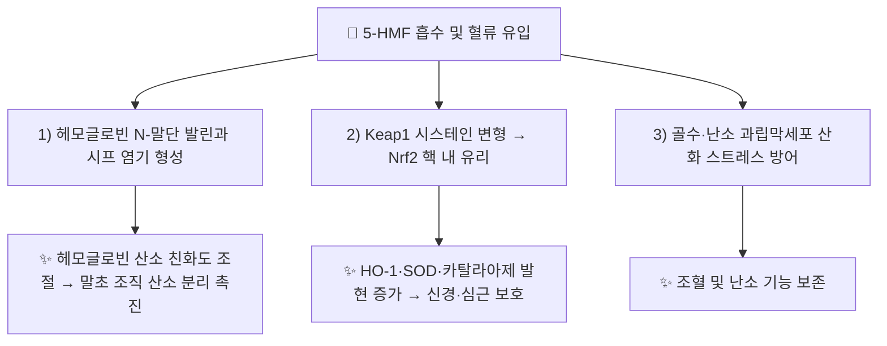

---
aliases:
  - 5-HMF
  - 5-하이드록시메틸푸르푸랄
  - 5-Hydroxymethylfurfural
  - 5-하이드록시메틸퍼퓨랄
  - HMF
tags:
  - 약리
  - 약리성분
  - 파이토케미컬
  - 항산화
  - 신경보호
CID: 9294
분자식: C6H6O3
분자량: 126.11 g/mol
대표본초: "[[숙지황]], [[흑삼]], [[오미자]]"
title: 5-HMF
date: 2026-09-22
출처: "PMID: 38842004"
---

# 🔬 [[5-HMF]] (5-Hydroxymethylfurfural, $\text{C}_6\text{H}_6\text{O}_3$)

> **핵심 3줄 요약 (Key Summary)**:
> - 🌿 기원 본초 & 화학 계열: 생지황을 청주와 함께 아홉 번 찌고 말리는 구증구포(九蒸九曝) 포제 과정에서 단당류의 산 촉매 탈수·마이야르 반응으로 생성되는 [[숙지황]](Rehmanniae Radix Preparata)의 대한민국약전(KP) 법정 품질 지표 성분(퓨란계 알데하이드).
> - 🎯 핵심 분자 표적 & 조절 경로: 헤모글로빈 N-말단 발린과의 가역적 시프 염기 형성을 통한 산소 친화도 알로스테릭 조절, Keap1-Nrf2/HO-1 항산화 경로 활성화.
> - 🩺 주요 약리 활성 & 질환 치료 기전: 말초 조직 산소 공급 촉진(보혈), 허혈-재관류 뇌·심근 손상 방어, 난소 과립막세포 산화 스트레스 완화.
> - <font color="#fa7e7e">⚠️ 독성·생체이용률 한계 & 상호작용: 식품 가공 분야에서 고농도 노출 시 SULT 매개 유전독성 논란이 있으나 한약 포제 규격(KP 0.1% 이상) 범위 내 인체 노출량에서는 ADH/ALDH 경로로 신속히 무독화되며, 공식 인체 약물-약물 상호작용(DDI) 연구는 아직 없음.</font>

---

## 📌 목차
1. [기본 화학 정보 & 분자 구조식 (Chemical Identity)](#1-기본-화학-정보--분자-구조식-chemical-identity)
2. [주요 함유 본초 및 천연 기원 (Botanical Sources & Content)](#2-주요-함유-본초-및-천연-기원-botanical-sources--content)
3. [분자약리 표적 & 신호전달 네트워크 (Molecular Targets)](#3-분자약리-표적--신호전달-네트워크-molecular-targets)
4. [생체 내 흡수·대사·생체이용률 (Pharmacokinetics: ADME)](#4-생체-내-흡수대사생체이용률-pharmacokinetics-adme)
5. [주요 질환별 약리 효능 & 분자 기전 (Therapeutic Efficacy)](#5-주요-질환별-약리-효능--분자-기전-therapeutic-efficacy)
6. [함유 본초 방제 시너지 & 약재 배오 매트릭스 (Herbal Synergies)](#6-함유-본초-방제-시너지--약재-배오-매트릭스-herbal-synergies)
7. [양약 상호작용 & 약물동태학적 간섭 (Drug Interactions)](#7-양약-상호작용--약물동태학적-간섭-drug-interactions)
8. [💡 사용자 진료실 핵심 필기 & 임상 응용 팁 (Melt-In & High-Yield)](#8--사용자-진료실-핵심-필기--임상-응용-팁-melt-in--high-yield)
9. [출처 및 학술 참고 문헌 (References)](#9-출처-및-학술-참고-문헌-references)

---

## 1. 기본 화학 정보 & 분자 구조식 (Chemical Identity)

![[5-HMF_2D_구조식.png|320]]
> [그림 1: 5-HMF의 2D 화학 분자 구조식 (PubChem CID: 9294)]

> [!abstract]+ 🧪 3D 약리 분자 구조 (Interactive 3D Viewer)
> <iframe src="https://molecule-viewer-rho.vercel.app/?cid=237332" width="100%" height="450px" frameborder="0" allow="webgl" style="border-radius: 8px;"></iframe>

| 항목 | 상세 내용 |
| :--- | :--- |
| **IUPAC 명칭** | 5-(hydroxymethyl)furan-2-carbaldehyde |
| **분자식 / 분자량** | $\text{C}_6\text{H}_6\text{O}_3$ / 126.11 g/mol |
| **PubChem CID** | [9294](https://pubchem.ncbi.nlm.nih.gov/compound/9294) |
| **CAS 등록 번호** | 67-47-0 |
| **화학 골격 분류** | 퓨란계 알데하이드(Furanic aldehyde), 단당류 열분해·마이야르 반응 유래 2차 생성물 |
| **물리화학적 성상** | 담황색 결정 또는 카모마일 향의 흡습성 고체, 녹는점 30~34°C, 물·에탄올·아세톤에 극히 잘 녹음 |
| **생성 경로(포제학적 유래)** | 식물 자체 생합성 산물이 아니라, [[숙지황]] 구증구포(九蒸九曝) 등 가열 포제 중 올리고당이 과당(D-Fructose)으로 가수분해된 뒤 3중 탈수(-3 H₂O)·엔올화를 거쳐 형성됨 (아래 §2 참조) |
| **공정서 법정 규격** | 대한민국약전(KP) [[숙지황]] 규격: 5-HMF로서 **0.1% 이상** 함유 필수 |

---

## 2. 주요 함유 본초 및 천연 기원 (Botanical Sources & Content)

5-HMF는 식물체가 직접 생합성하는 2차 대사산물이 아니라, **한약 포제(炮製) 가공 중 열유도 화학반응으로 생성되는 지표 성분**이라는 점에서 대부분의 약리성분과 근본적으로 다릅니다.

**생성 메커니즘 (구증구포 중 산 촉매 탈수 반응)**: [[생지황]]에는 스타키오스·라피노오스 등 올리고당과 이리도이드 배당체 [[카탈폴]]이 다량 함유되어 있습니다. 청주(막걸리)와 함께 찌고(蒸) 말리는(曝) 과정을 9회 반복하면 ① 산성 조건에서 올리고당이 과당·포도당으로 완전 가수분해되고 ② 과당 분자가 엔올화 및 3분자의 물을 잃는 3중 탈수 반응을 거쳐 퓨란 고리를 형성하며 5-HMF로 전환됩니다. 이 과정에서 생지황의 찬 성질(寒)이 따뜻한 성질(微溫)로 반전되며 보혈익정의 약성이 완성됩니다.

| 함유 본초 (한글/한자) | 기원 식물학적 명칭 (과명 / 학명) | 주요 함유 약용 부위 | 지표 함량 (%) | 한의학적 귀경 및 약효 특성 |
| :--- | :--- | :--- | :--- | :--- |
| [[숙지황]] (熟地黃) | 현삼과(Orobanchaceae) / *Rehmannia glutinosa* (Gaertn.) DC. | 뿌리(구증구포 포제) | 0.15 ~ 0.45% (KP 기준 0.1% 이상) | 간·신경 / 보혈양음(補血養陰), 조혈 촉진, 신정 보충 |
| [[흑삼]] (구증구포 인삼) | 두릅나무과(Araliaceae) / *Panax ginseng* C.A.Mey. | 뿌리(9회 증포) | 0.1 ~ 0.3% | 비·폐경 / 진세노사이드 Rg3·Rk1과 공존, 항산화 증폭 |
| [[오미자]] (五味子) | 목련과(Schisandraceae) / *Schisandra chinensis* (Turcz.) Baill. | 열매(증숙 가공) | 0.05 ~ 0.15% | 폐·심·신경 / 리그난과 공존, 심·폐 기능 보호 |

---

## 3. 분자약리 표적 & 신호전달 네트워크 (Molecular Targets)



### 1) 헤모글로빈 알로스테릭 조절: 말초 조직 산소 전달 촉진 (보혈의 실체)
* 5-HMF는 적혈구 내 헤모글로빈(Hb)의 N-말단 발린 잔기와 가역적인 시프 염기(Schiff base)를 형성하여 헤모글로빈의 산소 친화도를 미세 조율, 저산소증에 빠진 말초 모세혈관 조직에서 산소 분리를 촉진합니다.
* 이는 겸상적혈구 빈혈(Sickle cell anemia) 치료제 Voxelotor 개발의 천연 모핵이 된 기전으로, 한의학에서 숙지황이 만성 빈혈 환자의 안색을 돌리고 사지 저림을 해결하는 **보혈(補血)** 작용의 분자적 실체입니다.

### 2) Nrf2/HO-1 신호 전달 활성화를 통한 신경 및 심근 보호
* 세포질 내 Keap1 단백질의 시스테인 잔기를 변형시켜 전사인자 Nrf2를 핵 내로 유리시키고, 항산화 반응 원소(ARE)에 결합해 헴옥시게나아제-1(HO-1), SOD, 카탈라아제 등 내인성 항산화 효소 발현을 증가시킵니다.
* 허혈성 뇌졸중 및 심근경색 후 재관류 시 발생하는 활성산소종(ROS)을 소거하고 신경세포 사멸(Apoptosis)을 방지합니다.

### 3) 조혈 및 난소 기능 보존
* 골수 미세환경의 조혈모세포 활성화 및 에리스로포이에틴(EPO) 신호전달을 보조하고, 난소 과립막세포(Granulosa cells)의 산화적 손상을 방지하여 난소 기능 저하 모델에서 에스트로겐 분비 능력을 보존합니다.

---

## 4. 생체 내 흡수·대사·생체이용률 (Pharmacokinetics: ADME)

| 약동학 파라미터 | 성상 및 수치 | 임상적 의의 |
| :--- | :--- | :--- |
| **경구 흡수** | 소화관 점막에서 신속 흡수 (초저분자 수용성 분자) | 복용 즉시 흡수 시작 |
| **최고혈중농도 도달시간 (Tmax)** | 약 0.3 ~ 0.8시간 | 30분 이내 혈중 최고 농도 형성 |
| **간 대사 경로** | 알코올 탈수소효소(ADH), 알데히드 탈수소효소(ALDH)에 의해 5-하이드록시메틸-2-푸란카르복실산(HMFA)으로 무독화 대사 | 동일 효소를 사용하는 다른 기질(예: 에탄올)과 대사 경쟁 가능성은 이론적으로 존재하나 임상 자료는 없음(§7 참조) |
| **체내 반감기 (t1/2)** | 약 1.5 ~ 2.5시간 | 빠르게 대사되어 체내 축적성 낮음 |
| **배설 경로** | 신장 배설(95% 이상, 주로 HMFA 대사체 형태) | 24시간 이내 완전 배설 |

---

## 5. 주요 질환별 약리 효능 & 분자 기전 (Therapeutic Efficacy)

### 1) 만성 혈허(血虛) 및 난치성 빈혈 후유증
* 안면 창백, 사지 냉증, 어지러움, 산후 기혈 소모, 만성 소모성 질환 환자의 혈색 회복.

### 2) 허혈성 뇌혈관 질환 및 인지기능 저하
* 뇌졸중 후유증, 혈관성 치매, 만성 뇌혈류 장애 환자의 뇌세포 산소 공급 및 항산화 보호.

### 3) 여성 생식기능 저하 및 갱년기 난소 부전
* 난소 예비력(AMH) 저하, 조기 난소 부전 환자의 난소 과립막세포 산화 스트레스 완화 (Chen et al. 2024, §9 참조).

---

## 6. 함유 본초 방제 시너지 & 약재 배오 매트릭스 (Herbal Synergies)

| 함유 본초 / 방제 | 공존 유효 성분군 | 분자약리 시너지 기전 | 전통 한의학적 효능 연계 |
| :--- | :--- | :--- | :--- |
| [[사물탕]] | [[숙지황]](5-HMF), [[당귀]]([[데커신]]), [[천궁]](천궁신) | 5-HMF의 헤모글로빈 산소친화도 조절 + 골수 적혈구 신생 촉진 + 미세혈관 확장이 결합된 조혈 네트워크 | 보혈조혈(補血調血), 만성 혈허 개선 |
| [[십전대보탕]] | [[숙지황]], [[인삼]], [[황기]] | 5-HMF의 Nrf2 항산화 활성이 인삼·황기의 면역 조절과 상가 작용 | 기혈쌍보(氣血雙補) |
| [[육미지황탕]] | [[숙지황]], [[산수유]], [[목단피]] | 5-HMF 조혈·항산화 활성이 신음(腎陰) 보충 처방의 약효 기반 형성 | 자음보신(滋陰補腎) |

---

## 7. 양약 상호작용 & 약물동태학적 간섭 (Drug Interactions)

* **ADH/ALDH 경로 이론적 경쟁**: 5-HMF는 간에서 알코올 탈수소효소(ADH)·알데히드 탈수소효소(ALDH)에 의해 HMFA로 대사됩니다. 이론적으로는 동일 효소로 대사되는 에탄올, 또는 ALDH를 억제하는 디설피람(Disulfiram)류 약물과 대사 경쟁이 발생할 가능성이 기전상 상정되나, **이를 직접 검증한 인체 임상 상호작용 연구는 현재까지 확인되지 않았습니다.** 확정된 근거가 아니므로 과장하여 안내하지 말 것.
* **P-gp/CYP 상호작용 자료 부재**: 5-HMF의 CYP450 효소 억제/유도 또는 P-당단백질(P-gp) 기질 여부에 대한 체계적 연구는 아직 보고되지 않았습니다. 현재로서는 한약 포제 규격 범위 내 복용량에서 심각한 약물 상호작용을 시사하는 근거는 없습니다.
* **식품 가공 유래 고농도 노출과의 구분**: 탄 빵·과열 커피 등에서 발생하는 고농도 5-HMF의 SULT 매개 유전독성 논란(§1 요약 참조)은 한약 탕전 복용량(수 mg 수준)과는 노출 스케일이 다르므로 혼동하지 않도록 임상 안내가 필요합니다.

---

## 8. 💡 사용자 진료실 핵심 필기 & 임상 응용 팁 (Melt-In & High-Yield)

* **생지황 vs 숙지황의 성미 반전 원리**: 『본초비요』에서 "생지황은 성질이 차서 피를 맑게 하고(淸熱凉血), 찌고 말린 숙지황은 성질이 따뜻해져 피를 만든다(補血益精)"고 하였습니다. 분자학적으로는 찬 성질을 내는 [[카탈폴]]과 올리고당이 구증구포 과정에서 분해되고, 산소 공급·항산화 활성을 가진 5-HMF가 새롭게 생성되어 약재의 물리화학적·약리학적 성질이 반전되는 것입니다.

```
생지황 (카탈폴 + 올리고당 다량) ──► 찬 성질 ──► 청열양혈
      │ 구증구포(九蒸九曝)
      ▼
숙지황 (5-HMF 대량 신생) ──► 따뜻한 성질 ──► 적혈구 산소화 + Nrf2 보혈(補血益精)
```

* **처방 활용**: 만성 빈혈·피로 환자에게 [[사물탕]]을 처방할 때, 숙지황의 5-HMF가 조혈 환경을 개선하고 당귀의 데커신이 골수 적혈구 신생을 촉진하며 천궁의 천궁신이 미세혈관을 열어주는 조혈 네트워크가 형성됩니다.
* **환자 교육 포인트**: "숙지황은 막걸리에 아홉 번 정성껏 찌고 말려야 진짜 약효가 납니다. 제대로 쪄낸 숙지황 속에는 5-HMF라는 성분이 생겨나서 피 속의 산소를 뇌와 손발 끝까지 채워주는 천연 보혈 작용을 합니다. 검은 색소만 입힌 부정 숙지황과는 KP 규격(0.1% 이상) 충족 여부로 구분됩니다."

---

## 9. 출처 및 학술 참고 문헌 (References)

1. **Abdulmalik O, et al. (2024)**. *The antisickling agent, 5-hydroxymethyl-2-furfural: Other potential pharmacological applications*. **Medicinal Research Reviews**, 44(6), 2536-2566.
   - [PMID: 38842004](https://pubmed.ncbi.nlm.nih.gov/38842004/) | [DOI: 10.1002/med.22062](https://doi.org/10.1002/med.22062)
   - **[연구 요약]**: 5-HMF가 헤모글로빈 알로스테릭 조절제로 작용하여 산소 친화도를 높이고 적혈구 중합을 막는 기전, 신경보호·심근보호·항산화 작용을 총정리한 종설. ADH/ALDH 대사 경로도 본 종설에서 확인.
2. **Chen X, et al. (2024)**. *Changes in Rehmanniae Radix processing and their impact on ovarian hypofunction: potential mechanisms of action*. **Frontiers in Pharmacology**, 15, 1426972.
   - [PMID: 39035992](https://pubmed.ncbi.nlm.nih.gov/39035992/) | [DOI: 10.3389/fphar.2024.1426972](https://doi.org/10.3389/fphar.2024.1426972)
   - **[연구 요약]**: 지황 포제 공정(생지황→숙지황) 중 5-HMF 생성 패턴과 난소 과립막세포 산화 스트레스 억제·난소 기능 부전 개선 기전 규명.
3. **Zhang L, et al. (2022)**. *A comparative study on the traditional versus modern yellow rice wine processing methods using Taohong Siwu Decoction for pharmaceutical production*. **Journal of Ethnopharmacology**, 290, 115114.
   - [PMID: 35181489](https://pubmed.ncbi.nlm.nih.gov/35181489/) | [DOI: 10.1016/j.jep.2022.115114](https://doi.org/10.1016/j.jep.2022.115114)
   - **[연구 요약]**: 황주(청주)를 사용한 전통 지황 포제 과정에서 5-HMF를 포함한 지표 성분의 화학적 전이 양상과 당귀·천궁과의 보혈 시너지 효과 분석.

<!-- 보관 태그(1회용·링크오류, 필요시 복원): 퓨란유도체, 숙지황, 지표성분, 포제학 -->
