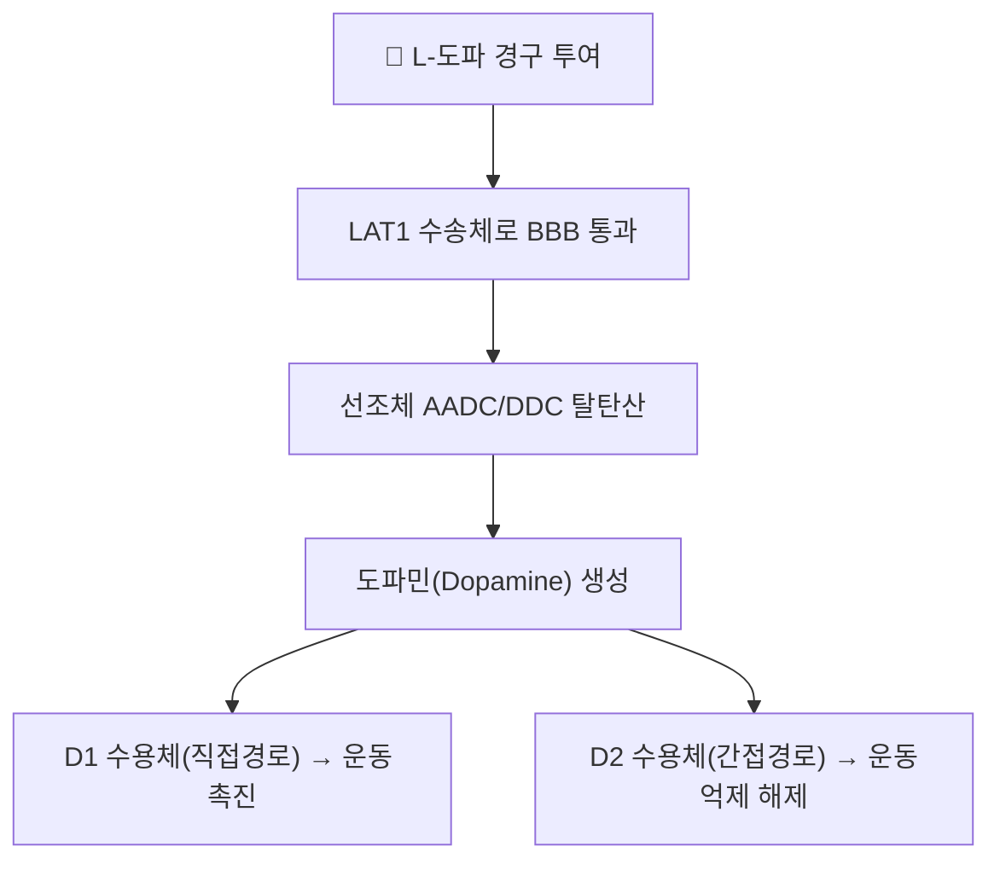

---
aliases:
  - Levodopa
  - L-도파
  - 레보도파
  - L-DOPA
  - 마도파
  - 시네메트
tags:
  - 약리
  - 약리성분
  - 신경전달물질
  - 아미노산
  - 파킨슨병
CID: 6047
분자식: C9H11NO4
분자량: 197.19 g/mol
대표본초: "[[잠두]], [[용아초]]"
title: L-도파
date: 2026-09-13
출처: "PMID: 42537743"
---

# 🔬 [[L-도파]] (Levodopa, $\text{C}_9\text{H}_{11}\text{NO}_4$)

> **핵심 3줄 요약 (Key Summary)**:
> - 🌿 기원 본초 & 화학 계열: 콩과 식물 잠두([[잠두]], *Vicia faba*) 및 벨벳빈(*Mucuna pruriens*)에 천연 함유되는 [[도파민]] 전구체 아미노산(카테콜아민 전구 아미노산).
> - 🎯 핵심 분자 표적 & 조절 경로: LAT1 수송체로 혈액-뇌 장벽 통과 후 AADC에 의해 [[도파민]]으로 전환, 선조체 D1(직접경로)/D2(간접경로) 수용체 활성화.
> - 🩺 주요 약리 활성 & 질환 치료 기전: 파킨슨병 치료의 골드 스탠다드, 도파 반응성 근긴장이상·하지불안증후군에도 응용.
> - ⚠️ 독성·생체이용률 한계 & 상호작용: 단독 투여 시 중추 도달률 1% 미만(말초 AADC에 의한 조기 전환)이라 카르비도파·벤세라지드 등 말초 DDC 억제제와 반드시 병용해야 하며, 고단백 식사·비선택적 MAO 억제제와 상호작용 주의.

---

## 📌 목차
1. [기본 화학 정보 & 분자 구조식 (Chemical Identity)](#1-기본-화학-정보--분자-구조식-chemical-identity)
2. [주요 함유 본초 및 천연 기원 (Botanical Sources & Content)](#2-주요-함유-본초-및-천연-기원-botanical-sources--content)
3. [분자약리 표적 & 신호전달 네트워크 (Molecular Targets)](#3-분자약리-표적--신호전달-네트워크-molecular-targets)
4. [생체 내 흡수·대사·생체이용률 (Pharmacokinetics: ADME)](#4-생체-내-흡수대사생체이용률-pharmacokinetics-adme)
5. [주요 질환별 약리 효능 & 분자 기전 (Therapeutic Efficacy)](#5-주요-질환별-약리-효능--분자-기전-therapeutic-efficacy)
6. [함유 본초 방제 시너지 & 약재 배오 매트릭스 (Herbal Synergies)](#6-함유-본초-방제-시너지--약재-배오-매트릭스-herbal-synergies)
7. [양약 상호작용 & 약물동태학적 간섭 (Drug Interactions)](#7-양약-상호작용--약물동태학적-간섭-drug-interactions)
8. [💡 사용자 진료실 핵심 필기 & 임상 응용 팁 (Melt-In & High-Yield)](#8--사용자-진료실-핵심-필기--임상-응용-팁-melt-in--high-yield)
9. [출처 및 학술 참고 문헌 (References)](#9-출처-및-학술-참고-문헌-references)

---

## 1. 기본 화학 정보 & 분자 구조식 (Chemical Identity)

![[L-도파_2D_구조식.png|320]]
> [그림 1: L-도파의 2D 화학 분자 구조식 (PubChem CID: 6047)]

> [!abstract]+ 🧪 3D 약리 분자 구조 (Interactive 3D Viewer)
> <iframe src="https://molecule-viewer-rho.vercel.app/?cid=6047" width="100%" height="450px" frameborder="0" allow="webgl" style="border-radius: 8px;"></iframe>

| 항목 | 상세 내용 |
| :--- | :--- |
| **IUPAC 명칭** | (2S)-2-amino-3-(3,4-dihydroxyphenyl)propanoic acid |
| **분자식 / 분자량** | $\text{C}_9\text{H}_{11}\text{NO}_4$ / 197.19 g/mol |
| **PubChem CID** | [6047](https://pubchem.ncbi.nlm.nih.gov/compound/6047) |
| **CAS 등록 번호** | 59-92-7 |
| **화학 골격 분류** | 카테콜아민 전구 아미노산(L-방향족 아미노산) |
| **물리화학적 성상** | 백색~미황색 결정성 분말, 공기·빛 노출 시 갈색 산화, 녹는점 295°C(분해), 물에 난용(1:300) |
| **생합성 경로(체내)** | L-페닐알라닌 → L-티로신 →(티로신 수산화효소, TH)→ **L-도파** →(AADC/DDC)→ [[도파민]] →(DBH)→ 노르에피네프린 →(PNMT)→ 에피네프린 |

---

## 2. 주요 함유 본초 및 천연 기원 (Botanical Sources & Content)

흑질 치밀부(Substantia nigra pars compacta)의 도파민 신경세포 손실로 율속 단계인 티로신 수산화효소 활성이 결손되면, 그 하위 전구체인 L-도파를 직접 공급해 선조체 내 도파민 결핍을 보충합니다.

| 함유 본초 (한글/한자) | 기원 식물학적 명칭 (과명 / 학명) | 주요 함유 부위 | 지표 함량 (%) | 한의학적/임상적 배경 |
| :--- | :--- | :--- | :--- | :--- |
| [[잠두]] (蠶豆) | 콩과(Fabaceae) / *Vicia faba* | 덜 익은 꼬투리·종자 | 0.5 ~ 2.0% | 천연 L-DOPA 공급원으로 연구됨 |
| 벨벳빈 (카줄라, 미기재) | 콩과(Fabaceae) / *Mucuna pruriens* | 종자 | 3 ~ 6% | 아유르베다 전통 항진전제, 고농도 L-DOPA 함유 |
| [[용아초]] (龍牙草) | 장미과(Rosaceae) / *Agrimonia pilosa* | 전초 | 미량 보고 | 지혈·수렴 본초로 전통 사용, L-DOPA와의 직접 연관은 제한적 근거 — 과장 금지 |

---

## 3. 분자약리 표적 & 신호전달 네트워크 (Molecular Targets)

### 1) 혈액-뇌 장벽(BBB) 투과와 선조체 내 전환
* 도파민 자체는 극성 분자로 BBB를 통과할 수 없으나, L-도파는 중성 아미노산 구조로 대형 중성 아미노산 수송체(LAT1, SLC7A5)를 통해 능동 수송되어 BBB를 통과합니다.
* 선조체에 도달한 후 잔존 도파민 신경세포 말단·성상세포의 AADC(DDC)에 의해 즉각 도파민으로 전환됩니다.
### 2) 기저핵 직접/간접 경로 조율
* **D1 수용체(직접 경로)**: 내측 담창구·흑질 그물부 억제 → 시상 탈억제 → 피질 흥분 → 운동 시작 촉진.
* **D2 수용체(간접 경로)**: 외측 담창구 억제 완화 → 시상하핵 과흥분 억제 → 비정상 운동 차단 해소.
* 결과적으로 서동·근강직·안정시 진전의 3대 파킨슨 증상이 개선됩니다.

---

## 4. 생체 내 흡수·대사·생체이용률 (Pharmacokinetics: ADME)

| 파라미터 / 배합 | 세부 특성 | 기전 |
| :--- | :--- | :--- |
| **흡수 부위** | 십이지장·상부 공장 | 아미노산 능동수송체 매개, 위 배출 시간에 민감 |
| **단독 투여 시 생체이용률** | 중추 도달률 1% 미만 | 장점막·말초혈관 AADC에 의해 90% 이상 말초에서 도파민으로 조기 전환 |
| **카르비도파 복합(시네메트)** | L-DOPA:Carbidopa = 4:1 또는 10:1 | BBB 비투과성 말초 DDC 억제제로 중추 도달률 10배 증가, 말초 오심 방지 |
| **벤세라지드 복합(마도파)** | L-DOPA:Benserazide = 4:1 | 또 다른 강력한 말초 DDC 억제제 |
| **반감기(t1/2)** | 1.5 ~ 2.0시간 | 짧은 반감기로 질환 진행 시 약효소실(Wearing-off) 빈발 |
| **대사 효소계** | DDC, COMT, MAO-B | COMT 억제제(엔타카폰)·MAO-B 억제제(라사길린) 병용으로 반감기 연장 |

---

## 5. 주요 질환별 약리 효능 & 분자 기전 (Therapeutic Efficacy)

### 1) 특발성 파킨슨병
* 전 세계 모든 진료지침에서 파킨슨병 운동증상 조절의 가장 강력한 1차 표준치료제.
### 2) 도파 반응성 근긴장이상(Segawa Disease)
* 소아기 발병 하지 근긴장이상증에서 극소량 L-도파만으로 극적인 증상 소실이 가능.
### 3) 하지불안증후군(RLS)
* 야간 수면을 방해하는 다리의 이상감각·움직임 충동을 완화(2차 저용량 요법).

---

## 6. 함유 본초 방제 시너지 & 약재 배오 매트릭스 (Herbal Synergies)

| 함유 본초 / 방제 | 공존 성분·병용 전략 | 분자약리 시너지 기전 | 전통 한의학적 효능 연계 |
| :--- | :--- | :--- | :--- |
| [[억간산]] | [[조구등]]([[린코필린]]), [[시호]] | 시냅스 후 수용체 과민화 조절 → L-DOPA 유효 혈중농도 안정화, 이상운동증(LID) 억제 | 평간식풍(平肝熄風) |
| [[천마구등음]] | [[천마]], [[조구등]] | 신경 염증 억제를 통한 도파민 신경세포 조기 사멸 지연 보조 | 평간잠양(平肝潛陽) |
| [[마자인환]]/[[윤장탕]] | [[마자인]], [[대황]] | 변비 개선으로 장내 L-DOPA 정체·분해 방지, 흡수 안정화 | 윤장통변(潤腸通便) |

---

## 7. 양약 상호작용 & 약물동태학적 간섭 (Drug Interactions)

* **비선택적 MAO 억제제**: 병용 시 치명적 고혈압 위기(Hypertensive crisis) 유발 위험 — 병용 금기.
* **고단백 식사와의 흡수 경쟁**: 단백질 분해산물인 대형 중성 아미노산이 장관·BBB의 LAT1 수송체를 선점해 L-DOPA 흡수를 차단하므로, 식전 30분~1시간 공복 복용이 원칙입니다.
* **파파베린 등 도파민 길항 약물**: 항파킨슨 작용을 길항할 수 있어 병용 주의가 필요합니다.
* **말초 도파민 길항제(돔페리돈) 병용**: 급성 말초성 오심·구토·기립성 저혈압 관리를 위해 병용되나, 돔페리돈 자체의 QT 연장 위험을 함께 고려해야 합니다.

---

## 8. 💡 사용자 진료실 핵심 필기 & 임상 응용 팁 (Melt-In & High-Yield)

* **한의학적 병태생리**: 파킨슨병의 진전(震顫)·근강직은 한의학에서 간신음허(肝腎陰虛)로 인한 허풍내동(虛風內動) 및 기혈 어체, 담음 저락(痰飮阻絡)의 병태로 봅니다. L-DOPA 투여가 "외부에서 도파민 원료를 직접 공급"하는 방식이라면, 한의 치료는 신경세포 주위 만성 염증을 끄고 잔존 도파민 신경세포의 조기 사멸을 지연시키는 상보적 역할을 합니다.
* **처방 활용**: 5년 이상 L-DOPA를 장복해 온-오프 현상·이상운동증(LID)으로 고통받는 환자에게 [[억간산]]을 병용하면, 조구등의 린코필린 성분이 시냅스 후 수용체 과민화를 조절해 이상운동증 발생을 유의미하게 억제합니다.
* **변비 관리의 중요성**: 파킨슨 환자는 장운동 저하로 심한 변비를 겪는데, 장에 대변이 정체되면 L-DOPA가 흡수되지 못하고 장내에서 분해됩니다. [[마자인환]]·[[윤장탕]]으로 장을 원활히 통하게 하는 것이 레보도파 약효 발현의 선결 조건입니다.
* **복약 지도**: "고기·달걀·두부 같은 단백질 음식을 드시고 바로 약을 드시면 약효가 절반도 안 납니다. 식사하시기 30분~1시간 전에 약을 먼저 물 한 컵과 드세요."

---

## 9. 출처 및 학술 참고 문헌 (References)

1. **Gomez-Paz A, et al. (2026)**. *Transcranial magnetic stimulation recalibrates levodopa response by attenuating neuroinflammation and glial reactivity in experimental parkinsonism*. **Experimental Neurology**, 381, 115942.
   - [PMID: 42537743](https://pubmed.ncbi.nlm.nih.gov/42537743/) | [DOI: 10.1016/j.expneurol.2026.115942](https://doi.org/10.1016/j.expneurol.2026.115942)
   - **[연구 요약]**: 신경조절술이 미세아교세포·성상교세포 반응성을 억제해 레보도파 투여에 수반되는 운동성 합병증을 완화함을 규명.
2. **Al-Moujahed A, et al. (2026)**. *Levodopa in retinal disease: Dopamine pathways, neuroprotective mechanisms, and clinical evidence*. **Survey of Ophthalmology**, 71(5), 1028-1042.
   - [PMID: 41747836](https://pubmed.ncbi.nlm.nih.gov/41747836/) | [DOI: 10.1016/j.survophthal.2026.02.010](https://doi.org/10.1016/j.survophthal.2026.02.010)
   - **[연구 요약]**: 망막 내 도파민 경로와 아교세포 신경보호 작용에서 레보도파의 임상적 효과와 확장된 치료 잠재력을 고찰.
3. **Sharma R, et al. (2026)**. *Therapeutics candidates and repurposing strategies to target parkinson's disease pathology: current evidence and future directions*. **Metabolic Brain Disease**.
   - [PMID: 42714656](https://pubmed.ncbi.nlm.nih.gov/42714656/) | [DOI: 10.1007/s11011-026-01961-2](https://doi.org/10.1007/s11011-026-01961-2)
   - **[연구 요약]**: 레보도파를 중심으로 α-시누클레인 응집 억제 및 미토콘드리아 기능 보존을 목표로 하는 차세대 병용 전략 총정리.
4. **Patel K, et al. (2026)**. *Neuroprotective efficacy of Nyctanthes arbor-tristis in a rotenone-induced rat model of Parkinson's disease*. **Journal of Ethnopharmacology**, 338, 121826.
   - [PMID: 42107754](https://pubmed.ncbi.nlm.nih.gov/42107754/) | [DOI: 10.1016/j.jep.2026.121826](https://doi.org/10.1016/j.jep.2026.121826)
   - **[연구 요약]**: 로테논 유도 파킨슨 모델에서 천연물의 신경보호 효과를 표준 약물인 L-도파와 비교 대조.

<!-- 보관 태그(1회용·링크오류, 필요시 복원): 도파민전구체, 항파킨슨제 -->
