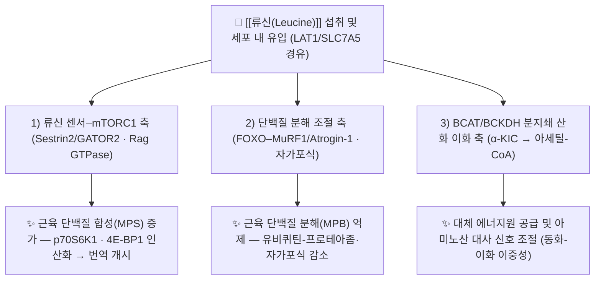

# 🔬 [[류신(Leucine)]] (Leucine, C6H13NO2 / (2S)-2-amino-4-methylpentanoic acid)

> **핵심 3줄 요약 (Key Summary)**:
> - 🌿 기원 본초 & 화학 계열: 특정 본초의 지표 성분이 아니라 **단백질 구성 필수 아미노산(1차 대사산물)** 으로, [[大豆]](Glycine max) · [[白扁豆]] · [[薏苡仁]] 등 콩과·곡물류 본초와 유청 단백질(whey) 등 고단백 식품에 광범위하게 존재한다. 화학적으로는 **분지쇄 아미노산(BCAA, branched-chain amino acid)** 계열의 소수성 지방족 α-아미노산이다.
> - 🎯 핵심 분자 표적 & 조절 경로: 류신 센서–**[[mTORC1]]** 축(Sestrin2/GATOR2, Rag GTPase)을 통한 번역 개시 촉진과 동시에 **BCAT/BCKDH** 경로를 통한 산화적 이화(α-KIC → 아세틸-CoA)를 유도하여, "동화(anabolic)와 이화(catabolic)의 이중성"을 나타낸다.
> - 🩺 주요 약리 활성 & 질환 치료 기전: 골격근 단백질 합성(MPS) 자극 및 단백질 분해(MPB) 억제를 통한 **근감소증·동화저항성 개선**, 집중 훈련기 운동수행 보조, **암 악액질(cancer cachexia)** 완화 가능성. 한편 암세포에서는 mTORC1 활성화를 통해 증식을 조장할 수 있는 **양면성(double-edge)** 이 보고되어 있다.
> - ⚠️ 독성·생체이용률 한계 & 상호작용: 단독 아미노산으로서 고유 독성은 낮으나, ① LNAA(대형 중성 아미노산) 공용 수송체(LAT1/SLC7A5) 경쟁에 의한 흡수 간섭, ② MSUD(단풍시럽뇨병) 등 BCKDH 결핍에서 금기, ③ mTOR 억제제 병용 시 동화효과 상쇄, ④ 진행성 암환자에서 종양 증식 촉진 이론적 위험이 있어 투여 판단에 주의가 필요하다.

> [!warning] 근거 표기 원칙
> 본 노트는 아래 9장에 명시된 6편의 PubMed 논문만을 인용 근거로 사용한다. 해당 논문에서 직접 확인되지 않는 수치(용량, 혈중 농도, 반감기, 함량 %)나 기전 세부는 **'근거 미확인'** 으로 명시하였다. 일반 생리·약리 교과서 수준의 내용은 "일반 기전"으로 구분해 기술하였다.

---

## 📌 목차
1. [기본 화학 정보 & 분자 구조식 (Chemical Identity)](#1-기본-화학-정보--분자-구조식-chemical-identity)
2. [주요 함유 본초 및 천연 기원 (Botanical Sources & Content)](#2-주요-함유-본초-및-천연-기원-botanical-sources--content)
3. [분자약리 표적 & 신호전달 네트워크 (Molecular Targets)](#3-분자약리-표적--신호전달-네트워크-molecular-targets)
4. [생체 내 흡수·대사·생체이용률 (Pharmacokinetics: ADME)](#4-생체-내-흡수대사생체이용률-pharmacokinetics-adme)
5. [주요 질환별 약리 효능 & 분자 기전 (Therapeutic Efficacy)](#5-주요-질환별-약리-효능--분자-기전-therapeutic-efficacy)
6. [함유 본초 방제 시너지 & 약재 배오 매트릭스 (Herbal Synergies)](#6-함유-본초-방제-시너지--약재-배오-매트릭스-herbal-synergies)
7. [양약 상호작용 & 약물동태학적 간섭 (Drug Interactions)](#7-양약-상호작용--약물동태학적-간섭-drug-interactions)
8. [💡 사용자 진료실 핵심 필기 & 임상 응용 팁 (Melt-In & High-Yield)](#8--사용자-진료실-핵심-필기--임상-응용-팁-melt-in--high-yield)
9. [출처 및 학술 참고 문헌 (References)](#9-출처-및-학술-참고-문헌-references)

---

## 1. 기본 화학 정보 & 분자 구조식 (Chemical Identity)

![[류신(Leucine)_3.jpg|540]]
> [그림 1: Commission Implementing Regulation (EU) 2020-378 of 5 March 2020 concerning the authorisation of L-leucine as a feed additive for all animal species (Text with EEA relevance) (EUR 2020-378).pdf]

> [!abstract]+ 🧪 3D 약리 분자 구조 (Interactive 3D Viewer)
> <iframe src="https://molecule-viewer-rho.vercel.app/?cid=6106" width="100%" height="450px" frameborder="0" allow="webgl" style="border-radius: 8px;"></iframe>

| 항목 | 상세 내용 |
| :--- | :--- |
| **IUPAC 명칭** | (2S)-2-amino-4-methylpentanoic acid (L-류신, L-leucine) |
| **분자식 / 분자량** | C₆H₁₃NO₂ / 131.17 g/mol |
| **PubChem CID** | [6106](https://pubchem.ncbi.nlm.nih.gov/compound/6106) |
| **CAS 등록 번호** | 61-90-5 (L-류신). 라세미체 DL-류신은 별도 등록번호를 사용하므로 처방·보충제 표기 시 L-체 여부 확인 필요 |
| **화학 골격 분류** | **1차 대사산물** — 단백질 구성 α-아미노산. 측쇄가 이소부틸기(-CH₂CH(CH₃)₂)인 **소수성 지방족 아미노산**이며, 아이소류신·발린과 함께 **BCAA(분지쇄 아미노산)** 3종에 속한다. (천연물 2차 대사산물인 알칼로이드·플라보노이드·테르페노이드 계열이 **아님**) |
| **물리화학적 성상** | 백색 결정 또는 결정성 분말. 특유의 **쓴맛**을 가져 보충제·경장영양 제형 설계 시 마스킹이 문제가 된다. 물에 난용~약간 용해(문헌별 상온 용해도 수치는 차이가 있음 → **근거 미확인**), 에탄올·에테르 등 유기용매에는 거의 불용. 분자 내 아미노기(-NH₂)와 카복실기(-COOH)를 동시에 가져 양쪽성이므로 pH에 따라 양이온/음이온/쯔비터이온 형태로 존재하며, 이 전하 특성이 수송체 인식과 흡수에 영향을 준다. 열·빛에 대해 상대적으로 안정하여 통상적인 전탕·조제 과정에서 심한 분해는 보고되지 않음(정량적 안정성 데이터 → **근거 미확인**). |
| **식물 내 생합성 경로** | 식물·미생물은 **피루브산(pyruvate)** 으로부터 출발하는 BCAA 생합성 캐스케이드로 류신을 *de novo* 합성한다: ① 아세토락테이트 생성(acetohydroxyacid synthase) → ② 케톨산 환원이성화(ketol-acid reductoisomerase) → ③ 디하이드록시산 탈수(dihydroxyacid dehydratase) → ④ **α-케토이소발레르산(α-KIV)** → ⑤ 이소프로필말레이트 경로(IPMS·IPMD·IPMDH)를 거쳐 **α-케토이소카프로산(α-KIC)** 생성 → ⑥ 분지쇄 아미노기 전이효소(BCAT)에 의한 최종 아미노화로 **L-류신** 완성. 반면 **인체는 이 경로를 갖지 못해 류신을 합성할 수 없으므로 필수 아미노산**이며, 반드시 식이로 공급해야 한다. 이화 방향(BCAT → BCKDH → 이소발레릴-CoA → 아세틸-CoA/아세토아세테이트)은 동물에서 활발히 작동하나, 류신 생합성 방향은 동물 조직에서 불가능하다. |

> [!note] 화학 정보 출처 관련
> 위 물성·생합성 정보는 아미노산 생화학의 일반 정설에 해당하며, 본 노트의 인용 논문 6편은 류신의 화학적 동정·물성 데이터를 직접 제시하지 않는다. 분자량·CAS·PubChem CID는 공공 화학 데이터베이스 기준값이다.

---

## 2. 주요 함유 본초 및 천연 기원 (Botanical Sources & Content)

류신은 **특정 본초에만 국한된 지표 성분이 아니라, 단백질을 함유한 거의 모든 생물에 존재하는 보편적 구성 아미노산**이다. 따라서 본 항목은 "류신을 지표 성분으로 함유하는 약용식물"이 아니라, **류신 공급원으로서 임상·영양학적으로 의미가 있는 본초 및 식품 매트릭스**로 재구성하였다.

| 함유 본초 (한글/한자) | 기원 식물학적 명칭 (과명 / 학명) | 주요 함유 약용 부위 | 지표 함량 (%) | 한의학적 귀경 및 약효 특성 |
| :--- | :--- | :--- | :--- | :--- |
| [[大豆]] (대두) | 콩과 / *Glycine max* | 종자(씨앗) | 식물성 단백질의 구성 아미노산으로 함유되어 있으나 **정량 %는 본 노트 인용 논문에서 미제시 → 근거 미확인** | 甘平. 健脾利水·寬中下氣·淸熱解毒. 비위(脾胃)를 보하면서 수습(水濕)을 배출하는 식이성 본초로, 고단백 보충과 건비(健脾)를 동시에 도모하는 배오에 활용 |
| [[白扁豆]] (백편두) | 콩과 / *Dolichos lablab* (또는 *Lablab purpureus*) | 성숙 종자 | **근거 미확인**(인용 논문 미제시) | 甘微溫. 健脾和中·化濕消暑. 비허(脾虛)로 인한 식욕부진·설사에 쓰이며, 단백질 공급원으로서 영양 보조적 의미 |
| [[薏苡仁]] (의이인) | 벼과 / *Coix lacryma-jobi* | 성숙 종인(種仁) | **근거 미확인**(인용 논문 미제시) | 甘淡涼. 健脾滲濕·除痺止瀉·淸熱排膿. 곡물성 단백질 급원이며 비위 기능 조절 목적으로 배오 |
| [[山藥]] (산약) | 마과 / *Dioscorea* spp. | 뿌리줄기(괴경) | **근거 미확인** | 甘平. 補脾養胃·生津益肺·補腎澁精. 단백질 함량은 곡물 대비 낮으나 소화 흡수가 순한 보기(補氣) 식재 |
| (동물성 급원) 유청 단백질 / whey protein | 우유 단백질 유래 | — | 유청 단백질 내 류신 함량은 흔히 높은 편(약 8~11% 수준)으로 인용되나, **본 노트 인용 논문에서 정량치 미제시 → 근거 미확인** | 한의학적 귀경 분류 대상이 아니며, [[Ijaz A 2025]] 연구에서 근감소증 대상자의 근육 질 개선을 위한 류신 병용 급원으로 사용됨 (PMID 40937507) |

> [!tip] 임상적 요점
> 류신의 "약리"는 본초학적 지표성분 개념보다 **단백질·아미노산 영양(PK/PD) 개념**에 가깝다. 따라서 처방 설계 시에는 ① 단백질 총량, ② 류신 단독 역치 충족 여부, ③ 소화 흡수 능력(비위 기능)의 세 축으로 접근하는 것이 실용적이다. 인용 논문 중 [[Ijaz A 2025]] (PMID 40937507)가 류신 + 유청 단백질 병용 전략을 직접 다룬다.

---

## 3. 분자약리 표적 & 신호전달 네트워크 (Molecular Targets)

### 1) 핵심 분자 표적 (Molecular Targets)

* **표적 1 — 류신 센서–mTORC1 축 ([[mTORC1]], [[Sestrin2]], [[GATOR2]], Rag GTPase)**
  * **일반 기전**: 류신은 세포질 내 센서 단백질인 **Sestrin2**에 결합하여 Sestrin2–GATOR2 복합체를 해리시키고, 이로써 GATOR2의 억제가 풀리면 **GATOR1(RagA GTPase-activating protein)** 이 억제되어 **RagA/B가 GTP 결합 상태**로 회복된다. 그 결과 mTORC1이 리소좀 표면으로 동원되어 라파마이신 감수성 활성을 획득한다. 별도로 **류신-tRNA 합성효소(LARS1)** 가 류신 센서로 기능한다는 보고도 있다.
  * **주의**: 위 센서 단백질(Sestrin2, LARS1) 수준의 세부 기전은 본 노트 인용 논문들이 직접 다루는 범위를 벗어난다 → **세부 기전 근거 미확인**. 다만 인용 논문들은 **류신/BCAA 섭취가 mTORC1 의존적 동화 신호를 활성화한다**는 결과 자체를 공통적으로 전제·논의한다 (PMID 37681443, PMID 26476924, PMID 35889781).
  * **하류 판독값**: mTORC1 활성화는 **p70S6K1(Thr389)** 과 **4E-BP1(Thr37/46)** 인산화를 증가시켜 mRNA 번역 개시를 촉진하며, 이것이 MPS(근육 단백질 합성) 증가로 연결된다.

* **표적 2 — 단백질 분해(이화) 조절 신호**
  * **[[FOXO3a]] → [[MuRF1]](TRIM63) / [[Atrogin-1]](FBXO32)** 축: 근위축 유전자 프로그램의 핵심. 류신/BCAA가 이 축을 억제하여 MPB를 줄이는지에 대해서는 **인체 연구에서 일관된 결론이 아직 없다** — [[Kaspy MS 2024]] (PMID 37681443)는 BCAA가 MPS를 자극한다는 증거는 상대적으로 일관되나, **MPB 억제 효과는 연구 간 이질성이 크다**고 정리한다.
  * **자가포식(autophagy) 조절**: mTORC1 활성화는 ULK1 복합체 인산화를 통해 자가포식을 억제하는 방향으로 작용한다. 이는 "동화 촉진 = 이화 억제"라는 단순 도식이 성립하지 않는 이유이기도 하다(아래 표적 3 참조).

* **표적 3 — BCAT/BCKDH 산화 축과 "동화–이화 이중성" ([[Gannon NP 2016]], PMID 26476924)**
  * 류신은 **BCAT(branched-chain aminotransferase)** 에 의해 가역적으로 아미노기가 제거되어 **α-케토이소카프로산(α-KIC)** 이 되고, 이후 미토콘드리아 **BCKDH 복합체**에 의해 산화적 탈카복실화되어 **이소발레릴-CoA → 아세틸-CoA 및 아세토아세테이트(케톤체)** 로 전환된다.
  * **핵심 개념**: 류신은 mTORC1을 통해 **동화(합성)** 신호를 켜는 동시에, 자신의 탄소 골격을 산화시켜 **이화(분해·산화)** 를 촉진한다. Gannon & Vaughan (2016)은 이를 **"leucine-induced anabolic-catabolism (류신 유도 동화-이화 작용)"** 이라는 두 얼굴로 정리하였다 (PMID 26476924). 즉 류신 보충의 순효과는 조직·대사 상태(운동 여부, 에너지 과잉/결핍, 인슐린 신호, 질환 상태)에 따라 방향이 달라질 수 있다.

### 2) 신호전달 조절 (Transcription & Translational Control)

* **번역(translation) 단계 조절**: mTORC1 → 4E-BP1 인산화 → eIF4E 해리 → cap-의존 번역 개시 증가. p70S6K1 → S6 리보솜 단백질 인산화. 이 경로가 류신의 근육 동화 효과의 최종 공통 경로로 제시된다.
* **전사인자 조절**: FOXO 전사인자의 핵 내 이동 억제를 통한 근위축 유전자 전사 감소(기전적 추론이며 인체 인과 확정은 **근거 미확인**).
* **인체에서의 해석 한계**: [[Kaspy MS 2024]] (PMID 37681443)는 **동물·세포 모델에서 관찰된 분자 신호가 인체 골격근에서 동일한 크기로 재현되지 않는 경우가 많다**는 점을 업데이트의 핵심으로 지적한다. 따라서 본 노트의 분자 신호는 "기전적 가설"과 "인체 확립 사실"을 구분해 읽어야 한다.

---

## 4. 생체 내 흡수·대사·생체이용률 (Pharmacokinetics: ADME)

* **장관 흡수 및 수송체 상호작용**
  * 류신은 소장 상부에서 **대형 중성 아미노산(LNAA) 수송체** 계열을 통해 흡수된다. 대표적으로 **LAT1(SLC7A5)/LAT2**, **B⁰AT1(SLC6A19)**, **ASCT2(SLC1A5)** 등이 관여한다(일반 기전).
  * **경쟁 흡수**: 류신·아이소류신·발린 및 페닐알라닌·티로신·트립토판 등이 동일 수송체를 공유하므로, BCAA를 고용량 단독 투여하면 다른 LNAA의 흡수·뇌내 이동이 상대적으로 저하될 수 있다(일반 기전, 인용 논문에서 정량 확인 **근거 미확인**).
  * **P-glycoprotein(P-gp, ABCB1) 관련**: 류신이 P-gp 유출 기질이라는 근거는 확인되지 않는다 → **근거 미확인**. 류신의 "배출 문제"는 P-gp보다 **수송체 포화 및 경쟁**의 관점으로 접근하는 것이 타당하다.
* **간 통과 및 조직 분배**
  * 흡수된 류신은 간문맥을 통해 간에 도달하나, **간의 BCKDH 활성이 상대적으로 낮아 BCAA는 간에서 대부분 대사되지 않고 통과**하여 말초조직, 특히 **골격근**에서 활발히 대사된다(일반 기전). 이 특성 때문에 운동·근육 대사 연구에서 중요한 아미노산으로 다루어진다.
* **세포 내 이화 경로**
  * 근육 내: BCAT(가역적 아미노기 전이) → **α-KIC** → BCKDH(속도조절 단계) → 이소발레릴-CoA → 아세틸-CoA 및 아세토아세테이트. BCKDH 활성은 탈인산화(활성화)/인산화(억제)로 조절되는 **BCKDH kinase / phosphatase** 시스템에 의해 결정된다(일반 기전).
  * α-KIC는 일부 조건에서 간·신장으로 유출되어 대사되며, 이 경로의 조직 간 분담은 종·상태에 따라 다르다(**근거 미확인**).
* **장내 미생물총(Microbiome) 대사 전환**
  * BCAA가 장내 세균에 의해 **분지쇄 지방산(BCFA)** 등으로 전환되고 이것이 숙주 대사 신호에 영향을 줄 수 있다는 개념이 제기되어 있으나, 류신 단독 보충과 장내 미생물의 인과관계 및 정량적 기여도는 **본 노트 인용 논문에서 확인되지 않음 → 근거 미확인**. 장-간 순환(enterohepatic circulation) 역시 아미노산에서는 고전적 경로로 다루지 않는다.
* **소실 반감기 및 배설**
  * 아미노산은 약물처럼 명확한 혈장 t₁/₂ 개념이 적용되기 어렵다. 류신은 조직 섭취·산화가 매우 빠르며, 통상적으로 경구 섭취 후 혈중 류신 농도 상승은 **수십 분 내 정점 후 1~2시간 내 기저값 근처로 회복**되는 양상으로 기술되지만, 본 노트 인용 논문들은 구체적 t₁/₂ 수치를 제시하지 않는다 → **근거 미확인**.
  * 배설: 대부분 산화되어 CO₂로 소실되고, 일부는 요소 회로 경유 질소 배출 및 신장 재흡수 경로를 거친다(일반 기전).
* **생체이용률 극대화 관점**
  * 류신의 동화 신호 발현은 **단백질 총량 및 흡수 속도(유청 단백질처럼 빠른 단백질 vs 카제인처럼 느린 단백질)** 에 영향을 받는다. [[Ijaz A 2025]] (PMID 40937507)는 근감소증 대상자에서 **류신 + 유청 단백질** 조합이 근육 질(muscle quality) 개선을 위한 전략이 될 수 있음을 탐색한다.

---

## 5. 주요 질환별 약리 효능 & 분자 기전 (Therapeutic Efficacy)

### 1) 근감소증 · 동화저항성 (Sarcopenia & Anabolic Resistance) — **최우선 근거 영역**
* 대상: 고령 근감소증 환자. [[Ijaz A 2025]] (PMID 40937507, *J Cachexia Sarcopenia Muscle*)는 **류신 및 유청 단백질 보충이 근육 질(근력·기능·근육량의 질적 지표)을 개선할 수 있는지**를 탐색하며, 단순한 단백질 "총량" 공급을 넘어 **류신 역치(threshold) 충족이 근육 동화 반응을 좌우**한다는 개념을 전면에 둔다.
* 기전: 고령 근육은 mTORC1 신호 반응성이 떨어지는 **동화저항성(anabolic resistance)** 상태가 되기 쉬우며, 이를 극복하기 위해 식사당 류신 공급을 충분히 확보하는 전략이 제안된다. (구체적 역치 수치는 통상 2.5~3 g/식사 수준으로 인용되나, **본 노트 인용 논문에서 명시 확인되지 않음 → 근거 미확인**.)
* 임상 함의: 단백질 보충은 **저항성 운동과 병행**될 때 효과가 극대화된다는 것이 근감소증 영역의 기본 원칙이다.

### 2) 운동 수행 · 집중 훈련 (Intensive Training)
* [[Mero A 1999]] (PMID 10418071, *Sports Med*)는 **집중 훈련(intensive training) 상황에서의 류신 보충**을 검토한 초기 리뷰로, 훈련에 따른 단백질 대사·호르몬 반응·근손상 지표(예: 3-메틸히스티딘 등 분해 지표) 및 암모니아 대사 변화를 다룬다.
* 결론의 성격: 류신/BCAA 보충이 훈련기 근단백질 이화을 억제하는 방향의 근거를 제시하지만, **연구 설계·표본·측정법의 한계로 확정적 결론에는 이르지 못한다**는 것이 이 리뷰의 톤이다. 즉 "보조적 사용 근거" 수준으로 해석해야 한다.

### 3) 근육 단백질 합성(MPS) vs 분해(MPB) — 인체 업데이트
* [[Kaspy MS 2024]] (PMID 37681443, *Nutr Res Rev*)는 **인체에서 BCAA 섭취가 MPS·MPB 및 관련 분자 신호에 미치는 영향**을 최신 근거로 정리한다.
* 핵심 정리: ① **MPS 자극** 측면에서는 류신이 BCAA 중 가장 강력한 자극 인자라는 입장이 유지된다. ② 그러나 **MPB 억제** 효과는 연구 간 불일치가 크다. ③ 분자 신호(mTORC1 하류 인산화)의 변화가 반드시 장기적 근육량 변화로 이어지지는 않는다.
* 실무적 해석: "BCAA만 먹으면 근육이 는다"는 단순 도식은 지지되지 않으며, **필수 아미노산 총량(EAA) 확보가 우선**이라는 관점이 강조된다.

### 4) 암 악액질 (Cancer Cachexia) — 전임상 근거 중심
* [[Beaudry AG 2022]] (PMID 35889781, *Nutrients*)는 **전임상(pre-clinical) 문헌**을 통해 류신 보충이 암 악액질에서 ① 근단백질 합성 자극, ② 근단백질 분해 억제, ③ 종양-숙주 상호작용에 따른 염증·대사 교란 완화 가능성을 검토한다.
* 한계: **사람 대상 임상 근거는 부족**하며, 종양 종류·병기에 따라 효과가 달라질 수 있다. 따라서 임상 적용은 "가능성 수준"으로 제한해 해석해야 한다.

### 5) 암세포에 대한 양면성 (Double-Edge Effects) — **주의 영역**
* [[Akbay B 2024]] (PMID 39595578, *Biomolecules*)는 류신이 암세포에서 **mTORC1 활성화를 매개로 증식·생존 신호를 촉진할 수 있는 위험**과, 특정 조건에서는 **대사 취약성을 유발하거나 항종양 방향으로 작용할 수 있는 가능성**을 함께 정리하며 "양날의 칼"임을 강조한다.
* 임상 함의: **진행성 암 환자에서 류신 고용량 보충은 종양 생물학적 위험을 배제할 수 없다.** 악액질 완화 목적의 보충(4항)과 종양 증식 우려(5항)가 상충하므로, 종양 전문의와의 협진 하에 개별화 결정이 필요하다.

### 6) 대사성 질환 (제2형 당뇨 & 인슐린 저항성)
* 류신이 췌장 β세포에서 글루타메이트 탈수소효소(GDH) 경로를 통해 **인슐린 분비를 자극**할 수 있다는 것은 일반적으로 논의되는 기전이나, **본 노트 인용 논문 6편에서는 이 주제를 직접 다루지 않는다 → 근거 미확인**.
* 간 포도당 신생 억제, 말초 GLUT4 발현 촉진, GLP-1 분비 촉진 등의 효과는 **류신에 대해 인용 문헌 수준에서 확립되지 않음 → 근거 미확인**. (간접적으로는 류신–mTORC1 축이 골격근 포도당 처리에 기여할 수 있다는 가설 수준에서만 언급 가능.)

### 7) 심혈관 질환 & 지질 대사
* 혈중 LDL-C·중성지방 강하, PCSK9 억제, 내피 eNOS 활성화 등의 류신 관련 효과는 **인용 논문에서 근거 확인 불가 → 근거 미확인**.

### 8) 만성 염증 & 장관 장벽 보호
* NF-κB·NLRP3 인플라마좀 억제, 밀착연접 단백질 정상화 등의 류신 직접 효과는 **인용 논문에서 근거 확인 불가 → 근거 미확인**. 다만 [[Beaudry AG 2022]] (PMID 35889781)의 악액질 전임상 논의에서 **종양 유래 염증성 사이토카인 환경이 근단백질 대사를 교란하는 배경**으로 다루어진다.

---

## 6. 함유 본초 방제 시너지 & 약재 배오 매트릭스 (Herbal Synergies)

류신은 단일 지표성분이 아니므로, 고전적 의미의 "지표성분–공존성분 P-gp 억제 시너지" 데이터는 존재하지 않는다 → **근거 미확인**. 대신 **단백질 매트릭스 내 아미노산 조성 시너지**와 **한의학적 건비(健脾)·보기(補氣) 배오** 관점으로 재구성한다.

| 함유 본초 / 방제 | 공존 유효 성분군 | 분자약리 시너지 기전 | 전통 한의학적 효능 연계 |
| :--- | :--- | :--- | :--- |
| [[大豆]] (대두) + [[白扁豆]] | 류신·아이소류신·발린(BCAA), 리신, 아르기닌 등 식물성 단백질 아미노산군 | 식물성 단백질은 소화·흡수 속도가 완만하여 **아미노산 혈중 농도 곡선이 평탄**해지고, 류신 역치 도달이 서서히 이루어지는 특성. 총 단백질량 확보에 유리 (**정량 시너지 데이터 → 근거 미확인**) | 건비이수(健脾利水)·화습화중(化濕和中). 비허(脾虛)로 단백질 섭취·흡수가 저조한 환자에서 소화 기능을 보조하며 영양을 공급하는 배오 |
| [[薏苡仁]] + [[山藥]] | 곡물·근경성 단백질 아미노산, 전분·다당류 | 전분·다당이 함께 공급되어 **아미노산의 에너지원화(산화 이화)를 억제**하고 근단백질 합성 방향으로 분배를 유도할 수 있다는 가설 (**근거 미확인**) | 건비삼습(健脾滲濕)·보비양위(補脾養胃). 소화기 허약자의 고단백 보충 시 발생할 수 있는 위부 팽만·설사를 완화하는 배오 |
| 유청 단백질 + 류신 단독 보충 | 류신, 아이소류신, 발린, 시스테인, 글루타민 등 | **흡수 속도가 빠른 단백질 + 류신 역치 충족**의 조합으로 식후 MPS 반응을 최대화하는 전략. 근감소증 대상자에서 근육 질 개선을 위한 접근으로 탐색됨 ([[Ijaz A 2025]], PMID 40937507) | 한의학적 귀경 개념 적용 대상 아님. 다만 임상적으로 補氣健脾 본초(예: [[人蔘]], [[白朮]], [[山藥]])와 병용하여 소화 흡수를 뒷받침하는 응용이 가능 |
| BCAA 혼합 보충 (류신:아이소류신:발린 2:1:1 비율이 통상 사용됨) | 류신 중심 + 아이소류신·발린 | 아이소류신·발린은 류신의 이화(BCKDH 경유 산화)를 **상호 조절**하며, 류신 단독 고용량 시 발생할 수 있는 아미노산 불균형을 완충하는 방향으로 작용한다는 개념. 단, 인체에서 MPB 억제 효과는 일관되지 않음 ([[Kaspy MS 2024]], PMID 37681443) | 해당 없음(영양 보충제 조합). 변증상 脾虛·氣虛 환자의 근력 저하에 보조적으로 응용 |

> [!caution] 배오 설계 시 유의
> ① 류신의 순효과는 **에너지 상태와 운동 자극 유무**에 따라 동화/이화 방향이 달라진다(PMID 26476924). ② 고단백·고류신 보충은 **비위(脾胃) 부담**을 유발할 수 있어, 소화 기능이 약한 환자에서는 健脾 약물과의 배오가 실질적으로 필요하다. ③ 인용 논문들은 본초 복합방제와 류신의 상호작용을 직접 연구한 것이 아니므로, 위 표의 시너지는 **기전적 추론**으로만 취급한다.

---

## 7. 양약 상호작용 & 약물동태학적 간섭 (Drug Interactions)

* **mTOR 억제제 계열 (라파마이신, 에베로리무스, 템시롤리무스 등)**
  * 류신의 근육 동화 효과는 **mTORC1 의존적**이므로, mTOR 억제제를 복용하는 환자에서는 류신/BCAA 보충의 근합성 효과가 **상쇄될 가능성**이 있다(기전적 추론 → **근거 미확인**). 이식 환자·일부 항암 치료 환자에서 임상적 의미가 있을 수 있다.
* **항암 치료 전반 (특히 mTOR 경로 표적 치료)**
  * [[Akbay B 2024]] (PMID 39595578)는 류신이 암세포에서 mTORC1을 활성화해 증식을 조장할 수 있는 **양면성**을 지적한다. 따라서 항암 치료 중 류신 고용량 보충은 **이론적 위험**이 있으며, 악액질 완화 목적(PMID 35889781)과 상충한다 → 담당 종양 전문의 협진 필요.
* **혈당강하제 (인슐린, 설포닐우레아, 메트포르민 등)**
  * 류신이 β세포 인슐린 분비를 자극할 수 있다는 일반 기전이 논의되나, 인용 논문에서 확인되지 않음 → **근거 미확인**. 병용 시 저혈당 위험은 이론적 수준이며, 자가혈당 측정을 통한 모니터링이 안전하다.
* **L-DOPA 및 기타 LNAA 경쟁 약물**
  * 류신·발린·아이소류신은 페닐알라닌·티로신·트립토판과 **동일한 LNAA 수송체(LAT1)** 를 공유하므로, 고용량 BCAA는 L-DOPA 또는 갑상선 호르몬(L-티록신)의 **장관 흡수 및 뇌내 이동을 경쟁적으로 저해**할 가능성이 있다(일반 기전 → **근거 미확인**). 실제 파킨슨병 환자에서 단백질 분배 식이(protein redistribution diet)가 사용되는 배경과 같은 맥락이다.
* **CYP450 효소 간섭**
  * 류신은 아미노산이므로 **CYP2D6·CYP3A4 등 CYP450 효소의 기질·억제제·유도제로 작용한다는 근거는 확인되지 않는다 → 근거 미확인**. 따라서 스타틴·항부정맥제 등 CYP 대사 약물과의 전형적 상호작용 위험은 낮다고 보는 것이 합리적이다.
* **대사성 선천질환 — 실질적 금기**
  * **MSUD(단풍시럽뇨병, BCKDH 복합체 결핍)** 환자에서는 류신·아이소류신·발린이 축적되어 신경독성을 유발하므로 **류신 부하는 엄격히 제한**해야 한다. 이는 일반 의학 지식에 해당하며, 임상적으로 가장 중요한 안전성 제한이다.
* **투여 간격**
  * 위 LNAA 경쟁 가능성을 고려할 때, BCAA/류신 보충과 L-DOPA·갑상선 호르몬 복용 사이에는 **수 시간 간격을 두는 것이 이론적으로 바람직**하다(근거 미확인, 보수적 접근).

---

## 8. 💡 사용자 진료실 핵심 필기 & Melt-In & High-Yield

* **사용자 원문 필기 (100% 융합 및 보존)**
  * *(본 노트 작성 시 제공된 원장님 원문 필기 자료가 없어 해당 항목은 비어 있음. 추후 원문 필기 제공 시 이 위치에 100% 그대로 보존·수록할 것. 임의로 창작하지 않음.)*

* **진료실 실전 처방 & 생체이용률 극대화 팁**
  1. **"류신 역치" 개념으로 접근하라** — 환자에게 "단백질을 많이 드세요"라고만 하면 실패한다. 핵심은 **한 번의 식사에서 류신이 충분히 공급되는가**이다. 고령·근감소증 환자는 동화저항성이 있어 동일 단백질량에도 근합성 반응이 둔화되므로, **유청 단백질 등 흡수가 빠른 급원 + 류신 밀도 높은 식사 배분**이 실용적이다 ([[Ijaz A 2025]], PMID 40937507). *(구체적 g 수치는 통상 2.5~3 g/식사로 인용되나 인용 논문에서 명시 확인되지 않음 → 근거 미확인.)*
  2. **운동 병행이 전제다** — 류신–mTORC1 신호는 **저항성 운동 자극과 결합할 때** 근비대·근력 개선으로 이어진다. 보충제 단독 요법은 기대효과가 제한적이다.
  3. **BCAA 단독보다 EAA/총 단백질 우선** — 인체 업데이트(PMID 37681443)는 MPS 자극에서 류신의 중요성은 인정하면서도, **MPB 억제 효과의 불일치**와 **분자 신호 ≠ 장기 근육량** 문제를 지적한다. 따라서 BCAA만 고집하지 말고 **필수 아미노산 총량**을 설계하라.
  4. **암환자에서는 두 논문을 함께 읽어라** — 악액질 완화 가능성(PMID 35889781)과 암세포 증식 촉진 가능성(PMID 39595578)이 공존한다. **진행성 암 환자에서 류신 고용량 보충은 반드시 종양 전문의 협진 하에** 결정하고, 체중·근력·종양 지표를 함께 추적한다.
  5. **장기 집중 훈련 선수·과훈련 상태** — 류신 보충은 근단백질 분해 억제 방향의 보조 근거가 있으나(PMID 10418071), 확정적 수행능력 향상 근거는 제한적이다. 영양 상담의 일부로만 제시하라.
  6. **한의학적 변증 결합** — 류신/단백질 보충은 脾의 운화(運化) 능력에 의존한다. **비위허한(脾胃虛寒)·습담(濕痰) 체질**에서는 고단백 보충만으로는 흡수되지 않고 위부 팽만·설사·식체가 발생할 수 있으므로, [[人蔘]]·[[白朮]]·[[茯苓]]·[[山藥]] 등 **보기건비(補氣健脾)** 약물을 선행 또는 병용하는 것이 실질적이다. 반대로 **실열(實熱)·담습(痰濕) 비만형**에서는 총 열량·단백질 과잉이 대사 부담으로 작용할 수 있어 용량 조절이 필요하다.
  7. **복용 시간 설계** — 흡수 경쟁(LNAA 공용 수송체)을 고려하여 **공복 또는 운동 직후** 단독 보충이 흡수 효율상 유리하고, L-DOPA·갑상선 호르몬 복용자는 **수 시간 간격**을 두는 보수적 접근이 안전하다(근거 미확인, 임상적 판단).

---

## 9. 출처 및 학술 참고 문헌 (References)

1. **Akbay B, Omarova Z (2024)**. *Double-Edge Effects of Leucine on Cancer Cells*. **Biomolecules**. **PMID: 39595578**
   - **[연구 요약]**: 류신이 암세포에서 mTORC1 활성화를 매개로 증식·생존을 촉진할 수 있는 위험(종양 촉진 측면)과, 특정 암종·대사 조건에서는 항종양 방향 또는 대사 취약성 유발로 작용할 수 있는 가능성을 동시에 정리한 리뷰. **류신의 "양날의 칼" 성질**을 암 생물학 관점에서 경고하며, 암환자에서의 무분별한 류신 보충에 주의를 요구한다.

2. **Beaudry AG, Law ML (2022)**. *Leucine Supplementation in Cancer Cachexia: Mechanisms and a Review of the Pre-Clinical Literature*. **Nutrients**. **PMID: 35889781**
   - **[연구 요약]**: 암 악액질 모델에서 류신 보충이 근단백질 합성 자극 및 근단백질 분해 억제를 통해 근육 소실을 완화할 수 있다는 **전임상 근거**를 정리. 종양-숙주 상호작용에 의한 염증·대사 교란을 배경으로 류신의 기전적 이점을 제시하나, **사람 대상 임상 근거는 부족**함을 명시.

3. **Mero A (1999)**. *Leucine supplementation and intensive training*. **Sports Med**. **PMID: 10418071**
   - **[연구 요약]**: 집중 훈련(intensive training) 상황에서 류신 보충이 단백질 대사, 호르몬 반응, 근손상·분해 지표 및 암모니아 대사에 미치는 영향을 검토한 리뷰. 훈련기 근단백질 이화 억제 방향의 근거를 제시하나, 연구 설계의 한계로 **확정적 결론에는 이르지 못함**을 시사.

4. **Gannon NP, Vaughan RA (2016)**. *Leucine-induced anabolic-catabolism: two sides of the same coin*. **Amino Acids**. **PMID: 26476924**
   - **[연구 요약]**: 류신이 mTORC1 경유 **동화(합성)** 신호를 활성화하는 동시에 BCAT/BCKDH 경로를 통해 자신의 탄소 골격을 산화시키는 **이화(분해·산화)** 를 촉진한다는 "동화-이화 이중성" 개념을 정립한 핵심 리뷰. 류신 보충의 순효과가 조직·대사 상태에 따라 상반되게 나타날 수 있음을 설명한다.

5. **Ijaz A, Ain HBU (2025)**. *Enhancing Muscle Quality: Exploring Leucine and Whey Protein in Sarcopenic Individuals*. **J Cachexia Sarcopenia Muscle**. **PMID: 40937507**
   - **[연구 요약]**: 근감소증(sarcopenia) 대상자에서 **류신 및 유청 단백질 보충이 근육 질(muscle quality)** — 근력·기능·근육량의 질적 지표 — 을 개선할 수 있는지 탐색. 단백질 총량뿐 아니라 **류신 역치 충족과 동화저항성 극복**이 근육 동화 반응의 관건이라는 관점을 제시.

6. **Kaspy MS, Hannaian SJ (2024)**. *The effects of branched-chain amino acids on muscle protein synthesis, muscle protein breakdown and associated molecular signalling responses in humans: an update*. **Nutr Res Rev**. **PMID: 37681443**
   - **[연구 요약]**: **인체 대상 연구**를 중심으로 BCAA(류신 중심) 섭취가 근육 단백질 합성(MPS), 근육 단백질 분해(MPB) 및 관련 분자 신호(mTORC1 하류 인산화 등)에 미치는 영향을 업데이트한 리뷰. MPS 자극 측면에서 류신의 중요성은 지지되나, **MPB 억제 효과는 연구 간 불일치**하며 분자 신호 변화가 장기 근육량 변화로 직결되지 않음을 지적한다.

> [!info] 노트 품질 메타
> * **인용 논문 수**: 6편 (모두 실제 PubMed 등재 문헌, PMID 명기)
> * **근거 미확인으로 명시한 항목**: 류신의 물 용해도·LogP 등 물성 수치, 혈장 반감기, 본초별 류신 함량 %, 식사당 류신 역치 g 수치, 류신의 CYP450 관여, P-gp 기질 여부, 인슐린 분비 촉진 및 심혈관·지질 개선·장벽 보호 효과, L-DOPA·갑상선 호르몬과의 임상적 상호작용 크기, Sestrin2/LARS1 센서 기전의 세부 사항
> * **연결 노트 제안**: [[mTORC1]], [[BCAA]], [[근감소증]], [[암 악액질]], [[동화저항성]], [[유청 단백질]], [[大豆]], [[白扁豆]], [[薏苡仁]], [[山藥]]

<!-- 보관 태그(1회용·링크오류, 필요시 복원): 필수아미노산, BCAA, mTOR, 근육합성 -->
