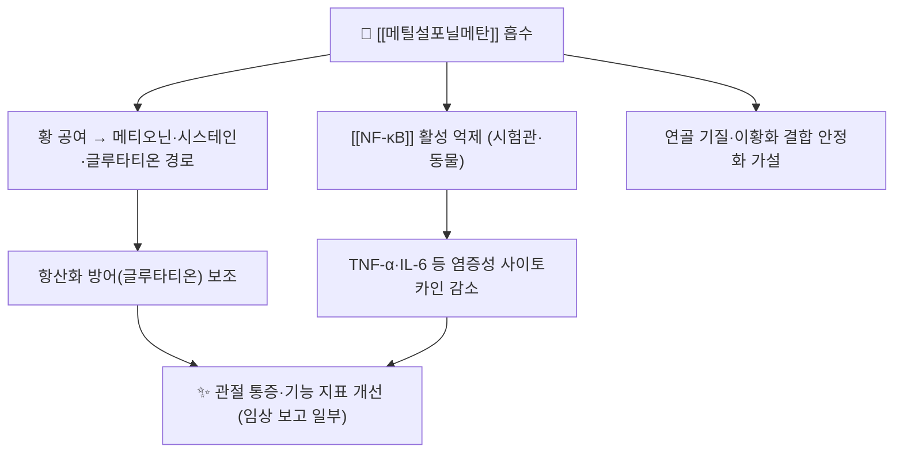

---
aliases:
  - 메틸설포닐메탄
  - Methylsulfonylmethane
  - MSM
  - dimethyl sulfone
  - 디메틸설폰
tags:
  - 약리
  - 약리성분
  - 항염
  - 골관절염
  - 건기식
title: 메틸설포닐메탄
date: 2026-09-24
출처: "PMID: 21708034"
---
# 🔬 메틸설포닐메탄 (Methylsulfonylmethane, MSM / dimethyl sulfone)

> **핵심 3줄 요약 (Key Summary)**:
> - 🌿 기원 & 화학 계열: 자연계에 미량 존재하는 **유기 유황 화합물**(C2H6O2S). 소나무·옥수수·알팔파 등 식물과 우유 등에 미량 함유되며, 시판품은 합성·정제해 **건강기능식품 보충제**로 유통된다.
> - 🎯 핵심 분자 표적 & 조절 경로: 황 공여(sulfur donor)로 메티오닌·시스테인·글루타티온 대사에 관여하고, 시험관·동물 수준에서 [[NF-κB]] 활성 억제·항산화 작용이 보고됐다.
> - 🩺 주요 약리 활성 & 치료 기전: 무릎 골관절염([[퇴행성 슬관절염]]) 통증·기능 보조 목적으로 사용되며, **단독 RCT 근거는 일부 있으나 조합 근거는 없다**.
> - ⚠️ 2026-09-24 ATLAS 시험에서는 MSM 1,500 mg/일을 포함한 경구 복합제가 위약과 차이를 보이지 않았다 — "황 보충제를 조합하면 관절이 좋아진다"는 기대는 현재 근거로 지지되지 않는다.

---

## 📌 목차
1. [기본 화학 정보 & 분자 구조식 (Chemical Identity)](#1-기본-화학-정보--분자-구조식-chemical-identity)
2. [주요 함유 급원 및 천연 기원 (Sources)](#2-주요-함유-급원-및-천연-기원-sources)
3. [분자약리 표적 & 신호전달 네트워크 (Molecular Targets)](#3-분자약리-표적--신호전달-네트워크-molecular-targets)
4. [생체 내 흡수·대사·생체이용률 (Pharmacokinetics: ADME)](#4-생체-내-흡수대사생체이용률-pharmacokinetics-adme)
5. [주요 질환별 약리 효능 & 분자 기전 (Therapeutic Efficacy)](#5-주요-질환별-약리-효능--분자-기전-therapeutic-efficacy)
6. [배합·시너지 매트릭스 (Combination)](#6-배합시너지-매트릭스-combination)
7. [양약 상호작용 & 주의 (Drug Interactions)](#7-양약-상호작용--주의-drug-interactions)
8. [💡 진료실 핵심 필기 & 임상 응용 팁](#8--진료실-핵심-필기--임상-응용-팁)
9. [출처 및 학술 참고 문헌 (References)](#9-출처-및-학술-참고-문헌-references)

---

## 1. 기본 화학 정보 & 분자 구조식 (Chemical Identity)

> [!abstract]+ 🧪 3D 약리 분자 구조 (Interactive 3D Viewer)
> <iframe src="https://molecule-viewer-rho.vercel.app/?cid=6213" width="100%" height="450px" frameborder="0" allow="webgl" style="border-radius: 8px;"></iframe>

| 항목 | 상세 내용 |
| :--- | :--- |
| **IUPAC 명칭** | methylsulfonylmethane (dimethyl sulfone) |
| **분자식 / 분자량** | C2H6O2S / 94.14 g/mol |
| **PubChem CID** | [6213](https://pubchem.ncbi.nlm.nih.gov/compound/6213) |
| **CAS 등록 번호** | 67-71-0 |
| **화학 골격 분류** | 유기 유황 화합물(sulfone) — 식물 유래 2차 대사산물이 아니라 **유황 순환의 산화형 대사체** |
| **물리화학적 성상** | 무색 결정성 고체, 물·알코올에 잘 녹는 극성 화합물, 무취 |

---

## 2. 주요 함유 급원 및 천연 기원 (Sources)

| 급원 | 기원 | 비고 |
| :--- | :--- | :--- |
| 자연 급원 | 소나무·옥수수·알팔파·토마토 등 식물, 우유·커피 등 | 함량이 매우 낮아 식이만으로 유효 용량 섭취는 어렵다 |
| 시판품 | 합성·정제 분말(캡슐·정제·분말) | 건강기능식품 원료로 유통, 대표 배합은 1,500~3,000 mg/일 범위 제품 |
| 복합제 배합 | 관절 보충제 복합제의 구성 성분 | 2026-09-24 ATLAS 복합제에 **1,500 mg/일**로 포함 |

> ⚠️ 한방 본초 분류상의 대응 약재는 아니다 — 광물 유황(硫黃)과도 화학적 실체가 다르다. 한의 처방에서 MSM을 '유황 계열 본초의 대체'로 설명하지 않는다.

---

## 3. 분자약리 표적 & 신호전달 네트워크 (Molecular Targets)

### 1) 핵심 분자 표적
* **황 공여·글루타티온 대사**: 황을 공급해 항산화 방어 체계(글루타티온)를 보조한다는 기전이 제시된다 — 세포 실험 수준 근거가 중심이다.
* [[NF-κB]] 활성 억제 — 염증성 전사인자를 억제해 사이토카인·COX-2 발현을 줄이는 방향의 보고가 있다 → [[COX]].
* **정직성 표기**: 기전 대부분이 in vitro·동물 모델이며, 사람에서 통증 개선과 기전을 연결한 연구는 제한적이다.

---

## 4. 생체 내 흡수·대사·생체이용률 (Pharmacokinetics: ADME)

* 경구 복용 후 위장관에서 빠르게 흡수되어 혈중에서 dimethyl sulfone 형태로 검출되고, 대부분 소변으로 배설된다.
* 황 대사체로 메티오닌 대사 경로와 상호작용한다는 설명이 있어, 황 함유 아미노산 대사가 특이한 환자(예: 일부 대사질환)에서는 전문의 상담이 필요하다.
* 세부 반감기·최대 혈중농도 등 수치는 **본 회차에서 확인된 근거 범위 밖**이므로 기재하지 않는다 — 제품 라벨·약동학 원문 대조 필요.

---

## 5. 주요 질환별 약리 효능 & 분자 기전 (Therapeutic Efficacy)

### 1) 무릎 골관절염 ([[퇴행성 슬관절염]])
* MSM 단독 12주 무작위 시험에서 통증·신체기능 지표 개선이 보고됐다 [PMID: 21708034](https://pubmed.ncbi.nlm.nih.gov/21708034/) — **원문의 용량·수치는 인용 시 원문 대조가 필요**하다.
* 가벼운 무릎 통증 환자에서 삶의 질 지표 개선을 보고한 RCT도 있다 [PMID: 37447322](https://pubmed.ncbi.nlm.nih.gov/37447322/).
* 골관절염 보충제 전체 메타분석에서는 MSM이 상대적으로 근거가 양호한 그룹으로 분류됐다 [PMID: 29018060](https://pubmed.ncbi.nlm.nih.gov/29018060/).
* **그러나** 2026-09-24 ATLAS 시험(MSM 1,500 mg/일 포함 복합제)에서는 위약과 차이가 없었다 [PMID: 42331134](https://pubmed.ncbi.nlm.nih.gov/42331134/) — 단독 근거를 조합 근거로 확대할 수 없다.

### 2) 기타
* 운동 유발 근손상·산화 스트레스 감소 목적의 보고가 있으나, 재현성과 임상적 의미는 확립되지 않았다.

---

## 6. 배합·시너지 매트릭스 (Combination)

| 배합 | 동반 성분 | 해석 |
| :--- | :--- | :--- |
| ATLAS 복합제 | [[보스웰리아]] + [[커큐민]] + 소나무껍질 추출물 + MSM + [[피페린]] | 무릎 OA에서 위약 대비 차이 없음(12주, 84명) |
| 관절 건기식 일반 | 글루코사민·콘드로이틴 등 | 조합 근거는 개별 제품 시험에 한정 — 일반화 금지 |
| 항염 축 대조 | [[NSAIDs]] · [[국소 NSAID]] | 계열 근거가 명확한 쪽이 우선(09-24 리뷰 3번) |

---

## 7. 양약 상호작용 & 주의 (Drug Interactions)

* **항응고·항혈소판제**: 출혈 경향에 대한 이론적 상호작용 보고가 있으나 고품질 임상 연구는 제한적 — 병용 시 문진·징후 관찰을 강화한다.
* **일반 이상반응**: 위장 불편, 두통, 피로, 설사 등이 보고되며 대개 경미하다.
* **임신·수유부·소아**: 안전성 데이터 부족 — 사용 전 전문의 상담.
* **제품 편차**: MSM 함량·복합 구성이 제품마다 달라 'MSM 복용'의 결과를 제품 간 비교할 수 없다.

---

## 8. 💡 진료실 핵심 필기 & 임상 응용 팁

* **환자 문의 대응 프레임(3단)**: ① "관절 보충제 중 상대적으로 근거가 있는 편입니다" ② "다만 최근 이중맹검 시험에서는 여러 성분을 섞은 복합제가 위약과 차이가 없었습니다" ③ "그 돈과 노력을 운동·체중·국소 소염제·침 치료에 쓰는 편이 확실합니다".
* **기대치 조정이 곧 진료**: MSM을 끊게 하는 목적이 아니라, **보충제 의존으로 근거 있는 치료가 밀리지 않게** 하는 것이 목적이다.
* **복약 이력 청취 항목**: 관절 건기식(MSM·보스웰리아·커큐민·글루코사민), 항응고제, 신기능 저하 여부.
* **환자 설명 스크립트**: "MSM은 황을 공급해 염증을 줄이는 방향으로 연구된 성분입니다. 단독으로는 효과를 봤다는 연구가 있지만, 여러 성분을 섞은 제품에서는 위약과 차이가 없었습니다. 그래서 저는 보조로만 보고, 통증 조절은 근거가 확실한 방법으로 하시길 권합니다."

---

## 9. 출처 및 학술 참고 문헌 (References)

1. **2026-09-24 심층리뷰 2번**: Osteoarthritis and Cartilage 2026;34(10):1515-1524, [PMID: 42331134](https://pubmed.ncbi.nlm.nih.gov/42331134/) · DOI [10.1016/j.joca.2026.06.008](https://doi.org/10.1016/j.joca.2026.06.008)
   - [연구 요약] MSM 1,500 mg/일을 포함한 경구 복합제가 무릎 OA 12주에서 위약과 차이 없었다 — 복합제 설계의 한계를 보여준 근거다.
2. **Efficacy of methylsulfonylmethane supplementation on osteoarthritis of the knee: a randomized controlled study.** *BMC Complementary and Alternative Medicine*. 2011;11:50. [PMID: 21708034](https://pubmed.ncbi.nlm.nih.gov/21708034/)
   - [연구 요약] MSM 단독 보충이 무릎 OA 통증·기능 지표를 개선했다고 보고한 무작위 시험이다(용량·수치는 원문 대조 필요).
3. **Methylsulfonylmethane Improves Knee Quality of Life in Participants with Mild Knee Pain: A Randomized, Double-Blind, Placebo-Controlled Trial.** *Nutrients*. 2023;15(13). [PMID: 37447322](https://pubmed.ncbi.nlm.nih.gov/37447322/)
   - [연구 요약] 가벼운 무릎 통증 환자에서 MSM이 무릎 관련 삶의 질 지표를 개선했다고 보고한 RCT다.
4. **Liu X, et al.** Dietary supplements for treating osteoarthritis: a systematic review and meta-analysis. *British Journal of Sports Medicine*. 2018;52(3):167-175. [PMID: 29018060](https://pubmed.ncbi.nlm.nih.gov/29018060/)
   - [연구 요약] 골관절염 보충제 중 MSM·보스웰리아 등 근거가 상대적으로 양호한 그룹을 정리한 메타분석이다.
5. **PubChem CID 6213 (dimethyl sulfone / MSM)**: https://pubchem.ncbi.nlm.nih.gov/compound/6213 — 분자식 C2H6O2S, 분자량 94.14 확인.

---

## 🔗 함께 보기

- 배합 성분: [[보스웰리아]] · [[커큐민]] · [[피페린]] · [[콜라겐]]
- 질환: [[퇴행성 슬관절염]] · [[힘줄병증]]
- 기전: [[NF-κB]] · [[COX]] · [[글루타티온]] · [[메티오닌]]
- 근거·평가: [[Kellgren-Lawrence 등급]] · [[MCID]] · [[OARSI 2019 가이드라인]] · [[NSAIDs]] · [[국소 NSAID]]
- 관련 리뷰: [[2026-09-24_통합의학약리학_심층리뷰]] 2번 · [[2026-09-24_통합의학약리학_개념학습]]

<!-- 보관 태그(1회용·링크오류, 필요시 복원): 유기황 -->
