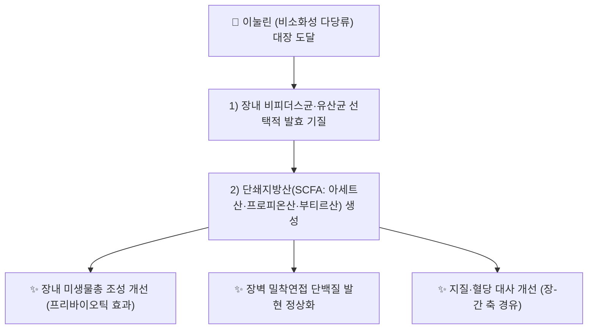

# 🔬 [[이눌린]] (Inulin, (C₆H₁₀O₅)ₙ)

> **핵심 3줄 요약 (Key Summary)**:
> - 🌿 기원 본초 & 화학 계열: [[토목향]](*Inula helenium*, 국화과)·[[길경]](*Platycodon grandiflorum*, 초롱꽃과) 등 여러 본초의 뿌리에 저장 다당류로 함유된 프럭탄(fructan)계 수용성 식이섬유. 과당(fructose) 단위가 β(2→1) 결합으로 중합되고 말단에 포도당이 결합한 구조.
> - 🎯 핵심 분자 표적 & 조절 경로: 장내 세균총(특히 *Bifidobacterium*·*Lactobacillus*)의 선택적 발효 기질로 작용해 단쇄지방산(SCFA) 생성을 촉진하는 프리바이오틱 기전.
> - 🩺 주요 약리 활성 & 질환 치료 기전: 장내 미생물총 조절, 배변 기능 개선, 지질·혈당 대사 개선(2형 당뇨·이상지질혈증 보조), 장벽 밀착연접 단백질 발현 정상화를 통한 장 장벽 보호.
> - ⚠️ 독성·생체이용률 한계 & 상호작용: 다당류 특성상 단일 분자량·표준 ADME 개념이 적용되지 않으며(장내 미생물 발효를 통해서만 대사됨), 과량 섭취 시 복부팽만·가스·설사 등 위장관 불편감이 흔히 보고됨. 특정 양약과의 확립된 임상적 약동학적 상호작용 문헌은 검색 범위 내에서 충분히 확인하지 못함(⚠️ 확인 필요).

---

## 📌 목차
1. [기본 화학 정보 & 분자 구조식 (Chemical Identity)](#1-기본-화학-정보--분자-구조식-chemical-identity)
2. [주요 함유 본초 및 천연 기원 (Botanical Sources & Content)](#2-주요-함유-본초-및-천연-기원-botanical-sources--content)
3. [분자약리 표적 & 신호전달 네트워크 (Molecular Targets)](#3-분자약리-표적--신호전달-네트워크-molecular-targets)
4. [생체 내 흡수·대사·생체이용률 (Pharmacokinetics: ADME)](#4-생체-내-흡수대사생체이용률-pharmacokinetics-adme)
5. [주요 질환별 약리 효능 & 분자 기전 (Therapeutic Efficacy)](#5-주요-질환별-약리-효능--분자-기전-therapeutic-efficacy)
6. [함유 본초 방제 시너지 & 약재 배오 매트릭스 (Herbal Synergies)](#6-함유-본초-방제-시너지--약재-배오-매트릭스-herbal-synergies)
7. [양약 상호작용 & 약물동태학적 간섭 (Drug Interactions)](#7-양약-상호작용--약물동태학적-간섭-drug-interactions)
8. [💡 사용자 진료실 핵심 필기 & 임상 응용 팁 (Melt-In & High-Yield)](#8--사용자-진료실-핵심-필기--임상-응용-팁-melt-in--high-yield)
9. [출처 및 학술 참고 문헌 (References)](#9-출처-및-학술-참고-문헌-references)

---
## 1. 기본 화학 정보 & 분자 구조식 (Chemical Identity)

![[이눌린_화학구조식.png|320]]
> [그림 1: 이눌린 2D 화학 분자 구조식 (출처: 위키미디어 공용 · NCI CACTVS 구조 데이터)]

> [!abstract]+ 🧪 3D 약리 분자 구조 (Interactive 3D Viewer)
> <iframe src="https://molecule-viewer-rho.vercel.app/?cid=7620" width="100%" height="450px" frameborder="0" allow="webgl" style="border-radius: 8px;"></iframe>

| 항목 | 상세 내용 |
| :--- | :--- |
| **IUPAC 명칭** | 해당 없음 (다당류 — 반복 단위: β-D-fructofuranosyl 사슬) |
| **분자식 / 분자량** | (C₆H₁₀O₅)ₙ / 가변(중합도 n≈2~60, 단일 분자량 없음) |
| **PubChem CID** | [7620](https://pubchem.ncbi.nlm.nih.gov/compound/7620) |
| **CAS 등록 번호** | 9005-80-5 |
| **화학 골격 분류** | 프럭탄(fructan)계 수용성 식이섬유 — 과당 단위 β(2→1) 결합 중합체, 말단 포도당(GFn 구조) |
| **물리화학적 성상** | 백색 무정형 분말, 수용성(온수에 잘 녹음), 단맛이 약함, 비소화성(인체 소화효소로 분해되지 않음) |

---

## 2. 주요 함유 본초 및 천연 기원 (Botanical Sources & Content)

| 함유 본초 (한글/한자) | 기원 식물학적 명칭 (과명 / 학명) | 주요 함유 약용 부위 | 한의학적 귀경 및 약효 특성 |
| :--- | :--- | :--- | :--- |
| [[토목향]] (土木香) | 국화과(Asteraceae) / *Inula helenium* L. | 뿌리 (최대 40~44%로 [[알란토락톤]] 노트에 기술) | 肝·脾·胃經 / 신고온(辛苦溫) — 이기지통(理氣止痛), 건비화위(健脾和胃) |
| [[길경]] (桔梗) | 초롱꽃과(Campanulaceae) / *Platycodon grandiflorum* (Jacq.) A.DC. | 뿌리 | 肺經 / 고신평(苦辛平) — 선폐거담(宣肺祛痰), 이인개음(利咽開音) |

> [[알란토락톤]] 노트에서 이눌린은 토목향의 핵심 다당류(최대 40~44%)로 이미 언급된 바 있으며, 본 노트는 이눌린 자체를 독립 성분으로 상세화합니다. 길경 내 정확한 함량(%) 수치는 이번 조사 범위 내에서 확인하지 못해 ⚠️ 확인 필요로 표기합니다.

---

## 3. 분자약리 표적 & 신호전달 네트워크 (Molecular Targets)

### 1) 프리바이오틱 기전 — 장내 미생물총 발효
* 이눌린이 대장까지 소화되지 않고 도달해 *Bifidobacterium*·*Lactobacillus* 등 유익균의 선택적 발효 기질로 작용, 장내 미생물총 조성을 개선함이 체계적 문헌고찰로 정리됨(PMID 31707507, 34555168).
### 2) 대사성 표적 — 장-간 축
* 발효 산물인 단쇄지방산(SCFA)을 매개로 지질·혈당 대사 개선에 관여하는 기전이 제약과학·건강 효능 리뷰에서 종합됨(PMID 39074033, 36876591).

---

## 4. 생체 내 흡수·대사·생체이용률 (Pharmacokinetics: ADME)

* **소화·흡수**: 이눌린은 인체 소화효소(아밀라아제 등)로 분해되지 않아 소장에서 거의 흡수되지 않고 그대로 대장에 도달함 — 표준적인 소분자 ADME 개념이 적용되지 않는 다당류 특유의 대사 경로.
* **대장 발효**: 대장 내 미생물총에 의해 발효되어 단쇄지방산(SCFA)과 가스(H₂, CO₂, CH₄)를 생성함 — 이 발효 과정 자체가 이눌린의 "대사"에 해당함(PMID 39074033).
* ⚠️ 내용 검토 필요: 개인별 장내 미생물총 조성에 따른 발효 효율·SCFA 생성량 편차에 대한 정량적 데이터는 검색 범위 내에서 추가 확인이 필요합니다.

---

## 5. 주요 질환별 약리 효능 & 분자 기전 (Therapeutic Efficacy)

### 1) 장 건강 및 배변 기능
* 프리바이오틱 작용을 통한 장내 미생물총 조성 개선 및 배변 기능 개선이 다수 체계적 문헌고찰로 뒷받침됨(PMID 31707507, 34555168).
### 2) 대사성 질환(당뇨·이상지질혈증 보조)
* 장-간 축을 경유한 지질·혈당 대사 개선 가능성이 제약과학 리뷰에서 정리됨(PMID 39074033) — ⚠️ 보조요법 수준 근거이며 단독 치료 근거는 아님을 명시.
### 3) 종양 관련 예비 연구
* 항암 효과 관련 예비적 연구가 존재하나(포괄적 리뷰, PMID 39940613), 임상 확증 단계는 아니므로 ⚠️ 전임상 수준 근거임을 명시.

---

## 6. 함유 본초 방제 시너지 & 약재 배오 매트릭스 (Herbal Synergies)

| 함유 본초 / 방제 | 공존 유효 성분군 | 분자약리 시너지 기전 | 전통 한의학적 효능 연계 |
| :--- | :--- | :--- | :--- |
| [[토목향]] | [[알란토락톤]], [[이소알란토락톤]] | 세스퀴테르펜 락톤의 평활근 이완 작용과 다당류의 정장(整腸)·완하 작용 상보 | 이기지통(理氣止痛), 건비화위(健脾和胃) |
| [[길경]] | 플라티코딘류(Platycodin) 사포닌 | 사포닌의 거담 작용과 다당류의 점막 보호·면역조절 작용 상보 | 선폐거담(宣肺祛痰), 이인개음(利咽開音) |

---

## 7. 양약 상호작용 & 약물동태학적 간섭 (Drug Interactions)

* **경구 혈당강하제·인슐린 병용 시 고려사항**: 이눌린의 혈당 개선 작용이 보고된 만큼(PMID 39074033), 경구 혈당강하제·인슐린과 병용 시 저혈당 위험을 이론적으로 고려할 필요가 있습니다(⚠️ 추정, 실측 임상 상호작용 근거 아님).
* **위장관 부작용**: 과량(1일 수십g 이상) 섭취 시 복부팽만·가스·설사 등 위장관 불편감이 흔히 보고되며, 과민성장증후군(IBS) 환자에서는 증상 악화 가능성이 있어 소량부터 점진적으로 늘리는 것이 권장됩니다.

---

## 8. 💡 사용자 진료실 핵심 필기 & 임상 응용 팁 (Melt-In & High-Yield)

* ⚠️ 내용 검토 필요: 원장님의 진료실 필기가 아직 반영되지 않았습니다. [[토목향]]·[[길경]] 노트의 임상 필기를 참고하시어 이눌린 단일 성분 수준의 진료 팁(예: 변비·과민성장증후군 환자에서의 활용 시 주의사항)을 추가해 주시면 다빈치가 다음 순찰 시 정리해 드리겠습니다.

---

## 9. 출처 및 학술 참고 문헌 (References)

1. **(2024)**. *Inulin: a multifaceted ingredient in pharmaceutical sciences*.
   - [PubMed: PMID 39074033](https://pubmed.ncbi.nlm.nih.gov/39074033/)
   - **[연구 요약]**: 이눌린의 제약학적 활용(부형제·프리바이오틱 등)과 장-간 축을 통한 대사 개선 기전을 종합 정리.
2. **(2023)**. *Inulin: properties and health benefits*.
   - [PubMed: PMID 36876591](https://pubmed.ncbi.nlm.nih.gov/36876591/)
   - **[연구 요약]**: 이눌린의 이화학적 특성과 건강 효능(장 건강·대사 개선 등)을 종합 리뷰.
3. **(2021)**. *The Prebiotic Potential of Inulin-Type Fructans: A Systematic Review*.
   - [PubMed: PMID 34555168](https://pubmed.ncbi.nlm.nih.gov/34555168/)
   - **[연구 요약]**: 이눌린형 프럭탄의 프리바이오틱 효과에 대한 체계적 문헌고찰.
4. **(2019)**. *The effects of inulin on gut microbial composition: a systematic review of evidence from human studies*.
   - [PubMed: PMID 31707507](https://pubmed.ncbi.nlm.nih.gov/31707507/)
   - **[연구 요약]**: 인체 대상 연구를 종합해 이눌린이 장내 미생물 조성에 미치는 영향을 체계적으로 검토.
5. **(2025)**. *Inulin as a Biopolymer; Chemical Structure, Anticancer Effects, Nutraceutical Potential and Industrial Applications: A Comprehensive Review*.
   - [PubMed: PMID 39940613](https://pubmed.ncbi.nlm.nih.gov/39940613/)
   - **[연구 요약]**: 이눌린의 화학구조·항암 가능성·건강기능식품 및 산업적 활용을 포괄적으로 검토(항암 부분은 ⚠️ 전임상 수준).

> ⚠️ 확인 불가/추정 표시 총괄: 개인별 발효 효율 정량 데이터, 확립된 양약 상호작용 임상 자료, 길경 내 정확한 함량(%), 진료실 임상 필기는 검색 범위 내에서 실측 확인하지 못해 위 각 섹션에 개별 표시했습니다. 상기 PubChem CID·CAS 번호·PMID 5건은 모두 실제 데이터베이스에서 확인된 값입니다.

<!-- 보관 태그(1회용·링크오류, 필요시 복원): 프럭탄, 프리바이오틱 -->
