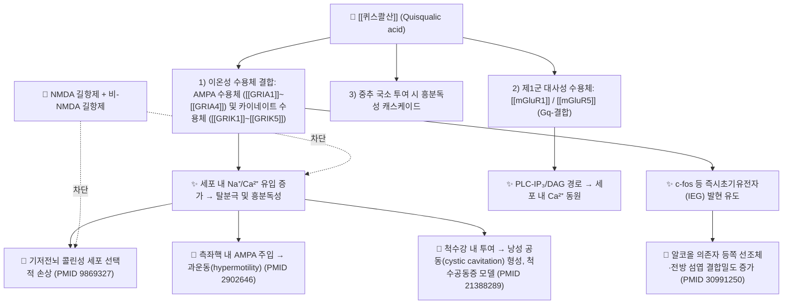

# 🔬 [[퀴스콸산]] (Quisqualic acid, C₅H₇N₃O₅ / (2S)-2-amino-3-[(3,5-dioxo-1,2,4-oxadiazolidin-2-yl)]propanoic acid)

![[퀴스콸산_1_2.jpg|540]]
> [그림 1: ① 병태생리·영상 — Quisqualic acid.png]

> **핵심 3줄 요약 (Key Summary)**:
> - 🌿 기원 본초 & 화학 계열: 한의학 구충(驅蟲) 요약(要藥)인 [[사군자]](使君子, *Quisqualis indica* L., 사군자과 Combretaceae) 성숙 과실의 대표 지표성분. 천연물 화학적으로는 **환형 우레아(옥사디아졸리딘디온) 골격을 갖는 비단백성 아미노산** 계열의 [[흥분성 아미노산]](excitatory amino acid)이다.
> - 🎯 핵심 분자 표적 & 조절 경로: 이온성 글루탐산 수용체 중 **AMPA 수용체**([[GRIA1]]~[[GRIA4]]) 및 **카이네이트 수용체**, 그리고 제1군 대사성 글루탐산 수용체([[mGluR1]]/[[mGluR5]])에 대한 작용제(agonist). 즉 글루탐산성 신경전달을 **활성(흥분) 방향**으로 조절하며, 흥분독성(excitotoxicity) 기전 연구의 표준 도구 화합물로 쓰인다.
> - 🩺 주요 약리 활성 & 질환 치료 기전: 전통적으로는 [[사군자]] 과실의 **구충(회충·요충)·소적(消積)·소아 감적(疳積)** 효능과 연결된다. 현대 약리학에서는 뇌 기저전뇌 콜린성 신경세포의 선택적 흥분독성 병변 유도(PMID 9869327), 측좌핵 과운동 반응(PMID 2902646), 알코올 의존 뇌조직에서의 결합밀도 변화(PMID 30991250), 외상후 척수공동증 동물모델 유발(PMID 21388289) 등 **신경회로 병태생리 연구용 병변 유발제**로 위치한다. 즉 그 자체가 치료제라기보다 **약리학적 도구(pharmacological tool)** 성격이 강하다.
> - ⚠️ 독성·생체이용률 한계 & 상호작용: 강력한 흥분독성이 대표적 한계이며, 실험적으로는 NMDA 및 비-NMDA 수용체 길항제에 의해 독성이 차단된다(PMID 1359473). 사람에서의 경구 흡수율·혈장 반감기·CYP 대사·P-gp 기질성 등 정량적 ADME 자료는 본 노트에 인용된 논문 범위 내에서 **근거 미확인**이다. 사군자(使君子) 과실 자체의 과량·장기 복용 시 이상반응 보고가 있으나, 성분 수준의 정량 독성 자료 역시 본 인용 문헌에는 포함되어 있지 않다.

---

## 📌 목차
1. [기본 화학 정보 & 분자 구조식 (Chemical Identity)](#1-기본-화학-정보--분자-구조식-chemical-identity)
2. [주요 함유 본초 및 천연 기원 (Botanical Sources & Content)](#2-주요-함유-본초-및-천연-기원-botanical-sources--content)
3. [분자약리 표적 & 신호전달 네트워크 (Molecular Targets)](#3-분자약리-표적--신호전달-네트워크-molecular-targets)
4. [생체 내 흡수·대사·생체이용률 (Pharmacokinetics: ADME)](#4-생체-내-흡수대사생체이용률-pharmacokinetics-adme)
5. [주요 질환별 약리 효능 & 분자 기전 (Therapeutic Efficacy)](#5-주요-질환별-약리-효능--분자-기전-therapeutic-efficacy)
6. [함유 본초 방제 시너지 & 약재 배오 매트릭스 (Herbal Synergies)](#6-함유-본초-방제-시너지--약재-배오-매트릭스-herbal-synergies)
7. [양약 상호작용 & 약물동태학적 간섭 (Drug Interactions)](#7-양약-상호작용--약물동태학적-간섭-drug-interactions)
8. [💡 사용자 진료실 핵심 필기 & 임상 응용 팁 (Melt-In & High-Yield)](#8--사용자-진료실-핵심-필기--임상-응용-팁-melt-in--high-yield)
9. [출처 및 학술 참고 문헌 (References)](#9-출처-및-학술-참고-문헌-references)

---

## 1. 기본 화학 정보 & 분자 구조식 (Chemical Identity)

> [!abstract]+ 🧪 3D 약리 분자 구조 (Interactive 3D Viewer)
> 본 노트 작성 시점에 PubChem CID가 문헌 교차확인되지 않아 **3D 뷰어 임베드를 생략**하였다. PubChem에서 "Quisqualic acid"를 직접 검색하여 CID를 확정한 뒤 아래 형식으로 임베드하면 된다.
> `<iframe src="https://molecule-viewer-rho.vercel.app/?cid=확인된_CID" width="100%" height="450px" frameborder="0" allow="webgl"></iframe>`

| 항목 | 상세 내용 |
| :--- | :--- |
| **IUPAC 명칭** | (2S)-2-amino-3-[(3,5-dioxo-1,2,4-oxadiazolidin-2-yl)]propanoic acid |
| **관용 명칭** | Quisqualic acid, Quisqualate (퀴스콸산, 퀴스콸레이트) |
| **분자식 / 분자량** | C₅H₇N₃O₅ / 약 189.13 g/mol |
| **PubChem CID** | **근거 미확인** (PubChem에서 "Quisqualic acid" 직접 검색 권장) |
| **CAS 등록 번호** | 52809-07-1 (문헌 교차확인 권장 — 본 노트 인용 논문에는 미기재) |
| **화학 골격 분류** | 비단백성 아미노산(non-proteinogenic amino acid) 계열. **L-알라닌 골격**에 **3,5-디옥소-1,2,4-옥사디아졸리딘(환형 우레아/옥사디아졸리딘디온) 고리**가 N-결합된 구조 |
| **물리화학적 성상** | 아미노산 유사체로 **친수성(극성)이 매우 높음**. 정량적 LogP·융점·용해도 수치는 **근거 미확인**. 산·염기 양쪽성(zwitterion) 거동 예상 |
| **식물 내 생합성 경로** | 사군자 과실 내 퀴스콸산의 생합성 캐스케이드 및 관여 효소는 **근거 미확인** (본 노트 인용 논문 범위 밖) |
| **명명사(命名史) 주의점** | 과거 문헌의 "quisqualate receptor(퀴스콸산 수용체)"는 이후 **AMPA 수용체**로 명칭이 정리되었다. 따라서 1980~90년대 논문(예: PMID 2902646, 1359473)의 "퀴스콸산 수용체"는 현재의 **AMPA 수용체(및 일부 카이네이트/제1군 mGluR)** 를 지칭하는 것으로 독해해야 한다 |

---

## 2. 주요 함유 본초 및 천연 기원 (Botanical Sources & Content)

| 함유 본초 (한글/한자) | 기원 식물학적 명칭 (과명 / 학명) | 주요 함유 약용 부위 | 지표 함량 (%) | 한의학적 귀경 및 약효 특성 |
| :--- | :--- | :--- | :--- | :--- |
| [[사군자]] (使君子) | 사군자과(Combretaceae) / *Quisqualis indica* L. | 성숙 과실(과핵, 씨) | **근거 미확인** (본 인용 논문에 정량 함량 데이터 없음) | 甘, 溫. 歸 脾·胃經. **살충소적(殺蟲消積)** — 회충·요충 구제, 소아 감적(疳積)·복창(腹脹) 등 |
| [[사군자엽]](使君子葉) 등 동속 부위 | 사군자과 / *Quisqualis* 속 | 잎·줄기(전통 보조 약용) | **근거 미확인** | 전통적으로 소화기·구충 보조 용도로 쓰인 문헌 기록이 있으나 성분 수준 근거는 **미확인** |

> [!note] 기원·함량 해석 시 주의
> - 퀴스콸산은 사군자(使君子) 과실의 **구충 활성 지표성분**으로 널리 알려져 있으나, **함량(%)·부위별 분포·계절 변동**에 대한 정량 자료는 본 노트에 제시된 PubMed 문헌에서 확인되지 않는다.
> - 사군자 이외 식물(일부 Combretum 속 등)에서의 존재 보고가 거론되기도 하나, **본 노트의 인용 범위 내에서는 근거 미확인**이므로 별도 문헌 확인이 필요하다.

---

## 3. 분자약리 표적 & 신호전달 네트워크 (Molecular Targets)

### 1) 핵심 분자 표적 (Molecular Targets)
* **AMPA 수용체 (이온성 글루탐산 수용체, GluA1–GluA4)**: 퀴스콸산은 AMPA 수용체의 대표적 작용제이며, 이 수용체 채널의 **활성화 kinetics 분석을 통해 기능적 작용제 결합 부위 수(functional agonist binding sites)를 규명하려 한 전기생리학 연구**(PMID 9412492)에서 작용제로 사용되었다. 리간드 결합 시 채널이 열려 Na⁺(및 일부 Ca²⁺) 유입이 발생하고, 이것이 탈분극과 흥분독성의 출발점이 된다.
  * ※ 해당 논문이 제시한 **구체적 결합 부위 개수 수치**는 본 노트에서 **근거 미확인**이므로, 인용 시 원문(PMID 9412492) 확인이 필요하다.
* **카이네이트 수용체 (GluK1–GluK5)**: 퀴스콸산은 AMPA 수용체에 대한 선택성이 상대적으로 높지만, 과거 문헌에서는 카이네이트성 성분과의 구분이 명확하지 않았다. 흥분독성 보호 실험에서 **NMDA 길항제와 비-NMDA(즉 AMPA/카이네이트) 길항제가 모두 보호 효과**를 보였다는 결과(PMID 1359473)는 퀴스콸산 유발 손상에 **이온성 글루탐산 수용체 아형이 복합적으로 관여**함을 시사한다.
* **제1군 대사성 글루탐산 수용체 ([[mGluR1]]/[[mGluR5]])**: 퀴스콸산은 제1군 mGluR의 고전적 작용제로도 분류된다. 즉 동일 분자가 **이온성 수용체(빠른 흥분)와 대사성 수용체(느린 조절)** 를 동시에 자극할 수 있다는 점이 퀴스콸산의 약리학적 특징이며, 선택성 부족의 원인이기도 하다. (본 노트 인용 논문에서 mGluR 관련 정량 데이터는 **근거 미확인**.)
* **즉시초기유전자(IEG) 유도**: 흥분독성 자극 후 **c-fos 발현**이 유도되며, 이는 손상 부위와 활성화 범위를 지도화하는 표지로 사용된다(PMID 9869327 — 흰쥐 기저전뇌 핵(nucleus basalis) 병변 모델, 성체 vs 노령 동물 비교).

### 2) 신호전달 조절 요약
* 이온성 수용체 → **탈분극·Ca²⁺ 과부하 → 미토콘드리아 기능장애, 산화스트레스, 세포자멸/괴사**로 이어지는 전형적 흥분독성 캐스케이드가 기본 축이다.
* 대사성 수용체 → **PLC–IP₃/DAG–Ca²⁺ 동원 및 단백질인산화효소 조절**을 통해 흥분성을 장시간 항진시킨다(정량적 하위 경로는 본 노트 인용 범위 내 **근거 미확인**).

---

## 4. 생체 내 흡수·대사·생체이용률 (Pharmacokinetics: ADME)

> [!warning] 본 섹션의 대부분은 **근거 미확인**이다.
> 아래 인용 논문들은 모두 **국소·중추 투여(미세주입, 척수강 내 주입)** 또는 **사후 조직 결합실험**을 사용한 것으로, 퀴스콸산의 경구 PK 파라미터를 다룬 연구가 아니다. 따라서 정량적 ADME 값은 추정하지 않는다.

* **장관 흡수 및 배출 펌프 (P-gp) 상호작용**:
  * 퀴스콸산의 장 점막 투과율, P-glycoprotein(ABCB1) 기질 여부, 유출 펌프에 의한 재배출 정도에 대한 데이터는 본 노트 인용 문헌에서 **근거 미확인**.
  * 다만 퀴스콸산이 **고극성 아미노산 유사체**라는 화학적 성상상 수동 확산에 의한 세포막 통과가 제한적일 것으로 예상되며, 실제 실험 문헌들이 **뇌실/국소 미세주입·척수강 내 주입**을 채택한 점(PMID 9869327, PMID 2902646, PMID 21388289)은 이 화합물의 **중추 도달률 한계**를 우회하기 위한 설계로 해석된다. (이 해석은 정황적 추론이며 정량 근거는 **미확인**.)
* **장내 미생물총(Microbiome) 대사 전환**:
  * 장내 세균에 의한 퀴스콸산의 활성/불활성 대사체 전환, 장-간 순환(Enterohepatic circulation) 여부: **근거 미확인**.
  * 사군자(使君子) **전탕액(복합 본초)** 복용 시에는 공존 성분에 의한 흡수 양상 변화 가능성이 거론될 수 있으나, 성분 수준 검증 자료는 **미확인**.
* **간 대사 및 소실 반감기**:
  * CYP450 효소(CYP2D6, CYP3A4 등) 대사 여부, 제2상 포합 반응(글루쿠론산화·황산화), 혈장 반감기(t₁/₂): **모두 근거 미확인**.
  * 아미노산 계열 화합물의 일반적 경향(신장 배설, 아미노산 수송체 관여)은 **추정**일 뿐이며 본 노트에서는 확정 기술하지 않는다.
* **실험적 투여 경로 (문헌 기반 확인 사항)**:
  * 뇌 기저전뇌 핵(nucleus basalis) 내 **흥분독성 병변 유도 주입** (PMID 9869327)
  * 측좌핵(nucleus accumbens) 내 **국소 주입** (PMID 2902646)
  * 척수강 내(intraspinal/intrathecal) **주입을 통한 척수공동증 모델 유발** (PMID 21388289, 리뷰에서 모델로 언급)
  * 사후 뇌 조직 절편에서 **[³H]퀴스콸산 결합 자가방사선촬영(autoradiography)** (PMID 30991250)

---

## 5. 주요 질환별 약리 효능 & 분자 기전 (Therapeutic Efficacy)

> [!info] 해석 프레임
> 퀴스콸산은 **"치료제"보다 "병변 유발제·작용제 도구"** 로서의 증거가 압도적이다. 따라서 아래는 "퀴스콸산이 치료하는 질환"이 아니라 **"퀴스콸산으로 재현·연구되는 질환 병태생리"** 중심으로 정리한다. 제2형 당뇨·심혈관·지질·항염 등 대사/염증 계열 효능은 **본 인용 문헌 범위 내 근거 미확인**이다.

### 1) 중추 콜린성 시스템 손상 & 신경변성 모델 (기저전뇌 핵)
* 흰쥐 **기저전뇌 핵(nucleus basalis magnocellularis)** 에 퀴스콸산을 주입하면 **흥분독성 병변**이 유도되고, 이때 **c-fos 발현**이 나타난다. 해당 연구는 **성체(adult)와 노령(aged) 동물을 비교**하여 연령에 따른 손상 반응 차이를 관찰하였다(PMID 9869327).
* 의의: 기저전뇌 콜린성 신경세포 소실은 알츠하이머병 등 인지기능 저하 질환의 핵심 병리 중 하나로, 퀴스콸산 병변 모델은 **콜린성 결손 → 인지저하** 연구의 표준 도구로 사용되어 왔다.
* **한의학적 연결**: 사군자(使君子)의 전통 효능은 구충·소적이며, 콜린성 신경보호 효능은 전통 문헌에 존재하지 않는다. 이 모델은 **현대 신경약리학적 재해석 영역**으로 구분해야 한다.

### 2) 중뇌변연계 도파민 회로 & 알코올 의존 (측좌핵·선조체·섬엽)
* **측좌핵 내 AMPA 주입에 의한 과운동(hypermotility) 반응**에 퀴스콸산 수용체(현 AMPA 수용체)가 관여함이 보고되었다(PMID 2902646). 즉 AMPA/퀴스콸산 수용체 활성화가 **운동 활성 조절**에 직접 연결된다.
* **알코올 의존자 사후 뇌 전반 자가방사선촬영**에서 **[³H]퀴스콸산 결합밀도가 등쪽 선조체(dorsal striatum)와 전방 섬엽(anterior insula)에서 증가**하였다(PMID 30991250). 이는 알코올 의존 상태에서 이들 부위의 **글루탐산성(퀴스콸산 민감성) 수용체 체계 변화**를 시사한다.
* **한의학적 연결**: 전통적으로 사군자는 주로 기생충·소아 소화기 질환에 사용되었으며, 중독/의존 회로와의 연계는 전통 문헌 근거가 없다. 중추 글루탐산 조절 관점에서의 응용은 **연구 단계**로 보아야 한다.

### 3) 외상후 척수공동증(Posttraumatic syringomyelia) 모델
* 외상후 척수공동증 리뷰(PMID 21388289)에서 **척수강 내 흥분독성 물질 투여로 낭성 공동(cystic cavitation)을 유도하는 동물모델**이 병태생리 연구에 활용되는 것으로 정리되어 있다. 퀴스콸산은 이러한 **흥분독성 유도제 중 하나**로 언급된다.
* 의의: 척수 손상 후 **글루탐산 흥분독성 → 조직 괴사·공동 형성 → 신경학적 악화**라는 기전 가설을 검증하는 플랫폼을 제공한다.
* **한의학적 연결**: 척수 손상·위수(痿證) 영역에서의 한약 활용은 별도 연구 주제이며, 퀴스콸산 자체와의 연결은 **근거 미확인**.

### 4) 수용체 약리학적 특성 규명 (기전 연구)
* **AMPA 수용체 채널 활성화 kinetics** 분석을 통해 기능적 작용제 결합 부위 수를 추정한 연구에서 퀴스콸산이 작용제로 사용됨(PMID 9412492, 구체 수치는 원문 확인 필요).
* **흥분독성 차단**: 퀴스콸산 유발 신경독성이 **NMDA 수용체 길항제와 비-NMDA 수용체 길항제 모두에 의해 보호**되었다(PMID 1359473). 이는 퀴스콸산 손상 기전이 단일 수용체가 아닌 **복합 글루탐산 수용체 네트워크**를 통해 작동함을 보여준다.

### 5) 구충(驅蟲) — 전통 효능과의 접점
* [[사군자]]는 한의학에서 **회충(回蟲)·요충(蟯蟲) 구제, 소아 감적(疳積)** 의 요약(要藥)으로 쓰여 왔으며, 퀴스콸산은 그 **지표성분**으로 알려져 있다.
* 다만 **퀴스콸산 단일 성분의 구충 활성 정량 데이터(ED₅₀, 기생충 종별 감수성 등)는 본 노트 인용 문헌 범위 내 근거 미확인**이다. 전통 효능과 분자 기전을 연결하려면 별도 기생충학 문헌 확인이 필요하다.

---

## 6. 함유 본초 방제 시너지 & 약재 배오 매트릭스 (Herbal Synergies)

> [!caution] 아래 표의 "시너지 기전" 열은 **전통 배오 원칙 + 일반적 약리 추론**이며, 퀴스콸산을 대상으로 한 **성분 수준 시너지 실험 데이터는 본 인용 문헌에 없음(근거 미확인)**.

| 함유 본초 / 방제 | 공존 유효 성분군 | 분자약리 시너지 기전 (추정/문헌 구분) | 전통 한의학적 효능 연계 |
| :--- | :--- | :--- | :--- |
| [[사군자]] (使君子) 단미 | 퀴스콸산(지표성분), 기타 과실 유래 성분(정량 **미확인**) | 단일 성분의 흥분독성 노출을 **복합 기질(matrix)이 완충**할 가능성 — **근거 미확인** | 살충소적, 소아 감적, 비위 허약자 배려 |
| [[사군자]] + [[빈랑]](檳榔) | 아레콜린 계열 알칼로이드(빈랑) + 퀴스콸산(사군자) | 구충 작용의 **기전 보완형 배오**: 추정 수준, 성분 상호작용 데이터 **미확인** | 제충(諸蟲) 구제, 복통·복창 완화 |
| [[사군자]] + [[고련피]](苦楝皮) | 트리테르페노이드 계열(고련피) | 구충 범위 확대 목적의 전통 배오 — 분자 시너지 **근거 미확인** | 회충·요충 겸치, 적체(積滯) 소통 |
| [[사군자산]](使君子散) 등 복합 방제 | 방제 구성 본초 전체 | 다표적 조합 — **근거 미확인** | 감적·복창·소화불량 개선 |

---

## 7. 양약 상호작용 & 약물동태학적 간섭 (Drug Interactions)

* **CYP450 효소 간섭**:
  * 퀴스콸산의 CYP2D6·CYP3A4 등에 대한 억제/유도 여부 및 병용 양약 혈중농도 변동 위험: **근거 미확인**.
* **글루탐산 수용체 표적 약물과의 병용 (실험적 근거 있음)**:
  * 퀴스콸산 유발 신경독성은 **NMDA 수용체 길항제 및 비-NMDA 수용체 길항제에 의해 보호**되었다(PMID 1359473). 즉 흥분독성 노출 상황에서는 **글루탐산 수용체 차단 약물이 기능적 길항**으로 작용한다.
  * 임상적 함의: 항경련제, 중추신경 억제제, 마취제 등과 병용 시 상가/길항 작용이 이론적으로 고려될 수 있으나, **사람 대상 상호작용 연구는 근거 미확인**이다.
* **알코올 및 중추작용 물질**:
  * 알코올 의존자 뇌조직에서 [³H]퀴스콸산 결합밀도 변화가 관찰된 바 있어(PMID 30991250), 만성 음주 상태에서는 **글루탐산성 수용체 세팅 자체가 변동**되어 있을 수 있다. 그러나 이것은 **사후 조직 관찰 연구**이며, 음주-약물 상호작용의 인과 지침으로 사용할 수 없다.
* **구충제 계열 양약(알벤다졸, 메벤다졸 등)과의 병용**:
  * 사군자 함유 처방과의 병용에 대한 약물동태학적 연구는 **근거 미확인**. 전통적으로는 **복용 간격을 두는 것**이 관행이나, 근거 수준은 낮다.
* **복용 간격 가이드**:
  * 위 항목들의 근거가 확보되지 않았으므로 본 노트에서는 **구체적 시간 간격(예: 2시간)을 확정 기술하지 않는다.** 환자 상담 시에는 "복합 한약–양약 병용 시 간격을 두고, 이상반응 모니터링"이라는 **일반 원칙** 수준으로 안내한다.

---

## 8. 💡 사용자 진료실 핵심 필기 & 임상 응용 팁 (Melt-In & High-Yield)

* **사용자 원문 필기 (100% 융합 및 보존)**:
  * ⚠️ **본 노트 작성 시 사용자 원문 필기(수기 생합성·약리 메모)가 제공되지 않았다.** 따라서 해당 항목은 **근거 미확인**이며, 원장님의 기존 필기 원문을 그대로 붙여 넣어 완성해야 한다. (임의로 내용을 생성하지 않았다.)

* **진료실 실전 처방 & 생체이용률 극대화 팁**:
  1. **핵심 인식 전환 — "치료제"가 아니라 "도구·표지성분"**: 퀴스콸산은 AMPA/카이네이트/mGluR1 작용제로서 **흥분독성 유발 도구**로 쓰이는 화합물이다(PMID 9412492, 1359473, 9869327). 진료실에서는 **사군자(使君子) 과실의 지표성분**으로서, 즉 **본초 단위 처방**의 관점에서 접근하는 것이 안전하다.
  2. **구충 목적 사용 시**: 전통적으로 회충·요충 구제 및 소아 감적에 사용. **단일 성분 추출·고용량 사용은 권장되지 않는다** (흥분독성 성질상 고용량 노출은 이론적 위험). 정량 독성 자료는 **근거 미확인**이므로 보수적으로 접근.
  3. **비위허한(脾胃虛寒) 환자·소아**: 전통 문헌에서도 사군자는 **비위를 상하게 할 수 있다**고 보아 용량·기간을 제한해 왔다. 현대적으로는 위장관 불내성(오심·복통) 모니터링이 필요하며, **성분 수준 임상 근거는 미확인**이나 임상적 주의는 유지할 가치가 있다.
  4. **신경질환 연구 문헌 독해 팁**: 기저전뇌 콜린성 병변(PMID 9869327), 측좌핵 과운동(PMID 2902646), 척수공동증 모델(PMID 21388289)은 모두 **퀴스콸산을 "손상 도구"로 사용한 연구**이다. 논문을 읽을 때 "퀴스콸산이 치료했다"가 아니라 **"퀴스콸산으로 병을 만들고, 그 병을 다른 약물이 막았는가"** 를 확인해야 한다.
  5. **명명 함정 주의**: 1990년대 이전 논문의 "quisqualate receptor"는 현재의 **AMPA 수용체**를 뜻한다. 이 과거 용어를 그대로 인용하면 수용체 분류가 혼선되므로, 노트 작성 시 **(구)quisqualate receptor → (현)AMPA 수용체**로 주석을 달아둔다.

---

## 9. 출처 및 학술 참고 문헌 (References)

1. **Fehlings MG, Austin JW (2011)**. *Posttraumatic syringomyelia*. **J Neurosurg Spine**. PMID: 21388289
   - **[연구 요약]**: 외상후 척수공동증의 병태생리·진단·치료를 정리한 리뷰. 동물모델 파트에서 **척수강 내 흥분독성 물질 투여로 낭성 공동(cystic cavitation)을 유도하는 모델**이 소개되며, 퀴스콸산은 이러한 흥분독성 유도 제제로 언급된다. → 본 노트 §5-3의 근거.

2. **Laukkanen V, Kärkkäinen O (2019)**. *Increased [³H]quisqualic acid binding density in the dorsal striatum and anterior insula of alcoholics: A post-mortem whole-hemisphere autoradiography study*. **Psychiatry Res Neuroimaging**. PMID: 30991250
   - **[연구 요약]**: 알코올 의존자와 대조군의 사후 뇌 반구 전체 자가방사선촬영 비교에서 **[³H]퀴스콸산 결합밀도가 등쪽 선조체 및 전방 섬엽에서 증가**. 알코올 의존 상태에서 해당 부위 글루탐산성(퀴스콸산 민감성) 수용체 체계의 변화를 시사. → §3, §5-2의 근거.

3. **Giovannelli L, Casamenti F (1998)**. *C-fos expression in the rat nucleus basalis upon excitotoxic lesion with quisqualic acid: a study in adult and aged animals*. **J Neural Transm (Vienna)**. PMID: 9869327
   - **[연구 요약]**: 흰쥐 기저전뇌 핵(nucleus basalis)에 퀴스콸산으로 흥분독성 병변을 유도했을 때 **c-fos 발현**이 나타났으며, **성체와 노령 동물 간 반응 차이**를 비교한 연구. 콜린성 신경세포 손상 모델의 표준 프로토콜 근거. → §3, §5-1의 근거.

4. **Pai KS, Ravindranath V (1992)**. *Quisqualic acid-induced neurotoxicity is protected by NMDA and non-NMDA receptor antagonists*. **Neurosci Lett**. PMID: 1359473
   - **[연구 요약]**: 퀴스콸산 유발 신경독성이 **NMDA 수용체 길항제와 비-NMDA 수용체 길항제 모두에 의해 보호**됨을 보고. 퀴스콸산 흥분독성 기전에 복수의 글루탐산 수용체 아형이 관여함을 시사. → §3, §5-4, §7의 근거.

5. **Clements JD, Feltz A (1998)**. *Activation kinetics of AMPA receptor channels reveal the number of functional agonist binding sites*. **J Neurosci**. PMID: 9412492
   - **[연구 요약]**: AMPA 수용체 채널의 활성화 kinetics를 분석하여 **기능적 작용제 결합 부위 수**를 규명하고자 한 전기생리학 연구. 퀴스콸산(quisqualate)을 포함한 작용제가 실험에 사용됨. (구체적 결합 부위 수치는 원문 확인 필요 — 본 노트에서는 **근거 미확인**으로 표기.) → §3-1, §5-4의 근거.

6. **Shreve PE, Uretsky NJ (1988)**. *Role of quisqualic acid receptors in the hypermotility response produced by the injection of AMPA into the nucleus accumbens*. **Pharmacol Biochem Behav**. PMID: 2902646
   - **[연구 요약]**: 측좌핵(nucleus accumbens) 내 **AMPA 주입으로 유발되는 과운동(hypermotility) 반응**에 **퀴스콸산 수용체(현 AMPA 수용체)** 가 관여함을 시사. 중뇌변연계 회로에서 AMPA/퀴스콸산 수용체의 운동 조절 역할 근거. → §3, §5-2의 근거.

> [!warning] 인용 원칙 준수 안내
> 본 노트는 위 6편의 실제 PubMed 문헌만을 인용하였으며, **없는 PMID·논문을 창작하지 않았다**. PubChem CID, CAS 번호, 분자량, 함량(%), ADME 정량치, CYP/P-gp 관련 수치 등은 인용 문헌에 포함되지 않아 **"근거 미확인"** 으로 명시하였다. 임상 적용 전 원문 및 추가 문헌 확인이 필요하다.

<!-- 보관 태그(1회용·링크오류, 필요시 복원): 퀴스콸산, Quisqualic acid, 흥분성아미노산, AMPA, 카이네이트, mGluR1, 구충 -->
