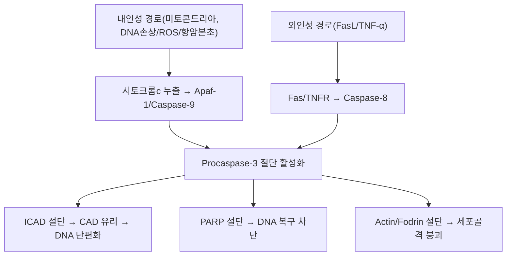

---
aliases:
  - 카스파제-3
  - CPP32
  - Apopain
tags:
  - 약리
  - 약리성분
  - 단백질분해효소
  - 항암
title: Caspase-3
date: 2026-09-22
출처: "DOI: 10.1038/376037a0"
---

# 🔬 [[Caspase-3]] (카스파제-3, CPP32/Apopain)

> **핵심 3줄 요약 (Key Summary)**:
> - 🌿 기원 & 분류: 인체가 스스로 만드는 세포자멸사(Apoptosis) 실행 시스테인 프로테아제(식물 유래 성분이 아닌 내인성 효소 — 아래 §2 참조).
> - 🎯 핵심 분자 표적 & 조절 경로: 내인성(미토콘드리아)·외인성(사멸수용체) 경로의 합류점에서 활성화되어 PARP·ICAD를 절단, DNA 단편화와 세포골격 붕괴를 유도.
> - 🩺 주요 약리 활성 & 질환 치료 기전: 항암 본초(활성화 유도)와 신경보호 본초(과활성 억제)가 정반대 방향으로 작용하는 이중적 표적.
> - ⚠️ 독성·생체이용률 한계 & 상호작용: 활성형 효소 자체가 자신의 촉매활성에 의존해 신속히 분해되어(반감기 매우 짧음) 검출이 어려우며, 범카스파제 억제제(에므리카산 등)는 간질환 임상시험에서 아직 확증적 성공을 거두지 못함.

---

## 📌 목차
1. [기본 화학 정보 & 분자 구조식 (Chemical Identity)](#1-기본-화학-정보--분자-구조식-chemical-identity)
2. [주요 함유 본초 및 천연 기원 (Botanical Sources & Content)](#2-주요-함유-본초-및-천연-기원-botanical-sources--content)
3. [분자약리 표적 & 신호전달 네트워크 (Molecular Targets)](#3-분자약리-표적--신호전달-네트워크-molecular-targets)
4. [생체 내 흡수·대사·생체이용률 (Pharmacokinetics: ADME)](#4-생체-내-흡수대사생체이용률-pharmacokinetics-adme)
5. [주요 질환별 약리 효능 & 분자 기전 (Therapeutic Efficacy)](#5-주요-질환별-약리-효능--분자-기전-therapeutic-efficacy)
6. [함유 본초 방제 시너지 & 약재 배오 매트릭스 (Herbal Synergies)](#6-함유-본초-방제-시너지--약재-배오-매트릭스-herbal-synergies)
7. [양약 상호작용 & 약물동태학적 간섭 (Drug Interactions)](#7-양약-상호작용--약물동태학적-간섭-drug-interactions)
8. [💡 사용자 진료실 핵심 필기 & 임상 응용 팁 (Melt-In & High-Yield)](#8--사용자-진료실-핵심-필기--임상-응용-팁-melt-in--high-yield)
9. [출처 및 학술 참고 문헌 (References)](#9-출처-및-학술-참고-문헌-references)

---

## 1. 기본 화학 정보 & 분자 구조식 (Chemical Identity)

> [!info] 🧪 3D 뷰어 미적용
> Caspase-3은 소분자가 아닌 효소 단백질이라 PubChem 소분자 CID가 없습니다. UniProt [P42574](https://www.uniprot.org/uniprotkb/P42574)로 확인하세요. (⚠️ 정정: 기존 CID 12304918은 이 효소와 무관한 다른 화합물이었습니다.)

| 항목 | 상세 내용 |
| :--- | :--- |
| **효소명** | Caspase-3 (Cysteine-aspartic acid protease 3), 이명 CPP32·Apopain |
| **분자량** | 32 kDa 전구체(Procaspase) / 활성형은 17 kDa + 12 kDa 이종이량체 |
| **유전자 위치** | 4q35.1 (인간 *CASP3* 유전자) |
| **EC 번호** | 3.4.22.56 |
| **기질 특이성** | Asp-Glu-Val-Asp(DEVD) 4펩타이드 서열의 C-말단 Asp 절단 |
| **약리 분류** | 세포자멸사 실행 효소(Executioner Caspase) |

---

## 2. 주요 함유 본초 및 천연 기원 (Botanical Sources & Content)

> ⚠️ **템플릿 적용 상 주의**: Caspase-3는 식물이 함유하는 파이토케미컬이 아니라 인체 세포가 자체 발현하는 내인성 효소입니다. 이 절은 "Caspase-3를 함유하는 본초"가 아니라, **Caspase-3 활성을 조절(활성화 또는 억제)한다고 학술적으로 보고된 한약재**를 정리합니다 — 방향이 서로 반대(항암 vs 신경보호)임에 유의.

| 관련 본초 (한글/한자) | 기원 식물학적 명칭 | 조절 방향 | 임상적 맥락 |
| :--- | :--- | :--- | :--- |
| [[백화사설초]] (白花蛇舌草) | 꼭두서니과 / *Hedyotis diffusa* | Caspase-3 **활성화** | 암세포 미토콘드리아 경로 자극, 청열해독·항암 |
| [[하고초]] (夏枯草) | 꿀풀과 / *Prunella vulgaris* | Caspase-3 **활성화** | 청간산결, 종괴 억제 |
| [[인삼]] (人蔘) | 두릅나무과 / *Panax ginseng* | Caspase-3 **과활성 억제** | 허혈·신경퇴행 모델에서 신경세포 보호 |
| [[단삼]] (丹蔘) | 꿀풀과 / *Salvia miltiorrhiza* | Caspase-3 **과활성 억제**(심근) | 활혈거어, 심근 허혈-재관류 손상 보호 |

---

## 3. 분자약리 표적 & 신호전달 네트워크 (Molecular Targets)

### 1) 실행 효소(Executioner Caspase)로서의 핵심 지위
* Caspase-8·Caspase-9 등 개시 효소로부터 신호를 전달받아 비가역적 세포 분해를 주도하는 최종 실행자입니다.
### 2) 기질 단백질 분해를 통한 세포 구조 파괴
* ICAD 절단으로 CAD를 유리시켜 게놈 DNA를 뉴클레오솜 단위로 절단하고, PARP를 절단해 DNA 복구를 차단합니다.

---

## 4. 생체 내 흡수·대사·생체이용률 (Pharmacokinetics: ADME)

> ⚠️ Caspase-3는 경구·주사로 투여되는 물질이 아니라 세포 내에서 만들어지고 분해되는 효소이므로, 이 절은 통상적 ADME 대신 **효소 자신의 활성화-분해 동태**를 다룹니다.

| 항목 | 내용 | 근거 |
| :--- | :--- | :--- |
| **활성화 방식** | 불활성 전구체(Procaspase-3, 32 kDa)가 상위 개시 카스파제에 의해 절단되어 활성형(17+12 kDa)이 됨 | 표준 세포생물학 |
| **활성형의 분해(턴오버)** | 활성형 Caspase-3는 **자신의 촉매 활성에 의존해 빠르게 분해**되며, 촉매 불활성 돌연변이체는 오히려 안정적으로 잔존함 | Tawa P, et al. 2004, *Cell Death Differ* |
| **억제제에 의한 안정화** | 펩타이드 기반 선택적 억제제 처리 시 분해가 차단되어 웨스턴블롯으로 재검출 가능 | 상동 |
| **조직 내 검출 특성** | 활성형은 반감기가 매우 짧아 세포 내에서 검출이 어려운 반면, 전구체 형태는 상대적으로 안정 | 상동 |

---

## 5. 주요 질환별 약리 효능 & 분자 기전 (Therapeutic Efficacy)

### 1) 항암·종괴 질환: Caspase-3 활성화를 통한 암세포 사멸 유도
* [[백화사설초]], [[하고초]], [[반지련]], [[삼릉]], [[봉출]] 등 청열해독·파혈거어 약재는 암세포의 미토콘드리아 경로를 자극해 Caspase-3을 활성화, 세포자멸사를 유도합니다.
### 2) 뇌졸중·심근경색·퇴행성 질환: Caspase-3 과활성화 차단을 통한 세포 보호
* 허혈-재관류 손상이나 알츠하이머병에서 활성산소·염증으로 Caspase-3이 비정상 활성화되면 정상 세포까지 괴사합니다. [[인삼]], [[황기]], [[단삼]], [[원지]] 등은 이 과활성화를 억제해 신경·심근세포를 생존시킵니다.

---

## 6. 함유 본초 방제 시너지 & 약재 배오 매트릭스 (Herbal Synergies)

> Caspase-3 자체를 배오하는 처방 개념은 없으므로, Caspase-3 조절(활성화 또는 억제) 방향이 보고된 방제를 정리합니다.

| 관련 방제/본초 조합 | 구성 | 조절 방향 및 기전 | 한의학적 개념 연계 |
| :--- | :--- | :--- | :--- |
| [[백화사설초]] + [[반지련]] | 청열해독 본초 병용 | 암세포 미토콘드리아 경로 상가 자극 → Caspase-3 활성화 증폭 | 청열해독, 화어산결 |
| [[생맥산]] | [[인삼]], [[맥문동]], [[오미자]] | 허혈 심근에서 Caspase-3 과활성 억제 상보 작용 보고 | 익기생진, 심근 보호 |

---

## 7. 양약 상호작용 & 약물동태학적 간섭 (Drug Interactions)

* **BCL-2 억제제(베네토클락스)와의 병용 활성화 기전**: 백혈병 치료제인 베네토클락스(Venetoclax)는 저메틸화제(HMA)와 병용 시 Caspase-3/GSDME 경로를 매개로 한 파이롭토시스(Pyroptosis)를 유도해 항백혈병 효과를 상승시킵니다(Ye F, et al. 2023). 이는 Caspase-3 활성화가 임상 항암 치료 전략의 핵심 표적임을 보여주는 실제 사례입니다.
* **범카스파제 억제제 개발 현황**: 간섬유화·간경변 치료를 목표로 개발된 범카스파제 억제제 에므리카산(Emricasan)은 실제 간경변·NASH 환자 대상 임상 3상급 연구가 진행되었으나, 실질적인 임상 개선 효과를 확증하는 데는 이르지 못했습니다(개발사의 임상 프로그램이 중단됨) — 구체적 논문 저자·수치는 접근 제한으로 본 노트에서 확정 인용하지 않으며, 향후 원문 확인 후 보강 필요.
* **한약재 병용 시 고려사항**: 항암 목적으로 Caspase-3 활성화 본초(백화사설초 등)를 항암제와 병용할 때는 상가적 세포독성 가능성을, 신경보호 목적으로 억제 방향 본초(인삼 등)를 항암 화학요법과 병용할 때는 이론적으로 항암 효과를 약화시킬 가능성을 함께 고려해야 합니다 — 직접적 인체 병용 임상 데이터는 부족합니다.

---

## 8. 💡 사용자 진료실 핵심 필기 & 임상 응용 팁 (Melt-In & High-Yield)

* **이중적 표적이라는 것을 항상 먼저 설명**: 같은 Caspase-3라도 암세포에서는 "죽이는 스위치"로 켜야 하고, 정상 신경·심근세포에서는 "과활성을 끄는" 것이 목표라는 점을 환자·학생에게 먼저 짚어주는 것이 이해를 돕습니다.
* **처방 선택의 논리**: 종양·종괴 병증에는 화어산결·청열해독 계열(활성화 방향), 중풍 후유증·만성 퇴행성 질환에는 보익·활혈 계열(억제 방향)을 선택하는 것이 Caspase-3 조절 방향과 일치합니다.
* **주의**: "카스파제 활성화/억제" 같은 분자생물학 용어는 환자에게는 "세포의 자연스러운 정리 스위치를 켜거나(암세포), 잘못 켜진 것을 진정시킨다(정상세포)"처럼 쉬운 비유로 설명하는 것이 효과적입니다.

---

## 9. 출처 및 학술 참고 문헌 (References)

1. **Nicholson DW, et al. (1995)**. *Identification and inhibition of the ICE/CED-3 protease necessary for mammalian apoptosis*. **Nature**, 376(6535), 37-43.
   - [DOI: 10.1038/376037a0](https://doi.org/10.1038/376037a0)
   - **[연구 요약]**: Caspase-3(CPP32)의 분자 구조와 PARP 절단 기질 특이성을 최초로 규명한 랜드마크 논문.
2. **Porter AG, Jänicke RU. (1999)**. *Emerging roles of caspase-3 in apoptosis*. **Cell Death & Differentiation**, 6(2), 99-104.
   - [DOI: 10.1038/sj.cdd.4400476](https://doi.org/10.1038/sj.cdd.4400476)
   - **[연구 요약]**: 포유류 세포 사멸 과정에서 Caspase-3의 필수 실행 메커니즘을 총괄 정리.
3. **Tawa P, et al. (2004)**. *Catalytic activity of caspase-3 is required for its degradation: stabilization of the active complex by synthetic inhibitors*. **Cell Death & Differentiation**, 11(4), 439-447.
   - [DOI: 10.1038/sj.cdd.4401360](https://doi.org/10.1038/sj.cdd.4401360)
   - **[연구 요약]**: 활성형 Caspase-3가 자신의 촉매활성에 의존해 빠르게 분해되며, 억제제 처리 시 안정화됨을 규명.
4. **Ye F, Zhang W, Fan C, et al. (2023)**. *Antileukemic effect of venetoclax and hypomethylating agents via caspase-3/GSDME-mediated pyroptosis*. **Journal of Translational Medicine**, 21, 606.
   - [DOI: 10.1186/s12967-023-04481-0](https://doi.org/10.1186/s12967-023-04481-0)
   - **[연구 요약]**: 베네토클락스+저메틸화제 병용이 Caspase-3/GSDME 경로를 통해 백혈병 세포의 파이롭토시스를 유도함을 규명, Caspase-3 활성화가 실제 항암 병용요법의 표적임을 입증.

<!-- 보관 태그(1회용·링크오류, 필요시 복원): 세포자멸사, 아포토시스 -->
