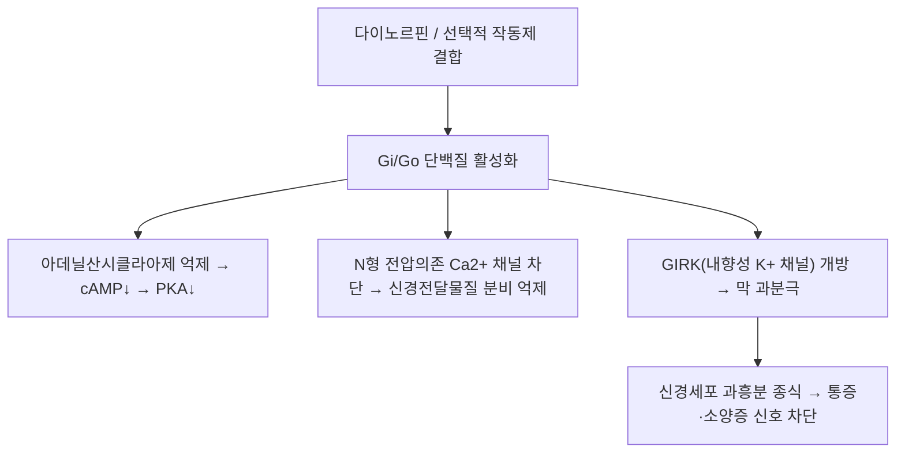

# 🔬 [[KOR]] (Kappa Opioid Receptor, 카파 오피오이드 수용체)

> **핵심 3줄 요약 (Key Summary)**:
> - 🌿 기원 & 분류: 중추·말초 감각신경에 분포하는 Gi/Go 단백질 결합 7막관통 수용체(식물 유래 성분이 아닌 내인성 수용체 단백질 — 아래 §2 참조).
> - 🎯 핵심 분자 표적 & 조절 경로: 내인성 리간드 다이노르핀에 의해 활성화 → Gi/Go → cAMP 감소, GIRK 채널 개방, N형 칼슘채널 차단 → 신경 흥분 억제.
> - 🩺 주요 약리 활성 & 질환 치료 기전: 뮤(MOR)와 반대로 소양증(가려움증) 신호를 차단하는 마스터 스위치, 뇌 보상계 비의존적 비중독성 진통 표적.
> - ⚠️ 독성·생체이용률 한계 & 상호작용: 말초 선택적 KOR 작동제(디페리케팔린)는 CYP450 대사를 거치지 않고 100% 생체이용률로 신장 통해 배설되어 약물상호작용 위험이 낮으나, 중추 이행성 KOR 작동제는 진정·불쾌감(dysphoria) 등 중추 부작용 위험이 있음.

---

## 📌 목차
1. [기본 화학 정보 & 분자 구조식 (Chemical Identity)](#1-기본-화학-정보--분자-구조식-chemical-identity)
2. [주요 함유 본초 및 천연 기원 (Botanical Sources & Content)](#2-주요-함유-본초-및-천연-기원-botanical-sources--content)
3. [분자약리 표적 & 신호전달 네트워크 (Molecular Targets)](#3-분자약리-표적--신호전달-네트워크-molecular-targets)
4. [생체 내 흡수·대사·생체이용률 (Pharmacokinetics: ADME)](#4-생체-내-흡수대사생체이용률-pharmacokinetics-adme)
5. [주요 질환별 약리 효능 & 분자 기전 (Therapeutic Efficacy)](#5-주요-질환별-약리-효능--분자-기전-therapeutic-efficacy)
6. [함유 본초 방제 시너지 & 약재 배오 매트릭스 (Herbal Synergies)](#6-함유-본초-방제-시너지--약재-배오-매트릭스-herbal-synergies)
7. [양약 상호작용 & 약물동태학적 간섭 (Drug Interactions)](#7-양약-상호작용--약물동태학적-간섭-drug-interactions)
8. [💡 사용자 진료실 핵심 필기 & 임상 응용 팁 (Melt-In & High-Yield)](#8--사용자-진료실-핵심-필기--임상-응용-팁-melt-in--high-yield)
9. [출처 및 학술 참고 문헌 (References)](#9-출처-및-학술-참고-문헌-references)

---

## 1. 기본 화학 정보 & 분자 구조식 (Chemical Identity)

> [!info] 🧪 3D 뷰어 미적용
> KOR(카파 오피오이드 수용체)는 소분자가 아닌 7-TM 막단백질이라 PubChem 소분자 CID가 없습니다. 인체 유전자 OPRK1, UniProt [P41145](https://www.uniprot.org/uniprotkb/P41145)로 확인하세요.

| 항목 | 상세 내용 |
| :--- | :--- |
| **수용체명** | KOR (Kappa Opioid Receptor) |
| **공식 유전자명** | *OPRK1* (8q11.23) |
| **수용체 유형** | G단백질 결합 수용체(GPCR), Gi/Go 결합 |
| **내인성 리간드** | 다이노르핀 A, 다이노르핀 B |
| **합성 선택적 작동제** | 날푸라핀(Nalfurafine), 디페리케팔린(Difelikefalin), U-50488 |
| **약리 분류** | 오피오이드 수용체, 항소양 및 비마약성 진통 표적 |

---

## 2. 주요 함유 본초 및 천연 기원 (Botanical Sources & Content)

> ⚠️ **템플릿 적용 상 주의**: KOR은 식물이 함유하는 파이토케미컬이 아니라 인체 신경계에 존재하는 수용체 단백질입니다. 이 절은 "KOR을 함유하는 본초"가 아니라, **KOR 반응성 조절이 학술적으로 보고된 거풍지양(祛風止痒) 한약재**를 정리합니다.

| 관련 본초 (한글/한자) | 기원 식물학적 명칭 | KOR/소양증 관련 작용 | 근거 수준 |
| :--- | :--- | :--- | :--- |
| [[백선피]] (白鮮皮) | 운향과 / *Dictamnus dasycarpus* | 알칼로이드 성분이 말초 감각신경·척수의 KOR 반응성 조절에 관여한다는 연구 보고 | 동물실험 위주 |
| [[고삼]] (苦蔘) | 콩과 / *Sophora flavescens* | 마트린류 알칼로이드가 소양증 관련 신경 전달 조절에 관여한다는 보고 | 동물실험 위주 |
| [[사상자]] (蛇床子) | 산형과 / *Cnidium monnieri* | 쿠마린 성분이 항소양 효과와 관련된다는 보고 | 동물실험 위주, 과장 금지 |

---

## 3. 분자약리 표적 & 신호전달 네트워크 (Molecular Targets)

### 1) 난치성 소양증 억제의 마스터 스위치
* 뮤(MOR) 활성화는 히스타민 비의존성 가려움증을 유발하는 반면(몰핀 투여 시 전신 소양증), **KOR 활성화는 척수 후각의 소양증 전달 중재신경원(Bhlhb5 신경세포)을 억제**해 가려움 신호를 강력히 차단합니다.
* 요독증(신부전 혈액투석), 담즙정체성 간질환, 아토피 피부염의 난치성 가려움증 치료에 KOR 작동제가 실제 신약으로 사용됩니다.
### 2) 비중독성 진통 효능
* MOR과 달리 뇌 보상계(측좌핵)에서 도파민 분비를 촉진하지 않고 오히려 억제하므로, 약물 갈망·신체적 탐닉을 유발하지 않는 안전한 진통 기전으로 주목받습니다.

---

## 4. 생체 내 흡수·대사·생체이용률 (Pharmacokinetics: ADME)

> KOR 자체는 수용체이므로, 이 절은 대표 KOR 작동제 신약의 실측 약동학 데이터를 다룹니다.

| 파라미터 | 디페리케팔린(Difelikefalin) | 근거 |
| :--- | :--- | :--- |
| **생체이용률** | 100%(정맥 투여 기준) | StatPearls NBK574566 |
| **소실 반감기** | 약 2시간 | 상동 |
| **작용 지속시간** | 단회 정맥 투여 후 약 12시간 | 상동 |
| **분포용적** | 약 238 mL/kg | 상동 |
| **혈장단백결합률** | 23~28%(투석 환자 기준) | 상동 |
| **대사** | CYP450 대사를 거치지 않고 미변화 형태로 소변·담즙 배설 | 상동 |
| **말초 선택성의 근거** | 친수성 펩타이드 구조로 혈액-뇌 장벽을 통과하지 않아 중추 부작용(진정·불쾌감) 최소화 | 상동 |

---

## 5. 주요 질환별 약리 효능 & 분자 기전 (Therapeutic Efficacy)

### 1) 혈액투석 관련 난치성 소양증(CKD-aP)
* 디페리케팔린이 혈액투석 환자의 중등도~중증 가려움증을 위약 대비 유의하게 개선함이 3상 임상에서 입증되었습니다(Fishbane S, et al. 2020).
### 2) 담즙정체성 가려움증 및 아토피피부염
* 담즙정체성 간질환, 아토피피부염 등 히스타민 비의존성 가려움증에서 KOR 경로 표적 치료의 잠재력이 연구되고 있습니다.
### 3) 비중독성 진통(연구 단계)
* 급성·만성 통증에서 오피오이드 의존성을 유발하지 않는 진통 대안으로서 KOR 작동제가 활발히 연구되고 있습니다.

---

## 6. 함유 본초 방제 시너지 & 약재 배오 매트릭스 (Herbal Synergies)

> KOR을 직접 배오하는 처방 개념은 없으므로, 소양증 완화에 사용되는 거풍지양 방제를 정리합니다.

| 관련 방제 | 구성 본초 | 제안된 작용 기전 | 한의학적 개념 연계 |
| :--- | :--- | :--- | :--- |
| 소풍산 계열 | [[형개]], [[방풍]], [[백선피]] | 말초 감각신경 KOR/소양증 회로 조절 가능성(동물실험 위주) | 거풍지양(祛風止痒) |
| 온청음 계열 | [[황금]], [[황련]], [[당귀]] | 혈허풍조(血虛風燥) 병태의 소양증 완화 | 양혈윤조(養血潤燥) |

---

## 7. 양약 상호작용 & 약물동태학적 간섭 (Drug Interactions)

* **CYP450 관련 상호작용 없음(디페리케팔린)**: 디페리케팔린은 CYP450 효소로 대사되지 않고 미변화 형태로 배설되어, 3상 임상에서 다약제 복용 환자에서도 유의한 약물 상호작용이 확인되지 않았습니다(StatPearls NBK574566).
* **중추 이행성 KOR 작동제의 부작용**: 혈액-뇌 장벽을 통과하는 KOR 작동제(예: 날푸라핀)는 진정·불쾌감(dysphoria)·환각 등 중추 부작용 위험이 있어, 중추신경억제제(벤조디아제핀 등)와 병용 시 진정작용이 상가될 수 있습니다 — 정량적 인체 상호작용 데이터는 제한적입니다.
* **오피오이드 병용 시 고려사항**: MOR 작동제(모르핀 등)와 KOR 작동제를 병용하는 경우, 진통은 상가될 수 있으나 KOR의 항-보상(anti-reward) 효과로 인해 전반적 기분 변화가 발생할 수 있어 임상 모니터링이 필요합니다.

---

## 8. 💡 사용자 진료실 핵심 필기 & 임상 응용 팁 (Melt-In & High-Yield)

* **MOR vs KOR "시소" 비유**: "몰핀 같은 마약성 진통제(MOR)는 오히려 온몸이 가려워지게 만들 수 있지만, KOR을 자극하는 약은 정반대로 가려움을 꺼줍니다" — 신부전·간질환 환자의 난치성 가려움증을 설명할 때 이 대비가 이해를 돕습니다.
* **처방 선택 포인트**: 혈허풍조형 만성 소양증에는 양혈윤조 계열, 습열형 급성 소양증에는 청열조습 계열을 감별해 적용하되, 현재까지 이들 본초의 KOR 특이적 인체 임상 근거는 제한적임을 환자에게 과장 없이 설명합니다.
* **환자 교육 포인트**: 투석 환자의 가려움증이 단순 피부 건조가 아니라 "요독 물질이 신경계의 특정 스위치(KOR-MOR 균형)를 어지럽혀서" 생기는 전신 현상임을 설명하면 이해도가 높아집니다.

---

## 9. 출처 및 학술 참고 문헌 (References)

1. **Kardon AP, et al. (2014)**. *Dynorphin acts as a neuromodulator to inhibit itch in the dorsal horn of the spinal cord*. **Cell Reports**, 9(3), 863-872.
   - [DOI: 10.1016/j.celrep.2014.10.010](https://doi.org/10.1016/j.celrep.2014.10.010)
   - **[연구 요약]**: 척수 후각의 내인성 다이노르핀-KOR 시스템이 가려움증 특이적 신호를 억제하는 분자 회로를 규명.
2. **Fishbane S, et al. (2020)**. *A phase 3 trial of difelikefalin in hemodialysis patients with pruritus*. **New England Journal of Medicine**, 382(3), 222-232.
   - [DOI: 10.1056/NEJMoa1912770](https://doi.org/10.1056/NEJMoa1912770)
   - **[연구 요약]**: 말초 선택적 KOR 작동제 디페리케팔린이 혈액투석 환자의 중증 소양증을 유의하게 개선함을 입증한 3상 임상시험.
3. **StatPearls (NCBI Bookshelf)**. *Difelikefalin*.
   - [NBK574566](https://www.ncbi.nlm.nih.gov/books/NBK574566/)
   - **[연구 요약]**: 디페리케팔린의 약동학(반감기, 분포용적, 단백결합률, CYP450 비관여 대사)과 안전성 프로파일 요약.

<!-- 보관 태그(1회용·링크오류, 필요시 복원): 항소양, 가려움증, 비마약성진통 -->
