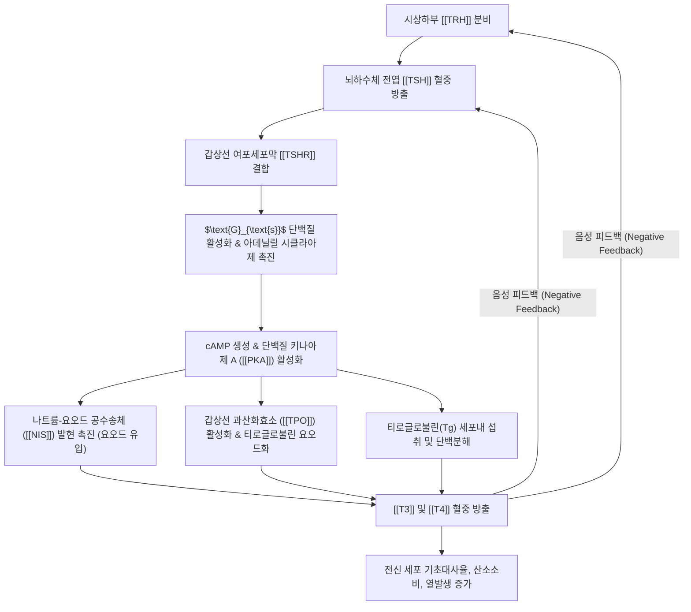

---
aliases:
  - TSH
  - 갑상선자극호르몬
  - Thyroid-Stimulating Hormone
  - 티로트로핀
  - Thyrotropin
tags:
  - 약리
  - 약리성분
  - 호르몬
  - 내분비계
  - 갑상선
  - 갑상선기능항진증
  - 갑상선기능저하증
title: TSH
date: 2026-09-13
출처: "PMID: 34042535"
---
# 💊 [[TSH]] (Thyroid-Stimulating Hormone, 갑상선자극호르몬)

> **핵심 요약 (Key Summary)**:
> 뇌하수체 전엽의 갑상선자극세포(Thyrotroph)에서 합성·분비되는 이종이량체(Heterodimeric) 당단백질 호르몬.
> 시상하부-뇌하수체-갑상선 축([[HPT축]])의 중심 조절자로 갑상선 여포세포 표면의 TSH 수용체([[TSHR]])에 결합하여 요오드 흡수 및 티록신([[T4]])·트리요오도티로닌([[T3]]) 합성·분비를 촉진.
> 갑상선 질환 스크리닝의 1차 표준 지표로 활용되며, 분비 이상 시 갑상선기능항진증(TSH 저하), 갑상선기능저하증(TSH 상승) 및 영류(갑상선종)를 유발.

---

## 1. 기본 화학 정보 & 분자 구조식 (Chemical Identity)

> [!abstract]+ 🧪 3D 약리 분자 구조 (Interactive 3D Viewer)
> <iframe src="https://molecule-viewer-rho.vercel.app/?cid=1150" style="width: 100%; height: 600px; border: none; border-radius: 12px; box-shadow: 0 4px 20px rgba(0,0,0,0.15);" allowfullscreen></iframe>

| 항목 | 상세 내용 |
| :--- | :--- |
| **일반명 (Generic)** | [[TSH]] (Thyroid-Stimulating Hormone, Thyrotropin) |
| **분자 구조** | 2개의 소단위체로 구성된 당단백질 (분자량 약 28 kDa) • **$\alpha$ 소단위**: 92개 아미노산 (LH, FSH, hCG와 동일한 공통 서열) • **$\beta$ 소단위**: 118개 아미노산 (TSH 고유의 수용체 특이성 결정) |
| **분비 조절 경로** | • **촉진**: 시상하부의 갑상선자극호르몬 방출호르몬([[TRH]]) • **억제**: 순환 혈중 유리 T3, 유리 T4에 의한 뇌하수체 음성 피드백 (Negative feedback) |
| **표적 수용체** | 갑상선 여포세포막의 G단백질 결합 수용체 ([[TSHR]]) |
| **임상 참고치** | 성인 기준 약 0.4 ~ 4.5 $\mu\text{IU/mL}$ (검사 기관별 미세 차이 존재) |

---

## 2. 주요 조절 본초 및 천연 기원 (Botanical Sources & Content)

> [!warning] ⚠️ 템플릿 적용 상 주의
> TSH는 식물이 함유하는 파이토케미컬이 아니라 인체 뇌하수체가 분비하는 내인성 호르몬입니다. 이 절은 "TSH를 함유하는 본초"가 아니라, **TSH-갑상선 축에 영향을 미치는 것으로 학술 보고된 한약재**를 다룹니다.

| 조절 본초 | 유효 성분 | 보고된 작용 |
| :--- | :--- | :--- |
| [[해조]], [[곤포]] | 요오드, [[후코이단]] | 갑상선 호르몬 합성 원료(요오드) 공급을 통한 HPT축 간접 조절 — 과량 섭취 시 오히려 요오드 유발성 갑상선기능이상 유발 가능 |

*(주: 해조·곤포는 "TSH를 함유"하는 것이 아니라 갑상선 호르몬 합성에 필요한 요오드를 공급함으로써 축 전체에 영향을 미치는 것으로 이해해야 합니다.)*

---

## 3. 분자약리 표적 & 신호전달 네트워크 (Molecular Targets)

- **요오드 트래핑(Iodine Trapping)**: 기저막의 나트륨-요오드 공수송체([[NIS]]) 발현을 증가시켜 혈액 속 무기 요오드를 세포 내로 능동 수송.
- **티로글로불린 요오드화**: 갑상선 과산화효소([[TPO]]) 활성을 자극하여 티로신 잔기를 요오드화(MIT, DIT 형성)하고 T3·T4를 합성.
- 만성적으로 TSH가 높게 유지되면 갑상선 여포세포의 크기와 수가 증가하여 갑상선종(Goiter, 癭瘤)을 형성.

---

## 4. 생체 내 분비·대사 동태 (Pharmacokinetics: ADME 대응)

> [!warning] ⚠️ 템플릿 적용 상 주의
> TSH는 경구 흡수되는 저분자가 아니므로, 이 절은 **내인성 TSH의 분비 동태** 및 **재조합 TSH 제제(치료·진단용)의 실제 약동학**을 함께 다룹니다.

- **내인성 TSH**: 시상하부 TRH의 박동성 분비에 반응하여 야간에 최고치를 보이는 일주기 리듬(circadian rhythm)을 가지며, 혈중 반감기는 약 50-60분 내외로 교과서적으로 기술됩니다.
- **재조합 인간 TSH(rhTSH, thyrotropin alfa)**: 갑상선암 추적검사 및 방사성 요오드 치료 전 자극 목적으로 임상에서 사용되는 승인 약물로, 내인성 TSH보다 긴 반감기(정맥 투여 후 약 22-25시간)를 가지는 것으로 제품 정보에 보고되어 있습니다.
- 정확한 개인별 분비 동태는 갑상선 기능 상태(항진/저하)에 따라 크게 달라지므로, 이 노트에서는 일반적으로 인용되는 범위값만을 제시합니다.

---

## 5. 주요 질환별 약리 효능 & 분자 기전 (Therapeutic Efficacy)

| TSH 수치 | Free T4 수치 | 임상 질환 진단 | 주요 병태 및 증상 |
| :--- | :--- | :--- | :--- |
| **현저히 낮음** ($\downarrow$) | **높음** ($\uparrow$) | **원발성 갑상선기능항진증** | 그레이브스병(TSHR 자극 항체), 중독성 결절. 심계항진, 체중감소, 다한증, 안구돌출 |
| **낮음** ($\downarrow$) | 정상 | **무증상(불현성) 갑상선기능항진증** | 향후 심방세동 및 골다공증 위험 증가 |
| **현저히 높음** ($\uparrow$) | **낮음** ($\downarrow$) | **원발성 갑상선기능저하증** | 하시모토 갑상선염(자가면역 파괴). 피로, 체중증가, 한랭 불내성, 부종, 변비 |
| **높음** ($\uparrow$) | 정상 | **무증상(불현성) 갑상선기능저하증** | 피로감, 고지혈증 동반 가능 |
| **낮음** ($\downarrow$) | **낮음** ($\downarrow$) | **중추성(이차성) 갑상선기능저하증** | 뇌하수체 또는 시상하부 병변 |

---

## 6. 조절 본초 방제 시너지 & 배오 매트릭스 (Herbal Synergies)

> [!warning] ⚠️ 템플릿 적용 상 주의
> 아래는 "TSH를 함유하는 처방"이 아니라, **한의학의 영류(癭瘤) 변증에 따라 TSH-갑상선 축 이상과 연계되어 활용되는 처방 배오**입니다.

- **연견산결(軟堅散結) 약재**: [[해조]], [[곤포]]. 천연 요오드와 다당류([[후코이단]])를 함유하여 갑상선종 결절 성장에 영향을 미치는 것으로 전통적으로 활용.
- **화담이기(化痰理氣) 처방**: [[해조옥호탕]], [[반하후박탕]] — 기체담응(氣滯痰凝)으로 인한 영류(갑상선종) 변증에 사용.
- **체질 매핑**: 소양인의 흉격열화(상초 화열)에서 그레이브스병 항진증 패턴이 빈발하며, 태음인·소음인의 비신양허 수습정체에서 기능저하증 패턴이 호발한다고 전통적으로 기술됨. *(체질-갑상선질환 상관성에 대한 현대적 대조 임상 데이터는 제한적입니다.)*

---

## 7. 양약 상호작용 & 약물동태학적 간섭 (Drug Interactions)

- **비오틴(Biotin, 비타민 B7) 고용량 보충제 복용 시 TSH 면역측정법 간섭**: 스트렙타비딘-비오틴 결합을 이용하는 다수의 자동화 면역분석 플랫폼에서, 고용량 비오틴 섭취가 TSH를 인위적으로 낮게(때로 그레이브스병처럼 오인될 수준으로) 측정되게 하는 분석적 간섭을 일으킨다는 것이 다수 증례로 보고되어 있습니다.
  - Ylli D, Soldin SJ, et al. (2021). Biotin Interference in Assays for Thyroid Hormones, Thyrotropin and Thyroglobulin. *Thyroid*. PMID: 34042535
- **레보티록신(Levothyroxine)과의 흡수 저해 약물**: 철분제, 칼슘제, 제산제(수산화알루미늄) 등이 레보티록신 흡수를 저해하여 TSH가 목표치보다 높게 유지될 수 있음이 널리 알려져 있습니다.

---

## 8. 💡 사용자 진료실 핵심 필기 & 임상 응용 팁 (Melt-In & High-Yield)

- 고용량 비오틴(피부·모발 보충제) 복용 환자의 TSH 검사 결과가 임상 증상과 맞지 않을 때는 검사 전 최소 2일간 비오틴 중단 후 재검을 고려.
- 해조·곤포가 포함된 처방을 갑상선 질환 병력이 있는 환자에게 처방할 때는 요오드 과다 섭취가 오히려 갑상선기능이상을 악화시킬 수 있음을 설명.
- TSH와 Free T4 조합 매트릭스는 원발성/중추성/불현성 갑상선질환을 감별하는 임상 1차 스크리닝 도구로 활용.

---

## 9. 출처 및 학술 참고 문헌 (References)

1. Garber, J. R., et al. (2012). Clinical practice guidelines for hypothyroidism in adults. *Thyroid*, 22(12), 1200-1235. [PubMed](https://pubmed.ncbi.nlm.nih.gov/23246686/)
2. Kahaly, G. J., et al. (2018). 2018 European Thyroid Association Guideline for the Management of Graves' Hyperthyroidism. *European Thyroid Journal*, 7(4), 167-186. [PubMed](https://pubmed.ncbi.nlm.nih.gov/30283735/)
3. Ylli D, Soldin SJ, et al. (2021). Biotin Interference in Assays for Thyroid Hormones, Thyrotropin and Thyroglobulin. *Thyroid*. [PubMed](https://pubmed.ncbi.nlm.nih.gov/34042535/)

<!-- 보관 태그(1회용·링크오류, 필요시 복원): 당단백질호르몬, HPT축 -->
