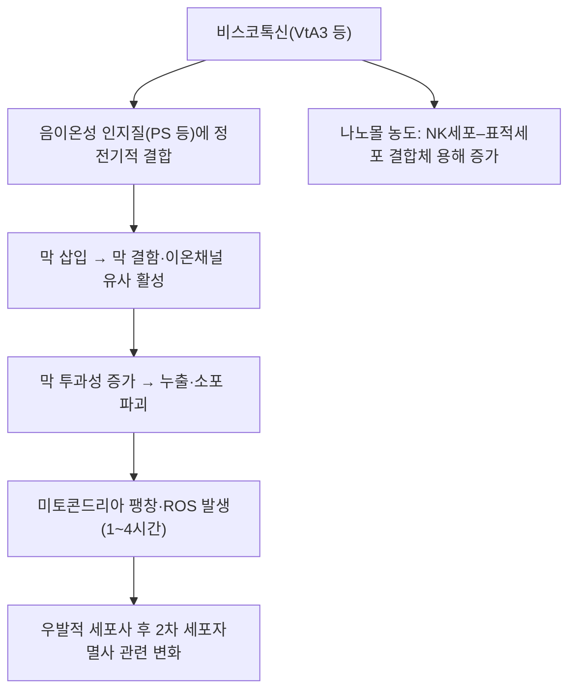

# 🔬 비스코톡신 (Viscotoxin)

> **핵심 3줄 요약 (Key Summary)**:
> - 🌿 기원 본초 & 화학 계열: [[곡기생]](槲寄生, 겨우살이과 *Viscum album* var. *coloratum*)에 함유된 46개 아미노산으로 이루어진 염기성 폴리펩타이드(티오닌계, thionin family) 성분으로, [[미슬토 렉틴]]과 함께 겨우살이의 2대 생리활성 단백질군을 이룸.
> - 🎯 핵심 분자 표적: 세포막 손상을 통한 직접적 세포독성(cytotoxic) 작용, NK세포(자연살해세포) 매개 세포독성 증강을 통한 면역 활성화 기전이 제시됨. (⚠️ NK세포 자체가 아니라 NK세포–표적세포 결합체의 용해를 늘리는 작용이며 나노몰 농도 시험관 결과입니다. §3)
> - 🩺 주요 약리 활성: 세포독성, 면역 증강(NK세포 활성화), 혈관 평활근 긴장 완화를 통한 혈압 강하 작용이 보고되며, 곡기생의 보간신(補肝腎)·강근골(强筋骨)·거풍습(祛風濕) 효능과 함께 다뤄지는 핵심 생리활성 성분. (⚠️ 비스코톡신 자체의 혈압 강하 근거는 확인하지 못했습니다. §3·§5)
> - ⚠️ 안전성 경고: 과량 복용 시 비스코톡신에 의한 일시적 혈압 급강하가 보고되어, 저혈압 환자나 고용량 사용 시 주의가 필요합니다. (⚠️ 이 '급강하 보고'의 근거 문헌은 확인하지 못했습니다. §7) 단백질이라 소분자 3D 뷰어는 적용하지 않으며, UniProt·PDB 등 단백질 데이터베이스 기준 식별이 적절합니다. (PubChem Compound에는 펩타이드 레코드가 있으나 서열이 아형과 일치하는지 확인하지 못했습니다. §1)

---

## 📌 목차
1. [기본 화학 정보 & 분자 구조식 (Chemical Identity)](#1-기본-화학-정보--분자-구조식-chemical-identity)
2. [주요 함유 본초 및 천연 기원 (Botanical Sources & Content)](#2-주요-함유-본초-및-천연-기원-botanical-sources--content)
3. [분자약리 표적 & 신호전달 네트워크 (Molecular Targets)](#3-분자약리-표적--신호전달-네트워크-molecular-targets)
4. [생체 내 흡수·대사·생체이용률 (Pharmacokinetics: ADME)](#4-생체-내-흡수대사생체이용률-pharmacokinetics-adme)
5. [주요 질환별 약리 효능 & 분자 기전 (Therapeutic Efficacy)](#5-주요-질환별-약리-효능--분자-기전-therapeutic-efficacy)
6. [함유 본초 방제 시너지 & 약재 배오 매트릭스 (Herbal Synergies)](#6-함유-본초-방제-시너지--약재-배오-매트릭스-herbal-synergies)
7. [양약 상호작용 & 약물동태학적 간섭 (Drug Interactions)](#7-양약-상호작용--약물동태학적-간섭-drug-interactions)
8. [💡 사용자 진료실 핵심 필기 & 임상 응용 팁 (Melt-In & High-Yield)](#8--사용자-진료실-핵심-필기--임상-응용-팁-melt-in--high-yield)
9. [출처 및 학술 참고 문헌 (References)](#9-출처-및-학술-참고-문헌-references)

---

## 1. 기본 화학 정보 & 분자 구조식 (Chemical Identity)

> [!info] 🧪 3D 뷰어 미적용
> 비스코톡신은 약 5 kDa(46 아미노산)의 펩타이드로, PubChem CID 기반 3D 뷰어를 삽입하지 않습니다. 단백질 구조는 아래 PDB 항목(RCSB)을 참고하세요.

| 항목 | 상세 내용 |
| :--- | :--- |
| **구조 분류** | 폴리펩타이드(단백질) — 티오닌(Thionin) 계열, 약 46개 아미노산 잔기로 구성된 염기성 소단백질 |
| **주요 아형** | Viscotoxin A2, A3, B (겨우살이 종·숙주 나무에 따라 함량 차이) |
| **데이터베이스 식별** | 소분자가 아닌 단백질이므로 PubChem 표준 CID는 없음 — UniProt/구조 데이터베이스 기준 확인 필요 (⚠️ 정정: 아래 PubChem CID 행처럼 PubChem Compound에 펩타이드 레코드는 등록돼 있음) |
| **IUPAC 명칭** | 해당 없음(펩타이드). PubChem 등록명은 아미노산 서열형 명명이라 생략 |
| **분자식 / 분자량** | UniProt 서열 기준 성숙 사슬(46 aa) 질량: A2 [P32880](https://www.uniprot.org/uniprotkb/P32880) 4,834 Da · 1-PS [P01537](https://www.uniprot.org/uniprotkb/P01537) 4,904 Da · A1 [D0VWT3](https://www.uniprot.org/uniprotkb/D0VWT3) 4,890 Da · C1 [P83554](https://www.uniprot.org/uniprotkb/P83554) 4,947 Da. A3 [P01538](https://www.uniprot.org/uniprotkb/P01538)과 B [P08943](https://www.uniprot.org/uniprotkb/P08943)은 UniProt에 전구체(각 111·103 aa)로 등재되어 있고, 성숙 사슬은 A3가 27–72번, B가 7–52번(각 46 aa) |
| **PubChem CID** | [72201067](https://pubchem.ncbi.nlm.nih.gov/compound/72201067) (등록명 Viscotoxin B, C197H322N64O67S6, 4851) · [16132340](https://pubchem.ncbi.nlm.nih.gov/compound/16132340) (등록명 Viscotoxin, C177H289N61O62S6, 4456). ⚠️ 내용 검토 필요 — 두 레코드가 UniProt 아형 서열과 일치하는지(특히 4456은 UniProt 성숙 사슬 질량 범위와 다름)는 확인하지 못함 |
| **CAS 등록 번호** | 76822-96-3(Viscotoxin), 11063-16-4(Viscotoxin B) — PubChem 동의어 항목 기준이며 CAS 원본 대조는 못함. ⚠️ 내용 검토 필요 |
| **결정·용액 구조 (PDB)** | A3: [1ED0](https://www.rcsb.org/structure/1ED0) (NMR) · [1OKH](https://www.rcsb.org/structure/1OKH) (X-ray 1.75 Å) · A2: [1JMN](https://www.rcsb.org/structure/1JMN) (NMR) · B: [1JMP](https://www.rcsb.org/structure/1JMP) (NMR) · [2V9B](https://www.rcsb.org/structure/2V9B) (X-ray 1.05 Å) · C1: [1ORL](https://www.rcsb.org/structure/1ORL) (NMR) — UniProt 교차참조 기준 |
| **화학 골격 분류** | 시스테인이 풍부한 염기성 펩타이드(α/β-티오닌 계열). 이황화결합 3쌍 (Cys3–Cys40, Cys4–Cys32, Cys16–Cys26; Orrù 1997) |
| **물리화학적 성상** | 두 개의 α-나선이 회전부(turn)로 이어지고 짧은 역평행 β-시트가 붙는 접힘(Romagnoli 2000). 활성 화합물이 저분자량·열 안정·프로테아제 저항성이었다는 분리 보고가 있음(Tabiasco 2002). VtA3는 전하 +6의 양이온성이며 양친매성(Paramonov 2021). 이황화결합을 끊으면 세포독성이 사라짐(Büssing 1999). 수용성·LogP·맛은 확인하지 못함 ⚠️ |
| **식물 내 생합성 경로** | 원문에 기재 없음. UniProt상 A3·B는 성숙 사슬 뒤에 C말단 산성 도메인(propeptide)이 붙은 전구체로 등재됨. 세부 가공 경로는 확인하지 못함 ⚠️ |

* **아형 목록**: 유럽 *V. album*에서 A1, A2, A3, B, 1-PS, U-PS가 정량되었고(Urech 2006), 한국·중국·일본 계열인 *V. album* subsp. *coloratum*에서는 viscotoxin C1(Romagnoli 2003)과 viscotoxin B2(Kong 2004; 서열 KSCCKNTTGRNIYNTCRFAGGSRERCAKLSGCKIISASTCPSDYPK, 46 aa)가 보고되었습니다.
* **아형 간 구조 유사성**: A2·A3·B는 전체 3D 구조가 매우 비슷하지만 표면 성질의 작은 차이가 막 친화성과 세포독성 차이를 설명합니다(Coulon 2003).

---

## 2. 주요 함유 본초 및 천연 기원 (Botanical Sources & Content)

| 함유 본초 | 기원 식물학적 명칭 | 주요 함유 부위 | 한의학적 귀경 및 약효 특성 |
| :--- | :--- | :--- | :--- |
| [[곡기생]] (槲寄生) | 겨우살이과 / *Viscum album* var. *coloratum* | 잎, 줄기, 가지 | 간·신경 귀경, 보간신(補肝腎)·강근골(强筋骨)·거풍습(祛風濕)·양혈안태(養血安胎)·하유(下乳) |

* **기원 표기 관련 ⚠️**: 위 표의 기원 표기(*V. album* var. *coloratum*)는 볼트 [[곡기생]] 노트와 일치합니다. 다만 비스코톡신 아형 대부분(A1·A2·A3·B·1-PS·U-PS)의 서열·구조·활성 연구는 유럽 *V. album* 유래이며, *coloratum* 유래로 확인된 것은 C1과 B2뿐입니다(Romagnoli 2003; Kong 2004). 볼트 [[상기생]] 노트도 상기생(*Taxillus chinensis*)의 성분으로 비스코톡신을 적고 있으나, PubMed에서 'Taxillus viscotoxin' 검색은 비스코톡신 자체를 다룬 *Taxillus* 유래 논문을 찾지 못했습니다.
* **함량(지표 함량 %)**: 원문에 수치 기재 없음. 문헌상 숙주·계절·부위에 따른 차이가 큽니다.
  * 이란 Hyrcanian 숲의 *V. album*: 12월 잎·줄기(foliage)에서 서어나무(*Carpinus betulus*) 기생본이 가장 높아 9.25 mg/g 건조중량이었고, 미성숙 녹색 열매가 성숙 백색 열매보다 비스코톡신·렉틴 농도가 훨씬 높았으며, 아형 A1·A2·A3·B가 모두 검출되고 A3가 가장 많고 A1이 다음이었습니다(Yousefvand 2022).
  * 유럽 *V. album* 잎에서는 렉틴이 12월에, 비스코톡신은 6월에 최대였고, 수확 시기 고정의 중요성이 제기되었습니다(Urech 2006).
  * A1은 유럽 세 아종의 씨앗에 풍부하고 줄기에는 소량이었습니다(Orrù 1997).
* **한약재 규격상의 지표 함량**: ⚠️ 내용 검토 필요 — 대한민국약전의 곡기생 규격에 비스코톡신 함량 기준이 있는지는 확인하지 못했습니다.

---

## 3. 분자약리 표적 & 신호전달 네트워크 (Molecular Targets)

### 1) 핵심 분자 표적 (Molecular Targets)
* **직접 세포독성**: 세포막에 결합·삽입되어 막 손상을 유발하는 직접적 세포독성 기전을 나타냅니다.
  * 근거: VA3는 포스파티딜세린(PS)을 포함한 모델막에 정전기적으로 결합해 막에 삽입되고, 결합량에 따라 점진적 색소 누출과 소포 전체 파괴의 두 양상을 보였습니다(Coulon 2002). VtA3·VtB는 음전하 인지질막에 높은 친화도로 결합하며, 이황화결합을 환원한 형태는 막을 파괴하지 못했습니다(Giudici 2003).
  * 아형 차이: A3가 가장 세포독성이 크고 B가 가장 약합니다. B는 막에 삽입되지 못했고 이는 소수성 평면 밖으로 튀어나온 Arg25와 관련될 수 있다고 제안되었습니다(Coulon 2003; Giudici 2003).
  * 세포 반응 시간 경과: 인체 림프구·과립구에서 막 투과화, 세포질·염색질 분해, 미토콘드리아 팽창, 1~2시간 내 ROS 발생이 나타난 뒤 2차적 세포자멸사 관련 변화가 이어져 '우발적 세포사(accidental cell death)'로 기술되었습니다. 비스코톡신 B와 밀 유래 퓨로티오닌은 림프구 사멸을 일으키지 못했습니다(Büssing 1999, *Eur J Biochem*). 미토콘드리아 Apo2.7 분자 발현은 24시간 내에 유도되었습니다(Büssing 1999, *Cancer Lett*).
  * 이온채널: VtA3는 양이온 선택적 이온채널을 형성하며, 세제 미셀 NMR 자료로는 농도에 따라 toroidal 공극 또는 carpet 기전을 따를 것으로 제안되었습니다(Paramonov 2021; 세포 아닌 미셀 모델). 곰팡이(*Fusarium solani*) 포자에서도 이온채널 유사 활성·H2O2 생성·세포질 Ca2+ 증가가 확인되어 식물 방어 기능이 제시되었습니다(Giudici 2006).
* **면역 증강**: NK세포(자연살해세포)의 세포독성을 증강시켜 항종양 면역 반응을 활성화합니다.
  * 근거: 겨우살이 추출물의 비독성 농도에서 NK세포 매개 종양세포 살상이 늘고 비표적 세포는 용해되지 않았으며, 활성 성분은 HPLC·MS로 비스코톡신 A1·A2·A3로 확인되었습니다. NK 증강 효과 농도는 VTA1 85 nM, VTA2 18 nM, VTA3 8 nM이고, 마이크로몰 농도에서는 표적세포에 세포독성입니다(Tabiasco 2002).
  * ⚠️ 내용 검토 필요: 같은 논문에서 비스코톡신은 NK세포를 활성화하지 않고 NK세포–표적세포 결합체(conjugate)의 용해를 늘리는 것으로 기술되어, 원문의 'NK세포 활성화'·'항종양 면역 반응 활성화'는 세포주 시험관 결과의 확대 해석입니다.
  * 과립구: 인체 호중구에서 비스코톡신(25·250 µg/mL)은 렉틴과 달리 대장균 유도 식세포작용과 호흡 폭발(respiratory burst)을 유의하게 증가시켰으나, 250 µg/mL에서는 세포독성 효과도 함께 나타났습니다(Stein 1999, *Anticancer Res*). 양이온성 구조가 중요하고 베라파밀이 저농도에서 효과를 억제해 Ca2+ 채널 관여 가능성이 제시되었습니다(Stein 1999, *BBA*). 반면 비스코톡신을 제거한 겨우살이 수용성 추출물도 과립구를 활성화해 비스코톡신·렉틴이 아닌 성분이 관여함이 보였습니다(Stein 1999, *Anticancer Res* 19:2925).
  * 사이토카인: 막 투과화를 일으키는 비스코톡신은 Bcl-2 단백질을 완전히 소실시켰으나 24시간 내 [[IL-4]] 생성은 자극하지 않았습니다(Stein 2000; 렉틴과 대비).
* **혈압 강하**: 혈관 평활근 긴장을 완화하여 혈압 강하를 유도합니다.
  * ⚠️ 내용 검토 필요: PubMed에서 'viscotoxin hypotensive' 검색은 관련 논문이 없었습니다. 관련 자료로 겨우살이(*V. album*) 줄기 추출물이 랫드 정맥 투여에서 혈압을 낮추고 무스카린 수용체 차단제(아트로핀·헥소사이클린)가 이 효과를 줄였다는 보고(Radenkovic 2009)가 있으나, 추출물 연구이며 비스코톡신의 기여는 확인하지 못했습니다. '혈관 평활근 긴장 완화' 기전도 확인하지 못했습니다.

---

## 4. 생체 내 흡수·대사·생체이용률 (Pharmacokinetics: ADME)

* **경구·전탕 흡수**: 단백질이라 소화관 분해 가능성이 높으나 비스코톡신의 경구·전탕 흡수·생체이용률 문헌은 확인하지 못했습니다. ⚠️ 내용 검토 필요
  * 참고: NK 증강 활성을 보인 성분은 저분자량·열 안정·프로테아제 저항성으로 분리되었고(Tabiasco 2002), 발효 추출 및 제제화 과정에서 비스코톡신의 분해·변환이 없었다는 보고가 있습니다(Urech 2006; 유럽 제제 제조 공정 기준). 이는 생체 내 흡수를 뜻하지 않으며 곡기생 전탕액에서의 잔존량과도 다릅니다.
* **주사·혈중 약동학**: 'viscotoxin pharmacokinetics' PubMed 검색에서 비스코톡신 자체의 약동학 논문을 찾지 못했습니다. ⚠️ 내용 검토 필요
* **장내 미생물 대사, 간 CYP450 대사, P-gp 기질성**: 펩타이드 특성상 통상적인 소분자 대사 경로가 적용되지 않으며, 비스코톡신 관련 문헌은 확인하지 못했습니다. ⚠️ 내용 검토 필요

---

## 5. 주요 질환별 약리 효능 & 분자 기전 (Therapeutic Efficacy)

### 1) 항종양 (전임상·세포 수준)
* 비스코톡신 아형은 종양세포에 세포독성을 보이며(Romagnoli 2003), 적혈구 용혈은 약한 편입니다(Coulon 2002; 'weakly hemolytic'이라는 논문 서술). *V. coloratum* 유래 viscotoxin B2는 랫드 골육종 유사 세포(17/2.8)에서 IC50 1.6 mg/L(MTT법)의 항종양 활성을 보였습니다(Kong 2004; 초록 기준, 세부 실험 조건은 원문 확인 필요).
* 동물·인체 항종양 효과는 비스코톡신 단독으로는 확인하지 못했습니다. ⚠️ 내용 검토 필요

### 2) 면역조절
* 비스코톡신이 풍부하고 렉틴이 적은 겨우살이 제제(Iscador Pini)를 건강인 48명에게 12주간 피하 투여한 이중맹검 시험에서 렉틴이 풍부한 제제(Iscador Qu)와 달리 호산구 증가가 없었고, 투여 부위 반응도 렉틴 풍부군보다 약했으며 중대한 이상반응은 없었습니다(Huber 2002). 두 제제는 렉틴 함량이 다른 추출물이므로 비스코톡신 단독 효과로 해석할 수 없습니다.

### 3) 한의학적 연계 (원문 §5)
* 비스코톡신은 [[미슬토 렉틴]]과 함께 [[곡기생]]의 보간신·강근골·거풍습·안태 효능을 뒷받침하는 핵심 생리활성 단백질로, 허리·무릎 관절통, 임신 중 절박유산, 고혈압 및 산후 유즙 분비 부족에 활용되는 근거로 제시됩니다.
* ⚠️ 내용 검토 필요: 위 효능·적응증(관절통, 절박유산, [[고혈압]], 유즙 분비)에 대해 비스코톡신 단독 근거를 확인하지 못했습니다. 곡기생의 전통 효능은 [[곡기생]] 노트를 참고하세요.

---

## 6. 함유 본초 방제 시너지 & 약재 배오 매트릭스 (Herbal Synergies)

| 함유 본초 / 방제 | 공존 유효 성분군 | 분자약리 시너지 기전 | 전통 한의학적 효능 연계 |
| :--- | :--- | :--- | :--- |
| [[곡기생]] | [[미슬토 렉틴]](렉틴), 플라보노이드, 트리테르페노이드([[올레아놀산]] 등) — 볼트 곡기생 노트 기준 | ⚠️ 내용 검토 필요 — 비스코톡신과 공존 성분 간 시너지 문헌 미확인. 참고: 비스코톡신·렉틴이 아닌 성분도 과립구를 활성화하고(Stein 1999), 렉틴 풍부 제제와 비스코톡신 풍부 제제의 혈액학적 반응이 달랐음(Huber 2002) | 보간신·강근골·거풍습·안태 |
| [[독활기생탕]] | [[상기생]]([[곡기생]]) 6g 외 [[독활]]·[[두충]]·[[우슬]]·[[사물탕]]·[[인삼]]·[[복령]]·[[감초]] 등 (볼트 처방 노트에서 구성 확인) | ⚠️ 내용 검토 필요 — 전탕액에 비스코톡신이 남는지, 처방 효과에 기여하는지는 문헌 미확인 | 관절·척추 비증(痺證), 간신 보강·거풍습 |
| [[수태환]] | [[토사자]]·[[상기생]]·[[속단]]·[[아교]] (4미; 볼트 처방 노트에서 구성 확인) | ⚠️ 내용 검토 필요 — 비스코톡신의 안태 기여 문헌 미확인 | 신허(腎虛) 습관성 유산 방지·안태 |

* 위 두 처방의 약재는 볼트 노트상 상기생이며, 상기생(*Taxillus*) 유래 비스코톡신은 문헌으로 확인하지 못했습니다(§2).

---

## 7. 양약 상호작용 & 약물동태학적 간섭 (Drug Interactions)

* **안전성 이슈 (원문 §4)**: 과량 복용 시 비스코톡신에 의한 일시적 혈압 급강하가 보고되어 주의가 필요하며, 겨우살이 종·숙주 나무·채집 시기에 따라 비스코톡신 함량이 크게 달라질 수 있어 표준화된 제제 사용이 권고됩니다.
  * ⚠️ 내용 검토 필요: '일시적 혈압 급강하'를 보고한 비스코톡신 논문은 확인하지 못했습니다(§3). 함량 변동은 문헌으로 확인됩니다(Urech 2006; Yousefvand 2022; §2).
* **과민반응**: 겨우살이 추출물 투여 후 5 kDa 단백질(비스코톡신의 분자량에 해당)에 대한 IgE 결합이 확인된 아나필락시스 1례가 보고되어, 비스코톡신 특이 IgE가 원인으로 제시되었습니다(Bauer 2005; 사례 보고 1건). 그 외 [[알레르기]] 소인자의 위험도는 확인하지 못했습니다. ⚠️ 내용 검토 필요
* **추출물 제제의 이상반응**: 렉틴·비스코톡신 함량을 표준화한 Iscador Qu Spezial의 피하 투여(HIV 양성 16명·건강인 8명, 6~8개월)에서 발열·독감 유사 증상·잇몸염·국소 홍반·호산구 증가가 있었으나 중증은 없었습니다(van Wely 1999). 렉틴·비스코톡신이 함께 든 추출물의 결과이며 비스코톡신 단독 결과가 아닙니다.
* **CYP450 효소 간섭**: 비스코톡신 자체의 CYP 억제·유도 문헌은 확인하지 못했습니다. ⚠️ 내용 검토 필요 (참고: Helixor 겨우살이 제품 3종은 인체 간 마이크로좀에서 주요 CYP 9종을 유의하게 억제하지 않았고 5종 유도도 없었다는 시험관 보고가 있으나 제품 전체 결과입니다; Schink 2017.)
* **유사 기전 양약 병용 시 고려사항**: 혈압강하제·[[저혈압]] 환자와의 병용 안전성 문헌은 확인하지 못했습니다. ⚠️ 내용 검토 필요

---

## 8. 💡 사용자 진료실 핵심 필기 & 임상 응용 팁 (Melt-In & High-Yield)

* **사용자 원문 필기 (100% 융합 및 보존)**:
  * 기존 노트에 원장님의 수기 필기는 없었습니다. (추후 필기가 생기면 이곳에 원문 그대로 추가)
* **진료실 실전 처방 & 생체이용률 극대화 팁**:
  1. 비스코톡신의 세포독성·NK 증강 근거는 정제 펩타이드 또는 겨우살이 추출물의 시험관 자료이며, 곡기생·상기생 전탕액의 비스코톡신 함량과 흡수는 확인되지 않았습니다(§4). 전탕 처방의 항암·강압 근거로 그대로 옮기지 않도록 주의합니다.
  2. 체질별·병증별 적용은 원문·문헌에서 확인되지 않아 기재하지 않습니다. ⚠️ 내용 검토 필요

---

## 9. 출처 및 학술 참고 문헌 (References)

1. **Tabiasco J, Pont F, Fournié JJ, Vercellone A (2002)**. *Mistletoe viscotoxins increase natural killer cell-mediated cytotoxicity*. **Eur J Biochem**, 269(10):2591-2600. PMID: [12027898](https://pubmed.ncbi.nlm.nih.gov/12027898/) · DOI: [10.1046/j.1432-1033.2002.02932.x](https://doi.org/10.1046/j.1432-1033.2002.02932.x)
   - **[연구 요약]**: 겨우살이 비스코톡신이 NK세포 매개 세포독성을 증강시킴을 규명한 연구. 비독성 나노몰 농도(A1 85 nM, A2 18 nM, A3 8 nM)에서 NK세포 자체가 아니라 세포 결합체의 용해를 늘림.
2. **Yousefvand S, Fattahi F, Hosseini SM, Urech K, Schaller G (2022)**. *Viscotoxin and lectin content in foliage and fruit of Viscum album L. on the main host trees of Hyrcanian forests*. **Sci Rep**, 12(1):10383. PMID: [35725801](https://pubmed.ncbi.nlm.nih.gov/35725801/) · DOI: [10.1038/s41598-022-14504-3](https://doi.org/10.1038/s41598-022-14504-3)
   - **[연구 요약]**: 숙주 나무에 따른 겨우살이 잎·열매의 비스코톡신·렉틴 함량 차이를 분석한 연구. 12월 서어나무 기생본 잎·줄기 9.25 mg/g, 미성숙 열매가 성숙 열매보다 고농도, A3 우세.
3. **대한민국약전(KP) 제12개정 (2022)**. 의약품각조 제2부: 곡기생(Loranthi Ramulus) 규격 기준.
   - ⚠️ 내용 검토 필요: 약전 원문을 온라인에서 확인하지 못했고, 위 라틴명(Loranthi Ramulus)이 볼트 [[곡기생]] 노트의 생약명(Visci Herba)과 다릅니다. 비스코톡신 함량 기준 여부도 미확인입니다.
4. **Orrù S, Scaloni A, Giannattasio M, Urech K, et al. (1997)**. *Amino acid sequence, S-S bridge arrangement and distribution in plant tissues of thionins from Viscum album*. **Biol Chem**, 378(9):989-996. PMID: [9348108](https://pubmed.ncbi.nlm.nih.gov/9348108/) · DOI: [10.1515/bchm.1997.378.9.989](https://doi.org/10.1515/bchm.1997.378.9.989)
   - **[연구 요약]**: 비스코톡신 A1 서열 결정, A2 서열 정정, 이황화결합 배열(Cys3–Cys40, Cys4–Cys32, Cys16–Cys26) 규명. A1은 씨앗에 풍부하고 줄기에는 소량.
5. **Romagnoli S, Ugolini R, Fogolari F, Schaller G, et al. (2000)**. *NMR structural determination of viscotoxin A3 from Viscum album L.*. **Biochem J**, 350(Pt 2):569-577. PMID: [10947973](https://pubmed.ncbi.nlm.nih.gov/10947973/)
   - **[연구 요약]**: VtA3의 용액 구조(PDB 1ED0). 두 α-나선, 회전부, 짧은 역평행 β-시트.
6. **Debreczeni JE, Girmann B, Zeeck A, Krätzner R, Sheldrick GM (2003)**. *Structure of viscotoxin A3: disulfide location from weak SAD data*. **Acta Crystallogr D Biol Crystallogr**, 59(Pt 12):2125-2132. PMID: [14646070](https://pubmed.ncbi.nlm.nih.gov/14646070/) · DOI: [10.1107/S0907444903018973](https://doi.org/10.1107/s0907444903018973)
   - **[연구 요약]**: VtA3 결정 구조. 단량체는 46 아미노산·이황화결합 3쌍이며 비대칭 단위에 2분자.
7. **Coulon A, Mosbah A, Lopez A, Sautereau AM, et al. (2003)**. *Comparative membrane interaction study of viscotoxins A3, A2 and B from mistletoe (Viscum album) and connections with their structures*. **Biochem J**, 374(Pt 1):71-78. PMID: [12733989](https://pubmed.ncbi.nlm.nih.gov/12733989/) · DOI: [10.1042/BJ20030488](https://doi.org/10.1042/BJ20030488)
   - **[연구 요약]**: A2·B의 3D 구조 결정, 세 아형의 모델막 상호작용 비교. B는 막에 삽입되지 못함.
8. **Romagnoli S, Fogolari F, Catalano M, Zetta L, et al. (2003)**. *NMR solution structure of viscotoxin C1 from Viscum album species Coloratum ohwi: toward a structure-function analysis of viscotoxins*. **Biochemistry**, 42(43):12503-12510. PMID: [14580196](https://pubmed.ncbi.nlm.nih.gov/14580196/) · DOI: [10.1021/bi034762t](https://doi.org/10.1021/bi034762t)
   - **[연구 요약]**: 아시아 *V. album* subsp. *coloratum* 유래 viscotoxin C1의 용액 구조와 세포독성 조절 핵심 잔기 논의.
9. **Kong JL, Du XB, Fan CX, Xu JF, Zheng XJ (2004)**. *[Determination of primary structure of a novel peptide from mistletoe and its antitumor activity]*. **Yao Xue Xue Bao**, 39(10):813-817. PMID: [15700822](https://pubmed.ncbi.nlm.nih.gov/15700822/)
   - **[연구 요약]**: *Viscum coloratum* 줄기·잎에서 viscotoxin B2 서열 결정, 랫드 골육종 유사 세포(17/2.8) IC50 1.6 mg/L(초록 기준; 중국어 논문의 영문 초록).
10. **Coulon A, Berkane E, Sautereau AM, Urech K, et al. (2002)**. *Modes of membrane interaction of a natural cysteine-rich peptide: viscotoxin A3*. **Biochim Biophys Acta**, 1559(2):145-159. PMID: [11853681](https://pubmed.ncbi.nlm.nih.gov/11853681/) · DOI: [10.1016/S0005-2736(01)00446-1](https://doi.org/10.1016/s0005-2736(01)00446-1)
    - **[연구 요약]**: VA3가 PS 함유 막에 정전기적으로 삽입되고 결합량에 따라 두 방식의 투과화가 일어남.
11. **Giudici M, Pascual R, de la Canal L, Pfüller K, et al. (2003)**. *Interaction of viscotoxins A3 and B with membrane model systems: implications to their mechanism of action*. **Biophys J**, 85(2):971-981. PMID: [12885644](https://pubmed.ncbi.nlm.nih.gov/12885644/) · DOI: [10.1016/S0006-3495(03)74536-6](https://doi.org/10.1016/S0006-3495(03)74536-6)
    - **[연구 요약]**: VtA3·VtB의 음전하 인지질막 결합, 야생형은 막 파괴, 환원형은 파괴하지 못함.
12. **Paramonov AS, Lyukmanova EN, Tonevitsky AG, Arseniev AS, Shenkarev ZO (2021)**. *Spatial structure and oligomerization of viscotoxin A3 in detergent micelles: Implication for mechanisms of ion channel formation and membrane lysis*. **Biochem Biophys Res Commun**, 585:22-28. PMID: [34781057](https://pubmed.ncbi.nlm.nih.gov/34781057/) · DOI: [10.1016/j.bbrc.2021.11.022](https://doi.org/10.1016/j.bbrc.2021.11.022)
    - **[연구 요약]**: 세제 미셀에서 VtA3 구조(NMR)와 올리고머화, 이온채널·막 용해 모델 제시(세포 아닌 미셀 모델).
13. **Giudici M, Poveda JA, Molina ML, de la Canal L, et al. (2006)**. *Antifungal effects and mechanism of action of viscotoxin A3*. **FEBS J**, 273(1):72-83. PMID: [16367749](https://pubmed.ncbi.nlm.nih.gov/16367749/) · DOI: [10.1111/j.1742-4658.2005.05042.x](https://doi.org/10.1111/j.1742-4658.2005.05042.x)
    - **[연구 요약]**: 곰팡이 포자에서 VtA3의 이온채널 유사 활성·H2O2 생성·세포질 Ca2+ 증가, 식물 방어 기능.
14. **Büssing A, Stein GM, Wagner M, Wagner B, et al. (1999)**. *Accidental cell death and generation of reactive oxygen intermediates in human lymphocytes induced by thionins from Viscum album L.*. **Eur J Biochem**, 262(1):79-87. PMID: [10231367](https://pubmed.ncbi.nlm.nih.gov/10231367/) · DOI: [10.1046/j.1432-1327.1999.00356.x](https://doi.org/10.1046/j.1432-1327.1999.00356.x)
    - **[연구 요약]**: 인체 림프구·과립구에서 우발적 세포사와 ROS 발생, 이황화결합 절단 시에만 독성 소실.
15. **Büssing A, Wagner M, Wagner B, Stein GM, et al. (1999)**. *Induction of mitochondrial Apo2.7 molecules and generation of reactive oxygen-intermediates in cultured lymphocytes by the toxic proteins from Viscum album L.*. **Cancer Lett**, 139(1):79-88. PMID: [10408913](https://pubmed.ncbi.nlm.nih.gov/10408913/) · DOI: [10.1016/S0304-3835(99)00010-5](https://doi.org/10.1016/s0304-3835(99)00010-5)
    - **[연구 요약]**: 비스코톡신의 신속한 막 투과화·미토콘드리아 팽창·ROS 발생과 24시간 내 Apo2.7 발현.
16. **Stein GM, Schaller G, Pfüller U, Schietzel M, Büssing A (1999)**. *Thionins from Viscum album L: influence of the viscotoxins on the activation of granulocytes*. **Anticancer Res**, 19(2A):1037-1042. PMID: [10368652](https://pubmed.ncbi.nlm.nih.gov/10368652/)
    - **[연구 요약]**: 비스코톡신이 인체 과립구의 식세포작용·호흡 폭발을 증가시키며 250 µg/mL에서는 세포독성도 동반.
17. **Stein GM, Schaller G, Pfüller U, Wagner M, et al. (1999)**. *Characterisation of granulocyte stimulation by thionins from European mistletoe and from wheat*. **Biochim Biophys Acta**, 1426(1):80-90. PMID: [9878694](https://pubmed.ncbi.nlm.nih.gov/9878694/) · DOI: [10.1016/S0304-4165(98)00139-1](https://doi.org/10.1016/s0304-4165(98)00139-1)
    - **[연구 요약]**: 다중 양이온 구조의 중요성, 베라파밀 억제로 Ca2+ 채널 관여 시사.
18. **Stein GM, Pfüller U, Schietzel M (1999)**. *Viscotoxin-free aqueous extracts from European mistletoe (Viscum album L.) stimulate activity of human granulocytes*. **Anticancer Res**, 19(4B):2925-2928. PMID: [10652574](https://pubmed.ncbi.nlm.nih.gov/10652574/)
    - **[연구 요약]**: 비스코톡신을 제거한 추출물도 과립구를 활성화, 비스코톡신·렉틴이 아닌 성분의 관여 시사.
19. **Stein GM, Pfüller U, Schietzel M, Büssing A (2000)**. *Toxic proteins from European mistletoe (Viscum album L.): increase of intracellular IL-4 but decrease of IFN-gamma in apoptotic cells*. **Anticancer Res**, 20(3A):1673-1678. PMID: [10928090](https://pubmed.ncbi.nlm.nih.gov/10928090/)
    - **[연구 요약]**: 렉틴은 IL-4를 증가시켰으나 막 투과화 비스코톡신은 Bcl-2를 소실시키고 IL-4를 자극하지 않음.
20. **Urech K, Schaller G, Jäggy C (2006)**. *Viscotoxins, mistletoe lectins and their isoforms in mistletoe (Viscum album L.) extracts Iscador*. **Arzneimittelforschung**, 56(6A):428-434. PMID: [16927522](https://pubmed.ncbi.nlm.nih.gov/16927522/) · DOI: [10.1055/s-0031-1296808](https://doi.org/10.1055/s-0031-1296808)
    - **[연구 요약]**: 비스코톡신 아형(A1·A2·A3·B·1-PS·U-PS) 정량, 제조 공정 중 분해 없음, 비스코톡신은 6월에 최대.
21. **Bauer C, Oppel T, Ruëff F, Przybilla B (2005)**. *Anaphylaxis to viscotoxins of mistletoe (Viscum album) extracts*. **Ann Allergy Asthma Immunol**, 94(1):86-89. PMID: [15702822](https://pubmed.ncbi.nlm.nih.gov/15702822/) · DOI: [10.1016/S1081-1206(10)61291-4](https://doi.org/10.1016/S1081-1206(10)61291-4)
    - **[연구 요약]**: 5 kDa 단백질(비스코톡신 분자량에 해당)에 IgE가 결합한 아나필락시스 1례 보고.
22. **Huber R, Klein R, Berg PA, Lüdtke R, Werner M (2002)**. *Effects of a lectin- and a viscotoxin-rich mistletoe preparation on clinical and hematologic parameters: a placebo-controlled evaluation in healthy subjects*. **J Altern Complement Med**, 8(6):857-866. PMID: [12614536](https://pubmed.ncbi.nlm.nih.gov/12614536/) · DOI: [10.1089/10755530260511847](https://doi.org/10.1089/10755530260511847)
    - **[연구 요약]**: 건강인 48명 이중맹검 시험. 렉틴 풍부 제제만 호산구 증가, 비스코톡신 풍부 제제는 혈액학적 변화 없음.
23. **van Wely M, Stoss M, Gorter RW (1999)**. *Toxicity of a standardized mistletoe extract in immunocompromised and healthy individuals*. **Am J Ther**, 6(1):37-43. PMID: [10423645](https://pubmed.ncbi.nlm.nih.gov/10423645/) · DOI: [10.1097/00045391-199901000-00006](https://doi.org/10.1097/00045391-199901000-00006)
    - **[연구 요약]**: 표준화 겨우살이 추출물 피하 투여의 1/2상 안전성. 이상반응은 경증.
24. **Radenkovic M, Ivetic V, Popovic M, Brankovic S, Gvozdenovic L (2009)**. *Effects of mistletoe (Viscum album L., Loranthaceae) extracts on arterial blood pressure in rats treated with atropine sulfate and hexocycline*. **Clin Exp Hypertens**, 31(1):11-19. PMID: [19172455](https://pubmed.ncbi.nlm.nih.gov/19172455/) · DOI: [10.1080/10641960802409820](https://doi.org/10.1080/10641960802409820)
    - **[연구 요약]**: 겨우살이 줄기 추출물의 랫드 혈압 강하 효과와 무스카린 차단제에 의한 감소(추출물 연구).
25. **Schink M, Dehus O (2017)**. *Effects of mistletoe products on pharmacokinetic drug turnover by inhibition and induction of cytochrome P450 activities*. **BMC Complement Altern Med**, 17(1):521. PMID: [29202738](https://pubmed.ncbi.nlm.nih.gov/29202738/) · DOI: [10.1186/s12906-017-2028-1](https://doi.org/10.1186/s12906-017-2028-1)
    - **[연구 요약]**: Helixor A·M·P의 CYP 9종 억제·5종 유도 시험, 주요 억제·유도 없음(시험관, 제품 전체 결과).
26. **데이터베이스 확인 항목**: UniProt [P01538](https://www.uniprot.org/uniprotkb/P01538)(A3), [P32880](https://www.uniprot.org/uniprotkb/P32880)(A2), [P08943](https://www.uniprot.org/uniprotkb/P08943)(B), [P83554](https://www.uniprot.org/uniprotkb/P83554)(C1), [P01537](https://www.uniprot.org/uniprotkb/P01537)(1-PS), [D0VWT3](https://www.uniprot.org/uniprotkb/D0VWT3)(A1); PubChem Compound [72201067](https://pubchem.ncbi.nlm.nih.gov/compound/72201067)·[16132340](https://pubchem.ncbi.nlm.nih.gov/compound/16132340); RCSB PDB 항목은 §1 참조.

<!-- 보관 태그(1회용·링크오류, 필요시 복원): 폴리펩타이드 -->
