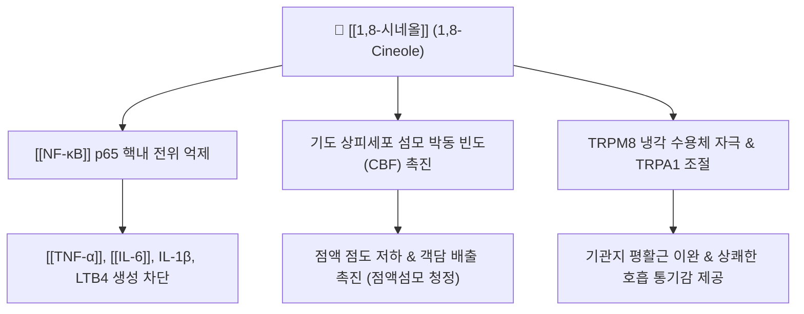

---
aliases:
  - 1,8-시네올
  - 시네올
  - 유칼립톨
  - 1,8-Cineole
  - Eucalyptol
tags:
  - 약리성분
  - 모노테르펜
  - 정유
  - 방향화습
  - 거담제
  - 항염증
---
# 🔬 [[1,8-시네올]] (1,8-Cineole, Eucalyptol)

> **핵심 3줄 요약 (Key Summary)**:
> - 🌿 기원 본초 & 화학 계열: [[사인]](*Amomum villosum*), [[백두구]](*Amomum kravanh*), [[초두구]](*Alpinia katsumadai*), [[창출]](*Atractylodes lancea*) 등 방향화습약에 널리 함유된 옥사비사이클릭 모노테르페노이드(Bicyclic monoterpenoid ether) 정유 지표 성분.
> - 🎯 핵심 분자 표적 & 조절 경로: [[NF-κB]] p65 핵내 전위 억제를 통한 [[TNF-α]]·[[IL-6]]·LTB4 생성 차단, 기도 상피 섬모 박동 촉진, TRPM8/TRPA1 수용체 조절.
> - 🩺 주요 약리 활성 & 질환 치료 기전: 만성 폐쇄성 폐질환(COPD)·기관지 천식·급만성 비부비동염 완화, 위장관 항궤양·진통진경(구풍 작용), 방향화습(芳香化濕)·행기온중(行氣溫中) 효능.
> - ⚠️ 독성·생체이용률 한계 & 상호작용: 간 CYP3A4/CYP2B6 대사(수산화 후 글루쿠론산 포합), 고농도 순수 정유 원액 과량 음용 시 중추신경 억제·오심구토 유발 가능, 인체 대상 특이적 양약 상호작용 연구는 제한적.

---

## 📌 목차
1. [기본 화학 정보 & 분자 구조식 (Chemical Identity)](#1-기본-화학-정보--분자-구조식-chemical-identity)
2. [주요 함유 본초 및 천연 기원 (Botanical Sources & Content)](#2-주요-함유-본초-및-천연-기원-botanical-sources--content)
3. [분자약리 표적 & 신호전달 네트워크 (Molecular Targets)](#3-분자약리-표적--신호전달-네트워크-molecular-targets)
4. [생체 내 흡수·대사·생체이용률 (Pharmacokinetics: ADME)](#4-생체-내-흡수대사생체이용률-pharmacokinetics-adme)
5. [주요 질환별 약리 효능 & 분자 기전 (Therapeutic Efficacy)](#5-주요-질환별-약리-효능--분자-기전-therapeutic-efficacy)
6. [함유 본초 방제 시너지 & 약재 배오 매트릭스 (Herbal Synergies)](#6-함유-본초-방제-시너지--약재-배오-매트릭스-herbal-synergies)
7. [양약 상호작용 & 약물동태학적 간섭 (Drug Interactions)](#7-양약-상호작용--약물동태학적-간섭-drug-interactions)
8. [💡 사용자 진료실 핵심 필기 & 임상 응용 팁 (Melt-In & High-Yield)](#8--사용자-진료실-핵심-필기--임상-응용-팁-melt-in--high-yield)
9. [출처 및 학술 참고 문헌 (References)](#9-출처-및-학술-참고-문헌-references)

---

## 1. 기본 화학 정보 & 분자 구조식 (Chemical Identity)

> [!abstract]+ 🧪 3D 약리 분자 구조 (Interactive 3D Viewer)
> <iframe src="https://molecule-viewer-rho.vercel.app/?cid=2758" style="width: 100%; height: 600px; border: none; border-radius: 12px; box-shadow: 0 4px 20px rgba(0,0,0,0.15);" allowfullscreen></iframe>

| 항목 | 상세 내용 |
| :--- | :--- |
| **일반명 (Generic)** | 1,8-시네올 (1,8-Cineole, Eucalyptol) |
| **화학명 (IUPAC)** | 1,3,3-trimethyl-2-oxabicyclo[2.2.2]octane |
| **분자식 / 분자량** | $\text{C}_{10}\text{H}_{18}\text{O}$ / 154.25 g/mol |
| **PubChem CID** | [2758](https://pubchem.ncbi.nlm.nih.gov/compound/2758) |
| **CAS 등록 번호** | 470-82-6 |
| **화학 골격 분류** | 옥사비사이클릭 모노테르페노이드 (Bicyclic monoterpenoid ether) |
| **물리화학적 성상** | 무색의 투명한 액체, 특유의 상쾌한 캠퍼(Camphor)향, 지용성, 에탄올 가용, 수불용성 |
| **식물 내 생합성 경로** | 제라닐피로인산(GPP)을 전구체로 한 MEP 경로 유래 모노테르펜 신타아제(Monoterpene synthase) 고리화 반응으로 형성되는 모노테르페노이드 정유 성분 |

---

## 2. 주요 함유 본초 및 천연 기원 (Botanical Sources & Content)

| 함유 본초 (한글/한자) | 기원 식물학적 명칭 (과명 / 학명) | 주요 함유 약용 부위 | 지표 함량 (%) | 한의학적 귀경 및 약효 특성 |
| :--- | :--- | :--- | :--- | :--- |
| [[사인]] (縮砂仁) | 생강과(Zingiberaceae) / *Amomum villosum* | 성숙한 열매(종자단) | 원문 미기재(정유 주성분) | 脾·胃·腎經 / 방향화습(芳香化濕), 행기온중(行氣溫中), 안태(安胎) |
| [[백두구]] (白荳蔲) | 생강과(Zingiberaceae) / *Amomum kravanh* | 성숙한 열매 | 원문 미기재(정유 주성분) | 肺·脾·胃經 / 기를 잘 통하게 하고 비위를 따뜻하게 하여 구토를 멈춤 |
| [[초두구]] (草豆蔲) | 생강과(Zingiberaceae) / *Alpinia katsumadai* | 성숙한 씨앗 덩어리 | 약 40% | 脾·胃經 / 온중거한(溫中祛寒), 조습행기(燥濕行氣) |
| [[창출]] (蒼朮) | 국화과(Asteraceae) / *Atractylodes lancea* | 뿌리줄기(근경) | 원문 미기재(정유 성분) | 脾·胃·肝經 / 비경의 습사를 말리고(조습건비) 수종을 내림 |

---

## 3. 분자약리 표적 & 신호전달 네트워크 (Molecular Targets)

### 1) 항염증 및 사이토카인 차단
* 단핵구 및 대식세포에서 IκBα 분해를 차단하여 [[NF-κB]] 활성화를 억제함으로써 [[TNF-α]], [[IL-6]], IL-1β, 류코트리엔 $\text{LTB}_4$ 합성을 억제.

### 2) 점액 분비 조절 및 섬모 운동 촉진 (Secretomotoric)
* 기도 배상세포의 뮤신(MUC5AC) 과분비를 억제하고 점액을 묽게 하여, 기관지 상피세포의 섬모 운동 속도를 높여 가래의 체외 배출을 가속화.

### 3) 기관지 평활근 경련 완화
* 칼슘 이온 유입 억제 및 TRPM8 채널 활성화를 통해 기도 과민성을 완화하고 기관지를 확장.

---

## 4. 생체 내 흡수·대사·생체이용률 (Pharmacokinetics: ADME)

* **흡수 및 분포**:
  * 경구 투여 또는 흡입 시 소화관과 호흡기 점막을 통해 신속히 흡수(Tmax 약 1~2시간).
* **간 대사 및 배설**:
  * 간의 CYP 효소군(CYP3A4/2B6)에 의해 수산화(2-하이드록시시네올 등)된 후 글루쿠론산 포합체를 거쳐 소변 및 일부 호흡으로 배설.
* **주의사항**:
  * 일반적인 생약 추출 수준에서는 매우 안전하나, 고농도 순수 정유 원액을 과량 음용할 경우 중추신경 억제 및 오심·구토 유발 가능.

---

## 5. 주요 질환별 약리 효능 & 분자 기전 (Therapeutic Efficacy)

### 1) 만성 폐쇄성 폐질환(COPD) 및 기관지 천식 완화
* 다기관 이중맹검 RCT에서 1,8-시네올(소엘로딘) 투여 시 천식 환자의 경구 스테로이드 요구량을 유의하게 감소시키고 호흡 기능(FEV1)을 개선함이 입증됨.
### 2) 급만성 비부비동염(축농증) 개선
* 비점막 부종 및 두통, 콧물 증상을 신속히 완화하고 항생제 사용 빈도를 감소.
### 3) 위장관 항궤양 및 진통·진경 활성
* 소화관 평활근 경련을 완화하고 가스 배출(구풍 작용)을 촉진하며 위점막 혈류를 유지.
### 4) 방향화습(芳香化濕)의 현대적 규명 — 한의 임상 연계
* 1,8-시네올의 휘발성 정유 성분은 소화관 상피의 미세순환을 촉진하고 정체된 수분과 가스를 신속히 배출시켜 비위의 '습탁(濕濁)'을 날려 보내는 작용과 직결.

---

## 6. 함유 본초 방제 시너지 & 약재 배오 매트릭스 (Herbal Synergies)

| 함유 본초 / 방제 | 공존 유효 성분군 | 분자약리 시너지 기전 | 전통 한의학적 효능 연계 |
| :--- | :--- | :--- | :--- |
| [[백두구]] | [[카르다모닌]], α-테르피네올 | 정유 성분 간 위점막 혈류 증진 및 항균 상가작용 | 방향화습, 행기관중 |
| [[초두구]] | [[카르다모닌]], [[알피네틴]] | 5-HT4 수용체 자극 및 한습성 염증 매개체 차단 시너지 | 온중거한(溫中祛寒), 조습행기(燥濕行氣) |
| [[평위산]] | [[창출]], [[후박]], [[진피]] | 다중 방향 정유 성분의 위장관 미세순환 동시 촉진 | 조습건비(燥濕健脾), 행기화적 |
| [[곽향정기산]] | [[곽향]], [[반하]], [[생강]] | 외감(外感)·내상(內傷) 습체 동시 해소, 구토 억제 시너지 | 해표화습(解表化濕), 화위지구 |

---

## 7. 양약 상호작용 & 약물동태학적 간섭 (Drug Interactions)

* **CYP450 효소 대사 경로**:
  * 인체 간 마이크로솜을 이용한 시험관 내(in vitro) 연구에서 1,8-시네올은 주로 CYP3A4에 의해 대사되어 신규 수산화 대사체를 생성함이 확인되었음(Duisken et al., 2005, 참고문헌 9-3). 이 효소는 다수의 양약 대사에 관여하므로, CYP3A4 기질 약물(일부 스타틴, 면역억제제, 벤조디아제핀계 등)과의 고용량·장기 병용 시 이론적으로 대사 경쟁이 발생할 가능성을 고려할 수 있음.
  * 다만 위 시험관 내 대사 연구 이외에 인체를 대상으로 한 구체적 양약-양약 상호작용(임상 DDI) 연구는 확인되지 않았으므로, 특정 CYP 억제/유도 정도나 임상적 유의성을 단정할 수 없음 — 병용 시 일반적 주의만 권고됨.
* **중추신경 억제제와의 병용 주의**:
  * 고농도 정유 원액 과량 섭취 시 중추신경 억제 작용이 보고되어 있어, 진정제·항경련제 등을 복용 중인 환자에서는 저용량 생약 추출물 사용을 우선 고려.

---

## 8. 💡 사용자 진료실 핵심 필기 & 임상 응용 팁 (Melt-In & High-Yield)

* **사용자 원문 필기**:
  * 현재 별도로 기록된 원장님 임상 필기가 없습니다.
* **진료실 실전 처방 & 생체이용률 극대화 팁**:
  1. **대표 배합 처방**: [[평위산]], [[향사평위산]], [[곽향정기산]], [[이진탕]] 가미방에서 방향화습·행기온중 목적으로 활용.
  2. **체질별·병증별 맞춤 적용**: 실열증보다는 한습(寒濕)·비위허한(脾胃虛寒) 경향의 소화불량·복부팽만 환자에서 방향건위 목적으로 우선 고려하되, 정유 함량이 높은 생약을 장기 단독 대량 투여하지 않도록 주의.

---

## 9. 출처 및 학술 참고 문헌 (References)

1. **Juergens UR (2014)**. *Anti-inflammatory properties of the monoterpene 1,8-cineole: current evidence for co-medication in inflammatory airway diseases*. **Advances in Therapy**, 31(11), 1288-1312. [PMID: 24831245](https://pubmed.ncbi.nlm.nih.gov/24831245/)
   - **[연구 요약]**: 1,8-시네올의 NF-κB 억제 분자 기전 및 천식·COPD·부비동염 대상 임상 시험 총괄 리뷰.
2. **Worth H, Dethlefsen U (2012)**. *Patients with asthma benefit from concomitant therapy with cineole: a placebo-controlled, double-blind trial*. **Journal of Asthma**, 49(8), 849-853. [PMID: 22978309](https://pubmed.ncbi.nlm.nih.gov/22978309/)
   - **[연구 요약]**: 천식 환자에서 1,8-시네올 병용 시 폐기능 개선 및 악화율 감소를 확인한 무작위 대조 임상 연구.
3. **Duisken M, Sandner F, Blömeke B, Hollender J (2005)**. *Metabolism of 1,8-cineole by human cytochrome P450 enzymes: identification of a new hydroxylated metabolite*. **Biochimica et Biophysica Acta**, 1722(3), 304-311. [PMID: 15715982](https://pubmed.ncbi.nlm.nih.gov/15715982/)
   - **[연구 요약]**: 인체 CYP450 효소(주로 CYP3A4)에 의한 1,8-시네올의 수산화 대사 경로 및 신규 대사체 규명.
