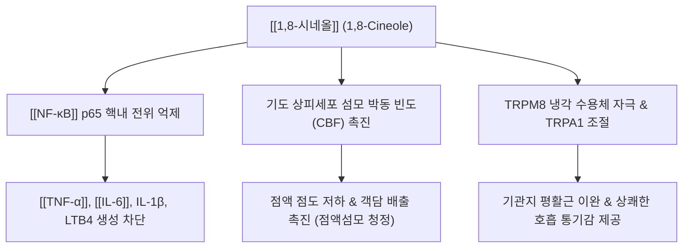

---
aliases:
  - 1,8-시네올
  - 시네올
  - 유칼립톨
  - 1,8-Cineole
  - Eucalyptol
tags:
  - 약리성분
  - 모노테르펜
  - 정유
  - 방향화습
  - 거담제
  - 항염증
---
# 💊 [[1,8-시네올]] (1,8-Cineole, Eucalyptol)

> **핵심 요약 (Key Summary)일반명 (Generic)화학명 (IUPAC)** | 1,3,3-trimethyl-2-oxabicyclo[2.2.2]octane |
| **기원 본초** | 생강과 [[사인]](*Amomum villosum*), 백두구(*Amomum kravanh*), [[창출]], 로즈마리, 유칼립투스 |
| **화학식 / 분자량** | $\text{C}_{10}\text{H}_{18}\text{O}$ / 154.25 g/mol |
| **화학적 분류** | 옥사비사이클릭 모노테르페노이드 (Bicyclic monoterpenoid ether) |
| **물리화학적 성상** | 무색의 투명한 액체, 특유의 상쾌한 캠퍼(Camphor)향, 지용성, 에탄올 가용, 수불용성 |

---

## 1. 기본 화학 정보 & 분자 구조식 (Chemical Identity)

> [!abstract]+ 🧪 3D 약리 분자 구조 (Interactive 3D Viewer)
> <iframe src="https://molecule-viewer-rho.vercel.app/?cid=2758" style="width: 100%; height: 600px; border: none; border-radius: 12px; box-shadow: 0 4px 20px rgba(0,0,0,0.15);" allowfullscreen></iframe>

## 2. 분자약리 작용 기전 (Mechanism of Action, MoA)

* **항염증 및 사이토카인 차단**:
  * 단핵구 및 대식세포에서 IκBα 분해를 차단하여 [[NF-κB]] 활성화를 억제함으로써 [[TNF-α]], [[IL-6]], IL-1β, 류코트리엔 $\text{LTB}_4$ 합성을 억제.
* **점액 분비 조절 및 섬모 운동 촉진(Secretomotoric)**:
  * 기도 배상세포의 뮤신(MUC5AC) 과분비를 억제하고 점액을 묽게 하여, 기관지 상피세포의 섬모 운동 속도를 높여 가래의 체외 배출을 가속화.
* **기관지 평활근 경련 완화**:
  * 칼슘 이온 유입 억제 및 TRPM8 채널 활성화를 통해 기도 과민성을 완화하고 기관지를 확장.

---

## 3. 주요 약리학적 효능 & 임상 데이터

* **만성 폐쇄성 폐질환(COPD) 및 기관지 천식 완화**:
  * 다기관 이중맹검 RCT에서 1,8-시네올(소엘로딘) 투여 시 천식 환자의 경구 스테로이드 요구량을 유의하게 감소시키고 호흡 기능(FEV1)을 개선함이 입증됨.
* **급만성 비부비동염(축농증) 개선**:
  * 비점막 부종 및 두통, 콧물 증상을 신속히 완화하고 항생제 사용 빈도를 감소.
* **위장관 항궤양 및 진통·진경 활성**:
  * 소화관 평활근 경련을 완화하고 가스 배출(구풍 작용)을 촉진하며 위점막 혈류를 유지.

---

## 4. 기원 본초 및 한의 임상 연계 (방향화습약)

* **함유 본초**:
  * : 정유의 핵심 성분으로 방향화습(芳香化濕), 행기온중(行氣溫中), 안태(安胎)의 주역.
  * **백두구(白荳蔲)**: 기를 잘 통하게 하고 비위를 따뜻하게 하여 구토를 멈춤.
  * : 비경의 습사를 말리고(조습건비) 수종을 내림.
* **한의 임상 응용**:
  * **방향화습(芳香化濕)의 현대적 규명**: 1,8-시네올의 휘발성 정유 성분은 소화관 상피의 미세순환을 촉진하고 정체된 수분과 가스를 신속히 배출시켜 비위의 '습탁(濕濁)'을 날려 보내는 작용과 직결.
  * **대표 배합 처방**: [[평위산]], [[향사평위산]], [[곽향정기산]], [[이진탕]] 가미방.

---

## 5. 안전성 및 약동학 (Pharmacokinetics)

* **흡수 및 분포**:
  * 경구 투여 또는 흡입 시 소화관과 호흡기 점막을 통해 신속히 흡수(Tmax 약 1~2시간).
* **대사 및 배설**:
  * 간의 CYP 효소군(CYP3A4/2B6)에 의해 수산화(2-하이드록시시네올 등)된 후 글루쿠론산 포합체를 거쳐 소변 및 일부 호흡으로 배설.
* **주의사항**:
  * 일반적인 생약 추출 수준에서는 매우 안전하나, 고농도 순수 정유 원액을 과량 음용할 경우 중추신경 억제 및 오심·구토 유발 가능.

---

## 6. 출처 및 학술 참고 문헌 (References)
* Juergens UR. Anti-inflammatory properties of the monoterpene 1.8-cineole: current evidence for co-medication in inflammatory airway diseases. *Adv Ther*. 2020;37(5):1747-1771.
  * `[연구 요약]`: 1,8-시네올의 NF-κB 억제 분자 기전 및 천식·COPD·부비동염 대상 임상 시험 총괄 리뷰.
* Worth H, Dethlefsen U. Patients with asthma benefit from concomitant therapy with cineole: a placebo-controlled, double-blind trial. *J Asthma*. 2012;49(8):849-853.
  * `[연구 요약]`: 천식 환자에서 1,8-시네올 병용 시 폐기능 개선 및 악화율 감소를 확인한 무작위 대조 임상 연구.
