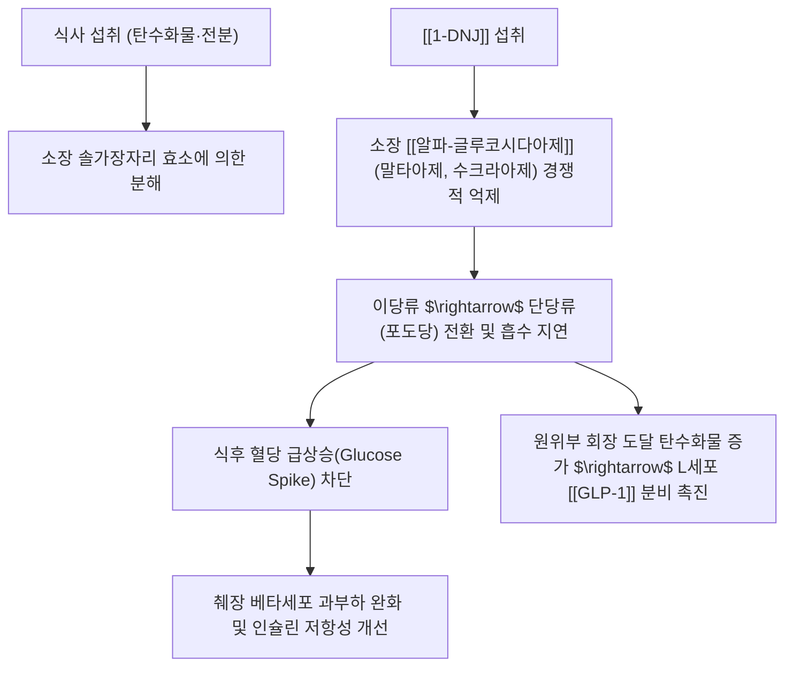

---
aliases:
  - 1-DNJ
  - 1-데옥시노지리마이신
  - 1-Deoxynojirimycin
  - 모라놀린
  - Moranolin
tags:
  - 약리성분
  - 이미노슈가
  - 상엽
  - 알파글루코시다아제억제제
  - 당뇨
  - 항바이러스
---
# 💊 [[1-DNJ]] (1-Deoxynojirimycin, 1-데옥시노지리마이신)

> **핵심 요약 (Key Summary)일반명 (Generic)화학명 (IUPAC)** | (2R,3R,4R,5S)-2-(hydroxymethyl)piperidine-3,4,5-triol |
| **기원 생약** | 뽕나무과 [[상엽]](*Morus alba* L.), 상지(桑枝), 누에(상엽 섭취 곤충) |
| **화학식 / 분자량** | $\text{C}_6\text{H}_{13}\text{NO}_4$ / 163.17 g/mol |
| **화학적 분류** | 폴리하이드록실화 피페리딘계 이미노슈가 (Polyhydroxylated piperidine alkaloid) |
| **구조적 특이성** | D-글루코오스 고리 내 산소 원자가 질소 원자로 치환된 천연 당 모방체(Sugar mimic) |

---

## 1. 기본 화학 정보 & 분자 구조식 (Chemical Identity)

> [!abstract]+ 🧪 3D 약리 분자 구조 (Interactive 3D Viewer)
> <iframe src="https://molecule-viewer-rho.vercel.app/?cid=445354" style="width: 100%; height: 600px; border: none; border-radius: 12px; box-shadow: 0 4px 20px rgba(0,0,0,0.15);" allowfullscreen></iframe>

## 2. 분자약리 작용 기전 (Mechanism of Action, MoA)

* **알파-글루코시다아제 경쟁적 억제**:
  * 포도당 분자와 극히 유사한 구조로 인해 소장 솔가장자리(Brush border)의 말타아제, 수크라아제, 이소말타아제 활성 부위에 우선 결합하여 이당류가 포도당으로 분해되는 것을 원천 차단.
* **장관 호르몬 GLP-1 분비 촉진**:
  * 소화되지 않은 복합 탄수화물이 원위부 회장 및 대장으로 천천히 이동하면서 L-세포를 자극하여 인크레틴 호르몬인 [[GLP-1]] 분비를 유도, 식욕 억제와 인슐린 분비 촉진.

---

## 3. 주요 대사 조절 효능 & 임상 연구

* **식후 고혈당 및 당화혈색소(HbA1c) 강하**:
  * 임상 시험에서 식전 상엽 추출물(1-DNJ 함유) 복용 시 식후 30~60분 혈당 피크가 위약군 대비 30~40% 억제됨을 확인.
* **혈관내피세포 당독성(AGEs) 차단**:
  * 급격한 혈당 변동성을 줄여 최종당화산물(AGEs) 형성과 활성산소([[ROS]]) 생성을 차단, 당뇨병성 망막병증·신증 예방.
* **지질 대사 개선 및 체중 조절**:
  * 탄수화물의 지방 전환을 억제하고 혈청 중성지방(TG) 및 간 지방 축적 완화.

---

## 4. 항바이러스 및 분자 샤페론 활성

* **소포체 글루코시다아제 억제 (외피 바이러스 억제)**:
  * 숙주 세포 소포체(ER)의 글루코시다아제 I/II를 억제하여 외피 당단백질(Glycoprotein)의 올바른 접힘(Folding)을 방해함으로써 인플루엔자, 뎅기 바이러스 복제 억제.

---

## 5. 상엽 방제학 및 한의 임상 연계

* **상엽(桑葉)의 소갈(消渴) 치료 과학화**:
  * 고전 문헌에서 상엽이 갈증을 멈추고 당뇨(소갈)를 다스린다는 기록의 핵심 약리 물질이 1-DNJ임이 규명됨.
* **누에 분말(백강잠, 원잠아)**:
  * 뽕잎을 먹고 자란 누에 체내에 1-DNJ가 농축되어 혈당 강하 건강기능식품으로 응용.
* **주요 배합 방제**:
  * [[상국음]], 청조구폐탕, 상엽다(뽕잎차).

---

## 6. 출처 및 학술 참고 문헌 (References)
* Asano N, et al. Polyhydroxylated alkaloids from Morus alba and their glycosidase inhibitory activities. *Carbohydr Res*. 1994;259(2):243-255.
  * `[연구 요약]`: 뽕나무 잎 유래 1-DNJ의 구조 결정 및 소장 글리코시다아제 효소 억제 활성 최초 규명.
* Kimura T, et al. Food-grade mulberry powder enriched with 1-deoxynojirimycin suppresses the elevation of postprandial blood glucose in humans. *J Agric Food Chem*. 2007;55(14):5869-5874.
  * `[연구 요약]`: 1-DNJ 고함유 상엽 분말의 인체 식후 고혈당 억제 효과 무작위 대조 임상 시험.
