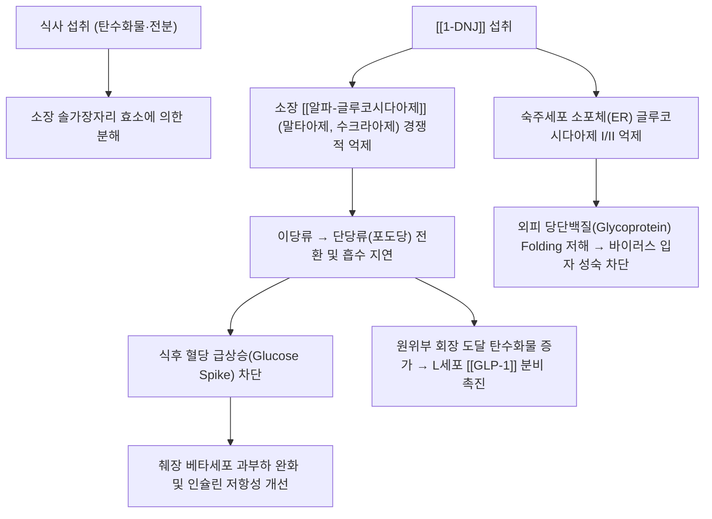

---
aliases:
  - 1-DNJ
  - 1-데옥시노지리마이신
  - 1-Deoxynojirimycin
  - 모라놀린
  - Moranolin
tags:
  - 약리성분
  - 이미노슈가
  - 상엽
  - 알파글루코시다아제억제제
  - 당뇨
  - 항바이러스
---
# 🔬 [[1-DNJ]] (1-Deoxynojirimycin, 1-데옥시노지리마이신)

> **핵심 3줄 요약 (Key Summary)**:
> - 🌿 기원 본초 & 화학 계열: [[상엽]](*Morus alba*), [[상지]], [[상백피]] 등 뽕나무과 전초 및 누에(백강잠)에 함유된 폴리하이드록실화 피페리딘계 이미노슈가(당 모방체, Sugar mimic).
> - 🎯 핵심 분자 표적 & 조절 경로: 소장 솔가장자리 [[알파-글루코시다아제]](말타아제·수크라아제) 경쟁적 억제, 원위부 회장 [[GLP-1]] 분비 촉진, 소포체 글루코시다아제 I/II 억제를 통한 바이러스 외피 당단백질 folding 저해.
> - 🩺 주요 약리 활성 & 질환 치료 기전: 식후 고혈당 및 당화혈색소(HbA1c) 강하, 최종당화산물(AGEs) 형성 차단, 지질 대사 개선, 인플루엔자·뎅기 등 외피 바이러스 복제 억제.
> - ⚠️ 독성·생체이용률 한계 & 상호작용: 다른 경구혈당강하제(설폰요소제, 인슐린)와 병용 시 저혈당 상가 위험, 미흡수 이당류의 대장 발효에 의한 복부팽만·가스·연변 등 소화기 부작용, 인체 ADME 자료는 제한적.

---

## 📌 목차
1. [기본 화학 정보 & 분자 구조식 (Chemical Identity)](#1-기본-화학-정보--분자-구조식-chemical-identity)
2. [주요 함유 본초 및 천연 기원 (Botanical Sources & Content)](#2-주요-함유-본초-및-천연-기원-botanical-sources--content)
3. [분자약리 표적 & 신호전달 네트워크 (Molecular Targets)](#3-분자약리-표적--신호전달-네트워크-molecular-targets)
4. [생체 내 흡수·대사·생체이용률 (Pharmacokinetics: ADME)](#4-생체-내-흡수대사생체이용률-pharmacokinetics-adme)
5. [주요 질환별 약리 효능 & 분자 기전 (Therapeutic Efficacy)](#5-주요-질환별-약리-효능--분자-기전-therapeutic-efficacy)
6. [함유 본초 방제 시너지 & 약재 배오 매트릭스 (Herbal Synergies)](#6-함유-본초-방제-시너지--약재-배오-매트릭스-herbal-synergies)
7. [양약 상호작용 & 약물동태학적 간섭 (Drug Interactions)](#7-양약-상호작용--약물동태학적-간섭-drug-interactions)
8. [💡 사용자 진료실 핵심 필기 & 임상 응용 팁 (Melt-In & High-Yield)](#8--사용자-진료실-핵심-필기--임상-응용-팁-melt-in--high-yield)
9. [출처 및 학술 참고 문헌 (References)](#9-출처-및-학술-참고-문헌-references)

---

## 1. 기본 화학 정보 & 분자 구조식 (Chemical Identity)

> [!abstract]+ 🧪 3D 약리 분자 구조 (Interactive 3D Viewer)
> <iframe src="https://molecule-viewer-rho.vercel.app/?cid=29435" style="width: 100%; height: 600px; border: none; border-radius: 12px; box-shadow: 0 4px 20px rgba(0,0,0,0.15);" allowfullscreen></iframe>

| 항목 | 상세 내용 |
| :--- | :--- |
| **일반명 (Generic)** | 1-DNJ (1-Deoxynojirimycin, 모라놀린) |
| **화학명 (IUPAC)** | (2R,3R,4R,5S)-2-(hydroxymethyl)piperidine-3,4,5-triol |
| **분자식 / 분자량** | $\text{C}_6\text{H}_{13}\text{NO}_4$ / 163.17 g/mol |
| **PubChem CID** | [29435](https://pubchem.ncbi.nlm.nih.gov/compound/29435) |
| **CAS 등록 번호** | 미확인(원문 미기재, 검증 필요) |
| **화학 골격 분류** | 폴리하이드록실화 피페리딘계 이미노슈가 (Polyhydroxylated piperidine alkaloid) |
| **물리화학적 성상** | D-글루코오스 고리 내 산소 원자가 질소 원자로 치환된 천연 당 모방체(Sugar mimic), 수용성 결정 |
| **식물 내 생합성 경로** | 원문에 별도 명시 없음 |

---

## 2. 주요 함유 본초 및 천연 기원 (Botanical Sources & Content)

| 함유 본초 (한글/한자) | 기원 식물학적 명칭 (과명 / 학명) | 주요 함유 약용 부위 | 지표 함량 (%) | 한의학적 귀경 및 약효 특성 |
| :--- | :--- | :--- | :--- | :--- |
| [[상엽]] (桑葉) | 뽕나무과(Moraceae) / *Morus alba* | 잎(서리 내린 후 채취, 동상엽) | 원문 미기재 | 肺·肝經 / 소산풍열(疏散風熱), 청설폐열, 소갈(消渴) 치료의 핵심 물질로 규명 |
| [[상지]] (桑枝) | 뽕나무과(Moraceae) / *Morus alba* | 어린 가지 | 원문 미기재 | 肝經 / 거풍습, 이관절, 상지(팔·어깨) 인경약(引經藥) |
| [[상백피]] (桑白皮) | 뽕나무과(Moraceae) / *Morus alba* | 뿌리껍질 | 원문 미기재 | 肺·脾經 / 사폐평천, 이수소종 |
| 누에(백강잠·원잠아) | 뽕잎을 섭취한 곤충 유충 | 유충 전체/분말 | 원문 미기재 | 뽕잎 섭취를 통해 체내 1-DNJ 농축, 혈당 강하 건강기능식품으로 응용 |

---

## 3. 분자약리 표적 & 신호전달 네트워크 (Molecular Targets)

### 1) 알파-글루코시다아제 경쟁적 억제
* 포도당 분자와 극히 유사한 구조로 인해 소장 솔가장자리(Brush border)의 말타아제, 수크라아제, 이소말타아제 활성 부위에 우선 결합하여 이당류가 포도당으로 분해되는 것을 원천 차단.

### 2) 장관 호르몬 GLP-1 분비 촉진
* 소화되지 않은 복합 탄수화물이 원위부 회장 및 대장으로 천천히 이동하면서 L-세포를 자극하여 인크레틴 호르몬인 [[GLP-1]] 분비를 유도, 식욕 억제와 인슐린 분비 촉진.

### 3) 소포체 글루코시다아제 억제를 통한 항바이러스 분자 샤페론 활성
* 숙주 세포 소포체(ER)의 글루코시다아제 I/II를 억제하여 외피 당단백질(Glycoprotein)의 올바른 접힘(Folding)을 방해함으로써 인플루엔자, 뎅기 바이러스 복제를 억제.

---

## 4. 생체 내 흡수·대사·생체이용률 (Pharmacokinetics: ADME)

* **흡수 경로**: 이미노슈가 구조상 극성이 높아 단순 확산보다는 장관 상피의 당 수송체를 매개로 흡수되는 것으로 알려져 있으나, 노트 내 정량적 흡수율·반감기 수치는 원문에 별도 명시되어 있지 않음.
* **대사 및 배설**: 화학구조상 체내 효소적 분해에 저항적인 것으로 알려져 있으며, 구체적 간대사(CYP) 경로 및 배설 반감기 데이터는 확인되지 않음 — 추가 검증 필요.
* **주의사항**: 미흡수 이당류가 대장으로 이동해 장내세균에 의해 발효되면서 가스·복부팽만·연변 등 소화기 증상이 나타날 수 있음(알파-글루코시다아제 억제제 계열의 공통 특성).

---

## 5. 주요 질환별 약리 효능 & 분자 기전 (Therapeutic Efficacy)

### 1) 식후 고혈당 및 당화혈색소(HbA1c) 강하 (제2형 당뇨)
* 임상 시험에서 식전 상엽 추출물(1-DNJ 함유) 복용 시 식후 30~60분 혈당 피크가 위약군 대비 30~40% 억제됨을 확인.
### 2) 혈관내피세포 당독성(AGEs) 차단
* 급격한 혈당 변동성을 줄여 최종당화산물(AGEs) 형성과 활성산소([[ROS]]) 생성을 차단, 당뇨병성 망막병증·신증 예방.
### 3) 지질 대사 개선 및 체중 조절
* 탄수화물의 지방 전환을 억제하고 혈청 중성지방(TG) 및 간 지방 축적 완화.
### 4) 항바이러스 및 분자 샤페론 활성
* 소포체 글루코시다아제 I/II 억제를 통해 외피 당단백질 접힘을 방해함으로써 인플루엔자, 뎅기 바이러스 복제를 억제.

---

## 6. 함유 본초 방제 시너지 & 약재 배오 매트릭스 (Herbal Synergies)

| 함유 본초 / 방제 | 공존 유효 성분군 | 분자약리 시너지 기전 | 전통 한의학적 효능 연계 |
| :--- | :--- | :--- | :--- |
| [[상엽]] | [[모루신]], 루틴, [[스코폴레틴]] | 이미노슈가와 플라보노이드의 항산화·혈당강하 복합 시너지 | 소산풍열, 소갈(消渴) 개선 |
| [[상백피]] | [[모루신]], [[쿠와논 G]] | 알파-글루코시다아제 억제와 항염 플라보노이드 병행 작용 | 사폐평천, 이수소종 |
| [[상국음]] | [[국화]] | 상엽(군약)의 풍열 해소와 국화의 평간명목 상승 작용 | 소산풍열(疏散風熱) |

---

## 7. 양약 상호작용 & 약물동태학적 간섭 (Drug Interactions)

* **경구혈당강하제 병용 시 저혈당 위험**:
  * 1-DNJ는 아카보스(Acarbose)·미글리톨(Miglitol)과 동일한 알파-글루코시다아제 억제 계열로 작용 기전을 공유하므로, 설폰요소제·인슐린 등 다른 혈당강하 양약과 병용 시 저혈당 위험이 상가적으로 증가할 수 있음 — 혈당 모니터링 강화 권고.
  * 다만 1-DNJ 자체에 대한 인체 대상 특이적 양약-양약 상호작용(임상 DDI) 연구는 확인되지 않았으므로, 위 주의는 같은 작용기전 계열의 일반적 특성에 근거한 것이며 구체적 CYP 효소 관여 여부는 단정할 수 없음.
* **소화효소제와의 상호작용**:
  * 알파-글루코시다아제 억제 계열의 공통 특성상, 췌장 소화효소 보충제와 병용 시 상호 효능이 감약될 수 있어 복용 간격 조절이 필요할 수 있음.

---

## 8. 💡 사용자 진료실 핵심 필기 & 임상 응용 팁 (Melt-In & High-Yield)

* **사용자 원문 필기**:
  * 현재 별도로 기록된 원장님 임상 필기가 없습니다.
* **진료실 실전 처방 & 생체이용률 극대화 팁**:
  1. **상엽(桑葉)의 소갈(消渴) 치료 과학화**: 고전 문헌에서 상엽이 갈증을 멈추고 당뇨(소갈)를 다스린다는 기록의 핵심 약리 물질이 1-DNJ임이 규명됨.
  2. **누에 분말(백강잠, 원잠아) 활용**: 뽕잎을 먹고 자란 누에 체내에 1-DNJ가 농축되어 혈당 강하 건강기능식품으로 응용.
  3. **주요 배합 방제**: [[상국음]], 청조구폐탕, 상엽다(뽕잎차) 등에서 식후 혈당 관리 목적으로 활용.

---

## 9. 출처 및 학술 참고 문헌 (References)

1. **Asano N, et al. (1994)**. *Polyhydroxylated alkaloids from Morus alba and their glycosidase inhibitory activities*. **Carbohydrate Research**, 259(2), 243-255.
   - **[연구 요약]**: 뽕나무 잎 유래 1-DNJ의 구조 결정 및 소장 글리코시다아제 효소 억제 활성 최초 규명.
2. **Kimura T, et al. (2007)**. *Food-grade mulberry powder enriched with 1-deoxynojirimycin suppresses the elevation of postprandial blood glucose in humans*. **Journal of Agricultural and Food Chemistry**, 55(14), 5869-5874.
   - **[연구 요약]**: 1-DNJ 고함유 상엽 분말의 인체 식후 고혈당 억제 효과를 확인한 무작위 대조 임상 시험.
