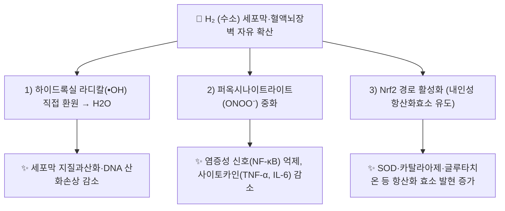

---
aliases:
  - Hydrogen
  - H2
  - 분자수소
  - 수소수
  - Molecular Hydrogen
tags:
  - 약리
  - 약리성분
  - 항산화
  - 기능의학
  - 산화스트레스
title: 수소
date: 2026-09-21
출처: PMID 26190095
---

# 🔬 수소 (Hydrogen, H₂ / Molecular Hydrogen)

> **핵심 3줄 요약 (Key Summary)**:
> - 🌿 기원 & 화학적 성질: 우주에서 가장 작고 가벼운 분자(H₂, 분자량 2.02 g/mol)로 세포막과 혈액뇌장벽을 자유롭게 통과하는 무색·무취 기체. 본초 함유 성분이 아니라 흡입·수소수 등으로 투여하는 기체 분자임. (⚠️ '혈액뇌장벽 통과'는 원문 서술이며, 확인한 초록 근거는 '막을 빠르게 확산'까지입니다. §1)
> - 🎯 핵심 기전: 2007년 Ohsawa 등이 *Nature Medicine*에 처음 보고한 **선택적 항산화제**로, 강한 세포독성을 지닌 하이드록실 라디칼(•OH)과 퍼옥시나이트라이트(ONOO⁻)만 선택적으로 중화하고, 생리적 신호전달에 필요한 슈퍼옥사이드·과산화수소·산화질소 등은 건드리지 않는 것이 특징. (⚠️ Ohsawa 2007 초록에서 확인되는 것은 •OH의 선택적 환원이며, Penders 2014는 H₂가 ONOOH와 반응하지 않았고 H₂+•OH 반응도 생리적으로는 너무 느리다고 보고했습니다. §3)
> - 🩺 주요 활성 & 적용: 항염증([[NF-κB]] 억제), [[Nrf2]] 경로를 통한 내인성 항산화효소 유도, 미토콘드리아 보호 등을 통해 허혈-재관류 손상·대사증후군 등 170여 개 질환·동물모델에서 유익 효과가 보고됨. 흡입, 수소수(음용), 수소 입욕 등으로 투여.
> - ⚠️ 근거 수준 한계: 대부분의 근거가 세포·동물 실험 및 소규모 임상 파일럿 연구 수준으로, 대규모 무작위 대조군 임상시험(RCT)에 기반한 확립된 표준 용법·용량은 아직 없음. 국내외에서 의약품이 아닌 건강기능식품·웰니스 기기(수소수 생성기 등)로 유통되는 경우가 많아 과장 광고에 유의해야 함. (심정지 후 흡입 RCT의 1차 결과는 통계적으로 유의하지 않았고, 수소수 지질 메타분석의 효과는 임상적으로 미미하다고 평가되었습니다. §5)

---

## 📌 목차
1. [기본 화학 정보 & 분자 구조식 (Chemical Identity)](#1-기본-화학-정보--분자-구조식-chemical-identity)
2. [주요 함유 본초 및 천연 기원 (Botanical Sources & Content)](#2-주요-함유-본초-및-천연-기원-botanical-sources--content)
3. [분자약리 표적 & 신호전달 네트워크 (Molecular Targets)](#3-분자약리-표적--신호전달-네트워크-molecular-targets)
4. [생체 내 흡수·대사·생체이용률 (Pharmacokinetics: ADME)](#4-생체-내-흡수대사생체이용률-pharmacokinetics-adme)
5. [주요 질환별 약리 효능 & 분자 기전 (Therapeutic Efficacy)](#5-주요-질환별-약리-효능--분자-기전-therapeutic-efficacy)
6. [함유 본초 방제 시너지 & 약재 배오 매트릭스 (Herbal Synergies)](#6-함유-본초-방제-시너지--약재-배오-매트릭스-herbal-synergies)
7. [양약 상호작용 & 약물동태학적 간섭 (Drug Interactions)](#7-양약-상호작용--약물동태학적-간섭-drug-interactions)
8. [💡 사용자 진료실 핵심 필기 & 임상 응용 팁 (Melt-In & High-Yield)](#8--사용자-진료실-핵심-필기--임상-응용-팁-melt-in--high-yield)
9. [출처 및 학술 참고 문헌 (References)](#9-출처-및-학술-참고-문헌-references)

---

## 1. 기본 화학 정보 & 분자 구조식 (Chemical Identity)

> [!abstract]+ 🧪 3D 약리 분자 구조 (Interactive 3D Viewer)
> <iframe src="https://molecule-viewer-rho.vercel.app/?cid=783" width="100%" height="450px" frameborder="0" allow="webgl" style="border-radius: 8px;"></iframe>

| 항목 | 상세 내용 |
| :--- | :--- |
| **IUPAC 명칭** | molecular hydrogen (PubChem 등록명 Hydrogen) |
| **분자식 / 분자량** | H₂ / 2.016 g/mol |
| **PubChem CID** | [783](https://pubchem.ncbi.nlm.nih.gov/compound/783) (PubChem 실측: 분자식 H2, 2.016, 3D 뷰어 CID와 일치) |
| **CAS 등록 번호** | 1333-74-0 — PubChem 동의어 항목 기준이며 CAS 원본 대조는 못 함 ⚠️ 내용 검토 필요 |
| **화학 골격 분류** | 이원자 무기 기체 분자 — 천연물 2차 대사산물이 아님 |
| **물리적 성상** | 상온에서 무색·무취·무미의 이원자 기체, 물에 대한 용해도가 낮음(상온·1기압에서 약 1.6 ppm 포화) ⚠️ 내용 검토 필요 — 용해도 수치는 이번 조사에서 문헌으로 확인하지 못함(수소수 제조 농도의 실측 예: 마그네슘 스틱 방식 0.55–0.65 mM, Nakao 2010) |
| **분자 크기 특성** | 자연계에서 가장 작은 분자로 지질막·혈액뇌장벽(BBB)을 확산으로 자유롭게 투과 ⚠️ 내용 검토 필요 — Ohsawa 2007 초록은 '막을 빠르게 확산해 세포독성 ROS에 도달할 수 있다'까지 확인되며 BBB 투과 자체는 초록에 없음 |
| **식물 내 생합성 경로** | 해당 없음(무기 기체). 원문에 기재 없음 |

---

## 2. 주요 함유 본초 및 천연 기원 (Botanical Sources & Content)

수소는 본초에 함유된 성분이 아니므로 '함유 본초·지표 함량' 표는 해당하지 않으며, 대신 실제로 쓰이는 **적용 형태**를 정리합니다. (원문에 별도 본초 서술 없음)

| 적용 형태 | 내용 | 근거·비고 |
| :--- | :--- | :--- |
| 수소 가스 흡입 | 1~4% 저농도 수소를 산소 등과 혼합해 흡입 | 321편 리뷰(Ichihara 2015)는 1~4% 흡입이 폭발 한계(4%) 미만이라고 기술. 심정지 후 RCT(HYBRID II)는 2% H₂+산소를 18시간 흡입 |
| 수소수(음용) | 수소를 녹인 물을 마심 | 리뷰상 대부분의 질환 연구가 수소수 또는 수소 가스로 시행됨(Ichihara 2015). 마그네슘 스틱을 물에 넣어 만든 예: Mg + 2H₂O → Mg(OH)₂ + H₂, 0.55–0.65 mM(Nakao 2010; [[마그네슘]]) |
| 수소식염수·입욕·점안 | 수소를 녹인 생리식염수 주사, 수소 입욕, 수소식염수 점안 | Ohta 2014 리뷰가 투여법으로 열거 |

---

## 3. 분자약리 표적 & 신호전달 네트워크 (Molecular Targets)

### 발견 배경 및 선택적 항산화 기전 (원문 §2)

2007년 일본 의과대학 오사와(Ohsawa) 등은 *Nature Medicine*에 발표한 연구에서, 수소 가스 흡입이 뇌 허혈-재관류 손상 모델에서 하이드록실 라디칼(•OH)을 선택적으로 감소시켜 신경세포를 보호한다는 사실을 처음 보고했습니다. 이 연구는 수소가 슈퍼옥사이드(O₂•⁻), 과산화수소(H₂O₂), 산화질소(NO) 등 세포 신호전달에 관여하는 [[ROS|활성산소종]]에는 반응하지 않고, 세포독성이 가장 강한 •OH와 퍼옥시나이트라이트(ONOO⁻)만 선택적으로 물로 환원시킨다는 점에서 "선택적 항산화제(selective antioxidant)"라는 개념을 제시했습니다.

⚠️ 내용 검토 필요: Ohsawa 2007 초록 기준으로 •OH의 선택적 환원은 배양세포 실험에서 확인되었고, 랫드 국소 허혈-재관류 모델에서는 수소 흡입이 산화 스트레스를 완충해 뇌손상을 크게 억제했습니다. 초록에는 ONOO⁻ 언급이 없습니다. 또한 Penders 2014는 H₂와 ONOOH가 반응하지 않았고, H₂+•OH 반응은 펄스 방사분해 연구상 생리적으로 의미 있기에는 너무 느리며, 헴·철-황 클러스터도 환원되지 않았다고 보고했습니다. 321편 리뷰(Ichihara 2015)도 '라디칼 소거만으로는 효과를 설명할 수 없다'고 결론지었습니다.

### 1) 핵심 분자 표적 (Molecular Targets)
* **NF-κB 경로 억제**: 산화스트레스로 유발되는 염증성 전사인자 [[NF-κB]]의 핵 내 이동을 억제하여 TNF-α, IL-6 등 염증성 사이토카인 발현을 낮춘다고 보고됩니다.
  * 근거: 당뇨 랫드 뇌졸중(MCAO) 모델에서 수소가 NF-κB p65의 인산화를 억제하고 염증을 줄였으며 기전은 TLR4/NF-κB 경로와 관련된다고 보고되었습니다(Yang 2023).
  * ⚠️ 내용 검토 필요: 확인한 초록은 p65 인산화 억제까지이며 '핵 내 이동 억제'는 확인하지 못했습니다. TNF-α·IL-6 발현 저하도 이번 초록에서 직접 확인하지 못했습니다.
* **Nrf2/HO-1 경로 활성화**: 세포 내 항산화 반응 요소(ARE)를 통해 헴산소화효소-1(HO-1), 글루타치온 합성효소 등 2차 방어 항산화 시스템을 유도하는 것으로 제안됩니다.
  * 근거: 사람 멜라닌세포에서 수소가 Nrf2 신호를 활성화했고 Nrf2가 없으면 보호 효과가 사라졌으며, β-카테닌 경로가 관여하는 것으로 시사되었습니다(Fang 2020). 신생 랫드 저산소-허혈 뇌손상 모델에서 수소 흡입이 Nrf2와 HO-1 발현을 높였고, MAPK 억제제가 수소에 의한 HO-1 발현을 차단했습니다(Wang 2020).
  * ⚠️ 내용 검토 필요: ARE 결합과 글루타치온 합성효소 유도는 확인한 초록에 직접 나오지 않습니다.
* **미토콘드리아 보호**: 미토콘드리아 막전위 유지 및 세포자멸사(아폽토시스) 관련 신호([[Caspase-3]] 등) 억제 효과가 다수의 허혈-재관류 손상 모델에서 관찰되었습니다.
  * 근거: 사람 멜라닌세포에서 수소가 미토콘드리아 형태와 기능을 보호했고(Fang 2020), 신생 랫드 모델에서 BAX·caspase-3를 낮추고 Bcl-2를 높였습니다(Wang 2020). 리뷰(Tao 2019)는 미토콘드리아와 소포체 보호, 세포내 신호경로 조절, 면역세포 아형 균형을 언급합니다.
  * ⚠️ 내용 검토 필요: '미토콘드리아 막전위 유지'는 확인한 초록에서 직접 확인하지 못했습니다.
* **기타 조절 표적 (신규)**: Ichihara 2015는 수소 효과가 Lyn, ERK, p38, JNK, ASK1, Akt, iNOS, Nox1, NF-κB p65, IκBα, STAT3, ghrelin 등의 활성·발현 조절로 매개될 수 있다고 정리했으나, 이를 총괄하는 상위 조절 인자는 아직 밝혀지지 않았다고 기술합니다.

---

## 4. 생체 내 흡수·대사·생체이용률 (Pharmacokinetics: ADME)

* **흡입(Inhalation)**: 1~4% 저농도 수소 가스를 산소와 혼합 흡입 (안전상 폭발 하한계인 4.6% 미만 유지가 원칙).
  * ⚠️ 내용 검토 필요: 321편 리뷰(Ichihara 2015)는 1~4% 흡입이 폭발 한계(4%) 미만이라고 서술합니다. 원문의 4.6%(산소 중 하한계로 알려진 수치)는 이번 조사에서 문헌으로 확인하지 못했습니다.
* **수소수 음용(Hydrogen-rich water)**: 수소를 포화시킨 물을 마시는 방법으로, 체내 흡수 후 호기(날숨)를 통한 배출량으로 체내 흡수를 간접 확인 가능.
  * ⚠️ 내용 검토 필요: 호기 수소 측정으로 흡수를 확인했다는 문헌은 이번 검색에서 찾지 못했습니다.
* **수소 입욕·주사(수소식염수)**: 경피 흡수 또는 정맥 내 수소포화 생리식염수 주입 등 실험적 투여 경로도 연구되고 있습니다.
* **배설**: 대부분 변화 없이 호흡을 통해 폐로 배출되며, 대사되어 축적되는 독성 대사산물이 보고되지 않아 안전성이 높은 편으로 평가됩니다.
  * ⚠️ 내용 검토 필요: '호흡을 통한 배출'과 대사산물 부재의 직접 근거는 확인하지 못했습니다. Ohta 2014 리뷰는 부작용이 없거나 적을 것이라고 기술하나 리뷰 수준의 평가입니다.
* **랫드 혈중·조직 농도 (신규)**: 랫드에서 수소 과포화수 경구·복강 투여 시 5분, 정맥 투여 시 1분에 농도가 정점이었고, 수소 가스 흡입에서는 30분에 유의하게 높아진 뒤 같은 수준이 유지되었습니다(Liu 2014; 정정문 PMID 26190095 있음).
* **인체 약동학·장내 미생물 대사·간 CYP450 대사**: 인체 혈중·조직 농도 자료는 이번 검색에서 찾지 못했고, 기체 분자라 통상적인 소분자 CYP 대사·P-gp 기질성 개념은 적용되지 않는 것으로 보이나 문헌으로 확인하지 못했습니다. ⚠️ 내용 검토 필요

---

## 5. 주요 질환별 약리 효능 & 분자 기전 (Therapeutic Efficacy)

### 1) 종합 현황 (원문 §5)

2019년 *Acta Biochimica et Biophysica Sinica*에 발표된 Tao 등의 리뷰에 따르면, 2007년 이후 수소의 유익 효과는 허혈-재관류 손상, 대사증후군, 염증성 질환, 암 등을 포함해 170여 개 이상의 질환 모델·임상 연구에서 보고되었습니다. 주요 항산화·항염증·항세포자멸사 효과 외에도 면역세포 아형 균형 조절 등 다각적 기전이 제시되고 있습니다.

⚠️ 내용 검토 필요: 대부분 소규모·파일럿 수준의 임상 연구이며, 질환별 표준화된 용량·투여 기간·장기 안전성 자료는 아직 충분히 확립되어 있지 않습니다.

* 321편 리뷰(2007~2015년 6월)는 논문의 약 3/4이 마우스·랫드 실험이며 31개 질환군·166개 질환모델·병태에서 효과가 보고되었다고 정리합니다(Ichihara 2015).

### 2) 심정지 후 흡입 (RCT)
* HYBRID II: 일본 15개 병원, 무작위 이중맹검 위약대조, 심인성 원외 심정지 후 혼수 환자 73명(수소 39, 대조 34)에게 2% 수소+산소 또는 산소를 18시간 흡입시켰고, 코로나19 등록 제한으로 조기 종료되었습니다. 1차 결과(90일 CPC 1–2)는 56% 대 39%(상대위험 0.72; 95% CI 0.46–1.13; P=0.15)로 통계적으로 유의하지 않았고, 2차 결과인 mRS 중앙값(1 대 5, P=0.01)과 90일 생존율(85% 대 61%, P=0.02)은 수소군이 좋았습니다(Tamura 2023). 저자들도 1차 결과가 유의하지 않아 2차 결과는 가능성을 시사하는 수준이라고 해석했습니다.

### 3) 대사성 질환 (수소수)
* 제2형 당뇨·내당능장애 36명 무작위 이중맹검 교차시험(900 mL/일, 8주): 변형 LDL 15.5%(P<.01), small dense LDL 5.7%(P<.05), 소변 8-isoprostane 6.6%(P<.05) 감소, 내당능장애 6명 중 4명에서 경구당부하 정상화(Kajiyama 2008).
* 잠재적 대사증후군 20명 공개 라벨 8주 연구(1.5–2 L/일): 소변 SOD 39% 증가·TBARS 43% 감소(P<0.05), 4주째 HDL 8% 증가, 공복혈당 변화 없음(Nakao 2010). 대조군이 없는 파일럿이며, 전문 표에서 소변 8-OHdG는 변화가 없었습니다.
* 지질 메타분석: 대사질환 RCT 8편·357명에서 TG가 유의하게 감소했고(효과크기 −0.27; 95% CI −0.47~−0.07) TC·LDL 감소는 미미해 '온건한 지질 저하'로 평가되었습니다(Jamialahmadi 2024). 과체중·비만 성인 RCT 13편·757명 메타분석에서는 TC −6.71 mg/dL, LDL −3.21 mg/dL, HDL −1.16 mg/dL(모두 통계적으로 유의)이고 TG는 유의하지 않았으며, 저자들은 이 효과가 심혈관 위험 감소에 의미 있는 기준에 못 미치므로 지질 저하 치료로 일상 사용을 정당화하지 못한다고 결론지었습니다(Ye 2026).

### 4) 파킨슨병
* 레보도파 복용 파킨슨병 환자 17명(수소수 9, 위약 8) 48주 무작위 이중맹검 파일럿: 수소수 1,000 mL/일 군에서 UPDRS 총점이 개선(평균 −5.7)되고 위약군은 악화(+4.1)되어 차이가 유의했으나(P<0.05) 저자들도 환자 수가 매우 적고 기간이 짧다고 밝혔습니다(Yoritaka 2013). 다기관 이중맹검 후속 시험(Yoritaka 2018)은 초록이 없어 결과를 확인하지 못했습니다. ⚠️ 내용 검토 필요

### 5) 암
* 4기 대장암 55명에게 수소 가스를 하루 3시간 흡입시킨 연구에서 소진된 PD-1+ CD8+ T세포가 감소하고 PFS·OS가 개선되었다고 보고되었으나(Akagi 2019), 대조군 설정 등 설계는 이번에 확인하지 못했습니다. ⚠️ 내용 검토 필요
* 국소 진행 두경부암 10명의 항암방사선치료 병용 수소 흡입 파일럿에서 33회 흡입 동안 수소 흡입 관련 이상반응이 없었습니다(Chitapanarux 2024). 유효성 평가 시험이 아닌 실행가능성·안전성 파일럿입니다.

---

## 6. 함유 본초 방제 시너지 & 약재 배오 매트릭스 (Herbal Synergies)

### 한의학·기능의학적 연계 (원문 §6)

* 수소 자체는 전통 본초학 체계의 약재가 아니며, 현대 기능의학·항노화 의학 영역에서 항산화·항염증 보조요법으로 활용되는 사례가 늘고 있습니다.
* 산화스트레스·만성 염증을 병리 기전으로 공유하는 한의학적 병증(어혈, 담음 등)과의 접점에서 보조적 개념으로 언급될 수 있으나, 이는 아직 학술적으로 정립된 대응 관계가 아니므로 ⚠️ 내용 검토 필요로 표기합니다.

| 함유 본초 / 방제 | 공존 유효 성분군 | 분자약리 시너지 기전 | 전통 한의학적 효능 연계 |
| :--- | :--- | :--- | :--- |
| 해당 없음 | 볼트 `_의학/02_약리/처방/`·`본초/` 노트에서 수소를 구성 성분으로 하는 처방·본초를 확인하지 못함 | ⚠️ 내용 검토 필요 — 수소와 한약재 병용 시너지 문헌은 확인하지 못함 | 확립된 대응 관계 없음(위 원문 서술 참고) |

---

## 7. 양약 상호작용 & 약물동태학적 간섭 (Drug Interactions)

### 임상 적용 시 주의사항 (원문 §7)

* 시판 수소수 생성기·수소 흡입기의 실제 수소 발생 농도는 제품별 편차가 크며, 과장된 효능 광고가 많으므로 임상적 권고 시 주의가 필요합니다.
  * ⚠️ 내용 검토 필요: 시판 제품별 농도 비교 문헌은 확인하지 못했습니다. 확인한 실측 예는 마그네슘 스틱 방식의 0.55–0.65 mM(Nakao 2010)입니다.
* 고농도 수소 가스는 폭발 위험이 있으므로 흡입 요법은 반드시 안전 인증된 의료기기·프로토콜 하에서만 시행해야 합니다.

### 상호작용 문헌
* **CYP450 효소 간섭 및 유사 기전 양약 병용 시 고려사항**: 수소와 양약의 약물 상호작용을 다룬 문헌은 이번 검색에서 찾지 못했습니다. ⚠️ 내용 검토 필요
* **안전성 자료**: 심정지 후 RCT(Tamura 2023)와 두경부암 파일럿(Chitapanarux 2024)은 수소 흡입의 실행가능성을 보고했고, 파일럿에서는 수소 흡입 관련 이상반응이 없었으나 장기 안전성 자료는 충분하지 않습니다.

---

## 8. 💡 사용자 진료실 핵심 필기 & 임상 응용 팁 (Melt-In & High-Yield)

* **사용자 원문 필기 (100% 융합 및 보존)**:
  * 기존 노트에 원장님의 수기 필기는 없었습니다. (추후 필기가 생기면 이곳에 원문 그대로 추가)
* **진료실 실전 처방 & 생체이용률 극대화 팁**:
  1. 수소수·수소 흡입의 임상 근거는 대부분 소규모 파일럿과 동물 연구이며(§5), 시판 제품의 수소 농도와 체내 흡수는 확인되지 않았습니다(§4·§7). 환자에게 치료 효과를 단정해 안내하지 않도록 주의합니다.
  2. 체질별·병증별 적용은 원문·문헌에서 확인되지 않아 기재하지 않습니다. ⚠️ 내용 검토 필요

---

## 9. 출처 및 학술 참고 문헌 (References)

1. **Ohsawa I, Ishikawa M, Takahashi K, et al. (2007)**. Hydrogen acts as a therapeutic antioxidant by selectively reducing cytotoxic oxygen radicals. *Nature Medicine*, 13(6), 688–694. PMID: [17486089](https://pubmed.ncbi.nlm.nih.gov/17486089/) · DOI: [10.1038/nm1577](https://doi.org/10.1038/nm1577)
   - **[연구 요약]**: 수소가 하이드록실 라디칼과 퍼옥시나이트라이트만 선택적으로 환원시키는 "선택적 항산화제"임을 최초로 규명하고, 뇌 허혈-재관류 손상 모델에서 신경보호 효과를 입증한 랜드마크 논문. (초록 기준: •OH 선택적 환원은 배양세포 실험, 랫드 국소 허혈-재관류 모델에서 수소 흡입이 뇌손상을 크게 억제. ONOO⁻는 초록에 언급 없음 ⚠️)
2. **Tao G, Song G, Qin S. (2019)**. Molecular hydrogen: current knowledge on mechanism in alleviating free radical damage and diseases. *Acta Biochimica et Biophysica Sinica*, 51(12), 1189–1197. PMID: [31738389](https://pubmed.ncbi.nlm.nih.gov/31738389/) · DOI: [10.1093/abbs/gmz121](https://doi.org/10.1093/abbs/gmz121)
   - **[연구 요약]**: 2007년 이후 축적된 수소의 항산화·항염증·항세포자멸사·미토콘드리아 보호 기전 및 170여 개 질환 모델 연구를 종합한 리뷰.
3. PubChem Compound Summary — Hydrogen (CID 783): [https://pubchem.ncbi.nlm.nih.gov/compound/783](https://pubchem.ncbi.nlm.nih.gov/compound/783)
4. **Ichihara M, Sobue S, Ito M, Ito M, Hirayama M, Ohno K. (2015)**. Beneficial biological effects and the underlying mechanisms of molecular hydrogen - comprehensive review of 321 original articles. *Med Gas Res*, 5:12. PMID: [26483953](https://pubmed.ncbi.nlm.nih.gov/26483953/) · DOI: [10.1186/s13618-015-0035-1](https://doi.org/10.1186/s13618-015-0035-1)
   - **[연구 요약]**: 2007~2015년 6월 논문 321편 종설. 논문의 약 3/4이 마우스·랫드 연구, 31개 질환군·166개 모델, 1~4% 흡입은 폭발 한계 미만, 라디칼 소거만으로는 설명 불가.
5. **Ohta S. (2014)**. Molecular hydrogen as a preventive and therapeutic medical gas: initiation, development and potential of hydrogen medicine. *Pharmacol Ther*, 144(1), 1–11. PMID: [24769081](https://pubmed.ncbi.nlm.nih.gov/24769081/) · DOI: [10.1016/j.pharmthera.2014.04.006](https://doi.org/10.1016/j.pharmthera.2014.04.006)
   - **[연구 요약]**: 수소의 투여 방법(흡입·수소수·수소식염수·입욕·점안), 직접 반응과 유전자 발현 조절을 통한 항산화·항염증·항세포자멸사 작용을 정리한 리뷰.
6. **Penders J, Kissner R, Koppenol WH. (2014)**. ONOOH does not react with H2: Potential beneficial effects of H2 as an antioxidant by selective reaction with hydroxyl radicals and peroxynitrite. *Free Radic Biol Med*, 75, 191–194. PMID: [25086438](https://pubmed.ncbi.nlm.nih.gov/25086438/) · DOI: [10.1016/j.freeradbiomed.2014.07.025](https://doi.org/10.1016/j.freeradbiomed.2014.07.025)
   - **[연구 요약]**: H₂+•OH 반응은 생리적으로 의미 있기에는 너무 느리고, H₂는 ONOOH와 반응하지 않았으며 헴·철-황 클러스터도 환원하지 못했다는 음성 결과.
7. **Yang WC, Li TT, Wan Q, et al. (2023)**. Molecular Hydrogen Mediates Neurorestorative Effects After Stroke in Diabetic Rats: the TLR4/NF-κB Inflammatory Pathway. *J Neuroimmune Pharmacol*, 18(1-2), 90–99. PMID: [35895245](https://pubmed.ncbi.nlm.nih.gov/35895245/) · DOI: [10.1007/s11481-022-10051-w](https://doi.org/10.1007/s11481-022-10051-w)
   - **[연구 요약]**: 당뇨 랫드 MCAO 모델에서 수소가 체중·생존·신경 기능을 개선하고 NF-κB p65 인산화를 억제.
8. **Fang W, Tang L, Wang G, et al. (2020)**. Molecular Hydrogen Protects Human Melanocytes from Oxidative Stress by Activating Nrf2 Signaling. *J Invest Dermatol*, 140(11), 2230–2241.e9. PMID: [32234461](https://pubmed.ncbi.nlm.nih.gov/32234461/) · DOI: [10.1016/j.jid.2019.03.1165](https://doi.org/10.1016/j.jid.2019.03.1165)
   - **[연구 요약]**: 과산화수소로 손상된 사람 멜라닌세포에서 수소가 ROS를 줄이고 미토콘드리아를 보호하며 Nrf2 신호를 활성화(Nrf2 결핍 시 보호 소실).
9. **Wang P, Zhao M, Chen Z, et al. (2020)**. Hydrogen Gas Attenuates Hypoxic-Ischemic Brain Injury via Regulation of the MAPK/HO-1/PGC-1a Pathway in Neonatal Rats. *Oxid Med Cell Longev*, 2020, 6978784. PMID: [32104537](https://pubmed.ncbi.nlm.nih.gov/32104537/) · DOI: [10.1155/2020/6978784](https://doi.org/10.1155/2020/6978784)
   - **[연구 요약]**: 신생 랫드 저산소-허혈 뇌손상에서 수소 흡입이 BAX·caspase-3를 낮추고 Bcl-2·Nrf2·HO-1을 높이며 MAPK–HO-1–PGC-1α 경로가 관여. (정정문 2021 있음, DOI 10.1155/2021/3539415)
10. **Liu C, Kurokawa R, Fujino M, Hirano S, Sato B, Li XK. (2014)**. Estimation of the hydrogen concentration in rat tissue using an airtight tube following the administration of hydrogen via various routes. *Sci Rep*, 4, 5485. PMID: [24975958](https://pubmed.ncbi.nlm.nih.gov/24975958/) · DOI: [10.1038/srep05485](https://doi.org/10.1038/srep05485)
    - **[연구 요약]**: 랫드에서 경구·복강·정맥·흡입 투여 후 혈중·조직 수소 농도를 측정. 정정문 PMID 26190095.
11. **Tamura T, Suzuki M, Homma K, Sano M; HYBRID II Study Group. (2023)**. Efficacy of inhaled hydrogen on neurological outcome following brain ischaemia during post-cardiac arrest care (HYBRID II): a multi-centre, randomised, double-blind, placebo-controlled trial. *EClinicalMedicine*, 58, 101907. PMID: [36969346](https://pubmed.ncbi.nlm.nih.gov/36969346/) · DOI: [10.1016/j.eclinm.2023.101907](https://doi.org/10.1016/j.eclinm.2023.101907)
    - **[연구 요약]**: 심정지 후 혼수 환자 73명 2% 수소 18시간 흡입. 1차 결과(90일 CPC 1–2) 56% 대 39%로 유의하지 않음(P=0.15), 2차 mRS·90일 생존율은 수소군이 양호.
12. **Kajiyama S, Hasegawa G, Asano M, et al. (2008)**. Supplementation of hydrogen-rich water improves lipid and glucose metabolism in patients with type 2 diabetes or impaired glucose tolerance. *Nutr Res*, 28(3), 137–143. PMID: [19083400](https://pubmed.ncbi.nlm.nih.gov/19083400/) · DOI: [10.1016/j.nutres.2008.01.008](https://doi.org/10.1016/j.nutres.2008.01.008)
    - **[연구 요약]**: 36명 무작위 이중맹검 교차시험. 수소수 8주 시 변형 LDL·small dense LDL·소변 8-isoprostane 감소.
13. **Nakao A, Toyoda Y, Sharma P, Evans M, Guthrie N. (2010)**. Effectiveness of hydrogen rich water on antioxidant status of subjects with potential metabolic syndrome-an open label pilot study. *J Clin Biochem Nutr*, 46(2), 140–149. PMID: [20216947](https://pubmed.ncbi.nlm.nih.gov/20216947/) · DOI: [10.3164/jcbn.09-100](https://doi.org/10.3164/jcbn.09-100)
    - **[연구 요약]**: 20명 공개 라벨 8주. 마그네슘 스틱 수소수(0.55–0.65 mM)로 소변 SOD 증가·TBARS 감소, 공복혈당 변화 없음.
14. **Jamialahmadi H, Khalili-Tanha G, Rezaei-Tavirani M, Nazari E. (2024)**. The Effects of Hydrogen-Rich Water on Blood Lipid Profiles in Metabolic Disorders Clinical Trials: A Systematic Review and Meta-analysis. *Int J Endocrinol Metab*, 22(3), e148600. PMID: [39839806](https://pubmed.ncbi.nlm.nih.gov/39839806/) · DOI: [10.5812/ijem-148600](https://doi.org/10.5812/ijem-148600)
    - **[연구 요약]**: RCT 8편·357명 메타분석. TG 유의한 감소, TC·LDL은 미미, HDL은 이질성. 온건한 지질 저하.
15. **Ye H, Fang J, Safargar M, Fareed H, Prabahar K, Jin P. (2026)**. The effect of hydrogen-rich water interventions on lipid profiles in adults with overweight or obesity and associated metabolic disorders: a systematic review and meta-analysis of randomized controlled trials. *Diabetol Metab Syndr*, 18(1), 114. PMID: [41888952](https://pubmed.ncbi.nlm.nih.gov/41888952/) · DOI: [10.1186/s13098-026-02124-0](https://doi.org/10.1186/s13098-026-02124-0)
    - **[연구 요약]**: RCT 13편·757명. TC·LDL 소폭 감소, HDL 소폭 감소, TG 무변화. 임상적으로 의미 있는 기준에 못 미쳐 지질 저하 치료로 일상 사용을 정당화하지 못한다고 결론.
16. **Yoritaka A, Takanashi M, Hirayama M, Nakahara T, Ohta S, Hattori N. (2013)**. Pilot study of H₂ therapy in Parkinson's disease: a randomized double-blind placebo-controlled trial. *Mov Disord*, 28(6), 836–839. PMID: [23400965](https://pubmed.ncbi.nlm.nih.gov/23400965/) · DOI: [10.1002/mds.25375](https://doi.org/10.1002/mds.25375)
    - **[연구 요약]**: 파킨슨병 17명(수소수 9·위약 8) 48주. 수소수군 UPDRS 총점 개선, 위약군 악화(P<0.05), 저자들은 소규모·단기임을 명시.
17. **Yoritaka A, Ohtsuka C, Maeda T, et al. (2018)**. Randomized, double-blind, multicenter trial of hydrogen water for Parkinson's disease. *Mov Disord*, 33(9), 1505–1507. PMID: [30207619](https://pubmed.ncbi.nlm.nih.gov/30207619/) · DOI: [10.1002/mds.27472](https://doi.org/10.1002/mds.27472)
    - **[연구 요약]**: 제목 기준 인용 — PubMed에 초록이 없어 결과를 확인하지 못함 ⚠️
18. **Akagi J, Baba H. (2019)**. Hydrogen gas restores exhausted CD8+ T cells in patients with advanced colorectal cancer to improve prognosis. *Oncol Rep*, 41(1), 301–311. PMID: [30542740](https://pubmed.ncbi.nlm.nih.gov/30542740/) · DOI: [10.3892/or.2018.6841](https://doi.org/10.3892/or.2018.6841)
    - **[연구 요약]**: 4기 대장암 55명, 수소 흡입 하루 3시간. PD-1+ CD8+ T세포 감소와 PFS·OS 개선 보고(설계는 미확인 ⚠️).
19. **Chitapanarux I, Onchan W, Chakrabandhu S, et al. (2024)**. Pilot Feasibility and Safety Study of Hydrogen Gas Inhalation in Locally Advanced Head and Neck Cancer Patients. *Onco Targets Ther*, 17, 863–870. PMID: [39493677](https://pubmed.ncbi.nlm.nih.gov/39493677/) · DOI: [10.2147/OTT.S478613](https://doi.org/10.2147/OTT.S478613)
    - **[연구 요약]**: 두경부암 10명, 항암방사선치료 병용 33회 수소 흡입. 수소 흡입 관련 이상반응 없음(실행가능성·안전성 파일럿).
