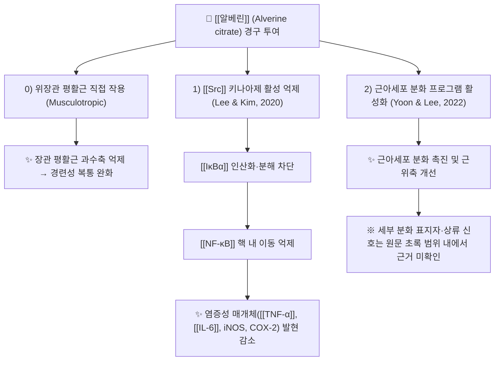

# 🔬 [[알베린]] (Alverine, C20H27N / N-ethyl-3-phenyl-N-(3-phenylpropyl)propan-1-amine)

> **핵심 3줄 요약 (Key Summary)**:
> - 🌿 기원 본초 & 화학 계열: **천연 기원 없음 — 전합성 화합물**. 디페닐프로필아민(diphenylpropylamine) 골격의 합성 **페닐알킬아민계 진경제**로, 알칼로이드·플라보노이드·테르페노이드 등 천연물 2차 대사산물 계열에 속하지 않는다. 임상에서는 **시트레이트염(alverine citrate)** 형태 또는 [[시메티콘]]과의 복합제(예: 알베릭스)로 사용된다.
> - 🎯 핵심 분자 표적 & 조절 경로: 위장관 **평활근 직접 이완(musculotropic, 근성 진경)** 작용이 대표 기전이며, 제공 논문 기준으로 **[[Src]] 키나아제 억제 → [[NF-κB]] 경로 차단**이라는 항염증 표적이 보고되었다(Lee & Kim, 2020). [[IκBα]] 인산화·분해 차단을 통한 염증성 전사인자 핵 내 이동 억제 방향으로 조절된다.
> - 🩺 주요 약리 활성 & 질환 치료 기전: [[과민성대장증후군]](IBS) 및 만성 복부 경련성 통증의 진경·복통 완화, 대장내시경 전처치 시 경련 억제([[시메티콘]] 병용), LPS 유도 염증모델에서 [[TNF-α]]·[[IL-6]]·iNOS·COX-2 억제, 그리고 근아세포 분화 촉진을 통한 [[근위축]] 개선 보고(Yoon & Lee, 2022).
> - ⚠️ 독성·생체이용률 한계 & 상호작용: **알베린시트레이트 유발 급성 간염 증례**가 보고되어 있어(Arhan & Koklu, 2004, PMID 15259090) 간기능 이상·황달 발생 시 즉시 중단해야 한다. 약한 항콜린성 작용에 기인한 구갈·변비·요저류·시야흐림이 다른 항콜린성 약물과 병용 시 가산될 수 있고, 구체적 CYP 저해/유도 프로파일은 본 노트에서 **근거 미확인**이다.

---

## 📌 목차
1. [기본 화학 정보 & 분자 구조식 (Chemical Identity)](#1-기본-화학-정보--분자-구조식-chemical-identity)
2. [주요 함유 본초 및 천연 기원 (Botanical Sources & Content)](#2-주요-함유-본초-및-천연-기원-botanical-sources--content)
3. [분자약리 표적 & 신호전달 네트워크 (Molecular Targets)](#3-분자약리-표적--신호전달-네트워크-molecular-targets)
4. [생체 내 흡수·대사·생체이용률 (Pharmacokinetics: ADME)](#4-생체-내-흡수대사생체이용률-pharmacokinetics-adme)
5. [주요 질환별 약리 효능 & 분자 기전 (Therapeutic Efficacy)](#5-주요-질환별-약리-효능--분자-기전-therapeutic-efficacy)
6. [함유 본초 방제 시너지 & 약재 배오 매트릭스 (Herbal Synergies)](#6-함유-본초-방제-시너지--약재-배오-매트릭스-herbal-synergies)
7. [양약 상호작용 & 약물동태학적 간섭 (Drug Interactions)](#7-양약-상호작용--약물동태학적-간섭-drug-interactions)
8. [💡 사용자 진료실 핵심 필기 & 임상 응용 팁 (Melt-In & High-Yield)](#8--사용자-진료실-핵심-필기--임상-응용-팁-melt-in--high-yield)
9. [출처 및 학술 참고 문헌 (References)](#9-출처-및-학술-참고-문헌-references)

---

## 1. 기본 화학 정보 & 분자 구조식 (Chemical Identity)

> [!abstract]+ 🧪 분자 구조 식별자 확인 필요
> - **PubChem CID**: 근거 미인용 — 제공된 자료에 CID 값이 없으므로 본 노트에서는 임의로 기입하지 않는다. PubChem에서 "Alverine"으로 직접 검색 후 링크를 보완할 것.
> - **3D 뷰어 임베드**: CID 미확인으로 생성 보류 (CID 확정 후 활성화).

| 항목 | 상세 내용 |
| :--- | :--- |
| **IUPAC 명칭** | N-ethyl-3-phenyl-N-(3-phenylpropyl)propan-1-amine (N-에틸-N-(3-페닐프로필)-3-페닐프로판-1-아민) |
| **분자식 / 분자량** | 유리염기 **C20H27N / 281.44 g/mol** · 시트레이트염 **C26H35NO7 / 473.56 g/mol** (1:1 염 기준) |
| **PubChem CID** | 근거 미확인 (직접 검증 필요) |
| **CAS 등록 번호** | 유리염기 150-59-4 / 시트레이트염 5560-59-8 *(문헌 표기 기준 — 최종 처방·조제 전 재확인 권장)* |
| **화학 골격 분류** | **합성 페닐알킬아민(디페닐프로필아민)계** — 천연물 2차 대사산물 분류(알칼로이드·플라보노이드·테르페노이드)에 해당하지 않음. 두 개의 페닐 고리가 프로필아민 사슬 양단에 결합한 구조로, [[메베베린]](mebeverine, 파파베린 유사 골격)과 함께 "근성 진경제(musculotropic antispasmodic)" 계열로 분류된다. |
| **물리화학적 성상** | 시트레이트염은 백색~미황색 **결정성 분말**로 물에 잘 녹는 염 형태이며, 유리염기는 친지성이 강한 3차 아민이다. 정확한 LogP·용해도·융점 수치는 본 노트에서 **근거 미확인**(제공 논문에 물리화학 데이터 없음). 일반적으로 열·빛에 안정한 염 형태로 유통된다. |
| **식물 내 생합성 경로** | **해당 없음(전합성 화합물)**. 식물 2차 대사 생합성 캐스케이드가 존재하지 않으며, 산업적으로는 디페닐프로필아민 골격에 에틸기를 도입하는 알킬화 반응으로 합성된다. |

**구조적 특징 해설**: 알베린의 분자 골격은 "아민 중심 + 양측 페닐 고리"라는 친지성 구조로, 이는 세포막 지질층 및 평활근 세포 내부 표적에 대한 친화성을 높이는 방향으로 작용한다. 시트레이트염은 이 친지성 유리염기의 용해도와 경구 흡수를 개선하기 위한 제형학적 선택으로 이해할 수 있다.

---

## 2. 주요 함유 본초 및 천연 기원 (Botanical Sources & Content)

⚠️ **중요**: 알베린은 **합성 화합물이므로 함유 본초(기원 식물)가 존재하지 않는다.** 따라서 이 섹션은 템플릿 구조를 유지하되, 동일 적응증(경련성 복통·[[과민성대장증후군]])에서 기능적으로 대응하는 **한약 진경 본초**를 비교 참조용으로 정리한 것이다. 아래 표의 본초들은 알베린의 "함유 본초"가 **아니며**, 임상적·기능적 유사성에 따른 대응 관계임을 명확히 한다.

| 비교 대상 본초 (한글/한자) | 기원 식물학적 명칭 (과명 / 학명) | 주요 약용 부위 | 지표 함량 | 한의학적 귀경 및 약효 특성 |
| :--- | :--- | :--- | :--- | :--- |
| [[백작약]] (白芍藥) | 미나리아재비과 / *Paeonia lactiflora* | 뿌리 | 근거 미확인 (본 노트 범위) | 간·비경. **유간완급지통(柔肝緩急止痛)** — 평활근 경련성 복통·사지 구급 완화의 대표 본초. [[파에오니플로린]] 계열 성분이 관련. |
| [[감초]] (甘草) | 콩과 / *Glycyrrhiza uralensis* | 뿌리·뿌리줄기 | 근거 미확인 (본 노트 범위) | 심·폐·비·위경. **완급지통·조화제약** — [[작약감초탕]] 배오로 급박통 완화. |
| [[박하]] (薄荷) / [[박하유]] | 꿀풀과 / *Mentha* spp. | 잎·전초(정유) | 근거 미확인 (본 노트 범위) | 폐·간경. **소간행기·청리두목** — 박하유(멘톨)는 [[TRPM8]] 작용을 통한 장관 평활근 이완으로 IBS 복통에 사용되는 근거가 리뷰에서 다루어진다(Brenner & Lacy, 2021). |
| [[현호색]] (玄胡索) | 현호색과 / *Corydalis yanhusuo* | 덩이줄기 | 근거 미확인 (본 노트 범위) | 간·비경. **행기활혈·지통** — 테트라히드로팔마틴 등 알칼로이드 계열의 진통·진경 작용. |
| [[목향]] (木香) | 국화과 / *Aucklandia lappa* | 뿌리 | 근거 미확인 (본 노트 범위) | 비·위·대장경. **행기지통·건비소식** — 복부 팽만·산통성 복통에 배오. |

| 구분 | 알베린 (합성) | 한약 진경 본초 (예: [[백작약]]·[[감초]]) |
| :--- | :--- | :--- |
| 기원 | 전합성 페닐알킬아민 | 식물 2차 대사산물 복합체 |
| 작용 단위 | 단일 화합물 (시트레이트염) | 다성분(배당체·알칼로이드·정유) 다표적 |
| 진경 기전 | 평활근 직접 이완 중심 | 평활근 이완 + 항염·조화제약·행기 다중 기전 |
| 대표 적응 | IBS, 경련성 복통, 내시경 전처치 | 간울기체·비위허한성 복통·복만 |

---

## 3. 분자약리 표적 & 신호전달 네트워크 (Molecular Targets)

### 1) 핵심 분자 표적 (Molecular Targets)
* **평활근 직접 이완 (Musculotropic Antispasmodic)**: 알베린은 자율신경계(콜린성·아드레날린성) 수용체 차단과 무관하게 **평활근 세포에 직접 작용**하여 위장관·담도·요로 평활근의 과도한 수축을 완화하는 것으로 기술된다. 이 "근성(non-anticholinergic) 진경" 특성 때문에 항콜린제 대비 구갈·요저류 등 부작용이 상대적으로 적다고 설명되나, 약한 항콜린성·국소마취 작용이 부수적으로 언급되기도 한다 — **정량적 수용체 결합 데이터는 본 노트에서 근거 미확인**.
* **표적 2 — [[Src]] 키나아제 억제**: Lee CY & Kim HG(2020, Biomolecules, PMID 32326535)는 대식세포 염증모델에서 알베린이 **Src를 직접 표적으로 억제**하고, 그 결과 NF-κB 활성화 경로(IκBα 인산화·분해 → p65 핵 내 이동)가 차단되어 항염증 효과가 나타난다고 보고하였다. 즉 알베린의 항염 기전은 사이토카인 수용체 하류의 **상류 키나아제(Src) 단계 개입**으로 설명된다.
* **표적 3 — 근아세포 분화 경로**: Yoon JH & Lee SM(2022, BBRC, PMID 34847441)은 알베린시트레이트가 **근아세포(myoblast) 분화를 촉진**하고 근위축 모델을 개선한다고 보고하였다. 구체적 분화 표지자(MyoD·myogenin 등)와 상류 신호축의 세부 내용은 원문 초록 범위 내에서 **근거 미확인**이므로, 인용 시 원문 확인이 필요하다.

### 2) 신호전달 조절의 해석
* 알베린의 두 축(평활근 이완 / Src–NF-κB 억제)은 서로 다른 조직(장관 근육 vs 면역세포)에서 작동하지만, 결과적으로 **"경련 억제 + 점막 염증 완화"**라는 IBS 병태생리 두 축에 동시에 관여할 가능성을 시사한다.
* 다만 알베린의 임상 용량에서 Src 억제가 어느 정도 기여하는지는 **세포실험 수준 근거**이며, 임상적 상관성은 확립되지 않았다.

---

## 4. 생체 내 흡수·대사·생체이용률 (Pharmacokinetics: ADME)

* **장관 흡수 및 배출 펌프 (P-gp) 상호작용**:
  * 알베린시트레이트는 경구 투여 후 위장관에서 흡수되는 소분자 아민계 화합물로, 시트레이트 염 형태가 유리염기 대비 용해도·흡수율을 개선한다.
  * **P-glycoprotein(ABCB1) 유출 기질 여부, 절대 생체이용률(F%), 흡수율에 대한 정량적 수치는 제공 논문 범위 내에서 근거 미확인**. 진경제의 특성상 약효의 상당 부분이 장관 국소 작용(장벽 내 평활근 직접 작용)에 기인하므로, 전신 노출도와 약효가 반드시 비례하지 않을 수 있다.
* **장내 미생물총(Microbiome) 대사 전환**:
  * 알베린의 장내 세균 대사 전환, 활성 대사체 생성, 장-간 순환(Enterohepatic Circulation) 여부는 **근거 미확인**. 진경 목적에서는 장관 내 국소 농도가 중요하므로, 전신 순환 대사보다 **장관 내 유효 농도 유지 시간**이 실질적 관건이라는 점이 임상적으로 중요하다.
* **간 대사 및 소실 반감기**:
  * 알베린은 주로 **간에서 대사**되어 대사체 형태로 배설되는 것으로 일반적으로 기술되나, 관여 CYP 동종효소(CYP2D6, CYP3A4 등)와 제2상 포합(글루쿠론산·황산 포합) 경로, 혈장 소실 반감기(t₁/₂)의 **구체적 값은 본 노트에서 근거 미확인**이다.
  * 간 대사 의존적 특성은 곧 **간기능 저하 환자에서 노출도 증가 및 독성 위험 상승**으로 이어질 수 있으며, 실제로 급성 간염 증례(PMID 15259090)가 보고되어 있어 간기능 모니터링이 필요하다.

> [!warning] 근거 공백 표시
> 위 ADME 항목 중 흡수율, 반감기, CYP 동종효소, P-gp 기질성은 **제공된 5편의 논문에서 확인되지 않았다.** 노트 신뢰도 유지를 위해 임의 수치를 기재하지 않았으며, 필요 시 약물동태학 1차 문헌 또는 제품 허가사항(SmPC)을 별도 확인할 것.

---

## 5. 주요 질환별 약리 효능 & 분자 기전 (Therapeutic Efficacy)

### 1) 과민성대장증후군(IBS) 및 만성 경련성 복부 통증 — 대표 적응증
* **임상 위치**: 알베린은 북미 치료 옵션 분석 리뷰에서 **만성 복부 통증에 사용되는 진경제(antispasmodic) 계열**의 하나로 다루어진다(Brenner & Lacy, 2021, Am J Gastroenterol, PMID 33993133). 이 리뷰는 진경제가 IBS 복통에 대해 위약 대비 이득을 기대할 수 있는 약물군임을 정리하면서, 약물별 근거 수준과 부작용 프로파일 차이를 논한다.
* **기전 요약**: ① 장관 평활근 과수축 억제(근성 진경) → 경련·산통 감소, ② [[Src]]–[[NF-κB]] 축 억제를 통한 점막 염증성 사이토카인 감소 → 내장 과민·염증 악순환 완화 가능성.
* **임상 운용**: 통상 알베린시트레이트 60~120 mg을 1일 2~3회 복용하는 형태가 사용되나, **정확한 용량·용법은 국가별 허가사항 및 제품(복합제 포함) 표기를 반드시 확인**해야 한다(본 노트 근거 미확인).

### 2) 대장내시경 전처치 — 경련 억제 및 시야 확보
* Wilasrusmee C & Jirasiritham J(2024, Sci Rep, PMID 38802518)는 **알베린시트레이트 + [[시메티콘]] 복합제**를 대장내시경에 적용한 **무작위 대조시험(RCT)**을 보고하였다.
* 기전적 배경: [[시메티콘]]은 장내 거품(foam)을 제거해 점막 시야를 개선하고, 알베린은 **대장 경련(colonic spasm)을 억제**하여 내시경 삽입·관찰을 용이하게 한다는 발상이다. 두 성분의 복합은 "거품 제거 + 경련 억제"라는 상보적 작용을 노린 처방이다.
* 세부 결과 지표(경련 점수, 검사 시간, 용종 발견율 등)의 구체 수치는 **원문 확인 필요(본 노트 근거 미확인)**.

### 3) 만성 염증 조절 (Src–NF-κB 경로)
* Lee CY & Kim HG(2020, PMID 32326535): 알베린이 **Src 표적 억제 → [[IκBα]] 인산화·분해 차단 → [[NF-κB]] 핵 내 이동 억제** → 염증성 매개체 발현 감소의 순서로 항염증 작용을 나타낸다는 기전이 제시되었다.
* 의의: 진경제로만 알려져 있던 알베린에 **분자 표적(Src)**이 존재함을 밝힌 연구로, 장점막 염증이 동반된 IBS 아형이나 염증성 장질환 관련 경련성 통증에서의 잠재적 기여 가능성을 시사한다.
* 한계: 세포 기반 기전 연구로, 임상적 염증 지표 개선을 입증한 사람 대상 연구는 제공 문헌 범위 내에 없다.

### 4) 근위축 및 근육 대사 (신규 보고 영역)
* Yoon JH & Lee SM(2022, BBRC, PMID 34847441): 알베린시트레이트가 **근아세포 분화를 촉진하고 근위축을 개선**한다고 보고.
* 해석: 진경제의 전통 적응증(장관 평활근)을 넘어 **골격근 대사·분화 조절**이라는 새로운 약리 가능성을 제시한 결과이다. 다만 ① 적용 모델(세포/동물), ② 유효 농도, ③ 매개 신호 경로의 세부는 **원문 확인이 필요한 영역(근거 미확인)**이며, 임상 적용은 시기상조로 판단된다.

### 5) 안전성 — 약물 유발 간손상
* Arhan M & Koklu S(2004, World J Gastroenterol, PMID 15259090): **알베린시트레이트 복용 후 급성 간염(acute hepatitis)이 발생한 증례**가 보고되었다. 이는 알베린이 간 대사 의존적 약물이므로, **간기능 이상 소견(ALT/AST 상승, 황달, 피로, 식욕부진) 발생 시 즉시 중단 및 원인 감별**이 필요함을 의미한다.
* 참고: 약물 유발 간손상은 [[약물유발간손상]](DILI) 범주로 접근하며, 원인 약물 중단 후 경과 관찰 및 필요 시 간기능 추적이 원칙이다.

---

## 6. 함유 본초 방제 시너지 & 약재 배오 매트릭스 (Herbal Synergies)

⚠️ 알베린은 **합성 성분**이므로 "함유 본초 방제 시너지"는 원칙적으로 존재하지 않는다. 아래 표는 템플릿 구조를 유지하기 위한 **기능적 대응 매트릭스(동일 적응증 진경 본초와의 비교)**이며, 알베린과 본초 성분 간의 실제 배오·시너지 데이터가 아님을 명시한다.

| 비교 본초 / 방제 | 공존 유효 성분군 | 분자약리적 기대 지점 | 전통 한의학적 효능 연계 |
| :--- | :--- | :--- | :--- |
| [[백작약]] + [[감초]] ([[작약감초탕]]) | [[파에오니플로린]], [[글리시리진]] | 평활근 이완 + 항경련·항염 조화 — 알베린의 "근성 진경 + 항염" 기전과 기능적으로 겹치는 영역 | 완급지통, 화중완급 |
| [[현호색]] | 테트라히드로팔마틴 등 알칼로이드 | 진통·진경(중추·말초 복합) | 행기활혈지통 |
| [[박하유]] ([[박하]]) | 멘톨(TRPM8 작용) | 장관 평활근 이완 — IBS 복통 리뷰에서 근거가 논의됨(Brenner & Lacy, 2021) | 소간행기, 청리두목 |
| [[목향]] + [[사인]] 등 방향화습제 | 정유(테르페노이드) | 위장관 운동 조절·가스 배출 — [[시메티콘]]의 거품 제거 작용과 기능적으로 유사한 "팽만 완화" 지향 | 행기지통, 건비소식 |
| 임상 배합 원칙 | — | **양약 진경제(알베린)와 한약 진경 방제를 동시 복용할 경우 작용 가산에 따른 변비·구갈·복부 불편 모니터링** 필요 | 변증(간울기체 / 비위허한)에 따른 선택 |

---

## 7. 양약 상호작용 & 약물동태학적 간섭 (Drug Interactions)

* **항콜린성 작용 가산 위험**:
  * 알베린은 약한 항콜린성 성분이 언급되는 진경제로, [[삼환계 항우울제]], 항히스타민제(1세대), 항파킨슨제, 항정신병약, 요실금 치료제(항무스카린제) 등과 병용 시 **구갈, 변비, 요저류, 시야 흐림, 인지기능 저하**가 가산될 수 있다. 고령자에서 특히 주의한다.
* **다른 진경제·운동조절제와의 병용**:
  * [[메베베린]], 오티로늄, 트리메부틴, [[박하유]] 제제, [[시메티콘]] 등과 병용 시 **작용 상가**가 기대되나, 동시에 변비·복부 불쾌감 등 부작용도 가산될 수 있으므로 최소 유효 용량 원칙을 적용한다.
* **CYP450 효소 간섭**:
  * 알베린의 특정 CYP 동종효소(CYP2D6, CYP3A4 등) **억제/유도 여부는 본 노트에서 근거 미확인**이다. 따라서 와파린, 스타틴, 항부정맥제 등 좁은 치료역 약물과 병용 시에는 **임상적 모니터링(INR, 근육통, 리듬 이상 등)**을 우선 고려하고, 필요 시 허가사항·상호작용 데이터베이스를 확인한다.
* **간독성 관련 병용 주의**:
  * 알베린시트레이트 유발 급성 간염 증례(PMID 15259090)가 있으므로, **다른 간독성 의심 약물(아세트아미노펜 과량, 항결핵제, 일부 항경련제, 메토트렉세이트 등)** 및 **음주**와의 병용은 간손상 위험을 높일 수 있다. 간질환 병력자에서는 사용 전 위험–이득 평가가 필요하다.
* **복합제(알베릭스 등) 사용 시**:
  * [[시메티콘]] 병용 복합제는 물리적 거품 제거 작용을 하므로, 다른 경구약과의 흡수 간섭 가능성은 낮다고 보지만 **복용 간격 2시간 이상**을 두는 보수적 운용이 무난하다.

---

## 8. 💡 사용자 진료실 핵심 필기 & 임상 응용 팁 (Melt-In & High-Yield)

* **사용자 원문 필기 (100% 융합 및 보존)**:
  * 본 노트 작성 시점에 **사용자 원문 필기 데이터가 제공되지 않았다.** 원장님의 수기 필기·임상 메모가 확보되는 즉시 이 항목에 100% 원문 그대로 이관하고, 아래 실전 팁과 교차 검증할 것.
* **진료실 실전 처방 & 생체이용률 극대화 팁**:
  1. **복용 타이밍**: 경련성 복통·IBS 증상은 식후 장운동 항진과 연관되는 경우가 많으므로, **식후 즉시 또는 증상 예상 시점 전 투여**가 체감 효과를 높이는 전략이 된다(제품 허가사항 용법 우선).
  2. **단독 vs 복합제 선택**: 복부 팽만·가스가 주 증상이면 알베린 단독보다 **[[시메티콘]] 복합제**가 증상 커버리지 측면에서 유리할 수 있다. 대장내시경 전처치 목적에서도 이 조합이 연구된 바 있다(PMID 38802518).
  3. **한약 진경 방제와의 병용 설계**: 변증상 **간울기체(肝鬱氣滯)** 성향의 경련성 복통에는 [[작약감초탕]]·[[사역산]] 계열, **비위허한(脾胃虛寒)** 성향에는 온중산한제를 검토하되, 양약 진경제와 병용 시 **작용 가산(변비·구갈·복부 불쾌)** 을 환자에게 미리 설명하고 1~2주 단위로 반응을 재평가한다.
  4. **주의 환자 선별(진료실 스크리닝)**:
     * **간질환 병력자 / 음주자 / 다약제 복용자** → 급성 간염 증례(PMID 15259090)를 근거로 사용 전 간기능 확인, 사용 중 황달·진한 소변·심한 피로 발생 시 즉시 중단 안내.
     * **고령자·전립선비대·녹내장 환자** → 약한 항콜린 작용 가산 위험으로 주의.
     * **임신·수유부** → 본 노트에서 안전성 근거 미확인, 허가사항 확인 후 결정.
  5. **환자 교육 문구 예시**: "이 약은 장의 경련을 직접 풀어주는 진경제입니다. 3일 이상 복용해도 통증이 개선되지 않거나, 눈·피부가 노래지고 소변이 진해지면 즉시 복용을 멈추고 내원하세요."

---

## 9. 출처 및 학술 참고 문헌 (References)

> ※ 제공된 논문 목록만 인용하였다. 원 목록에서 PMID 34847441(Yoon & Lee, 2022)이 중복 기재되어 있어 1편으로 통합하였다.

1. **Yoon JH, Lee SM (2022)**. *Alverine citrate promotes myogenic differentiation and ameliorates muscle atrophy*. **Biochem Biophys Res Commun**. **PMID: 34847441**
   - **[연구 요약]**: 알베린시트레이트가 근아세포 분화를 촉진하고 근위축 모델을 개선함을 보고한 연구. 진경제로 알려진 화합물의 골격근 대사 조절 가능성을 제시하였다. 세부 신호 경로·표지자·유효 농도는 원문 확인 필요(본 노트 근거 미확인).
2. **Lee CY, Kim HG (2020)**. *Anti-Inflammatory Functions of Alverine via Targeting Src in the NF-κB Pathway*. **Biomolecules**. **PMID: 32326535**
   - **[연구 요약]**: 알베린의 항염증 작용이 **Src 키나아제 억제**를 매개로 하며, 그 결과 NF-κB 활성화 경로가 차단됨을 제시. 알베린에 대한 분자 표적 수준의 근거를 제공한 핵심 기전 논문.
3. **Brenner DM, Lacy BE (2021)**. *Antispasmodics for Chronic Abdominal Pain: Analysis of North American Treatment Options*. **Am J Gastroenterol**. **PMID: 33993133**
   - **[연구 요약]**: 만성 복부 통증(특히 IBS)에 사용되는 진경제 계열의 북미 치료 옵션을 분석한 리뷰. 진경제군의 근거 수준, 약물별 특성 및 부작용 프로파일을 정리하여 알베린의 임상적 위치를 이해하는 배경 근거로 활용된다.
4. **Wilasrusmee C, Jirasiritham J (2024)**. *Effect of alverine citrate plus simethicone in colonoscopy: a randomized controlled trial*. **Sci Rep**. **PMID: 38802518**
   - **[연구 요약]**: **알베린시트레이트 + [[시메티콘]] 복합제**를 대장내시경에 적용한 무작위 대조시험. 대장 경련 억제 및 시야 확보를 목표로 한 복합 요법의 임상 근거를 제공한다. 세부 결과 지표 수치는 원문 확인 필요.
5. **Arhan M, Koklu S (2004)**. *Alverine citrate induced acute hepatitis*. **World J Gastroenterol**. **PMID: 15259090**
   - **[연구 요약]**: 알베린시트레이트 복용 후 **급성 간염**이 발생한 증례 보고. 알베린의 간 대사 의존성 및 잠재적 간독성을 시사하며, 사용 중 간기능 이상 감시의 임상적 필요성을 뒷받침한다.