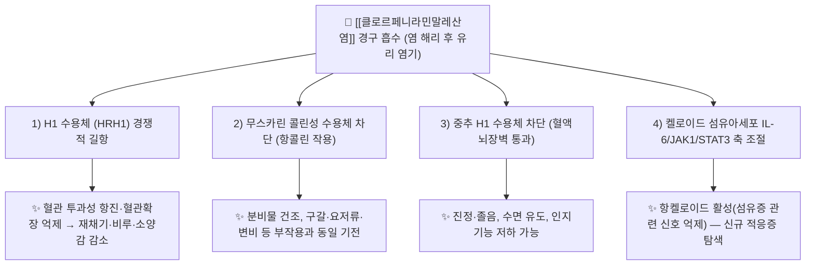

# 🔬 [[클로르페니라민말레산염]] (Chlorpheniramine Maleate, C₁₆H₁₉ClN₂·C₄H₄O₄ / 3-(4-chlorophenyl)-N,N-dimethyl-3-(pyridin-2-yl)propan-1-amine)

![[클로르페니라민말레산염_1_1.jpg|540]]
> [그림 1: ① 병태생리·영상 — (R)-(–)-chlorpheniramine.png]

> **핵심 3줄 요약 (Key Summary)**:
> - 🌿 기원 본초 & 화학 계열: **천연 기원 본초 없음 — 완전 합성 화합물**. 피리딘(pyridine) 고리와 4-클로로페닐기를 골격으로 하는 **알킬아민(alkylamine, propylamine)계 1세대 항히스타민제**이다. 식물 2차 대사산물(알칼로이드·플라보노이드·테르페노이드) 계열이 아니며, 본초 유래 H1 길항 성분(예: 플라보노이드류)과는 화학적으로 별개 물질이다.
> - 🎯 핵심 분자 표적 & 조절 경로: **H1 수용체(HRH1) 경쟁적 길항**이 주 기전이며, [[혈액뇌장벽]] 통과에 따른 중추 H1 차단 → 진정 작용, 무스카린 수용체([[콜린성 수용체]]) 차단 → 항콜린 작용. 켈로이드 섬유아세포에서는 **IL-6/JAK1/STAT3 신호축 조절**을 통해 항켈로이드 활성을 나타낸다는 보고가 있다(PMID: 39879833).
> - 🩺 주요 약리 활성 & 질환 치료 기전: 알레르기 비염([[알레르기 비염]]), 두드러기 등 **제1형 과민반응성 질환**의 대증 치료, 복합감기약 구성 성분, 비강 내 서방형(in situ gel) 국소 전달 연구, 전신마취 후 **각성 초조(emergence agitation)·섬망 예방** 가능성, 그리고 항켈로이드 등 신규 적응증 탐색(PMID: 35652393, 31049842, 39264446, 39879833).
> - ⚠️ 독성·생체이용률 한계 & 상호작용: 1세대 특성상 진정·졸음, 항콜린성 부작용(구갈, 요저류, 변비, 인지기능 저하)이 흔하고 고령자에서 섬망·낙상 위험이 증가한다. 간 CYP450(특히 CYP2D6) 대사 의존성이 커서 [[MAO 억제제]], 삼환계 항우울제, SSRI, 중추신경 억제제와의 병용 시 상가 작용 및 혈중농도 변동 위험이 있다. 복합감기약 중복 복용 시 과량 위험.

---

## 📌 목차
1. [기본 화학 정보 & 분자 구조식 (Chemical Identity)](#1-기본-화학-정보--분자-구조식-chemical-identity)
2. [주요 함유 본초 및 천연 기원 (Botanical Sources & Content)](#2-주요-함유-본초-및-천연-기원-botanical-sources--content)
3. [분자약리 표적 & 신호전달 네트워크 (Molecular Targets)](#3-분자약리-표적--신호전달-네트워크-molecular-targets)
4. [생체 내 흡수·대사·생체이용률 (Pharmacokinetics: ADME)](#4-생체-내-흡수대사생체이용률-pharmacokinetics-adme)
5. [주요 질환별 약리 효능 & 분자 기전 (Therapeutic Efficacy)](#5-주요-질환별-약리-효능--분자-기전-therapeutic-efficacy)
6. [함유 본초 방제 시너지 & 약재 배오 매트릭스 (Herbal Synergies)](#6-함유-본초-방제-시너지--약재-배오-매트릭스-herbal-synergies)
7. [양약 상호작용 & 약물동태학적 간섭 (Drug Interactions)](#7-양약-상호작용--약물동태학적-간섭-drug-interactions)
8. [💡 사용자 진료실 핵심 필기 & 임상 응용 팁 (Melt-In & High-Yield)](#8--사용자-진료실-핵심-필기--임상-응용-팁-melt-in--high-yield)
9. [출처 및 학술 참고 문헌 (References)](#9-출처-및-학술-참고-문헌-references)
---
## 1. 기본 화학 정보 & 분자 구조식 (Chemical Identity)

> 📷 본 노트에는 화학구조식 이미지 파일이 제공되지 않았다(이미지 임베드 없음).

> [!abstract]+ 🧪 3D 약리 분자 구조 (Interactive 3D Viewer)
> <iframe src="https://molecule-viewer-rho.vercel.app/?cid=2725" width="100%" height="450px" frameborder="0" allow="webgl" style="border-radius: 8px;"></iframe>
>
> ※ 위 뷰어의 CID **2725**는 클로르페니라민 **자유 염기(free base)** 기준이다. 말레산염(maleate salt)의 별도 PubChem CID 및 염 형태 3D 좌표는 **근거 미확인**(PubChem에서 직접 재확인 필요).

| 항목 | 상세 내용 |
| :--- | :--- |
| **IUPAC 명칭** | 3-(4-chlorophenyl)-N,N-dimethyl-3-(pyridin-2-yl)propan-1-amine (자유 염기 기준) |
| **분자식 / 분자량** | 자유 염기 C₁₆H₁₉ClN₂ / 274.79 g·mol⁻¹ · 말레산염 C₁₆H₁₉ClN₂·C₄H₄O₄ / 390.86 g·mol⁻¹ |
| **PubChem CID** | [2725](https://pubchem.ncbi.nlm.nih.gov/compound/2725) (클로르페니라민 자유 염기) |
| **CAS 등록 번호** | 클로르페니라민 132-22-9 / 클로르페니라민말레산염 113-92-8 (※ 염·이성질체별 CAS가 별도 존재하므로 처방·조제 시 원료 규격 확인 필요) |
| **화학 골격 분류** | **합성 알킬아민계(propylamine계) 1세대 항히스타민제**. 피리딘 고리 + 4-클로로페닐 치환체 + 3급 아민 측쇄 구조. 천연물 2차 대사산물 계열(이소퀴놀린 알칼로이드, 플라보놀 배당체, 트리테르페노이드 등)에 **해당하지 않음** |
| **물리화학적 성상** | 백색 결정성 분말, 무취~미약한 냄새. 말레산염 형태로 수용성이 크게 증가하여 정제·시럽·주사 등 수성 제형에 적합. 지용성(친지질성)이 비교적 높아 중추신경계로 이행하기 쉬움(혈액뇌장벽 통과). 정확한 용해도 수치·LogP 값은 **근거 미확인**(일반적으로 자유 염기 cLogP ≈ 3 내외로 기재되나 원문 확인 필요). 광선·습도에 대한 안정성 역시 제형별 검증 자료 **근거 미확인** |
| **식물 내 생합성 경로** | **해당 없음(합성 화합물)**. 클로르페니라민은 식물 생합성 캐스케이드 산물이 아니라 산업적 유기합성으로 제조되는 피리딘-알킬아민 유도체이다. 단계별 합성 시약·중간체 정보는 **근거 미확인** |

**구조-활성 상관(Structure–Activity Relationship) 요점**
- **피리딘 고리 + 4-클로로페닐 치환체 조합**이 H1 수용체 친화도에 기여하는 것으로 설명되며, 이는 알킬아민계 항히스타민제에 공통된 골격 특징이다.
- **말레산(maleic acid) 염**은 약리 활성 성분이 아니라 **용해도·안정성·맛을 개선하기 위한 염 형태**로, 체내에서 해리되어 클로르페니라민 양이온이 활성을 나타낸다.
- **3급 아민 측쇄**는 생리적 pH에서 양이온화되어 수용체 결합에 관여하는 동시에 지용성을 부여해 중추 이행(진정 작용)을 가능하게 한다.

---

## 2. 주요 함유 본초 및 천연 기원 (Botanical Sources & Content)

> ⚠️ **본 성분은 천연 기원 본초를 갖지 않는다.** 클로르페니라민말레산염은 **완전 합성 의약품 성분**이므로, "함유 본초 · 기원 식물 · 지표 함량(%)" 항목은 성립하지 않는다. 아래 표는 개념적 대응 관계를 정리한 것이며, 클로르페니라민과 동일 물질이 본초에 함유되어 있다는 서술은 **하지 않는다**.

| 함유 본초 (한글/한자) | 기원 식물학적 명칭 (과명 / 학명) | 주요 함유 약용 부위 | 지표 함량 (%) | 한의학적 귀경 및 약효 특성 |
| :--- | :--- | :--- | :--- | :--- |
| **해당 없음** (합성 화합물) | — | — | — | 클로르페니라민은 식물 유래가 아니며, 한의학 본초 귀경·약성 분류 체계로 설명되지 않는다 |
| 참고: 본초 유래 H1 억제 활성 성분군 | 예) 플라보노이드 계열(케르세틴, 루테올린 등) — **클로르페니라민과는 별개 화합물** | 잎 / 꽃 / 과피 등 | 문헌별 상이, **근거 미확인** | 청열·소종·거풍지양(祛風止癢) 등의 전통 효능과 항알레르기 활성이 문헌적으로 연결되어 논의되나, 작용 강도·기전 비교 자료는 **근거 미확인** |
| 참고: 한의학 항알레르기 처방 맥락 | [[소청룡탕]](小青龍湯), [[형개연교탕]](荊芥連翹湯), [[은교산]](銀翹散) 등 | 복합 전탕 | — | 알레르기 비염·두드러기·감모(感冒) 등 증후군 단위 접근. **클로르페니라민은 이들 처방의 구성 성분이 아니다** |

**정리**
- 클로르페니라민의 "기원"은 **합성 화학 공정**이며, 본초학적 기원·함량 지표는 적용 대상이 아니다.
- 한의학 임상에서 항히스타민제를 병용하는 경우는 "본초가 항히스타민 성분을 함유한다"는 의미가 아니라, **양약 성분을 별개 약리 축으로 병용**하는 것이다. 이 구분을 노트 상에서 반드시 유지한다.

---

## 3. 분자약리 표적 & 신호전달 네트워크 (Molecular Targets)

### 1) 핵심 분자 표적 (Molecular Targets)

* **H1 수용체(HRH1) 경쟁적 길항 — 주 기전**
  * 내인성 [[히스타민]]과 H1 수용체 결합 부위를 두고 경쟁적으로 길항하며, Gq 결합형 H1 수용체 하위의 **포스포리파제 C(PLC) – IP₃/DAG – 세포내 Ca²⁺ 상승** 축을 차단한다.
  * 결과적으로 혈관 내피세포의 **혈관확장·혈장 삼출 억제**, 감각신경 말단의 **소양(pruritus) 신호 감소**, 기관지 평활근 수축 완화가 나타난다.
  * 1세대 약물이므로 수용체 결합이 **가역적·경쟁적**이며, 히스타민 농도가 매우 높은 상황에서는 효과가 상대적으로 약해질 수 있다.
* **무스카린 수용체 차단(항콜린 작용)**
  * H1 수용체에 대한 선택성이 2세대보다 낮아 [[콜린성 수용체]] 차단이 동반되며, 이것이 **구갈·변비·요저류·시력 흐림·인지기능 저하**의 주요 원인이 된다.
* **중추 H1 수용체 차단(진정 작용)**
  * 지용성이 높아 [[혈액뇌장벽]]을 통과, 중추 히스타민성 각성 회로를 억제하여 **졸음·진정**을 유발한다. 2세대 항히스타민제가 중추 이행을 최소화하도록 설계된 것과 대비되는 1세대의 대표적 특징이다.
* **켈로이드 섬유아세포 IL-6/JAK1/STAT3 축 조절 (신규 기전)**
  * Qian & Zhang (2025, PMID: 39879833)은 클로르페니라민말레산염이 **IL-6/JAK1/STAT3 신호전달 경로 조절을 통해 항켈로이드(anti-keloid) 활성**을 나타낸다고 보고하였다. 즉 켈로이드 병태생리의 핵심인 염증성 사이토카인–JAK/STAT 축을 억제하는 방향으로 작용한다는 것이다.
  * 다만 구체적 농도-반응, 사용 세포주, 동물모델 결과의 정량치는 본 노트 작성 범위에서 **근거 미확인**(원문 초록·본문 확인 필요).

### 2) 신호전달 조절 요약

| 표적 축 | 조절 방향 | 하위 결과 | 근거 수준 |
| :--- | :--- | :--- | :--- |
| H1 수용체 (HRH1) | 길항(차단) | 혈관삼출·소양·기관지수축 억제 | 확립된 주 기전(교과서 수준) |
| 무스카린 수용체 | 길항(차단) | 분비 감소 + 항콜린 부작용 | 확립된 주 기전(교과서 수준) |
| 중추 H1 수용체 | 길항(차단) | 진정·졸음 | 확립된 주 기전(교과서 수준) |
| [[IL-6]] / [[JAK1]] / [[STAT3]] | 억제 | 항켈로이드 활성 | PMID: 39879833 (전임상·기전 연구) |
| 비강 국소 전달 최적화 | 제형 개선 | 비점막 체류시간 증가 | PMID 31049842 (제형 연구) |

---

## 4. 생체 내 흡수·대사·생체이용률 (Pharmacokinetics: ADME)

> 아래 항목 중 제공된 참고 논문에서 직접 수치를 확인할 수 없는 값은 **"근거 미확인"**으로 표기하였다. 일반 약리학 교과서 수준의 서술은 그 성격을 명시하였다.

* **장관 흡수 및 배출 펌프(P-gp) 상호작용**
  * 경구 투여 후 위장관에서 신속히 흡수되며(1세대 항히스타민제의 전형적 특성), **말레산염 형태는 용해도가 높아 흡수 속도가 빠르다**. 흡수 후 간을 통과하며 **first-pass 대사**를 받는다.
  * [[P-glycoprotein]](ABCB1) 유출 기질 여부, 장 점막 투과율의 정량값, 생체이용률(%) 수치는 **근거 미확인**. 다만 1세대 항히스타민제군에서 보고되는 생체이용률은 대체로 중간 수준이며, 클로르페니라민의 정확한 값은 원문 확인이 필요하다.
  * **제형 전략**: Kumar & Upadhayay (2019, PMID: 31049842)는 **키토산 기반 나노입자를 담지한 온도감응성 in situ 겔**을 이용해 알레르기 비염에서 클로르페니라민말레산염의 **비강 내 체류시간과 국소 전달 효율을 개선**하려는 시도를 보고하였다. 이는 경구 흡수·전신 부작용 한계를 국소 전달로 우회하려는 전략이다.
* **장내 미생물총(Microbiome) 대사 전환**
  * 클로르페니라민의 장내 세균 대사 경로, 활성/불활성 대사체 전환, 장-간 순환(Enterohepatic Circulation) 관여 여부는 **근거 미확인**. 합성 알킬아민계 약물은 통상 간 CYP 산화가 주 소실 경로이며, 미생물총 기여도는 부차적으로 논의된다.
* **간 대사 및 소실 반감기**
  * 주요 소실 경로는 **간 CYP450 매개 산화대사**이며, 특히 **CYP2D6** 의존성이 큰 것으로 알려져 있다(추가로 CYP3A4 등 관여 가능). CYP2D6 표현형(대사 과속/저속)에 따라 혈중농도와 진정·항콜린 부작용 강도가 달라질 수 있다.
  * 반감기(t₁/₂)는 문헌에 따라 넓게 보고되며, **본 노트에서 확정 수치는 근거 미확인**. 고령자·간기능 저하자에서는 소실이 지연되어 **섬망·낙상 위험이 상승**한다는 임상적 우려가 반복적으로 제기된다.
  * 2상 포합 반응 및 신장 배설 비율의 정량값 역시 **근거 미확인**.
* **중추 이행**
  * 지용성이 높아 뇌로 이행하므로 **항히스타민 효과와 진정 효과가 동시에 나타난다.** 이는 "부작용"이면서 동시에 "수면 유도·각성 억제"라는 임상 활용 포인트가 된다(섬망/각성초조 예방 가설의 근거, PMID: 39264446).

---

## 5. 주요 질환별 약리 효능 & 분자 기전 (Therapeutic Efficacy)

### 1) 알레르기성 질환 (알레르기 비염 · 두드러기 · 소양증)
* **기전**: H1 수용체 길항 → 혈관확장·혈장삼출·감각신경 자극 억제 → **재채기, 비루, 코막힘, 소양감, 두드러기 팽진(wheal) 감소**.
* **제형 연구**: 키토산 나노입자–온도감응성 in situ 겔을 이용한 **비강 국소 전달** 전략이 알레르기 비염 관리 목적으로 연구되었다(PMID: 31049842). 전신 진정 부작용을 줄이면서 비점막 노출을 늘리려는 접근이다.
* **고전 자료**: 1965년 *Med Lett Drugs Ther*에 클로르페니라민말레산염 정제 관련 기술이 등재되어 있어(PMID: 5831352), **최소 1960년대부터 정제 형태로 임상 사용되어 온 장기 사용 약물**임을 확인할 수 있다.
* **복합감기약 성분**: 감기 증상(비루, 재채기, 콧물) 완화 목적으로 **해열진통제·진해거담제·비충혈제거제(슈도에페드린 등)와 복합**되어 광범위하게 사용된다. 이 경우 **성분 중복에 의한 과량 위험**이 핵심 안전 이슈이다.

### 2) 섬유증·켈로이드 (신규 적응증 탐색)
* **기전**: IL-6/JAK1/STAT3 신호축 조절을 통한 **항켈로이드 활성**(PMID: 39879833). 켈로이드는 섬유아세포 과증식·콜라겐 과축적·만성 염증이 얽힌 병태로, JAK/STAT 축은 이 과정의 핵심 연결고리 중 하나다.
* **의의**: "오래된 약물의 재창출(drug repurposing)" 관점에서 주목할 만한 사례이며, Rizvi & Ferrer (2024, PMID: 35652393)의 종합 리뷰도 클로르페니라민의 **새로운 잠재 임상 응용**을 주제로 다룬다.
* **한계**: 임상 적용을 위해서는 국소 제형(연고·주사 등) 설계, 유효 농도, 안전성 자료가 추가로 필요하며, 현재 근거는 **전임상·기전 수준**이다(임상 결과 **근거 미확인**).

### 3) 마취 후 각성 초조·섬망 예방 (중추 H1 차단의 재해석)
* **가설**: 1세대 항히스타민제의 **중추 H1 차단 → 진정·각성 억제** 효과를 수술 후 각성 초조(emergence agitation)나 섬망(delirium) 예방에 활용할 수 있다는 관점.
* **근거**: Kotake & Matsunuma (2024, *Eur J Clin Pharmacol*, PMID: 39264446)는 **1세대 항히스타민제의 각성 초조 또는 섬망 예방 효과에 대한 체계적 고찰**을 보고하였다.
* **주의**: 해당 체계적 고찰에서 클로르페니라민 단독의 효과 크기, 대상 환자군(소아/고령자), 용량·투여 경로 등 세부 수치는 본 노트 작성 범위에서 **근거 미확인**(원문 확인 필요). 또한 항콜린 작용은 오히려 **고령자 섬망을 유발·악화**시킬 수 있다는 상반된 우려가 있어, 임상 적용 시 환자 선별이 필수적이다.

### 4) 기타 만성 염증·면역 조절 관련
* 만성 염증 및 장벽 보호, 대사성 질환에서의 적용 가능성은 **제공 논문에서 확인되지 않음(근거 미확인)**. 본 항목은 클로르페니라민의 확립된 적응증이 아니므로, 해당 방향으로 임상 적용을 서술하지 않는다.

---

## 6. 함유 본초 방제 시너지 & 약재 배오 매트릭스 (Herbal Synergies)

> ⚠️ 클로르페니라민은 본초 성분이 아니므로, 아래 표는 **"본초 방제 내 지표 성분"이 아니라 "한의학 처방·복합제 맥락에서의 병용·배합 관점"**으로 재구성한 것이다.

| 함유 본초 / 방제 | 공존 유효 성분군 | 분자약리 시너지 기전 | 전통 한의학적 효능 연계 |
| :--- | :--- | :--- | :--- |
| **해당 없음** (합성 단일 성분) | — | — | — |
| [[소청룡탕]] 계열(알레르기 비염·천식 응용) | [[마황]](에페드린류), [[오미자]], [[세신]], [[건강]] 등 | 처방 단위의 기관지 확장·항염 작용과 항히스타민 작용의 **증상 축 보완** 관계. 단, 병용 시 **불면·심계항진(마황 계열) + 진정(항히스타민)** 의 상반 작용 고려 필요 | 해표산한, 온폐화음, 지해평천 |
| [[형개연교탕]] 계열(비염·인후 질환) | [[형개]], [[방풍]], [[길경]], [[연교]] 등 | 청열·소종(항염) 축과 H1 차단 축의 **증상 완화 방향 보완**. 정량적 시너지 데이터는 **근거 미확인** | 소풍청열, 해독소종 |
| 복합감기약 배합(양약 복합제) | 아세트아미노펜(해열진통), 슈도에페드린(비충혈제거), 덱스트로메토르판(진해) 등 | **증상별 다표적 동시 제어**. 반면 중추 억제 상가(진정)·항콜린 부담 합산·성분 중복 과량 위험이 동반 | 한의학적 "표증(表證) 해소" 개념과 대응되나, 실제 처방 설계는 양약 약동학 기준 |

**임상 배오 시 핵심 원칙**
1. 본초 전탕액이 클로르페니라민의 흡수율을 높인다는 **직접 근거는 없음(근거 미확인)**. "공존 플라보노이드가 P-gp를 억제해 흡수를 늘린다"는 식의 서술은 클로르페니라민에 대해서는 확립되지 않았다.
2. 한의 처방과 병용 시 실질적 위험은 **작용 상가(加法)** 쪽이다: 진정 작용 중복(졸음, 인지 저하), 항콜린 부담 중복(구갈·변비·요저류), 그리고 마황 계열 각성 성분과의 **방향성 상충**.
3. 복합감기약을 이미 복용 중인 환자에게 한약을 추가 처방할 때는 **클로르페니라민 총 용량 중복**을 반드시 확인한다.

---

## 7. 양약 상호작용 & 약물동태학적 간섭 (Drug Interactions)

* **CYP450 효소 간섭 (CYP2D6 중심)**
  * 클로르페니라민은 **CYP2D6 기질**로 알려져 있어, CYP2D6 억제제(예: 파록세틴, 플루옥세틴, 터비나핀, 퀴니딘 등)와 병용 시 **혈중농도 상승 → 진정·항콜린 부작용 강화** 가능성이 있다.
  * 반대로 CYP2D6 유도제 병용 시 효과 감소 가능. **개별 약물별 정량적 상호작용 강도는 근거 미확인**(원문·임상약리 DB 확인 필요).
* **중추신경 억제 상가 작용**
  * 알코올, [[벤조디아제핀]]계, 졸피뎀, 아편유사제, 전신마취제, 일부 항정신병약과 병용 시 **진정·호흡억제·인지기능 저하가 상가적으로 증가**한다. 운전·기계조작 금지 안내가 필수적이다.
* **MAO 억제제(MAOI)**
  * 1세대 항히스타민제는 MAO 억제제와 병용 시 **항콜린 작용 및 중추 억제의 상가** 우려가 있어 일반적으로 병용을 피한다(전통적 주의사항).
* **항콜린 부담 합산(Anticholinergic Burden)**
  * 삼환계 항우울제, 항파킨슨제(벤즈트로핀), 요실금 치료제(옥시부티닌 등), 항정신병약, 1세대 항히스타민제(디펜히드라민 등)와 병용 시 **구갈·변비·요저류·인지기능 저하·섬망 위험이 합산**된다. 고령자에서 특히 문제가 된다.
* **유사 기전 양약 병용 시 고려사항**
  * 다른 1세대/2세대 항히스타민제와의 중복은 효과 상가보다 **부작용 상가**가 두드러지므로 피한다.
  * 복합감기약·수면유도제·멀미약에 클로르페니라민이 **중복 함유**되어 있는 경우가 많아, 총 일일 용량 확인이 필요하다.
  * **복용 간격 조정(예: 2시간 이상)** 이 필요한지 여부는 상호작용 기전(흡착·킬레이트 vs 대사)에 따라 다르며, 클로르페니라민의 경우 대부분 **대사·약력학적 상호작용**이어서 단순 시간 분리로 회피되지 않는다. **근거 미확인** 항목은 원문 확인 후 보완.

---

## 8. 💡 사용자 진료실 핵심 필기 & 임상 응용 팁 (Melt-In & High-Yield)

* **사용자 원문 필기**: 본 노트 작성 시점에 전달된 별도 수기 필기는 없음(해당 항목 공란). 추후 진료실 필기 원문이 확보되면 본 항목에 100% 그대로 이관한다.
* **진료실 실전 처방 & 안전성 극대화 팁**:
  1. **"1세대 = 진정 + 항콜린"을 한 세트로 기억**: 효과와 부작용이 같은 기전(중추 H1 차단, 무스카린 차단)에서 나온다. 낮에 진정이 문제되면 야간 복용으로 전환하거나 2세대(로라타딘·세티리진 등)로 교체를 고려한다.
  2. **고령자 처방 시 최우선 점검**: 항콜린 부담 누적 → **섬망·낙상·요저류** 위험. 배뇨장애(전립선비대), 녹내장(폐쇄각), 치매·인지저하 환자에서는 신중하거나 회피한다. 반대로 마취 후 각성 초조·섬망 예방 목적의 1세대 항히스타민제 사용 가능성이 체계적 고찰로 검토되고 있으므로(PMID: 39264446), **"고령자 각성 조절" 목적인지 "알레르기 조절" 목적인지에 따라 판단이 갈린다**.
  3. **복합감기약 중복 확인 루틴**: 환자가 감기약·수면유도제·멀미약을 함께 복용하면 클로르페니라민 총량이 쉽게 초과된다. 처방 전 **복용 중인 일반약 목록을 반드시 청취**한다.
  4. **소아·임부**: 소아는 연령별 용량 기준 확인이 필수이며, 임부·수유부는 의사 상담 없이 사용하지 않도록 안내한다(구체적 용량 기준은 제품 허가사항 확인, **근거 미확인**).
  5. **신규 적응증에 대한 균형 잡힌 태도**: 항켈로이드(PMID: 39879833)와 비강 in situ 겔(PMID: 31049842)은 **연구 단계**이며, 종합 리뷰(PMID: 35652393)가 "오래된 약의 새로운 가능성"을 정리한 수준이다. 진료실에서 즉시 표준 치료로 적용하지 않고 **근거 축적을 지켜보는 항목**으로 분류한다.
  6. **환자 교육 문구**: "졸릴 수 있으니 운전·기계조작을 피하세요", "입이 마르고 소변이 시원하지 않으면 알려주세요", "다른 감기약과 겹치면 안 됩니다" — 3문장을 기본으로 안내한다.

---

## 9. 출처 및 학술 참고 문헌 (References)

1. **Rizvi SAA, Ferrer G (2024)**. *Chlorpheniramine, an Old Drug with New Potential Clinical Applications: A Comprehensive Review of the Literature*. **Curr Rev Clin Exp Pharmacol**. PMID: 35652393
   - **[연구 요약]**: 클로르페니라민의 기존 적응증(알레르기성 질환)을 정리하는 동시에, 오래된 약물이 가진 **새로운 잠재 임상 응용 가능성**을 종합 검토한 리뷰. 본 노트에서는 "항켈로이드·섬망 예방 등 신규 적응증 탐색의 맥락을 제공하는 총설"로 인용하였다. ※ 인용 정보상 표기 연도(2024)와 PMID 발행 시점 간 불일치 가능성이 있어 **원문 서지 확인 필요**.
2. **(1965)**. *Chlorpheniramine maleate tablets*. **Med Lett Drugs Ther**. PMID: 5831352
   - **[연구 요약]**: 클로르페니라민말레산염 **정제 제형**에 관한 1960년대 고전 기술 자료. 해당 성분이 최소 반세기 이상 정제 형태로 임상 사용되어 온 배경을 뒷받침한다. 초록 수준의 정량 정보(용량·비교약물)는 **근거 미확인**.
3. **Qian H, Zhang L (2025)**. *Chlorpheniramine maleate exerts an anti-keloid activity by regulation of IL-6/JAK1/STAT3 signaling pathway*. **Int Immunopharmacol**. PMID: 39879833
   - **[연구 요약]**: 클로르페니라민말레산염이 **IL-6/JAK1/STAT3 신호전달 경로를 조절**하여 **항켈로이드(anti-keloid) 활성**을 나타냄을 보고한 기전 연구. 켈로이드 섬유증에서 JAK/STAT 축 억제라는 신규 작용 기전을 제시한다.
4. **Kumar M, Upadhayay P (2019)**. *Chlorpheniramine maleate containing chitosan-based nanoparticle-loaded thermosensitive in situ gel for management in allergic rhinitis*. **Drug Deliv Transl Res**. PMID: 31049842
   - **[연구 요약]**: **키토산 기반 나노입자**를 담지한 **온도감응성 in situ 겔** 제형을 설계하여 알레르기 비염에서 클로르페니라민말레산염의 **비강 국소 전달**을 최적화하려 한 제형·전달 연구. 경구 전신 투여의 부작용·흡수 한계를 우회하려는 전략을 제시한다.
5. **Rizvi SAA, Ferrer G (2024)**. *Chlorpheniramine, an Old Drug with New Potential Clinical Applications: A Comprehensive Review of the Literature*. **Curr Rev Clin Exp Pharmacol**. PMID: 35652393
   - **[연구 요약]**: 문헌 1과 **동일 논문의 중복 등재**. 별도 내용 없음(중복 표기 정리 필요).
6. **Kotake K, Matsunuma S (2024)**. *Preventive effects of first-generation antihistamine on emergence agitation or delirium: a systematic review*. **Eur J Clin Pharmacol**. PMID: 39264446
   - **[연구 요약]**: **1세대 항히스타민제**가 마취 후 **각성 초조(emergence agitation) 또는 섬망(delirium)** 예방에 미치는 효과를 다룬 **체계적 고찰**. 클로르페니라민의 중추 H1 차단(진정) 작용을 예방적 목적으로 활용할 수 있는지에 대한 근거 축을 제공한다. 대상 약물별 세부 효과 크기·용량은 **근거 미확인**(원문 확인 필요).

---

### 🔗 관련 노트
- [[제1형 과민반응]] · [[히스타민]] · [[H1 수용체]]
- [[1세대 항히스타민제]] · [[2세대 항히스타민제]] · [[디펜히드라민]] · [[독실아민]]
- [[알레르기 비염]] · [[두드러기]] · [[아토피]]
- [[혈액뇌장벽]] · [[콜린성 수용체]] · [[항콜린 부담]]
- [[CYP2D6]] · [[P-glycoprotein]] · [[약물상호작용]]
- [[켈로이드]] · [[IL-6]] · [[JAK1]] · [[STAT3]]
- [[복합감기약]] · [[소청룡탕]] · [[형개연교탕]] · [[은교산]]

<!-- 보관 태그(1회용·링크오류, 필요시 복원): 1세대 항히스타민제, H1 수용체 길항제, 복합감기약 성분 -->
