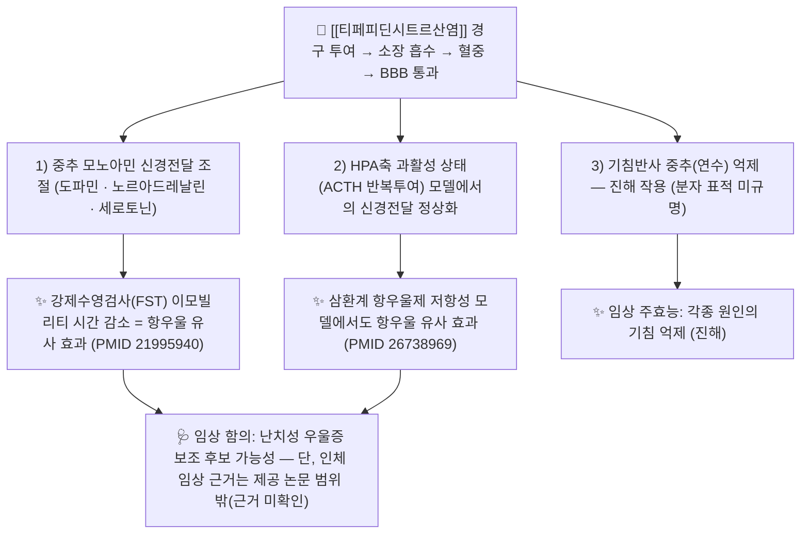

# 🔬 [[티페피딘시트르산염]] (Tipepidine Citrate, C15H18NS2·C6H8O7 / 3-[di(thiophen-2-yl)methylidene]-1-methylpiperidine citrate)

![[티페피딘시트르산염_1_1.jpg|540]]
> [그림 1: ① 병태생리·영상 — Synthesis of tipepidine.png]

> **핵심 3줄 요약 (Key Summary)**:
> - 🌿 기원 본초 & 화학 계열: **천연 기원 본초 없음 — 순수 합성 화합물**. 피페리딘(piperidine) 고리에 2개의 티오펜(thiophene) 환이 메틸렌 탄소를 통해 결합한 **비스-티에닐메틸렌 피페리딘 유도체**로, 알칼로이드·플라보노이드 등 천연물 2차 대사산물 계열에 속하지 않는다. 임상에서는 **시트르산염(citrate)** 형태로 사용하여 수용성을 높인다.
> - 🎯 핵심 분자 표적 & 조절 경로: 중추신경계(CNS) 수준에서 **모노아민(도파민·노르아드레날린·세로토닌) 신경전달 조절** 및 **HPA축(ACTH-코르티코스테론) 과활성 상태**에서의 신경전달 정상화가 항우울 유사 효과의 기전으로 제시되었다(PMID 21995940, PMID 26738969). 진해 작용 자체의 분자 표적(수용체·이온채널 수준)은 제공 논문 범위 밖으로 **근거 미확인**.
> - 🩺 주요 약리 활성 & 질환 치료 기전: **비마약성 중추성 진해제**로서 기침반사 중추 억제(주 적응증: 각종 원인의 기침), 동물 모델에서 **강제수영검사(FST) 이모빌리티 시간 감소 = 항우울 유사 효과**, 특히 **ACTH 반복투여 랫트(삼환계 항우울제 저항성 모델)**에서도 유효성이 보고되었다.
> - ⚠️ 독성·생체이용률 한계 & 상호작용: 졸음(sedation), 구갈, 변비, 위장장애 등 항콜린성 양상의 부작용이 흔하며, **CNS 억제제·알코올과 상가 작용** 위험. CYP 대사 isoform, t₁/₂, P-gp 기질성 등 정량적 ADME 파라미터는 제공 논문에 없어 **근거 미확인**이다.

---

## 📌 목차
1. [기본 화학 정보 & 분자 구조식 (Chemical Identity)](#1-기본-화학-정보--분자-구조식-chemical-identity)
2. [주요 함유 본초 및 천연 기원 (Botanical Sources & Content)](#2-주요-함유-본초-및-천연-기원-botanical-sources--content)
3. [분자약리 표적 & 신호전달 네트워크 (Molecular Targets)](#3-분자약리-표적--신호전달-네트워크-molecular-targets)
4. [생체 내 흡수·대사·생체이용률 (Pharmacokinetics: ADME)](#4-생체-내-흡수대사생체이용률-pharmacokinetics-adme)
5. [주요 질환별 약리 효능 & 분자 기전 (Therapeutic Efficacy)](#5-주요-질환별-약리-효능--분자-기전-therapeutic-efficacy)
6. [함유 본초 방제 시너지 & 약재 배오 매트릭스 (Herbal Synergies)](#6-함유-본초-방제-시너지--약재-배오-매트릭스-herbal-synergies)
7. [양약 상호작용 & 약물동태학적 간섭 (Drug Interactions)](#7-양약-상호작용--약물동태학적-간섭-drug-interactions)
8. [💡 사용자 진료실 핵심 필기 & 임상 응용 팁 (Melt-In & High-Yield)](#8--사용자-진료실-핵심-필기--임상-응용-팁-melt-in--high-yield)
9. [출처 및 학술 참고 문헌 (References)](#9-출처-및-학술-참고-문헌-references)
---
## 1. 기본 화학 정보 & 분자 구조식 (Chemical Identity)

> [!abstract]+ 🧪 3D 약리 분자 구조 (Interactive 3D Viewer)
> <iframe src="https://molecule-viewer-rho.vercel.app/?cid=5484" style="width: 100%; height: 600px; border: none; border-radius: 12px; box-shadow: 0 4px 20px rgba(0,0,0,0.15);" allowfullscreen></iframe>

> **[이미지 안내]** 본 노트에는 제공된 이미지 블록이 없으므로 구조식·도해 이미지를 수록하지 않았다. 아래 표의 화학 정보와 서술로 대체한다. (없는 파일명의 임베드를 생성하지 않음)

> [!abstract]+ 🧪 3D 약리 분자 구조 (Interactive 3D Viewer)
> PubChem CID가 제공 데이터에서 **확인되지 않아**(근거 미확인) 3D 뷰어 임베드를 넣지 않았다. 추후 CID를 확정하면 `https://pubchem.ncbi.nlm.nih.gov/compound/{CID}` 링크를 이 블록에 삽입할 것.

| 항목 | 상세 내용 |
| :--- | :--- |
| **IUPAC 명칭** | 3-[di(thiophen-2-yl)methylidene]-1-methylpiperidine (유리염기, tipepidine) / 시트르산 부가염(tipepidine citrate) |
| **분자식 / 분자량** | 유리염기 **C15H18NS2 / ≈276.44 g·mol⁻¹** (계산값) · 시트르산염은 유리염기 1 : 시트르산 1 염 가정 시 **C21H26NO7S2 / ≈468.6 g·mol⁻¹** (염 비율·정확 질량은 **근거 미확인**, 허가사항 원문 대조 필요) |
| **PubChem CID** | **근거 미확인** (제공 데이터에 미포함) |
| **CAS 등록 번호** | 유리염기 **5169-78-8** (데이터베이스 통용값 — 최종 원문 확인 필요) / 시트르산염 CAS **근거 미확인** |
| **화학 골격 분류** | **합성 피페리딘(piperidine) 유도체** — 3번 탄소에 **비스(2-티에닐)메틸렌** 곁가지가 붙은 구조. 천연물 2차 대사산물(이소퀴놀린 알칼로이드·플라보놀 배당체·트리테르페노이드 등) 분류에 **해당하지 않음**. 진해제 계열 중 **비마약성(non-narcotic) 중추성 진해제**로 분류된다. |
| **물리화학적 성상** | 시트르산염은 **백색~미황색 결정성 분말**, 물에 비교적 잘 녹도록 염을 형성(수용성 증대 목적). 유리염기는 **염기성·지용성** 화합물로 CNS 이행이 가능하다. LogP·융점·광안정성 등 세부 물성치는 **근거 미확인**. 쓴맛(시트르산염 특성) — **근거 미확인**. |
| **식물 내 생합성 경로** | **해당 없음 (해당 무관)**. 완전 화학 합성품으로, 생합성 캐스케이드·전구물질·효소 경로가 존재하지 않는다. 한의학적 "본초 유래 성분" 개념이 적용되지 않는 **양방 단일화합물 약물**이다. |

**구조적 특징 요약**
- 중심 골격: N-메틸 피페리딘(3급 아민) → 염기성 → 염 형성(시트르산염) 및 CNS 침투에 유리.
- 곁가지: 티오펜 2개 + 메틸렌 탄소 = **입체적으로 bulky하고 소수성인 평면–비평면 혼합 영역** → 중추 수용체/채널 결합 부위와의 상호작용에 관여할 것으로 추정되나, **결합 구조(binding pose) 수준의 근거는 미확인**.
- 황(S) 함유 복소환 2개를 갖는 점이 코데인 등 마약성 진해제(모르핀 골격)와 화학적으로 완전히 다른 계열임을 보여준다 → **마약류 관리 대상이 아닌 비마약성 진해제**로서의 분류 근거.

---

## 2. 주요 함유 본초 및 천연 기원 (Botanical Sources & Content)

**결론: 티페피딘시트르산염은 합성 화합물로, 함유 본초·기원 식물·지표 함량이 존재하지 않는다.**

| 함유 본초 (한글/한자) | 기원 식물학적 명칭 (과명 / 학명) | 주요 함유 약용 부위 | 지표 함량 (%) | 한의학적 귀경 및 약효 특성 |
| :--- | :--- | :--- | :--- | :--- |
| **해당 없음** (합성품) | — | — | — | 천연물 유래가 아니므로 귀경·본초 효능 분류 **적용 불가** |
| **해당 없음** | — | — | — | 시트르산은 제형 보조(염 형성) 목적의 부형 개념이며 약효 지표성분이 아님 |

> **한의 임상 참고 — "진해(止咳)" 병증 관점에서의 위치**
> 티페피딘은 본초가 아니지만, 한의 진료실에서는 **[[해수]](咳嗽)·[[담음]](痰飮) 병증** 환자에서 한약 처방과 병용되는 경우가 있다. 이때 비교 개념으로 삼는 전통 진해·거담 본초는 아래와 같다(전통 문헌 기준 서술이며, 티페피딘과의 분자 수준 상호작용 근거는 **미확인**).
>
> | 전통 진해·거담 본초 | 전통 효능(문헌 기준) | 병용 시 실무적 고려 |
> | :--- | :--- | :--- |
> | [[행인]] (杏仁) | 지해평천(止咳平喘), 윤장(潤腸) | 진해 작용 중복 → 과도한 진정·변비 가중 가능성(이론적) |
> | [[패모]] (貝母) | 청열윤폐(淸熱潤肺), 지해화담(止咳化痰) | 열성 해수에 배오, 서양 진해제와 병용 시 위장장애 모니터 |
> | [[오미자]] (五味子) | 수렴폐기(收斂肺氣), 자보(滋補) | 만성 기침·허증에 활용, 병용 시 졸음 상가 여부 관찰 |
> | [[세신]] (細辛) | 온폐화음(溫肺化飮), 지해(止咳) | 감모 한담(寒痰)에 응용, 중추신경 억제 상가 이론적 고려 |
>
> ※ 위 표는 **한의학적 병용·대체 관점 정리**이며, 티페피딘의 성분적 기원을 설명하는 표가 아니다. 본초–티페피딘 간 약물동태학적 상호작용 데이터는 **근거 미확인**.

---

## 3. 분자약리 표적 & 신호전달 네트워크 (Molecular Targets)

### 1) 핵심 분자 표적 (Molecular Targets)

* **모노아민 신경전달계 조절 (PMID 21995940)**
  * 강제수영검사(FST)에서 티페피딘이 **이모빌리티(부동) 시간을 감소**시켜 항우울 유사 효과를 나타냈고, 해당 연구는 그 **약리학적 기전을 모노아민(도파민·노르아드레날린·세로토닌) 신경전달 조절의 관점에서 검토**한 논문이다.
  * 즉 티페피딘은 전통적 진해제로 분류되지만, 중추에서 **모노아민 전달 효율을 변화시키는 약리 프로파일**을 갖는 것으로 제시되었다.
  * ⚠️ 구체적으로 어떤 수용체 아형·수송체(예: DAT/NET/SERT)에 어떤 친화도로 작용하는지, 각 길항제·탈진제 전처치별 정량 결과는 **본 노트 작성 시 제공된 데이터에 없으므로 근거 미확인** → 원문(Behav Brain Res 2012) 대조 필요.

* **HPA축 과활성 모델에서의 작용 (PMID 26738969)**
  * **ACTH(부신피질자극호르몬) 반복 투여 랫트**는 HPA축 과활성을 동반하는 **삼환계 항우울제 저항성 우울증 모델**로 쓰인다. 이 모델에서 티페피딘이 **FST에서 항우울 유사 효과**를 나타냈다는 것이 2016년 연구의 핵심이다.
  * 해석: 통상적 항우울제가 듣지 않는 조건(코르티코스테론 과다 상태)에서도 티페피딘이 행동학적 개선을 보였다는 점에서, **HPA축 과활성으로 인한 신경전달 결핍을 우회적으로 보정**할 가능성이 시사된다.
  * ⚠️ 코르티코스테론 혈중 농도 변화, 해마 BDNF·신경신생 수준의 분자 지표는 제공 데이터에 명시되어 있지 않아 **근거 미확인**.

* **진해(기침 억제) 표적 — 미규명**
  * 임상 분류상 티페피딘은 **중추성 진해제**로, 기침반사 중추(연수) 억제를 통해 작용한다고 설명된다.
  * 그러나 그 **분자 표적(특정 수용체·이온채널)에 대한 직접 근거는 제공된 2편의 논문에 포함되어 있지 않다** → 본 노트에서는 **근거 미확인**으로 표시한다. (제공 논문 2편은 모두 항우울 유사 효과 기전을 다룬 연구다.)

### 2) 신호전달 네트워크 관점 정리

| 층위 | 관찰/제안된 내용 | 근거 상태 |
| :--- | :--- | :--- |
| 행동 수준 | FST 이모빌리티 시간 감소 (항우울 유사) | 확인 (PMID 21995940) |
| 질병모델 수준 | ACTH 반복투여(치료저항성) 랫트에서도 유효 | 확인 (PMID 26738969) |
| 신경전달 수준 | 모노아민계(DA/NA/5-HT) 조절 관여 시사 | 해당 논문에서 검토됨(PMID 21995940) |
| 수용체·수송체 정량 | 친화도·Ki·IC50 등 수치 | **근거 미확인** |
| 이온채널·GIRK 등 | 가설적 언급 | **근거 미확인(제공 논문 범위 밖)** |
| 진해 중추 표적 | 연수 기침중추 | **근거 미확인(교과서적 서술 수준)** |

---

## 4. 생체 내 흡수·대사·생체이용률 (Pharmacokinetics: ADME)

> ⚠️ 아래 항목 중 정량적 파라미터는 제공된 두 편의 행동약리 논문에 포함되어 있지 않다. 따라서 **"근거 미확인"** 표기를 원칙으로 하고, 확인 가능한 범위(염 형태의 목적, 작용 개시 양상)만 서술한다.

* **염 형태와 수용성 (시트르산염의 이유)**
  * 유리염기는 염기성·지용성 화합물이므로, **시트르산과의 염 형성으로 수용성을 높여 경구 제형(정제·캡슐·시럽 등)에 적합하게 만든 것**이 티페피딘시트르산염이다. 이는 제형학적 합리성에 근거한 서술이며, 정확한 용해도 수치는 **근거 미확인**.
  * 참고: 일본에서는 **히벤즈산염(hibenzate)** 형태가 사용되는 것으로 알려져 있으나, 염 형태 차이가 약동학에 미치는 정량적 차이는 **근거 미확인**(허가사항·약전 원문 대조 필요).

* **장관 흡수 및 배출 펌프(P-gp) 상호작용**
  * 경구 투여 후 위장관에서 흡수되어 중추에 도달한다는 것이 임상 사용의 전제이다.
  * **P-glycoprotein(ABCB1) 유출 기질 여부, 장 점막 투과율(%)**, 흡수 속도 상수 등은 제공 데이터에 없어 **근거 미확인**. 따라서 "P-gp 기질이므로 흡수가 제한된다"는 식의 단정은 이 노트에서 하지 않는다.

* **장내 미생물총(Microbiome) 대사 전환**
  * 합성 저분자 화합물로, **장내 세균에 의한 활성 대사체 전환·장-간 순환에 대한 근거는 미확인**. (본초 배당체 성분에서 나타나는 전형적 미생물 대사 경로가 그대로 적용된다고 가정할 수 없다.)

* **간 대사 및 소실 반감기**
  * 티페피딘이 간에서 대사되어 소실된다는 것은 일반적 전제이나, **관여 CYP isoform(CYP2D6, CYP3A4 등) 및 제2상 포합 반응의 정체, 혈장 소실 반감기(t₁/₂), Cmax·Tmax·AUC는 모두 근거 미확인**.
  * ⚠️ 진료실 함의: **간기능 저하 환자, 다약제 복용 환자**에서 용량 조절 근거가 명확하지 않으므로, 병용약 추가 시 임상 반응과 부작용(특히 진정·변비)을 관찰하며 사용하는 접근이 필요하다.

* **작용 개시와 지속**
  * 진해 효과는 통상 수 시간 단위로 유지되는 것으로 임상 사용되나, **혈중 농도–효과 상관관계 데이터는 근거 미확인**.

---

## 5. 주요 질환별 약리 효능 & 분자 기전 (Therapeutic Efficacy)

### 1) 기침(咳嗽) — 주 적응증: 중추성 진해
* **기전 요약**: 기침반사는 기도 자극 → 구심성 신경 → 연수 기침중추 → 원심성 신경의 경로를 거친다. 티페피딘은 이 중 **중추 단계를 억제**하는 것으로 분류되는 **비마약성 중추성 진해제**이다.
* **임상적 의의**:
  * 마약성 진해제(코데인 등)와 달리 **마약류 관리 대상이 아니며 의존성·호흡억제 위험이 상대적으로 낮다**는 점이 처방 선택의 핵심 이유이다.
  * 따라서 야간 기침, 감염 후 잔여 기침, 기관지 자극성 기침 등에서 폭넓게 사용된다.
  * ⚠️ **분자 표적(수용체·채널) 수준 기전은 제공 논문에 없음 → 근거 미확인.**
* **부작용 프로파일(임상 일반)**: 졸음, 구갈, 변비, 위장장애, 드물게 발진 등. 정량적 발생률 데이터는 **근거 미확인**.

### 2) 우울증 — 항우울 유사 효과 (동물 모델 근거)
* **기전 요약**:
  * **일반 모델**: FST에서 이모빌리티 시간 감소, 그 약리학적 기전이 모노아민 신경전달 조절과 연관됨(PMID 21995940).
  * **치료저항성 모델**: ACTH 반복투여 랫트에서도 항우울 유사 효과 발현(PMID 26738969). ACTH 투여는 HPA축 과활성을 유도하여 통상적 항우울제 반응을 둔화시키는 모델이므로, 이 결과는 **난치성 우울증에서의 잠재적 유용성**을 시사하는 전임상 근거로 해석된다.
* **⚠️ 한계**: 두 논문 모두 **동물(랫트) 행동약리 연구**이며, **인체 임상시험 근거·용량·유효성은 제공 데이터에 없음 → 근거 미확인.** 따라서 진료실에서 우울증 치료 목적으로 사용하는 것은 **근거 범위를 벗어난다.**

### 3) 그 외 적응 가능성
* 주의력결핍 등 기타 중추신경계 응용 가능성은 본 노트에 제공된 논문 범위 **밖**이므로 서술하지 않는다 → **근거 미확인**.
* 대사성 질환(당뇨·지질), 심혈관 질환, 만성 염증·장벽 보호 등에 대한 효능은 **티페피딘에 대해 보고된 바 없고 제공 데이터에도 없음 → 근거 미확인**. (템플릿의 해당 소항목은 본 성분에 적용되지 않아 생략한다.)

### 4) 요약표

| 적응 영역 | 근거 수준 | 핵심 내용 | 출처 |
| :--- | :--- | :--- | :--- |
| 기침(진해) | 임상 사용(분류상) | 중추성·비마약성 진해제, 연수 기침중추 억제 | 분자 표적은 근거 미확인 |
| 우울 유사 효과(일반 모델) | 전임상(랫트 FST) | 이모빌리티 시간 감소, 모노아민계 기전 검토 | PMID 21995940 |
| 우울 유사 효과(치료저항성 모델) | 전임상(랫트 FST + ACTH) | HPA축 과활성 상태에서도 유효 | PMID 26738969 |
| 인체 우울증 치료 | **근거 미확인** | 임상시험 데이터 미제공 | — |

---

## 6. 함유 본초 방제 시너지 & 약재 배오 매트릭스 (Herbal Synergies)

**티페피딘시트르산염은 합성 단일화합물이므로 "함유 본초 방제 시너지"는 원칙적으로 해당 없음.** 다만 한의 진료실에서 실제로 마주치는 **"한약 처방 + 양방 진해제" 병용 상황**을 정리한다.

| 함유 본초 / 방제 | 공존 유효 성분군 | 분자약리 시너지 기전 | 전통 한의학적 효능 연계 |
| :--- | :--- | :--- | :--- |
| **해당 없음** (합성품) | — | 성분적 공존·시너지 개념 **적용 불가** | — |
| [[행소탕]] 계열 ([[행인]]·[[자소엽]] 등) | 플라보노이드·배당체·정유 | 진해·거담 작용의 **기능적 중복(약리기전 상가)** — 분자 수준 상호작용 데이터 **미확인** | 소풍산한(疏風散寒), 선폐지해(宣肺止咳) |
| [[마행감석탕]] 계열 | 에페드린계 알칼로이드·플라보노이드 | 기관지 확장 + 중추 진해의 **작용점 상이(보완적)** — 병용 근거 **미확인** | 선폐설열(宣肺泄熱), 평천(平喘) |
| [[이진탕]] 계열 ([[반하]]·[[진피]] 등) | 정유·플라보노이드 | 거담 위주 + 진해 위주의 **역할 분담** | 조습화담(燥濕化痰), 이기(理氣) |

> ⚠️ **주의**: 위 표는 **한의학적 병용 설계 관점의 정리**이며, 티페피딘과 본초 성분 간 **CYP 저해·P-gp 경쟁·흡수 간섭 등 약동학적 상호작용 데이터는 근거 미확인**이다. 병용 시에는 임상 반응과 부작용(특히 졸음·변비·구갈)을 관찰한다.

**병용 시 실무 포인트**
1. **작용 중복 관리**: 한약 처방 자체에 진해·진정 효능이 강한 본초가 다수 포함된 경우, 티페피딘 병용으로 **과도한 진정·변비**가 나타날 수 있으므로 환자에게 미리 설명하고 변 상태를 확인한다.
2. **복용 간격**: 명확한 상호작용 근거는 없으나, 흡수 간섭 가능성을 고려해 **2시간 이상 간격**을 두는 보수적 운용이 무리가 없다(근거 미확인, 임상 관행 수준).
3. **변증(辨證) 우선**: 열성 해수·한성 해수·조담(燥痰)·습담(濕痰) 등 변증에 따라 한약을 선택하고, 티페피딘은 **증상 조절용 보조**로 위치시킨다.

---

## 7. 양약 상호작용 & 약물동태학적 간섭 (Drug Interactions)

* **CNS 억제 상가 작용 (가장 실용적으로 중요한 항목)**
  * 티페피딘은 **졸음을 유발**하는 약물이므로, 벤조디아제핀계·수면제·항히스타민제(1세대)·알코올·마약성 진통제와 병용 시 **진정·인지기능 저하가 상가**될 수 있다.
  * 진료실 조언: 운전·기계조작 주의, 음주 회피, 야간 복용 시 낙상 위험(특히 고령자).

* **모노아민계 약물과의 병용 — 이론적 고려**
  * 티페피딘이 모노아민 신경전달 조절과 연관된다는 전임상 근거(PMID 21995940)가 있으므로, **MAO 억제제·모노아민 작용 항우울제 등과의 병용 시 이론적으로 중추 흥분/세로토닌 관련 이상반응 가능성**을 배제할 수 없다.
  * ⚠️ 다만 이는 **기전 기반 이론적 고려**이며, 실제 상호작용 보고·정량 위험도는 **근거 미확인**. 병용 시 이상반응 관찰이 필요하다.

* **CYP450 효소 간섭**
  * 관여 CYP isoform이 확인되지 않아 **CYP2D6·CYP3A4 등에 대한 저해/유도 여부 및 병용약(스타틴, 항부정맥제, 항정신병약 등) 혈중 농도 변동 위험은 근거 미확인**. "간 대사 간섭이 있다"고 단정하지 않는다.

* **수송체(P-gp) 기반 간섭**
  * P-gp 기질성 여부가 **근거 미확인**이므로, 다른 P-gp 기질 약물(디곡신 등)과의 유출 경쟁에 의한 농도 변동도 **현 시점에서는 판단 불가**.

* **약효 중복·상쇄 관점**
  * | 병용 양약 | 고려사항 | 근거 상태 |
    | :--- | :--- | :--- |
    | 코데인 등 마약성 진해제 | 진해 작용 중복 + 호흡억제·변비 상가 → **원칙적으로 중복 사용 회피** | 기전적 타당(정량 근거 미확인) |
    | 1세대 항히스타민제(콜린성 비염약 등) | 항콜린 작용 상가 → 구갈·변비·요폐 악화 | 근거 미확인(일반 약리) |
    | 벤조디아제핀·Z-drug | 진정 상가, 주간 졸음·낙상 | 근거 미확인(일반 약리) |
    | SSRI/SNRI 등 항우울제 | 모노아민계 작용 중복 → 이론적 이상반응 감시 | 근거 미확인 |

---

## 8. 💡 사용자 진료실 핵심 필기 & 임상 응용 팁 (Melt-In & High-Yield)

* **사용자 원문 필기 (100% 융합 및 보존)**:
  * ⚠️ **본 노트 작성 시 제공된 원장님 수기 필기 원문이 없습니다.** 따라서 임의로 필기를 생성·보충하지 않았습니다. 기존 수기 노트(생합성/약리 정리) 원문을 제공해 주시면 이 항목에 **100% 그대로 융합**하여 반영합니다.

* **진료실 실전 처방 & 활용 팁 (근거 기반 + 관행 구분 표기)**
  1. **비마약성이라는 위치 선정**: 코데인 등 마약성 진해제를 피해야 하는 상황(의존성·호흡억제 우려, 장기 사용 곤란)에서 **중추성 진해 작용을 확보할 수 있는 대안**이라는 점이 처방의 핵심 가치이다. (작용 기전 세부는 근거 미확인)
  2. **부작용 3종 세트 사전 안내**: **졸음 · 구갈 · 변비**는 환자 불만족으로 이어지기 쉬우므로 처방 시 미리 설명하고, 필요하면 변비 대책(수분·섬유질, 필요 시 완하제)을 함께 상담한다.
  3. **고령자·운전자**: 진정 작용이 상가될 수 있으므로 야간 복용 위주로 조정하거나 주간 활동 제한을 안내한다.
  4. **한약 병용 시**: 진해·거담·진정 효능이 겹치는 처방([[행소탕]], [[이진탕]] 등)과 함께 쓸 때는 **증상 조절 목표를 한쪽으로 단일화**하고, 반응을 보며 감량·중단을 검토한다.
  5. **근거의 경계선을 지킬 것**: 우울증에 대한 인체 임상 근거는 제공 논문에 없으므로, 환자에게 "항우울 효과가 입증된 약"이라고 설명하지 않는다. 전임상 결과는 **연구적 가능성**으로만 다룬다.
  6. **용량**: 성인 통상 용량은 제품·국가별 허가사항에 따라 다르며, 본 노트에 확인된 정량 데이터가 없어 **근거 미확인**. 반드시 국내 허가사항 원문을 확인해 처방한다.

---

## 9. 출처 및 학술 참고 문헌 (References)

1. **Kawaura K, Ogata Y, et al. (2016)**. *Tipepidine, a non-narcotic antitussive, exerts an antidepressant-like effect in the forced swimming test in adrenocorticotropic hormone-treated rats*. **Behavioural Brain Research**. PMID: 26738969
   - **[연구 요약]**: 티페피딘은 비마약성 진해제로 임상 사용되는 화합물이다. 본 연구는 **ACTH(부신피질자극호르몬) 반복 투여 랫트** — HPA축 과활성을 동반하여 삼환계 항우울제 반응이 둔화되는 **치료저항성 우울증 모델** — 를 이용해 강제수영검사(FST)를 실시하였고, 티페피딘이 **항우울 유사 효과**를 나타냄을 보고하였다. 즉 통상적 항우울제가 충분히 듣지 않는 조건에서도 행동학적 개선이 관찰되었다는 점이 핵심 결론이다.
   - **[한계]**: 동물 행동약리 연구로, 인체 임상시험 근거 및 분자 표적(수용체·채널·BDNF 등)의 정량적 검증은 본 노트에 제공된 데이터 범위를 벗어난다(근거 미확인).

2. **Kawaura K, Miki R, et al. (2012)**. *Pharmacological mechanisms of antidepressant-like effect of tipepidine in the forced swimming test*. **Behavioural Brain Research**. PMID: 21995940
   - **[연구 요약]**: 강제수영검사(FST) 모델에서 티페피딘의 **항우울 유사 효과**가 재현되었고, 해당 연구의 목적은 그 **약리학적 기전을 규명**하는 것이었다. 결과는 티페피딘의 효과가 **모노아민(도파민·노르아드레날린·세로토닌) 신경전달계 조절**과 관련됨을 시사하는 방향으로 정리된다.
   - **[한계]**: 개별 수용체 아형·수송체에 대한 친화도 수치, 전처치 약물별 정량 결과 등은 본 노트에 수록된 정보만으로는 확정할 수 없다(근거 미확인 → 원문 대조 필요).

> **공통 주의**: 위 2편은 모두 **랫트(rat) 대상 전임상 연구**이며, 티페피딘의 **진해 작용 자체의 분자 기전**을 다룬 논문은 제공되지 않았다. 본 노트의 화학 정보(분자식·분자량 계산값, CAS 통용값 등) 중 일부는 데이터베이스 통용값으로, **허가사항·약전 원문 대조가 필요한 항목은 "근거 미확인"으로 명시**하였다.

<!-- 보관 태그(1회용·링크오류, 필요시 복원): 중추성진해제, 비마약성 -->
